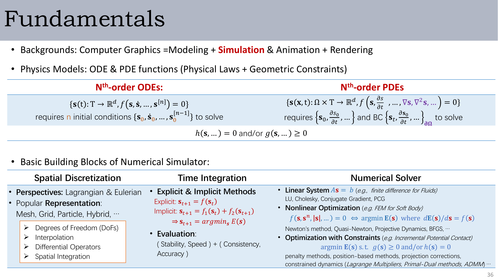
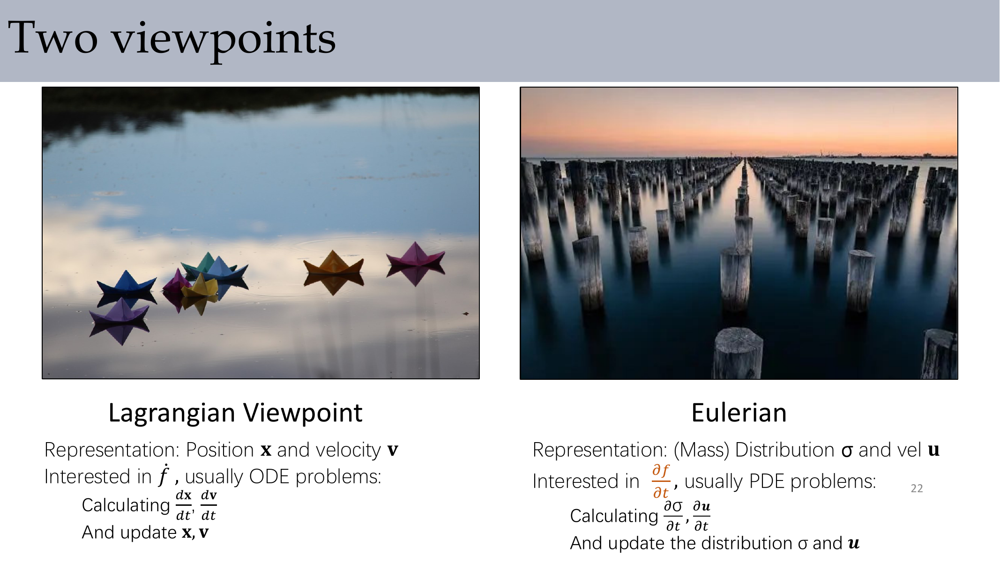
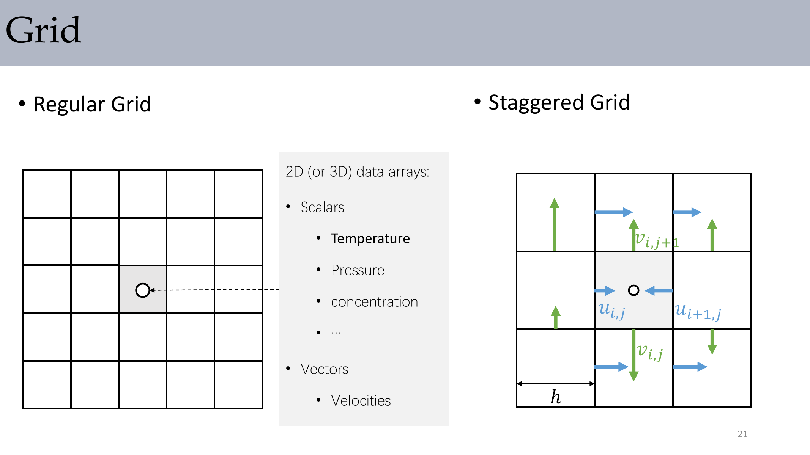
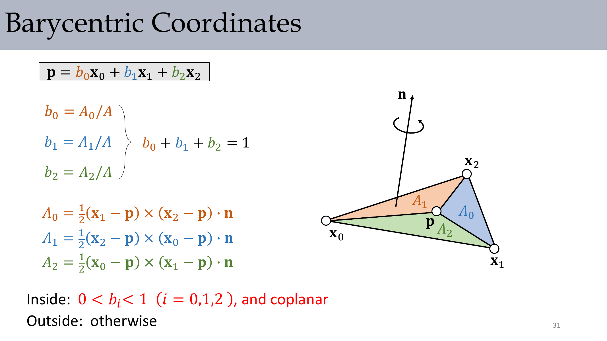
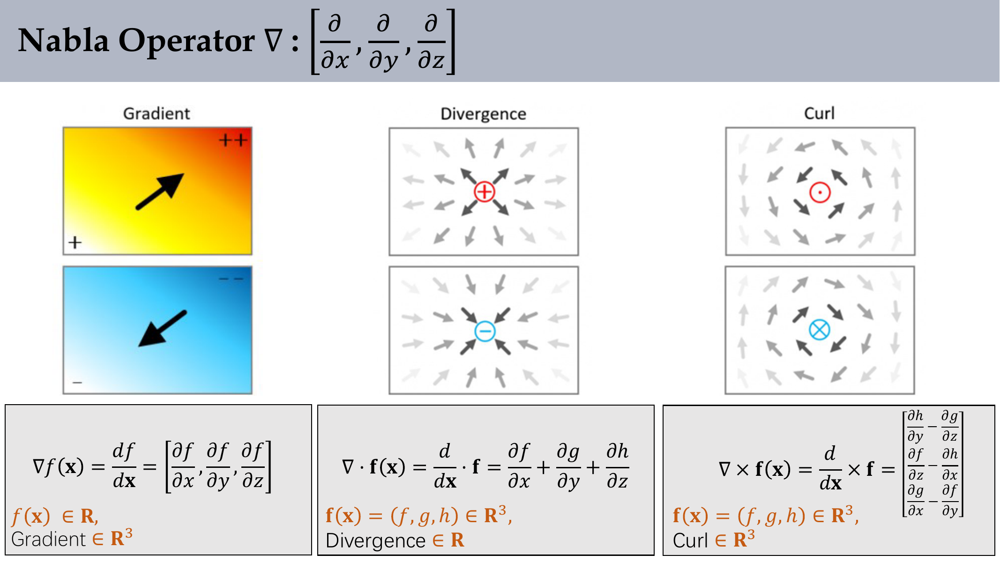
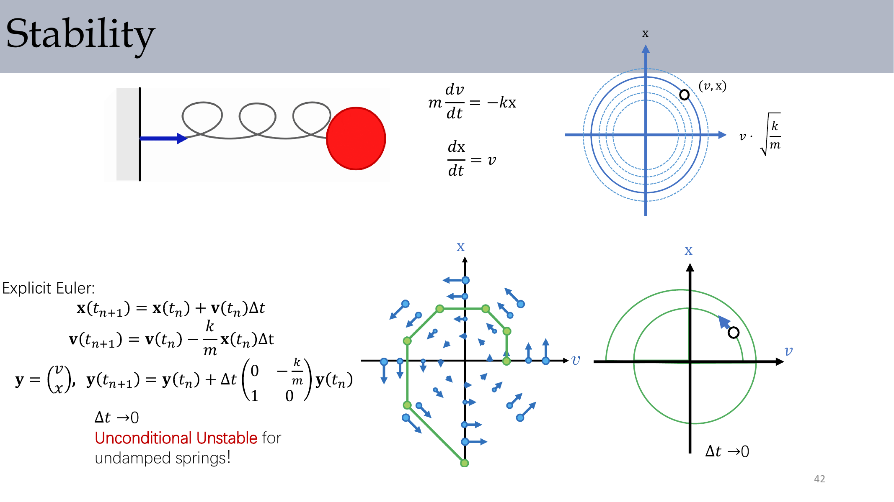
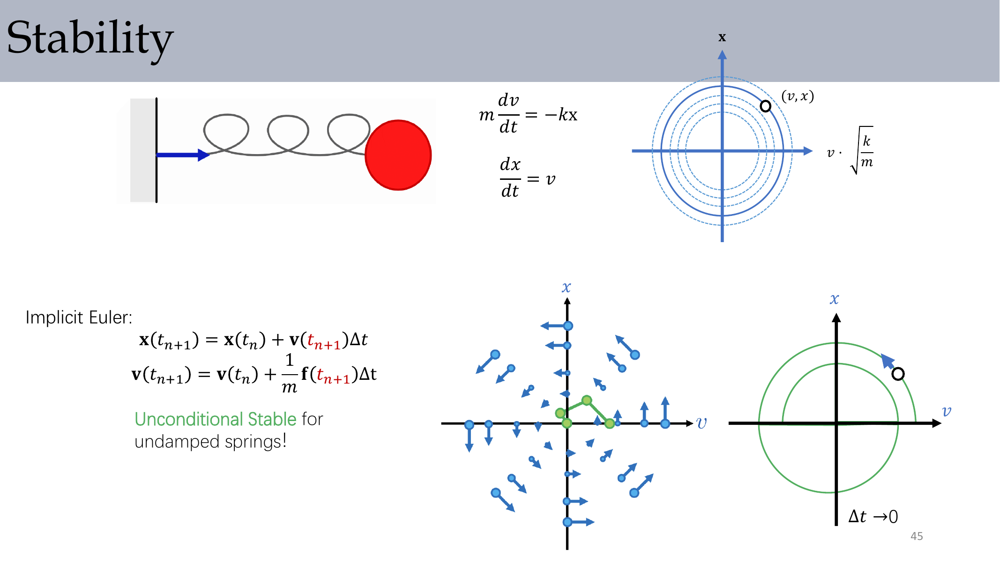

# Lec2 - 物理仿真基础

这一讲把图形学仿真的通用管线完整搭起来：先选物理模型，再做空间离散、时间离散，最后用数值方法求解方程。后面无论是布料、流体、刚体还是形变，基本都在重复这条主线。

## 1. 总体框架

计算机图形学并不只有建模和渲染。现代图形学里很大一部分内容还依赖仿真与动画，因此物理定律、约束和数值方法会变成核心工具。

下面这张总结图可以当作本讲的总导航。

### 1.1 模拟器的三个基本模块

- **数学模型。** 先把控制系统演化的方程写出来，通常来自物理定律加几何约束。
- **空间离散化。** 决定状态如何存进内存，例如粒子、网格、规则网格或混合表示。
- **时间积分。** 用步长 $\Delta t$ 的离散更新去近似连续时间演化。
- **数值求解器。** 对前两步产生的线性或非线性方程组进行求解。

### 1.2 为什么一定要做数值仿真

对单个粒子来说，有些系统存在解析解。比如重力抛体运动可以直接写成

$$ x(t)=v_0\cos\theta\, t,\qquad y(t)=H+v_0\sin\theta\, t-\frac12 g t^2. $$

但一旦系统变成连续介质或大规模耦合系统，解析解通常不存在，或者代价高得无法使用。所以我们必须把物理过程近似成离散状态和数值更新。

## 2. 数学模型：ODE 与 PDE

### 2.1 从粒子到连续场

对单个粒子或物质点，牛顿定律写成

$$ m_p \frac{d^2 \mathbf{x}_p(t)}{dt^2} = \mathbf{f}(\mathbf{x}_p,t). $$

如果把“如何运动”和“为什么运动”拆开看，就会得到本讲反复出现的两个问题：

- **Kinematics: How things move?**
- **Dynamics: Why things move?**

对于速度场中的一个粒子，

$$ \frac{d\mathbf{x}_p(t)}{dt}=\mathbf{v}(\mathbf{x}_p,t),\qquad \frac{d^2\mathbf{x}_p(t)}{dt^2}=\frac{\mathbf{f}(\mathbf{x}_p,t)}{m_p}. $$

### 2.2 两种视角：拉格朗日与欧拉

- **拉格朗日视角。** 跟踪可识别的物质点，状态通常就是位置和速度，所以数学上往往对应 ODE。
- **欧拉视角。** 固定观察空间中的位置，研究密度、压力、速度等场量如何变化，所以数学上往往对应 PDE。

一个很好记的经验是：拉格朗日方法跟着粒子走，欧拉方法跟着分布走。

:::remark 📝 问题：为什么 ODE 通常对应拉格朗日视角，而 PDE 通常对应欧拉视角？
在拉格朗日描述里，一旦粒子身份固定，状态主要只随时间变化，因此普通时间导数就够了。欧拉场则同时依赖空间和时间，所以像 $\nabla u$、$\Delta u$ 这样的空间导数会自然出现，进而形成 PDE。
:::

### 2.3 **n 阶 ODE**

课件给出的通式是

$$ \mathbf{x}^{[n]} = f\!\left(t,\mathbf{x},\dot{\mathbf{x}},\ddot{\mathbf{x}},\ldots,\mathbf{x}^{[n-1]}\right). $$

要解一个 $n$ 阶 ODE，就需要 $n$ 个初始条件：

$$ \mathbf{x}(t_0)=\mathbf{x}_0,\quad \dot{\mathbf{x}}(t_0)=\dot{\mathbf{x}}_0,\quad \ldots,\quad \mathbf{x}^{[n-1]}(t_0)=\mathbf{x}^{[n-1]}_0. $$

一个标准技巧是把高阶 ODE 改写成一阶系统。对于质量-弹簧振子，

$$ m\frac{dv}{dt}=-kx,\qquad \frac{dx}{dt}=v. $$

定义

$$ \mathbf{y}=\begin{bmatrix} v \\ x \end{bmatrix},\qquad A=\begin{bmatrix} m & 0 \\ 0 & 1 \end{bmatrix},\qquad \mathbf{f}(\mathbf{y})=\begin{bmatrix} -kx \\ v \end{bmatrix}. $$

于是系统可以写成

$$ A\dot{\mathbf{y}}=\mathbf{f}(\mathbf{y}),\qquad \dot{\mathbf{y}}=A^{-1}\mathbf{f}(\mathbf{y}). $$

### 2.4 初值问题与边值问题

对 ODE 来说，最常见的是 **初值问题**：所有必须条件都给在同一个时刻 $t_0$。

课件也提醒了一个更麻烦的情形：条件可能分布在不同位置，或者分布在不同时间点上。这种观点会自然连接到 **边值问题**，而边值问题在 PDE 中更是核心。

### 2.5 **偏微分方程（PDE）**

PDE 的特征是：它对多个独立变量求导，通常就是空间和时间。一个典型例子是扩散方程，也就是热方程：

$$ \frac{\partial u}{\partial t}=\frac{\partial^2 u}{\partial x_1^2}+\frac{\partial^2 u}{\partial x_2^2}+\cdots+\frac{\partial^2 u}{\partial x_n^2}=\nabla\cdot\nabla u=\Delta u. $$

PDE 的解不仅由初值决定，还必须配合空间区域上的边界条件。

:::remark 📝 问题：为什么 PDE 特别依赖边界条件？
因为空间导数本身并不能决定区域边界会发生什么。同一个 PDE 在 Dirichlet、Neumann 或混合边界条件下会产生不同解，所以边界行为本身就是模型的一部分，而不是实现细节。
:::

## 3. 空间离散化

### 3.1 常见表示

这一讲强调了三类经典表示。

- **粒子。** 结构简单，也容易追踪时间上的对应关系，但它们不划分空间，因此很多空间查询和积分并不方便。
- **网格。** 很容易把数据贴到运动边界或曲面/体上，但生成网格和重网格都比较困难。
- **规则网格。** 结构规整、计算高效，但不擅长追踪随时间运动的形状，也不擅长处理与网格不对齐的边界。
- **混合表示。** 同时使用多种结构，能继承多方优势，但也要承担结构映射的额外成本。

### 3.2 粒子系统

粒子系统会为每个粒子存质量、位置、速度和力。写成矩阵形式时，我们把所有粒子的状态堆叠成长向量：

$$ \mathbf{x}=\begin{bmatrix}\mathbf{x}_0\\ \vdots\\ \mathbf{x}_{n-1}\end{bmatrix}\in\mathbb{R}^{3n},\qquad \mathbf{v}=\begin{bmatrix}\mathbf{v}_0\\ \vdots\\ \mathbf{v}_{n-1}\end{bmatrix}\in\mathbb{R}^{3n}. $$

质量可以看成堆叠的标量向量 $\mathbf{m}$，也可以写成对角矩阵 $M$，这样牛顿定律就变成

$$ \mathbf{f}=M\frac{d\mathbf{v}}{dt},\qquad \frac{d\mathbf{v}}{dt}=M^{-1}\mathbf{f}. $$

粒子系统通常还要做邻域查询，所以 grid hash、KD-tree 之类的数据结构在工程上几乎是必需品。

### 3.3 网格

网格在顶点上保留了和粒子相同的状态量，但它额外保存了连通关系：

- Triangle list：形如 $(0,1,2)$ 的索引三元组。
- Edge list：唯一化后的顶点对。
- Neighboring triangle list：跨边的三角形邻接信息。

正是这些拓扑信息，让网格特别适合表示曲面、薄壳和四面体实体。

### 3.4 规则网格与交错网格

在规则网格上，温度、压力、浓度等标量通常存放在网格节点或单元上。

在交错网格上，不同速度分量会存放在不同几何位置。以二维 MAC 布局为例，水平速度放在竖直面上，竖直速度放在水平面上。这样做能减少棋盘格伪影，也能让离散散度算子更稳定。

### 3.5 插值

当函数值只在采样点上已知时，插值负责重建单元内部或元素内部的值。

**线性插值（1D）：**

$$ f(t)=(1-t)f_1+t f_2. $$

**双线性插值（2D）：**

$$ f(s,t)=(1-s)(1-t)f_1+s(1-t)f_2+st f_3+(1-s)t f_4. $$

**三线性插值（3D）：**

$$ \begin{aligned} f(s,t,u)=&(1-s)(1-t)(1-u)f_1+s(1-t)(1-u)f_2 \\ &+st(1-u)f_3+(1-s)t(1-u)f_4 \\ &+(1-s)(1-t)u f_5+s(1-t)u f_6 \\ &+stu f_7+(1-s)t u f_8. \end{aligned} $$

### 3.6 重心坐标

对于顶点为 $\mathbf{x}_0,\mathbf{x}_1,\mathbf{x}_2$ 的三角形，任意共面点 $\mathbf{p}$ 都可以写成

$$ \mathbf{p}=b_0\mathbf{x}_0+b_1\mathbf{x}_1+b_2\mathbf{x}_2,\qquad b_0+b_1+b_2=1. $$

课件使用的是面积比形式：

$$ b_0=\frac{A_0}{A},\qquad b_1=\frac{A_1}{A},\qquad b_2=\frac{A_2}{A}. $$

其中带方向的子三角形面积为

$$ A_0=\frac12 \big((\mathbf{x}_1-\mathbf{p})\times(\mathbf{x}_2-\mathbf{p})\big)\cdot \mathbf{n}, $$

$$ A_1=\frac12 \big((\mathbf{x}_2-\mathbf{p})\times(\mathbf{x}_0-\mathbf{p})\big)\cdot \mathbf{n}, $$

$$ A_2=\frac12 \big((\mathbf{x}_0-\mathbf{p})\times(\mathbf{x}_1-\mathbf{p})\big)\cdot \mathbf{n}. $$

它的典型应用包括 Gouraud 着色、纹理映射和碰撞检测。

:::warn ⚠️ 注意
课件把内部判定写成 $0<b_i<1$，其中 $i=0,1,2$。这个条件会把三角形边界排除在外。如果你希望边和顶点也算“在三角形内”，应改成 $b_i\ge 0$，并同时满足 $b_0+b_1+b_2=1$。
:::

### 3.7 微分算子

对一元标量函数 $f(x)\in\mathbb{R}$，

$$ df = \frac{df}{dx}\,dx. $$

对三维标量场 $f(\mathbf{x})\in\mathbb{R}$，其中 $\mathbf{x}=(x,y,z)$，

$$ df=\frac{\partial f}{\partial x}dx+\frac{\partial f}{\partial y}dy+\frac{\partial f}{\partial z}dz=\nabla f(\mathbf{x})\cdot d\mathbf{x}, $$

并且

$$ \nabla f(\mathbf{x})=\begin{bmatrix}\partial f/\partial x \\ \partial f/\partial y \\ \partial f/\partial z\end{bmatrix}. $$

梯度指向函数增长最快的方向，并且与等值线/等值面正交。

若 $\mathbf{f}(\mathbf{x})=[f(\mathbf{x}),g(\mathbf{x}),h(\mathbf{x})]^T\in\mathbb{R}^3$，它的 Jacobian 是

$$ J(\mathbf{f})=\begin{bmatrix}\partial f/\partial x & \partial f/\partial y & \partial f/\partial z \\ \partial g/\partial x & \partial g/\partial y & \partial g/\partial z \\ \partial h/\partial x & \partial h/\partial y & \partial h/\partial z\end{bmatrix}. $$

### 3.8 Nabla、散度、旋度、Hessian 与 Laplacian

Nabla 算子写成

$$ \nabla = \begin{bmatrix}\partial/\partial x & \partial/\partial y & \partial/\partial z\end{bmatrix}. $$

对于标量场 $f$ 和向量场 $\mathbf{u}=(u,v,w)$，

$$ \nabla f=\begin{bmatrix}\partial f/\partial x \\ \partial f/\partial y \\ \partial f/\partial z\end{bmatrix},\qquad \nabla\cdot \mathbf{u}=\frac{\partial u}{\partial x}+\frac{\partial v}{\partial y}+\frac{\partial w}{\partial z}, $$

$$ \nabla\times \mathbf{u}=\begin{bmatrix}\partial w/\partial y-\partial v/\partial z \\ \partial u/\partial z-\partial w/\partial x \\ \partial v/\partial x-\partial u/\partial y\end{bmatrix}. $$

对标量场的二阶导数，

$$ H = J(\nabla f)=\begin{bmatrix}\partial^2 f/\partial x^2 & \partial^2 f/\partial x\partial y & \partial^2 f/\partial x\partial z \\ \partial^2 f/\partial y\partial x & \partial^2 f/\partial y^2 & \partial^2 f/\partial y\partial z \\ \partial^2 f/\partial z\partial x & \partial^2 f/\partial z\partial y & \partial^2 f/\partial z^2\end{bmatrix} $$

而 Laplacian 为

$$ \Delta f=\nabla\cdot\nabla f=\frac{\partial^2 f}{\partial x^2}+\frac{\partial^2 f}{\partial y^2}+\frac{\partial^2 f}{\partial z^2}=\operatorname{trace}(H). $$

热方程中反复出现的正是这个算子。

## 4. 时间积分

### 4.1 从连续动力学到离散更新

连续方程

$$ \frac{d\mathbf{x}_p(t)}{dt}=\mathbf{v}(\mathbf{x}_p,t),\qquad \frac{d\mathbf{v}_p(t)}{dt}=\frac{\mathbf{f}(\mathbf{x}_p,t)}{m_p} $$

在一个时间步上会变成积分关系：

$$ \mathbf{x}_p(t_n)-\mathbf{x}_p(t_{n-1})=\int_{t_{n-1}}^{t_n}\mathbf{v}_p(t)\,dt, $$

$$ \mathbf{v}_p(t_n)-\mathbf{v}_p(t_{n-1})=\frac{1}{m_p}\int_{t_{n-1}}^{t_n}\mathbf{f}(\mathbf{x}_p,t)\,dt. $$

所谓时间积分器，本质上就是一条“如何近似这些积分”的规则。

### 4.2 显式欧拉

课件先从最简单的近似开始：

$$ \mathbf{x}_{n+1}=\mathbf{x}_n+\mathbf{v}_n\Delta t,\qquad \mathbf{v}_{n+1}=\mathbf{v}_n+\frac{1}{m}\mathbf{f}_n\Delta t. $$

它非常便宜，也非常直接，但只有一阶精度，而且可能非常不稳定。

对无阻尼弹簧振子，记 $\omega^2=k/m$，把状态写成 $\mathbf{y}_n=[x_n,v_n]^T$。显式欧拉给出

$$ \mathbf{y}_{n+1}=\begin{bmatrix}1 & \Delta t \\ -\omega^2\Delta t & 1\end{bmatrix}\mathbf{y}_n. $$

它的特征值是 $1\pm i\omega\Delta t$，模长为

$$ \left|1\pm i\omega\Delta t\right|=\sqrt{1+\omega^2\Delta t^2}>1. $$

因此振幅每一步都会放大，这就是课件中“对无阻尼弹簧无条件不稳定”的原因。

:::remark 📝 问题：为什么显式欧拉即使把 $\Delta t$ 取得很小，还是会发散？
更小的 $\Delta t$ 只会让发散变慢，不会从根本上消失。因为更新矩阵的特征值模长依然大于 $1$，所以能量还是会在一步一步迭代中持续向上漂移。
:::

### 4.3 隐式欧拉

隐式欧拉把未知的下一步状态放到右边：

$$ \mathbf{x}_{n+1}=\mathbf{x}_n+\mathbf{v}_{n+1}\Delta t,\qquad \mathbf{v}_{n+1}=\mathbf{v}_n+\frac{1}{m}\mathbf{f}_{n+1}\Delta t. $$

对同一个弹簧系统，

$$ x_{n+1}=x_n+v_{n+1}\Delta t,\qquad v_{n+1}=v_n-\omega^2 x_{n+1}\Delta t. $$

联立求解可得

$$ x_{n+1}=\frac{x_n+v_n\Delta t}{1+\omega^2\Delta t^2},\qquad v_{n+1}=\frac{v_n-\omega^2 x_n\Delta t}{1+\omega^2\Delta t^2}. $$

这个额外的分母会让状态在每一步都被缩小，所以课件才会得出结论：隐式欧拉对无阻尼弹簧是 **无条件稳定** 的，但它也会带来额外的数值阻尼。

代价是：隐式方法必须解方程。在线性问题里，这通常是矩阵求解；在非线性问题里，往往要用 Newton 或 quasi-Newton 迭代。

### 4.4 辛欧拉（半显式欧拉）

辛欧拉把一步更新拆成一个显式子步和一个“看起来像隐式”的子步：

$$ \mathbf{v}_{n+1}=\mathbf{v}_n+\frac{1}{m}\mathbf{f}_n\Delta t,\qquad \mathbf{x}_{n+1}=\mathbf{x}_n+\mathbf{v}_{n+1}\Delta t. $$

它依然很简单，但在 Hamiltonian 系统上通常会比显式欧拉表现更好，因为它对长期能量漂移的控制更自然。

:::tip 💡 理解方式
对振荡系统来说，辛欧拉并不严格守恒能量，但它更倾向于让轨迹停留在一个“变形后的闭轨道”附近，而不是像显式欧拉那样向外螺旋爆炸，或者像隐式欧拉那样阻尼过重。对简谐振子，满足 $\omega\Delta t<2$ 时它会保持有界。
:::

### 4.5 中点法

中点法使用 $t_{n+1/2}$ 时刻的信息：

$$ \mathbf{x}_{n+1}=\mathbf{x}_n+\mathbf{v}_{n+1/2}\Delta t,\qquad \mathbf{v}_{n+1}=\mathbf{v}_n+\frac{1}{m}\mathbf{f}_{n+1/2}\Delta t. $$

一个常见的显式版本会先用半个 Euler 步算出中点：

1. 先用 $\Delta t/2$ 计算中点状态。
2. 再用中点状态完成整步更新。

例如

$$ \mathbf{x}_{n+1}=\mathbf{x}_n+\left(\mathbf{v}_n+\frac{\Delta t}{2m}\mathbf{f}_n\right)\Delta t. $$

它的局部截断误差是 $O(\Delta t^3)$，因此整体上是二阶精度。

:::remark 📝 问题：把 Euler 细分成很多小步，能不能把 Euler 变成高阶方法？
不能。更小的 Euler 子步只会减小误差常数，但方法本身仍然是一阶。真正的高阶来自于对 Taylor 展开中更多项的匹配，而不是简单重复同一个一阶规则。
:::

### 4.6 Runge-Kutta 与 Leap-Frog

课件把中点法放进了 Runge-Kutta 家族里。更具体地说，它就是一个 **二阶 Runge-Kutta 方法**。

经典显式 RK4 会对四次斜率评估做加权平均：

$$ \mathbf{x}_{n+1}=\mathbf{x}_n+\Delta t\left(\frac16\dot{\mathbf{x}}_1+\frac13\dot{\mathbf{x}}_2+\frac13\dot{\mathbf{x}}_3+\frac16\dot{\mathbf{x}}_4\right), $$

$$ \mathbf{v}_{n+1}=\mathbf{v}_n+\Delta t\left(\frac16\dot{\mathbf{v}}_1+\frac13\dot{\mathbf{v}}_2+\frac13\dot{\mathbf{v}}_3+\frac16\dot{\mathbf{v}}_4\right). $$

Leap-Frog 则把速度和位置交错在半步上更新：

$$ \mathbf{v}_{n+1/2}=\mathbf{v}_{n-1/2}+\mathbf{a}(t_n)\Delta t,\qquad \mathbf{x}_{n+1}=\mathbf{x}_n+\Delta t\,\mathbf{v}_{n+1/2}. $$

它每步只需要一次力评估，却仍然具有二阶精度，所以在粒子类和分子类仿真里很常见。

### 4.7 如何评价一个时间积分器

课件给出了四个评价维度。

- **误差 / 截断误差。** Taylor 展开里丢掉了哪些项？
- **稳定性。** 重复迭代时，误差或能量会不会持续增长？
- **收敛性 / 一致性。** 当 $\Delta t\to 0$ 时，数值解会不会逼近精确解？
- **精度与速度。** 单位计算代价究竟换来了多少误差下降？

核心的 Taylor 视角是

$$ f(x+h)=f(x)+f'(x)h+\frac{f''(x)}{2}h^2+\cdots, $$

所以一个 $n$ 阶方法本质上就是保留到 $n$ 阶项，并把更高阶项作为截断误差扔掉。

:::remark 📝 问题：稳定性、收敛性和精度在实际中到底有什么区别？
稳定性关心的是反复迭代会不会放大错误；收敛性关心的是步长缩小时数值解会不会靠近真解；精度关心的是在给定步长下，误差下降得有多快。一个方法即使一致，如果在可承受步长下不稳定，工程上依然不实用。
:::

## 5. 数值求解器

空间和时间都离散完之后，剩下的工作通常就是解代数方程。

- **线性系统。** Jacobi 迭代、Gauss-Seidel、Conjugate Gradient、Multigrid 都是常见工具。
- **非线性系统。** Newton 方法、quasi-Newton 方法、BFGS 都很常见。
- **为什么重要。** 隐式积分、压力投影、形变、接触、约束，最后几乎都会落到一个“求解问题”上。

不存在一个对所有问题都最优的通用求解器。真正决定选择的是结构特征：稀疏性、对称性、条件数、线性/非线性，以及系统规模。

## 6. Exam Review

### 6.1 高价值定义

- **拉格朗日视角。** 跟踪物质点，并随时间更新它们的状态。
- **欧拉视角。** 在固定空间位置上跟踪场量变化。
- **梯度。** 标量场增长最快的方向。
- **散度。** 向量场的净流出密度。
- **旋度。** 向量场的局部旋转趋势。
- **Laplacian。** 梯度的散度；对标量场来说也等于 Hessian 的迹。
- **稳定性。** 数值误差在重复积分下是否保持有界。
- **一致性 / 收敛性。** 当 $\Delta t\to 0$ 时，误差是否趋于零。
- **隐式方法。** 下一步状态出现在更新方程内部，必须通过求解得到。

### 6.2 简答题模板

- **为什么要做空间离散化？** 因为连续介质拥有无限自由度，必须先把它近似成有限个粒子、网格、规则网格或混合结构，才能存储和计算。
- **为什么 PDE 必须配边界条件？** 因为空间导数本身无法决定区域边界的行为。
- **为什么显式欧拉不适合刚性振荡系统？** 因为它只有一阶精度，而且可能无条件不稳定，能量会不断增大而不是保持有界。
- **为什么常用辛欧拉替代显式欧拉？** 因为它几乎一样便宜，但对振荡系统的长期定性行为通常好得多。
- **为什么隐式方法需要求解器？** 因为未知的下一步状态同时出现在方程两边，必须通过线性或非线性求解才能得到。

### 6.3 常见混淆点

- **步长变小并不会自动消除不稳定性。**
- **把 Euler 分成更多子步，并不会改变 Euler 的阶数。**
- **网格和粒子系统可以存相似的顶点数据，但网格额外拥有拓扑。**
- **规则网格与交错网格对向量场的存储布局并不一样。**
- **Laplacian 不是完整的 Hessian，它只是 Hessian 的迹。**

### 6.4 自检清单

- 我能说明什么时候模型会写成 ODE，什么时候会写成 PDE 吗？
- 我能不用表格，直接比较粒子、网格和规则网格的优缺点吗？
- 我能写出线性、双线性、三线性和重心插值公式吗？
- 我能定义 $\nabla f$、$\nabla\cdot \mathbf{u}$、$\nabla\times \mathbf{u}$、$H$ 和 $\Delta f$ 吗？
- 我能从同一组连续方程推导出显式欧拉、隐式欧拉和辛欧拉吗？
- 我能用一句话分别说清楚稳定性、收敛性和精度吗？

