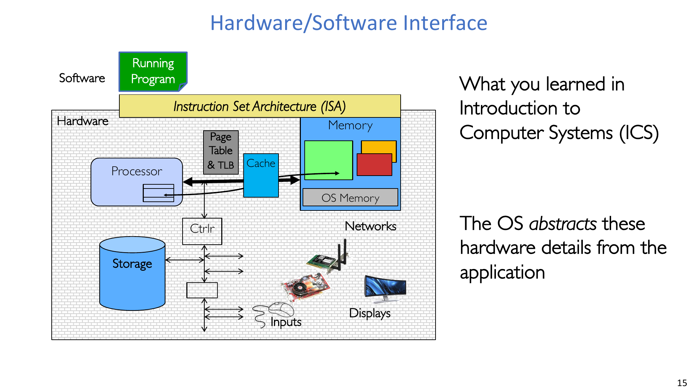
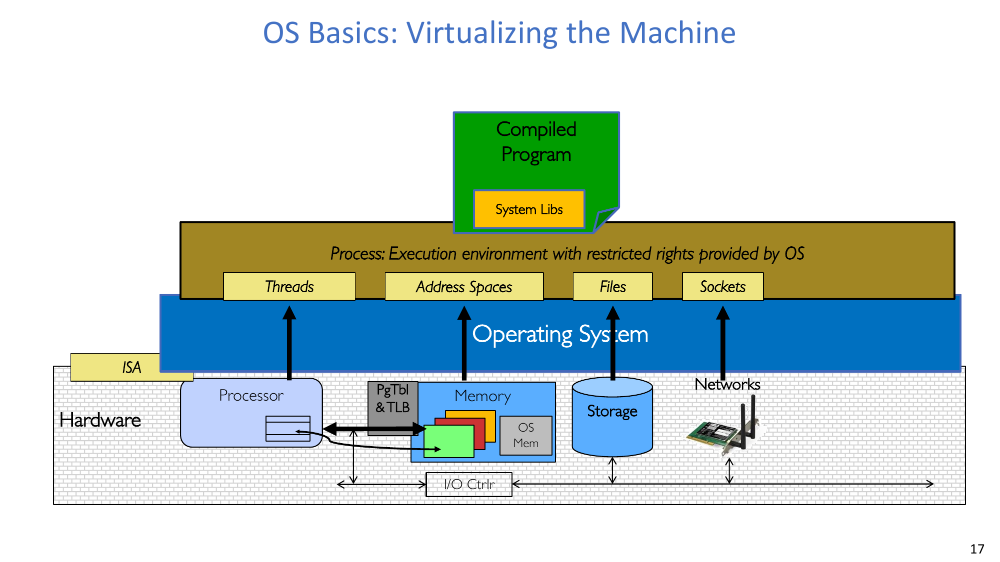
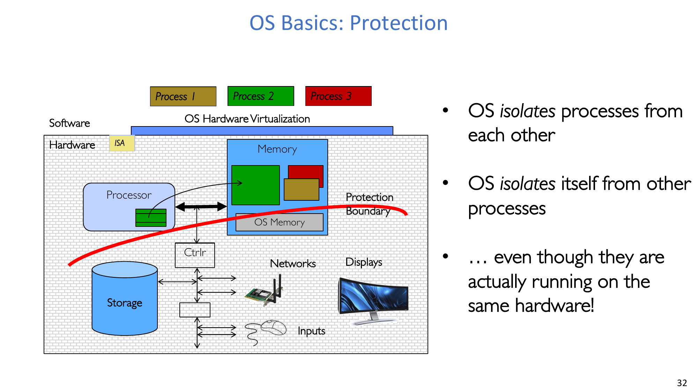
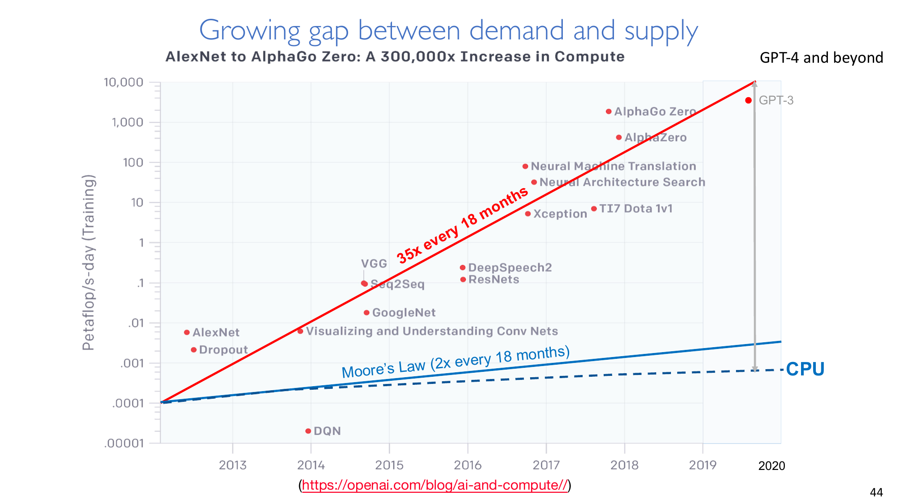
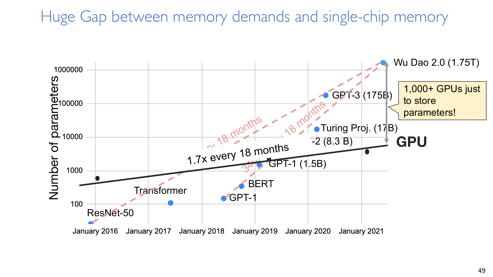
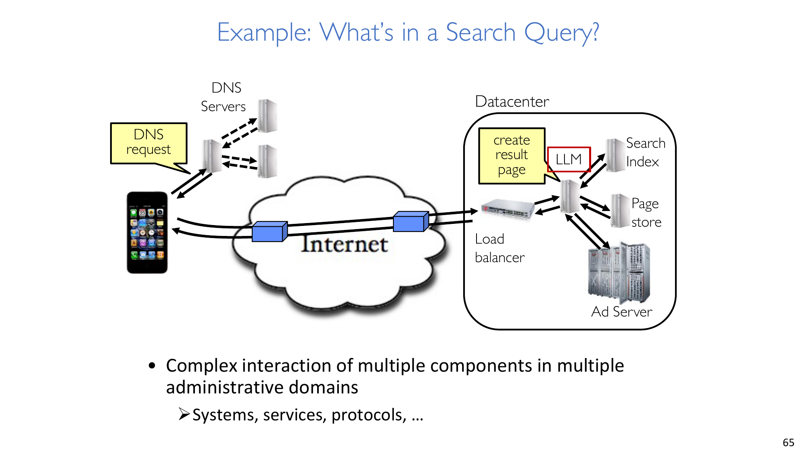

# Lec1 - What Is an Operating System?

## Learning Objectives
After studying this note, you should be able to explain what an operating system is, describe the process abstraction and protection boundary, and reason about why modern workload trends make operating systems both essential and difficult.

## 1. Course Context and Expectations

### 1.1 Infrastructure and study resources
This course runs with a public website, Piazza for Q&A, and regular office hours. The primary textbook is **Operating Systems: Three Easy Pieces (OSTEP)**, with supplementary references from **Operating Systems: Principles and Practice** and **Linux Kernel Development**.

### 1.2 Preparation before heavy labs
You are expected to be comfortable with C programming and debugging. In particular, you should be able to use pointers (including function pointers and `void*`), reason about `malloc/free` and stack-vs-heap behavior, and debug with GDB.

### 1.3 Course goals
The course has three concrete goals:
- It prepares you for advanced study and research in computer systems.
- It helps you understand core OS logic deeply enough to design and implement OS components.
- It trains you to design abstractions and debug large programs, especially multi-threaded programs.

### 1.4 Workload and grading
The workload combines lectures, challenging programming labs, and two exams.

Grading policy:
- Participation: **5%**.
- Programming assignments (5 labs): **30%**.
- Midterm exam: **25%**.
- Final exam: **40%**.

Lab breakdown: **4% + 6.5% + 6.5% + 6.5% + 6.5%**.

The programming sequence uses Pintos and includes a Rust/RISC-V instructional OS track. Labs are individual and include both design documents and code implementation.

### 1.5 Syllabus map
The semester covers OS concepts, concurrency, address spaces, file systems, distributed systems, reliability and security, and cloud infrastructure.

### 1.6 Collaboration policy
You may discuss concepts and general algorithm/testing strategies, but you may not share code or test cases, read other students’ solutions, read online solutions, or upload your own solutions publicly.

:::warn Why this boundary is strict
The policy protects the learning signal of system design and debugging. If implementation artifacts are shared, the course can no longer evaluate individual systems ability fairly.
:::

### 1.7 Communication culture
Piazza is the default channel for technical discussion and feedback. Public discussion is encouraged, anonymous posting is supported, and private posts are available for sensitive feedback.

:::tip Question from the opening section
**Question:** The opening asks: **“What is an Operating System? And – what is it not?”** and **“What makes Operating Systems so exciting?”**

The first question establishes the conceptual boundary of the subject. The second question motivates why this boundary matters in modern systems. The full answers appear in Sections 2 and 5, where we connect definitions to current hardware and workload trends.
:::

## 2. What an Operating System Is

### 2.1 Core definition
A key definition is:

- **“Special layer of software that provides application software access to hardware resources.”**

This layer provides **convenient abstraction**, **protected sharing**, **security/authentication**, and **communication among logical entities**.

### 2.2 Core responsibilities
An OS does three classes of work at the same time:
- It provides abstractions to applications, including file systems, processes/threads, virtual memory/containers, and naming.
- It manages resources, including memory, CPU time, and storage.
- It implements algorithms and mechanisms such as scheduling, concurrency control, transactions, and security.

### 2.3 Hardware/software interface
The operating system sits between applications and hardware details. Applications target OS abstractions instead of directly targeting low-level hardware behavior.

### 2.4 Three roles: Referee, Illusionist, Glue
The lecture frames OS design with three roles:
- **Referee**: manage protection, isolation, and sharing of resources.
- **Illusionist**: provide clean, easy-to-use abstractions of physical resources.
- **Glue**: provide common services such as storage, window system, networking, sharing, authorization, and system look-and-feel.

:::remark Question: “And – what is it not?”
The question asks where OS boundaries end.

An operating system is not just an application UI or a single developer tool. It becomes “OS-level” only when it provides system-wide abstraction, resource coordination, and protection/isolation boundaries across programs.
:::

## 3. Process Abstraction and Virtualization

### 3.1 The machine seen by programs
A central statement is:

- **“Process: Execution environment with restricted rights provided by OS.”**

Each running program executes inside its own process. Therefore, the practical “machine” seen by an application is the process abstraction, not raw hardware.

### 3.2 What is in a process
Another key definition is:

- **“A process consists of: Address Space; one or more threads of control executing in that address space; additional system state associated with it (open files, open sockets, …).”**

### 3.3 OS view across multiple programs
From the OS viewpoint, many processes coexist. The OS translates hardware interfaces into application-facing process interfaces, and each running program gets its own protected execution context.

## 4. Running, Switching, Protection, and Common Services

### 4.1 Running and switching processes
Operating systems run many processes by scheduling CPU time and switching execution context among them.

### 4.2 Protection boundary
Protection is fundamental because two constraints must hold simultaneously:
- Processes must be isolated from one another.
- The OS must be isolated from user processes.

This isolation is maintained even though all processes run on shared physical hardware.

### 4.3 I/O, look-and-feel, and background management
Beyond CPU/memory multiplexing, the OS also provides common I/O services, user-facing system behavior (windowing/look-and-feel), and background managers such as network and power management.

## 5. Why Operating Systems Are Exciting and Challenging

### 5.1 Why this course matters
You may build operating systems directly, build system components that reuse OS ideas, or build applications that depend on OS behavior. In all cases, deeper OS understanding leads to better design decisions.

### 5.2 Moore’s Law and its slowdown
Historically, transistor density scaled as roughly 2x every 2 years, and performance was often discussed as doubling about every 18 months. A critical trend shift is that growth has slowed dramatically, summarized as a move from roughly **2x every 18 months** toward about **1.05x every 18 months**.

### 5.3 Compute demand outpaces general-purpose growth
AI training demand has grown much faster than classical CPU scaling. One cited trend line is roughly **35x every 18 months**, creating a widening demand-supply gap.

### 5.4 Specialized hardware helps but is not sufficient
GPUs, TPUs, and other accelerators are necessary, but not enough by themselves. Even with accelerators, overall system progress is constrained by utilization, orchestration overhead, communication, memory, and software complexity.

### 5.5 Memory demand grows extremely fast
Model parameter counts grow very quickly, with slopes around **40x every 18 months** and **340x every 18 months** shown for different segments. By contrast, single-chip memory growth is much slower (about **1.7x every 18 months** trend line).

This creates a large deployment gap, illustrated by the statement that storing parameters alone can require **1,000+ GPUs** at large model scales.

### 5.6 Other hardware and system trends
Additional trends that shape OS design include:
- Storage capacity continues to grow.
- SSD/flash is expected to dominate over time.
- Network capacity keeps increasing.
- The people-to-computer ratio has shifted to multiple CPUs per person.
- Real systems span huge timescale ranges.

Representative storage data points from the lecture:
- Largest SSD (3.5-inch): **100 TB @ $40K ($400/TB)**.
- Largest HDD (3.5-inch): **18 TB @ $600 ($33/TB)**.
- Example Samsung SSD (2.5-inch): **4 TB @ $380K ($95/TB)**.

### 5.7 Complexity in hardware and software stacks
Modern platforms combine many cores, heterogeneous accelerators, SoC integration, and increasingly large software stacks. Exhaustively testing all device/environment combinations is not feasible. The practical question is not whether bugs exist, but how severe they are and how well they are contained.

### 5.8 Distributed systems are the default environment
Scale-oriented workloads such as LLM training/serving, big-data analytics, and scientific computing are distributed by nature. Internet-scale services combine systems, protocols, and administrative domains into one execution path.

### 5.9 Example: what is in a search query
A single request can involve DNS, datacenter frontends, load balancers, indexing, page stores, ad systems, and model-based ranking components.

:::remark Question set: “How do we tame complexity?”
The question first states the reality: hardware is heterogeneous across CPU ISA, accelerators, memory size, device types, and networking environments.

It then asks four core design questions:
1. **“Does the programmer need to write a single program that performs many independent activities?”**
2. **“Does every program have to be altered for every piece of hardware?”**
3. **“Does a faulty program crash everything?”**
4. **“Does every program have access to all hardware?”**

Concise answers:
- Yes, one program often needs many independent activities, so we need threads/event-driven models and OS scheduling support.
- No, every program should not be rewritten per hardware; this is exactly why OS abstractions and stable interfaces exist.
- No, a faulty program should not crash everything; isolation and fault containment are mandatory.
- No, programs should not access all hardware directly; access must be mediated by the OS for safety, fairness, and correctness.
:::

## 6. Lab 0, Boundaries, and Main Takeaways

### 6.1 Lab 0
Lab 0 focuses on booting Pintos, debugging, and kernel monitor usage. The stated deadline is **February 27, 2025**.

### 6.2 Boundary questions for discussion
You should be able to distinguish:
- Operating systems vs. computer systems vs. system software.
- Operating systems vs. distributed systems vs. networked systems vs. storage systems vs. database systems.

:::remark Discussion questions and concise answers
**Question 1:** What is the boundary between an operating system, computer systems, and system software?

The operating system is a core layer inside the broader computer-systems stack. “System software” is the broader category; OS is the part that directly virtualizes hardware, manages protected resource sharing, and exports fundamental execution abstractions.

**Question 2:** What is the boundary between operating systems and distributed/networked/storage/database systems?

These areas overlap in practice, but OS focuses on local machine abstraction, protection, and resource control, while distributed/networked/storage/database systems focus on cross-machine coordination, data placement, consistency, and service-level behavior.
:::

## 7. Conclusion
Operating systems provide high-level abstractions for diverse hardware, coordinate and protect shared resources, and integrate ideas from languages, data structures, algorithms, and architecture. They are both a practical engineering foundation and a central tool for taming modern system complexity.

## Appendix A. Exam Review

### A.1 Must-know definitions
- **Operating system**: the software layer that abstracts hardware, manages resources, and enforces protection.
- **Process**: an execution environment with restricted rights, including address space, threads, and OS-managed state.
- **Thread**: a schedulable control flow running inside a process.
- **Isolation**: mechanisms that prevent unauthorized interference across processes and between user space and kernel space.
- **Context switch**: saving one execution context and restoring another to share CPU time.

### A.2 Must-remember facts
- Grading weights are 5% participation, 30% labs, 25% midterm, and 40% final.
- The OS role model is **Referee + Illusionist + Glue**.
- AI compute demand growth can far exceed general-purpose compute growth.
- Specialized hardware alone does not remove system bottlenecks.
- Model memory demand can exceed single-chip memory scaling by a large margin.

### A.3 High-value short-answer templates
- **Why do we need process abstraction?**
  Process abstraction gives each program a protected execution environment and hides low-level hardware diversity behind stable interfaces.
- **Why is protection central to operating systems?**
  Protection prevents one program from corrupting others or the kernel, enabling safe sharing, fault containment, and multi-tenant reliability.
- **Why are accelerators not enough by themselves?**
  End-to-end performance depends on memory, communication, scheduling, utilization, and software architecture, not only on raw accelerator throughput.

### A.4 Common mistakes to avoid
- Treating the OS as only a user interface.
- Ignoring isolation when discussing performance.
- Assuming compute scaling automatically solves memory and communication bottlenecks.
- Studying components in isolation without tracing full request paths.

### A.5 Final checklist before exam
1. Can you define OS, process, thread, isolation, and context switch in one sentence each?
2. Can you explain Referee/Illusionist/Glue with one concrete example each?
3. Can you explain why hardware heterogeneity and distributed execution increase complexity?
4. Can you answer all four “How do we tame complexity?” questions without notes?
5. Can you narrate an end-to-end search-query path from client to datacenter services?

:::tip How to use this review
Memorize A.1 and A.2 first, then practice A.3 in writing, and use A.5 as a rapid self-check before the exam.
:::
