# Lec10 - Scheduling 1: Concepts and Classic Policies

## Learning Objectives
After this lecture, you should be able to explain what CPU scheduling is optimizing, compare **FCFS**, **RR**, **Strict Priority**, **SJF**, and **SRTF**, reason about time-quantum tradeoffs with concrete examples, and analyze why optimal average completion time often conflicts with fairness.

## 1. Core Scheduling Question
The scheduler repeatedly answers one question: **Which runnable thread should get the CPU next?**

A simple kernel view is:
1. If the ready queue is not empty, select one thread control block (TCB).
2. Run that thread.
3. Otherwise, run the idle thread.

Scheduling is fundamentally a queue-management problem.

## 2. Assumptions and CPU-Burst Model

### 2.1 Simplifying assumptions
Classical scheduling analysis often starts from simplifying assumptions:
- one program per user,
- one thread per program,
- independent programs.

These assumptions are unrealistic, but they make first-order policy analysis possible.

### 2.2 CPU burst / I/O burst alternation
A standard execution model is that a program alternates between:
- CPU burst,
- I/O burst,
- CPU burst again.

Empirically, CPU-burst length distribution is often **weighted toward short bursts**.

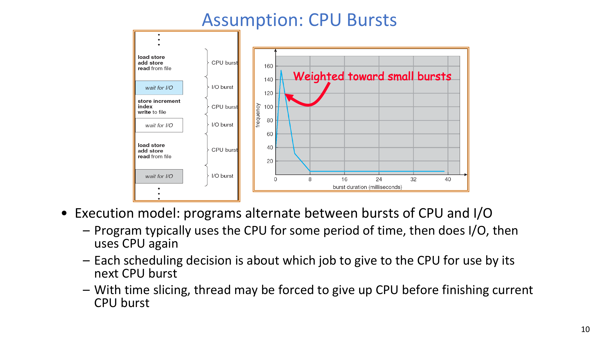

Each scheduling decision typically chooses which job gets CPU for its next CPU burst.

## 3. Scheduling Goals and Criteria
Three common criteria are emphasized:

1. **Minimize Completion Time**
- Reduce elapsed time to finish a job.
- This is visible to users (e.g., keystroke echo delay, compile latency, realtime deadline satisfaction).

2. **Maximize Throughput**
- Maximize completed jobs per second.
- Throughput is related to completion time but not identical.
- Throughput depends on both low overhead (such as context-switch cost) and good resource utilization.

3. **Fairness**
- Share CPU in an equitable way across users/jobs.
- Better average completion time can be obtained by making the system less fair.

:::remark Question: Can one policy maximize completion time, throughput, and fairness at the same time?
Usually no. These objectives pull in different directions. Policies are chosen by workload priorities and service-level goals, not by one universal optimum.
:::

## 4. First-Come, First-Served (FCFS)

### 4.1 Definition and intuition
**First-Come, First-Served (FCFS)** is also called FIFO or “run until done” (in modern terms: run until the thread blocks).

### 4.2 Example 1: arrival order `P1, P2, P3`
Given burst lengths:
- `P1 = 24`
- `P2 = 3`
- `P3 = 3`

Schedule order `P1 -> P2 -> P3` gives:
- waiting time: `P1=0, P2=24, P3=27`
- average waiting time: `(0+24+27)/3 = 17`
- average completion time: `(24+27+30)/3 = 27`

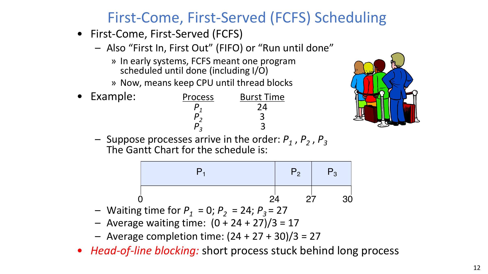

### 4.3 Example 2: arrival order `P2, P3, P1`
Now the order is short-short-long:
- waiting time: `P1=6, P2=0, P3=3`
- average waiting time: `(6+0+3)/3 = 3`
- average completion time: `(3+6+30)/3 = 13`

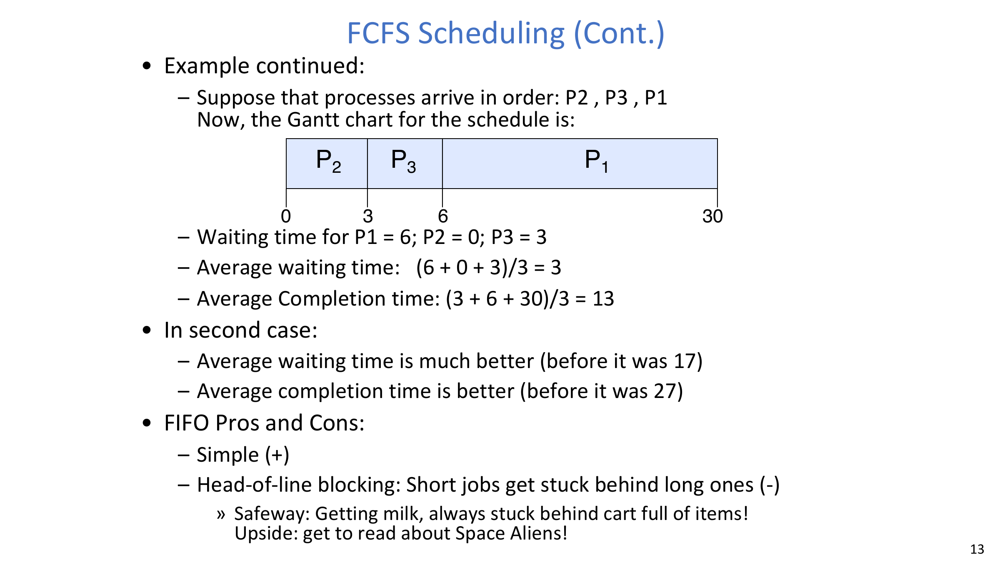

This directly shows **head-of-line blocking**: short jobs suffer when stuck behind a long one.

### 4.4 FCFS pros and cons
- Pros:
  - very simple,
  - low policy overhead.
- Cons:
  - sensitive to arrival order,
  - severe head-of-line blocking for short jobs.

## 5. Round Robin (RR)

### 5.1 Definition
**Round Robin (RR)** adds preemption with time quantum `q`:
1. run each ready process for up to `q` time units,
2. on quantum expiration, preempt and append to the end of ready queue.

For `n` runnable jobs, each job gets about `1/n` CPU share in chunks of at most `q`, and:
- **No process waits more than `(n - 1)q` time units.**

### 5.2 Basic quantum effect
- `q` large => behavior approaches FCFS.
- `q` small => stronger interleaving.
- `q` too small => high switching overhead / fragmented progress.

:::remark Question: How should we choose time slice `q`?
Choose `q` by balancing responsiveness and throughput.
- Too large (or effectively infinite): falls back toward FCFS and hurts waiting latency.
- Too small: spends too much time switching/slicing and hurts throughput.
- A common practical range is about `10ms` to `100ms`, then tune for workload.
:::

### 5.3 RR worked example (`q=20`)
Given:
- `P1=53`, `P2=8`, `P3=68`, `P4=24`

The schedule yields:
- waiting time: `P1=72, P2=20, P3=85, P4=88`
- average waiting time: `66.25`
- average completion time: `104.5`

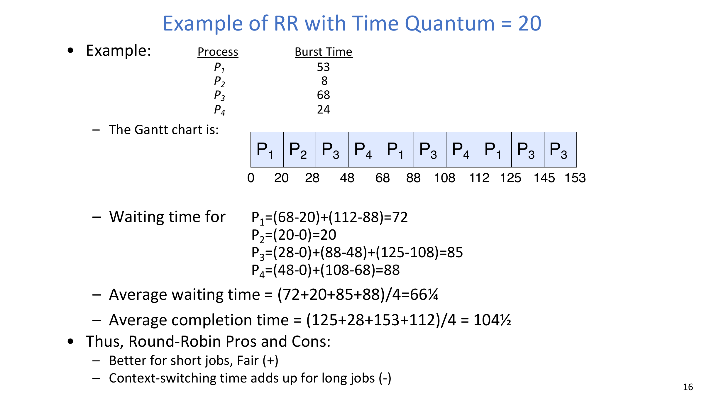

### 5.4 Discussion questions and answers
The lecture raises two key questions:
- Is RR always better than FCFS in average completion time?
- Does a smaller RR quantum always improve average completion time?

:::remark Answers
No to both.
- RR can be worse than FCFS for average completion time under some workloads.
- Smaller `q` can help short jobs in some cases, but can also hurt due to excessive slicing/switching and delayed completion of work chunks.
:::

### 5.5 Concrete quantum counterexamples
Case A (smaller `q` helps):
- `T1=10`, `T2=1`
- `q=10` => average completion `10.5`
- `q=5` => average completion `8.5`

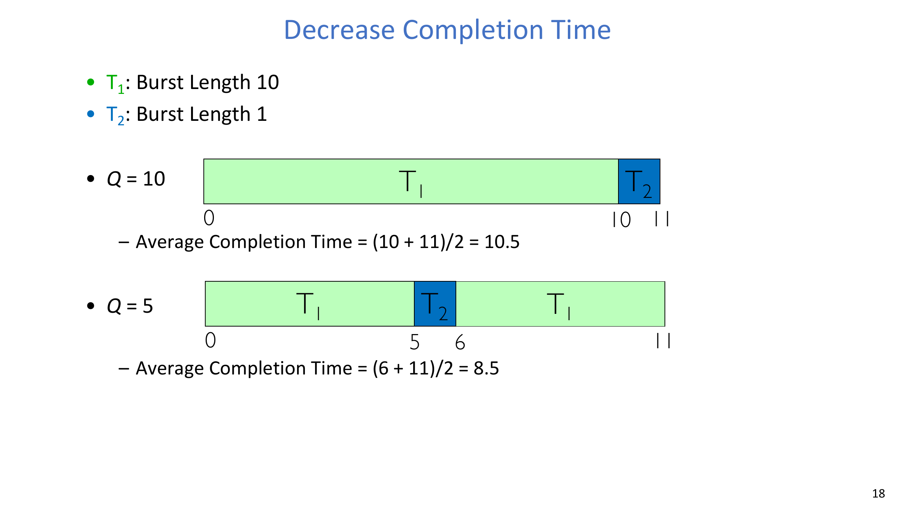

Case B (smaller `q` hurts):
- `T1=1`, `T2=1`
- `q=1` => average completion `1.5`
- `q=0.5` => average completion `1.75`

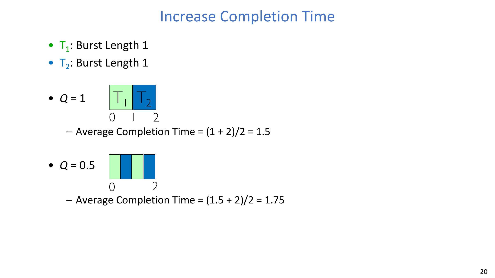

### 5.6 Kernel implementation point
RR implementation keeps a FIFO ready queue and needs timer-interrupt-driven preemption plus careful synchronization around queue and state transitions.

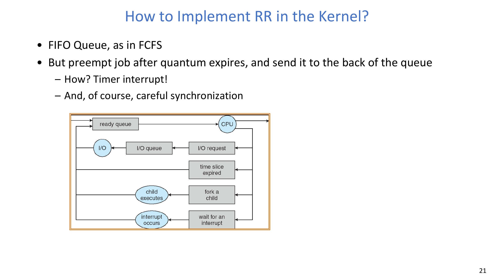

## 6. FCFS vs RR: Stronger Comparison
A useful counterexample assumes zero explicit context-switch cost:
- 10 jobs,
- each job needs 100 seconds CPU,
- RR quantum = 1 second,
- all jobs arrive together.

Then completion-time pattern becomes:
- FCFS: `100, 200, ..., 1000`
- RR: `991, 992, ..., 1000`

So average completion time is much worse under RR even though the overall finish time is the same.

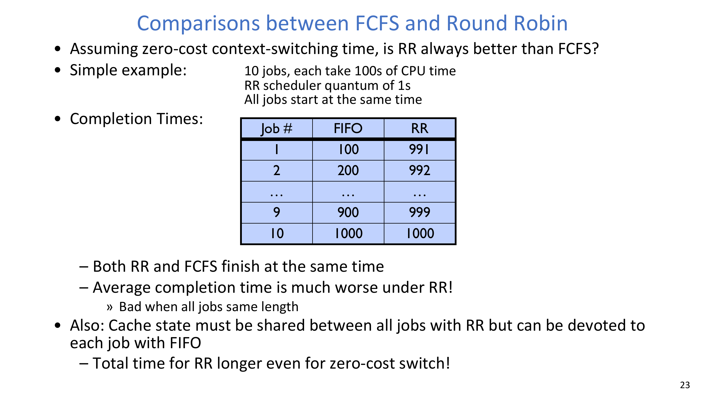

A larger sensitivity table (different quantums and FCFS orderings) reinforces two points:
- best-case FCFS can dominate average waiting/completion for certain mixes,
- RR performance depends strongly on `q` and workload composition.

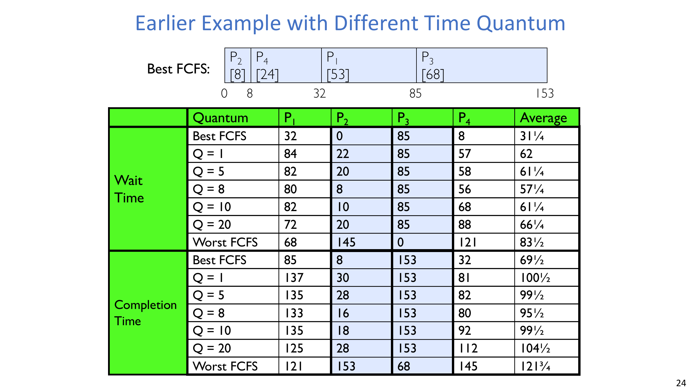

## 7. Strict Priority Scheduling

### 7.1 Policy
**Strict Priority Scheduling** executes the highest-priority runnable queue first (often each queue itself can use RR internally).

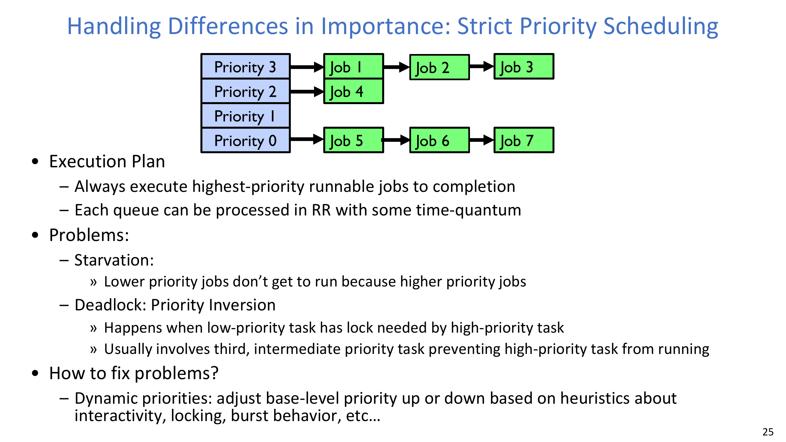

### 7.2 Problems
- Starvation:
  - low-priority jobs may never run.
- Priority inversion:
  - high-priority task waits for a lock held by low-priority task,
  - medium-priority tasks can worsen delay by running in between.

### 7.3 Typical mitigation direction
Dynamic priority adjustment (aging/heuristics based on interactivity, locking behavior, burst behavior) is often used to reduce pathological unfairness.

## 8. Fairness Discussion
Strict fixed-priority ordering across queues is unfair for long-running jobs. Fairness mechanisms typically consider:

1. Allocate each queue a fraction of CPU.
2. Increase priority of jobs that have not received service.

Both approaches have side effects:
- static fractions can mismatch queue lengths,
- aggressive priority boosting can become ad hoc and unstable under overload.

The core tradeoff remains:
- fairness gains can reduce average completion-time optimality.

## 9. If We Knew the Future: SJF and SRTF

### 9.1 Definitions
**Shortest Job First (SJF)**:
- run the job with the smallest total computation demand.
- sometimes called shortest-time-to-completion-first (STCF).

**Shortest Remaining Time First (SRTF)**:
- preemptive SJF: if a newly arrived job has shorter remaining time than the current one, preempt immediately.
- sometimes called SRTCF.

### 9.2 Optimality statement
- SJF is optimal among non-preemptive policies for average completion time.
- SRTF is optimal among preemptive policies for average completion time.
- Since SRTF is at least as good as SJF, SRTF is the stronger reference policy.

### 9.3 Comparison intuition
- If all jobs are same length, SRTF collapses to FCFS behavior.
- If jobs vary, SRTF prevents short jobs from being trapped behind long jobs.

:::remark Question: Could we always imitate the best possible FCFS ordering?
Only if we know future runtimes exactly. In real systems, runtime prediction is imperfect, so this “oracle” ordering is not directly available.
:::

## 10. Example: Why SRTF Helps Interactive/I/O-Bound Work
Workload:
- `A` and `B`: long CPU-bound jobs,
- `C`: I/O-bound loop (`1ms CPU + 9ms disk I/O`).

Qualitative outcomes:
- FCFS can let `A/B` hold CPU too long, reducing `C`’s effective disk utilization (very low in the shown timeline).
- RR with coarse quantum can improve utilization but still cause many wakeups/context interactions.
- SRTF keeps short bursts responsive and can preserve high utilization with cleaner progress.

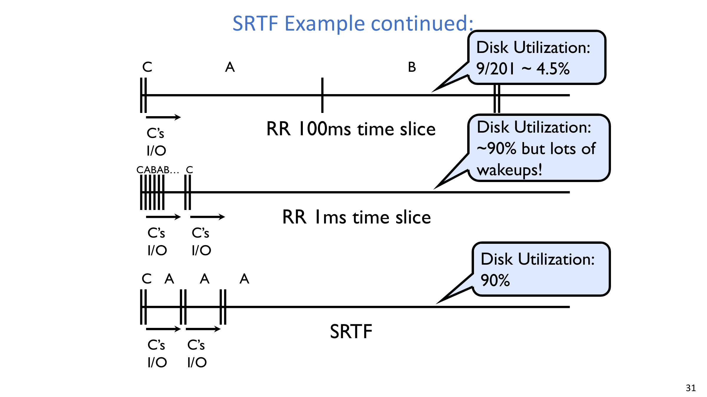

## 11. SRTF Limits and Practical Reality
SRTF has two major practical limits:
1. Starvation risk for long jobs when many short jobs keep arriving.
2. Need for runtime prediction, which is difficult and noisy.

Some systems ask users for expected runtime, but that is gameable and often inaccurate even for honest users.

So in real systems:
- SRTF serves as an important benchmark (yardstick),
- production schedulers usually approximate it while adding fairness controls.

## 12. Key Takeaways
- **FCFS** is simple but suffers head-of-line blocking.
- **RR** improves responsiveness/fairness but depends critically on quantum tuning.
- **Strict Priority** handles importance but risks starvation and priority inversion.
- **SJF/SRTF** are best for average completion time in theory, but rely on hard-to-know future information and can be unfair.
- Practical schedulers are policy compromises shaped by workload and service goals.

## Appendix A. Exam Review

### A.1 Must-remember definitions
- **FCFS**: run in arrival order (typically until block).
- **RR**: preemptive time slicing with quantum `q`.
- **Strict Priority**: always run highest-priority runnable work first.
- **SJF**: choose shortest total job.
- **SRTF**: choose shortest remaining job (preemptive).

### A.2 Quick comparison checklist
- Completion-time optimality:
  - best theoretical: SRTF (then SJF in non-preemptive setting).
- Fairness:
  - strongest baseline fairness: RR (with proper quantum).
- Starvation risk:
  - high in strict priority and SRTF (without safeguards).
- Tuning sensitivity:
  - RR strongly sensitive to quantum.

### A.3 Typical short-answer questions
1. Why is RR not always better than FCFS for average completion time?
2. Why can very small quantum hurt performance?
3. What is head-of-line blocking in FCFS?
4. Why can strict priority cause starvation?
5. Why is SRTF hard to deploy exactly in real systems?

### A.4 Calculation templates
- Waiting time of one process:
  - sum of all waiting intervals before each CPU slice.
- Completion time of one process:
  - finish timestamp minus arrival timestamp.
- Average metric:
  - arithmetic mean over all jobs.

### A.5 Common mistakes
- Assuming RR always improves average completion time.
- Equating throughput maximization with completion-time minimization.
- Ignoring starvation when proposing strict-priority or shortest-first policies.
- Ignoring prediction error when discussing SRTF feasibility.
