# Lec11 - 调度 2：案例研究、公平性、实时性与前向进展

## 学习目标
学完本讲后，你应当能够在具体执行流程中分析饥饿与优先级反转，解释为什么实时调度必须依赖 **EDF** 这类截止期策略，比较 Linux **O(1)** 与 **CFS** 的设计取舍，并根据系统目标选择合适的调度器。

## 1. 回顾：调度始终是权衡问题
CPU 调度依然在平衡同一组核心目标：
- **最小化完成时间**（尤其面向交互型工作负载）。
- **最大化吞吐量**（尤其面向批处理计算）。
- **维持公平性**（保证作业都能推进）。
- **提供可预测性**（尤其面向实时负载）。

经典策略仍是重要参照：
- **FCFS** 简单，但会出现队首阻塞。
- **Round Robin (RR)** 通过时间片改善等待时间公平。
- **严格优先级** 能表达任务重要性，但会导致饥饿与优先级反转。
- **SJF/SRTF** 在平均完成时间上很强，但可能对长作业不公平。

:::remark 问题：是否总能复现“最优 FCFS 排序”？
只有在拥有“未来运行时间预言机”时才可以。真实系统没有完美未来信息，因此实际调度器只能依靠历史与启发式去逼近这个理想。
:::

## 2. 基于历史行为预测未来 CPU Burst
近似最短剩余时间的一种实用方法，是根据历史 burst 估计下一次 burst。

程序在短时间窗口内通常有行为稳定性：
- 如果程序最近主要是 I/O 受限，后续往往仍呈现短 burst。
- 若行为完全随机，历史预测就不会产生价值。

一个标准估计器是 **指数平均**：

$$
\tau_n = \alpha t_{n-1} + (1-\alpha)\tau_{n-1}, \quad 0 < \alpha \le 1
$$

其中：
- $t_{n-1}$ 是上一次真实 burst 长度，
- $\tau_{n-1}$ 是上一次估计值，
- $\tau_n$ 是下一次估计值。

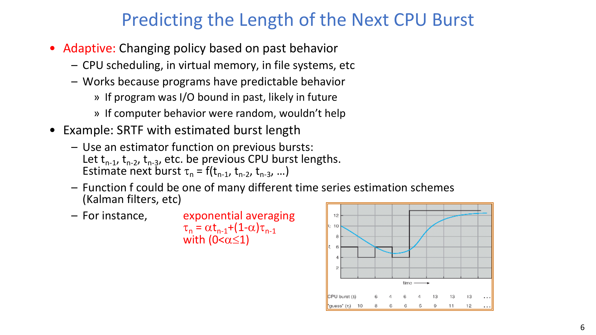

## 3. 彩票调度：随机选择下的比例推进
彩票调度给每个作业分配一定数量的彩票，每个时间片随机抽一张中奖彩票。长期来看，每个作业获得的 CPU 份额与票数成比例。

收益：
- 比例份额直觉清晰。
- 只要每个作业至少一张票，就能自然避免“完全不运行”的饥饿。
- 负载变化时行为更平滑（份额按比例变化，而不是硬队列切断）。

一种分票策略示例是：短作业票多，长作业票少：

| 短作业数 / 长作业数 | 每个短作业 CPU 占比 | 每个长作业 CPU 占比 |
| --- | --- | --- |
| 1 / 1 | 91% | 9% |
| 0 / 2 | N/A | 50% |
| 2 / 0 | 50% | N/A |
| 10 / 1 | 9.9% | 0.99% |
| 1 / 10 | 50% | 5% |

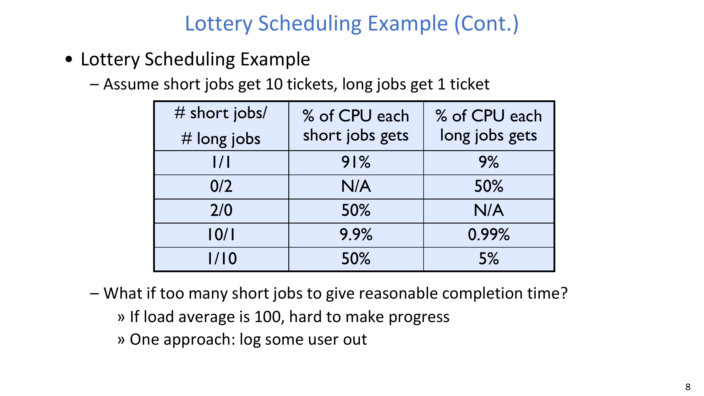

:::remark 问题：如果短作业太多，是否仍能保证合理完成时间？
当系统负载已经很高（例如负载接近 100）时，分票机制无法“创造”额外 CPU 周期。此时需要准入控制、削峰或扩容，而不仅是改调度参数。
:::

一个简化实现使用累积票区间：
1. 计算总票数：
$$
N_{ticket}=\sum_i N_i
$$
2. 随机抽取整数 $d \in [1, N_{ticket}]$。
3. 选择第一个累积票数超过 $d$ 的作业 $j$。

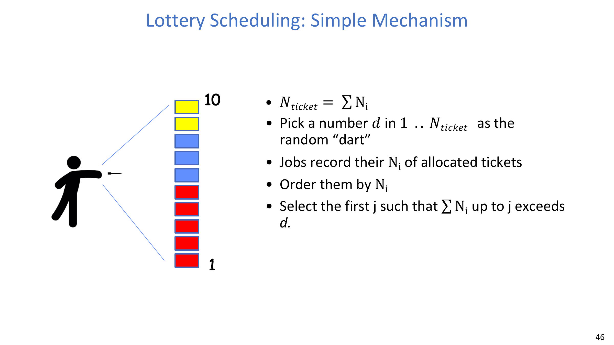

## 4. 多级反馈队列（MLFQ）：把优先级当作动态信号
MLFQ 使用多个不同优先级队列，并且常常让不同队列采用不同调度行为。

典型状态变化过程：
1. 新作业先进入高优先级队列。
2. 若持续用满时间片（CPU-bound），则下调优先级。
3. 若频繁提前让出或休眠（交互/I/O 型），则保持高优先级或上调。

该机制试图在不知道未来信息时逼近 SRTF：
- 长 CPU 作业会逐步下沉。
- 短交互 burst 会停留在高层。

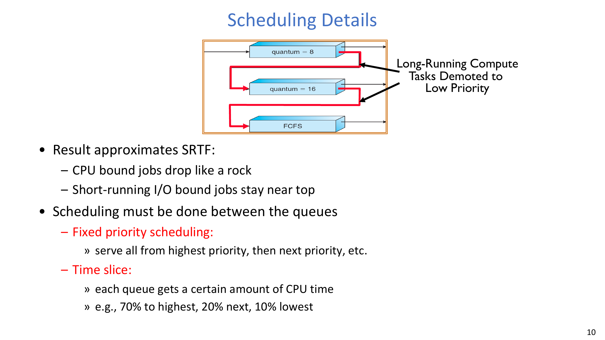

队列间调度常见两种方式：
- **跨队列固定优先级**：总是先跑最高的非空队列。
- **跨队列按份额分配 CPU**：例如按层分 70% / 20% / 10%。

### 4.1 策略被“博弈”
MLFQ 可能被应用“反向利用”：CPU 密集程序可以插入无意义 I/O，让自己看起来像交互任务，从而留在高优先级。

一个经典轶事是 Othello 程序插入额外 `printf`，借此改变调度行为并跑得比对手更快。

:::remark 问题：为什么一旦所有人都这么做，系统反而更差？
因为分类信号失真了。若所有 CPU-bound 程序都伪装成交互型，高优先级队列会被灌满，MLFQ 依赖的区分能力就失效。
:::

## 5. 混合负载与多核效应
真实系统往往同时运行交互应用、吞吐型作业和周期性后台任务。

关键张力包括：
- 观察到短 burst，是否就该给高优先级？
- 服务器、桌面、平板、手机是否应使用同一策略？
- 是否应信任应用自报“我是交互型”？

:::remark 问题：混合负载下应该怎么调度？
调度器应当基于实际运行特征做推断，但也要限制误判影响。工程上通常把启发式分类、公平约束和饥饿保护组合使用。
:::

在多核系统中：
- 算法思想与单核相近。
- 实现上常使用每核就绪队列。
- **CPU 亲和性（affinity）** 尽量让线程回到同一核心，以提升缓存复用。

## 6. 多处理器锁与协同执行影响
### 6.1 自旋锁与 test-and-test-and-set
自旋锁不会让线程睡眠，而是忙等。对于很短等待（如紧耦合并行程序中的 barrier）可能更合适。

基础版本（会产生较强一致性流量）：

```c
int value = 0; // free

void Acquire() {
    while (test_and_set(&value)) { }
}

void Release() {
    value = 0;
}
```

每次 `test_and_set` 都是写操作，锁变量会在各核心缓存间来回迁移。常见改进是 **test-and-test-and-set**：

```c
void Acquire() {
    do {
        while (value) { }          // read-spin
    } while (test_and_set(&value));
}
```

### 6.2 Gang scheduling 与 scheduler activations
对于多线程协同并行程序：
- **Gang scheduling** 尽量让相关线程同时运行，减少空转等待。
- **Scheduler activations** 让 OS 告诉运行时“你当前拿到了多少处理器”，使运行时可自适应并行度。

### 6.3 进程切换与线程切换成本差异
线程切换与进程切换成本并不相同：
- 线程切换：主要保存/恢复寄存器。
- 进程切换：除了寄存器，还要切地址空间，缓存/TLB 扰动更大。

## 7. 实时调度：关注可预测性而非平均值
实时调度关注“是否按时完成”，而不是“平均吞吐是否漂亮”。

- **硬实时**：错过截止期不可接受（安全关键）。
- **软实时**：允许少量超时（如多媒体）。

代表性策略族：
- **EDF**（Earliest Deadline First），
- **RMS**（Rate Monotonic Scheduling），
- **DM**（Deadline Monotonic），
- **CBS**（Constant Bandwidth Server，常见于软实时语境）。

### 7.1 工作负载模型
常见任务模型假设每个任务：
- 可抢占，
- 相互独立，
- 在时间轴上释放到达，
- 可由计算需求 $C$ 与截止期 $D$ 描述。

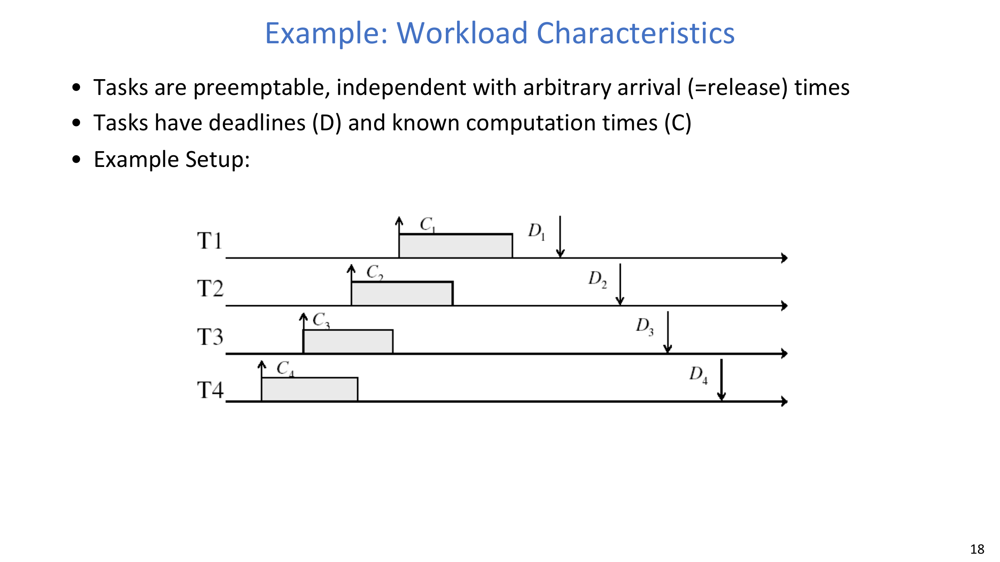

### 7.2 为什么普通 RR 不适合实时截止期
RR 的等待时间公平并不等于截止期可满足。任务依然可能在轮转切片中错过 deadline。

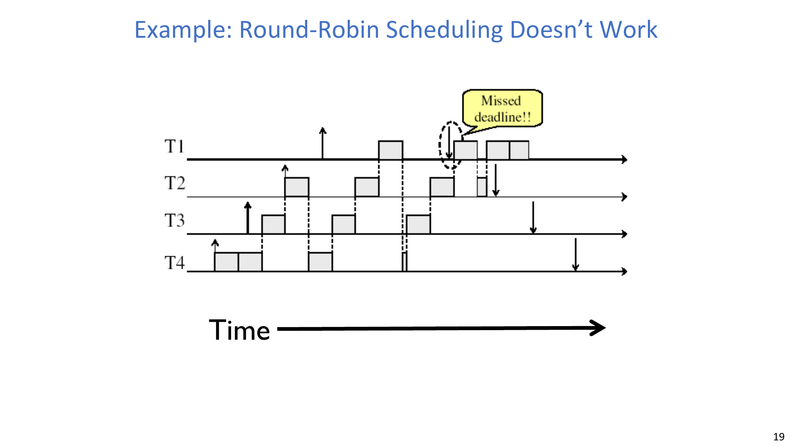

### 7.3 EDF 策略核心
对周期任务 $i$，若周期为 $P_i$、每周期计算需求为 $C_i$，可记为 $(P_i, C_i)$。

绝对截止期按周期推进：

$$
D_i^{t+1} = D_i^t + P_i
$$

**EDF 规则**：始终运行绝对截止期最近的活跃任务。

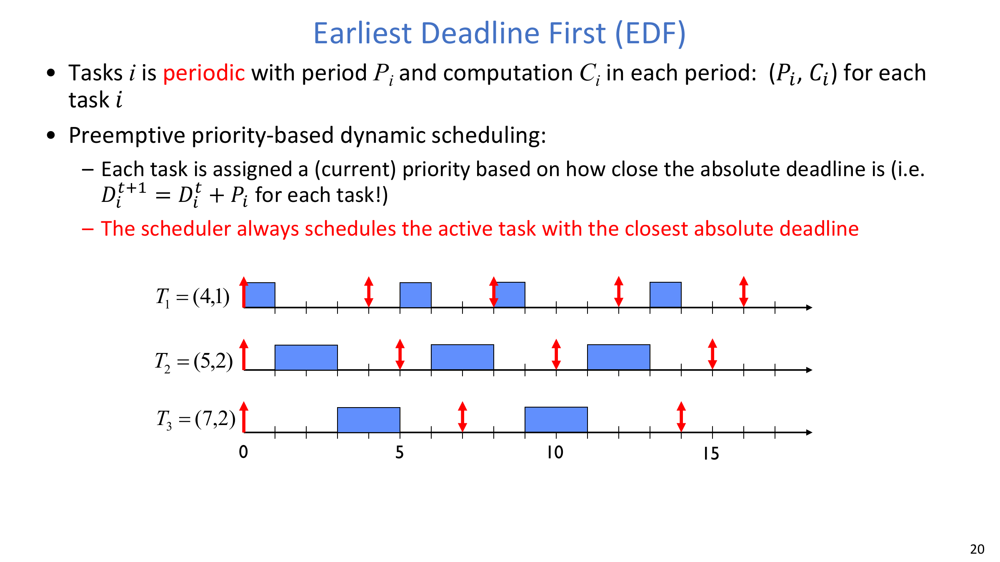

### 7.4 EDF 可调度性判定
一个标准可行条件为：

$$
\sum_{i=1}^{n}\frac{C_i}{D_i} \le 1
$$

例子：

$$
\frac{1}{4} + \frac{2}{5} + \frac{2}{7} = 0.936 \le 1
$$

在该前提下，该任务集可调度。

## 8. 保证前向进展：饥饿与优先级反转
### 8.1 饥饿与死锁的区别
- **饥饿**：线程在无界时间内得不到推进。
- **死锁**：资源请求形成环路，导致无法继续。

两者表现都可能是“系统卡住”，但机制不同。

### 8.2 Work-conserving 假设
**Work-conserving 调度器** 在有可运行任务时不会让 CPU 空闲。非 work-conserving 策略会非常容易导致饥饿，因此通常只在显式设计场景下使用。

### 8.3 不同策略下的饥饿风险
- **LCFS/LIFO** 在到达率高于服务率时，会让早到任务长期挤压。
- **非抢占 FCFS** 若某任务不让出 CPU，其他任务会被拖死。
- **RR** 能给出轮转等待上界（但不保证吞吐公平）。
- **严格优先级** 可让低优先级任务无限期饥饿。

### 8.4 优先级反转流程
典型三任务流程：
1. 低优先级 `Job 1` 先拿到锁。
2. 高优先级 `Job 3` 执行 `Acquire()` 后阻塞。
3. 中优先级 `Job 2` 持续运行，压制 `Job 1`。
4. `Job 3` 间接被中优先级“饿住”。

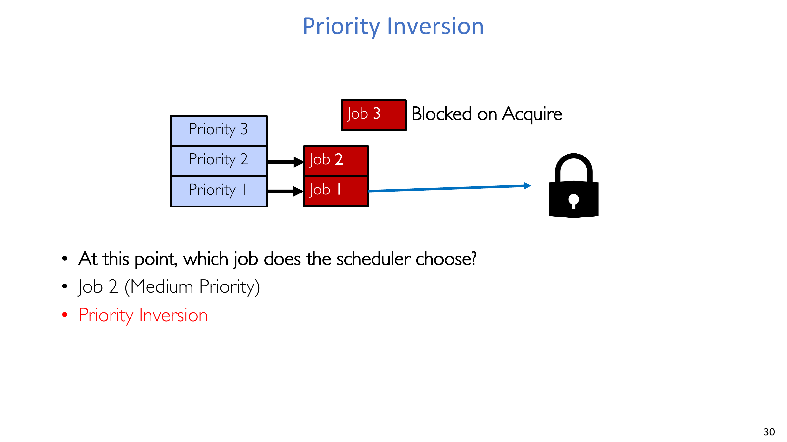

### 8.5 优先级捐赠 / 继承
常见修复是临时优先级传递：
- 被阻塞的高优任务把优先级捐赠给锁持有者，
- 锁持有者尽快运行并释放锁，
- 随后撤销临时优先级。

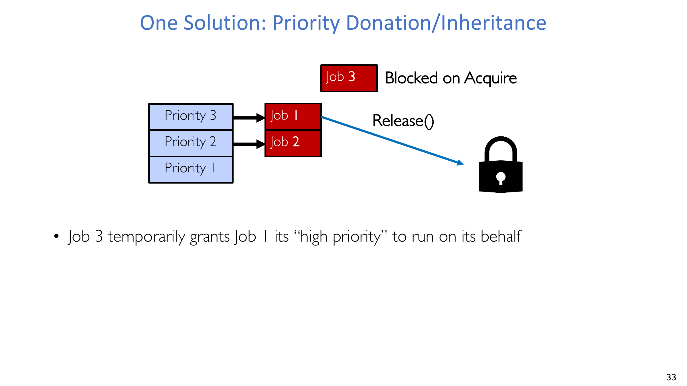

:::remark 问题：在阻塞点，不启用 donation 时严格优先级会选谁？
会选可运行的中优先级任务，这会加剧反转。启用 donation 后，锁持有者会被抬升，从而更快完成临界区并释放锁。
:::

### 8.6 Live-lock 边界问题
优先级与忙等模式也会产生糟糕组合：
- 高优先级线程若执行 `while (try_lock) {}`，会强烈占用 CPU。
- 低优先级锁持有者拿不到运行机会，无法释放锁。
- 系统看似“在运行”，但有效工作几乎不推进（活锁特征）。

:::remark 问题：还有哪些场景会让优先级导致饥饿或活锁？
凡是“高优先级反复抢占了真正需要运行来释放资源的线程”的模式，都可能触发此问题。常见缓解手段是锁感知调度、限制自旋、以及继承/捐赠机制。
:::

### 8.7 Mars Pathfinder 案例
火星探路者任务曾在 VxWorks 上因优先级反转出现反复复位：
- 低优先级任务持有高优先级数据分发任务所需互斥锁。
- 中优先级任务插入执行，延迟锁释放。
- 看门狗检测到前向进展缺失，触发系统复位。

最终线上修复是重新开启 **priority inheritance**（此前因性能顾虑被关闭）。

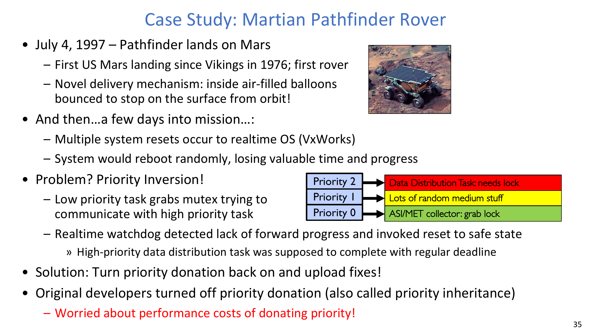

### 8.8 SRTF 与 MLFQ 的饥饿风险
- SRTF 在短作业持续到达时会压制长作业。
- MLFQ 近似 SRTF，因此会继承类似的饥饿压力。

## 9. 系统环境变化下的调度演进
调度策略的演进与硬件/负载变化强相关：
- 分时时代：机器稀缺，强调优先级复用资源。
- PC/工作站时代：更强调公平与避免极端情况。
- Web/数据中心时代：更强调可预测性与尾延迟（如 95 分位目标）。

这也是现代调度器往往综合“公平 + 启发式 + 负载自适应”，而不是只靠刚性固定优先级的原因。

## 10. Unix nice 与 Linux O(1) 调度器
### 10.1 Unix `nice`
Unix 通过 `nice` 值（`-20` 到 `19`）向用户暴露优先级调节：
- `nice` 越低，越“不给别人让路”（更受调度偏好）。
- `nice` 越高，有效优先级越低。

### 10.2 Linux O(1) 调度器结构
关键点：
- 共 140 个优先级层级。
- 用户任务与实时/内核任务映射到不同区间。
- 依靠位图与分优先级队列实现核心操作常数时间。
- 维护 **active** 与 **expired** 两组队列，active 用尽后交换。

### 10.3 O(1) 启发式与实时类
O(1) 使用了较多启发式：
- 基于 `sleep_avg` 的交互性估计，
- interactive credit 防止交互属性频繁抖动，
- 面向饥饿风险的优先级提升。

实时类包括：
- `SCHED_FIFO`：可抢占，且同优先级内无固定时间片上限。
- `SCHED_RR`：可抢占，且同优先级内 RR 轮转。

## 11. 比例份额与 Linux CFS
### 11.1 比例份额思路
与其用绝对优先级，不如按权重分配 CPU 份额，使每个作业都能推进。

### 11.2 CFS 核心机制
Linux CFS 跟踪每个线程的 CPU 时间，优先选择虚拟运行时间最小者，逼近理想公平处理器。

实现要点：
- 类堆运行队列，
- 插入/删除约为 $O(\log N)$，
- 休眠线程不会积累运行时间，唤醒后天然更易被调度。

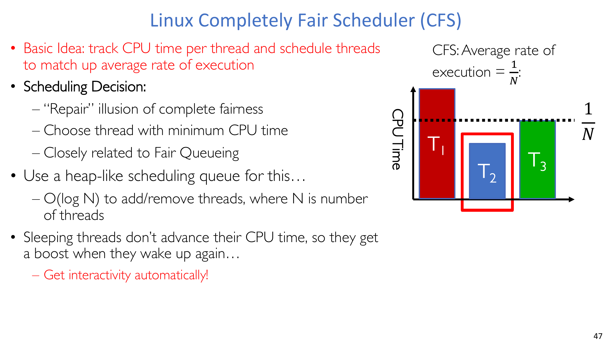

### 11.3 响应性约束
两个关键约束：
1. **Target latency**：期望每个可运行进程都在该时间窗内获得服务。
2. **Minimum granularity**：单次时间片下界，用于避免过度切换。

示例：
- 目标延迟 20ms、4 个进程时，每个约 5ms。
- 目标延迟 20ms、200 个进程时，每个约 0.1ms（切换开销风险很高）。
- 若设置最小粒度 1ms，则 100 进程场景可被钳制为 1ms 片长。

### 11.4 CFS 的加权份额公式
等份基线：

$$
Q_i = \text{TargetLatency}\cdot\frac{1}{N}
$$

加权份额：

$$
Q_i = \left(\frac{w_i}{\sum_p w_p}\right)\cdot\text{TargetLatency}
$$

CFS 按指数关系把 `nice` 映射为权重：

$$
\text{Weight} = \frac{1024}{(1.25)^{\text{nice}}}
$$

因此两个 CPU-bound 任务若 `nice` 相差 5，权重大约相差 $\approx 3\times$。

## 12. 如何选择并评估调度器
### 12.1 目标到策略的映射
实用映射如下：

| 你最关心 | 推荐策略 |
| --- | --- |
| CPU 吞吐量 | FCFS |
| 平均完成时间 | SRTF 近似策略 |
| I/O 吞吐量 | SRTF 近似策略 |
| 公平性（CPU 时间） | Linux CFS |
| 公平性（等待获得 CPU 时间） | Round Robin |
| 满足截止期 | EDF |
| 偏向重要任务 | Priority |

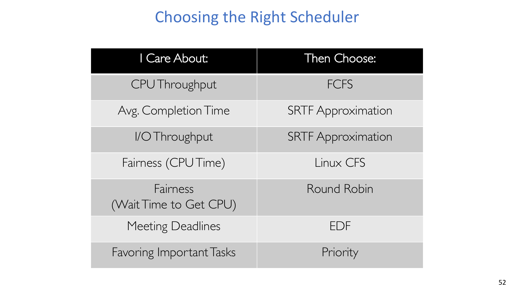

### 12.2 如何评估调度算法
三类标准方法：
- **确定性建模**：给定固定负载，计算比较结果。
- **排队模型**：用随机模型做数学分析。
- **实现/仿真**：在实际数据或 trace 上跑真实算法，通常最灵活。

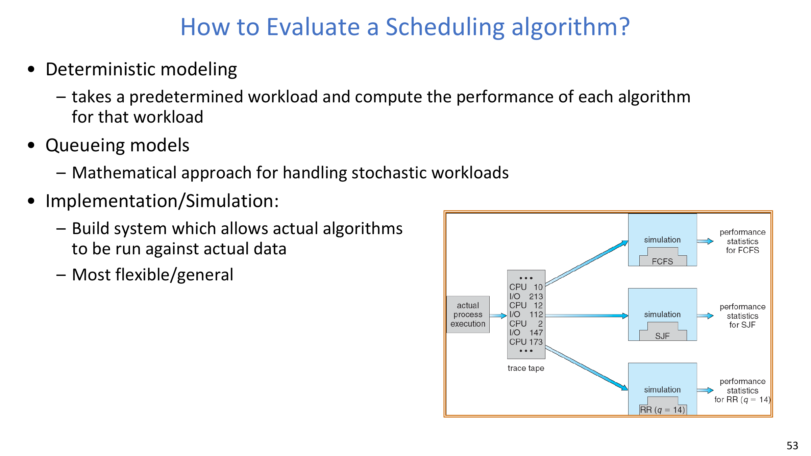

## 13. 最后一个工程视角：策略优化与扩容
调度细节在资源紧张时最重要。

一个实用运维结论：
- 当利用率逼近 100% 时，响应时间可能急剧发散。
- 多数调度器在线性负载区表现都还可以，但在饱和区会同时失效。
- 当系统到达“拐点（knee）”时，扩容往往比继续微调策略更有效。

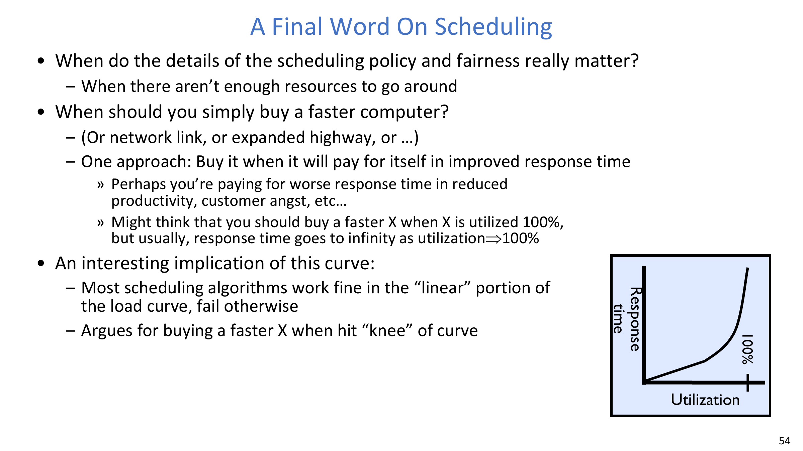

:::remark 问题：何时该调策略，何时该买更快硬件？
只要系统还存在可回收的调度低效，就先调策略；但当系统接近饱和、排队时延主导性能时，扩容 CPU/网络/存储通常会带来更大且更稳的收益。
:::

## 14. 关键结论
- **可预测性** 是实时系统的一等公民需求，公平本身不够。
- **优先级反转** 是真实可复现的前向进展故障，而非理论边角问题。
- **优先级捐赠/继承** 是经过工程验证、能够挽救真实任务的机制。
- **CFS** 把调度重构为“公平速率跟踪 + 响应性/吞吐约束”。
- 没有任何单一调度器能在所有指标上取胜，策略必须匹配负载与目标。

## 附录 A. Exam Review

### A.1 必背定义
- **饥饿（Starvation）**：推进延迟无上界。
- **死锁（Deadlock）**：环形等待导致无法推进。
- **优先级反转（Priority Inversion）**：高优先级任务被低优先级锁持有者间接阻塞，并被中优先级任务进一步延迟。
- **EDF**：始终调度绝对截止期最近的任务。
- **CFS**：通过虚拟运行时间跟踪近似公平 CPU 份额。

### A.2 快速选型清单
1. 需要硬截止期保证 -> 选 EDF 类实时调度。
2. 需要强等待时间公平 -> 选 RR 或 RR 风格切片。
3. 需要比例 CPU 公平 -> 选 CFS/比例份额策略。
4. 需要任务重要性分级 -> 选优先级调度并加入防饥饿保护。

### A.3 必记公式
- Burst 预测：
$$
\tau_n = \alpha t_{n-1} + (1-\alpha)\tau_{n-1}
$$
- EDF 可行性：
$$
\sum_{i=1}^{n}\frac{C_i}{D_i}\le1
$$
- CFS 等份时间片：
$$
Q_i=\text{TargetLatency}/N
$$
- CFS 加权时间片：
$$
Q_i=\left(\frac{w_i}{\sum_p w_p}\right)\cdot\text{TargetLatency}
$$
- nice 到权重映射：
$$
\text{Weight}=1024/(1.25)^{\text{nice}}
$$

### A.4 常见简答题
1. 为什么 RR 无法直接保证实时截止期？
2. 请按步骤解释优先级反转是如何发生的。
3. 为什么优先级捐赠能恢复前向进展？
4. 为什么 CFS 同时需要 target latency 和 minimum granularity？
5. 为什么 SRTF/MLFQ 仍可能让长作业饥饿？

### A.5 常见误区
- 把“公平”误当成“能满足截止期”。
- 在分析优先级系统时忽略锁持有者的调度机会。
- 误以为比例份额策略在过载下也能消除全部时延问题。
- 忽略接近 100% 利用率时排队时延会压倒策略微调收益。
