# Lec12 - 调度 3：调度与死锁

## 学习目标
学完本讲后，你应当能够解释为什么死锁是严重的“无法前向进展”问题，使用资源分配图建模资源依赖，运行向量化死锁检测与安全性检查，并在工程中比较预防、恢复、避免与忽略四类策略。

## 1. 回顾：与进展直接相关的调度知识
### 1.1 实时调度与 EDF
实时调度的核心目标是 **性能可预测性（predictability of performance）**，而不只是平均速度高。对于硬实时系统，错过截止期通常不可接受，因此系统应尽量在执行前就完成可行性判断与准入控制。

周期任务可写为 $(P_i, C_i)$，其中 $P_i$ 是周期，$C_i$ 是每个周期所需计算量。EDF 下绝对截止期按下式推进：

$$
D_i^{t+1} = D_i^t + P_i
$$

调度规则是：**始终运行绝对截止期最近的活跃任务**。

### 1.2 前向进展与饥饿背景
前向进展分析仍然离不开饥饿语境：
- **LCFS、FCFS、严格优先级、SRTF、MLFQ** 在某些负载下都可能让部分作业饥饿。
- **优先级反转** 是典型进展故障：高优先级作业被低优先级锁持有者间接阻塞，同时中优先级作业持续运行。

:::remark 问题：在优先级反转的阻塞点，严格优先级调度会选哪个作业？
它会选择**可运行的中优先级作业**，而不是被阻塞的高优先级作业。这也是为什么不引入 donation/inheritance 时，反转可能长期持续。
:::

### 1.3 公平性策略回顾
进入死锁主题前，还要记住两点：
- 比例份额调度会按份额分配 CPU；只要每个作业份额非零，就能避免“完全得不到运行”。
- Linux CFS 通过最小虚拟运行时间优先，逼近公平共享。

一个实用的目标到策略映射如下：

| 目标 | 常见选择 |
| --- | --- |
| CPU 吞吐量 | FCFS |
| 平均完成时间 | SRTF 近似 |
| I/O 吞吐量 | SRTF 近似 |
| 公平性（CPU 时间） | Linux CFS |
| 公平性（等待获得 CPU） | Round Robin |
| 满足截止期 | EDF |
| 偏向重要任务 | Priority scheduling |

## 2. 从饥饿到死锁
必须先做精确定义区分：
- **Starvation（饥饿）**：线程无限期等待，是否最终恢复并不确定。
- **Deadlock（死锁）**：线程因资源形成环形等待；没有外部干预时无法恢复进展。

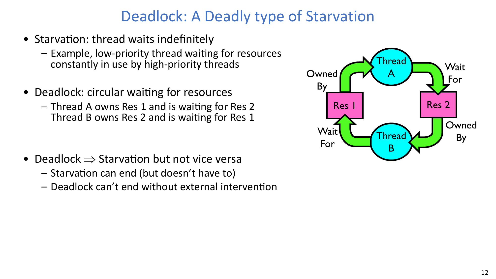

关键关系：
- **Deadlock implies starvation**，因为总有线程会无限等待。
- **Starvation does not necessarily imply deadlock**，因为调度条件变化后，饥饿线程仍可能继续执行。

:::remark 问题：为什么饥饿可能结束，而死锁通常不会自行结束？
饥饿能否结束取决于未来调度是否“照顾”到等待线程；死锁中每个等待线程都依赖另一个等待线程，构成闭环，因此常规执行无法打破该环。
:::

## 3. 运行示例：单车道桥梁通行
桥梁示例把物理通行映射为资源申请：
- 每一段道路都可看作资源。
- 车辆必须持有当前路段，并在前进前获得下一路段。
- 在狭窄桥面上，两个方向竞争有限路段资源。

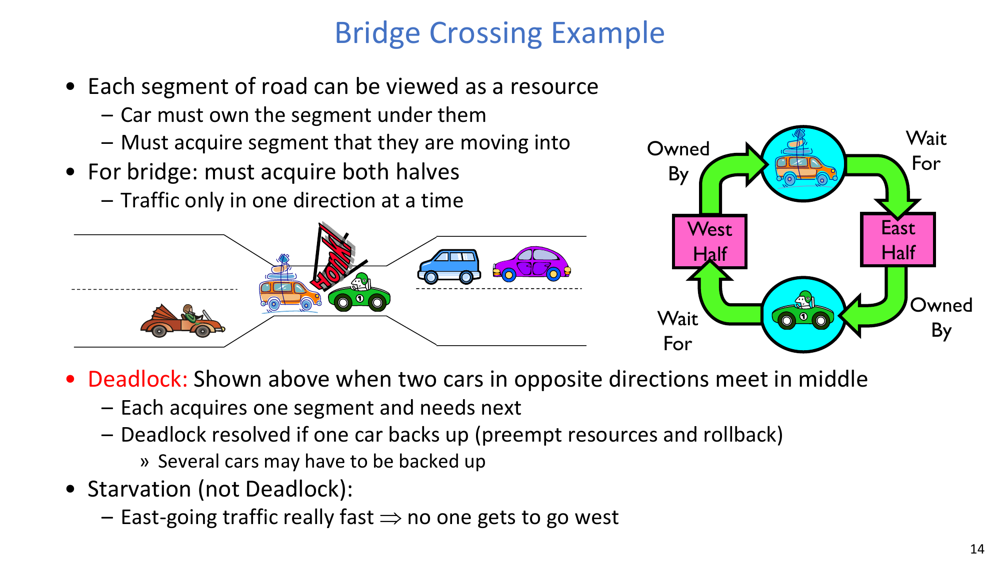

若两辆车从相反方向进入，各自占有一半并请求另一半，就会进入死锁。若让一方倒车（带有回滚/抢占味道），则可以打破环路。

该示例也能清楚区分死锁与饥饿：
- 死锁：双向互等。
- 饥饿：一侧长期优先通过，另一侧等待很久，但并非必然永久等待。

## 4. 锁上的死锁：为什么它是非确定性的
考虑两个线程与两个锁：
- Thread A: `x.Acquire(); y.Acquire(); ... y.Release(); x.Release();`
- Thread B: `y.Acquire(); x.Acquire(); ... x.Release(); y.Release();`

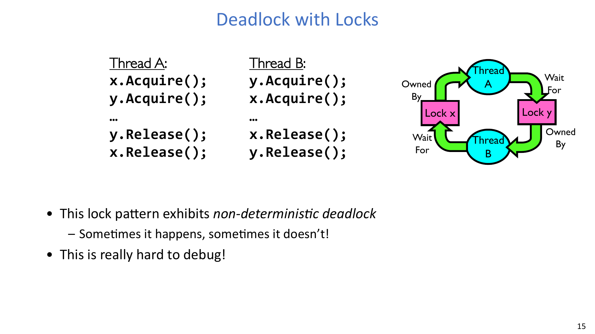

该模式是**非确定性**的：
- 在不走运调度中，两个线程各拿一把锁，并在第二把锁上永久阻塞。
- 在走运调度中，某一线程先拿到两把锁并完成，系统不会死锁。

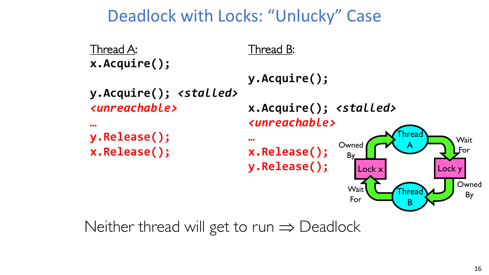

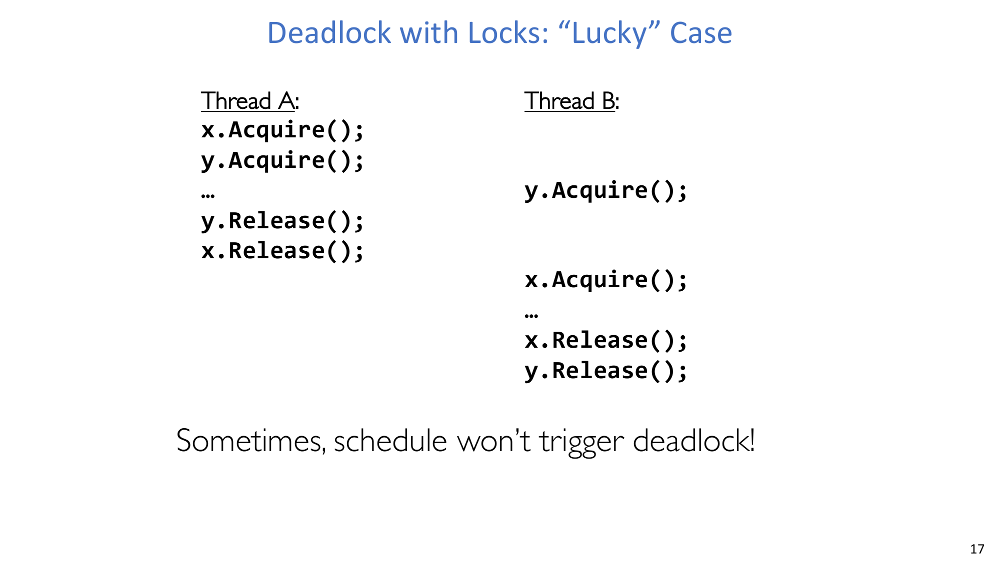

由于故障依赖时序与交错执行，它往往难复现、难调试。

## 5. 死锁并不只发生在锁上
线程可能在很多资源上死锁：
- 锁，
- 终端，
- 打印机，
- 光驱，
- 内存，
- 以及通过通信依赖而等待其他线程。

内存示例：
- 两个线程各自总共需要 2 MB。
- 系统可用内存仅 2 MB。
- 每个线程先分配 1 MB，再申请第二个 1 MB。
- 二者都无法继续，于是永久等待。

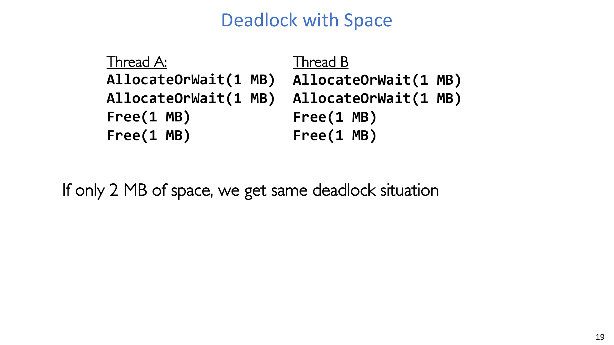

## 6. 死锁发生的四个必要条件
死锁只有在四个条件同时成立时才会出现：
1. **Mutual exclusion**：资源实例同一时刻只能被一个线程使用。
2. **Hold and wait**：线程持有至少一个资源，同时等待新资源。
3. **No preemption**：资源只能由持有者自愿释放。
4. **Circular wait**：存在等待环 $T_1 \to T_2 \to \cdots \to T_n \to T_1$。

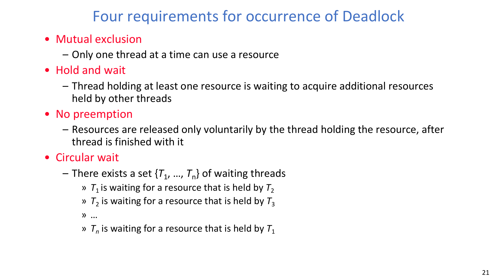

预防策略的本质，就是设法破坏这四条件中的至少一个。

## 7. 用资源分配图检测死锁
资源分配图（RAG）由以下元素构成：
- 线程节点 $T_i$，
- 资源类型节点 $R_j$（每类可有多个实例），
- 请求边 $T_i \rightarrow R_j$，
- 分配边 $R_j \rightarrow T_i$。

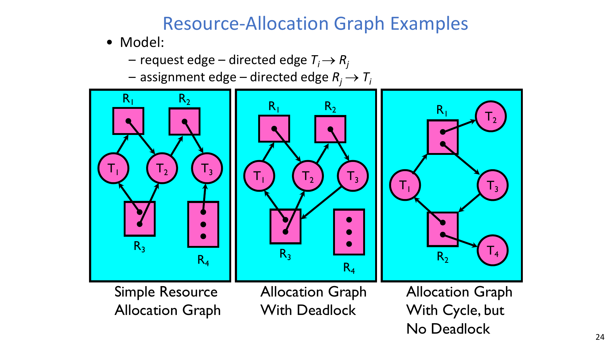

关键解释规则：
- 图中出现环一定值得警惕。
- 当资源类型有多实例时，环**不必然**等于死锁。

:::remark 问题：资源分配图里只要有环，就一定是死锁吗？
不一定。若每类资源只有单实例，环与死锁等价；若存在多实例，可能仍有线程可以完成并释放资源，从而打破环路。
:::

## 8. 向量化死锁检测算法
用非负向量表示资源数量：
- $[\mathrm{FreeResources}]$：每类资源当前空闲数，
- $[\mathrm{Request}_x]$：线程 $x$ 当前未满足请求，
- $[\mathrm{Alloc}_x]$：线程 $x$ 当前已持有资源。

算法思想是反复寻找“当前可完成”的线程，模拟其完成并释放资源。

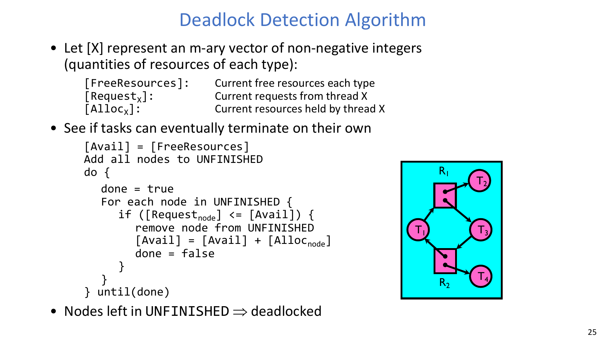

```text
[Avail] = [FreeResources]
UNFINISHED = all threads
repeat
  progress = false
  for each t in UNFINISHED:
    if [Request_t] <= [Avail]:
      remove t from UNFINISHED
      [Avail] = [Avail] + [Alloc_t]
      progress = true
until progress == false

if UNFINISHED is not empty:
  deadlock exists
```

### 8.1 将检测算法用于“用餐律师”两种建模
- Case 1：把筷子建模为单一资源类型 `[5]`，每位律师可使用任意两根。
- Case 2：把筷子建模为 `[1,1,1,1,1]`，每位律师只能使用相邻两根。

:::remark 问题：这两种建模下，检测算法的结论有何区别？
在经典“每人先拿一根再等第二根”的状态里，两种建模都会检测到死锁，因为没有任何线程能在当前可用资源下先完成并释放。区别在于：Case 1 强调总量，Case 2 显式表达邻接约束。
:::

## 9. 系统层面的四类处理路线
系统处理死锁通常有四条路线：
1. **Deadlock prevention**：通过规则设计，使死锁前提不可能同时满足。
2. **Deadlock recovery**：允许死锁出现，再强制恢复进展。
3. **Deadlock avoidance**：仅在“仍安全”时才批准资源请求。
4. **Deadlock denial**：忽略死锁风险（鸵鸟策略）。

工程上常见做法是：严格保护内核关键路径，而对应用层死锁风险做有限容忍。

## 10. 预防技术与代价
### 10.1 （近似）无限资源
若资源足够大，线程就不易在该资源上等待。
- 真实系统通常只能近似实现。
- 虚拟内存可被视为“把内存做大”的典型做法。

### 10.2 不共享资源
如果资源完全不共享，很多等待模式会消失，但这对通用操作系统通常不现实。

### 10.3 不允许等待（失败即返回，稍后重试）
与其持有资源等待，不如立即失败并重试。
- 可以破坏 hold-and-wait。
- 但会引入重试开销，降低效率。

### 10.4 一次性申请所有资源
要求线程在开始时一次性声明并申请全部需求。
- 优点：避免增量式 hold-and-wait。
- 代价：未来需求难预测，过度申请会降低资源利用率。

### 10.5 强制一致的资源申请顺序
要求所有线程都按同一全局顺序加锁。

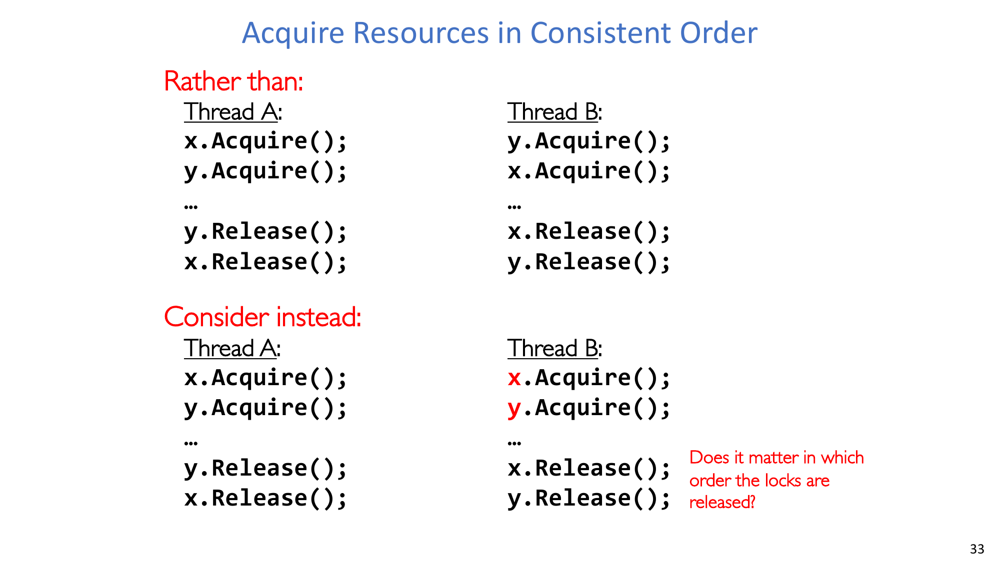

这种方法从结构上打破 circular wait。

:::remark 问题：对死锁预防来说，锁释放顺序是否关键？
死锁的核心风险来自**申请顺序**，不是释放顺序。释放顺序会影响竞争和性能，但真正消除 circular wait 的关键是统一申请顺序。
:::

### 10.6 原子化申请资源
另一类预防模式是把增量式加锁改成原子接口，例如 `Acquire_both(x, y)`。

实现细节非常关键：
- 如果 `Acquire_both` 仍按调用者给定顺序去拿锁，那么 `Acquire_both(x, y)` 与 `Acquire_both(y, x)` 仍可能重建同样的环路风险。
- 正确做法是在实现内部强制统一全局顺序，或用 `z` 这样的门锁先串行化进入多锁区。

`z` 门锁方案通过“一次只允许一个线程进入多锁申请区”来避免死锁，但并发度会下降，等待时间可能上升。

## 11. 恢复技术：死锁发生后如何拉回进展
常见恢复思路有三类：
1. 终止某个死锁线程并强制释放资源。
2. 不终止线程，但抢占其资源。
3. 将一个或多个线程回滚到之前的安全点。

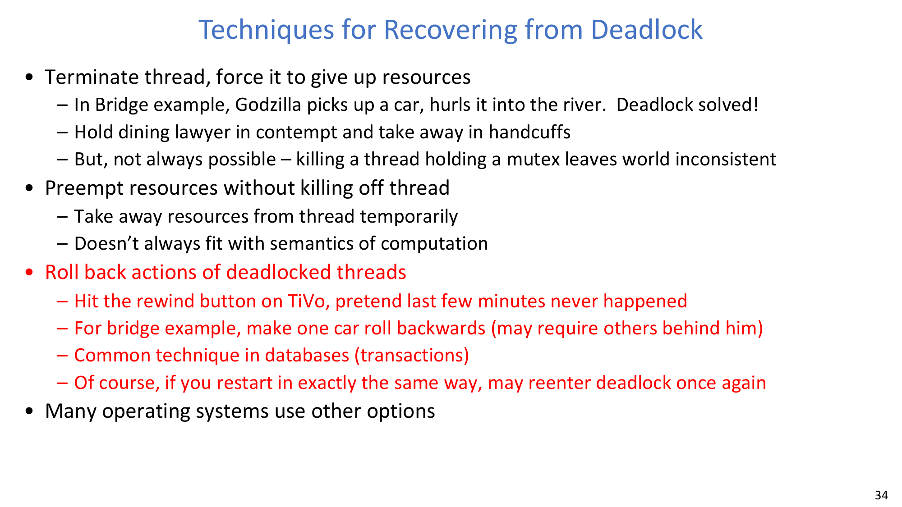

主要代价：
- 终止可能破坏共享状态一致性。
- 抢占可能不符合某些资源的语义。
- 回滚需要检查点或事务语义，且若策略不改，可能再次死锁。

## 12. 避免策略：安全态与不安全态
朴素策略“当前不会立刻死锁就批准”是不够的。

更正确的目标是防止系统进入 **unsafe state（不安全态）**。

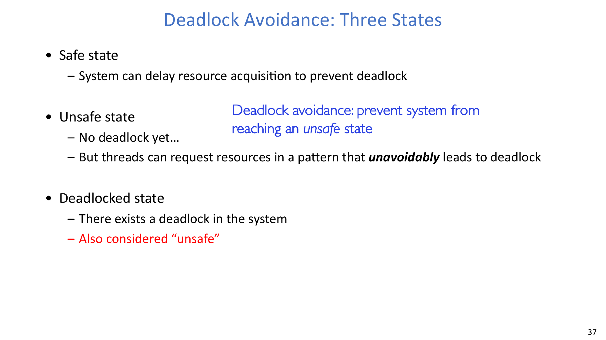

定义如下：
- **Safe state**：至少存在一个所有线程都能完成的顺序。
- **Unsafe state**：尚未死锁，但某些后续合法请求会把系统推入死锁。
- **Deadlocked state**：死锁已经发生。

:::remark 问题：为什么“只检查当前是否死锁”会失败？
因为某次请求虽然当下无死锁，却可能把系统推入“未来必死锁”的状态。避免策略必须做安全性前瞻，而不仅是当前时刻的死锁判定。
:::

## 13. 用 Banker 算法实现死锁避免
Banker 算法基于两个前提：
- 每个线程提前声明最大资源需求。
- 每次请求先做“试探性分配”，仅在结果仍安全时才正式批准。

常用安全检查量：

$$
[\mathrm{Need}_i] = [\mathrm{Max}_i] - [\mathrm{Alloc}_i]
$$

试探分配后执行与检测相似的安全性模拟；若存在完整安全序列，则批准，否则延迟。

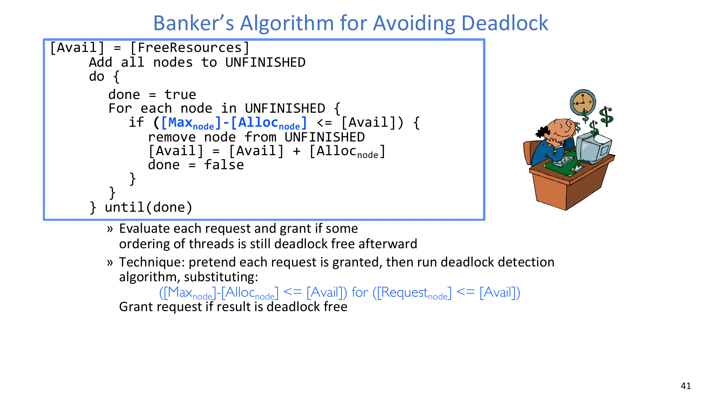

等价地说，系统必须维持这样一种状态：存在序列 $\{T_1,T_2,\ldots,T_n\}$，使每个线程都能在某个时刻拿到剩余所需资源、完成并释放。

### 13.1 Banker 在用餐律师问题中的含义
对于五位律师与五根筷子，可把 Banker 思路写成：
- 若某次请求会耗尽关键剩余资源，且让所有人都仍无法先完成，则该请求不安全，应拒绝。
- 经典规则就是禁止进入“人人一根、没人两根”的全卡死状态。

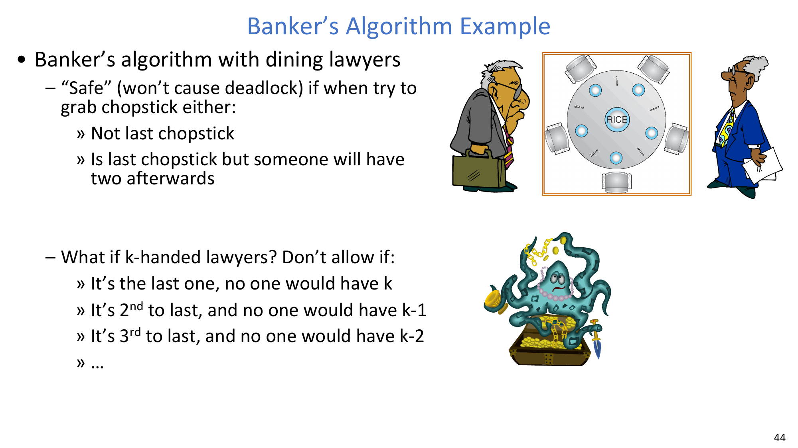

:::remark 问题：这个规则如何推广到 k-handed lawyers？
若每位律师需要 $k$ 根筷子，则每次批准后必须保证“仍至少有一个线程最终能凑齐 $k$ 根并完成释放”。类似“最后一根/倒数第二根/倒数第三根是否可发放”的判断，是完整 Banker 安全性检查在该场景下的直观特例。
:::

## 14. 关键结论
- 死锁是由资源依赖闭环导致的特定前向进展故障。
- 四条件框架是设计预防规则的核心工具。
- 图中有环是危险信号，但多实例资源必须做更深入判定。
- 检测是在死锁出现后识别，避免是在请求时维持安全态。
- 工程系统通常会混合使用预防、局部恢复和有限忽略策略。

## 附录 A. Exam Review

### A.1 必背定义
- **Starvation**：无限等待，推进没有保证。
- **Deadlock**：环形等待，若无干预无法恢复。
- **Safe state**：存在所有线程可完成的执行序列。
- **Unsafe state**：尚未死锁，但可演化为不可避免死锁。
- **Deadlocked state**：至少有一组环形等待已阻断进展。

### A.2 四类策略对比
| 策略 | 核心思想 | 主要收益 | 主要代价 |
| --- | --- | --- | --- |
| Prevention | 设计上破坏某个死锁条件 | 结构性保证强 | 灵活性/利用率可能下降 |
| Recovery | 出现死锁后再修复 | 事前并发度高 | 回滚/终止实现复杂 |
| Avoidance | 仅在仍安全时批准请求 | 利用率通常高于强预防 | 需要安全性检查与最大需求信息 |
| Denial | 忽略死锁风险 | 简单 | 可能出现无法恢复的挂起 |

### A.3 必记算法模板
- 死锁检测循环：找可满足请求线程，模拟完成，释放资源，迭代。
- Banker 安全性循环：试探分配后检查是否存在完整安全序列，再决定批准或延迟。

### A.4 常见简答题
1. 为什么死锁比饥饿是更强的失效声明？
2. 为什么多实例资源下“有环”不必然等于死锁？
3. 为什么“检查当前死锁”弱于“检查安全态”？
4. 为什么一致加锁顺序可以打破 circular wait？
5. 检测算法与 Banker 算法在时机与目标上有何本质区别？

### A.5 常见误区
- 不区分资源是否多实例，就把所有环直接判成死锁。
- 把 unsafe state 误认为 deadlocked state。
- 把检测（事后识别）与避免（事前约束）混为一谈。
- 误以为所有资源都能安全回滚或抢占。
