# Lec13 - Scheduling 4: Scheduling in Modern Computer Systems

## Learning Objectives
After this lecture, you should be able to explain why modern scheduling problems require cross-layer designs, analyze how **ZygOS** reduces tail latency for microsecond RPCs, describe how **Tiresias** schedules and places distributed DL jobs without complete job information, reason about **DRF** for multi-resource fairness, and evaluate why **FairRide** chooses strategy-proofness plus near-optimal efficiency in shared cache systems.

## 1. Big Picture
This lecture studies four representative systems/policies for modern infrastructures:
- **ZygOS**: low-tail-latency scheduling for microsecond-scale datacenter RPCs.
- **Tiresias**: GPU-cluster scheduling for distributed deep learning.
- **DRF (Dominant Resource Fairness)**: fairness across multiple resource types.
- **FairRide**: fair cache sharing under strategic users.

The common theme is that scheduling is no longer only about one queue and one CPU. It must jointly handle overhead, heterogeneity, and user incentives.

## 2. ZygOS: Low Tail Latency for Microsecond-Scale Tasks
### 2.1 Problem and baseline tension
Datacenter applications such as key-value stores and in-memory databases serve **microsecond-scale RPCs** in fan-out/fan-in environments. The key target is to improve throughput under aggressive **tail latency SLOs** (99th percentile).

A practical tension appears in existing systems:
- Single-queue systems are better in queueing theory because they reduce transient load imbalance.
- Dataplanes often run with lower overhead in practice, but they are usually multi-queue.

:::remark Question: Can we build a low-overhead system that still achieves work conservation?
Yes. The central idea is to keep dataplane-style low overhead while adding mechanisms that make the runtime behavior converge toward a single-queue model.
:::

### 2.2 Queueing insight and what to optimize
The optimization metric is **Load @ Tail-Latency SLO**. Comparing queueing models shows:
- Single-queue scheduling provides better throughput at fixed 99th-percentile latency SLO.
- The gap grows when service-time dispersion is larger.

In real systems, dataplanes can be strong at very low service times, but the advantage is fragile under higher dispersion and stricter tail constraints.

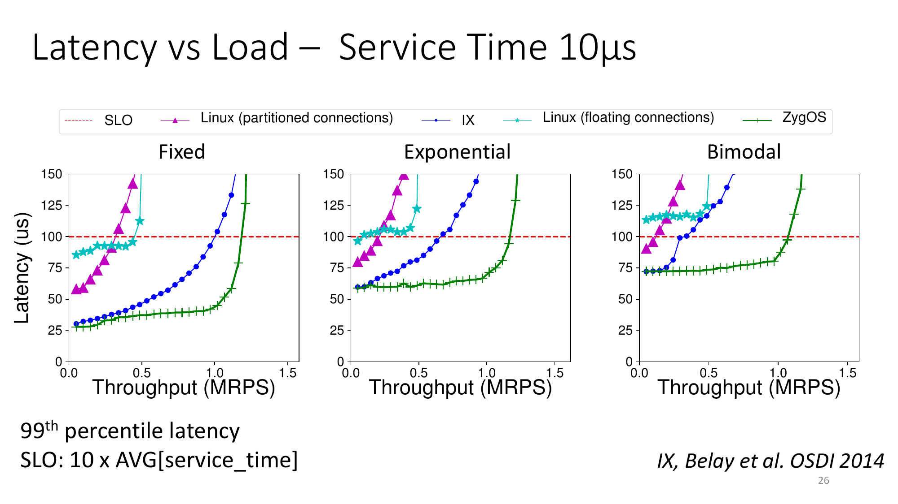

### 2.3 ZygOS design
ZygOS combines two goals:
- **Dataplane aspect**: reduced system overheads and share-nothing network processing.
- **Single-queue aspect**: work conservation and reduced head-of-line blocking.

Its structure has three layers:
1. **Application layer**: event-based application, agnostic to work stealing.
2. **Shuffle layer**: per-core ready-connection lists that enable stealing.
3. **Network layer**: coherence- and synchronization-free packet processing.

### 2.4 Execution model: state-change flow
The execution model can be read as a process of continuous state movement:
1. Incoming requests are received on a home core and become ready connections.
2. Ready work is placed into the home core’s shuffle queue.
3. An underloaded remote core steals work from that queue.
4. The remote core runs the event-driven application logic.
5. If it must operate on home-core networking state, it issues **remote syscalls**.
6. The home core executes those syscalls and completes TCP/IP transmission.

This flow is how ZygOS keeps packet processing lightweight while preserving work conservation across cores.

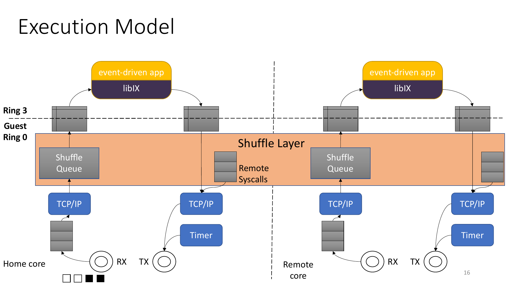

### 2.5 Evaluation highlights
Reported setup includes 10+1 Xeon servers, 16-hyperthread server machines, and a 48x10GbE switch.

Key results:
- Under 10 us service-time workloads, ZygOS reaches the best throughput at the same tail-latency SLO across fixed/exponential/bimodal service distributions.
- In Silo TPC-C experiments, ZygOS achieves **1.63x speedup over Linux** and **3.68x lower 99th latency**.

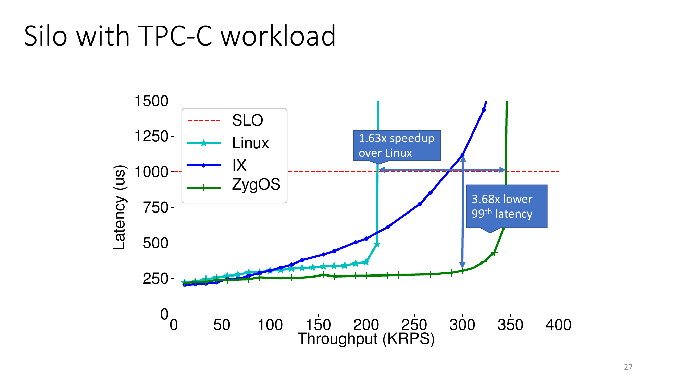

## 3. Tiresias: GPU Cluster Scheduling Without Complete Knowledge
### 3.1 Objectives and system context
Deep learning training jobs grew rapidly in production clusters and require GPUs, often in distributed form. The scheduler must balance two goals:
- Minimize cluster-wide average **Job Completion Time (JCT)**.
- Maintain high GPU utilization.

### 3.2 Challenge I: Unpredictable training time
Job execution time is usually unknown in advance, but it is critical for minimizing JCT.

A key observation is that two dimensions are available even without full prior knowledge:
- **Spatial**: number of GPUs requested.
- **Temporal**: executed time so far.

Tiresias builds a two-dimensional age-based scheduler:
- Start from LAS (Least-Attained Service): prioritize jobs with shortest attained service.
- Extend to **2DAS** using total executed GPU time:

$$
\text{2D attained service} = (\#\text{GPUs}) \times (\text{executed time})
$$

- Use discretized 2D-LAS (MLFQ style) to reduce excessive job switching.

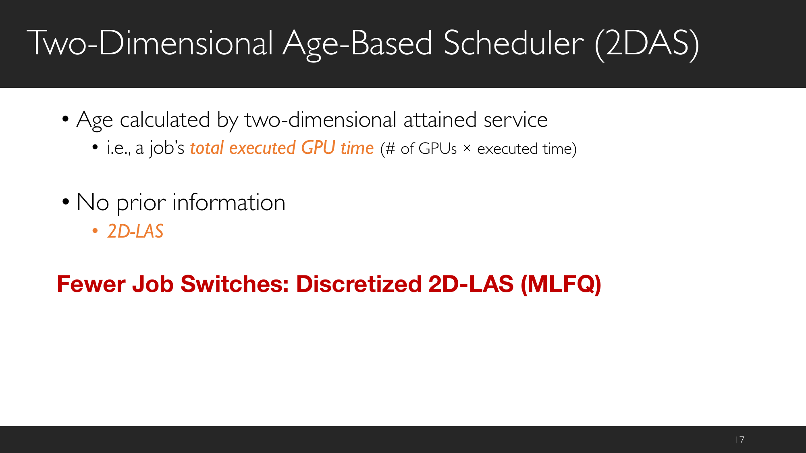

:::remark Question: How can we schedule DL jobs without complete job information?
Use attained service instead of predicted total runtime. In Tiresias, the attained service is two-dimensional (GPU count and executed time), so no complete prior runtime profile is required.
:::

### 3.3 Challenge II: Over-aggressive job consolidation
Distributed training has communication overhead. Consolidated placement can improve synchronization efficiency, but over-consolidation creates fragmentation and queueing delay.

Tiresias addresses this with **model profile-based placement**:
- It decides whether consolidation is needed based on model-level communication characteristics.
- Example from the model-profile flow:
  - **Consolidation = YES** for communication-heavy/skewed models such as AlexNet and VGG variants.
  - **Consolidation = NO** for models where strict consolidation is less necessary (e.g., ResNet/Inception cases shown in the figure).

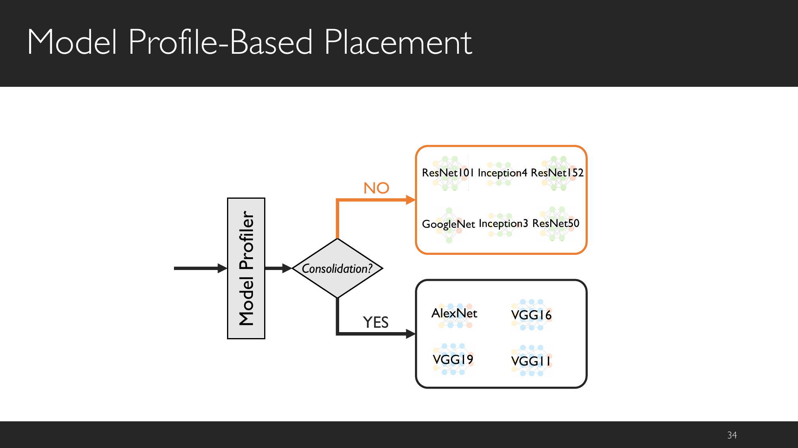

:::remark Question: How can we place DL jobs without hurting training performance?
Place jobs using model communication profiles instead of a one-rule-fits-all strategy. This avoids both extremes: no consolidation (network contention) and over-consolidation (fragmentation and long queue delay).
:::

### 3.4 End-to-end pipeline and evaluation
The system pipeline combines a central master, discretized-2DAS scheduling, and profile-based placement with preemption support.

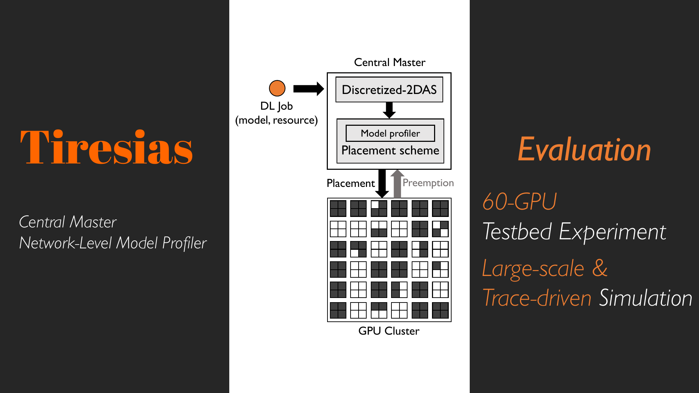

Evaluation highlights:
- Testbed: Michigan ConFlux cluster, 15 machines, 4 GPUs each, 100 Gbps RDMA.
- Average JCT improvement in testbed: **5.5x (w.r.t. YARN-CS)**, with performance comparable to SRTF.
- Trace-driven simulation: 10-week Microsoft trace, 2,000-GPU cluster.
- Average JCT improvement in simulation: **2x (w.r.t. Gandiva)**.

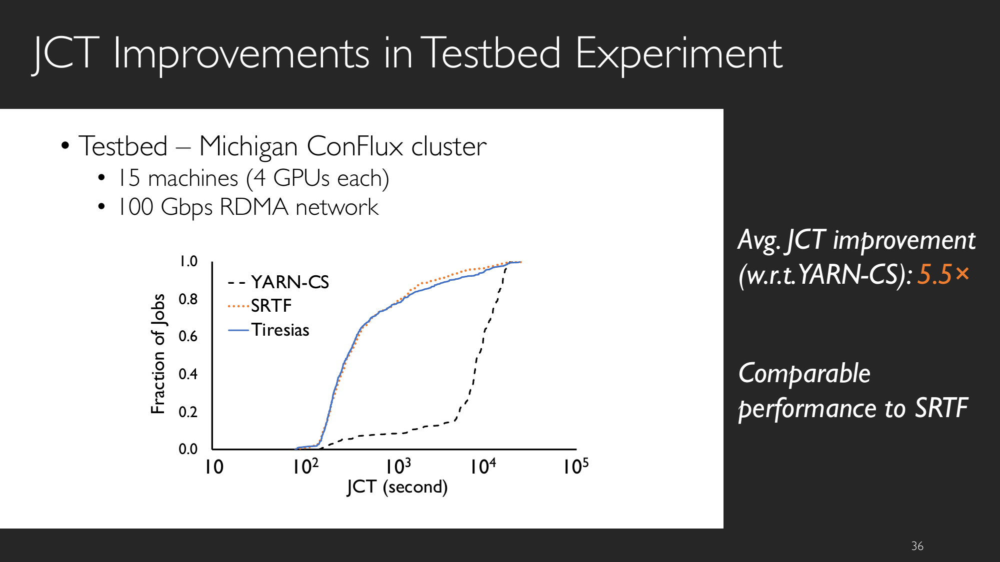

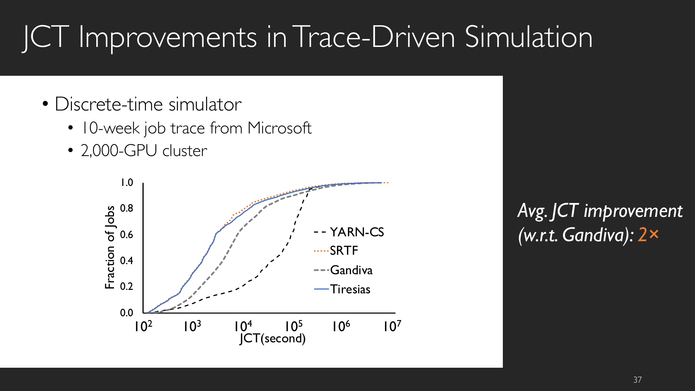

## 4. DRF: Fair Allocation of Multiple Resource Types
### 4.1 What fairness means
For one resource, equal sharing suggests each user gets at least 1/n. This is generalized by max-min fairness and weighted max-min fairness.

In multi-resource settings, the lecture emphasizes three core properties:
- **Share guarantee**: Each user can get at least 1/n of the resource, but gets less if demand is less.
- **Strategy-proofness**: Users are not better off by asking for more than they need.
- **Pareto efficiency**: You cannot improve one user without hurting at least one other user.

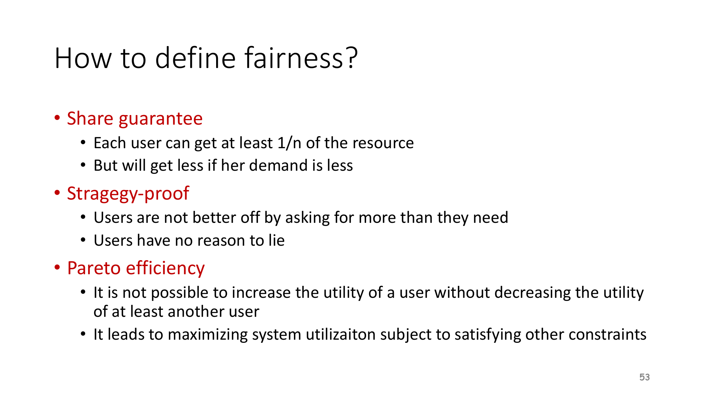

### 4.2 Why max-min fairness alone is not enough
Datacenter jobs consume CPU, memory, disk, and I/O simultaneously, with heterogeneous demand vectors. So fairness cannot be judged by a single scalar resource share.

### 4.3 Model and the natural baseline
DRF models each task with a demand vector, e.g. `<2, 3, 1>`, and assumes divisible resources.

A natural baseline is **Asset Fairness**:
- Equalize each user’s sum of resource shares.

This baseline can fail **share guarantee**. Consider:
- Total resources: `70 CPU, 70 GB RAM`.
- User 1 demand per task: `<2 CPU, 2 GB>`.
- User 2 demand per task: `<1 CPU, 2 GB>`.

Let User 1 run `x` tasks and User 2 run `y` tasks.

Asset fairness equalizes the sum of shares:

$$
\frac{2x}{70} + \frac{2x}{70} = \frac{y}{70} + \frac{2y}{70}
\Rightarrow 4x = 3y \Rightarrow y = \frac{4x}{3}
$$

Resource constraints are:

$$
2x + y \le 70 \quad (\text{CPU}), \qquad 2x + 2y \le 70 \quad (\text{RAM})
$$

Substitute `y = 4x/3`:
- CPU: `2x + 4x/3 <= 70` gives `x <= 21`.
- RAM: `2x + 8x/3 <= 70` gives `x <= 15`.

So the feasible point under asset-fairness equality is `x = 15`, `y = 20`.
- User 1 allocation: `30 CPU, 30 GB`.
- User 2 allocation: `20 CPU, 40 GB`.

User 1 gets only `30/70 = 42.86%` on both CPU and RAM, which is below `50%`.

:::remark Question: Why does this violate share guarantee intuition?
In a 2-user system, a natural expectation is that each user should be able to secure at least a half-share when needed. Here User 1 receives only 42.86% on both key resources, and could do better in a dedicated 50% partition (`35 CPU, 35 GB`, i.e., up to 17.5 tasks). This is exactly why sum-of-shares is not a robust fairness metric in multi-resource settings.
:::

### 4.4 Dominant Resource Fairness (DRF)
The key definitions are:
- **A user’s dominant resource is the resource she has the biggest share of.**
- **A user’s dominant share is the fraction of the dominant resource she is allocated.**

Example:
- Total resources: `<10 CPU, 4 GB>`.
- User 1 allocation: `<2 CPU, 1 GB>`.
- Dominant resource is memory because `1/4 > 2/10`.
- Dominant share is `25%`.

DRF policy:
- **Apply max-min fairness to dominant shares.**
- **Equalize the dominant share of users.**

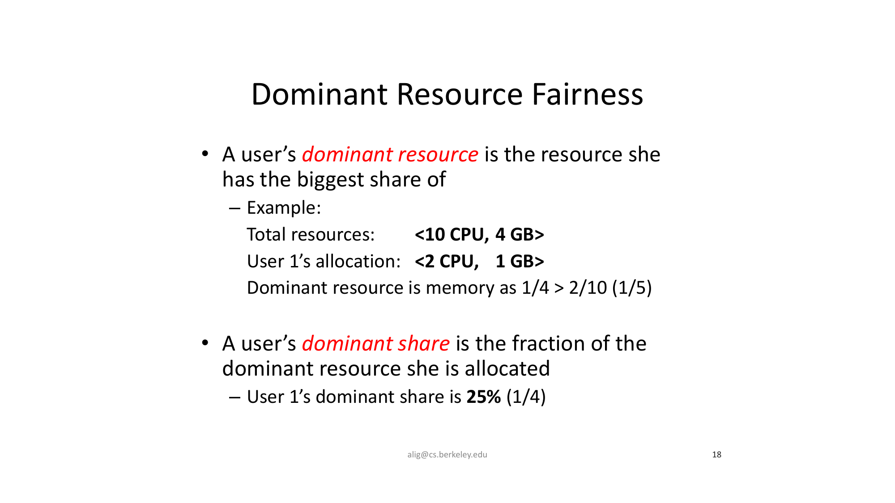

Now walk through a full DRF allocation example:
- Total resources: `<9 CPU, 18 GB>`.
- User 1 demand per task: `<1 CPU, 4 GB>` (dominant resource is memory).
- User 2 demand per task: `<3 CPU, 1 GB>` (dominant resource is CPU).

Let User 1 run `x` tasks and User 2 run `y` tasks.

Dominant-share equality condition:

$$
\frac{4x}{18} = \frac{3y}{9}
\Rightarrow \frac{2x}{9} = \frac{y}{3}
\Rightarrow 2x = 3y
\Rightarrow x = 1.5y
$$

Capacity constraints:

$$
x + 3y \le 9 \quad (\text{CPU}), \qquad 4x + y \le 18 \quad (\text{RAM})
$$

Substitute `x = 1.5y` into CPU:

$$
1.5y + 3y = 4.5y \le 9 \Rightarrow y \le 2
$$

Take `y = 2`, then `x = 3`.
- User 1 allocation: `<3 CPU, 12 GB>`.
- User 2 allocation: `<6 CPU, 2 GB>`.
- User 1 dominant share (memory): `12/18 = 66.7%`.
- User 2 dominant share (CPU): `6/9 = 66.7%`.

So DRF equalizes dominant shares as intended.

:::remark Question: Why does DRF compare dominant share instead of total share?
Because different users are bottlenecked by different resources. Total share can hide bottlenecks and produce unfair outcomes; dominant share directly tracks each user’s true limiting resource.
:::

### 4.5 DRF vs CEEI and policy properties
An economist-inspired alternative is **CEEI (Competitive Equilibrium from Equal Incomes)**:
- Give each user 1/n of every resource.
- Let users trade in a competitive market.

CEEI may improve utilization in some cases, but the lecture example shows it is vulnerable to manipulation; it is **not strategy-proof**.

:::remark Question: Why can CEEI look efficient but still fail strategy-proofness?
In CEEI, users can influence market outcomes through declared demand and thereby affect effective prices. A strategic user may misreport preferences to reshape prices, then purchase a bundle that increases real utility. So utilization may improve, but truthful reporting is no longer guaranteed.
:::

:::remark Question: Why is max-min fairness not enough, and why do we need DRF?
With multiple resource types, users can dominate different bottlenecks. DRF compares users by dominant shares, preserves share guarantee better than asset-based balancing, and remains strategy-proof under truthful demand declarations.
:::

The policy comparison table in this lecture highlights that DRF satisfies many desirable properties simultaneously.

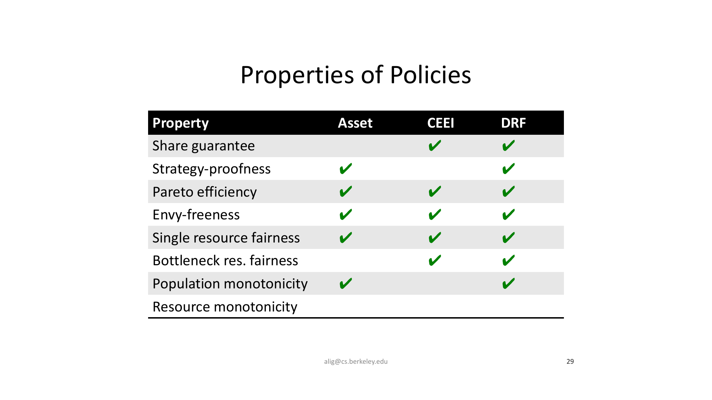

## 5. FairRide: Near-Optimal Fair Cache Sharing
### 5.1 Motivation and model
Caches are increasingly shared among users in cloud settings. This lowers latency and backend load, but fairness becomes tricky.

Traditional cache policies (LRU/LFU/LRU-K) optimize global efficiency, yet can cause:
- A user receiving arbitrarily small cache share.
- Strategic behavior by users.

FairRide uses a simple access model:
- `r_{ij}`: rate user `i` accesses file `j`.
- `p_j`: fraction of file `j` cached.
- User `i` hit ratio:

$$
HR_i = \frac{\sum_j p_j r_{ij}}{\sum_j r_{ij}}
$$

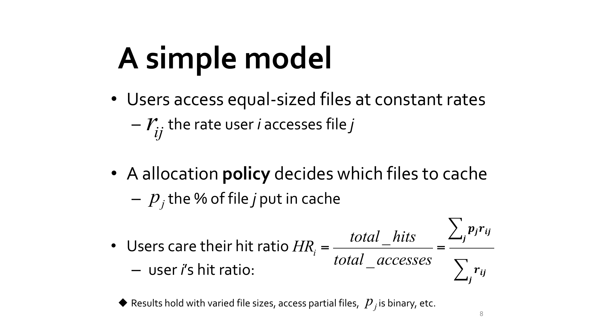

### 5.2 Three desired properties
FairRide studies three target properties:
- **Isolation Guarantee (Share Guarantee)**: no user should be worse off than static allocation.
- **Strategy-Proofness**: no user can improve by cheating.
- **Pareto Efficiency**: cannot improve one user without hurting others.

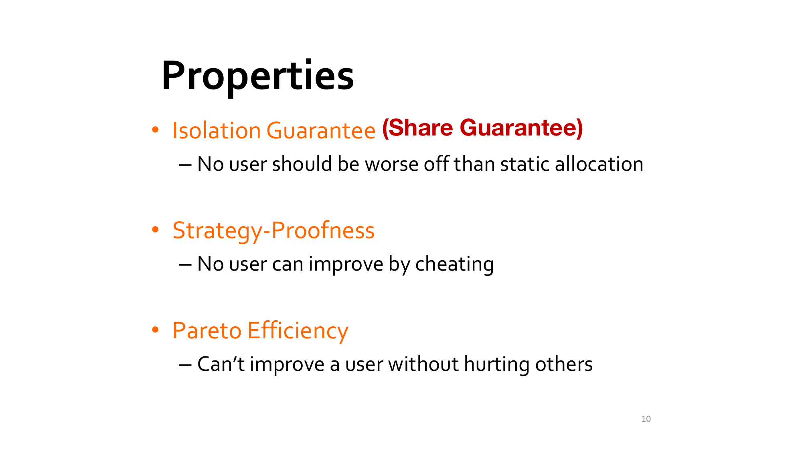

### 5.3 Why plain max-min fairness fails in cache sharing
Consider the lecture example:
- Files A, B, C are each 1 GB; total cache is 2 GB.
- Alice requests: A at 5 req/s, B at 10 req/s.
- Bob requests: B at 10 req/s, C at 5 req/s.
- Initial max-min style sharing yields both users around 83.3% hit ratio.

If Bob adds spurious accesses (gaming), the cache placement shifts toward his interest, and his real hit ratio increases while Alice’s decreases. So plain max-min sharing is not strategy-proof.

### 5.4 Impossibility theorem and FairRide’s choice
The theorem states:
- **No allocation policy can satisfy all three properties.**
- The best possible in general is two out of three.

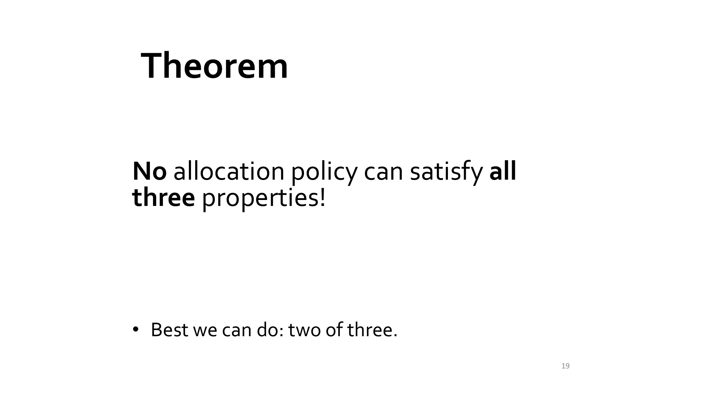

FairRide mechanism:
1. Start with max-min fairness (`1/n` baseline per user).
2. Split the cost of shared files equally among sharing users.
3. **Only difference**: block users who do not "pay" from accessing extra cache benefit.
4. Use probabilistic blocking (implemented with delaying):

$$
p(n_j) = \frac{1}{n_j + 1}
$$

where `n_j` is the number of other users caching file `j`.

Examples: `p(1)=50%`, `p(4)=20%`.

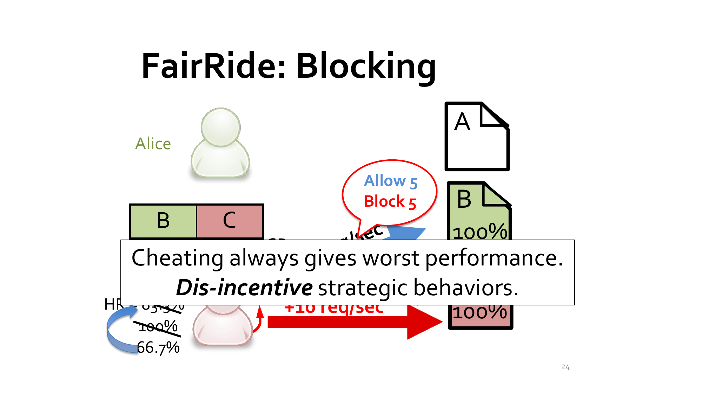

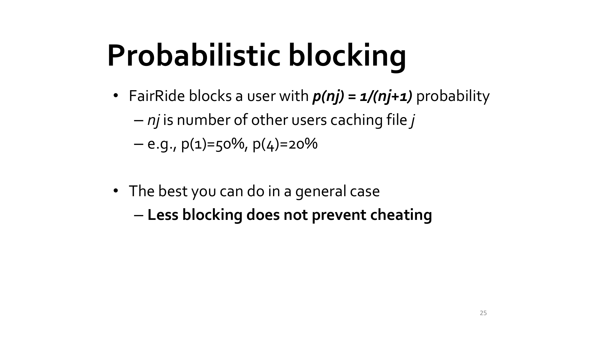

The paper’s Figure 3 gives an exact computation for why blocking removes cheating incentive.

Let files A/B/C be unit-size, total cache size be 2, and access rates:
- User 1: `A=10`, `B=5` (req/s).
- User 2: `A=10`, `C=5` (req/s).

Under truthful max-min allocation:
- `A` is shared, and each user gets half of her private file (`B` or `C`).
- Hit rate is computed as `access_rate × cached_fraction`.
- So each user gets:

$$
10\times 1 + 5\times 0.5 = 12.5 \text{ hits/s}
$$

Now User 2 cheats by spuriously increasing accesses to `C` so that `C` outranks `A` in her priority.
- Then allocation becomes: `A` cached on behalf of User 1, `C` cached on behalf of User 2.
- Without blocking (plain max-min), User 2 can still free-ride on `A`, so:

$$
HR_2^{\text{cheat, no-block}} = 10 + 5 = 15
$$

which is higher than `12.5`, so cheating is profitable.

With FairRide, blocking is applied **exactly when user `i` accesses an in-memory file `j` that `i` does not cache/pay for**.
If `n_j` is the number of other users caching `j`, then:

$$
p_{\text{block}}(j)=\frac{1}{n_j+1}, \qquad
q_{\text{allow}}(j)=1-p_{\text{block}}(j)=\frac{n_j}{n_j+1}
$$

In this cheating state, User 2 is a non-owner of `A`, and only User 1 caches `A`, so `n_A=1`.
- Expected hit contribution from `A` becomes `10\times q_{\text{allow}}(A)=10\times \frac12=5`.
- Hit contribution from owned file `C` is `5`.

Therefore:

$$
HR_2^{\text{cheat, FairRide}} = 5 + 5 = 10 < 12.5
$$

So cheating is no longer beneficial.

:::remark Question: Does blocking apply even without cheating, and can it reduce hit ratio?
Yes. The paper explicitly notes that the system cannot always distinguish strategic cheating from legitimate access-pattern shifts, so a well-behaved user can also be partially blocked in some shared-file situations. This is why FairRide sacrifices Pareto efficiency. However, FairRide still guarantees isolation-guarantee: user utility remains no worse than static isolation.
:::

:::remark Question: Can a strategic user bypass probabilistic blocking by retrying?
With pure random blocking, repeated retries can amplify pass probability. FairRide addresses this in implementation by replacing conceptual blocking with expected delaying, which makes repeated probing ineffective in expectation and keeps strategy-proof behavior in practice.
:::

### 5.5 Final property tradeoff
The final comparison in this lecture is:
- FairRide keeps **isolation guarantee**.
- FairRide keeps **strategy-proofness**.
- Pareto efficiency is **near-optimal**.

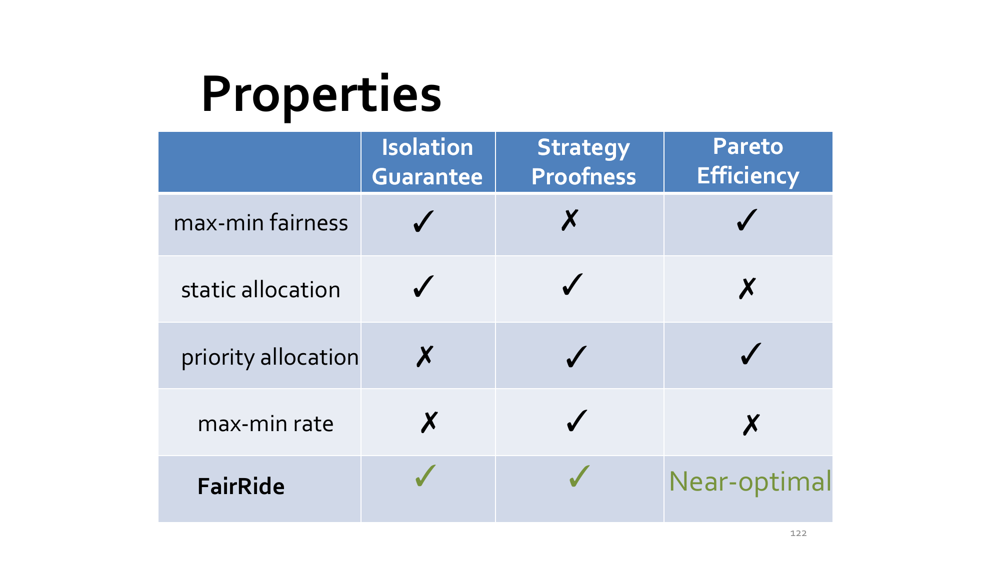

## 6. Cross-Paper Takeaways
- ZygOS shows that queueing-theoretic advantages are only useful if systems engineering can realize them with low overhead.
- Tiresias shows that partial information can be enough when the scheduler chooses the right surrogate (2D attained service) and placement signal (model profile).
- DRF shows fairness must be defined on dominant bottlenecks in multi-resource systems.
- FairRide shows that fairness design must account for strategic users, not only workload statistics.

## 7. Key Takeaways
- Modern scheduling problems are **multi-dimensional**: latency tails, overheads, heterogeneity, and incentives interact.
- “Best average throughput” is often the wrong objective without tail-SLO constraints.
- Multi-resource fairness requires explicit definitions; dominant-share reasoning is central.
- In strategic environments, mechanism design (e.g., blocking rules) is part of scheduling.

## Appendix A. Exam Review

### A.1 Must-remember definitions
- **2DAS age**: total executed GPU time.
- **Dominant resource**: resource where a user has largest share.
- **Dominant share**: fraction of that dominant resource allocated to the user.
- **Isolation guarantee / share guarantee**: no user worse than static share.
- **Strategy-proofness**: lying/manipulation does not help.
- **Pareto efficiency**: cannot improve one user without hurting another.

### A.2 Core formulas
$$
\text{2D attained service} = (\#\text{GPUs}) \times (\text{executed time})
$$

$$
HR_i = \frac{\sum_j p_j r_{ij}}{\sum_j r_{ij}}
$$

$$
p(n_j) = \frac{1}{n_j + 1}
$$

### A.3 One-line summaries of four systems
- **ZygOS**: low-overhead dataplane + work stealing to approach single-queue behavior under tail-latency SLOs.
- **Tiresias**: 2D age-based scheduling + model profile placement for DL clusters without complete runtime knowledge.
- **DRF**: equalize dominant shares to achieve strong multi-resource fairness guarantees.
- **FairRide**: enforce strategy-proof cache sharing with probabilistic blocking, accepting near-optimal Pareto efficiency.

### A.4 High-frequency short-answer questions
1. Why can single-queue models outperform multi-queue models at strict tail-latency SLO?
2. Why is `#GPUs × executed time` a better age metric than executed time alone for DL jobs?
3. Why can CEEI improve utilization but fail strategy-proofness?
4. Why is the FairRide theorem fundamentally a “two-of-three” tradeoff?
5. How does probabilistic blocking discourage strategic behavior?

### A.5 Common mistakes
- Treating fairness as one scalar objective in multi-resource systems.
- Ignoring tail latency and optimizing only average latency.
- Assuming users are always honest in shared infrastructure.
- Confusing “Pareto-optimal” with “strategy-proof.”
