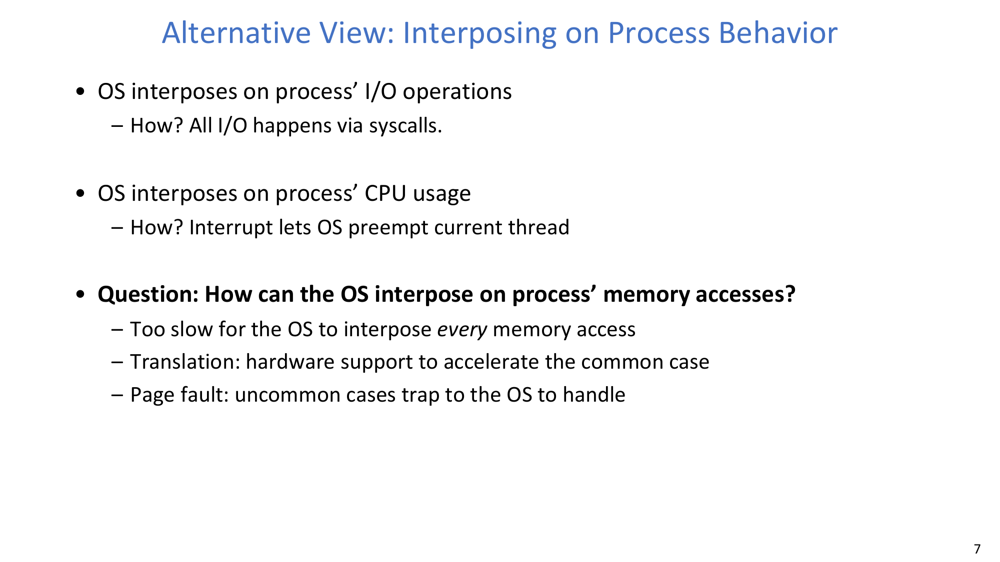
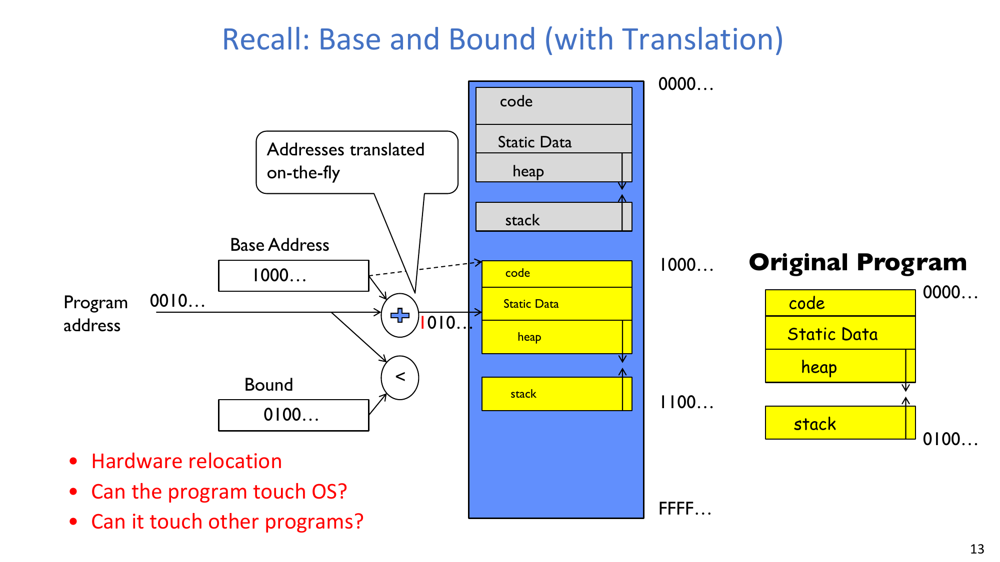
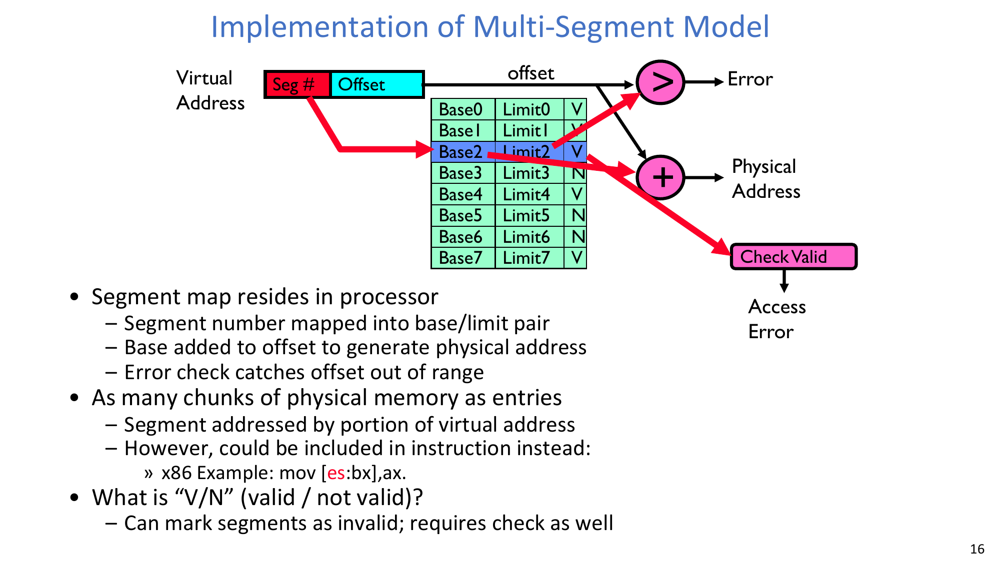
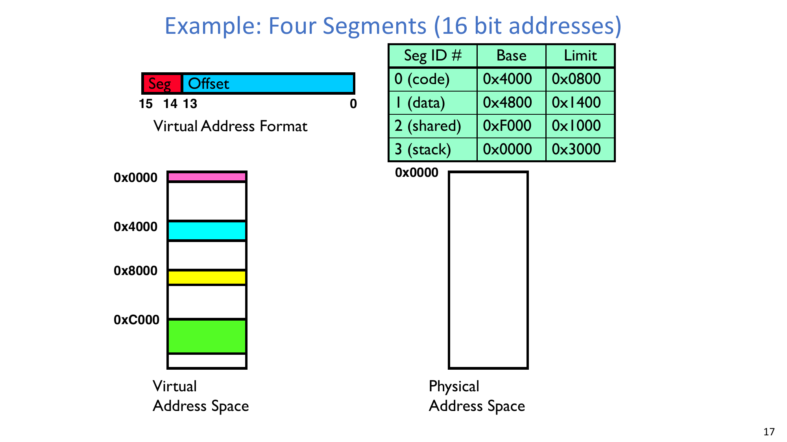
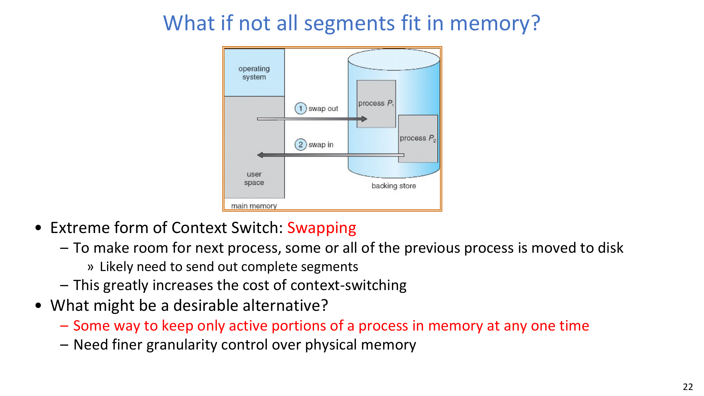
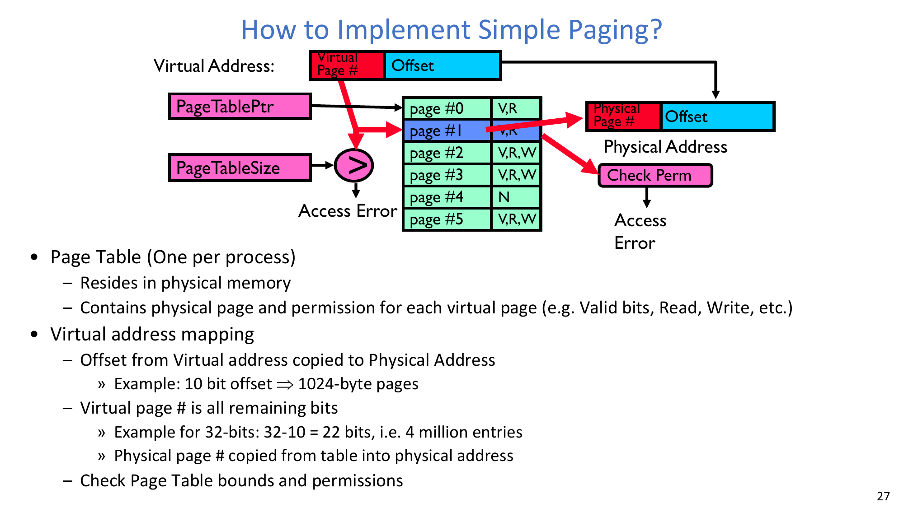
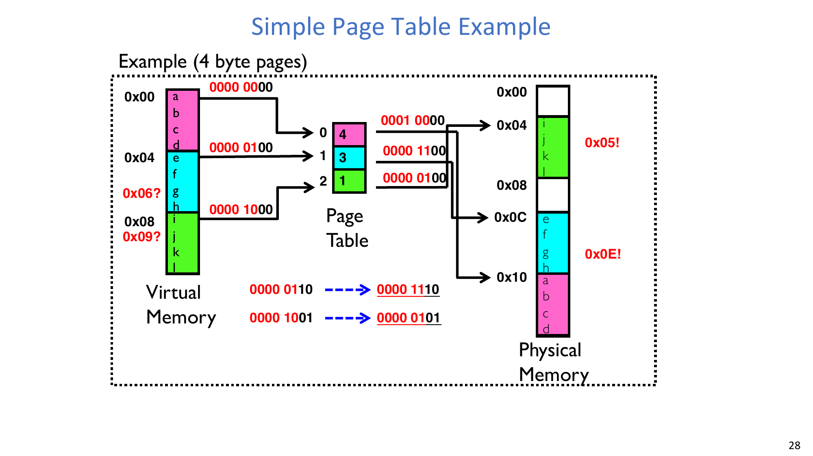
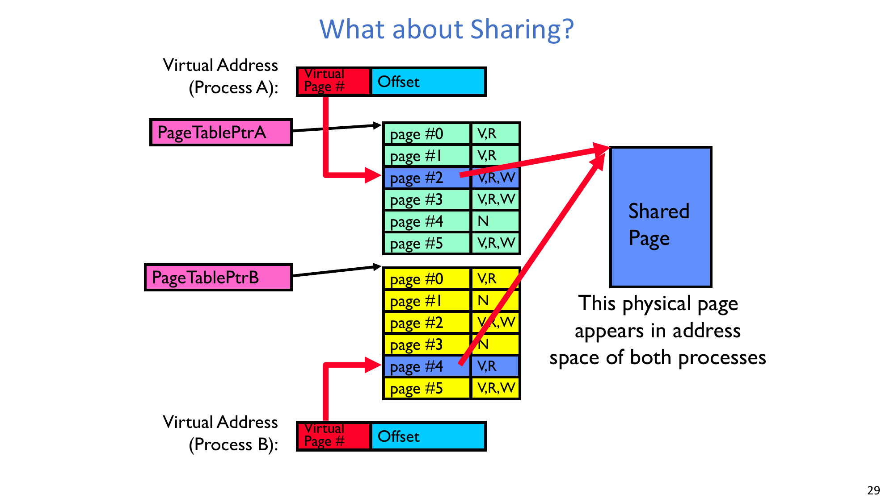
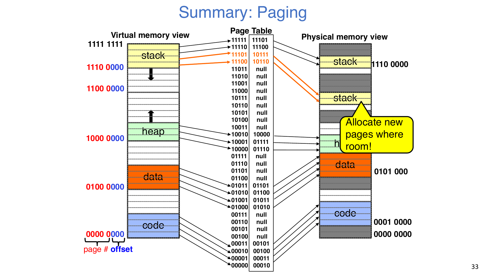

# Lec14 - Memory 1: Address Translation and Virtual Memory

## Learning Objectives
After this lecture, you should be able to explain why memory must be virtualized, distinguish protection from translation, analyze the evolution from base-and-bound to segmentation and paging, perform basic address-translation calculations, and reason about sharing and growth behavior under page tables.

## 1. Why Memory Virtualization Is Necessary
Modern systems multiplex hardware among many processes and threads. After CPU scheduling, memory is the next resource that must be multiplexed correctly.

Two facts drive the design:
- The complete working state of a process and kernel is represented by registers and memory.
- Different processes cannot blindly share the same physical addresses, both for correctness and for protection.

Therefore, memory management must provide isolation by default and controlled sharing when needed.

## 2. Address and Address Space Fundamentals
An address with `k` bits identifies one of `2^k` addressable units (typically bytes).

Key conversions used throughout this lecture:
- `2^10 B = 1024 B = 1 KB` (memory context uses powers of 2).
- `4 KB = 2^12 B`, so a byte offset inside a 4 KB page needs **12 bits**.
- Addressable space sizes:
  - `20-bit`: `2^20 B = 1 MiB`
  - `32-bit`: `2^32 B = 4 GiB`
  - `64-bit`: `2^64 B = 16 EiB`

A process virtual address space usually contains code, static data, heap, and stack, with holes between regions.
For a 32-bit process:
- Total bytes: `2^32`
- Number of 32-bit values (4 bytes each): `2^32 / 4 = 2^30`

Memory accesses can have different outcomes: ordinary load/store, memory-mapped I/O effects, fault/abort (e.g., segfault), or inter-process communication effects under shared mappings.

## 3. What Memory Multiplexing Must Provide
The lecture emphasizes three requirements:
- **Protection**: prevent processes from touching private memory of other processes or the kernel.
- **Translation**: map virtual addresses seen by CPU to physical addresses used by DRAM.
- **Controlled overlap**: avoid accidental overlap, but allow intentional overlap for sharing.

:::remark Question: How can the OS interpose on memory accesses if software checks are too slow?
The common case is delegated to hardware translation (MMU), while uncommon cases (such as faults) trap to the OS. This is the core performance idea behind virtual memory.
:::

## 4. From Uniprogramming to Base-and-Bound
### 4.1 Uniprogramming and primitive multiprogramming
Without translation/protection, a single application can directly access physical memory. Early multiprogramming used loader/linker relocation to place programs at different physical locations, but this still lacked strong protection and reliability.

### 4.2 Base-and-bound with protection
Base-and-bound introduces a protected contiguous region for each process. In the translated form:

$$
\text{if } v < \text{bound, then } p = \text{base} + v; \quad \text{otherwise fault}
$$

This gives hardware relocation and strong isolation against out-of-range accesses.

### 4.3 Limits of simple base-and-bound
Simple contiguous allocation runs into major problems:
- Fragmentation over time as processes of different sizes come and go.
- Poor support for sparse address spaces.
- Harder inter-process sharing.

These limits motivate segmentation.

## 5. Segmentation
### 5.1 Core idea
Segmentation models a process as multiple logical chunks (code/data/heap/stack, etc.).
Each segment has a contiguous physical placement but different segments may be placed anywhere in memory.

### 5.2 Translation pipeline
A virtual address is split into `SegID` and `Offset`.
`SegID` selects a segment-table entry `(Base, Limit, Valid, Permission...)`.
Then hardware checks validity and bounds.
If valid, physical address is computed as:

$$
\text{physical} = \text{base}_{seg} + \text{offset}
$$

Otherwise, access error/fault.

### 5.3 Worked example: four segments in 16-bit virtual addresses
The lecture example uses top 3 bits as `SegID` (bits 15..13) and remaining 13 bits as offset.

Segment table:

| Seg ID | Meaning | Base   | Limit  |
|---|---|---|---|
| 0 | code   | `0x4000` | `0x0800` |
| 1 | data   | `0x4800` | `0x1400` |
| 2 | shared | `0xF000` | `0x1000` |
| 3 | stack  | `0x0000` | `0x3000` |

Valid physical intervals implied by base/limit:
- Seg0: `[0x4000, 0x47FF]`
- Seg1: `[0x4800, 0x5BFF]`
- Seg2: `[0xF000, 0xFFFF]` (shared segment)
- Seg3: `[0x0000, 0x2FFF]`

The example sequence shows code/data mapped into one region and a shared segment mapped near the top of physical memory, leaving room for other apps.

### 5.4 Observations and tradeoffs
Strengths:
- Efficient for sparse address spaces with holes.
- Natural per-segment permissions (e.g., code read-only, data/stack read-write).

Operational behaviors:
- Translation happens on every instruction fetch/load/store.
- Stack or heap growth may intentionally touch outside current valid range; OS can catch fault and enlarge segment metadata.
- Context switch needs segment metadata save/restore.

### 5.5 If segments do not fit: swapping and cost
When memory is tight, whole segments (or large parts) may be swapped out/in, which can make context switching very expensive.

:::remark Question: What are the key problems of segmentation?
The lecture highlights variable-size placement complexity, repeated movement/compaction pressure, limited swapping flexibility, and both external and internal fragmentation.
:::

## 6. Paging
### 6.1 Core idea and motivation
Paging uses fixed-size physical chunks (frames/pages), so allocation is much simpler and less vulnerable to external fragmentation.

A bitmap can track allocation:
- `1` means allocated frame.
- `0` means free frame.

Typical page sizes are relatively small (roughly 1K-16K in this lecture context), so one logical segment may span multiple pages.

### 6.2 Simple paging pipeline
A virtual address is split into `VPN + offset`.
- Offset is copied unchanged into the physical address.
- VPN indexes a page table entry (PTE).
- PTE provides physical page number plus metadata (valid and permissions).
- Hardware checks table bounds and permissions.

### 6.3 Worked example (4-byte pages)
The lecture example maps:
- `VPN 0 -> PPN 4`
- `VPN 1 -> PPN 3`
- `VPN 2 -> PPN 1`

Address translations shown in the slide:
- `0x06 = 0000 0110`
  - `VPN=1`, `offset=2`
  - `PPN=3`
  - Physical `= 0000 1110 = 0x0E`
- `0x09 = 0000 1001`
  - `VPN=2`, `offset=1`
  - `PPN=1`
  - Physical `= 0000 0101 = 0x05`

### 6.4 Sharing with paging
Paging supports sharing by mapping entries from different processes to the same physical page.
Different virtual page numbers may refer to the same physical frame.
Permissions can still differ by process.

Where this is commonly used:
- Kernel region entries shared across all processes (with privilege protection).
- Shared executable code for multiple processes running the same binary.
- User-level shared libraries.
- Shared-memory IPC regions.

## 7. Paging Growth Scenario: What If Stack Expands?
In the paging summary sequence, some virtual pages are initially unmapped (`null` in page table).
If downward-growing stack reaches a null virtual page (e.g., near `1110 0000` in the figure), a fault occurs.
OS can allocate new physical frames where space is available and update corresponding page-table entries.
Execution then resumes.

:::remark Question: Why is this behavior easier with paging than with segmentation?
Paging requires finding free fixed-size frames, not one large contiguous variable-size region. This reduces relocation pressure and makes incremental growth easier.
:::

## 8. Key Takeaways
- Base-and-bound gives a first strong isolation model but does not scale well for fragmentation and sparse spaces.
- Segmentation matches logical program structure and supports sharing, but variable-size allocation creates long-term management pain.
- Paging turns memory management into fixed-size mapping via page tables, improving flexibility and making on-demand growth practical.
- Address translation is a performance-critical hardware/software contract: fast MMU path for common accesses, trap to OS for exceptional cases.

## Appendix A. Exam Review
### A.1 Must-remember definitions
- **Virtual address space**: address set visible to a process.
- **Physical address space**: actual DRAM address space.
- **Translation**: mapping virtual address to physical address.
- **Segmentation**: variable-size logical chunks with base/limit.
- **Paging**: fixed-size page/frame mapping through page table.
- **External fragmentation**: free memory split into unusable gaps.
- **Internal fragmentation**: allocated chunk not fully used.

### A.2 Core formulas and rules
$$
\text{Addressable bytes with }k\text{ bits} = 2^k
$$

$$
\text{Base-and-bound: } v<\text{bound} \Rightarrow p=\text{base}+v
$$

$$
\text{Paging: } VA=(VPN,offset),\; PA=(PPN,offset)
$$

### A.3 High-frequency short questions
1. Why can memory translation not be fully handled by software in the common case?
2. What specific scaling problem of base-and-bound leads to segmentation/paging designs?
3. Why does fixed-size paging reduce external fragmentation?
4. How can two processes share one physical page safely?
5. What exactly happens when stack growth hits an unmapped page?

### A.4 Common mistakes
- Confusing virtual contiguity with physical contiguity.
- Forgetting that offset bits are copied unchanged in paging.
- Ignoring permission/valid checks when describing translation.
- Assuming sharing implies identical permissions for all processes.
- Treating segmentation fragmentation and paging fragmentation as the same problem.
