# Lec15 - 内存 2：虚拟内存（续）、Caching 与 TLB

## 学习目标
学完本讲后，你应当能够解释为什么简单页表无法扩展，描述多级页表与倒排页表的设计动机，说明保护机制与双模式限制，并分析 TLB 与 cache 组织如何降低地址转换和访存成本。

## 1. 回顾：地址转换基础与规模问题
地址转换仍遵循同一条主线：
- CPU 产生虚拟地址。
- MMU 将其映射为物理地址。
- 保护检查在转换过程中完成，而不是可选的后处理步骤。

### 1.1 Base-and-bound 与 segmentation 回顾
Base-and-bound 和 segmentation 都能提供隔离，但都不能彻底解决长期分配与扩展问题。Segmentation 更灵活，但仍有碎片化与管理复杂度。

### 1.2 简单分页回顾
在 paging 中，虚拟地址拆分为 `VPN + offset`：
- `VPN` 用于索引页表项（PTE）。
- `offset` 原样复制到物理地址。
- PTE 保存物理页信息与权限位（`V/R/W/...`）。

### 1.3 为什么简单页表会变得巨大
对 32 位虚拟地址空间和 4KB 页大小：

$$
\text{#PTEs} = \frac{2^{32}}{2^{12}} = 2^{20}
$$

若每个 PTE 为 4 字节：

$$
\text{Page-table size} = 2^{20}\times4 = 2^{22}\text{ bytes} = 4\text{ MB}
$$

对 64 位虚拟地址和 4KB 页大小：

$$
\text{#PTEs} = \frac{2^{64}}{2^{12}} = 2^{52}
$$

若每个 PTE 为 8 字节：

$$
\text{Page-table size} = 2^{52}\times8 = 2^{55}\text{ bytes} \approx 36\times10^{15}\text{ bytes}
$$

这之所以夸张，核心原因是地址空间是稀疏的，很多条目最终并不映射任何物理页。

## 2. 两级与多级页表
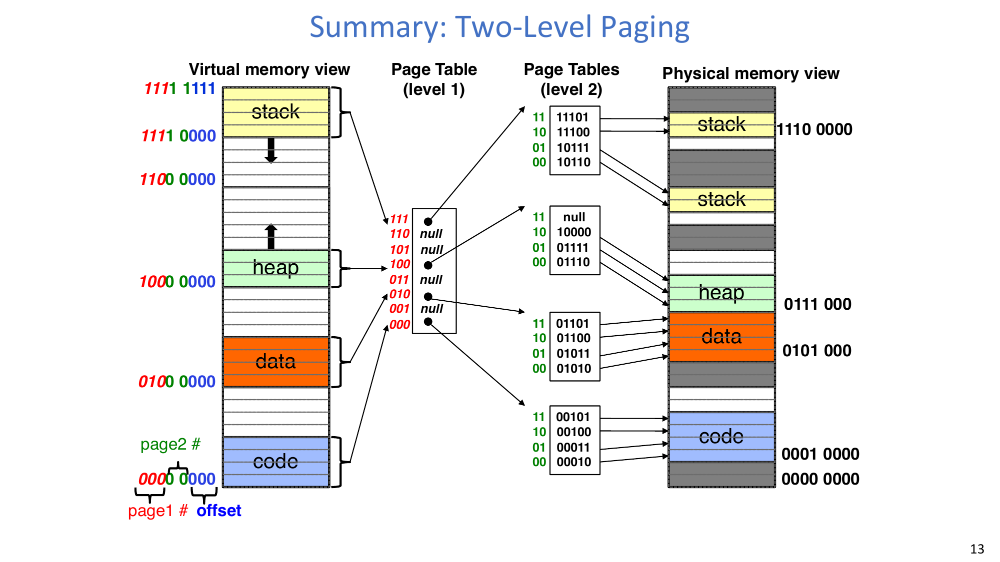

### 2.1 两级拆分如何修复稀疏空间问题
典型 32 位拆分是：
- 一级索引 `10 bits`
- 二级索引 `10 bits`
- 偏移 `12 bits`（对应 4KB 页）

树形结构只在需要时分配二级页表，因此不会为稀疏区域强行分配完整表。

### 2.2 PTE 到底存什么
PTE 包含：
- 指针（指向下一级页表或最终物理页）。
- 标志位（`valid`、读写权限、状态位）。

无效项可能表示：
- 该虚拟区域确实非法/未映射，或
- 页面并不在内存里（例如在磁盘上，OS 通过其他元数据知道位置）。

### 2.3 PTE 的三类关键用途
1. **Demand Paging**：只把活跃页放在内存，不活跃页触发缺页后再调入。
2. **Copy on Write (CoW)**：父子进程先共享只读页，首次写入触发私有副本复制。
3. **Zero Fill On Demand (ZFOD)**：新页逻辑上必须为零，首次访问时再分配并置零。

### 2.4 地址转换示例
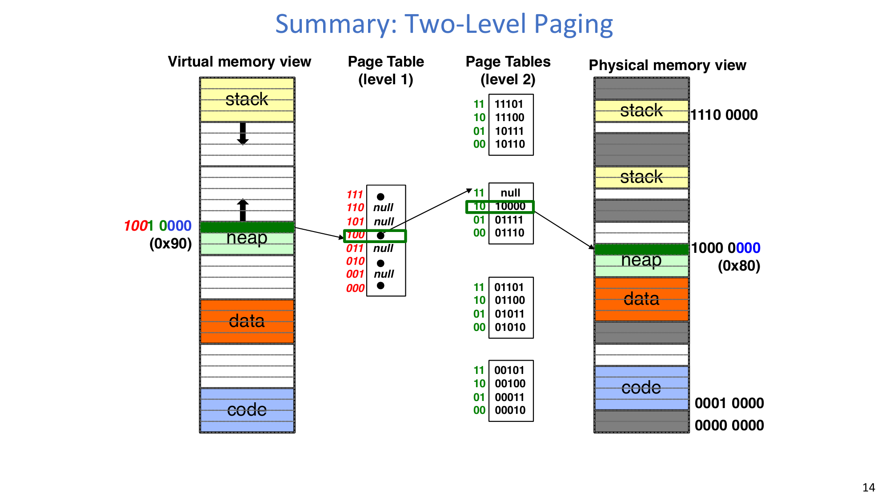

课上示例中：
- 虚拟地址 `0x90`（`1001 0000`）先被拆成一级索引、二级索引和偏移。
- 一级项定位到对应二级页表。
- 二级项给出物理页号。
- 最终物理地址为 `0x80`（`1000 0000`），偏移位保持不变。

### 2.5 Segments + pages 的树形翻译
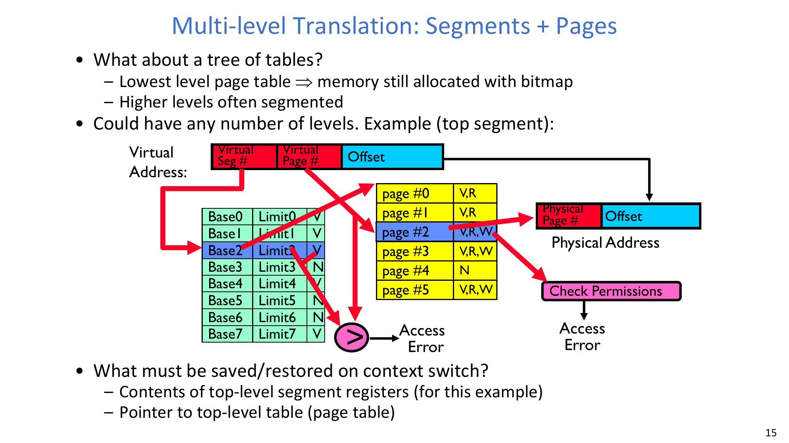

多级转换可以把上层做成 segmentation、下层做成 paging：
- 顶层段元数据先做有效性/边界检查。
- 下层页表再完成物理页映射。
- 即使查到映射，也可能因权限位检查失败而报错。

:::remark 问题：这种设计在上下文切换时必须保存/恢复什么？
至少要恢复顶层转换上下文：若该 ISA 使用段寄存器，则恢复相关段状态；同时恢复顶层页表（根表）指针。
:::

### 2.6 完整区域共享
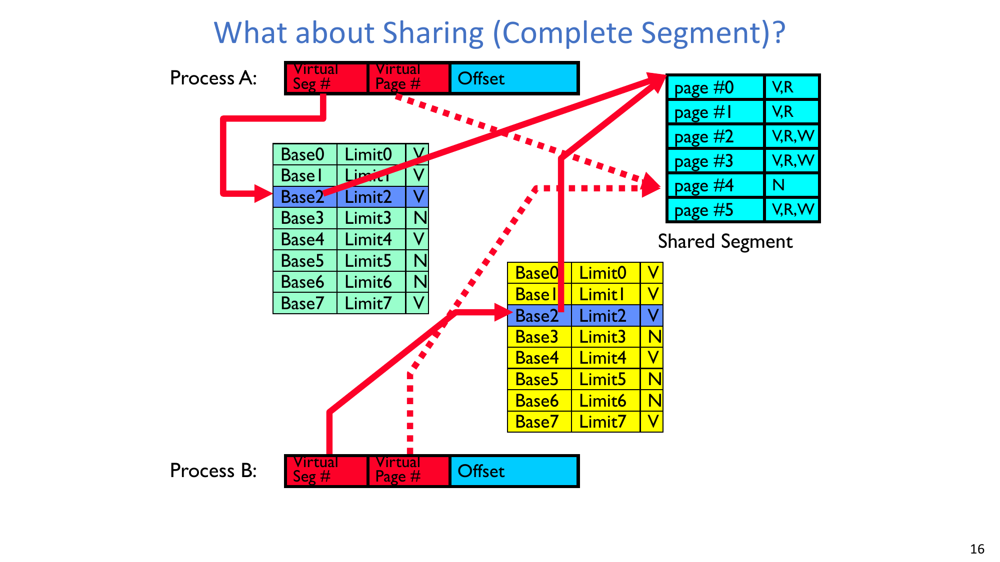

多个进程可以让顶层条目共同指向同一段/同一子树页表，实现“整段共享”。这能高效支持代码与库共享，同时仍可通过权限位保持隔离。

## 3. 64 位翻译深度与保护约束
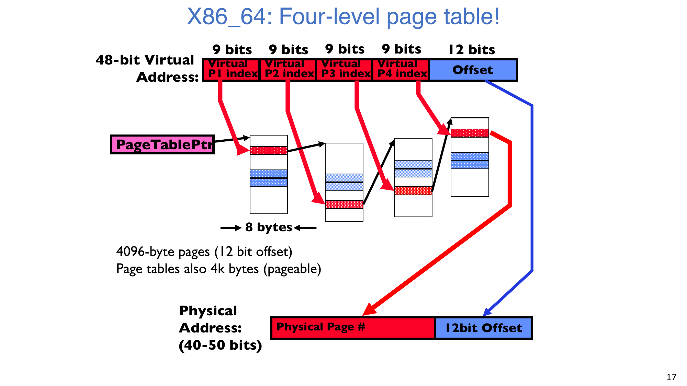

### 3.1 x86_64 常见拆分
48 位 canonical 虚拟地址配合 4KB 页时，常见拆分为：
- `9 + 9 + 9 + 9 + 12`

每个页表项是 8 字节。单个 4KB 页表页可容纳：

$$
\frac{4096}{8}=512=2^9
$$

个条目，正好对应每层 9 位索引。

### 3.2 “继续加层级”并不总是好事
更深的树（例如面向超大 64 位空间的 6 级查找）会带来：
- 更高的转换延迟。
- 稀疏空间下大量“几乎为空”的中间表。

:::remark 问题：多级翻译的优缺点分别是什么？
优点：按需分配页表内存，适配稀疏地址空间，支持页级/子树级共享。  
缺点：每次引用可能触发多次查找，页表页本身也需要管理，缺失时开销高，离不开 TLB。
:::

### 3.3 双模式保护是硬约束
**进程不能修改自己的地址转换表。**  
否则用户态可映射任意物理内存，隔离会被直接破坏。

因此：
- 修改页表基址寄存器和描述符结构等操作必须在内核态执行。
- 页表页必须对用户写保护。
- 用户态只能通过受控异常/陷入/系统调用回到内核态。

## 4. 倒排页表（Inverted Page Table）方案
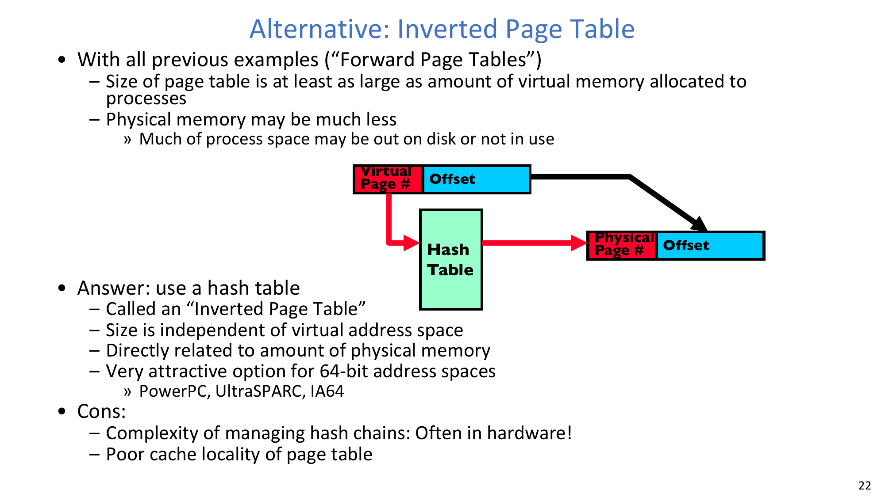

传统正向页表随虚拟空间增长。  
**Inverted Page Table** 使用哈希组织驻留映射，规模更直接与物理内存相关。

优势：
- 对超大虚拟地址空间更有吸引力。
- 不需要为大量未映射稀疏区域分配巨大正向表。

代价：
- 哈希链管理复杂（常需硬件支持）。
- 某些负载下转换元数据局部性较差。

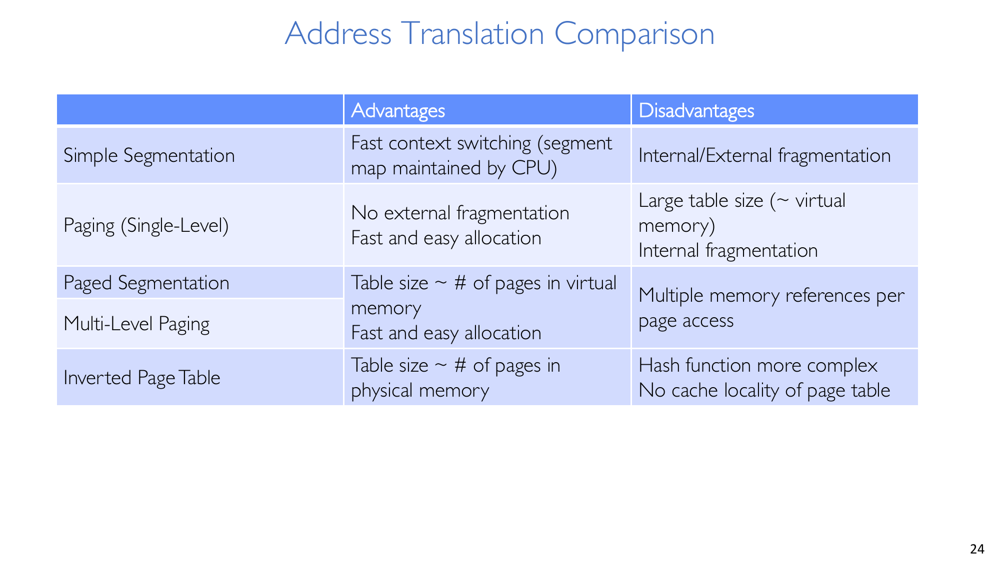

### 4.1 方案对照
| 方案 | 优势 | 劣势 |
|---|---|---|
| 简单分段（Simple Segmentation） | 上下文切换快（CPU 维护段映射） | 内部/外部碎片 |
| 单级分页（Paging, Single-Level） | 无外部碎片；分配简单 | 表规模随虚拟空间增长；内部碎片 |
| 分段分页 / 多级分页（Paged Segmentation / Multi-Level Paging） | 更适合稀疏空间；便于增量分配与共享 | 一次转换可能对应多次内存引用 |
| 倒排页表（Inverted Page Table） | 表规模随物理内存增长 | 哈希复杂；页表局部性较弱 |

## 5. 为什么 MMU 转换必须被缓存
MMU 参与每一次取指、读和写。  
多级页表下，如果每次都完整走表，开销会非常大。

即使是两级结构，单次真实数据访问之前也可能先发生多次元数据读取。若页表项再发生 cache miss 或被换出到磁盘，延迟会进一步放大。

## 6. Caching 基础与 AMAT
Caching 的目标是让高频路径更快，让低频慢路径不主导平均性能。

两个核心局部性定义：
- **Temporal Locality (Locality in Time)**：最近访问过的项很可能很快再次访问。
- **Spatial Locality (Locality in Space)**：相邻地址很可能一起被访问。

平均访存时间：

$$
\text{AMAT}=(\text{Hit Rate}\times\text{Hit Time})+(\text{Miss Rate}\times\text{Miss Time})
$$

且：

$$
\text{Hit Rate}+\text{Miss Rate}=1
$$

课上数值示例（`HitTime=1ns`，DRAM `100ns`，所以 `MissTime=101ns`）：

$$
\text{AMAT}_{90\%}=0.9\times1+0.1\times101=11\text{ns}
$$

$$
\text{AMAT}_{99\%}=0.99\times1+0.01\times101=2\text{ns}
$$

命中率从 90% 提升到 99%，平均延迟会显著下降。

## 7. TLB：缓存“翻译结果”
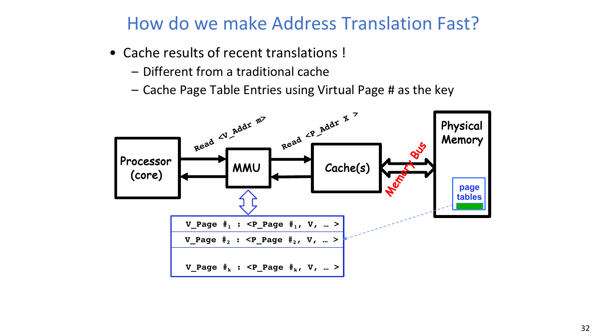

**Translation Look-Aside Buffer (TLB)** 缓存最近的 `VPN -> PPN` 映射（以及权限/有效位）：
- TLB 命中时无需走页表树即可得到转换结果。
- TLB 未命中时才执行页表遍历并回填 TLB。
- 若定位到的 PTE 无效，则触发 page fault。

工程要点：
- TLB 容量通常较小（常见为数百项），并常采用高相联或全相联，因为冲突 miss 代价很高。
- 页表修改后，相关 TLB 项必须失效。
- 在逻辑上 TLB 位于 cache/内存通路之前，或与其进行访问重叠。

:::remark 问题：页级局部性真的足够强，足以支撑 TLB 吗？
是的。指令流常在少量页面内顺序执行，栈访问局部性极强，数据访问也通常存在一定局部性。因此小容量 TLB 往往可以覆盖大多数转换请求。
:::

## 8. Cache Miss 来源与组织方式
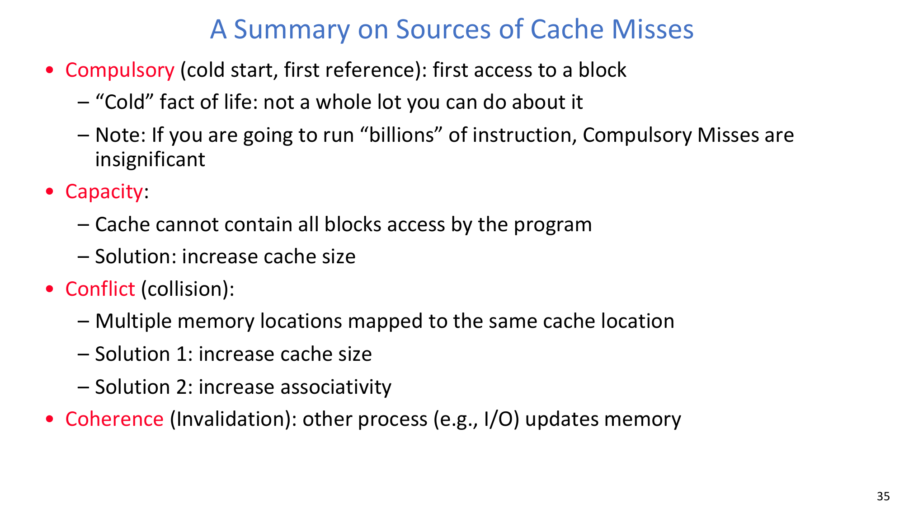

### 8.1 主要 miss 类别
1. **Compulsory misses**：首次访问某块导致的冷启动 miss。
2. **Capacity misses**：工作集超出 cache 容量。
3. **Conflict misses**：映射冲突导致的替换。
4. **Coherence misses**：外部处理器/设备更新导致副本失效。

### 8.2 块地址拆分
块地址通常拆为：
- `Tag`：标识当前缓存的是哪一个内存块。
- `Index`（set select）：选出候选集合或候选行。
- `Block offset`（data select）：选中块内具体字节/字。

### 8.3 直接映射、组相联、全相联
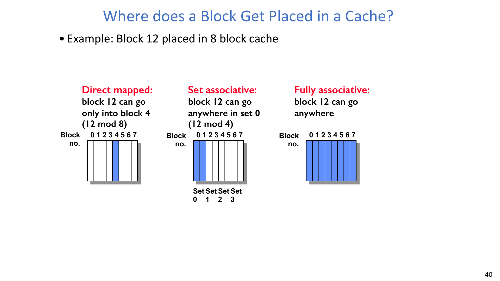

在“8 块 cache 中放置 block 12”的示例里：
- 直接映射：只有一个位置（`12 mod 8 = 4`）。
- 组相联：可放在一个 set 内任意 way（`set = 12 mod #sets`）。
- 全相联：可放在任意行。

相联度越高，通常越能减少冲突 miss，但硬件比较与选择复杂度会升高。

### 8.4 miss 时替换谁
:::remark 问题：发生 miss 时应替换哪个块？
直接映射只有唯一候选。  
组相联和全相联需要替换策略，常见是 Random 或 **LRU (Least Recently Used)**（现实硬件常用 LRU 近似）。
:::

### 8.5 写策略
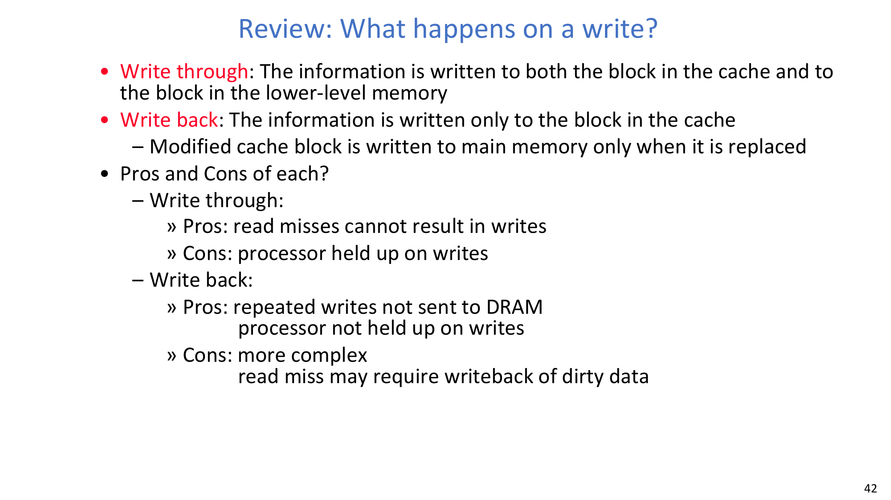

- **Write through**：同时写 cache 和下层存储。
  - 优点：读 miss 不会被“脏块回写”额外阻塞。
  - 缺点：写操作可能被下层写流量拖慢。
- **Write back**：先只写 cache，脏块被替换时再回写下层。
  - 优点：同一块的重复写不会反复打到 DRAM。
  - 缺点：需要脏位管理；读 miss 时可能先回写脏块再装入新块。

## 9. 关键结论
- 简单页表概念清晰，但在大规模稀疏虚拟空间下代价过高。
- 多级页表通过按需分配显著减少无效元数据占用。
- 倒排页表用更高复杂度换来“随物理内存扩展”的表规模。
- 没有缓存，地址转换开销会主导访存延迟。
- TLB 是虚拟内存高性能落地的关键翻译缓存。
- cache 的映射方式、相联度、替换策略与写策略共同决定 miss 行为和系统性能。

## 附录 A. Exam Review
### A.1 必记定义
- **Page table**：把虚拟页号映射到物理页号并携带权限/状态的元数据结构。
- **PTE (Page Table Entry)**：单条翻译记录，含指针和标志位。
- **TLB**：最近地址转换结果的硬件缓存。
- **Temporal locality**：时间局部性，最近用过的数据很快还会被用到。
- **Spatial locality**：空间局部性，邻近地址常被连续访问。

### A.2 必记公式
$$
\text{#pages}=\frac{\text{virtual space size}}{\text{page size}}
$$

$$
\text{Page-table size}=\text{#entries}\times\text{entry size}
$$

$$
\text{AMAT}=(\text{Hit Rate}\times\text{Hit Time})+(\text{Miss Rate}\times\text{Miss Time})
$$

### A.3 高频简答题
1. 为什么稀疏地址空间会让单级页表低效？
2. TLB 具体缓存什么？TLB miss 后会发生什么？
3. 为什么用户进程不能修改地址转换表？
4. 直接映射、组相联、全相联在块放置上有什么本质差异？
5. write-through 与 write-back 的延迟和复杂度差异是什么？

### A.4 常见误区
- 忘记页内偏移在虚拟地址到物理地址转换中保持不变。
- 把“无效 PTE”误解为唯一语义（它也可能表示“不在内存但位置已知”）。
- 忽略页表更新后的 TLB 失效要求。
- 把 conflict miss 和 capacity miss 混为一谈。
- 误以为相联度越高就一定更优，而忽略硬件代价。
