# Lec16 - 内存 3：按需分页

## 学习目标
学完本讲后，你应当能够把地址转换、TLB、cache、page fault、backing store、working set 和替换策略串成一个完整的虚拟内存故事。你还应当能够计算 page fault 对有效访问时间的影响，并解释为什么极小的缺页率也可能主导系统性能。

## 1. 地址转换回顾
虚拟内存之所以成立，是因为每个用户地址在到达物理内存前都会先被转换。地址转换机制同时提供三个性质：
- **重定位（Relocation）**：进程可以像拥有一个干净的虚拟地址空间一样运行。
- **保护（Protection）**：非法或未授权的访问会在转换过程中被拒绝。
- **灵活放置（Flexible placement）**：一个虚拟页可以由物理页框、磁盘，或者其他后备对象支持。

### 1.1 Base-and-bound 转换
在 base-and-bound 设计中，CPU 产生的虚拟地址先与 bound 做边界检查，然后通过加上 base 完成重定位。base 表示进程区域在物理内存中的起始地址；bound 表示该区域的合法大小。

这种设计简单且快速，但它把进程视为一个基本连续的区域。因此，它很难让 stack 和 heap 独立增长，也不便于共享选定区域或高效处理稀疏地址空间。

:::remark 问题：在 base-and-bound 下，程序能否访问 OS 或其他程序？
只有在硬件/OS 错误设置 base 和 bound 时才可能。用户引用一旦超出合法区间，会在变成物理地址之前被 bound 检查拦下。这就是重定位硬件的保护作用：程序可以计算任意虚拟地址，但只有位于自身合法区间内的地址才会被转换。
:::

### 1.2 Segmentation
Segmentation 将 base-and-bound 推广为一个进程拥有多个可变大小的区域。虚拟地址拆分为：
- `segment number`
- `offset`

segment number 选择一个 segment-map entry，其中包含 base、limit、valid bit 和 permissions。offset 必须落在 limit 内；随后硬件把 base 加到 offset 上形成物理地址。x86 等体系结构通过段寄存器体现这一思想，例如 `mov [es:bx], ax` 这样的指令会使用 `es` 段和 `bx` 偏移。

:::remark 问题：segment 或 page-table entry 中的 `V/N` 是什么？
`V/N` 表示 **valid / not valid**。在 segmentation 中，它说明该段项是否可以使用。在 paging 中，not-valid entry 可能表示非法/未映射页面，也可能表示一个合法页面只是当前不在内存中，需要由 OS 处理。
:::

Segmentation 提高了灵活性，但由于 segment 是可变大小的，它仍然会遭遇外部碎片和放置复杂度。

### 1.3 简单分页
Paging 将内存切成固定大小的 page 和 frame。虚拟地址拆分为：
- `VPN`（virtual page number）
- `offset`

`VPN` 用于索引页表项（PTE），`offset` 原样复制到物理地址中。PTE 保存物理页/页框号，以及权限位和状态位。

固定大小的页让分配变得简单，并避免外部碎片，但单级页表可能非常巨大。例如，一个 32 位虚拟地址若使用 10-bit offset，就有 22-bit virtual page number，因此页表大约需要四百万个条目。若使用 4KB page，常见 32 位拆分是 `20-bit VPN + 12-bit offset`，完整物化的单级页表仍然需要 `2^20` 个 PTE。

### 1.4 两级与多级页表
两级分页把页表视为一棵树。经典 32 位、4KB-page 拆分是：
- `10 bits` 一级索引
- `10 bits` 二级索引
- `12 bits` 偏移

如果每个条目是 4 字节，那么每个页表页包含 1024 个条目。上下文切换时，OS 可以通过修改一个页表根寄存器来切换地址空间，例如 x86-like 设计中的 `CR3`。

关键的扩展技巧在于：无效的顶层条目意味着对应的二级页表根本不需要存在。甚至二级页表页本身如果当前不需要，也可以被放到磁盘上。

多级转换把同样思想扩展成更深的树。有些设计把上层做成 segmentation、下层做成 paging：上层条目做粗粒度有效性和边界检查，下层页表映射单个页面。

:::remark 问题：segments plus pages 的设计在上下文切换时必须保存/恢复什么？
OS 必须恢复顶层转换上下文。这包括页表根指针；在 segmented design 中，还包括相关段寄存器或段表状态。否则，同一个虚拟地址会被解释到错误的地址空间中。
:::

### 1.5 倒排页表
普通正向页表的规模随虚拟地址空间大小增长。**Inverted Page Table** 则保存驻留物理页框的信息，并通过哈希表定位某个 `(process, virtual page)` 对应的映射。

它的规模与物理内存而不是虚拟地址空间相关，因此对大型 64 位地址空间很有吸引力。代价是哈希查找和冲突链更复杂，而且局部性通常不如紧凑的页表树遍历。

### 1.6 地址转换设计对比
| 方案 | 优势 | 劣势 |
|---|---|---|
| Simple Segmentation | CPU 维护 segment map 时，上下文切换快 | 内部/外部碎片 |
| Single-level Paging | 没有外部碎片；物理页分配简单 | 页表大小随虚拟内存增长；仍有内部碎片 |
| Paged Segmentation / Multi-level Paging | 页表大小更接近实际使用的虚拟页数；分配仍简单 | 一次转换可能需要多次内存引用 |
| Inverted Page Table | 表规模随物理内存增长 | 哈希复杂；页表局部性较弱 |

## 2. 地址转换缓存：TLB 与 Cache 的交互
如果没有缓存，每一次取指、load 和 store 都可能要在真正访问内存前先走一遍页表。系统因此用 **Translation Look-Aside Buffer (TLB)** 缓存地址转换结果。

### 2.1 TLB 局部性
TLB 缓存最近的 `VPN -> PPN` 映射，同时携带保护和状态元数据。TLB 之所以有效，是因为页级局部性确实存在：
- 指令获取通常会在同少数几个页面内顺序推进。
- 栈活动具有很强的局部性。
- 数据访问的局部性较弱，但仍然有用。

:::remark 问题：能否有 TLB hierarchy？
可以。就像数据 cache 一样，TLB 也可以有多个层级，容量和访问延迟不同。小而快的 L1 TLB 捕获最常见情况，更大的下层 TLB 则减少昂贵的页表遍历。
:::

### 2.2 Physically indexed 与 virtually indexed cache
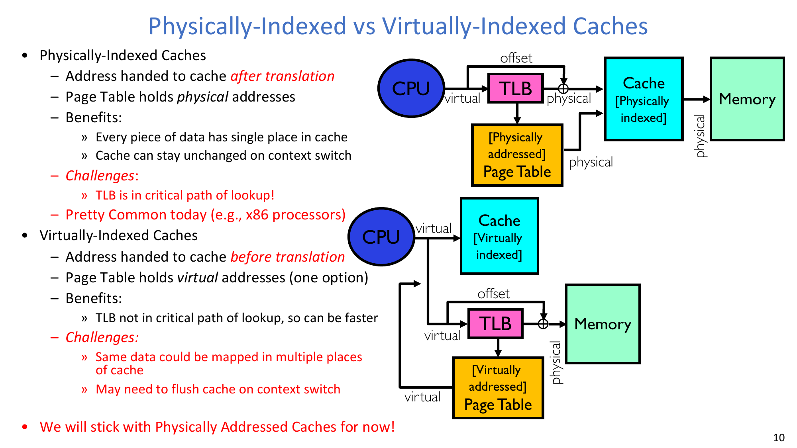

**Physically indexed cache** 在地址转换之后接收物理地址。这样每个物理字节只有一个规范的 cache 位置，并且 cache 可以较干净地跨上下文切换保留。代价是 TLB lookup 位于 cache access 的关键路径上。

**Virtually indexed cache** 在地址转换前就使用虚拟地址开始查找。这可能更快，因为 TLB 不那么直接地压在关键路径上，但它带来两个棘手问题：
- 同一份物理数据可能出现在多个虚拟地址下，形成 synonyms/aliases。
- 上下文切换后，不同进程都可能使用虚拟地址 `0`，因此 cache entry 可能需要进程标签或被 flush。

为了便于后续推理，下面主要使用 physically addressed cache。

### 2.3 什么样的 TLB 组织是合理的？
TLB 必须极快，因为它的 hit time 是常见访存路径的一部分。这推动设计者考虑 direct-mapped 或低相联结构。

但同时，TLB miss 极其昂贵，因为它可能触发多级页表遍历。Conflict miss 尤其痛苦。如果使用 page number 的低位作为 TLB index，代码第一页、数据第一页和栈第一页很容易互相冲突。如果改用高位作为 index，小程序又可能让 TLB 大部分空间空置。

因此，小型 TLB 往往采用高相联或全相联结构。TLB 本身足够小，相联查找是可行的：经典 TLB 可能有 128 到 512 个条目，现代更大的系统也仍会把 TLB 当作珍贵的硬件结构。

TLB entry 必须包含保护信息，而不只是地址。通过虚拟地址查找后，返回内容包括：
- 物理页/页框号
- valid/status 信息
- read/write/execute 或 user/supervisor access 等权限

如果全相联查找太慢，可以在前面放一个很小的 direct-mapped 前端，通常称为 **TLB slice**，用于缓存最近少数几个转换。

### 2.4 重叠 TLB 与 cache 访问
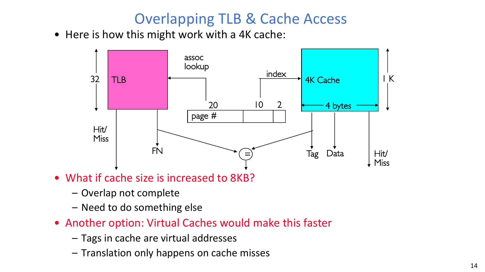

对 physically indexed cache 来说，TLB 和 cache 看起来是串行的：先翻译，再索引 cache。硬件可以通过重叠两个操作来降低这部分成本。

关键观察是：**page offset 在地址转换中不会改变**。如果 cache index 和 byte offset 完全落在 page offset 位中，那么 cache 可以在 TLB 仍在翻译 virtual page number 时先开始选择候选字节。

在讲义示例中，一个 4KB cache 配合 4-byte line 使用：
- `10 bits` cache index
- `2 bits` byte offset

这 12 位正好放入 4KB page offset，因此 cache index 可以在转换完成前确定。

:::remark 问题：如果 cache size 增加到 8KB 会怎样？
8KB direct-mapped cache 需要多一个 index bit。若 line size 仍为 4 字节，则 cache 需要 `11 index bits + 2 byte bits = 13 bits`，但 4KB page offset 只有 12 位。多出来的一个 index bit 来自 virtual page number，而它对应的 physical value 要等 TLB lookup 完成后才知道。因此，干净的 overlap 会失效，除非设计使用更高相联度、page coloring、virtual indexing 或其他 cache/TLB pipeline 技巧。
:::

### 2.5 上下文切换与 TLB consistency
TLB entry 把某个地址空间中的虚拟页映射到物理页。上下文切换之后，同一个 virtual page number 可能表示完全不同的内容。OS 有两个主要选择：
- 每次切换地址空间时 **invalidate 或 flush TLB**。这很简单，但代价高。
- 在每个 TLB entry 中 **加入 process identifier/address-space identifier**。这样多个地址空间的转换可以安全共存。

页表变化时也必须维护 TLB consistency。如果页面从内存移到磁盘、从磁盘移到内存，或者权限发生变化，任何过时的 TLB entry 都必须失效；否则处理器可能继续使用旧转换。

### 2.6 把 translation、TLB 与 cache 合在一起
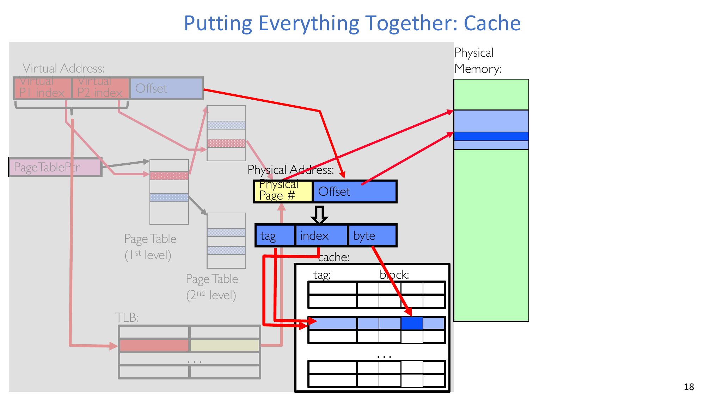

一次完整内存引用通常遵循以下路径：
1. CPU 产生虚拟地址。
2. TLB 使用 virtual page number 查找，可能还会使用 address-space identifier。
3. TLB hit 时，硬件检查权限并返回 physical page number。
4. TLB miss 时，硬件或软件遍历页表。如果 PTE valid，则回填 TLB；如果 PTE 对这次引用无效，则访问变成 page fault。
5. 物理地址拆分为 cache tag、index 和 byte offset。
6. Cache hit 时，请求数据快速返回。
7. Cache miss 时，访问更低层内存并回填 cache。

这组图按阶段搭建流程：先是页表转换，再是 TLB 快捷路径，最后是物理 cache 查找。每一阶段的关键变化都是用快速常见路径替代慢路径，同时保留 miss 时可用的慢路径。

## 3. Page Fault 与 Demand Paging
**A page fault occurs when the Virtual-to-Physical Translation fails.** 它是由当前正在执行的指令触发的同步 fault/trap，而不是异步 interrupt。

### 3.1 为什么会发生 page fault
一次引用可能 fault，原因包括：
- PTE 被标记为 invalid。
- 引用违反 privilege level。
- 访问模式违反权限，例如写入只读页。
- 被引用的映射根本不存在。

Protection violation 通常会终止 faulting instruction 或进程。其他 page fault 则可能是可恢复的：OS 可以分配新的 stack page、实现 copy-on-write、改变可访问性，或者从 secondary storage 把页面调入内存。

这是硬件/软件边界的一种根本反转。硬件精确检测失败的转换，但由软件决定这个 fault 是非法访问还是可修复缺页。

### 3.2 Demand paging as caching
现代程序和系统想使用的内存往往超过 DRAM 能同时容纳的范围，但程序并不会一直使用自身全部地址空间。经典 **90-10 rule** 说，程序常常把约 90% 的时间花在约 10% 的代码上。

解决方案是 **Demand Paging: Treating the DRAM as a cache on disk**。页面只在真正需要时才被调入内存。

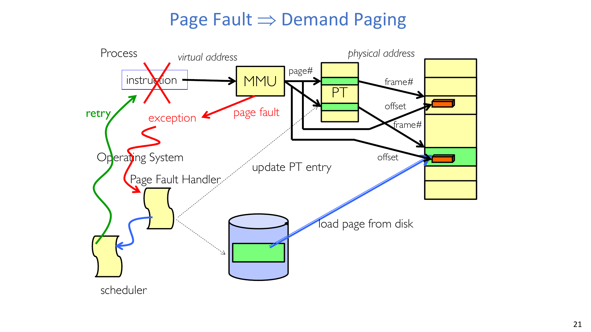

把 demand paging 理解为 caching，可以得到一张有用的对应表：
| Cache 问题 | Demand paging 中的回答 |
|---|---|
| Block size 是多少？ | 一个 page，例如 4KB |
| Organization 是什么？ | Fully associative，因为任意虚拟页都可以放入任意物理页框 |
| 如何定位页面？ | 先查 TLB；必要时遍历 page table |
| Miss 时发生什么？ | Trap 到 OS，定位磁盘/backing store 上的页面，读入内存，更新元数据，然后重试 |
| Write 时发生什么？ | 类似 write-back：标记 dirty，只在需要时写回 |

:::remark 问题：为什么 demand paging 像 cache？它又和普通硬件 cache 有何不同？
它像 cache，是因为 DRAM 保存的是一部分页面，而这些页面的后备副本位于磁盘或其他更低层对象中。它不同于普通硬件 cache，是因为 miss 由 OS 处理，miss penalty 极其巨大，并且替换决策会和进程调度、磁盘带宽、公平性相互影响。
:::

### 3.3 无限内存假象
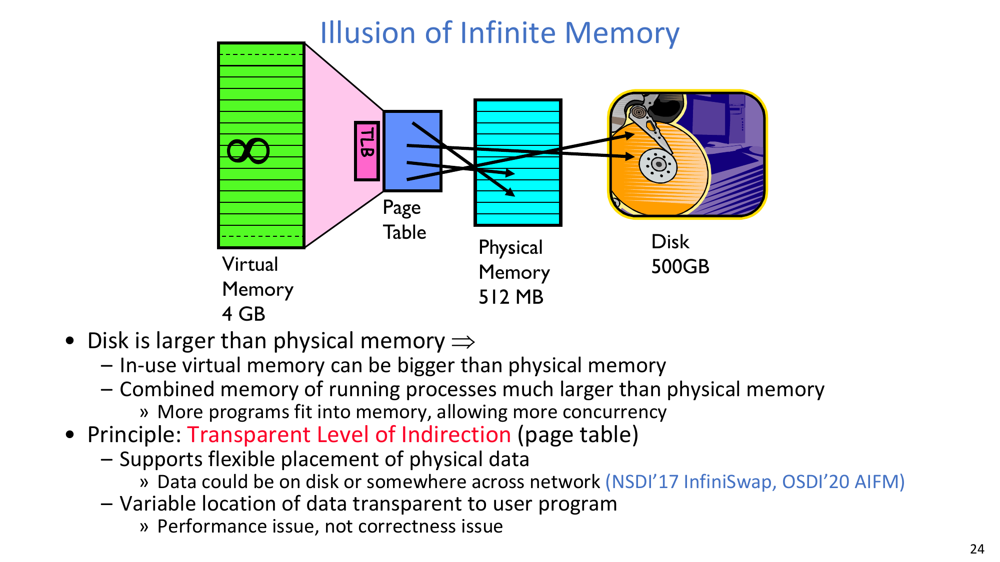

Demand paging 让每个进程看起来拥有很大的虚拟内存，即使物理内存更小。页表是透明的间接层：程序看到稳定的虚拟地址，而 OS 可以把页面放在 DRAM、磁盘，甚至网络后备的内存系统之后。

这种透明性影响的是性能，而不是正确性。如果页面不驻留，程序可能因为 page fault 暂停，但虚拟地址本身仍然有意义。

## 4. Demand Paging 机制
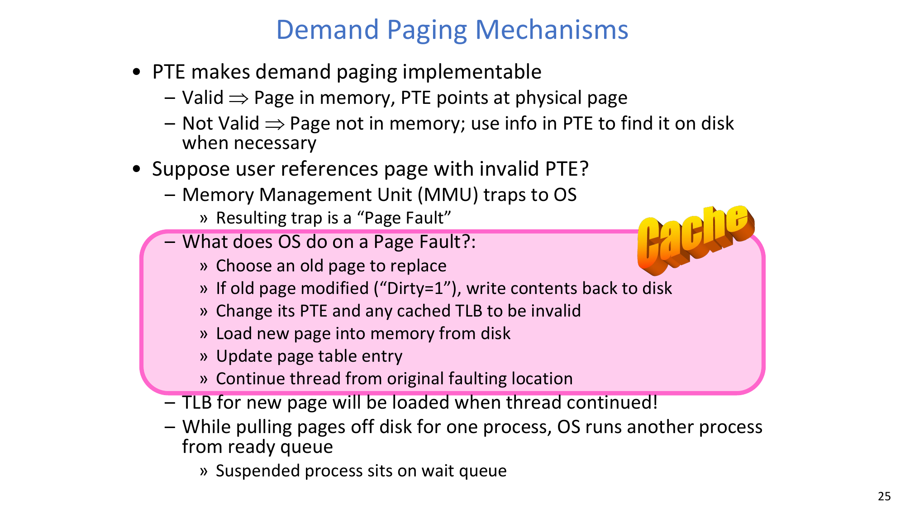

Demand paging 之所以可实现，是因为 PTE 可以同时表示 resident 和 non-resident 状态：
- **Valid => Page in memory, PTE points at physical page**。
- **Not Valid => Page not in memory; use info in PTE to find it on disk when necessary**。

当用户引用一个 PTE invalid 的页面时，MMU 会 trap 到 OS。这个 trap 的结果就是 **page fault**。

:::remark 问题：OS 在 page fault 上做什么？
OS 首先判断这个 fault 是否合法且可修复。如果页面应当存在但当前不驻留，OS 会选择一个 frame，必要时驱逐旧页面；如果旧页面是 dirty，则把它写回磁盘；随后把旧 PTE 和任何缓存的 TLB entry 置为 invalid；再从磁盘加载新页面，更新页表，并让线程从原来的 faulting instruction 继续执行。新页面的 TLB entry 会在线程继续运行时被加载。
:::

在缺失页面从磁盘读取期间，faulting process 会被放入 wait queue，scheduler 可以运行另一个 ready process。这种重叠至关重要，因为磁盘/page-fault service time 远远长于 CPU 时间。

## 5. Backing Store、Executable 与 Virtual Address Space
### 5.1 历史动机与现代动机
历史上，paging 的动机来自内存相对较小、磁盘较大、并且许多用户通过终端连接的系统。大部分地址空间保存在磁盘上，内存则尽量装满频繁访问的页面，并主动把页面在磁盘和内存之间换入换出。

现代系统看起来不同：单台机器可能拥有大量 DRAM、大容量本地磁盘和远程/cloud storage。但动机仍然存在，因为应用程序、共享库、文件 cache 和多个进程合起来使用的虚拟内存可以远远超过物理 DRAM。

真实机器快照可能显示内存长期保持约 80% 使用率，并且大量内存在进程之间共享。共享页面是虚拟内存并不等同于“每个进程一份私有拷贝”的原因之一。

### 5.2 Virtual memory 与 demand paging 的许多用途
Demand paging 支持多种重要 OS 行为：
- **Extend the stack**：当栈增长到新页时，分配一个 page 并将其清零。
- **Extend the heap**：先保留虚拟空间，只有 heap 被实际触及时才分配物理页框。
- **Process fork**：复制页表，让 entry 指向父进程页面并标记 no-write，让 shared read-only pages 保持共享，并只在第一次写入时复制页面。
- **Exec**：只按需调入 binary 中正在活跃使用的部分。
- **MMAP**：显式共享某个区域，或者像访问 RAM 一样访问文件。

这些例子都使用同一个核心技巧：虚拟映射可以先于物理页框提交而存在，page fault 再补齐缺失的物理状态。

### 5.3 将 executable 加载到内存
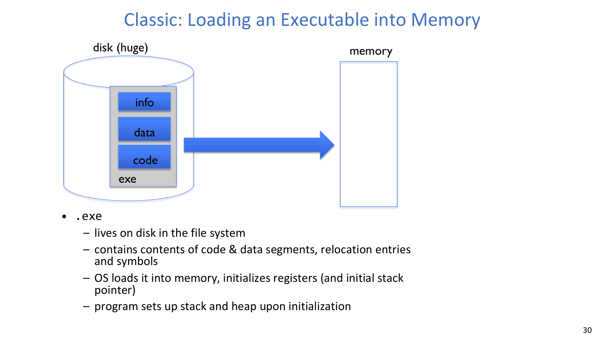

Executable file 位于文件系统的磁盘上。它包含 code segment、data segment、relocation entries、symbols 和 metadata。为了启动程序，OS 创建进程状态，初始化寄存器和 initial stack pointer，并为 executable 的各个区域创建虚拟映射。

OS 不必立刻把整个 executable 读入 DRAM。Code 和 data pages 可以在进程第一次触及时，从 executable image 中按需分页调入。

### 5.4 每个虚拟地址空间的 backing store
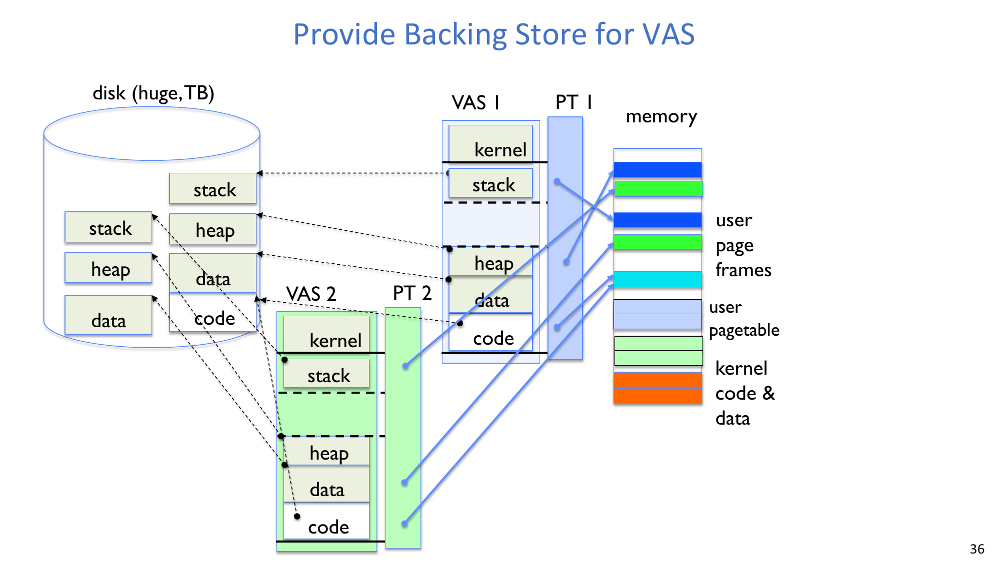

每个进程都有自己的 virtual address space 和自己的页表视图。Resident pages 的 PTE 指向物理页框。Non-resident 但 valid 的页面则需要 OS 记录其磁盘/backing 位置。

用于保存这些页面的磁盘区域称为 **backing store** 或 **swap file**。它通常实现为优化过的 block store，但概念上可以把它看作存放 page-sized blocks 的 file-like region。

对每个已经使用的虚拟区域，OS 必须知道：
- 它的 resident physical frame 在哪里，或
- 它的 non-resident backing block 在哪里。

:::remark 问题：什么数据结构负责把 non-resident pages 映射到磁盘？
概念上，OS 需要 `FindBlock(PID, page#) -> disk_block`。有些系统会在 PTE invalid 时使用 PTE 的空闲位保存 disk-block 信息；另一些系统会维护单独的软件结构。如果 swap space 在磁盘上连续，这个结构可以很紧凑；也可以像 inverted page table 一样使用哈希。这个结构类似页表，但它是纯软件元数据，用于寻找 backing storage。
:::

通常 OS 也希望 resident pages 拥有 backing store，因为驻留页面之后可能需要被驱逐。干净的 code pages 往往可以直接映射到磁盘上的 executable image，从而不必在 swap file 中再保存一份副本。同一程序的多个实例也可以共享 code pages。

## 6. Page Fault 处理步骤
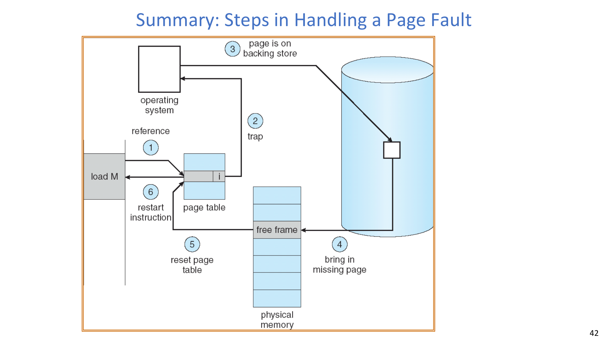

一次可恢复的 demand-paging fault 通常按如下步骤进行：
1. 进程引用了一个 PTE invalid 或 non-resident 的虚拟页。
2. MMU trap 到 OS page-fault handler。
3. OS 验证该页面是否合法且可修复，并识别其 backing-store 位置。
4. OS 获取一个 free frame；如果必要，则选择一个 victim frame。
5. 如果 victim page 是 dirty，OS 安排它写回磁盘。
6. OS 开始把缺失页面读入选中的 frame。
7. I/O 进行期间，faulting thread 等待，另一个 ready thread/process 可以运行。
8. I/O 完成后，OS 更新 PTE，使其指向新 frame，并使相关 TLB state 失效或刷新。
9. Faulting thread 最终被重新调度，并重启原来的指令。

重启原指令非常重要：从程序视角看，这次内存访问只是花了特别久，然后成功了。

### 6.1 Free frame 从哪里来？
OS 通常维护一个 physical frames 的 free list。如果内存变得太满，Unix-like 系统可能运行后台 page-out daemon 或 "reaper"，它会：
- 安排 dirty pages 写回磁盘，
- 清零一段时间没有被访问的 clean pages，
- 准备可以快速重用的 frames。

作为最后手段，OS 必须先驱逐一个页面，才能满足 fault。这直接引出 replacement-policy 问题。

:::remark 问题：这些机制应该如何组织？
它们应当围绕 replacement policy 和 resource allocation 组织。OS 必须决定保留哪些页面、后台清理哪些 dirty pages、每个进程获得多少 frame，以及如何分配 disk paging bandwidth。这类似 CPU scheduling：utilization、fairness 和 priority 都很重要。
:::

## 7. Working Set Model 与 Page-Fault Cost
### 7.1 Working set model
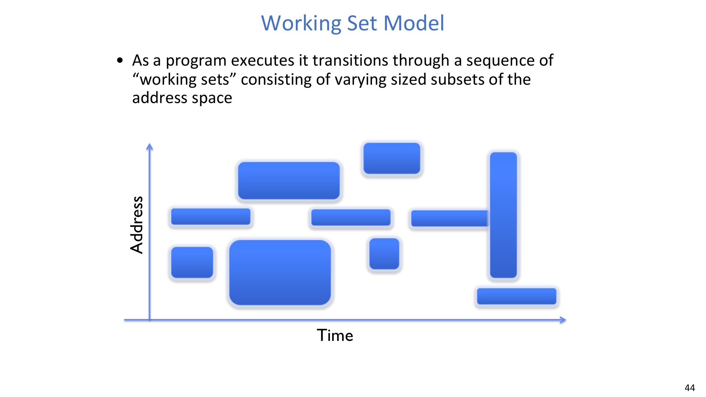

程序执行时，会经历一系列 **working sets**：也就是在某个时间区间内被活跃使用、大小不同的地址空间子集。一个循环可能使用一个 working set；一次函数调用可能切换到另一个 working set；加载新模块可能临时形成更大的 working set。

OS 希望活跃 working set 能够装入内存。如果能装下，进程会以很少的 fault 运行；如果装不下，进程就会反复 fault，并驱逐很快又会重新需要的页面。

### 7.2 Working set model 下的 cache 行为
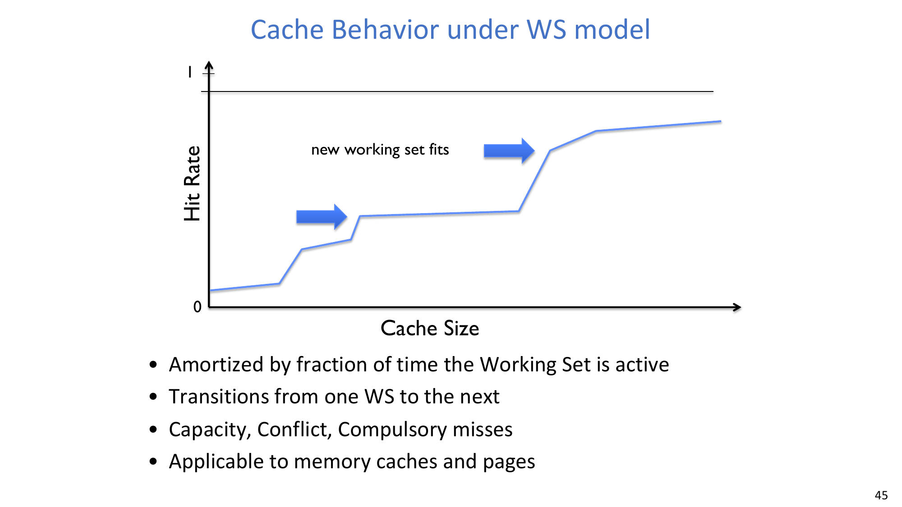

随着 cache 或内存大小增加，hit rate 通常会上升，但不一定平滑。它经常在某个完整 working set 能够放下时阶梯式上升。新的 working set 会形成新的平台：一开始很多页面 miss，活跃集合驻留后 hit rate 才改善。

用于 cache 的 miss 分类也适用于 demand paging：
- **Compulsory misses**：页面第一次被调入内存。
- **Capacity misses**：活跃 working set 大于可用内存。
- **Conflict misses**：严格来说在 virtual memory 中不存在，因为 page cache 是 fully associative；任意 page 可以放入任意 frame。
- **Policy misses**：页面曾在内存中，但 replacement policy 过早驱逐了它。

:::remark 问题：如何减少这些 page-cache misses？
Compulsory misses 可以通过 prefetching 减少，但前提是能预测未来访问。Capacity misses 需要更多可用内存，或在进程之间做更好的内存分配。Conflict misses 对 demand paging 不是核心问题，因为物理页框是 fully associative。Policy misses 需要更好的 replacement policy，例如用 LRU 近似来避免过早驱逐有用页面。
:::

### 7.3 Demand paging cost model
由于 demand paging 的行为类似 caching，可以用 **Effective Access Time (EAT)** 计算平均访问时间：

$$
EAT = HitRate \times HitTime + MissRate \times MissTime
$$

因为 `HitRate + MissRate = 1`，也可以写成：

$$
EAT = HitTime + MissRate \times MissPenalty
$$

其中：

$$
MissPenalty = MissTime - HitTime
$$

示例：
- Memory access time 是 `200 ns`。
- Average page-fault service time 作为 miss penalty，为 `8 ms`。
- 令 `p` 表示发生 page fault 的概率。

于是：

$$
EAT = 200ns + p \times 8ms
$$

将 `8 ms` 转换为纳秒：

$$
EAT = 200ns + p \times 8{,}000{,}000ns
$$

如果每 1,000 次访问中有 1 次发生 page fault，则 `p = 0.001`：

$$
EAT = 200ns + 0.001 \times 8{,}000{,}000ns = 8{,}200ns = 8.2\mu s
$$

相对 200 ns 的普通内存访问，这大约是 40 倍 slowdown。Page fault 太昂贵，因此看似很小的 miss rate 也可能支配性能。

:::remark 问题：如果希望 slowdown 小于 10%，需要怎样的缺页率？
需要 `EAT < 200ns x 1.1 = 220ns`。由 `EAT = 200ns + p x 8,000,000ns` 可得，需要 `p x 8,000,000ns < 20ns`，因此 `p < 2.5 x 10^-6`。这大约等于每 400,000 次内存访问才发生 1 次 page fault。
:::

### 7.4 替换策略
当内存满时，OS 必须选择一个 victim page。常见策略包括：
- **FIFO**：把页面放入队列，替换队尾页面。
- **Random**：每次替换随机选择一个页面。
- **MIN**：替换未来最久才会再次使用的页面。这是最优策略，但在线不可实现，因为未来未知。
- **LRU**：替换过去最久没有使用的页面。它近似利用“最近过去的使用预示近期未来使用”的思想。

Replacement policy 很重要，因为一次糟糕决策的成本不只是 cache miss，而可能是一个 8 ms 级别的磁盘 page fault。

## 8. 关键结论
- **Demand Paging: Treating the DRAM as a cache on disk** 是本讲的中心思想。
- 页表追踪哪些页面驻留在内存中，哪些页面需要 OS 介入。
- Page fault 是 failed virtual-to-physical translation 导致的精确同步 trap。
- TLB 让地址转换变快，但 TLB entry 必须携带保护信息，并在上下文切换和页表更新时保持一致。
- Physically indexed cache 简化正确性，但把地址转换放到关键路径上；当 cache index bits 能放入 page offset 时，overlap 才能顺利发生。
- Backing store 将非驻留虚拟页连接到磁盘块。
- Working set model 解释了为什么活跃集合能放下时内存压力较温和，而放不下时会灾难性恶化。
- 在示例 cost model 中，即使 page-fault probability 只有 1/1000，也会带来约 40 倍 slowdown。

## 附录 A. Exam Review
### A.1 必记定义
- **Page fault**：virtual-to-physical translation 失败时产生的同步 fault/trap。
- **Demand paging**：只在页面被引用时才把它调入 DRAM，把 DRAM 作为 disk/backing store 的 cache。
- **Backing store / swap file**：用于保存虚拟页 page-sized backing blocks 的磁盘存储。
- **Resident page**：当前位于物理内存中的虚拟页。
- **Non-resident page**：内容当前不在物理内存中的合法虚拟页。
- **Dirty page**：在内存中被修改过、驱逐前需要写回的驻留页。
- **Working set**：某个时间区间内进程活跃使用的地址空间子集。
- **TLB consistency**：当页表或权限变化时，使缓存转换失效或更新。

### A.2 必记公式
$$
EAT = HitRate \times HitTime + MissRate \times MissTime
$$

$$
EAT = HitTime + MissRate \times MissPenalty
$$

$$
MissPenalty = MissTime - HitTime
$$

对讲义示例：

$$
EAT = 200ns + p \times 8{,}000{,}000ns
$$

为了让 slowdown 小于 10%：

$$
p < 2.5 \times 10^{-6} \approx \frac{1}{400{,}000}
$$

### A.3 Page fault 处理清单
1. 检测 failed translation 并 trap 到 OS。
2. 验证该引用是否合法且可修复。
3. 在 backing store 中定位缺失页面。
4. 获取 free frame 或选择 victim。
5. 如果 victim 是 dirty，则写回。
6. 将缺失页面读入内存。
7. 更新 PTE 和 TLB state。
8. 重启原来的指令。

### A.4 高频简答题
1. 为什么 invalid PTE 既可能表示“非法”，也可能表示“尚未驻留”？
2. 为什么 demand paging 是 fully associative cache？
3. 为什么 demand paging 中 write-back 比 write-through 更合理？
4. 为什么页表变化后必须使 stale TLB entries 失效？
5. 为什么 1/1000 的 page-fault rate 会造成巨大 slowdown？
6. Demand paging 中 compulsory、capacity、conflict 和 policy misses 有何区别？

### A.5 常见误区
- 把 page fault 当成异步 interrupt，而不是同步 trap。
- 忘记 protection fault 和 demand-paging fault 的 OS 处理结果不同。
- 忽略磁盘 I/O 进行期间的 wait-queue/scheduler 步骤。
- 误以为物理内存必须包含每个运行进程的每个虚拟页。
- 混淆 backing store metadata 和硬件页表遍历。
- 误以为 conflict misses 是 demand paging 的核心问题；page cache 是 fully associative，因此 policy 和 capacity 更关键。
