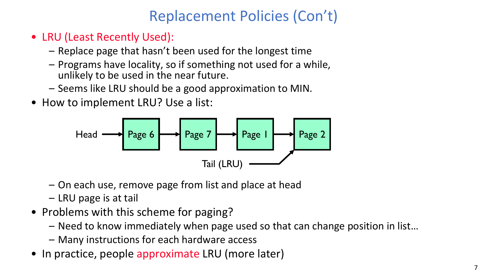
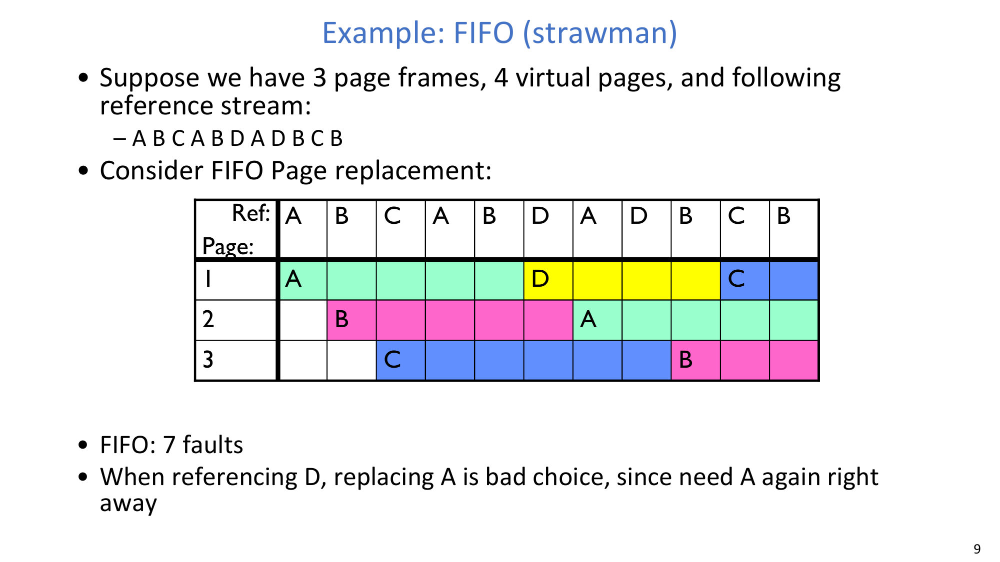
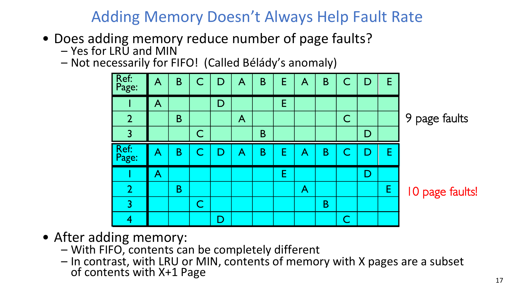
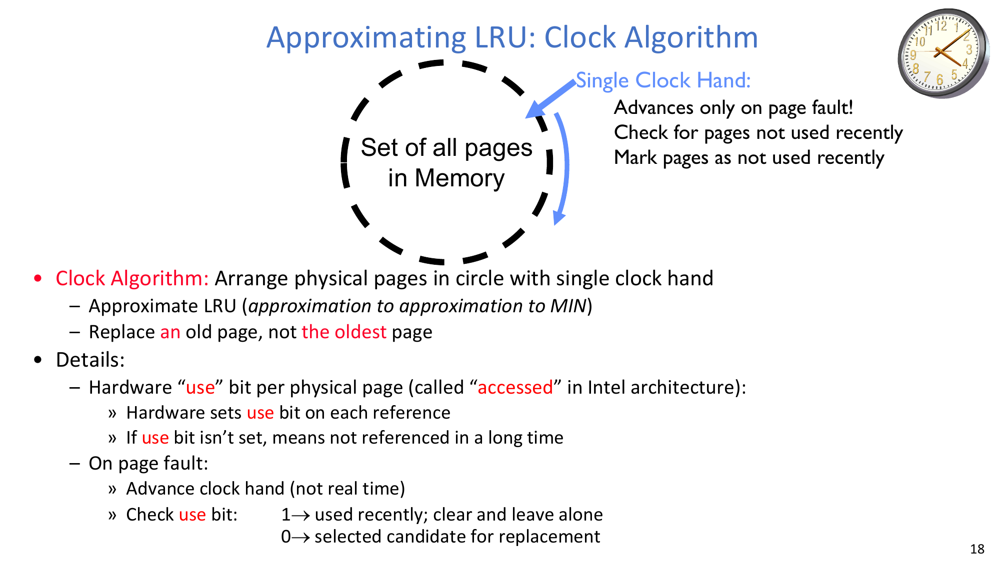
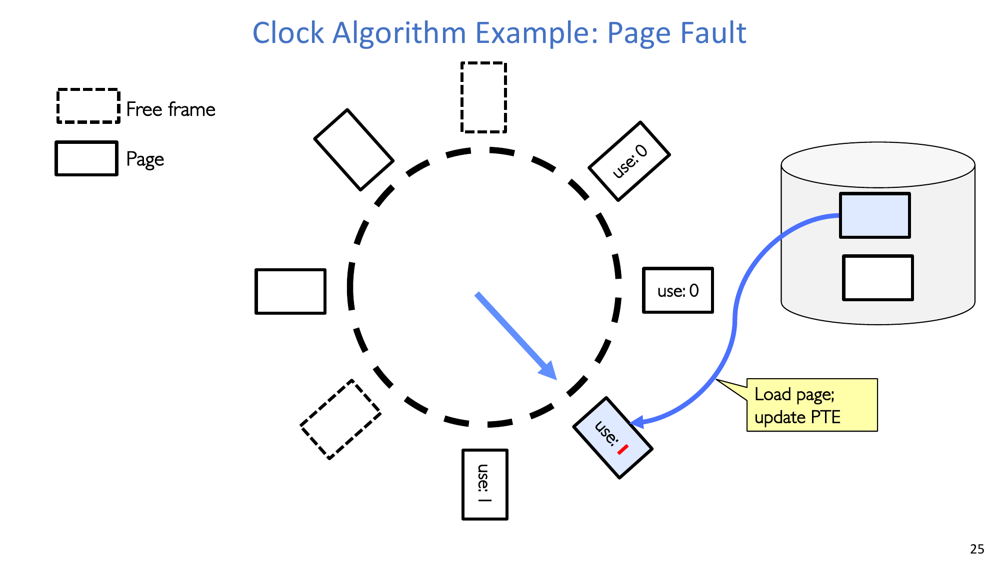
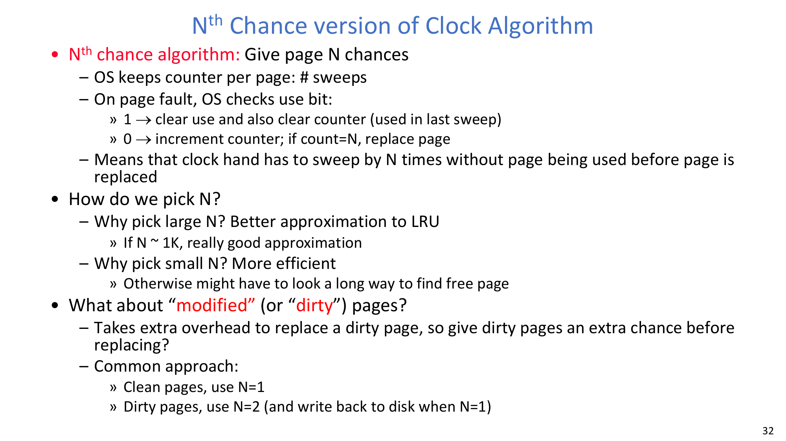
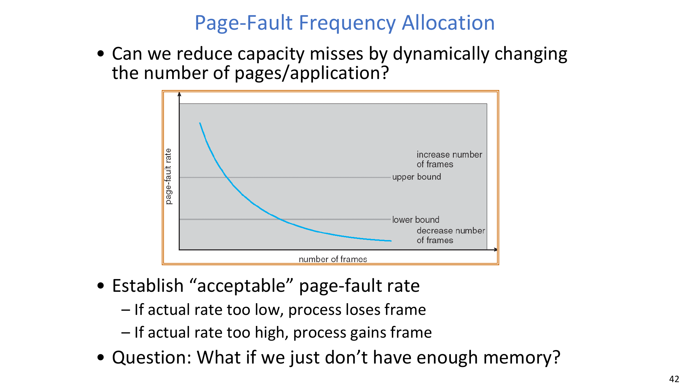
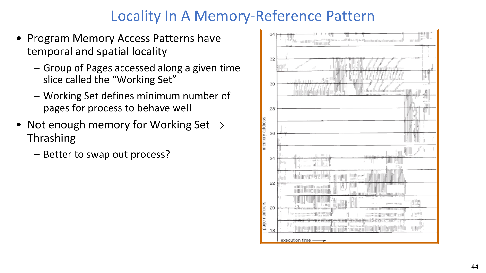
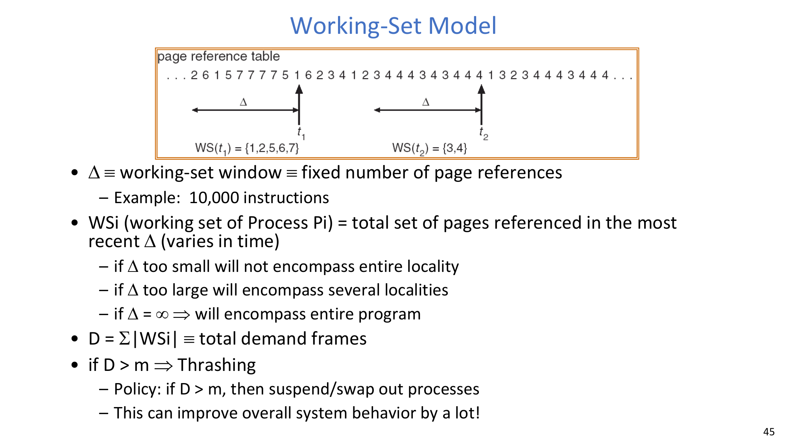

# Lec17 - Memory 4: Demand Paging

## Learning Objectives
After this lecture, you should be able to explain demand paging as a cache-management problem, compare major page replacement policies, compute page faults for representative reference strings, explain why Bélády's anomaly happens, describe Clock-family approximations to LRU, and reason about page-frame allocation, thrashing, and the working-set model.

## 1. Demand Paging as a Cache
Demand paging treats DRAM as a cache for pages whose full backing store is on disk or another lower-level object. The cache block size is one page, such as 4KB, and the organization is effectively **fully associative** because any virtual page can be placed in any physical frame.

The lookup path follows the same hierarchy introduced earlier:
- The processor issues a virtual address.
- The TLB is checked first for a cached virtual-page to physical-frame mapping.
- On a TLB miss, the page table is traversed.
- If the page table entry says the page is not resident, the miss becomes a page fault and the OS fetches the page from the lower level, typically disk.

Writes use a write-back style. The OS does not immediately write every memory update to disk; instead, it marks a page dirty and writes it back only when replacement or synchronization requires it.

The central policy question is therefore: when physical memory is full and a new page must be brought in, which old page should be replaced?

:::remark Question: Why is page replacement more important than ordinary cache replacement?
A bad cache replacement may cost a lower-level memory access, but a bad page replacement can cost a disk I/O and can stall a process for a very long time. Page replacement also interacts with scheduling and fairness: if the OS evicts a process's important working pages, that process may spend most of its time faulting instead of executing.
:::

## 2. Page Replacement Policies
Page replacement policies are different guesses about which resident page is least valuable to keep. They differ in optimality, implementation cost, predictability, and how well they exploit locality.

### 2.1 FIFO, RANDOM, MIN, and LRU
The basic policies are:

| Policy | Core rule | Strength | Weakness |
|---|---|---|---|
| **FIFO (First In, First Out): Throw out oldest page.** | Evict the page that has been resident for the longest time. | Simple and fair in residence time. | Can evict a heavily used page just because it arrived early. |
| **RANDOM: Pick random page for every replacement.** | Choose a resident page uniformly or pseudo-randomly. | Very simple; common in small hardware structures such as some TLBs. | Unpredictable and hard to reason about for worst-case behavior. |
| **MIN (Minimum): Replace page that won't be used for the longest time.** | Evict the page whose next future use is farthest away. | Provably optimal for a known reference string. | Impossible to implement online because the future is unknown. |
| **LRU (Least Recently Used): Replace page that hasn't been used for the longest time.** | Use the past as a predictor of the future and evict the least recently referenced page. | Often good under locality. | Exact LRU is expensive for paging because every memory reference would have to update recency state. |



A natural exact LRU implementation keeps pages in a list. The most recently used page is at the head, and the least recently used page is at the tail. Whenever a page is used, it is removed from its current position and moved to the head. Replacement removes the tail.

This list idea is conceptually clean but difficult for paging: page use happens on ordinary loads, stores, and instruction fetches, so exact maintenance would require hardware or OS work on almost every memory reference. Real systems therefore usually approximate LRU.

:::remark Question: Which policy should we prefer among FIFO, RANDOM, MIN, and LRU?
MIN is the benchmark because it gives the fewest possible faults for a known future, but it is not implementable online. LRU is usually the most useful mental model because locality often makes recent history predictive. FIFO is attractive only for simplicity and can behave badly. RANDOM is useful when implementation simplicity matters more than deterministic behavior, especially in small hardware structures.
:::

### 2.2 FIFO Example
Consider three physical frames, four possible virtual pages, and the reference string:

```text
A B C A B D A D B C B
```

FIFO first fills the three frames with `A`, `B`, and `C`. The next two references, `A` and `B`, hit. When `D` arrives, FIFO evicts `A` because `A` is the oldest resident page, even though `A` is needed immediately afterward. That early eviction causes extra faults.



| Step | Reference | Result under FIFO | Frames after the step |
|---|---|---|---|
| 1 | A | Fault, load A | A - - |
| 2 | B | Fault, load B | A B - |
| 3 | C | Fault, load C | A B C |
| 4 | A | Hit | A B C |
| 5 | B | Hit | A B C |
| 6 | D | Fault, evict A | D B C |
| 7 | A | Fault, evict B | D A C |
| 8 | D | Hit | D A C |
| 9 | B | Fault, evict C | D A B |
| 10 | C | Fault, evict D | C A B |
| 11 | B | Hit | C A B |

The total is **7 page faults**. The lesson is not simply that FIFO is old-fashioned; it is that residence time is not the same thing as usefulness.

### 2.3 MIN and LRU on the Same Reference String
For the same reference string, MIN uses future knowledge:

```text
A B C A B D A D B C B
```

After `A`, `B`, and `C` are loaded, the first interesting miss is `D`. At that moment the future is:

```text
A D B C B
```

Among resident pages `A`, `B`, and `C`, page `C` is used farthest in the future, so MIN evicts `C`, not `A`. This avoids the immediate `A` fault that FIFO suffered.


| Step | Reference | MIN decision | LRU decision |
|---|---|---|---|
| 1-3 | A, B, C | Three compulsory faults | Three compulsory faults |
| 4-5 | A, B | Hits | Hits; recency becomes B, A, C |
| 6 | D | Fault, evict C because C is farthest in the future | Fault, evict C because C is least recently used |
| 7-9 | A, D, B | Hits | Hits |
| 10 | C | Fault, evict A or D because neither is needed again | Fault, evict A because it is least recently used |
| 11 | B | Hit | Hit |

Both MIN and LRU produce **5 page faults** on this particular string. LRU happens to make the same important decisions as MIN here, but this agreement is not guaranteed.

:::remark Question: Why does LRU match MIN in this example?
The recent past happens to predict the future well. Before `D` arrives, `C` is both the page whose next use is farthest away and the page that was least recently used. In a different access pattern, those two facts can diverge.
:::

### 2.4 When LRU Performs Badly
LRU can perform very badly when the working set is just one page larger than physical memory and the program cycles through all pages:

```text
A B C D A B C D A B C D
```

With three frames, every reference faults under LRU. After loading `A`, `B`, and `C`, the reference to `D` evicts `A`; then the next reference to `A` evicts `B`; then `B` evicts `C`; and so on. FIFO behaves the same way on this cyclic string.

MIN does not suffer the same collapse. With future knowledge, after the first three compulsory faults it can evict the page whose next use is farthest away. For this 12-reference string with three frames, MIN needs only **6 faults**, while LRU needs **12 faults**.

:::remark Question: Does this mean LRU is bad?
No. This example is deliberately adversarial: four equally active pages compete for three frames in a repeating cycle. LRU is still a powerful locality heuristic, but it is not an optimality guarantee. The example is useful because it separates "usually good under locality" from "always optimal."
:::

## 3. Stack Property and Bélády's Anomaly
A page replacement policy has the **stack property** if the pages held with `n` frames are always a subset of the pages held with `n + 1` frames for the same reference prefix. If a policy has this property, adding memory cannot increase the number of page faults.

LRU and MIN have the stack property:
- Under LRU, `n` frames contain the `n` most recently used pages; `n + 1` frames contain those pages plus one more.
- Under MIN, the idealized stack order can be viewed by future-use distance; keeping one more page adds another page rather than changing the whole resident set.

FIFO does not have the stack property. Adding one frame changes the replacement queue and can make the future sequence worse.

### 3.1 Bélády's Anomaly Example
The classic FIFO counterexample uses:

```text
A B C D A B E A B C D E
```



| FIFO frames | Faulting references | Total faults | What happens |
|---|---|---|---|
| 3 frames | A, B, C, D, A, B, E, C, D | **9** | After `E` is loaded, `A` and `B` remain long enough to hit. |
| 4 frames | A, B, C, D, E, A, B, C, D, E | **10** | The extra frame changes FIFO order, so `E` evicts `A`, and a chain of faults follows. |

This is **Bélády's anomaly**: for FIFO, increasing the number of frames can increase the number of page faults. The anomaly feels surprising only if "more memory" is assumed to mean "same pages plus one"; FIFO violates exactly that assumption.

:::remark Question: Does adding memory always reduce the number of page faults?
No. It is guaranteed for stack algorithms such as LRU and MIN, but not for FIFO. The key is whether the resident set with more frames contains the resident set with fewer frames. FIFO's queue order can change so much that the larger memory holds a different and worse set of pages.
:::

## 4. Clock: A Practical Approximation to LRU
Exact LRU is expensive because it needs immediate recency updates on every memory reference. Clock approximates LRU using one hardware-maintained bit per page.

**Clock Algorithm: Arrange physical pages in circle with single clock hand.** Each physical page has a hardware **use bit**, called the **accessed bit** in Intel terminology. Hardware sets the use bit whenever the page is referenced.



On a page fault, the clock hand advances through pages:
1. If the current page has `use = 1`, it was used recently. The OS clears the bit to `0`, gives the page a second chance, and moves the hand forward.
2. If the current page has `use = 0`, it has not been referenced since the last sweep. The OS selects it as a replacement candidate.
3. If the victim is dirty, the OS writes it back to disk.
4. The OS invalidates the old PTE and any stale TLB entry.
5. The OS loads the new page, updates the PTE, and the new page's use bit will be set when it is referenced.



Clock does not replace **the** oldest page; it replaces **an** old page. That distinction is why Clock is cheaper than exact LRU but only approximate.

:::remark Question: Will Clock always find a page, or can it loop forever?
Clock will find a candidate. If every page has `use = 1`, the first full sweep clears all bits to `0`. On the next pass, unless every page has been referenced again, the hand will find a page with `use = 0`. In the worst case, the algorithm may scan many pages, but it does not logically loop forever.
:::

:::remark Question: Is a slow clock hand a good sign or a bad sign? What about a fast clock hand?
A slow hand is usually a good sign: there are not many page faults, or the hand quickly finds pages with `use = 0`. A fast hand is usually a warning: either page faults are frequent, or most pages keep getting their use bits set, so the system is under memory pressure.
:::

### 4.1 N-th Chance Clock
**Nth Chance algorithm: Give page N chances.** Instead of replacing a page the first time its use bit is found clear, the OS keeps a sweep counter per page.



On each page fault:
- If `use = 1`, clear the use bit and reset the page's sweep counter to `0`.
- If `use = 0`, increment the counter.
- If the counter reaches `N`, replace the page.

Large `N` makes the algorithm closer to LRU because a page must survive many sweeps without being used before eviction. Small `N` is more efficient because the clock hand does not have to scan as far. Dirty pages often receive extra protection: clean pages may use `N = 1`, while dirty pages may use `N = 2`; when a dirty page receives its first chance, the OS can start writing it back so that later replacement is cheaper.

:::remark Question: How should N be chosen?
There is no universal value. A large `N` reduces premature evictions but increases scanning cost. A small `N` finds victims quickly but may evict useful pages. Systems choose `N` as a tradeoff between page-fault cost, scan overhead, and the cost of writing dirty pages.
:::

### 4.2 Emulating Modified and Use Bits
Hardware support is helpful but not always strictly necessary.

For the modified bit, the OS can emulate it with permissions:
1. Keep a software modified bit for each page.
2. Mark writable pages as read-only in the hardware page table, even if the program is logically allowed to write them.
3. On a write fault, check whether the write is legal. If it is legal, set the software modified bit and mark the page writable.
4. After writing a dirty page back to disk, clear the software modified bit and mark the page read-only again.

For the use bit, the OS can emulate references by temporarily marking resident pages invalid:
1. Keep software use and modified bits.
2. Mark pages invalid even if they are resident.
3. A read or write traps to the OS, proving that the page was used.
4. The OS sets the software use bit. A read may restore read-only access; a legal write also sets the modified bit and restores write permission.
5. When the clock hand passes, the OS clears the software use bit and marks the page invalid again.

This works, but it turns some ordinary memory references into traps. It is a classic hardware/software tradeoff: fewer hardware bits can be replaced by more OS intervention.

:::remark Question: Do we really need hardware-supported modified and use bits?
Not strictly. Both can be emulated using protection and validity faults. The price is overhead: emulation deliberately creates traps so the OS can observe writes or references. Hardware bits are valuable because they record the same facts without trapping on the common case.
:::

### 4.3 Second-Chance List Algorithm
The **Second-Chance List Algorithm** is another approximate LRU design, associated with VAX/VMS-style systems that did not rely on a hardware use bit.


Memory is split into two lists:
- The **Active list** contains directly mapped pages marked readable/writable. Accesses to these pages run at full speed.
- The **Second-Chance list** contains pages marked invalid. They still have memory frames, but touching them causes a page fault so the OS can notice renewed interest.

On a page fault:
1. The OS moves an overflow page from the end of the Active list to the front of the Second-Chance list and marks it invalid.
2. If the desired page is already in the Second-Chance list, the OS moves it to the front of the Active list and marks it readable/writable. This costs a trap but not disk I/O.
3. If the desired page is not in either list, the OS pages it in from disk to the front of the Active list.
4. If space is needed, the OS evicts the least-recently used page at the end of the Second-Chance list.

The size of the Second-Chance list controls the behavior:
- If its size is `0`, the algorithm degenerates toward FIFO.
- If it contains all pages, it approaches LRU but faults on every page reference.
- An intermediate size reduces disk I/O while accepting some trap overhead.

Compared with FIFO, the benefit is fewer disk accesses because a page is written out only if it remains unused for a long time. The cost is more faults handled by the OS, even when the page is still physically resident.

### 4.4 Free List and Pageout Daemon
A system can reduce page-fault latency by keeping a **free list** of frames ready for immediate use.


The free list is filled in the background, often by a pageout daemon running Clock or a related replacement policy:
- The daemon advances through pages and prepares victim frames before a fault urgently needs them.
- Dirty pages begin writing back to disk when they enter the list.
- If a page is touched again before its frame is reused, it can be returned to the active set.
- On a page fault, the OS can immediately take a clean free frame instead of waiting for replacement and disk write-back.

This is the same engineering instinct as many OS optimizations: move slow work out of the critical path when possible.

### 4.5 Reverse Page Mapping and the Coremap
When the OS evicts a physical frame, it must invalidate every page-table entry that points to that frame. This is easy if exactly one PTE maps the frame, but shared pages make the problem harder. Shared code, forked address spaces, and memory-mapped files may all create multiple PTEs pointing to the same physical page.

A reverse mapping mechanism answers questions in the opposite direction: given a physical frame, which virtual mappings point to it?

The mechanism must be fast because the OS needs it when:
- freeing or replacing a physical page;
- finding all PTEs that must be invalidated;
- checking whether a page has been active.

One direct implementation keeps, for every physical page descriptor, a linked list of PTEs that point to it. This is precise but expensive to maintain. Linux-style object-based reverse mapping links coarser memory-region descriptors instead, such as program text regions or files mapped with `mmap()`. The coarser design reduces management overhead at the cost of less direct precision.

## 5. Allocating Page Frames Across Processes
Replacement policy decides which page to evict, but frame allocation decides how much memory each process gets in the first place.

There are three big questions:
- Should every process receive the same fraction of memory?
- Should larger or higher-priority processes receive more frames?
- Should the OS completely swap out some processes when memory is too tight?

Every resident process needs a minimum number of pages to make forward progress. The IBM 370 example illustrates this constraint for the `SS MOVE` instruction: the instruction is 6 bytes and may span two pages; the source ("from") operand may span two pages; the destination ("to") operand may span two pages. The machine may therefore need **6 pages** resident just to execute that one instruction safely.

Two replacement scopes matter:
- **Global replacement** lets a process select a replacement frame from all physical frames, so one process can take a frame from another process.
- **Local replacement** restricts each process to frames already allocated to itself.

Global replacement can improve total utilization but makes processes interfere with each other. Local replacement isolates processes better but can waste memory if one process has unused frames while another is starving.

### 5.1 Fixed, Proportional, and Priority Allocation
**Equal allocation** gives every process the same number of frames. For example, if the system has 100 frames and 5 processes, each process receives 20 frames. This is simple but ignores process size and behavior.

**Proportional allocation** gives memory according to process size. If process `p_i` has size `s_i`, total process size is `S = \sum_i s_i`, and total physical frames are `m`, then the allocation is:

$$
a_i = \frac{s_i}{S} \times m
$$

**Priority allocation** uses the same style of proportional calculation but weights by priority rather than size. A possible policy is: when process `p_i` page-faults, choose a replacement frame from a process with a lower priority number.

:::remark Question: Is a fixed allocation enough if an application suddenly needs more memory?
Often no. A fixed allocation can be too rigid. If a process enters a new phase with a larger working set, its page-fault rate may rise sharply even though other processes have spare frames. This motivates adaptive schemes such as page-fault frequency allocation and working-set tracking.
:::

### 5.2 Page-Fault Frequency Allocation
Page-fault frequency allocation asks: **Can we reduce capacity misses by dynamically changing the number of pages/application?**



The OS establishes an acceptable page-fault-rate band:
- If the actual rate is too low, the process has more memory than it currently needs and may lose a frame.
- If the actual rate is too high, the process needs more memory and should gain a frame.

The graph shows page-fault rate decreasing as the number of frames increases. The lower bound prevents memory hoarding; the upper bound prevents a process from thrashing because it has too few frames.

:::remark Question: What if we simply do not have enough memory for all processes?
Then redistributing frames is not enough. If the total active demand exceeds physical memory, the OS must reduce the degree of multiprogramming: suspend or swap out some processes so the remaining processes can keep their working sets resident. Giving every process too few frames makes the whole machine slower.
:::

## 6. Thrashing and the Working-Set Model
If a process does not have enough pages, its page-fault rate becomes very high. The CPU then waits for paging I/O instead of executing useful instructions, and the OS spends most of its time swapping pages to and from disk.

**Thrashing ≡ a process is busy swapping pages in and out with little or no actual progress.**


The CPU-utilization graph has an important shape. At first, increasing the degree of multiprogramming improves CPU utilization because while one process waits, another can run. After the system crosses the memory-capacity threshold, adding more processes makes each process lose too many pages. Page faults explode, disk paging dominates, and CPU utilization collapses. That right-hand collapse is the thrashing region.

:::remark Question: How do we detect thrashing, and what is the best response?
Thrashing is detected by a combination of high page-fault rates, heavy paging disk traffic, and low CPU utilization. The best response is usually not to add more processes. The OS should reduce memory pressure by giving active processes enough frames, suspending or swapping out some processes, and later bringing them back when enough memory is available.
:::

### 6.1 Locality in Memory References
Program memory access patterns have **temporal locality** and **spatial locality**. Programs tend to reuse recently used pages and access nearby data or code. A group of pages accessed along a given time slice is called the **Working Set**.



The memory-reference picture is best read as a time trace. The horizontal axis is execution time, and the vertical axis is page number or memory address. Dense bands show that the program spends a period touching a small group of pages, then shifts to another group. The key change is not a single static point; it is the movement from one locality region to another.

The working set defines the minimum number of pages a process needs to behave well during its current phase. If the system cannot keep the working set resident, the process will thrash. In that case, it may be better to swap out the whole process temporarily than to let it run with too few pages.

### 6.2 Working-Set Model
The working-set model formalizes locality with a window:

**Δ ≡ working-set window ≡ fixed number of page references.**

For example, `Δ` may correspond to 10,000 instructions or some fixed count of recent memory references. For process `P_i`, the working set is:

**WSi (working set of Process Pi) = total set of pages referenced in the most recent Δ.**



In the reference-table example:
- At time `t_1`, the recent `Δ` window contains references to pages `1`, `2`, `5`, `6`, and `7`, so `WS(t_1) = {1, 2, 5, 6, 7}`.
- At time `t_2`, the recent `Δ` window is concentrated on pages `3` and `4`, so `WS(t_2) = {3, 4}`.

The window size matters:
- If `Δ` is too small, it misses part of the current locality.
- If `Δ` is too large, it combines several localities and overestimates current demand.
- If `Δ = \infty`, it covers the entire program rather than the current phase.

Let:

$$
D = \sum_i |WS_i|
$$

where `D` is the total demand for frames across all active processes, and let `m` be the total number of physical frames. If:

$$
D > m
$$

then the system is overcommitted and will thrash. A practical policy is: if `D > m`, suspend or swap out some processes. This can improve overall system behavior dramatically because fewer active processes can each keep their working set in memory.

### 6.3 What about Compulsory Misses?
**Compulsory misses are misses that occur the first time that a page is seen.** In paging, this includes:
- pages touched for the first time;
- pages touched after a process has been swapped out and then swapped back in.

Two practical techniques reduce the pain of compulsory misses:

**Clustering** brings in multiple pages around the faulting page on a page fault. Disk reads are more efficient when they are sequential, so if nearby pages are likely to be used, reading several sequential pages can be cheaper than separate future I/Os.

**Working Set Tracking** tries to remember the pages an application is actively using. When a swapped-out process is brought back, the OS can swap in its working set rather than only the single faulting page.

:::remark Question: Can compulsory misses be eliminated completely?
No. The first reference to a page must be discovered somehow. Clustering and working-set tracking reduce future stalls by predicting nearby or recently active pages, but they can also read pages that are not actually needed. They are useful because disk I/O has high fixed cost and locality often makes the prediction worthwhile.
:::

## Exam Review
Use this section to compress the lecture into the facts and reasoning patterns most likely to matter.

### Core Definitions
- **MIN** is optimal with known future references: evict the page whose next use is farthest away.
- **LRU** evicts the page not used for the longest time; it approximates MIN under locality but can fail on cyclic working sets larger than memory.
- **FIFO** evicts the oldest resident page and can suffer Bélády's anomaly.
- **Clock** approximates LRU with a circular list, a clock hand, and a hardware/software use bit.
- **N-th chance Clock** requires a page to survive `N` sweeps without use before eviction.
- **Thrashing** means paging dominates execution and little useful progress occurs.
- **Working set** is the set of pages referenced in the most recent `Δ` window.

### Must-Know Examples
- For `A B C A B D A D B C B` with 3 frames, FIFO has **7 faults**, while MIN and LRU have **5 faults**.
- For `A B C D A B C D A B C D` with 3 frames, LRU has **12 faults** because the cycle has 4 pages but memory has only 3 frames; MIN has **6 faults**.
- For `A B C D A B E A B C D E`, FIFO has **9 faults** with 3 frames but **10 faults** with 4 frames. This is Bélády's anomaly.
- In the IBM 370 `SS MOVE` example, one instruction can require **6 resident pages**: 2 for the instruction, 2 for the source, and 2 for the destination.

### Reasoning Templates
- To compare replacement policies, ask what information they use: FIFO uses arrival time, LRU uses past recency, MIN uses future references, and Clock uses a coarse recent-use bit.
- To test for Bélády's anomaly, ask whether the policy has the stack property. LRU and MIN do; FIFO does not.
- To analyze Clock, trace the hand: `use = 1` means clear and skip; `use = 0` means candidate victim.
- To diagnose thrashing, look for high page-fault frequency, heavy disk paging, and low CPU utilization.
- To apply the working-set model, compute each `|WS_i|`, sum them into `D`, and compare `D` with physical frames `m`.

### Common Pitfalls
- More frames do not automatically reduce faults for every policy; FIFO is the counterexample.
- "Dirty" and "used" are different bits: dirty means written since disk copy; used means referenced recently.
- A page fault is not always a disk read. A second-chance-list hit may fault only so the OS can update metadata.
- Swapping out a process can improve performance when the alternative is letting all processes thrash.
