# Lec18 - 内存 5：现代计算机系统中的内存管理

## 学习目标
学完本讲后，你应当能够解释经典操作系统内存思想如何重新出现在现代分布式系统、LLM serving 系统、远程内存系统以及 GPU 共享系统中。你还应当能够概括每篇论文的核心问题、设计思路、关键机制、评估结果，以及它与 OS 内存管理之间的联系。

## 1. 总览
现代内存管理已经不再局限于单机内部的页表。相同的思想会在很多新的边界上反复出现：
- 一个集群可以把远端 DRAM 暴露成可编程的内存抽象。
- 一个 serving engine 可以像虚拟内存一样管理 LLM 的 KV cache。
- 一台服务器可以把远端空闲内存当作新的 swap 层。
- 一个运行时可以把对象移动到 far memory，同时保留应用语义。
- 一个 GPU 系统可以在 GPU device memory 和 host memory 之间交换模型状态或 GPU 页面。

本讲讨论六篇论文：

| 主题 | 论文 | 主要内存管理思想 |
|---|---|---|
| 内存抽象 | FaRM, NSDI 2014 | 使用 RDMA 和事务构建高速分布式共享内存。 |
| 内存抽象 | vLLM / PagedAttention, SOSP 2023 | 用 KV blocks 对 attention KV cache 进行分页和虚拟化。 |
| 远程按需分页 | Infiniswap, NSDI 2017 | 使用 RDMA 把内存页面透明地换到远端机器。 |
| 远程 far memory | AIFM, OSDI 2020 | 把 far memory 集成到应用数据结构和 userspace runtime 中。 |
| GPU/host 内存切换 | PipeSwitch, OSDI 2020 | 对 GPU 上的深度学习模型上下文切换进行流水化。 |
| 透明 GPU 共享 | TGS, NSDI 2023 | 在容器云中透明共享 GPU compute 和 memory。 |

:::remark 问题：这些论文和经典内存管理有什么共同点？
它们都在新的硬件和工作负载约束下重新提出同一组 OS 问题：可寻址对象是什么，它物理上存在哪里，什么时候应该移动，谁能观察访问模式，fault 的代价有多大，以及系统应该提供多少透明性。
:::

## 2. FaRM：Fast Remote Memory
FaRM 的起点是硬件趋势：DRAM 已经大到一个小集群可以容纳数十 TB 内存，数据中心网络也快到可以认真考虑远程内存访问。RDMA 网络提供高吞吐、微秒级延迟，以及一个关键性质：NIC 可以直接访问内存，不需要远端 kernel 或远端 CPU 参与。

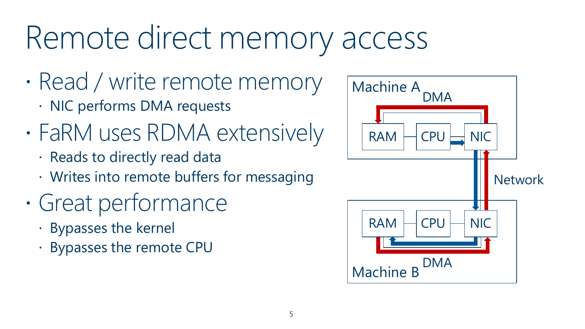

**Remote direct memory access** 表示一台机器可以通过 NIC 读写另一台机器的内存。FaRM 使用 RDMA read 直接读取远端数据，并使用 RDMA write 写入远端 buffer 来做消息传递。与 TCP 相比，RDMA 路径延迟更低，每台服务器每微秒能处理的请求数也更多，尤其适合小数据传输。

### 2.1 编程问题
核心问题是：如何编程一个拥有 TB 级 DRAM、数百个 CPU core 和 RDMA 网络的现代集群？

传统模型把存储数据的 server 和执行应用逻辑的 client 分开。这会让远程访问显式化，而且因为 RDMA 可以不经过远端 CPU 直接服务数据，server CPU 很可能处于空闲状态。FaRM 更偏向对称模型：每台机器既存储数据，也执行计算。

理想的编程模型有三个目标：
- 把数据留在内存中；
- 使用 RDMA 访问数据；
- 在局部性重要时，把数据和计算放在一起。

### 2.2 共享地址空间
FaRM 在分布式对象之上提供共享地址空间抽象。对象可以通过统一抽象被读取、写入、分配和释放，即使它们物理上分布在不同机器上。

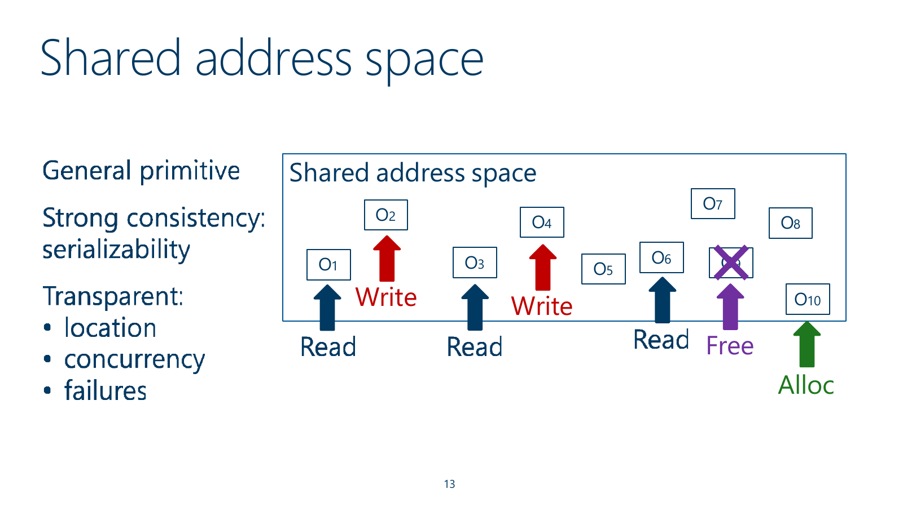

这个共享地址空间希望对以下因素保持透明：
- location；
- concurrency；
- failures。

这个抽象还很强：FaRM 追求 **serializability**，也就是并发更新表现得像事务按某个串行顺序执行。

:::remark 问题：共享地址空间为什么有用，但又为什么还不够？
共享地址空间让远端数据更容易命名和访问，但性能仍然取决于局部性。如果计算反复逐个触碰远端对象，程序仍然会付出许多 RDMA 往返。FaRM 因此还强调把相关对象放在一起，并在合适时把计算移动到数据所在位置。
:::

### 2.3 局部性与事务
FaRM 通过 locality awareness 把经常一起访问的数据放在一起。如果对象 `1` 经常和对象 `2`、`4`、`6`、`7` 一起访问，那么最好把这些对象放近，或者把计算移动到保存目标数据的机器上。这样集群更像一组被优化过的单机事务，而不是一串远程对象查找。

对于更新，FaRM 使用事务：

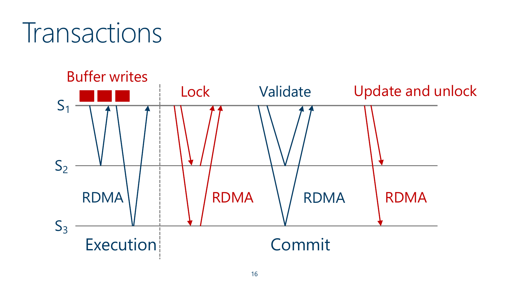

事务流程是：
1. 执行阶段，应用 buffer writes，并通过 RDMA 读取对象。
2. 提交时，事务锁住将要更新的对象。
3. 验证自己读过的对象是否发生冲突性变化。
4. 应用更新并释放锁。

这是带有分布式系统保证的 OS 风格内存抽象：系统试图让远程内存足够快，同时保留一致的事务模型。

### 2.4 例子：TAO
TAO 是 Facebook 的内存图存储。它的工作负载以读为主，约 99.8% 是读操作，并包含 10 种操作类型。在 FaRM 实现中：
- nodes 和 edges 是 FaRM objects；
- lookups 使用 lock-free reads；
- updates 使用 transactions。

报告结果非常显著：约 **6 Mops/s/server**，大约 **10x improvement**；平均延迟约 **42 微秒**，约 **40-50x improvement**。这里的关键不是抽象本身很漂亮，而是结合 RDMA 和局部性后，它确实能支持新的 data-serving 设计。

### 2.5 FaRM 小结
FaRM 可以理解为一个分布式内存平台：
- 数据保存在内存中。
- RDMA 让远程内存访问便宜到可以成为系统原语。
- 共享内存抽象改善可编程性。
- 事务和 lock-free reads 提供并发控制。
- 局部性仍然重要，因为“远程内存很快”并不等于“远程内存免费”。

## 3. vLLM 与 PagedAttention：对 KV Cache 分页
vLLM 研究 LLM serving 的内存管理。LLM 支撑聊天、编程、内容创作、业务操作和开发工具，但服务成本高且速度慢。对于中等大小的 13B 参数模型和输入，单张 A100 GPU 每秒甚至服务不了 1 个请求。生产级 LLM 服务因此需要大量 GPU。

### 3.1 为什么 LLM Serving 很慢
LLM 推理是自回归的。给定输入：

```text
Artificial Intelligence is
```

模型一次生成一个输出 token：

```text
the -> future -> of -> ...
```

下一个输出 token 依赖之前的输出 token。这种顺序依赖让 GPU 的并行能力很难被完全利用。把多个请求 batch 在一起可以缓解这个问题，因为 GPU 可以并行处理多个请求。但 batch size 又被 **KV Cache** 的低效内存管理限制住了。

### 3.2 KV Cache 与碎片
Attention KV cache 保存已经处理过的 token 的 key/value 向量表示。请求继续生成 token 时，它会增长；请求完成后，它会释放。它非常大：
- 每个 token 可能需要约 **1 MB** KV cache；
- 一个完整请求可能需要 **数 GB**。

过去的系统通常会按每个请求的最大可能长度预分配一段连续 KV cache 空间。这对于输入输出形状静态的传统深度学习任务很方便，但生成任务的输出长度未知。

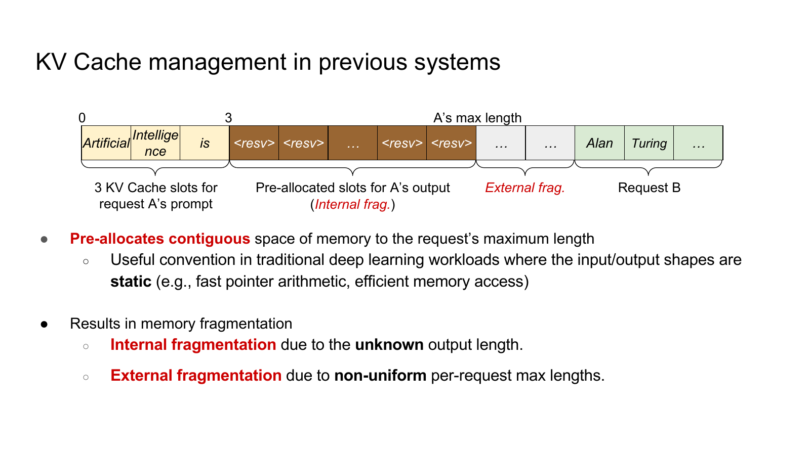

结果就是碎片：
- **内部碎片**：请求为未来 token 预留了可能永远不会使用的 slot。
- **外部碎片**：不同请求的最大长度不一致，导致分配之间留下空洞。

在过去系统中，可能只有 **20-40%** 的 KV cache 空间真正存储 token state。内存浪费会限制 batch size，最终降低 serving throughput。

:::remark 问题：为什么 KV cache 管理是一个 OS 内存管理问题？
KV cache 和虚拟内存压力具有相同结构：变长逻辑对象要放进有限物理内存，连续分配会带来碎片，共享和回收决策会影响吞吐。vLLM 的关键动作就是把 paging 和 virtual addressing 思想搬到应用层 attention runtime 中。
:::

### 3.3 PagedAttention
核心思想是 **Application-level memory paging and virtualization for attention KV Cache**。

PagedAttention 把 KV cache space 切分成固定大小的 **KV blocks**。KV block 是固定大小的连续内存块，可以从左到右保存 KV token states。每个请求不再需要一整段连续分配，而是拥有 logical KV blocks，并通过 block table 映射到 physical KV blocks。

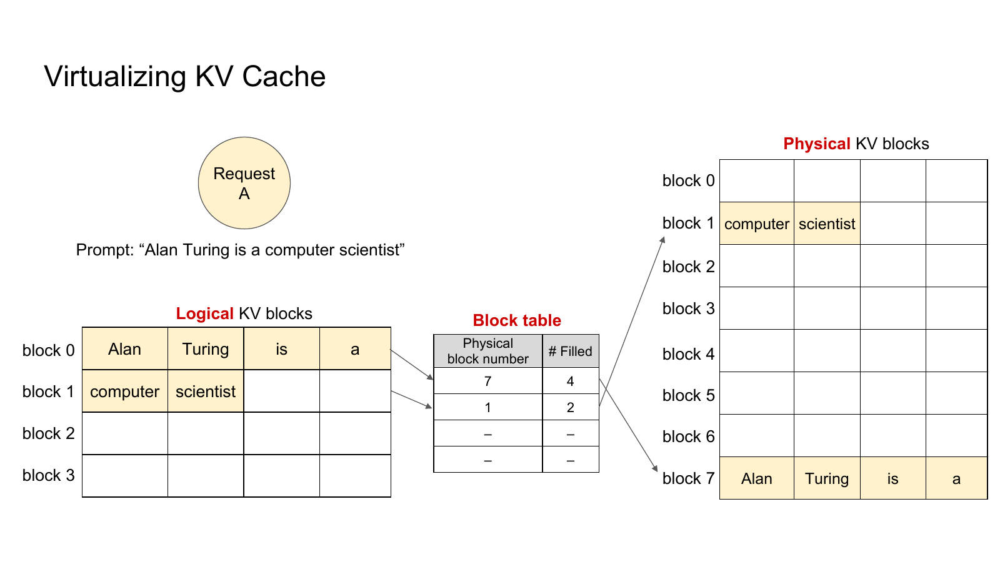

例如 prompt：

```text
Alan Turing is a computer scientist
```

可以表示为 logical KV block 0 保存 `Alan Turing is a`，logical KV block 1 保存 `computer scientist`。Block table 把 logical block 0 映射到一个 physical KV block，把 logical block 1 映射到另一个 physical KV block。物理块不需要连续。

执行 attention 时：
1. GPU kernel 通过 block table 获取非连续 KV blocks；
2. 在获取过程中即时执行 attention operation。

这种间接寻址会带来约 **10-15% GPU kernel latency slowdown**，但它显著提高内存效率，使系统能使用更大的 batch，最终提升整体吞吐。

### 3.4 按需分配与 Block Size
PagedAttention 按需分配 physical KV blocks。如果请求追加一个 token，并且当前 logical block 还有空位，就填入下一个 slot。如果当前 logical block 已满，系统就分配新的 physical KV block，并把它记录到 block table。

这会减少碎片：
- 没有 **external fragmentation**，因为 physical KV blocks 可以放在任意位置；
- internal fragmentation 只会出现在序列最后一个 block；
- 每个序列浪费的 token 数小于 block size。

Block size 的权衡和 OS page size 很像：
- 太小：空间局部性较弱，元数据和类似内核管理的开销增加；
- 太大：内部碎片增加；
- 讲义示例报告 block size **16** 在实践中通常效果不错。

### 3.5 Sharing 与 Copy-on-Write
分页也支持共享。在 parallel sampling 中，多个输出共享同一个 prompt。例如 prompt：

```text
The future of cloud computing is likely to be characterized by several key trends
```

可能分支出多个 completion。Prompt 对应的 KV blocks 可以在 samples 之间共享，除了最后一个尚未填满的 block。当某个 sample 分叉并追加不同 token 时，PagedAttention 使用 copy-on-write。

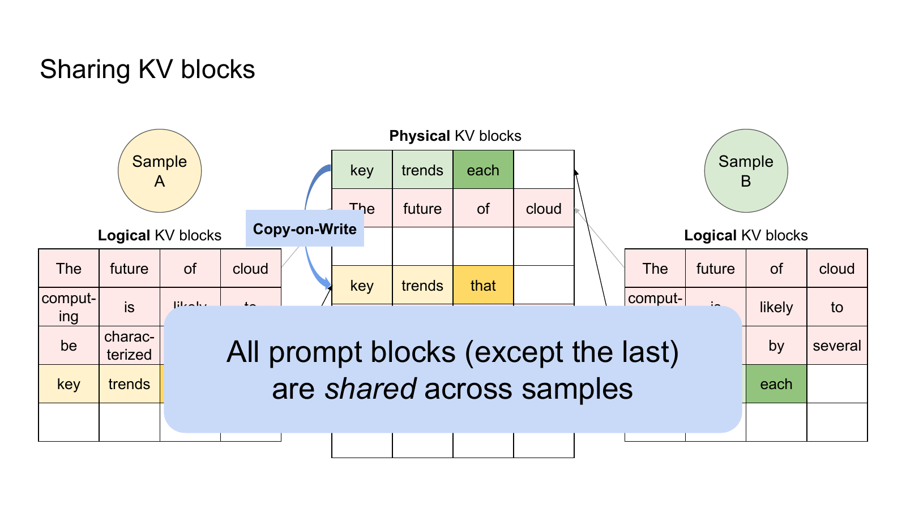

Beam search 是同一思想的更复杂版本。多个 beam 共享前缀，然后分叉成不同续写。这类似进程树中的 fork 和 kill：公共前缀共享，分叉后的分支获得私有 block。

测得的内存节省很可观：
- parallel decoding samples 为 2、4、6 时，memory saving 约为 16.2%、25.7%、30.5%；
- beam width 为 2、4、6 时，memory saving 约为 44.3%、61.0%、66.3%。

### 3.6 Preemption 与 Recovery
当 KV block memory 用尽时，新请求可能无法分配 physical block。vLLM 可以 preempt 一部分请求，让其他请求先运行。

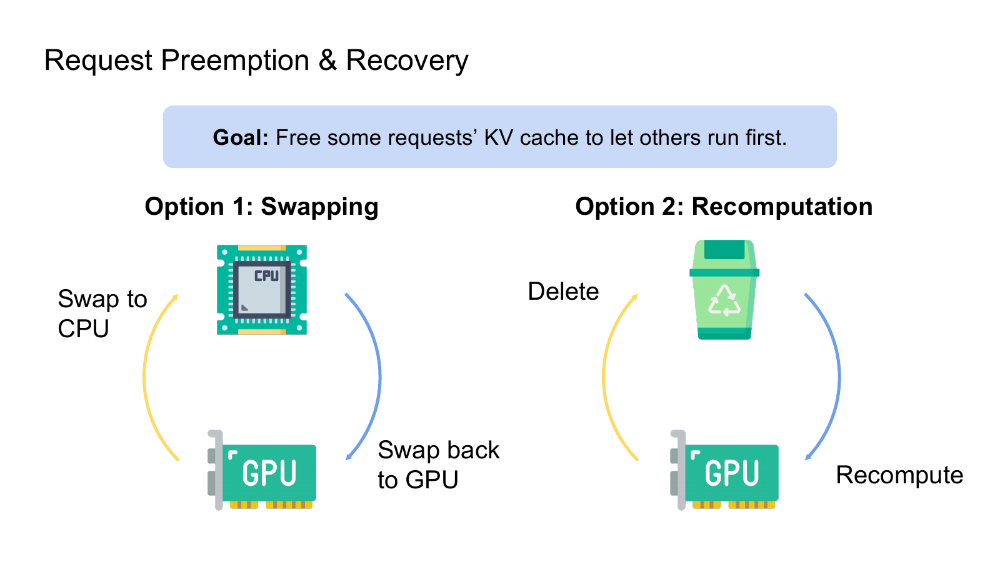

两种恢复策略是：
- **Swapping**：把请求的 KV cache 移到 CPU memory，之后再 swap back 到 GPU memory。
- **Recomputation**：删除 KV cache，等请求恢复时从 tokens 重新计算。

因为每一步生成都需要所有 previous tokens，preemption 和 recovery 必须以整个 request 为单位进行。论文策略是在可能时使用 recomputation，并采用 FCFS policy。Recomputation 之所以可能很快，是因为所有 previous tokens 的 KV cache 可以并行重建。

### 3.7 vLLM 小结
vLLM 几乎把 OS 虚拟内存思想直接映射到 LLM serving 中：
- OS pages 对应 KV blocks。
- Page tables 对应 block tables。
- Shared pages 对应 samples 或 beams 之间共享的 KV blocks。
- Copy-on-write 支持高效分叉。
- Preemption 和 recovery 提供内存压力下的应对方式。

最终效果是：PagedAttention 将内存效率提升 **2.5x-5x**，并将 serving throughput 最高提升 **4x**。

## 4. Infiniswap：基于 RDMA 的远程分页
Infiniswap 聚焦 memory disaggregation。许多 memory-intensive applications，例如数据库、key-value store、图处理和内存分析，在 working set 放不进内存时会严重掉性能。与此同时，数据中心集群里常常存在已经分配但没有真正使用的内存。

它的动机来自一个错配：
- 应用需要更多内存来避免性能崩塌；
- 集群中其他机器上存在空闲内存；
- 系统应当利用这些空闲内存，而且不修改应用和硬件。

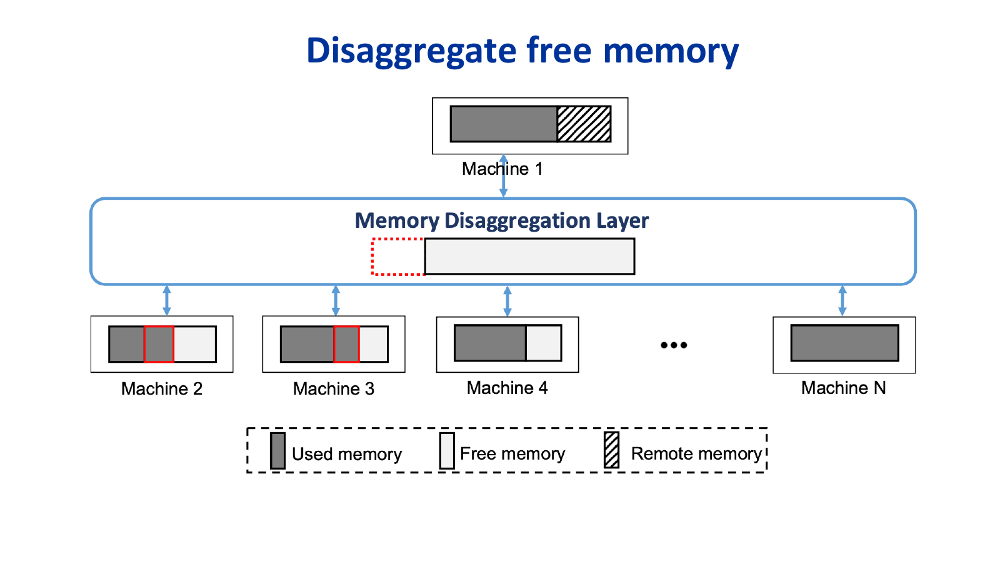

### 4.1 挑战
设计目标包括：
- 最小化部署开销；
- **no hardware design**；
- **no application modification**；
- 能容忍 network disconnection、machine crash 等 failure；
- 能在大规模集群中管理远程内存。

相比早期 memory disaggregation 工作，Infiniswap 希望同时满足这些条件。

:::remark 问题：为什么不直接用远程 key-value store 保存换出的页面？
远程 key-value service 可以保存远端数据，但通常需要应用修改，或者需要远端 CPU 参与服务请求。Infiniswap 想要的是一个现有应用可透明使用的 swap-like interface，同时利用 one-sided RDMA 降低开销。
:::

### 4.2 系统总览
Infiniswap 通过操作系统虚拟内存路径，在应用下方插入自己。

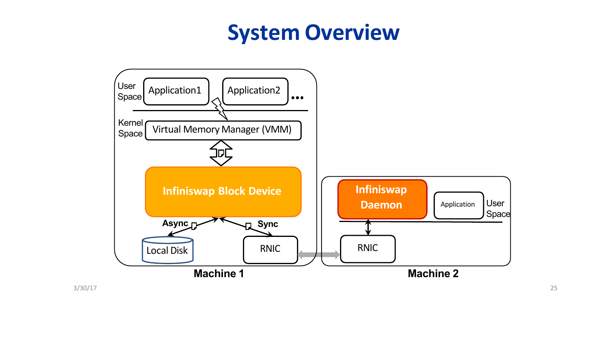

组件包括：
- **Infiniswap Block Device**：对 OS 表现为 swap space，并负责路由 swap requests。
- **Local disk**：异步备份 swapped-out data，使远程内存 failure 可被容忍。
- **Infiniswap Daemon**：把本机 local memory region 暴露成 remote-memory service。
- **RDMA**：执行 one-sided remote reads/writes，绕过远端 CPU。

流程是：
1. OS 决定换出一个页面。
2. Infiniswap block device 接收 swap request。
3. 请求被路由到某个 Infiniswap daemon 管理的远程内存。
4. 数据通过 RDMA 写入远端内存。
5. Local disk 异步创建备份，以容忍 failure。

这就是 demand paging，只是 backing store 不再只有 local disk，而是在 DRAM 与磁盘之间加入了 remote DRAM pool。

### 4.3 扩展远程内存：从 Page 到 Slab
天真的 remote-page mapping 会跟踪每个 local page 到哪个 remote page。对于 1GB 数据，4KB page 意味着 256K 个条目，也可能带来 256K 次 RTT 来管理映射。这对集群规模来说太细。

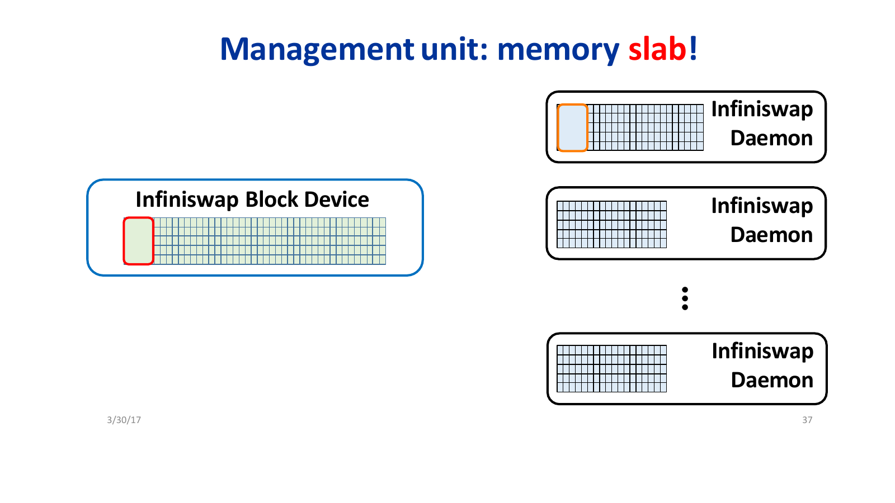

Infiniswap 使用 memory slab 作为管理单位。一个 slab 包含许多页面，并被分配给某台远端机器。这会减少元数据和映射管理开销，同时本地 OS 仍然可以按 page granularity 执行 swap。

### 4.4 选择远端机器
系统必须回答两个问题：
- 新的 remote slab 应该放在哪台远端机器？
- 需要容量时，应该 evict 哪个 remote mapping？

Central controller 可以平衡 memory utilization，但它会成为扩展性和可用性的瓶颈。Infiniswap 因此采用基于 **power of two choices** 的去中心化方案。

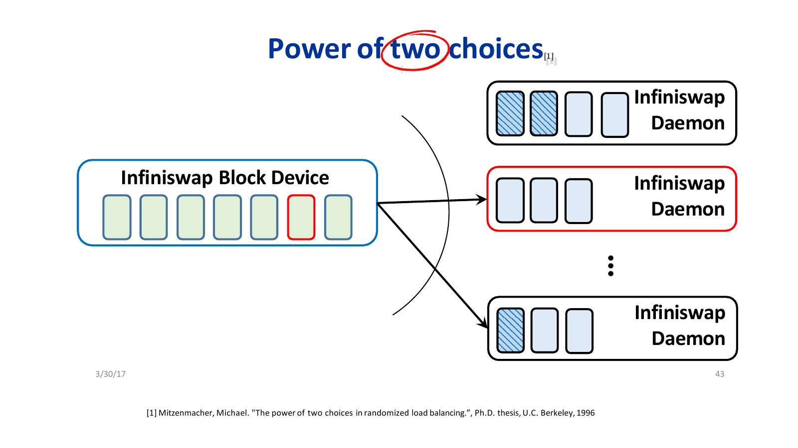

基本过程很简单：
1. 随机采样两台候选远端机器。
2. 比较它们的可用远程内存容量。
3. 把 slab 放到更合适的一台上。

这种随机负载均衡策略远比全局协调便宜，但比单次随机选择能显著改善负载均衡。

### 4.5 评估与局限
评估使用 32-node cluster、56Gbps InfiniBand NIC，以及 VoltDB、Memcached、PowerGraph、GraphX 等应用。

结果强调两个方面：
- 当 50% working set 在内存中、其余部分由 Infiniswap 而不是磁盘支撑时，应用性能提升 **2-16x**。
- 在混合 90 个 container 的实验中，cluster memory utilization 从 **40.8% 提升到 60%**，即 **1.47x**。

局限也很重要：
- fault tolerance 存在权衡，因为 local disk backup 可能成为瓶颈；
- 多个 remote replicas 可以提升容错，但会降低空间效率；
- 不同应用之间的 performance isolation 仍然是挑战。

### 4.6 Infiniswap 小结
**Infiniswap: remote paging over RDMA** 是一个实用的 memory disaggregation 系统。它保持应用和硬件不变，利用 OS swap interface，通过 RDMA 加速远程内存，并用去中心化 slab placement 扩展到集群。

它和 OS 的联系非常直接：这是 demand paging，只是加入了一个介于 DRAM 与磁盘之间的新 backing tier。

## 5. AIFM：Application-Integrated Far Memory
AIFM 研究的问题和 Infiniswap 接近，但在透明性权衡上走了相反方向。Infiniswap 保留 OS paging interface；AIFM 则认为 OS paging 因为缺乏应用语义并且 kernel overhead 高，会浪费大量性能。

### 5.1 为什么现有 Far-Memory 系统浪费性能
内存型应用，例如 data analytics、web caching、database 和 graph processing，受限于单台服务器的物理内存边界。它们不能廉价地 overcommit memory，因此运维者常常为峰值用量过度配置内存。

Far memory 的思路是通过高速网络使用远端空闲内存。但现有 OS-paging systems 表现不好。在一个只给 25% working set local memory 的 data analytics 示例中，state-of-the-art 浪费了约 70% 的可达性能。

原因是：
- **Semantic gap**：OS 看到的是 page，而不是应用对象。Page granularity 会造成 read/write amplification，也让 prefetching 困难。
- **High kernel overheads**：page fault 很贵，in-kernel network I/O 可能通过 busy polling 消耗 CPU cycles。

:::remark 问题：为什么 page granularity 会造成 amplification？
如果应用只需要一个 page 中的小对象，OS paging 仍然可能取回整个 page。如果应用随后访问分布在其他页面上的相关对象，OS 也很难提前看出模式。应用知道数据结构和遍历顺序，但 OS 只能在 page fault 发生后看到结果。
:::

### 5.2 AIFM 设计
AIFM 的关键思想是 **swap memory using a userspace runtime**。

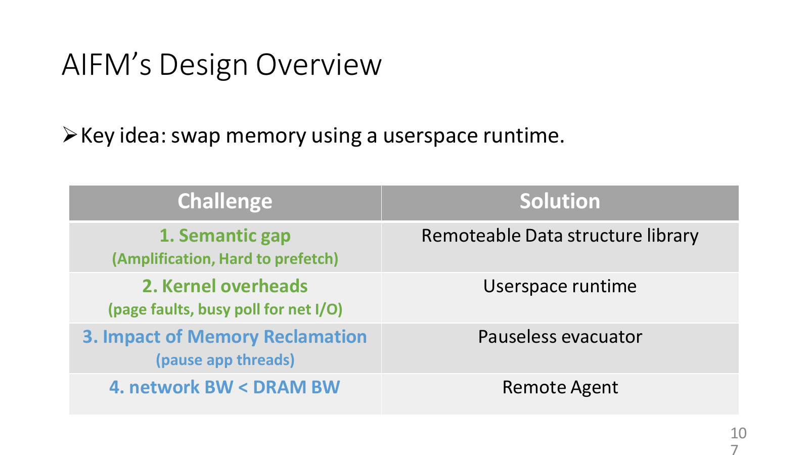

设计把每个挑战对应到一个组件：

| 挑战 | AIFM 方案 |
|---|---|
| Semantic gap、amplification、hard prefetching | Remoteable data structure library |
| Kernel overheads、page faults、busy polling | Userspace runtime |
| Memory reclamation 影响、暂停 app threads | Pauseless evacuator |
| Network bandwidth 低于 DRAM bandwidth | Remote agent |

### 5.3 Remoteable Data Structures 与 Userspace Runtime
Remoteable data structure library 暴露应用语义。程序不再只使用普通的 `std::unordered_map`、`std::array` 和 `std::list`，而是可以使用 `RemHashTable`、`RemArray`、`RemList` 等结构。

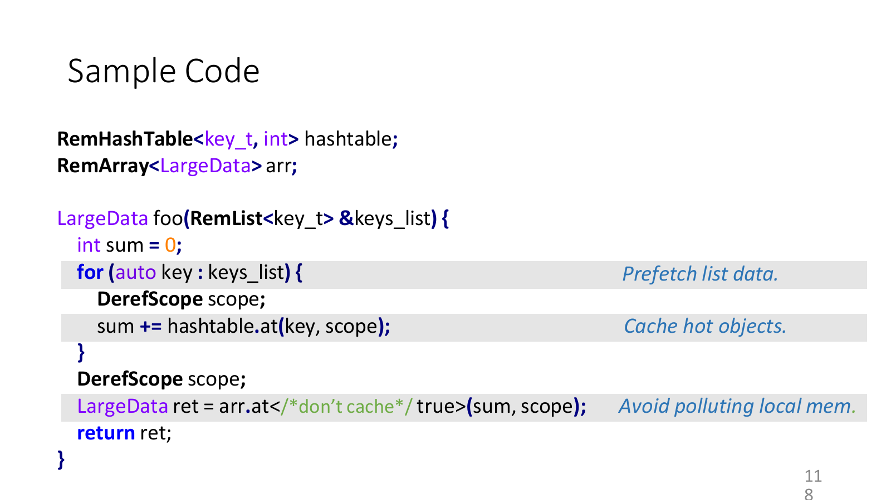

代码示例展示了变化：
- 遍历 remote list 时可以 prefetch list data；
- 通过 hash table 访问时可以 cache hot objects；
- 读取大型 array 时可以使用 "do not cache" 选项，避免污染 local memory。

Userspace runtime 负责对象移动，不再依赖 kernel page fault。如果一个 user-level thread 等待远程对象，runtime 可以 yield 给另一个 user-level thread。这可以隐藏延迟，并把调度和网络活动保留在 user space。

### 5.4 Pauseless Evacuator 与 Remote Agent
Pauseless evacuator 把 cold 或可回收对象从 local memory 移动到 far memory，同时避免长时间停止应用线程。它解决的是 memory reclamation 本身可能造成 pause 的问题。

Remote agent 解决的是 network bandwidth 低于 DRAM bandwidth 的问题。AIFM 不总是把对象拿回 local memory，而是可以在远端对象附近执行轻量操作。例如复制 object `1` 可以通过向 remote agent 发送小请求完成，由 remote agent 在 far memory 附近执行 copy。

### 5.5 评估与小结
AIFM 实现了六种数据结构：Array、List、Hashtable、Vector、Stack、Queue。Runtime 构建在 Shenango 之上，并使用 TCP far-memory backend。

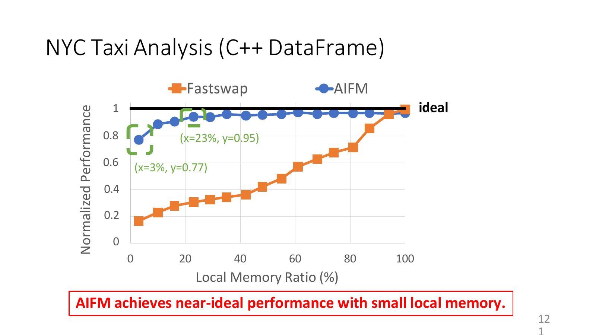

结果表明：
- AIFM 可以用适度计算隐藏 far-memory latency。
- 在 NYC Taxi analysis 中，AIFM 只用较小 local memory 就能接近 ideal performance。
- Synthetic web frontend 获得最高 **13x end-to-end speedup**。
- Data-structure microbenchmarks 获得最高 **61x speedup**。

关键启发是透明性与性能之间的权衡。AIFM 放弃了一部分透明性，因为应用需要使用 AIFM data structures；但它获得了应用语义，并避开了 OS paging 最昂贵的部分。

## 6. PipeSwitch：深度学习应用的快速流水化上下文切换
PipeSwitch 研究深度学习工作负载中的 GPU 内存管理。Training 追求 high throughput；inference 追求 low latency。很多系统因此把它们放在不同 GPU 集群中，但这会导致 utilization 很低。理想情况是 training 和 inference 共享 GPU cluster。

障碍在于 context switching。从 old model 切换到 new model 可能需要移动 model parameters、分配 GPU memory、初始化任务、清理旧任务。已有方案有明显缺点：
- NVIDIA MPS 有 contention overhead。
- Salus 要求所有模型预先加载进 GPU memory。
- 动机示例中的 context switch 可能需要约 **6 秒**。

PipeSwitch 的目标是让多个深度学习应用以 fine-grained time sharing 的方式高效 multiplex GPU，并实现 **millisecond-scale context switching latencies**。

### 6.1 架构与执行
PipeSwitch 使用 controller、active worker、standby workers 和 memory daemon。

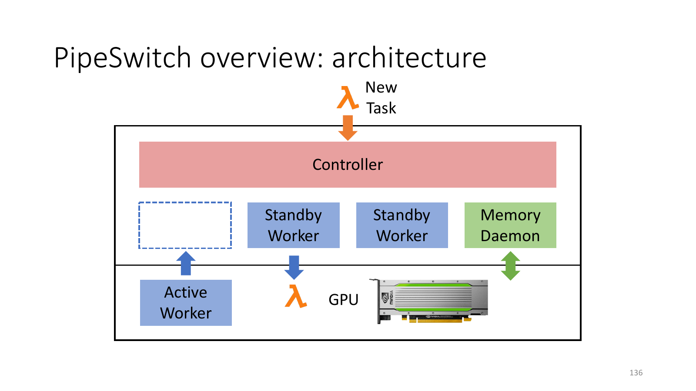

新任务到达时：
1. 系统停止当前任务，并为下一个任务做准备。
2. 下一个任务使用 pipelined model transmission 执行。
3. 前一个任务的环境被清理。

主要 overhead sources 包括：
- model transmission；
- memory allocation；
- task initialization；
- task cleaning。

### 6.2 Pipelined Model Transmission
深度学习模型具有层次结构。顺序切换会先通过 PCIe 传输所有 layers，然后才在 GPU 上执行。这会浪费时间，因为 PCIe transfer 和 GPU computation 没有重叠。

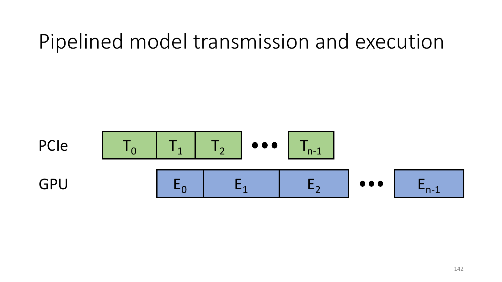

PipeSwitch 把过程流水化：
1. 传输 layer 0；
2. GPU 执行 layer 0 时，同时传输 layer 1；
3. GPU 执行 layer 1 时，同时传输 layer 2；
4. 持续重叠 transmission 和 execution。

难点在于如何给 layers 分组。过多小组会导致很多 PCIe calls 和 synchronization overhead；过少大组会减少重叠机会。寻找最优分组可能需要指数时间，因此 PipeSwitch 使用 heuristics 进行剪枝。

### 6.3 Unified Memory Management
PipeSwitch 还通过 unified memory management 减少 memory allocation overhead。

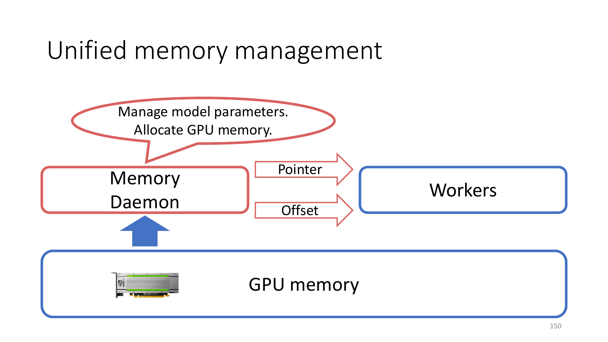

Memory daemon 管理 model parameters 和 GPU memory。Workers 通过 pointers 和 offsets 访问内存，因此 GPU memory 可以被更系统地分配和复用，而不是每个 task 都重复重建。

### 6.4 Active-Standby Worker Switching
Task initialization 和 cleaning 通过 active-standby worker switching 处理。

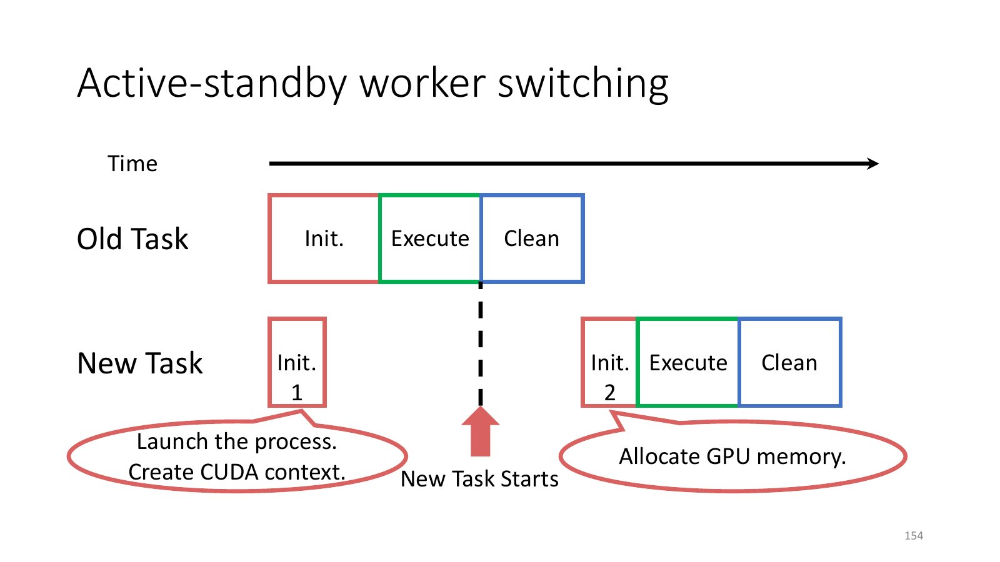

过程如下：
1. Standby worker 在新任务真正开始前完成初始化的第一部分，例如 launch process 和 create CUDA context。
2. 切换点到来时，系统执行第二部分，例如 allocate GPU memory。
3. 新任务开始执行，同时旧任务 cleanup 从关键路径中解耦。

这类似 OS context-switch 优化：把状态准备工作移出关键路径，并尽量减少真正 switch point 上要做的事。

### 6.5 评估与小结
PipeSwitch 在 AWS EC2 上评估，使用 NVIDIA Tesla V100 和 T4 GPU、CUDA 10.1、PyTorch 1.3.0，以及 ResNet-152、Inception-v3、BERT-base 等模型。

评估问题包括：
- PipeSwitch 能否满足 SLO？
- PipeSwitch 能否提供高 utilization？
- PipeSwitch 的设计选择效果如何？

报告结论是：
- PipeSwitch achieves low context switching latency。
- PipeSwitch achieves near **100% utilization**。

PipeSwitch 的核心内存管理思想是：GPU model state 就是一种 context。要高效共享 GPU，就必须像 OS 处理 process state 一样移动、分配、初始化和清理这个 context，只是这里还要利用模型层结构以及 PCIe/GPU 重叠。

## 7. TGS：容器云中的透明 GPU 共享
TGS 研究容器云中的深度学习训练任务。训练任务是重要的数据中心工作负载，但生产环境 GPU 利用率很低：讲义引用 Microsoft 平均 GPU utilization 只有 **52%**，Alibaba median GPU utilization 不超过 **10%**。根因是静态分配：每个 GPU 被分配给单个 container。

### 7.1 现有 GPU 共享方案
通用思路是把 job 分成两类：
- **Production jobs** 应当在不发生性能下降的情况下运行。
- **Opportunistic jobs** 使用剩余 GPU resources。

现有方案不能同时提供所有目标性质：
- AntMan 需要修改 TensorFlow 或 PyTorch，缺乏 transparency。
- NVIDIA MPS 透明，但 utilization 低、fault isolation 弱，而且不支持 GPU memory oversubscription。
- NVIDIA MIG 提供硬件分区，但不能任意 partition GPU，不能动态改变 GPU resources，只在部分 GPU 上可用，也不支持 multi-GPU instance 的 GPU sharing。

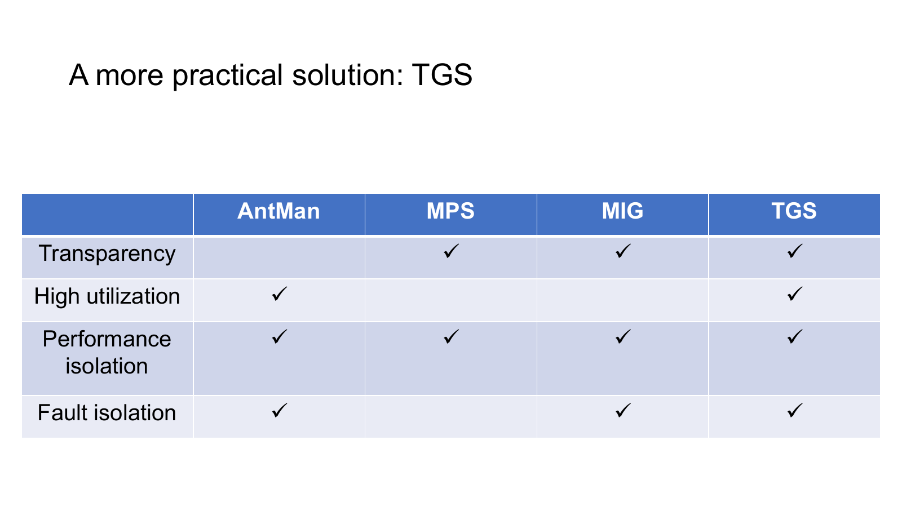

TGS 希望同时提供四个性质：
- transparency；
- high utilization；
- performance isolation；
- fault isolation。

### 7.2 架构
TGS 位于 containers 下方、host OS/hardware 上方。它包含：
- rate monitor；
- rate control；
- unified memory。

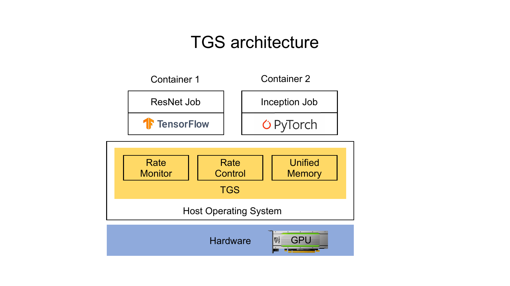

重点是在 TensorFlow、PyTorch、Docker、Kubernetes 风格部署看来保持透明，同时仍然控制 GPU compute 和 memory sharing。

### 7.3 共享 GPU Compute：Adaptive Rate Control
一个 strawman compute-sharing 方案是 priority scheduling：基于 GPU kernel queues 控制 opportunistic jobs。问题是 queue state 不能准确反映剩余 GPU resources，因此 utilization 仍然低。

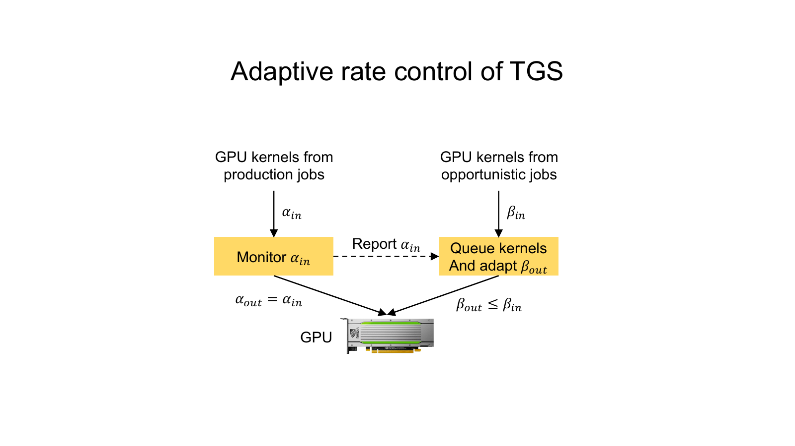

TGS 使用 adaptive rate control：
1. Production jobs 以 `\alpha_{in}` 的速率提交 kernels。
2. Monitor 观察 production-job 行为并报告。
3. TGS 让 production jobs 以 `\alpha_{out} = \alpha_{in}` 输出，从而保护它们。
4. Opportunistic jobs 以 `\beta_{in}` 输入，但 TGS 控制其输出，使 `\beta_{out} \le \beta_{in}`，只使用剩余 GPU capacity。

系统因此保护 production jobs，同时把剩余容量供给 opportunistic jobs。

### 7.4 共享 GPU Memory：Transparent Unified Memory
GPU memory sharing 有两个问题：
- 总 GPU memory consumption 可能超过 GPU memory capacity 并导致 OOM，也就是 weak fault isolation；
- 某些 job 总是占满 GPU memory，导致 utilization 低。

在 OS layer，TGS 不能直接要求深度学习框架释放 unused GPU memory，也不能直接把框架中的 pointer address 从 GPU memory 改到 host memory。

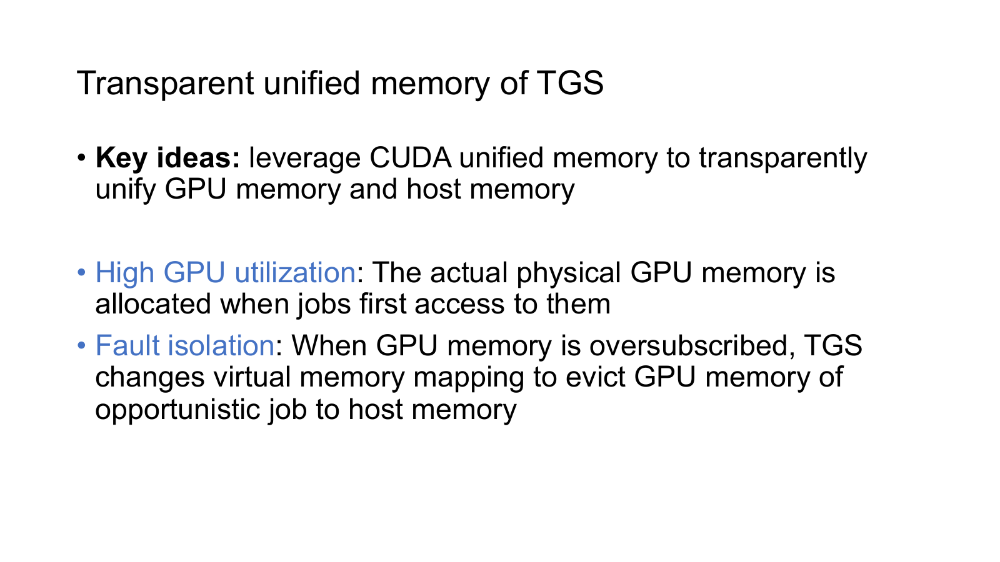

关键思想是利用 CUDA unified memory 透明地统一 GPU memory 和 host memory：
- 只有当 jobs first access 时才分配实际 physical GPU memory，从而提高 utilization；
- 当 GPU memory oversubscribed 时，TGS 改变 virtual-memory mappings，把 opportunistic jobs 的 GPU memory evict 到 host memory，从而保护 production jobs。

这本质上是在 GPU memory 和 host memory 之间做 demand paging，但被包装成容器的透明 GPU sharing。

### 7.5 评估与小结
TGS 由约 3000 行 C++ 和 Python 实现，并集成 Docker 与 Kubernetes。评估使用 NVIDIA A100 和 V100 GPUs、Microsoft Philly trace，以及 ResNet、ShuffleNet、MobileNet、GCN、BERT、GPT-2、DLRM 等模型。

报告结果包括：
- 在包含 50 个 production jobs 和 50 个 opportunistic jobs 的 mixed workload stream 中，opportunistic jobs 相比 exclusive access 有 **52% JCT reduction**。
- Production jobs 相比 uncontrolled co-execution 有 **21% JCT reduction**。
- 与 AntMan 相比，TGS 在不牺牲性能的情况下提供 transparency。
- 在 GPU memory oversubscription 下，TGS 相比 MPS 最高带来 **15x throughput improvement**。

关键启发是：GPU sharing 也是内存管理。系统需要 virtual memory、oversubscription、eviction、fault isolation 和 adaptive scheduling。

## 8. 横向比较
六篇论文形成了从透明 OS-level 机制到 application-integrated 机制的一条光谱。

| 论文 | 主要抽象 | 移动的是什么 | 谁来管理 | 透明性权衡 |
|---|---|---|---|---|
| FaRM | 分布式共享地址空间 | RDMA 上的对象和事务 | Distributed runtime | 应用使用 FaRM 抽象。 |
| vLLM | 虚拟化 KV cache | KV blocks | LLM serving engine | 对模型语义透明，但位于 serving system 内部。 |
| Infiniswap | Swap block device | Pages/slabs 到 remote DRAM | OS block device + daemon | 对应用透明。 |
| AIFM | Remoteable data structures | Objects 到 far memory | Userspace runtime | 需要应用/library 修改。 |
| PipeSwitch | GPU task context | Model layers/state | GPU scheduler/runtime | 集成后对 workload 透明。 |
| TGS | 带 unified memory 的共享 GPU | GPU pages 到 host memory | OS-layer sharing system | 对 containers/frameworks 透明。 |

最重要的设计轴是 **谁知道语义**：
- OS-level systems 更透明，但通常更不了解访问模式。
- Application-level systems 知道更多，因此能更好地 prefetch/share/recompute，但需要 runtime 或 API 集成。

:::remark Discussion：这些论文让我们学到了什么？
经典内存管理思想非常可迁移。Paging、virtualization、sharing、copy-on-write、preemption、replacement 和 fault isolation 一直反复出现，只是现在的“page”可能是 KV block、remote slab、application object、model layer 或 GPU unified-memory mapping。
:::

:::remark Discussion：哪些论文更容易让人喜欢，为什么？
vLLM 很优雅，因为 OS 类比几乎完全贴合：KV blocks 像 pages，block tables 像 page tables，copy-on-write 自然支持 sampling 和 beam search。Infiniswap 的吸引力则在另一端：它保持 application transparency，并使用已有 swap path。AIFM 在性能比完全透明性更重要时非常有说服力。
:::

:::remark Discussion：哪些论文可能被批评？
FaRM 和 AIFM 都要求应用使用特殊抽象，可能限制采用。Infiniswap 依赖远程内存网络行为，并存在 fault-tolerance tradeoff。PipeSwitch 和 TGS 面向 GPU workloads，而 GPU 硬件/软件栈变化很快，因此 portability 和长期维护是真实问题。
:::

:::remark Discussion：能否把它们和经典 memory management techniques 对比？
可以。vLLM 最接近 paging 和 page tables。Infiniswap 最接近 swap-backed demand paging。AIFM 像 object-level virtual memory。PipeSwitch 像带 staged state transfer 的 process context switching。TGS 像面向 GPU containers 的 virtual memory 加 scheduling。FaRM 则像带 transactional consistency 的 distributed shared memory。
:::

:::remark Discussion：能否提出新想法？
一个有价值的方向是 hybrid transparency：为兼容性保留 OS-level fallback，同时允许应用可选地暴露 semantic hints。例如 LLM serving engine 可以把 KV-block lifetime 和 sharing hints 暴露给 GPU memory manager；far-memory runtime 也可以告诉 OS 哪些对象可 prefetch、可 recompute 或 latency critical。
:::

## Exam Review

### 每篇论文一句话
- **FaRM**：用 RDMA、共享地址空间和事务实现高速分布式内存计算。
- **vLLM/PagedAttention**：对 LLM KV cache 做 application-level paging and virtualization。
- **Infiniswap**：通过 swap-like block device 实现透明的 remote paging over RDMA。
- **AIFM**：把 far memory 集成到应用数据结构和 userspace runtime 中。
- **PipeSwitch**：通过流水化 GPU context switching 支持细粒度共享深度学习应用。
- **TGS**：通过 adaptive rate control 和 unified memory 在容器云中透明共享 GPU。

### 机制清单
- FaRM 使用 RDMA reads/writes、locality-aware placement、lock-free reads 和 transactions。
- vLLM 使用 fixed-size KV blocks、block tables、on-demand allocation、sharing、copy-on-write 和 recomputation-based recovery。
- Infiniswap 使用 Infiniswap block device、local disk backup、Infiniswap daemon、RDMA、slabs 和 power of two choices。
- AIFM 使用 remoteable data structures、userspace runtime、pauseless evacuator 和 remote agent。
- PipeSwitch 使用 pipelined model transmission、unified memory management 和 active-standby worker switching。
- TGS 使用 rate monitor/control 和 CUDA unified memory，透明共享 GPU compute 与 memory。

### 值得记住的数字
- FaRM on TAO：约 **6 Mops/s/server**，约 **42 微秒 average latency**。
- vLLM：过去系统 KV cache utilization 可能只有 **20-40%**；PagedAttention 将内存效率提升 **2.5x-5x**，吞吐最高提升 **4x**。
- Infiniswap：应用性能提升 **2-16x**；cluster memory utilization 从 **40.8% 提升到 60%**。
- AIFM：最高 **13x end-to-end speedup**，data-structure microbenchmark 最高 **61x speedup**。
- PipeSwitch：目标是 **millisecond-scale** context switch 和接近 **100% GPU utilization**。
- TGS：opportunistic-job JCT 降低 **52%**，production-job JCT 降低 **21%**，oversubscription throughput 相比 MPS 最高提升 **15x**。

### 常见考法
- 解释为什么 PagedAttention 相比连续 KV cache 分配能减少碎片。
- 比较 Infiniswap 和 AIFM：哪个更透明，哪个拥有更多应用语义？
- 解释 PipeSwitch 如何重叠 model transmission 和 execution。
- 解释 TGS 如何保护 production jobs，同时把空闲 GPU capacity 给 opportunistic jobs。
- 选择一篇论文，把它的设计映射到经典 OS 概念，例如 paging、page tables、copy-on-write、swapping、preemption 或 scheduling。

### 常见误区
- 不要把所有“remote memory”论文混为一谈。Infiniswap 是 OS-level remote paging；AIFM 是 application-integrated object movement；FaRM 是 distributed shared memory。
- 不要把 vLLM 只描述成 GPU 优化。它的核心贡献是 KV cache memory virtualization。
- 不要忘记 transparency/performance tradeoff：知道更多应用语义的系统，通常也需要更多集成。
- 不要忽略 GPU sharing 中的 fault isolation。没有隔离的 memory oversubscription 会让一个 job 的内存行为变成另一个 job 的失败。
