# Lec19 - I/O: General I/O, Disk, and SSD

## Learning Objectives
After this lecture, you should be able to explain why I/O is a special operating-system problem, how processors communicate with I/O controllers, how PIO, DMA, interrupts, polling, and device drivers fit together, and how storage-device performance differs between HDDs and SSDs. You should also be able to compute basic disk latency and explain why file systems and storage stacks must be designed around the real behavior of the underlying device.

## 1. Why I/O Is Hard
An operating system has already built several major abstractions: process APIs, synchronization and scheduling for CPU management, and virtual memory for memory management. I/O adds a different kind of boundary: the system must interact with physical devices whose interfaces, speeds, failure modes, and timing behavior vary widely.

Without I/O, computers are not very useful. But I/O is difficult for three reasons:
- There are thousands of devices, and each device is slightly different.
- Devices can be unreliable because media can fail and transfers can suffer errors.
- Devices can be unpredictable or slow, so the OS may not know when an operation will finish or how expensive it will be.

:::remark Question: How can we standardize the interfaces to thousands of different devices?
The OS standardizes devices by placing **device drivers** below common kernel interfaces. Applications and high-level kernel subsystems use uniform operations such as `open`, `read`, `write`, `seek`, sockets, or memory-mapped files. The device driver translates those common operations into device-specific register writes, queue updates, DMA commands, and interrupt handling.
:::

:::remark Question: How can we make unreliable devices reliable?
Reliability is built in layers. Hardware controllers use mechanisms such as error-correcting codes, sector remapping, and internal retry logic. The kernel adds timeout handling, error reporting, buffering, file-system consistency rules, and sometimes redundancy. The key idea is that the raw device is not exposed directly as a trusted perfect object; it is wrapped by controllers, drivers, and higher-level storage software.
:::

:::remark Question: How can we manage devices whose behavior or performance is not known in advance?
The OS separates request submission from completion. For slow or unpredictable devices, a thread can block, a non-blocking call can return partial progress, or an asynchronous request can complete later. Internally, the OS uses interrupts and polling to learn about completion, and schedulers or queues to avoid wasting CPU time while the device is busy.
:::

Device rates can vary over **12 orders of magnitude**. A keyboard or mouse produces tiny amounts of data; a disk, SSD, network interface, PCIe link, memory bus, or system bus may move data at MB/s, GB/s, or more. The design rule is therefore two-sided:
- For fast devices, the OS must avoid high overhead per byte.
- For slow devices, the OS must avoid wasting CPU time waiting.

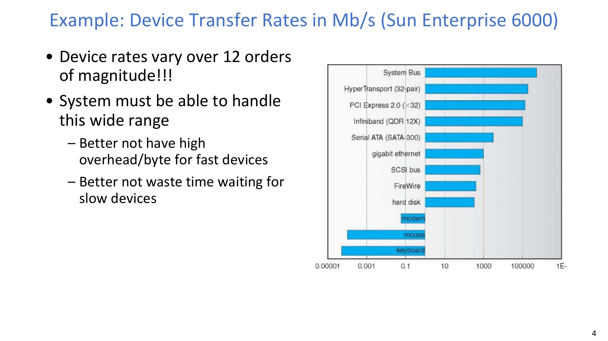

## 2. The Big Picture of an I/O System
I/O devices are usually not controlled directly by the CPU. Instead, visible devices such as disks, SSDs, network cards, displays, keyboards, and mice are supported by **I/O controllers**. A controller is hardware that understands the device and exposes a simpler interface to the processor.

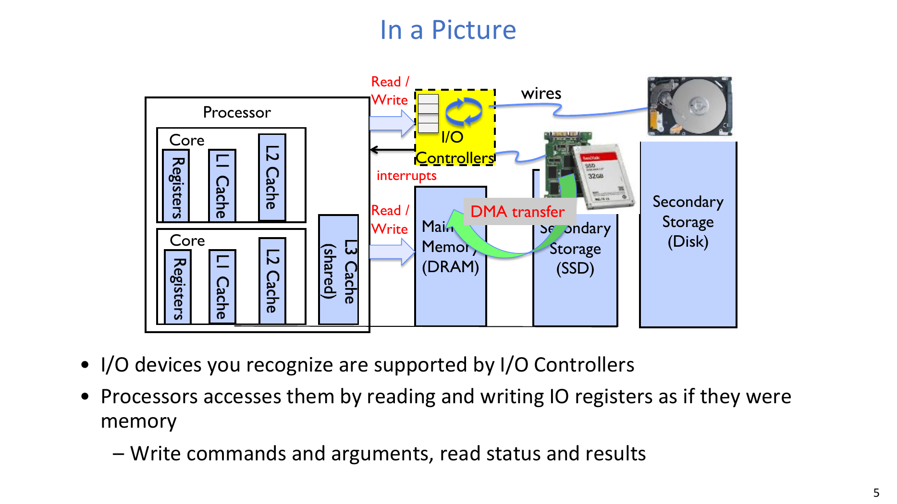

The processor accesses a controller by reading and writing controller state. That state may appear as:
- **registers**, such as command, status, control, and data registers;
- **queues**, such as request queues or completion queues;
- **memory regions**, such as a frame buffer or a memory-mapped command queue.

A typical operation has this shape: the CPU writes commands and arguments to the controller, the controller operates the device, and the CPU later reads status and results. For large transfers, the controller may move data directly to or from main memory through DMA.

Modern I/O systems are built from many controllers and interconnects. A machine can contain graphics controllers, bridge or memory controllers, cache, SCSI or SATA controllers, expansion buses, USB, network cards, disks, displays, keyboards, printers, speakers, and other peripherals. The architecture is intentionally hierarchical because a single flat interconnect would not scale well across devices with very different bandwidth and latency requirements.

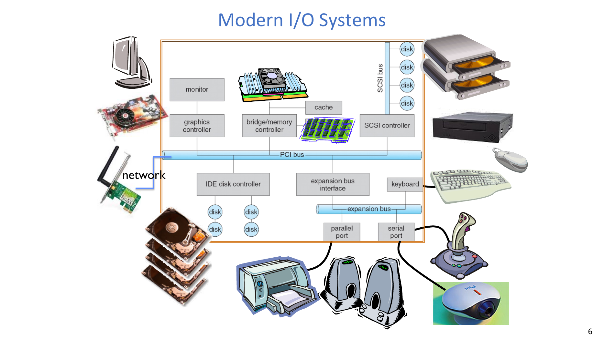

## 3. Buses, PCI, and PCI Express
A **bus** is a common set of wires plus protocols for communication among hardware devices and for carrying out data-transfer transactions. A bus supports operations such as reads and writes and typically contains control lines, address lines, and data lines.

The bus protocol describes the sequence of actions needed for a transaction:
1. An initiator requests access to the bus.
2. Arbitration grants one participant the right to use it.
3. The recipient is identified.
4. The participants perform a handshake to convey address, length, and data.

The reason to use a bus is that it lets the system connect `n` devices over one set of wires, connections, and protocols instead of creating `O(n^2)` direct relationships. The cost is serialization: only one transaction can use a traditional shared bus at a time, so the other devices must wait.

:::remark Question: Why do high-bandwidth links tend to be close to the processor, while lower-bandwidth links are pushed outward?
The processor and memory system need low latency and high bandwidth, so their interconnects are wide, fast, and less flexible. Peripheral devices are more diverse and often slower, so the outer I/O subsystem trades bandwidth for flexibility, compatibility, and the ability to attach many kinds of hardware.
:::

**PCI (Peripheral Component Interconnect)** started life as a bus. Its parallel-bus structure had limitations: address and data signals could be multiplexed across many requests, and the slowest devices still needed to participate enough to tell what was happening, for example during arbitration.

**PCI Express "Bus"** is **no longer a parallel bus**. It is **really a collection of fast serial channels or "lanes"**. Devices can use as many lanes as they need to achieve a desired bandwidth, and slow devices do not have to share the same parallel bus with fast devices. This changes the multiplexing model from time multiplexing on one shared bus to more space multiplexing through separate lanes.

One success of the Linux device abstraction is that systems could migrate from PCI to PCI Express even though the physical interconnect changed completely. The old software-facing API could still work because the OS had already separated device-interface semantics from physical wiring.

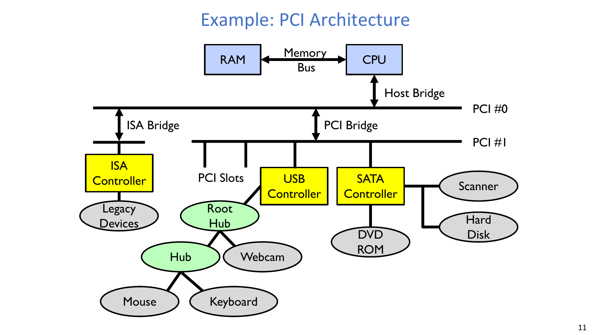

A representative PCI architecture contains RAM and CPU connected through a memory bus and host bridge. From there, PCI bridges and ISA bridges connect PCI slots, USB controllers, SATA controllers, root hubs, webcams, keyboards, mice, DVD-ROMs, hard disks, scanners, and legacy devices. The structure is a tree of bridges and controllers rather than a single direct connection from the CPU to every device.

## 4. How the Processor Talks to a Device
The CPU interacts with a **controller**. A controller contains a set of registers that can be read and written, and it may also contain memory for request queues, completion queues, or device data.

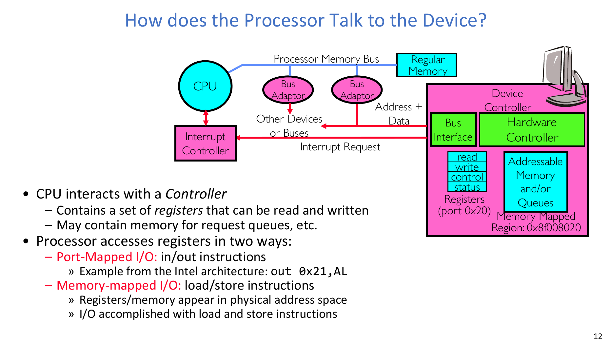

There are two common ways for the processor to access controller registers:
- **Port-Mapped I/O** uses special I/O instructions. On Intel-style architectures, an instruction such as `out 0x21, AL` writes to an I/O port.
- **Memory-mapped I/O** makes registers or device memory appear in the physical address space, so ordinary load and store instructions perform I/O.

Memory-mapped I/O is especially important because it makes device control look like memory access while still letting the OS protect those regions through address translation.

### 4.1 Example: Memory-Mapped Display Controller
A memory-mapped display controller maps its control registers and display memory into physical address space. Addresses may be set by hardware jumpers or at boot time.

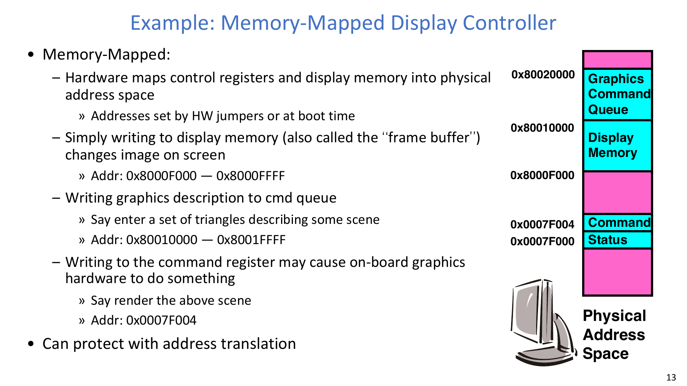

The example contains three different kinds of mapped state:
- The **frame buffer**, also called display memory, is mapped at `0x8000F000 - 0x8000FFFF`. Writing bytes there changes the image on the screen.
- The **graphics command queue** is mapped at `0x80010000 - 0x8001FFFF`. Software can write a graphics description, such as a set of triangles describing a scene, into this queue.
- The **command register** is mapped at `0x0007F004`, and writing a command such as "render the scene" may cause on-board graphics hardware to start work. A status register is shown at `0x0007F000`.

:::remark Question: Why is this still safe if device memory appears inside the physical address space?
The OS can protect memory-mapped I/O with address translation. User programs should not normally receive direct mappings to arbitrary device registers. The kernel controls which virtual addresses map to which physical device regions, so it can expose safe interfaces while hiding privileged registers.
:::

### 4.2 There Is More Than Just a CPU
Modern processors integrate more I/O-related functionality than the phrase "CPU" suggests. A Skylake-era x86 chip includes four out-of-order cores, deeper buffers, Intel MPX, Intel SGX, an issue width of up to 6 micro-operations per cycle, a GPU, a system agent for memory and fast I/O, a shared L3 cache connected by an on-chip ring bus, and integrated I/O.

Important integrated I/O pieces include:
- an integrated memory controller with two independent DRAM channels;
- high-speed PCI Express for graphics cards;
- a Direct Media Interface (DMI) connection to the Platform Controller Hub (PCH).

The **Platform Controller Hub** connects to the processor through DMI and handles many lower-speed I/O types: USB, Ethernet, Thunderbolt 3, audio, BIOS support, lower-speed PCIe, and SATA for disks. This is another example of hierarchical I/O: the fastest paths are near the processor, while diverse peripheral functions are attached through a controller hub.

## 5. Operational Parameters for I/O
I/O devices can be characterized along several axes.

| Parameter | Main choices | Examples and meaning |
|---|---|---|
| Data granularity | Byte vs. block | A keyboard may produce one byte or character at a time; disks and networks usually move blocks or packets. |
| Access pattern | Sequential vs. random | Tape is naturally sequential; disks and CDs can be accessed randomly, but random access has fixed startup overhead. |
| Monitoring | Polling vs. interrupts | Some devices require continual status checks; others generate interrupts when they need service. |
| Transfer mechanism | Programmed I/O vs. DMA | Small data can pass through the CPU; large data should usually be moved directly by a controller. |

These parameters matter because an I/O interface is not only about the operations it supports; it is also about how expensive those operations are and how the OS should wait for them.

## 6. Moving Data: Programmed I/O and DMA
**Programmed I/O** transfers each byte through the processor, using either special I/O instructions or ordinary loads and stores to memory-mapped registers. Its advantage is simple hardware and easy programming. Its disadvantage is that it consumes CPU cycles in proportion to the data size.

**Direct Memory Access (DMA)** gives the controller access to the memory bus and asks it to transfer data blocks directly to or from memory. DMA is the standard answer when a device needs to move more than a small amount of data.

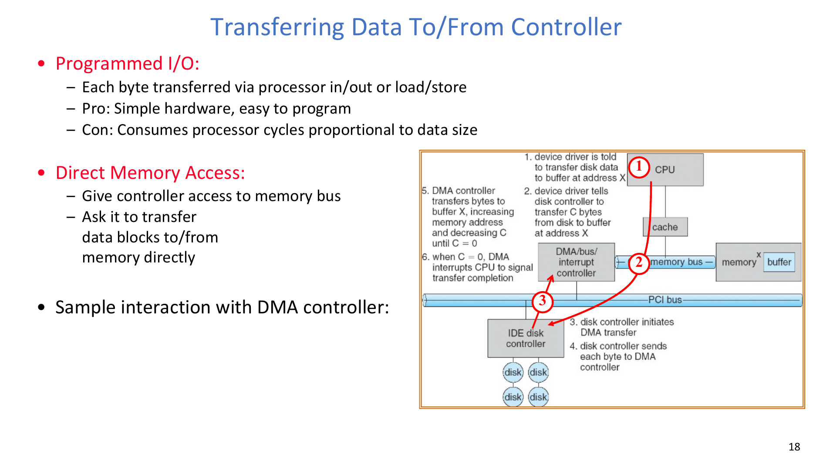

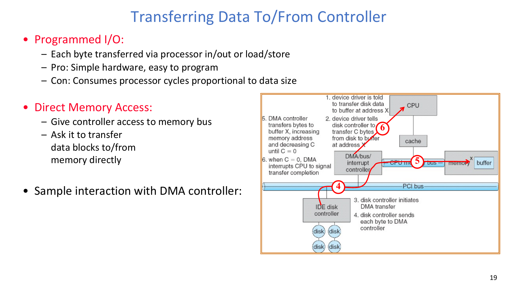

A representative DMA read from disk to memory proceeds as follows:
1. The device driver is told to transfer disk data into a memory buffer at address `X`.
2. The driver tells the disk controller to transfer `C` bytes from disk into the buffer at address `X`.
3. The disk controller initiates a DMA transfer.
4. The disk controller sends each byte to the DMA controller.
5. The DMA controller transfers bytes to buffer `X`, incrementing the memory address and decrementing `C` until `C = 0`.
6. When `C = 0`, the DMA controller interrupts the CPU to signal transfer completion.

The important change over time is that the CPU is heavily involved only at the beginning and end. It sets up the command and handles completion, but the bulk data movement does not require a CPU instruction for every byte.

:::remark Question: When is Programmed I/O still reasonable?
Programmed I/O is reasonable for tiny transfers, simple devices, or early boot code where simplicity matters more than efficiency. It becomes wasteful for large transfers because every byte consumes CPU attention that could have been used for computation or scheduling another process.
:::

## 7. Learning That I/O Completed: Interrupts and Polling
The OS needs to know when an I/O device has completed an operation or encountered an error. There are two basic notification mechanisms.

**I/O Interrupt** means the device generates an interrupt whenever it needs service. Interrupts handle unpredictable events well, but they have relatively high overhead.

**Polling** means the OS periodically checks a device-specific status register. The device places completion information in that register. Polling has lower overhead per check, but it can waste many CPU cycles when I/O operations are infrequent or unpredictable.

Real devices often combine both. For example, a high-bandwidth network adapter may interrupt for the first incoming packet, and then the OS polls for following packets until hardware queues are empty. This avoids an interrupt storm under high load while still reacting promptly when traffic first arrives.

:::remark Question: Why not always use interrupts?
Interrupts are excellent for rare or unpredictable events, but each interrupt forces the CPU to stop its current work, enter the kernel, save state, run a handler, and later resume. At very high event rates, that overhead can dominate useful work. Polling can be better when the OS already expects more completions soon.
:::

:::remark Question: Why not always poll?
Polling is efficient only when the device is likely to have work ready. If the device is idle most of the time, polling burns CPU cycles repeatedly checking an empty status register. Blocking and interrupts let the CPU run other work instead.
:::

## 8. Kernel I/O Subsystem and Device Drivers
The kernel organizes I/O through common subsystems. A system call enters the kernel through the system-call interface, then reaches process management, memory management, file systems, device control, networking, or other components. File systems use the VFS and block-device layer; networking uses network subsystems and interface drivers; terminals and character devices use TTY and device-control paths.

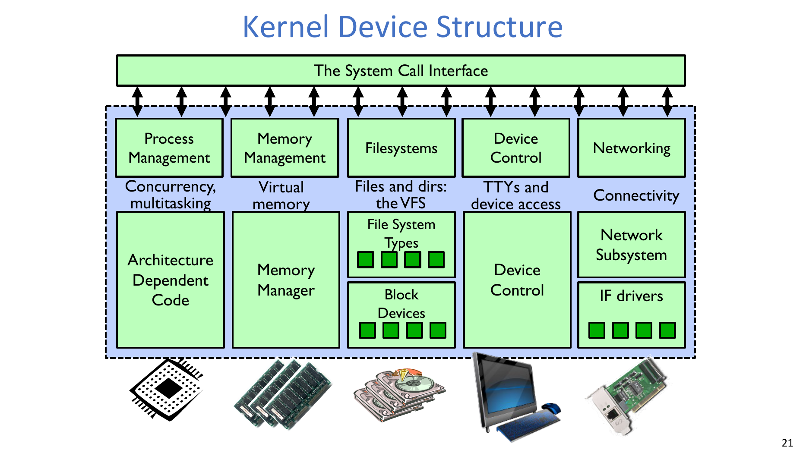

A key definition is: **Device Driver: Device-specific code in the kernel that interacts directly with the device hardware**. A driver supports a standard internal interface so the same kernel I/O system can interact with many different devices. Special device-specific configuration can be supported through the `ioctl()` system call.

Device drivers are typically divided into two pieces:
- The **top half** is accessed in the call path from system calls. It implements standard cross-device calls such as `open()`, `close()`, `read()`, `write()`, and `ioctl()`. It is the kernel's interface to the driver. It starts I/O to the device and may put the calling thread to sleep until the operation finishes.
- The **bottom half** runs as an interrupt routine. It receives input, transfers the next block of output, records completion, and may wake sleeping threads if I/O is now complete.

### 8.1 Life Cycle of an I/O Request
The life cycle of an I/O request crosses user code, kernel subsystems, driver code, interrupt handling, and hardware.

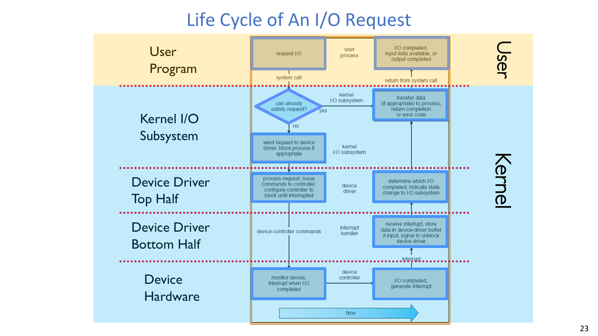

A typical request evolves like this:
1. A user program requests I/O, usually through a system call.
2. The kernel I/O subsystem checks whether the request can already be satisfied. If not, it sends the request to a device driver.
3. The driver top half processes the request, issues commands to the controller, configures the controller to block until interrupted, and may put the calling thread to sleep.
4. The device hardware monitors the device and eventually completes the operation or detects an error.
5. The device controller generates an interrupt.
6. The interrupt handler, which is part of the driver bottom half, receives the interrupt, stores data in device-driver buffers if needed, signals or unblocks the driver, and reports status back to the kernel I/O subsystem.
7. The kernel transfers data to the user process or reports completion/error code, and the system call returns.

:::remark Question: Why split a driver into a top half and a bottom half?
The top half runs in ordinary kernel context while serving a system call, so it can perform setup and may sleep. The bottom half runs in interrupt context, so it should be short, fast, and focused on acknowledging hardware, recording completion, and waking later work. This split keeps interrupt handling responsive while still allowing complex driver logic elsewhere.
:::

## 9. Standard Interfaces to Devices
The goal of the I/O subsystem is to **provide uniform interfaces, despite wide range of different devices**. A small piece of code can work across many devices because the driver implements the standard interface:

```c
FILE fd = fopen("/dev/something", "rw");
for (int i = 0; i < 10; i++) {
    fprintf(fd, "Count %d\n", i);
}
close(fd);
```

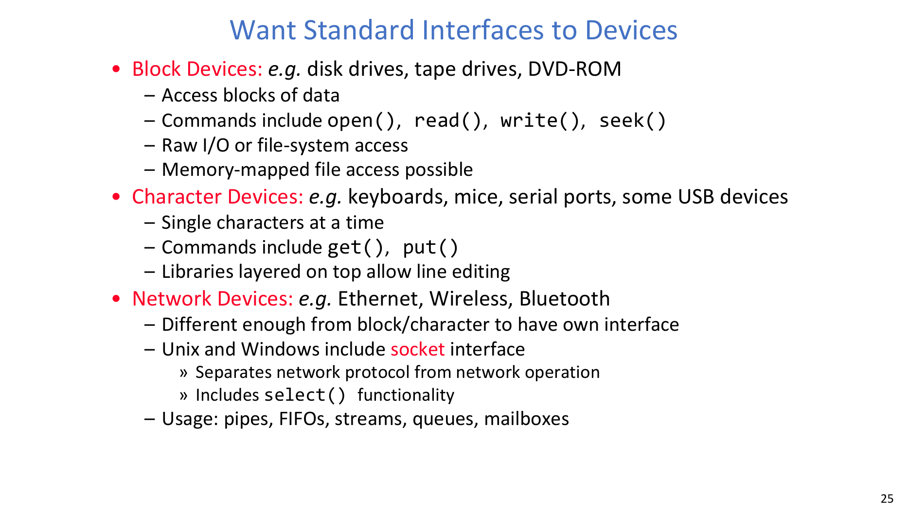

The standard device classes are:

| Device class | Examples | Interface style |
|---|---|---|
| **Block Devices** | disk drives, tape drives, DVD-ROM | Access blocks of data; commands include `open()`, `read()`, `write()`, and `seek()`; raw I/O, file-system access, and memory-mapped file access are possible. |
| **Character Devices** | keyboards, mice, serial ports, some USB devices | Access single characters at a time; commands include `get()` and `put()`; libraries can add line editing. |
| **Network Devices** | Ethernet, wireless, Bluetooth | Different enough from block and character devices to have their own interface; Unix and Windows provide a `socket` interface that separates network protocol from network operation and includes `select()` functionality. |

Unix-like systems also use pipes, FIFOs, streams, queues, and mailboxes as I/O-like communication mechanisms.

## 10. Timing Interfaces: Blocking, Non-Blocking, and Asynchronous
Users also need to decide how to deal with timing. The same conceptual read or write may have different timing semantics.

| Timing interface | Core idea | Read behavior | Write behavior |
|---|---|---|---|
| **Blocking Interface: "Wait"** | The caller waits until the operation can make progress. | `read()` puts the process to sleep until data is ready. | `write()` puts the process to sleep until the device is ready for data. |
| **Non-blocking Interface: "Don't Wait"** | The call returns quickly. | It returns the number of bytes successfully transferred; it may return no data. | It may write only some bytes or nothing. |
| **Asynchronous Interface: "Tell Me Later"** | The request is submitted now and completion is reported later. | The caller passes a user buffer pointer; the kernel later fills the buffer and notifies the user. | The caller passes a user buffer pointer; the kernel later takes the data and notifies the user. |

:::remark Question: How are non-blocking and asynchronous I/O different?
Non-blocking I/O asks, "Can you do something right now?" If not, the call returns immediately and the program may try again later. Asynchronous I/O asks, "Please start this operation and tell me when it is done." The program does not have to retry the same operation manually; it waits for a completion notification instead.
:::

## 11. Storage Devices: Magnetic Disks and Flash Memory
Storage devices expose block-level random access, but their internal behavior differs sharply.

**Magnetic disks** have several useful properties:
- storage rarely becomes corrupted;
- capacity is large at low cost;
- block-level random access is available;
- random access is slow;
- sequential access is much faster.

**Flash memory** has a different profile:
- storage rarely becomes corrupted;
- cost is intermediate, roughly 5-20x disk in the referenced comparison, with the gap decreasing;
- block-level random access is available;
- reads perform well, but random writes are worse;
- erasure is required in large blocks;
- the ability to store data degrades with the number of writes.

A historical hard-disk example shows how much storage hardware has changed. An IBM Personal Computer/AT in 1986 could use a 30 MB hard disk costing about $500, with a 30-40 ms seek time and about 0.7-1 MB/s estimated transfer bandwidth. Modern drives have massively higher capacity and bandwidth, while seek time improved far less because mechanical movement remains hard.

## 12. Magnetic Disk Geometry
The unit of transfer on a magnetic disk is a **sector**. A ring of sectors forms a **track**. A stack of tracks at the same radial position across platters forms a **cylinder**. Disk heads position themselves on cylinders.

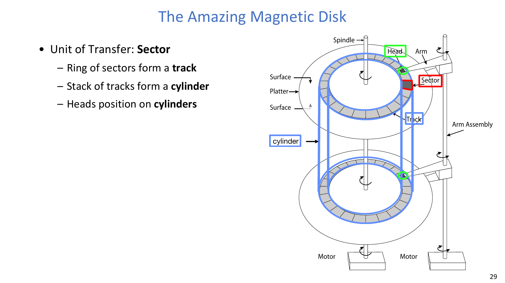

A disk track can be about 1 micron wide. For comparison, visible light has wavelength around 0.5 microns, and the human eye resolves around 50 microns. A typical 2.5-inch disk can contain about 100K tracks. Tracks are separated by unused guard regions, which reduce the likelihood that neighboring tracks are corrupted during writes, though the risk is not zero.

Track length varies across the disk. Outer tracks contain more sectors per track and therefore provide higher bandwidth. Disks are usually organized into regions where tracks have the same number of sectors. Only the outer half of the radius may be used for active data because most of the disk area is in the outer regions. Very large disks may use only part of the disk for active data, leaving the rest for archival data, because the performance differences across regions can matter.

### 12.1 Shingled Magnetic Recording
**Shingled Magnetic Recording (SMR)** overlaps tracks like shingles on a roof. Overlapping tracks increase density and capacity, but they restrict writes because rewriting one track may disturb neighboring tracks. Reading also requires more complex digital signal processing. The tradeoff is capacity for write flexibility.

:::remark Question: Why does SMR make writes harder?
A conventional track has a guard space around it, so rewriting it is relatively isolated. In SMR, tracks overlap; changing one track can partially overwrite the next track's safe area. The device therefore has to write in larger ordered regions or use internal buffering and translation to hide the restriction.
:::

## 13. Magnetic Disk Latency
A key definition is: **Cylinders: all the tracks under the head at a given point on all surfaces**.

Reading or writing disk data is a three-stage mechanical process:
1. **Seek time** positions the head assembly over the proper track.
2. **Rotational latency** waits for the desired sector to rotate under the read/write head.
3. **Transfer time** moves a block of bits, usually a sector or several sectors, under the read/write head.

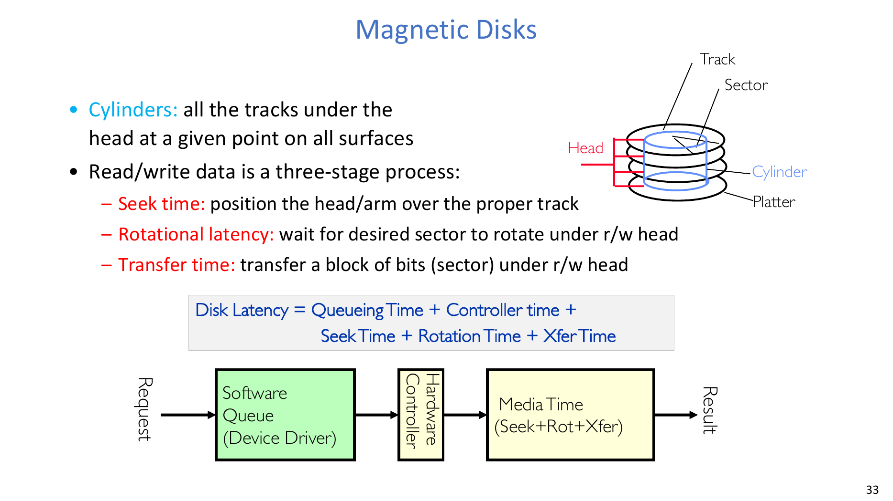

The basic latency formula is:

$$
\textbf{Disk Latency = Queueing Time + Controller time + Seek Time + Rotation Time + Xfer Time}
$$

Typical magnetic-disk numbers include:
- 14 TB in a 3.5-inch Seagate disk with 8 platters;
- areal density of at least 1 Terabit per square inch;
- average seek time around 4-6 ms;
- laptop/desktop rotation speeds around 3600-7200 RPM, giving 16-8 ms per rotation;
- server disk speeds up to 15000 RPM;
- average rotational delay of about half a rotation, around 4-8 ms for common disks;
- transfer rates around 50-250 MB/s depending on transfer size, rotation speed, recording density, and diameter.

### 13.1 Disk Performance Example
Assume queueing and controller time are ignored, average seek time is 5 ms, the disk rotates at 7200 RPM, transfer rate is 50 MB/s, and the block size is 4 KB.

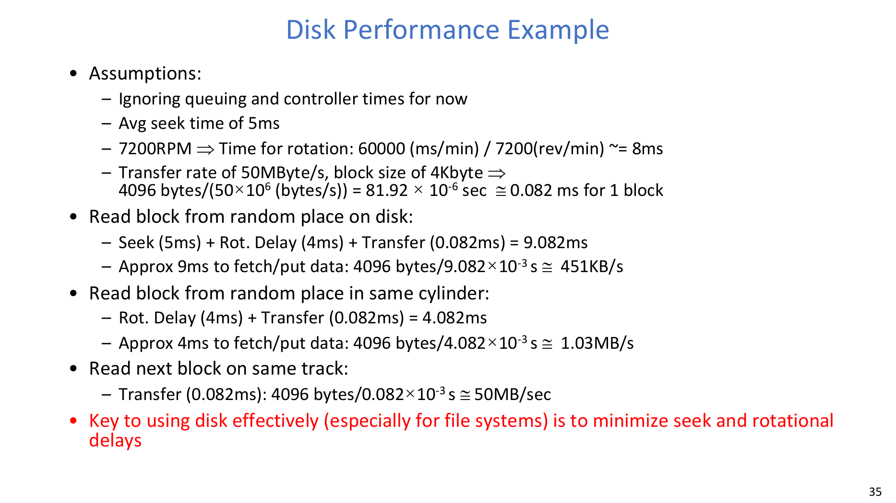

The rotation time is:

$$
\frac{60000\ \text{ms/min}}{7200\ \text{rev/min}} \approx 8\ \text{ms per rotation}
$$

The average rotational delay is half a rotation:

$$
8\ \text{ms} / 2 = 4\ \text{ms}
$$

The transfer time for one 4 KB block at 50 MB/s is:

$$
\frac{4096\ \text{bytes}}{50 \times 10^6\ \text{bytes/s}} = 81.92 \times 10^{-6}\ \text{s} \approx 0.082\ \text{ms}
$$

Now compare three access patterns:

| Access pattern | Time calculation | Effective bandwidth |
|---|---:|---:|
| Random block from random place | `5 ms + 4 ms + 0.082 ms = 9.082 ms` | `4096 / 9.082e-3 ~= 451 KB/s` |
| Random block in the same cylinder | `4 ms + 0.082 ms = 4.082 ms` | `4096 / 4.082e-3 ~= 1.03 MB/s` |
| Next block on the same track | `0.082 ms` | `4096 / 0.082e-3 ~= 50 MB/s` |

The key conclusion is: **the key to using disk effectively, especially for file systems, is to minimize seek and rotational delays**. The raw media bandwidth can be tens or hundreds of MB/s, but small random I/O can collapse to hundreds of KB/s because fixed mechanical delays dominate.

:::remark Question: Why is sequential disk I/O so much faster than random disk I/O?
Sequential I/O reuses the current head position and the current stream of sectors passing under the head. Random I/O repeatedly pays seek time and rotational latency before transferring a small block. When the transferred block is only 4 KB, the actual transfer time is tiny compared with the mechanical startup cost.
:::

## 14. Intelligence Inside the Disk Controller
Disk controllers contain substantial intelligence. They do not merely expose raw spinning media.

Important controller mechanisms include:
- **Error-correcting codes (ECC)** inside sectors, which hide some corruptions caused by neighboring track writes.
- **Sector sparing**, which remaps bad sectors transparently to spare sectors on the same surface.
- **Slip sparing**, which remaps all following sectors when a bad sector appears, preserving sequential behavior better than isolated remapping.
- **Track skewing**, which offsets sector numbers from one track to the next to allow for disk-head movement during sequential operations.

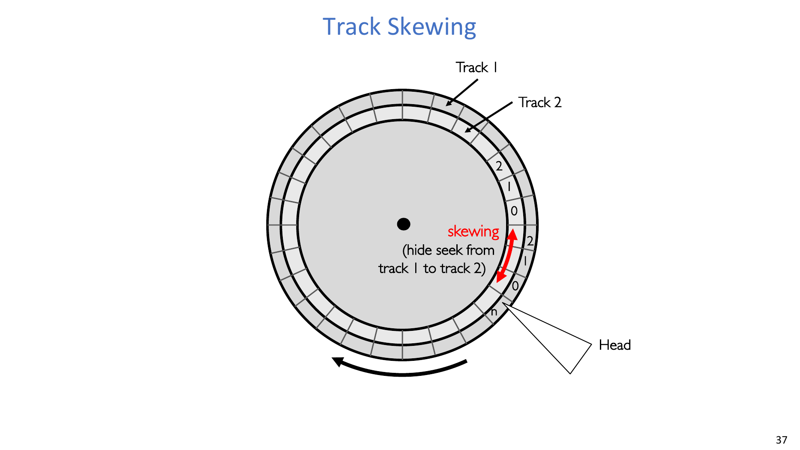

Track skewing is a small but important process detail. Suppose the head finishes the last useful sector on track 1 and then needs to move to track 2. The head movement takes time. If sector numbers on track 2 started at the same angular position as track 1, sector 0 might pass under the head before the head arrives, forcing a full extra rotation. Skewing offsets the numbering on track 2 so the next logical sector arrives just after the head finishes moving.

### 14.1 Current HDD Example
A Seagate Exos X18 from 2020 illustrates modern HDD scale:
- 18 TB hard disk;
- 9 platters and 18 heads;
- helium filled to reduce friction and power;
- 4.16 ms average seek time;
- 4096-byte physical sectors;
- 7200 RPM;
- dual 6 Gbps SATA or 12 Gbps SAS interface;
- 270 MB/s maximum transfer rate;
- 256 MB cache;
- price about $562, or about $0.03/GB.

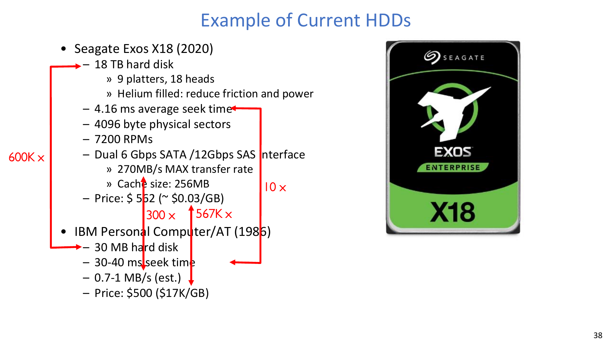

Compared with the 1986 IBM Personal Computer/AT example, capacity improved by around 600K times, bandwidth by around 300 times, and price per capacity by around 567K times, while seek latency improved by only about 10 times. Mechanical positioning remains the stubborn bottleneck.

## 15. Solid State Disks
Solid State Disks replace rotating magnetic media with non-volatile memory. Early SSDs around 1995 used non-volatile memory such as battery-backed DRAM. By around 2009, SSDs commonly used NAND multi-level cell flash memory, storing 2 or 3 bits per cell.

In NAND flash, a sector-sized unit such as a 4 KB page is addressable, but pages are grouped into larger memory blocks. A block may contain 4-64 pages. Trapped electrons distinguish logical 1s and 0s.

SSDs have no moving parts, so they eliminate seek and rotational delay. Typical access can be below 0.1-0.2 ms, and SSDs are low power and lightweight. The major complication is limited write cycles.

## 16. SSD Reads
An SSD contains a host interface such as SATA, a buffer manager and software queue, DRAM, a flash memory controller, and many NAND chips. Read requests can be served through parallel access to multiple flash packages.

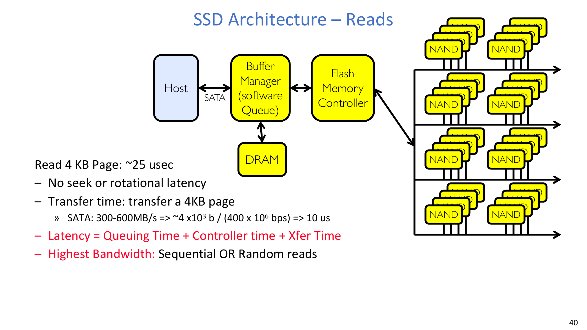

A representative read number is about 25 microseconds for a 4 KB page. There is no seek or rotational latency. Transfer time for a 4 KB page over SATA is also small; at roughly 300-600 MB/s, the transfer is around 10 microseconds.

For reads, the latency formula becomes:

$$
\textbf{Latency = Queueing Time + Controller time + Xfer Time}
$$

The highest read bandwidth can come from sequential reads or sufficiently parallel random reads. The absence of mechanical movement changes the performance model completely.

## 17. SSD Writes, Erase Blocks, and the FTL
SSD writes are more complex than reads. Writing data can take about 200 microseconds to 1.7 ms, and erasing a block can take about 1.5 ms.

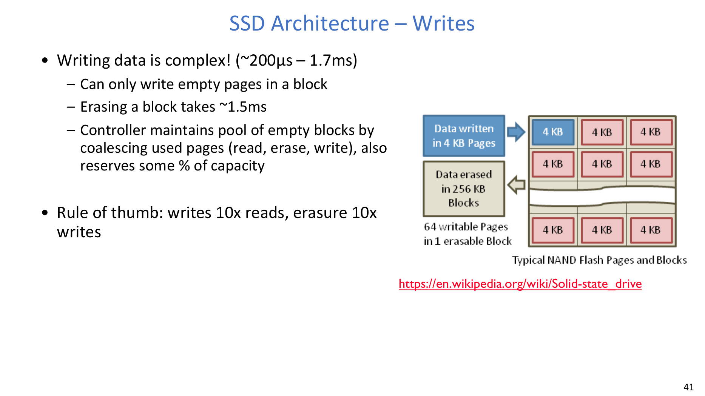

The central constraint is that flash can write only empty pages inside a block. SSDs expose a disk-like interface to the OS, so the OS reads and writes 4 KB chunks. Internally, however, the device may only be able to erase and rewrite a much larger block, such as 256 KB. A typical NAND flash block may contain many 4 KB pages, for example 64 writable pages inside one erasable block.

A useful rule of thumb is:
- writes are about 10x slower than reads;
- erasure is about 10x slower than writes.

:::remark Question: Why not simply erase and rewrite the entire 256 KB block whenever a 4 KB page changes?
That would be slow and destructive. Erasure takes milliseconds, while the logical update may be only 4 KB. Each block also has a finite lifetime and may be erased and rewritten only around 10K times. If the controller repeatedly erased the same physical block for every hot logical page, heavily used blocks would wear out quickly.
:::

The solution uses two systems principles.

### 17.1 Layer of Indirection
The SSD maintains a **Flash Translation Layer (FTL)**. The FTL maps virtual block numbers, which the OS uses, to physical page numbers, which the flash controller uses. The controller can relocate data without the OS knowing.

### 17.2 Copy on Write
On update, the SSD does not overwrite the old page in place, because that would require erasing first. Instead, it writes the new version into a free page and updates the FTL mapping to point to the new physical location.

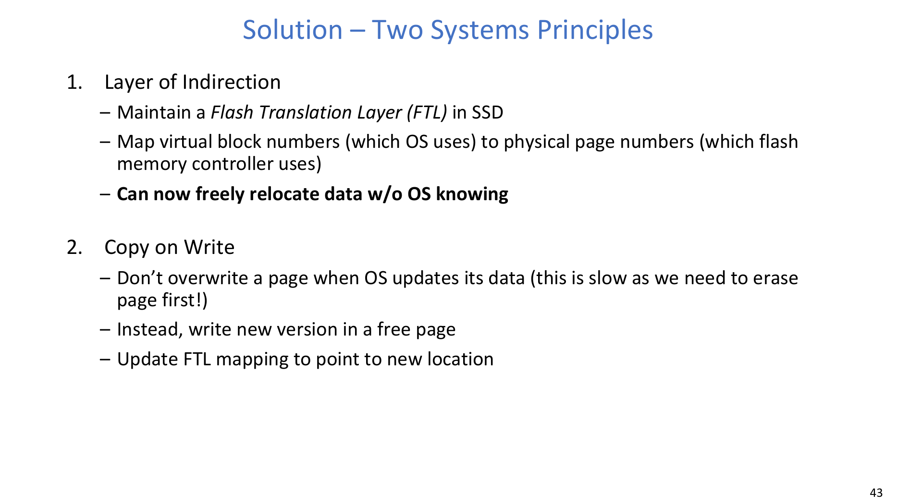

This avoids erasing and rewriting an entire 256 KB block for every small modification. It also lets the controller spread writes across physical pages, which is called **wear leveling**.

Old versions of pages must eventually be reclaimed. A background **garbage collection** process identifies blocks containing obsolete pages, copies any still-live pages elsewhere if necessary, erases the old blocks, and adds them back to the free list.

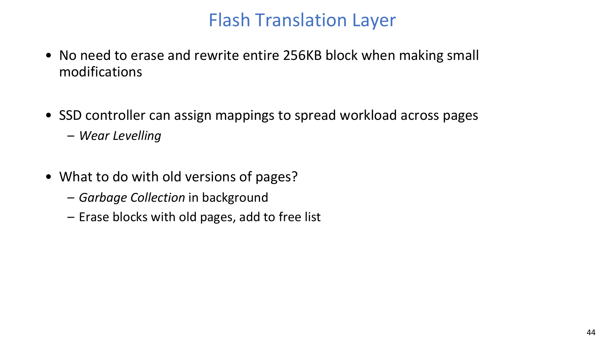

:::remark Question: If the OS still sees the same 4 KB read/write interface as an HDD, why does SSD behavior matter?
The interface is the same, but the performance model is different. Random reads are cheap because there is no seek. Random writes may be expensive because they trigger copy-on-write, garbage collection, erase blocks, and wear leveling. A file system or database that assumes HDD-style costs may miss opportunities, while one that assumes writes are always cheap may suffer from garbage-collection stalls and write amplification.
:::

## 18. Current SSD Examples and HDD/SSD Trends
Large SSDs already provide high capacity and strong random-read performance, but write behavior and price remain important.

| Device | Capacity and interface | Sequential performance | Random performance | Price notes |
|---|---|---|---|---|
| Seagate Exos SSD, 2017 | 15.36 TB, dual 12 Gb/s interface | reads 860 MB/s, writes 920 MB/s | reads 102K IOPS, writes 15K IOPS | about $5495, or $0.36/GB |
| Nimbus SSD, 2019 | 100 TB, dual-port 12 Gb/s interface | reads/writes 500 MB/s | reads 100K IOPS | about $40K, or $0.4/GB; a 50 TB drive costs about $12500, or $0.25/GB |

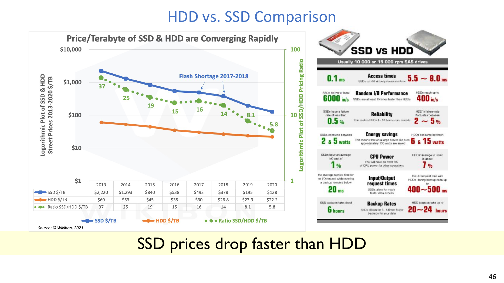

SSD prices have dropped faster than HDD prices. In the comparison shown, SSD cost per TB falls from roughly $2220/TB in 2013 to about $128/TB in 2020, while HDD cost per TB falls from roughly $60/TB to about $22/TB. The SSD/HDD price ratio therefore shrinks from about 37 to about 5.8.

### 18.1 SSD Summary
Compared with hard disks, SSDs have major advantages:
- low latency and high throughput because they eliminate seek and rotational delay;
- no moving parts, so they are light, low power, silent, and shock-insensitive;
- strong read performance, limited by controller and I/O bus rather than mechanical motion.

SSDs also have important disadvantages and caveats:
- block write performance is asymmetric because update may involve read page, erase block, and write page;
- controller garbage-collection algorithms have a major effect on performance;
- drive lifetime is limited, with about 1-10K writes per page for multi-level cell NAND in the referenced summary;
- average failure rate and life expectancy are finite, with example values around 6 years average failure rate and 9-11 years life expectancy;
- capacity and cost comparisons change rapidly over time.

The older claim that SSDs simply "read at memory speeds" is no longer generally true. SSDs are much faster than HDDs for many random-access workloads, but their performance is still shaped by controllers, buses, queues, flash organization, erase behavior, and garbage collection.

## 19. General Device Performance Model
A general way to think about device performance is:

$$
\textbf{Response time (Latency) = Queue + Overhead + Transfer}
$$

If a device has raw bandwidth `BW`, transfer time `T`, and fixed startup or overhead time `S`, the effective bandwidth is:

$$
\textbf{Effective BW = BW * T/(S+T)}
$$

This formula captures why small I/O operations can be inefficient. When `S` is large relative to `T`, most time is spent not transferring useful data. HDDs often suffer from this because seek and rotation dominate small random requests. SSDs remove seek and rotation, but they still have queueing, controller time, transfer time, erase cost, garbage collection, and wear-related behavior.

For HDDs:

$$
\textbf{Latency = Queueing time + controller + seek + rotation + transfer}
$$

For SSDs:

$$
\textbf{Latency = Queueing time + controller + transfer}
$$

with the important reminder that SSD transfer behavior includes erasure and wear effects for writes.

:::remark Question: Why are file systems designed relative to the underlying device?
A file system is an I/O policy layer. On HDDs, it should preserve locality, batch writes, allocate related blocks near each other, and avoid random seeks. On SSDs, it should care more about write amplification, erase-block alignment, garbage collection, and endurance. The same high-level file API can be preserved, but the best implementation depends on device performance and reliability characteristics.
:::

## Exam Review
I/O is hard because devices are heterogeneous, unreliable, unpredictable, and extremely different in speed. The OS handles this by using controllers, drivers, queues, interrupts, polling, DMA, and common device interfaces.

The processor usually talks to a controller rather than directly to the device. Controller state appears as registers, queues, or memory-mapped regions. In **Port-Mapped I/O**, special I/O instructions access ports. In **Memory-mapped I/O**, controller registers or device memory appear in the physical address space and are accessed by ordinary load/store instructions.

**Programmed I/O** is simple but burns CPU cycles proportional to data size. **DMA** lets a controller move blocks directly between device and memory, so the CPU sets up the transfer and handles completion rather than copying every byte.

Completion can be detected with **interrupts** or **polling**. Interrupts are good for unpredictable events but have high overhead. Polling is good when completions are expected soon but wastes CPU time when the device is idle. High-performance devices often combine both.

A **Device Driver** is **device-specific code in the kernel that interacts directly with the device hardware**. The top half handles system-call paths such as `open`, `read`, `write`, and `ioctl`; the bottom half handles interrupts, records completion, and wakes sleeping work.

Device interfaces commonly fall into **block**, **character**, and **network** classes. Timing interfaces can be **blocking** (wait), **non-blocking** (return quickly), or **asynchronous** (submit now, notify later).

For HDDs, remember the geometry: sector, track, cylinder, head, platter. Disk latency is:

$$
\textbf{Disk Latency = Queueing Time + Controller time + Seek Time + Rotation Time + Xfer Time}
$$

For a 7200 RPM disk, one rotation is about 8 ms and average rotational delay is about 4 ms. With 5 ms seek and 0.082 ms transfer for a 4 KB block, a random block takes about 9.082 ms, only about 451 KB/s effective bandwidth. The next block on the same track can approach 50 MB/s because seek and rotation are removed.

Disk controllers use ECC, sector sparing, slip sparing, and track skewing. Track skewing offsets sector numbering between tracks so sequential reads do not lose a full rotation while the head moves.

For SSDs, there is no seek or rotational delay. Reads are fast, but writes are complicated because flash can write empty pages but erase only larger blocks. The SSD uses **Flash Translation Layer (FTL)** indirection and **Copy on Write**: write the new version to a free page, update the mapping, and garbage-collect old pages later. Wear leveling spreads writes across physical pages.

The broad performance model is:

$$
\textbf{Response time (Latency) = Queue + Overhead + Transfer}
$$

and:

$$
\textbf{Effective BW = BW * T/(S+T)}
$$

The practical lesson is that the same API can hide hardware differences from applications, but the OS and storage stack still need to understand the device's real latency, bandwidth, reliability, and write behavior.
