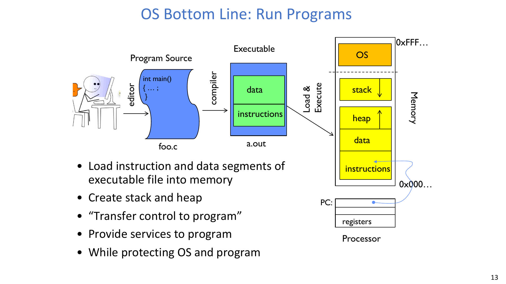
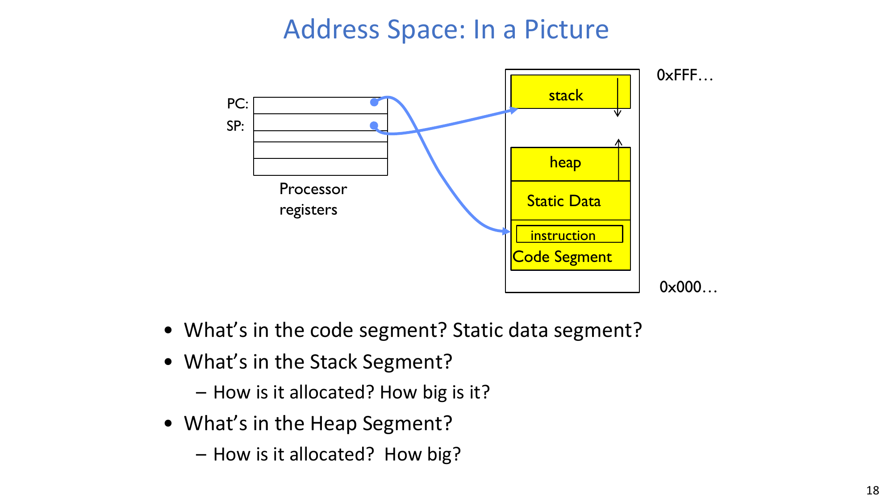
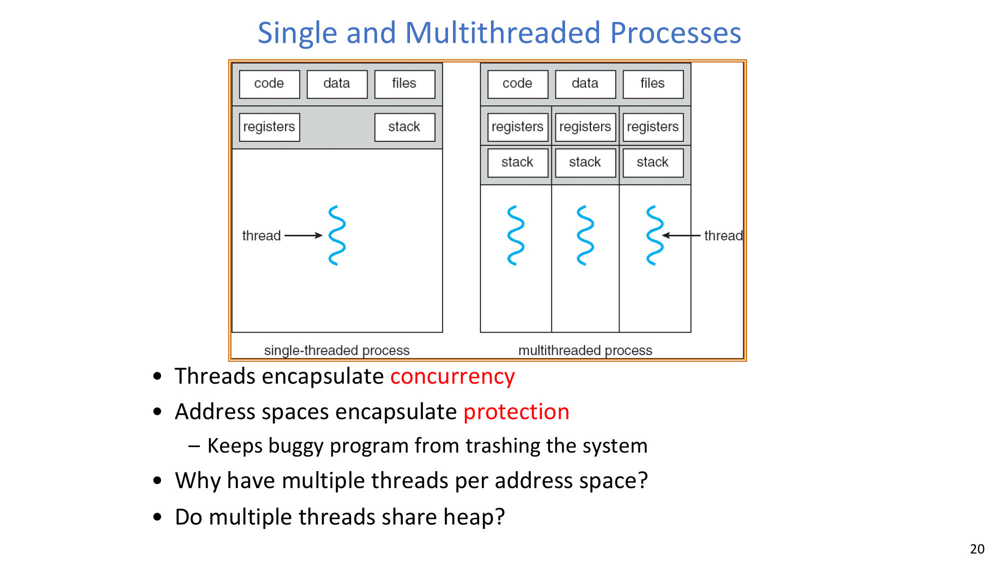
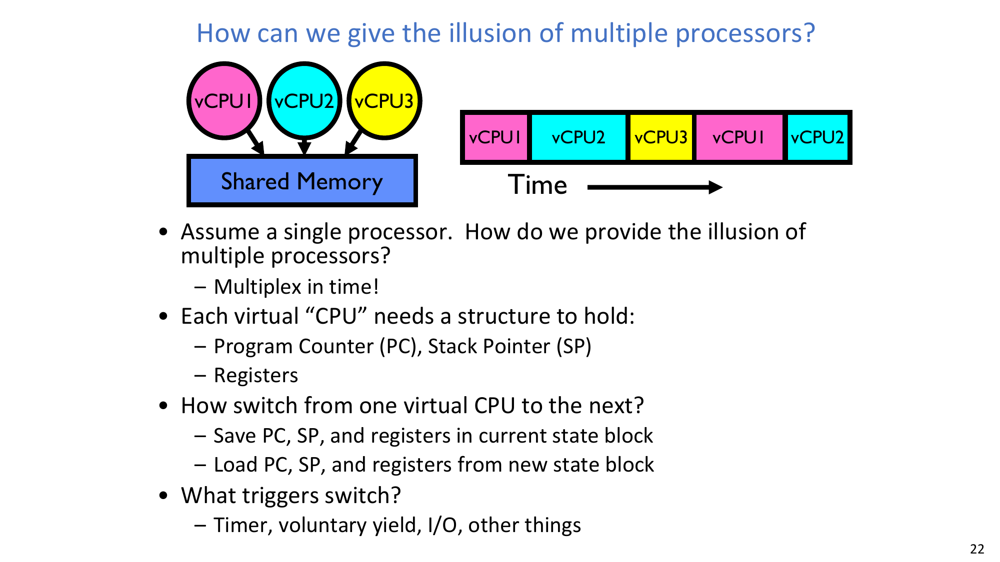
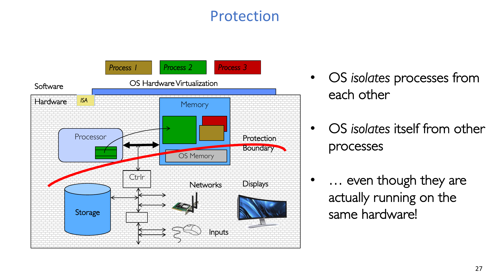
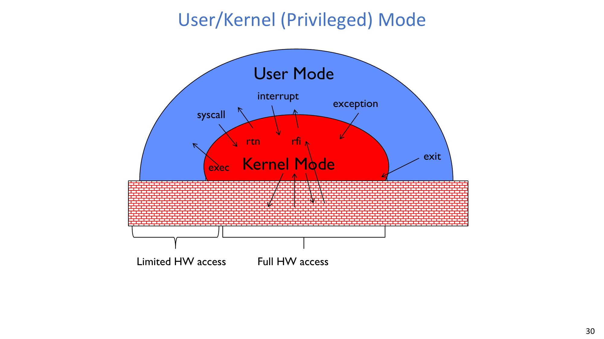
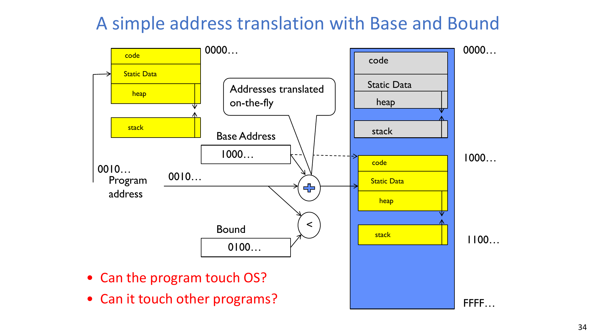
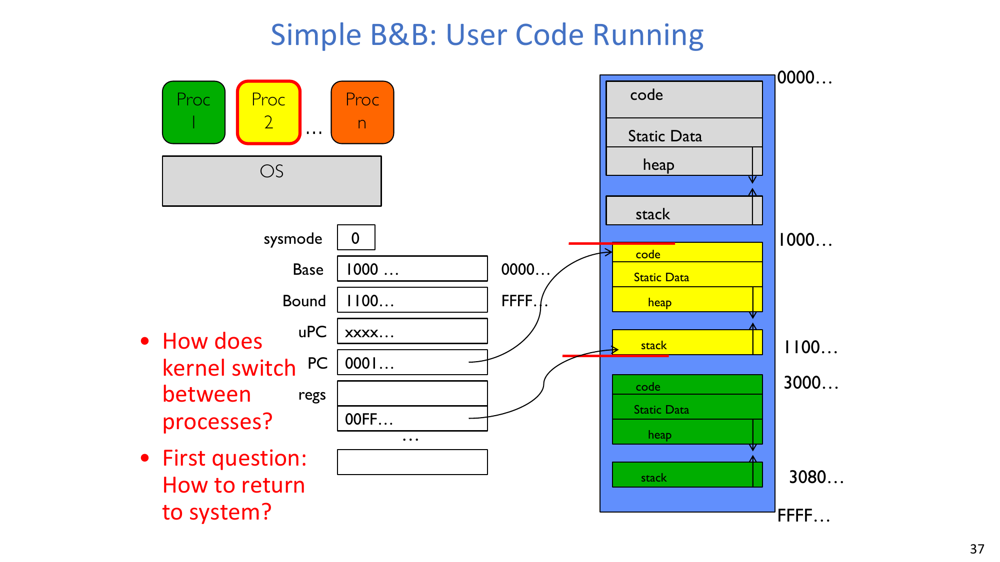
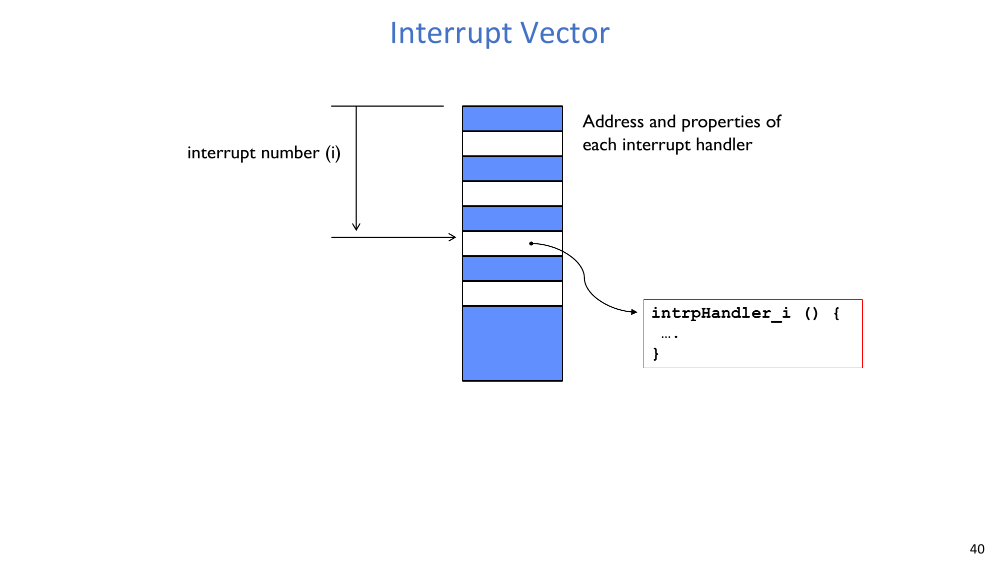

# Lec2 - 四个基础操作系统概念

## 学习目标
学完本讲后，你应当能够解释四个基础 OS 概念，说明为什么保护机制必须同时依赖硬件与软件，并分析单机系统如何在保证安全隔离的前提下制造“多个程序并行运行”的幻象。

## 1. 快速回顾：操作系统是什么

### 1.1 核心定义
一个关键定义是：

- **"Special layer of software that provides application software access to hardware resources."**

这层软件需要同时提供易用抽象、受保护共享、安全/认证能力，以及逻辑实体之间的通信机制。

### 1.2 三角色心智模型
可以把操作系统理解为三种角色叠加：
- **Referee（裁判）**：管理保护、隔离与资源共享。
- **Illusionist（魔术师）**：在物理资源之上提供干净、易用的抽象。
- **Glue（胶水）**：提供存储、窗口系统、网络、共享、授权等公共服务。

## 2. 为什么 OS 设计持续变化

### 2.1 三个历史阶段
课程用成本结构来刻画 OS 历史：
- 硬件贵、人便宜。
- 硬件更便宜、人更贵。
- 硬件非常便宜、人非常贵。

### 2.2 硬件演进带来的变化
硬件快速变化直接推动了 OS 形态演进：
- Batch -> Multiprogramming -> Timesharing -> Graphical UI -> Ubiquitous devices。
- 系统特性逐步下沉到更小的机器上。

课件中的规模量级提示：
- 小型 OS：约 **100K lines**。
- 大型 OS：约 **10M lines**。
- 开发工作量：约 **100-1000 people-years**。

### 2.3 OS 考古：血缘很重要
由于从零开发 OS 的成本很高，现代操作系统通常具有长期谱系。课件列举了 Unix/BSD 演化线、Mach+BSD 到 XNU/iOS、MINIX->Linux 生态、以及 DOS->Windows 演化线。

## 3. 四个基础概念总览

本讲给出的四个核心概念是：
- **Thread**。
- **Address space (with translation)**。
- **Process**。
- **Dual mode operation / Protection**。

其中一句关键总结是：

- **"Only the 'system' has the ability to access certain resources."**

## 4. OS 的底线任务：把程序跑起来

操作系统最基本要完成且必须安全完成的事情是：
- 把可执行文件的指令段与数据段装入内存。
- 创建 stack 与 heap。
- 把控制权转移给程序。
- 在程序运行期间提供系统服务。
- 同时保护 OS 与程序本身。

## 5. 第一概念：Thread of Control

### 5.1 定义
一个关键定义是：

- **"Thread: Single unique execution context: fully describes program state."**
- **"Program Counter, Registers, Execution Flags, Stack."**

### 5.2 为什么线程上下文是“可执行状态”
PC 指向当前执行指令，寄存器保存执行上下文（如栈指针及其他约定指针）。当线程上下文驻留在处理器寄存器中时，该线程就在处理器上执行。

### 5.3 根状态（root state）
寄存器保存运行线程的根状态，其余程序状态位于内存中。

## 6. 第二概念：Program Address Space（含翻译）

### 6.1 定义
一个关键定义是：

- **"Address space -> the set of accessible addresses + state associated with them."**

直观上：
- 32 位处理器：可表示 `2^32` 个地址。
- 64 位处理器：可表示 `2^64` 个地址。

### 6.2 地址访问可能意味着什么
对某个地址执行读写，可能表现为普通内存访问，也可能被忽略，可能触发 I/O（memory-mapped I/O），也可能触发异常/故障。

### 6.3 分段视角
进程地址空间通常按 code/text、static data、heap、stack 这几类段来理解。

:::remark 地址空间分段问题
**问题：** "What's in the code segment? Static data segment?" "What's in the Stack Segment? How is it allocated? How big is it?" "What's in the Heap Segment? How is it allocated? How big?"

精炼回答：
- Code 段保存机器指令，通常也包含只读常量。
- Static Data 段保存全局/静态变量（已初始化与未初始化部分）。
- Stack 保存调用帧、返回地址、参数与局部变量；按线程自动管理，大小通常受 OS 配置限制。
- Heap 保存动态分配对象；在进程地址空间内由分配器（`malloc/new`）和虚拟内存机制共同管理。
:::

:::tip 地址访问语义问题
**问题：** "What happens when you read or write to an address?"

行为取决于映射与权限。合法映射页表现为内存；设备映射区域表现为 I/O 语义；无效或越权访问会 trap 到 OS 并形成 fault。
:::

## 7. 第三概念：Process

### 7.1 定义与作用
一个关键定义是：

- **"Process: execution environment with Restricted Rights."**

进程由地址空间和一个或多个线程组成，并拥有文件描述符、文件系统上下文等资源。

另一条关键表述是：

- **"An instance of an executing program is a process consisting of an address space and one or more threads of control."**

### 7.2 保护与效率的权衡
进程边界提升了保护与隔离能力，但跨进程通信通常比同一进程内线程通信成本更高。

### 7.3 单线程与多线程进程
线程封装并发，地址空间封装保护。

:::remark 同一进程内多线程问题
**问题：** "Why have multiple threads per address space?" and "Do multiple threads share heap?"

是的，同一进程中的线程共享同一地址空间（包括 code/data/heap），但每个线程有独立寄存器上下文和独立栈。多线程的主要价值是提升并发度，并让计算与阻塞操作重叠执行。
:::

### 7.4 多道程序与虚拟 CPU 幻象
即使只有一个物理 CPU，OS 也能通过时间复用制造多个虚拟 CPU 的幻象。

切换虚拟 CPU 需要保存/恢复 PC、SP 与寄存器；触发源包括定时器中断、主动 yield 与 I/O 事件。

:::tip 虚拟 CPU 幻象问题
**问题：** "How can we give the illusion of multiple processors?" and "How can it keep all these things straight?"

OS 通过时间片与上下文切换虚拟化 CPU 执行。系统之所以还能保持一致，是因为 OS 为每个线程/进程维护状态块，在内核态串行执行特权更新，并通过受控模式切换路径处理异步事件（如 timer/I/O 中断）。
:::

### 7.5 并发的基本问题
并发本质是共享资源协调问题。进程在 API 视角中“像是独占资源”，但底层硬件资源实际共享，OS 必须通过抽象与受控复用协调它们。

课程也强调了较简单的无保护模型（在某些嵌入式/早期系统中常见）：共享更方便，但隔离与安全性更弱。

## 8. 第四概念：Dual Mode 与保护机制

### 8.1 为什么保护是硬要求
OS 必须同时保护自身和用户程序，以满足可靠性、安全性、隐私与公平性。核心机制之一是控制“程序地址 -> 物理地址”的翻译过程。

### 8.2 Dual Mode 的硬件支持
关键事实是：
- 硬件至少提供 **Kernel mode** 与 **User mode**。

为此需要：
- 模式位（user/system）。
- 仅允许内核态执行的特权操作（用户态执行则失败或 trap）。
- 受控的 user->kernel 转移（保存用户 PC/状态）。
- 受控的 kernel->user 返回（恢复用户 PC/状态，例如 return-from-interrupt）。

:::remark Dual Mode 支持条件问题
**问题：** "What is needed in the hardware to support dual mode operation?"

至少需要保护状态位、trap/interrupt 机制、以及对特权操作的权限检查。没有硬件强制，软件策略无法可靠阻止恶意或失控用户代码越权执行。
:::

## 9. Base and Bound：一个简单保护机制

### 9.1 带边界检查的地址翻译
Base-and-Bound（B&B）依赖两个寄存器：
- **Base**：进程可访问物理区间的起始位置。
- **Bound**：合法虚拟偏移范围（上界/长度约束）。

每次访问时，硬件先做边界检查，再对合法地址执行翻译（概念上可写作 `physical = base + virtual_offset`）。非法访问会 trap。

### 9.2 装载期重定位变体
课件还给出一种更简单的装载期重定位思路：
- 程序装入时完成地址翻译。
- 需要 relocating loader。
- 仍可保护 OS 并隔离程序。
- 运行时地址路径上无需额外加法。

:::remark B&B 安全性问题
**问题：** "Can the program touch OS?" and "Can it touch other programs?"

只要边界检查与地址翻译正确执行，程序只能访问映射到自身地址空间的合法区域，越界访问会被硬件拦截并交给 OS 处理。
:::

### 9.3 用户代码运行与返回内核
用户代码运行时处于 user mode，不能直接执行特权操作。接下来关键设计问题是：系统如何把控制权安全带回 OS，完成调度与系统服务。

:::tip 进程切换问题
**问题：** "How does kernel switch between processes? First question: How to return to system?"

返回路径来自模式切换事件（syscall、interrupt、exception）。进入内核后，OS 保存当前上下文、装载目标进程上下文，再返回用户态继续执行。
:::

## 10. Mode Transfer 与 Interrupt Vector

### 10.1 三类模式切换
课件区分三种机制：
- **Syscall**：进程主动请求系统服务。
- **Interrupt**：外部异步事件（定时器、设备）触发。
- **Trap/Exception**：当前进程内部同步故障触发。

关键句：
- **"All 3 are an UNPROGRAMMED CONTROL TRANSFER."**

### 10.2 切换目标地址来自哪里
目标地址通过 interrupt/exception vector 确定：它是按事件编号索引的表，记录处理函数入口地址与属性。

:::remark 目标地址解析问题
**问题：** "How do we get the system target address of the unprogrammed control transfer?"

硬件使用事件编号（interrupt/exception/trap ID）索引特权向量表，读取对应内核处理入口并跳转执行。
:::

## 11. Lab 0 与主结论

### 11.1 Lab 0 重点
Lab 0 任务包括：
- Booting Pintos。
- Debugging。
- Kernel Monitor。

课件给出的截止时间：**2025 年 2 月 27 日**。

### 11.2 主结论
本讲建立了一条完整链路：
- Thread 定义执行上下文。
- Address space 定义程序可见内存视图。
- Process 把线程与资源封装在隔离边界内。
- Dual mode 与地址翻译共同提供保护与受控控制转移。

## 附录 A：Exam Review

### A.1 必会定义
- **Thread**：单一且唯一的执行上下文（PC、寄存器、标志位、栈）。
- **Address space**：可访问地址及其关联状态，通过翻译与物理内存区分。
- **Process**：执行中程序实例，包含地址空间与一个或多个线程。
- **Dual mode**：由硬件强制的用户态/内核态特权分离机制。
- **B&B**：基址+界限的保护/翻译机制。

### A.2 必记机制
- 单 CPU 上通过时间复用制造多 CPU 幻象。
- 上下文切换需要保存/恢复 PC、SP、寄存器。
- 保护依赖地址翻译控制与特权操作限制。
- Syscall/interrupt/exception 都会把控制转移到内核处理路径。
- Interrupt vector 把事件编号映射到处理入口与属性。

### A.3 高价值简答模板
- **为什么 Thread 是第一概念？**
  因为程序执行必须落到具体机器状态上，而线程上下文正是该状态。
- **为什么需要地址翻译？**
  地址翻译把程序视图与物理内存解耦，从而支持重定位、隔离与受控共享。
- **为什么仅靠软件无法实现可靠保护？**
  保护必须有硬件特权检查与模式切换作为强制边界，否则用户代码可绕过策略。
- **一个 CPU 如何运行多个进程？**
  OS 通过时间复用与上下文切换，并借助 timer/syscall/exception 触发调度点。

### A.4 常见误区
- 把线程和进程混为一谈。
- 误以为同一进程内线程不共享 heap。
- 忽略硬件在保护中的决定性作用。
- 把 interrupt 与 exception 当成同类触发。
- 只把地址翻译理解为重定位，忽略其隔离作用。

### A.5 考前最终自检
1. 你能否一句话定义 thread、address space、process、dual mode？
2. 你能否解释 B&B 如何阻止非法内存访问？
3. 你能否说明上下文切换的保存/恢复步骤？
4. 你能否分别举出 syscall、interrupt、exception 的典型例子？
5. 你能否解释 interrupt vector 如何定位内核处理函数？

:::tip 使用建议
先记忆 A.1，再口头演练 A.3，最后用 A.5 做考前快速自测。
:::