# Lec20 - 文件系统 1：I/O 性能与文件系统设计

## 学习目标
学完本讲之后，你应该能够用延迟、吞吐、利用率、突发性和排队延迟来分析 I/O 性能。你还应该能够解释主要磁盘调度策略，描述文件系统如何把块设备转换成文件和目录，并追踪从用户可见路径名到 inode 和数据块的完整路径。

## 1. 从原始 I/O 到性能
I/O 设备通过总线、控制器、中断或轮询、阻塞或异步时序接口，以及磁盘寻道或 SSD flash translation 等存储专属机制来控制。文件系统位于这些原始机制之上，但它不能忽略它们。同一个 file API 可以向应用隐藏硬件细节，而文件系统设计仍然必须围绕底层设备的延迟、带宽、可靠性和访问模式进行优化。

起始性能模型如下：

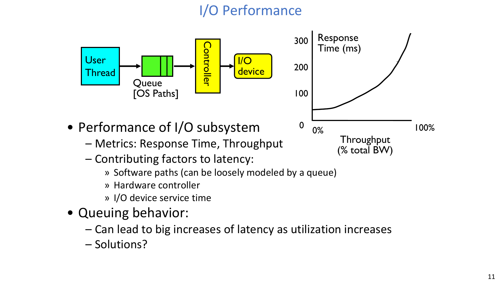

一次 I/O 请求通常会经过 user thread、OS software paths、queue、hardware controller 和 I/O device。总响应时间因此受以下因素影响：
- OS 路径中的软件开销，它可以被粗略建模为排队；
- controller overhead；
- device service time，例如磁盘 seek、rotation、transfer，或 SSD controller work。

当吞吐接近设备总带宽时，响应时间曲线会急剧上升。这是核心警告：如果高利用率带来巨大的排队延迟，那么高利用率并不自动意味着系统状态好。

:::remark 问题：为什么 I/O 的高利用率可能很危险？
设备可以几乎一直忙碌，但请求在它前面等待很久。当利用率接近 100% 时，即使很小的突发也没有足够空闲服务能力来快速清空队列，所以延迟会急剧增长；在理想化模型中甚至会变成无界。
:::

## 2. 基本性能概念
接下来所有内容都建立在两个定义上：

- **Response Time or Latency: Time to perform an operation（响应时间或延迟：执行一个操作所需的时间）**。
- **Bandwidth or Throughput: Rate at which operations are performed（带宽或吞吐：操作被执行的速率）**。

吞吐可以根据系统类型用不同单位衡量：
- 操作：`op/s`；
- 文件或存储：`MB/s`；
- 网络：`Mb/s`；
- 算术运算：`GFLOP/s`。

延迟和吞吐相关，但不是同一个概念。一个系统可能有很高的整体吞吐，但如果单个请求长时间停在队列里，它们仍然会遭遇高延迟。

## 3. 确定性队列、饱和与突发
先从一个简单的确定性世界开始。请求以固定间隔到达，每个请求需要固定服务时间，并且请求之间有充足空隙。

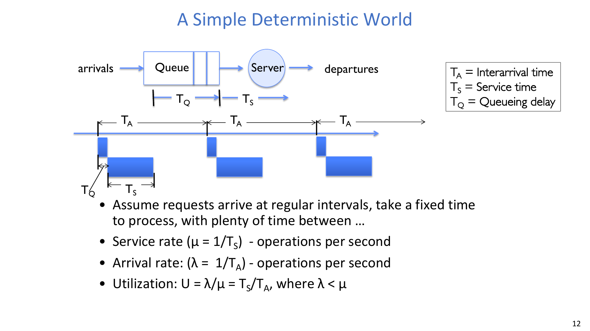

变量含义如下：
- `T_A`：interarrival time，到达间隔；
- `T_S`：service time，服务时间；
- `T_Q`：queueing delay，排队延迟；
- `lambda = 1/T_A`：arrival rate，到达率，单位是 operations per second；
- `mu = 1/T_S`：service rate，服务率，单位是 operations per second；
- `U = lambda / mu = T_S / T_A`，其中 `lambda < mu`：utilization，利用率。

在这个确定性设定中，如果到达之间间隔足够长，队列就能在下一次请求到达前清空。

理想吞吐图只在饱和之前看起来是线性的：

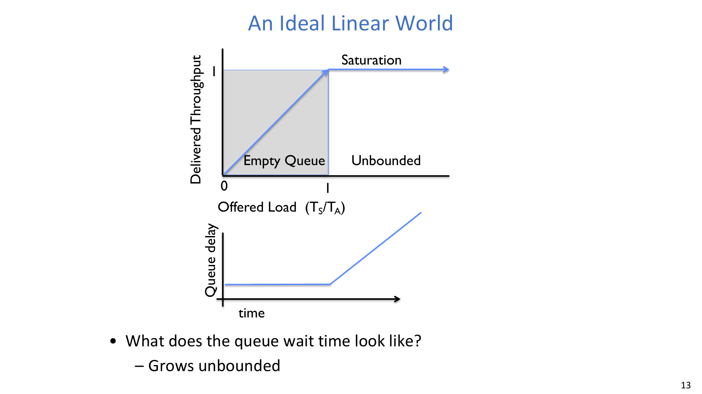

offered load 从 0 增加到 1。delivered throughput 会在线性阶段增加，直到 server 饱和。饱和之后，delivered throughput 不能超过服务能力，队列也不再能保持为空。

:::remark 问题：队列等待时间会是什么样子？
在理想线性图中，server 还有富余能力时，queue wait time 很小；当 offered load 接近饱和时，等待时间会无界增长。这里的重要结论不是说真实系统一定真的变成无限大，而是说接近满利用率时，排队延迟会变成主导成本。
:::

真实到达通常是突发的，而不是均匀间隔的。

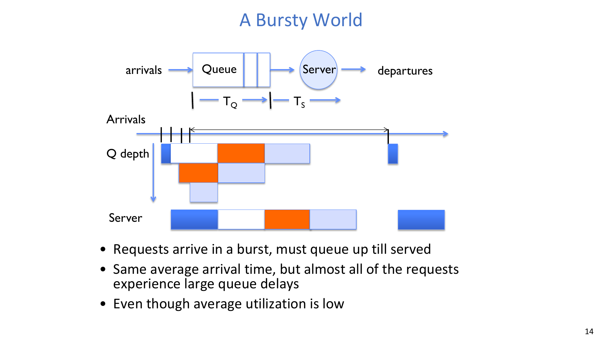

突发工作负载可以和一个平滑工作负载拥有相同平均到达率，但许多请求会在很短时间内一起到达。这些请求必须排队等待 server 逐个处理。因此，即使平均利用率很低，突发中的大多数请求也可能经历很大的排队延迟。

:::remark 问题：为什么平均利用率低的设备仍然可能有高延迟？
平均利用率隐藏了时间结构。如果十个请求同时到达，然后很久没有新请求，那么平均到达率可能很低，但突发中靠后的请求仍然必须等待前面的请求完成。排队延迟取决于到达模式，而不只是平均速率。
:::

## 4. 用随机分布刻画突发性
一个优雅的数学起点是 **exponential distribution（指数分布）**：

$$
f(x) = \lambda e^{-\lambda x}
$$

对于均值为 `1/lambda` 的连续随机变量，指数分布具有 **memoryless（无记忆性）**。一个事件发生的可能性与我们已经等待了多久无关。

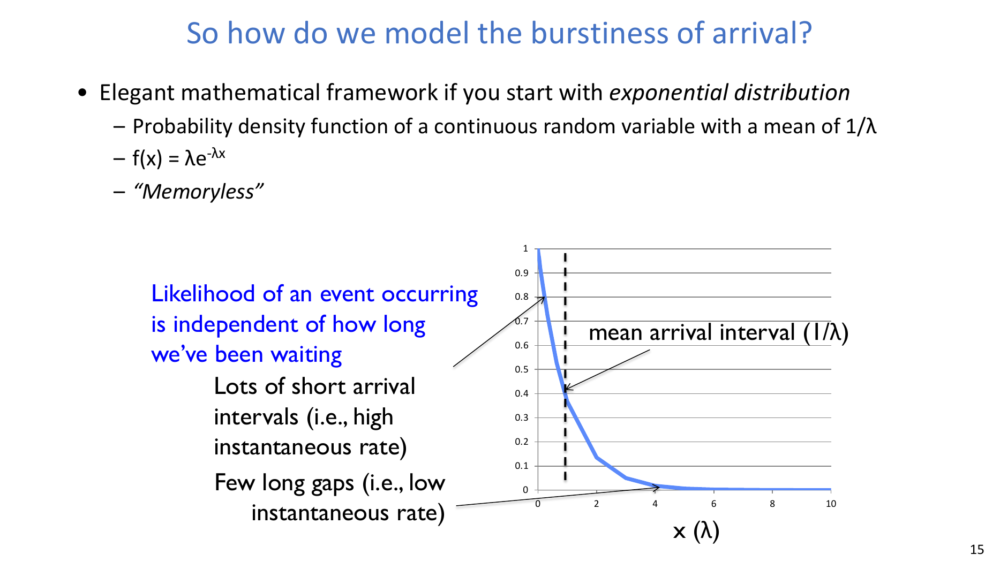

这个分布会产生许多很短的到达间隔，对应很高的瞬时到达率；也会产生少量很长的空隙，对应很低的瞬时到达率。这种混合是突发性的一个简单模型。

为了描述随机服务时间分布，使用：

$$
m = \sum p(T) \times T
$$

$$
\sigma^2 = \sum p(T)(T - m)^2 = \sum p(T)T^2 - m^2
$$

$$
C = \frac{\sigma^2}{m^2}
$$

其中 `m` 是平均服务时间，`sigma^2` 是方差，`C` 是 **squared coefficient of variance（平方变异系数）**。

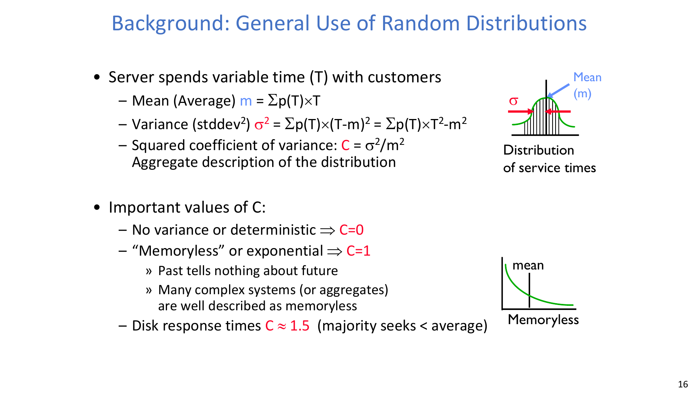

`C` 的重要取值包括：
- deterministic service time 没有方差，因此 `C = 0`；
- memoryless 或 exponential service time 有 `C = 1`；
- disk response times 大约是 `C ~= 1.5`，因为许多 seek 小于平均值，但也有一些很长。

## 5. 排队理论结果
排队理论适用于长期、稳态行为；在稳态下，arrival rate 等于 departure rate。到达和离开分别由某种概率分布刻画。

基础单 server 模型是一段 queue 后面接一个 server：

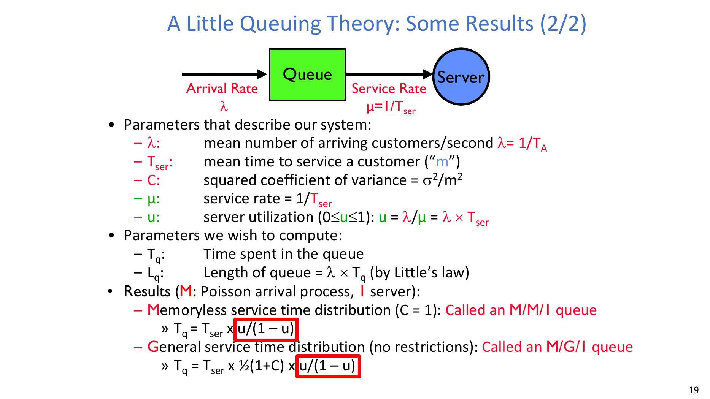

系统参数包括：
- `lambda`：每秒平均到达的 customer 数，也就是 `lambda = 1/T_A`；
- `T_ser`：服务一个 customer 的平均时间；
- `C`：平方变异系数，`sigma^2/m^2`；
- `mu`：服务率，`mu = 1/T_ser`；
- `u`：server utilization，满足 `0 <= u <= 1`，并且 `u = lambda / mu = lambda * T_ser`。

希望计算的量包括：
- `T_q`：在队列中花费的时间；
- `L_q`：平均队列长度。

根据 Little's law：

$$
L_q = \lambda T_q
$$

对于具有 Poisson arrival process 的单 server：

| 队列模型 | 服务时间假设 | 排队延迟 |
|---|---|---|
| **M/M/1 queue** | memoryless service time，`C = 1` | $T_q = T_{ser} \times \frac{u}{1-u}$ |
| **M/G/1 queue** | general service-time distribution | $T_q = T_{ser} \times \frac{1}{2}(1+C) \times \frac{u}{1-u}$ |

`u/(1-u)` 是危险项。当利用率 `u` 接近 1 时，分母接近 0，在这个简化模型中，排队延迟会趋向无穷大。

:::remark 问题：排队时间到底该怎样处理？
排队时间不是偶然细节；它常常是响应时间中的主导项。排队理论提供了一种从到达率、服务时间、利用率和服务时间变异性估计排队时间的方法。模型是简化的，但它抓住了一个核心事实：突发性和高利用率会放大延迟。
:::

## 6. 排队理论计算例子
考虑一个磁盘工作负载，其使用统计如下：
- 用户每秒请求 `10 x 8KB` disk I/O；
- 请求和服务时间都是指数分布，因此 `C = 1.0`；
- 平均服务时间为 `20 ms`，包含 controller time、seek、rotation 和 transfer。

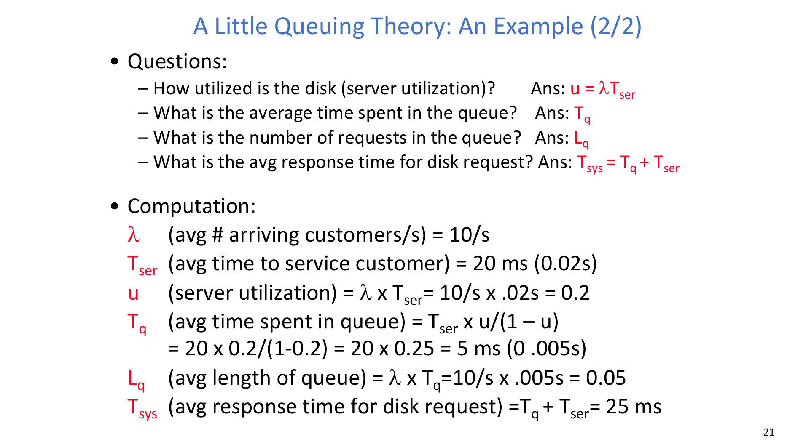

问题是：
- 磁盘利用率是多少，也就是 server utilization 是多少？
- 平均排队时间是多少？
- 队列中的请求数量是多少？
- 一个 disk request 的平均响应时间是多少？

到达率和服务时间是：

$$
\lambda = 10/s
$$

$$
T_{ser} = 20\text{ ms} = 0.02\text{ s}
$$

利用率为：

$$
u = \lambda T_{ser} = 10/s \times 0.02s = 0.2
$$

因为 `C = 1`，使用 M/M/1 结果：

$$
T_q = T_{ser} \times \frac{u}{1-u}
$$

代入数值：

$$
T_q = 20\text{ ms} \times \frac{0.2}{1-0.2}
     = 20\text{ ms} \times 0.25
     = 5\text{ ms}
$$

根据 Little's law：

$$
L_q = \lambda T_q = 10/s \times 0.005s = 0.05
$$

平均响应时间是服务时间加排队时间：

$$
T_{sys} = T_q + T_{ser} = 5\text{ ms} + 20\text{ ms} = 25\text{ ms}
$$

:::remark 问题：如果请求确实会排队，为什么队列长度只有 0.05？
`L_q = 0.05` 是长期平均值，并不是说队列里永远有 0.05 个请求。大多数时间队列可能为空，偶尔会有一个或多个请求等待。对时间取平均后，就得到 0.05 个等待请求。
:::

## 7. 优化 I/O 性能
基本问题是：如何改进 I/O 性能？

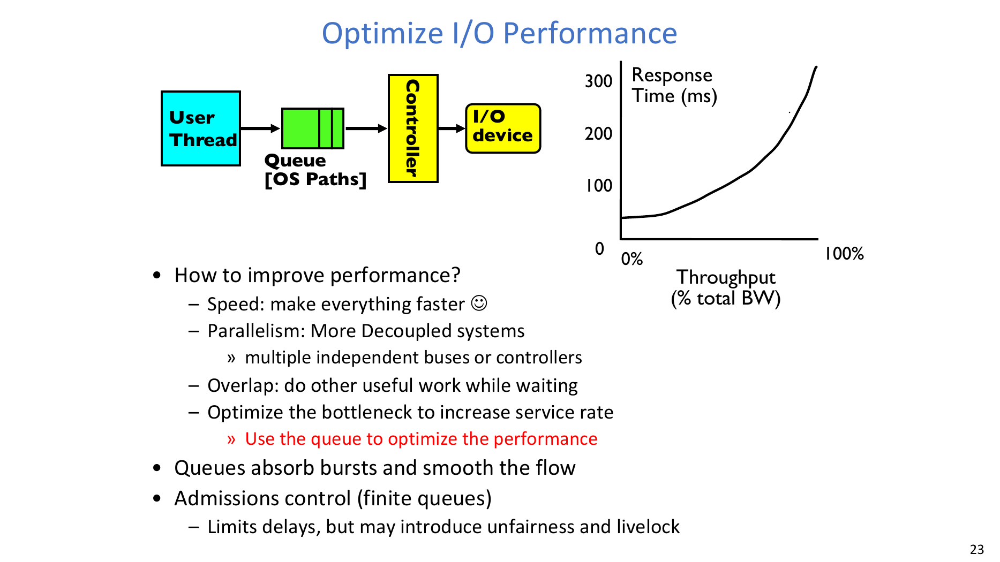

主要方法包括：
- **Speed（速度）**：让各个组件更快。
- **Parallelism（并行性）**：使用更多解耦系统，例如多个独立 bus 或 controller。
- **Overlap（重叠）**：等待 I/O 时做其他有用工作。
- **Optimize the bottleneck（优化瓶颈）**：提高限制性组件的服务率。
- **Use queues intentionally（有意识地使用队列）**：队列可以吸收突发、平滑流量，也可以用于重排序或批处理。
- **Admission control with finite queues（有限队列的准入控制）**：限制队列长度可以限制延迟，但设计不好可能引入不公平或 livelock。

磁盘性能最高的情况通常是存在大规模顺序读，或者有足够多排队工作，使请求能通过重排序和批处理被 piggyback。设备大多空闲时，低效一点通常可以接受，因为竞争少，延迟仍然低。

突发既是威胁，也是机会：
- 威胁：突发会增加延迟；
- 机会：突发产生足够多可见工作，使系统能够 piggyback、request reordering 和 batching，例如一次 context switch 处理多个请求。

其他技术包括通过 user-level drivers 减少开销，例如避免 context switch；以及在等待 I/O 时做其他有用工作，从而降低 I/O delay 的影响。

:::remark 问题：为什么队列既会伤害性能，又能帮助性能？
队列会伤害性能，因为等待会增加延迟。队列也能帮助性能，因为多个请求同时可见后，系统可以选择更好的顺序、批量处理工作，或利用并行性。没有策略的队列只是延迟；带有好策略的队列可以把突发性转换成调度信息。
:::

## 8. 磁盘调度
磁盘同一时刻只能处理一个请求。调度问题是：**What order do you choose to do queued requests?（你会按什么顺序处理排队请求？）**

例子中的请求队列使用 `(cylinder, sector)` 表示：

```text
(2,2), (5,2), (7,2), (3,10), (2,1), (2,3)
```

磁头靠近 cylinder 2，调度器必须决定下一个服务哪个请求。

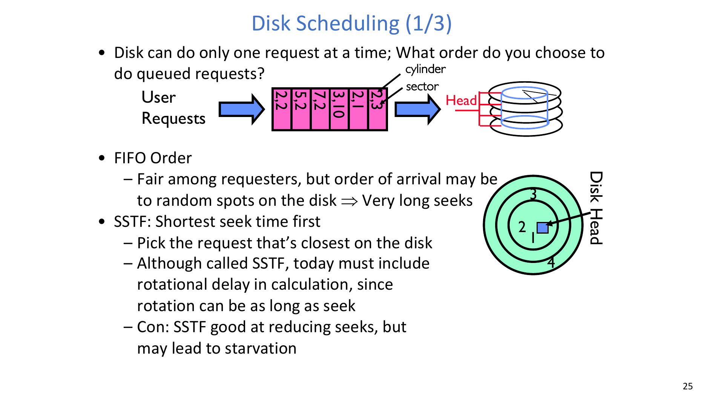

### 8.1 FIFO 与 SSTF
**FIFO Order** 按到达顺序服务请求。它在请求者之间是公平的，但到达顺序可能跳到磁盘上的随机位置，造成很长 seek。

**SSTF: Shortest Seek Time First** 选择磁盘上最近的请求。它擅长减少 seek，但如果当前位置附近不断有新请求到来，远处请求可能 starvation。此外，现代调度不能只考虑 seek distance；rotational delay 可能和 seek time 一样长，因此也应纳入成本计算。

### 8.2 SCAN
**SCAN** 实现 elevator algorithm：沿当前移动方向选择最近的请求。

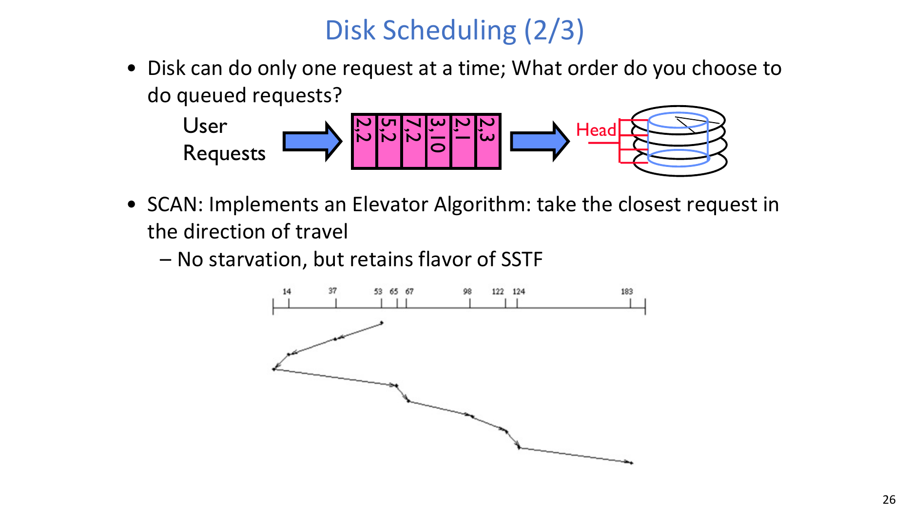

SCAN 不会像 SSTF 那样让远处请求一直饥饿，同时仍然保留一部分 SSTF 的局部性收益，因为它会沿扫描方向服务附近请求。

### 8.3 C-SCAN
**C-SCAN: Circular-Scan** 只朝一个方向移动。

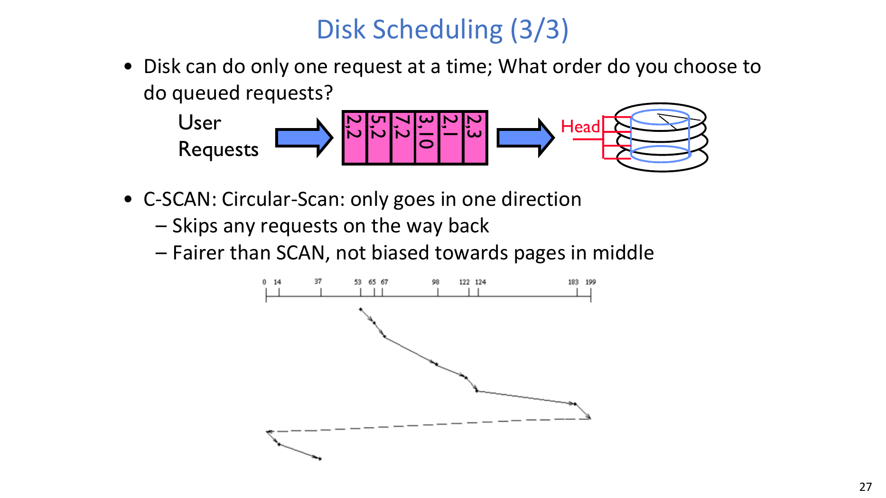

C-SCAN 在回程时跳过请求。它比 SCAN 更公平，因为它较少偏向磁盘中间区域；每个区域都等待下一次同方向扫描。

:::remark 问题：应该使用哪一种磁盘调度策略？
不存在普遍最好的策略。FIFO 简单，并按到达顺序公平，但可能浪费 seek time。SSTF 改善局部性，却可能让远处请求饥饿。SCAN 和 C-SCAN 用一点局部最优换取更可预测的前向进展和公平性。最佳策略取决于系统更重视公平性、延迟、吞吐还是实现简单性。
:::

## 9. Network I/O 具有相同的性能形状
Network I/O 移动的是 packets，而不是磁盘 blocks，但同样的原则仍然适用：latency、throughput、queues、batching、overhead 和 offload 都很重要。

Network I/O 在现代云系统中特别关键：
- 应用和系统是网络化、分布式的；
- 存储常常通过 network I/O 访问；
- 一种常见现代设计是把存储设备组织成 storage pool，并让 compute nodes 通过 datacenter network 访问它。

改进 network I/O 的方法包括：
- 为分布式应用提供更好的抽象，例如 coflow；
- 优化内核中的 TCP/IP stack；
- 通过 user-space network stack 做 kernel bypass；
- 把工作 offload 到 NIC，例如 RDMA、SmartNICs 和 DPUs。

## 10. 从存储到文件系统
I/O 栈可以看成若干层：

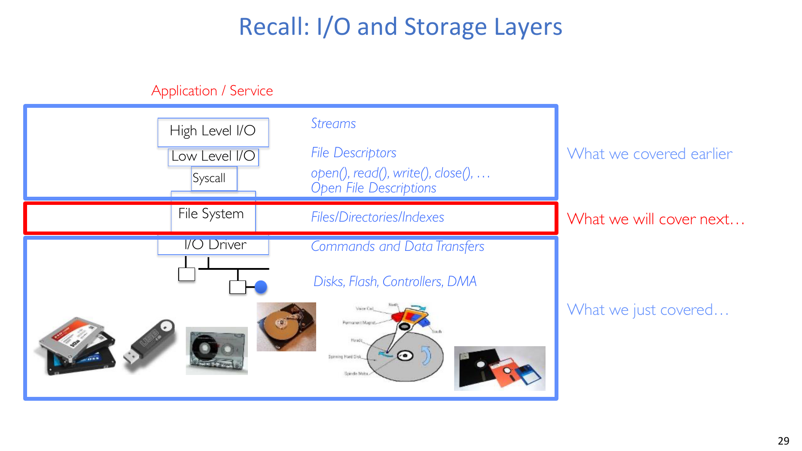

顶部是 application services、streams、file descriptors、`open()`、`read()`、`write()`、`close()` 等 syscalls，以及 open file descriptions。底部是 I/O drivers、commands and data transfers、disks、flash、controllers 和 DMA。文件系统位于中间：它管理 files、directories 和 indexes。

从 storage 到 file system 的过渡改变了思考单位：

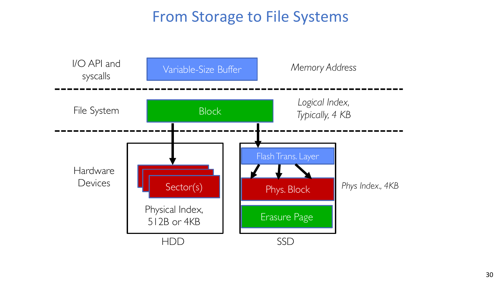

用户和 syscall 层处理 I/O API，以及位于内存地址上的 variable-size buffers。文件系统把这些请求转换成 logical blocks，通常约 4 KB。硬件设备再用不同方式翻译这些 block：
- HDD 使用 physical index 访问 sector(s)，通常是 512 B 或 4 KB。
- SSD 使用 Flash Translation Layer、physical blocks 和 erasure pages；OS 级 block 与内部 erase unit 并不是同一个东西。

关键定义是：**File System: Layer of OS that transforms block interface of disks (or other block devices) into Files, Directories, etc.（文件系统是 OS 中把磁盘或其他块设备的 block interface 转换为 files、directories 等抽象的一层）**。

经典 OS 设计把有限的硬件接口，本质上是一组 blocks 的数组，转换成更方便的接口，提供：
- **Naming（命名）**：通过名字找文件，而不是通过 block number。
- **Organization（组织）**：把文件名放在目录中，并把文件映射到 blocks。
- **Protection（保护）**：执行访问限制。
- **Reliability（可靠性）**：在 crash、hardware failure 等问题发生时仍尽量保持文件完整。

## 11. 文件的用户视图与系统视图
从用户角度看，文件是持久数据结构。它能跨程序运行和电源周期保存数据。

从 system call interface 角度看，文件是 **collection of bytes（字节集合）**，尤其是在 UNIX 中。OS 并不关心应用想在磁盘上存储什么数据结构。

从 OS 内部看，文件是 **collection of blocks（块集合）**。block 是逻辑传输单位，sector 是物理传输单位。block size 至少等于 sector size；在 UNIX 中，常见 block size 是 4 KB。

### 11.1 把字节请求翻译成块请求
问题是：如果用户说 **“give me bytes 2-12”**，会发生什么？

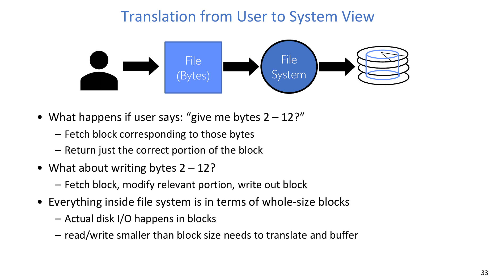

文件系统会取回包含这些字节的 block，然后只返回这个 block 中正确的部分。

相关问题是：如果要写入 bytes 2-12 呢？文件系统会取回这个 block，修改相关部分，然后把整个 block 写回去。

:::remark 问题：为什么一个小范围字节写入需要读取并重写整个 block？
实际磁盘 I/O 以 blocks 为单位发生。如果用户只写 bytes 2-12，文件系统不能在不保留 block 其他内容的情况下只覆盖这些字节。因此它要先读出旧 block，在内存中修改目标字节范围，再把修改后的 block 写回去。
:::

## 12. 磁盘管理与磁盘上的元数据
磁盘上的基本实体是：
- **File（文件）**：用户可见的一组 blocks，在逻辑空间中顺序排列。
- **Directory（目录）**：用户可见的索引，把 names 映射到 files。

磁盘被访问为线性 sector 数组。识别 sector 有两种方式：
- **Physical position（物理位置）**：sector 被描述为 `[cylinder, surface, sector]`。这已经不再是常规接口，而且会迫使 OS 或 BIOS 处理 bad sectors 和物理磁盘几何。
- **Logical Block Addressing (LBA)**：每个 sector 都有一个整数地址。控制器把 logical address 转换成 physical position，并把磁盘内部结构屏蔽给 OS。

文件系统需要追踪：
- 哪些 blocks 包含哪些 files 的数据，这样才知道从哪里读文件；
- 哪些 files 位于目录中，这样才能根据名字找到文件的 blocks；
- 哪些 disk blocks 是空闲的，这样才知道新写入数据应该放在哪里。

所有这些 metadata 都必须维护在 **somewhere on disk（磁盘上的某处）**。

磁盘上的数据结构不同于内存中的数据结构：
- 磁盘一次访问一个 block，因此读写单个 word 并不高效。
- 更新一个小字段通常意味着读写包含它的完整 block。
- 顺序访问模式更理想。
- durability 很重要：理想情况下，关机后文件系统仍处于有意义状态，但 crash 可能打断更新过程。

## 13. 文件系统设计的关键因素
几个设计因素主导文件系统行为：
- **(Hard) Disk Performance**：最大化顺序访问，最小化 seeks。
- **Open before Read/Write**：打开文件能让系统提前执行保护检查，并定位真正的文件资源。
- **Size is determined as files are used**：文件可以从小开始并随着写入增长，所以文件系统必须在文件扩展时为它腾出空间。
- **Organized into directories**：文件系统需要一种磁盘上的数据结构来表示 names 和 directories。
- **Careful block allocation and freeing**：分配决策应保持访问效率，并维护正确的 free-space map。

:::remark 问题：为什么需要 `open()`，而不是在每次 `read()` 或 `write()` 中完成所有工作？
`open()` 让 OS 能解析 pathname、检查权限、找到文件 metadata、创建 open file description，并记录 current file offset 等状态。之后的 `read()` 和 `write()` 可以使用 file descriptor，避免每次都重复完整 name resolution。
:::

## 14. 文件系统的组成部分
文件系统有四个核心组成部分：
- **directory**；
- **index structure**；
- **storage blocks**；
- **free space map**。

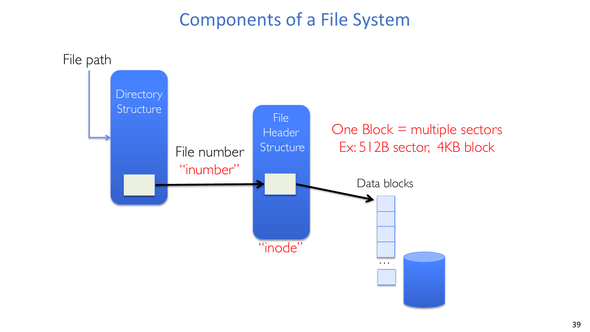

流程是：
1. 用户提供 file path。
2. directory structure 把 path 映射到 **file number**，也叫 **inumber**。
3. file number 定位到 file header structure，通常叫 **inode**。
4. inode 或 index structure 定位到文件的 data blocks。

一个 file-system block 可以包含多个 sector。例如，如果 sector 是 512 B，而 block 是 4 KB，那么一个 block 包含八个 sector。

打开文件和 file number 的关系很重要：

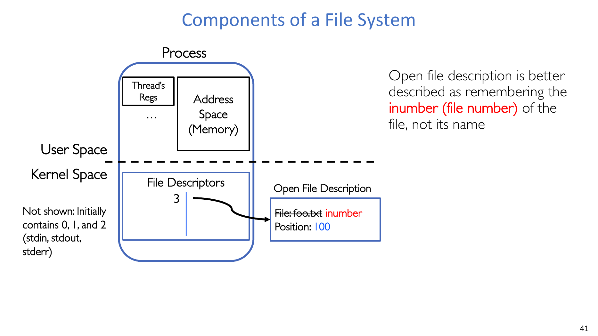

如果进程执行 `open("foo.txt")` 并得到 file descriptor `3`，那么 `read(3, buf, 100)` 会从 descriptor `3` 对应的 open file description 读取。open file description 更准确地说应当记住文件的 **inumber (file number)**，而不是名字。它还可能记住 current position；一次成功的 100-byte read 之后，position 变为 `100`。

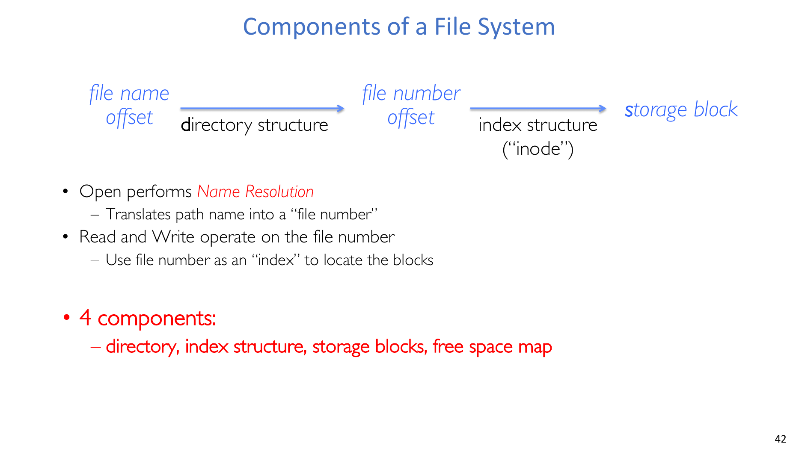

**Open performs Name Resolution**：它把 path name 翻译成 file number。**Read and Write operate on the file number**：它们使用 file number 作为 index 来定位 blocks。

:::remark 问题：为什么打开后要记住 file number，而不是 file name？
file number 是用于定位 file metadata 和 blocks 的稳定内部标识符。name 只是 directory entry；名字可以被修改、链接或删除。文件打开后，内核应继续引用底层 file object，而不是反复依赖文本路径。
:::

## 15. 目录与名称解析
Directories 是特殊的文件。它们的内容是一组 pair：

```text
<file name, file number>
```

访问目录的系统调用包括：
- `open`、`creat` 和 `readdir`，用于遍历结构；
- `mkdir` 和 `rmdir`，用于添加或删除目录项；
- `link` 和 `unlink`，用于添加或删除 name-to-file 关系。

目录是一个包含 `<file_name : file_number>` 映射的文件。file number 可以指向普通文件，也可以指向另一个目录。每个映射叫做 **directory entry（目录项）**。OS 用自己解释的格式把这些映射存入目录。

进程不能用普通 `read()` 读取目录的 raw bytes。相反，`readdir()` 会在不暴露 raw bytes 的情况下遍历这个 map。

:::remark 问题：为什么 OS 不应该允许进程读写目录的 raw bytes？
目录是文件系统元数据。如果进程可以任意覆盖 raw directory bytes，它可能制造格式错误的 entry、破坏 name resolution、绕过 protection、泄露已删除名字，或直接损坏文件系统。`readdir()` 暴露逻辑目录项，同时保留 OS 对磁盘格式和一致性规则的控制。
:::

### 15.1 解析 `/my/book/count`
问题是：解析 `/my/book/count` 需要多少次 disk access？

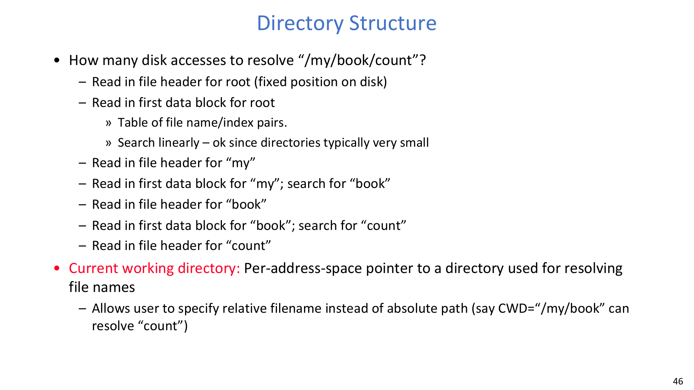

忽略缓存时，顺序如下：
1. 读取 root 的 file header，它位于磁盘固定位置。
2. 读取 root 的第一个 data block，其中包含 file-name/index pairs 表，并搜索 `my`。
3. 读取 `my` 的 file header。
4. 读取 `my` 的第一个 data block，并搜索 `book`。
5. 读取 `book` 的 file header。
6. 读取 `book` 的第一个 data block，并搜索 `count`。
7. 读取 `count` 的 file header。

所以在这个简化的无缓存图景中，路径解析需要七次 disk access。目录通常很小，因此简单目录中线性搜索可能可以接受。

**current working directory（当前工作目录）** 是 per-address-space 的指针，指向一个用于解析文件名的目录。它允许用户使用相对文件名而不是绝对路径。例如，如果 `CWD = "/my/book"`，那么相对名字 `"count"` 可以解析为 `/my/book/count`。

## 16. 内存中的文件系统结构
文件系统还会维护内存结构，以避免重复昂贵的磁盘查找。

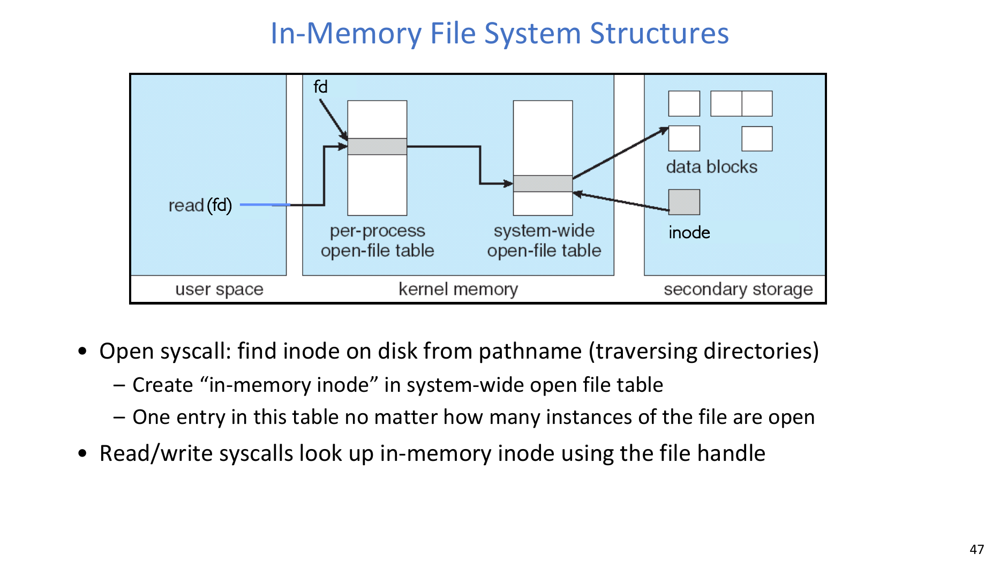

打开路径如下：
1. `open()` 通过遍历目录，根据 pathname 在磁盘上找到 inode。
2. OS 在 system-wide open-file structures 中创建或找到 in-memory inode。
3. per-process file descriptor table 把一个小整数 file descriptor 映射到 open-file entry。
4. `read(fd)` 和 `write(fd)` 使用 file handle 找到 in-memory inode，然后定位 data blocks。

无论一个文件被打开多少次，它都应当只有一个 in-memory inode entry。这样可以避免重复 metadata，并给内核一个共享位置来协调同一底层文件的信息。

:::remark 问题：file descriptor 和 inode 有什么区别？
file descriptor 是每个进程自己的小整数句柄，例如 `3`。inode 是文件系统 metadata object，用来识别底层文件并指向它的数据块。descriptor 是进程命名一个已打开文件的方式；inode 是文件系统定位和管理实际文件的方式。
:::

## 17. 文件特征
FAST 2007 发表的 **A Five-Year Study of File-System Metadata** 研究了某大型公司中超过 60,000 个 Windows PC 文件系统的年度 metadata snapshots。

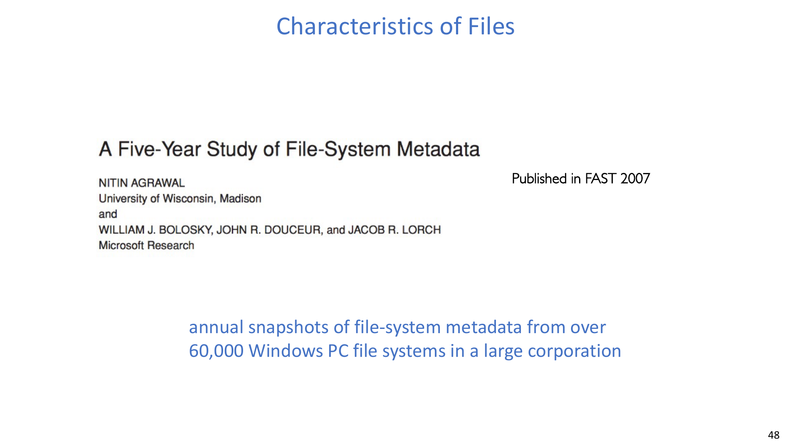

其中两个观察对文件系统设计很重要。

### 17.1 Observation 1: Most Files Are Small
按文件数量统计的直方图显示，文件数量集中在较小 size ranges 中。峰值位于 KB 级的小文件附近，许多文件位于几 KB 到几十 KB 的 bin 中，而非常大的文件数量相对较少。

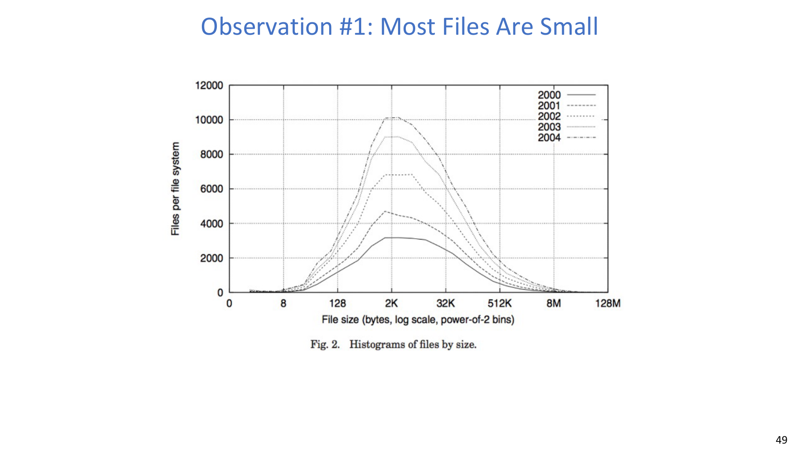

这意味着文件系统必须让小文件操作高效。metadata lookup、directory traversal、inode access 和 small block allocation 不是罕见边角情况，而是常见操作。

### 17.2 Observation 2: Most Bytes Are in Large Files
按字节数加权的直方图给出另一种图景。虽然大文件数量更少，但大多数已用空间包含在大文件中，在 MB 级和 GB 级 file-size ranges 中出现明显峰值。

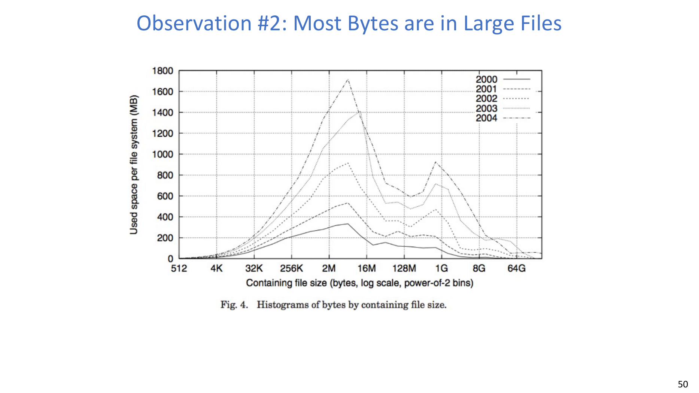

这意味着文件系统也必须优化大文件吞吐。高效顺序分配、类似 extent 的布局、readahead、write batching 和低碎片化都很重要，因为大文件主导存储容量和批量传输。

:::remark 问题：为什么“多数文件很小”和“多数字节在大文件中”可以同时成立？
file count 和 byte count 衡量的是不同东西。目录树可以包含大量很小的配置文件、metadata 文件或源代码文件，所以多数文件是小文件。但少数视频、虚拟机镜像、数据库、归档或数据集可以消耗大多数字节。好的文件系统因此必须同时优化小文件 metadata 操作和大文件流式访问。
:::

## 18. 总结：文件系统到底在优化什么
文件系统的设计目标是相对于底层设备的性能特征来优化性能和可靠性。突发和高利用率会引入排队延迟，因此存储栈必须谨慎管理队列。

对于 queueing latency，M/M/1 和 M/G/1 是最简单的分析模型：

$$
T_q = T_{ser} \times \frac{1}{2}(1+C) \times \frac{u}{1-u}
$$

当利用率接近 100% 时，在简化模型中，延迟会趋向无穷大。

文件系统：
- 把 blocks 转换成 files 和 directories；
- 针对访问模式和使用模式进行优化；
- 最大化顺序访问，同时允许高效随机访问；
- 通过叫做 **inodes** 的 file headers 表示 files 和 directories；
- 通过把用户可见名字翻译成实际系统资源来完成 naming；
- 把目录结构作为 linked 或 tree-like structures 存储在文件中。

## Exam Review
**Response Time or Latency** 是执行一个操作所需的时间。**Bandwidth or Throughput** 是操作被执行的速率。I/O response time 包括 software path cost、queueing delay、controller time 和 device service time。

利用率是：

$$
u = \lambda / \mu = \lambda T_{ser}
$$

其中 `lambda` 是 arrival rate，`mu = 1/T_ser` 是 service rate，`T_ser` 是平均服务时间。

平方变异系数是：

$$
C = \sigma^2 / m^2
$$

确定性服务有 `C = 0`，exponential 或 memoryless service 有 `C = 1`，disk response times 大约是 `C ~= 1.5`。

对于 M/M/1：

$$
T_q = T_{ser} \times \frac{u}{1-u}
$$

对于 M/G/1：

$$
T_q = T_{ser} \times \frac{1}{2}(1+C) \times \frac{u}{1-u}
$$

根据 Little's law：

$$
L_q = \lambda T_q
$$

在磁盘例子中，`lambda = 10/s`，`T_ser = 20 ms`，`u = 0.2`。queueing time 是 `5 ms`，queue length 是 `0.05`，response time 是 `25 ms`。

改进 I/O 性能可以通过让组件更快、增加并行性、把 I/O 与有用工作重叠、优化瓶颈、批量处理或重排序排队请求，以及在队列过长时进行 admission control。

磁盘调度策略在公平性和局部性之间权衡。FIFO 按到达顺序公平，但可能造成长 seek。SSTF 减少 seek distance，但可能让远处请求饥饿。SCAN 像电梯一样扫描，避免饥饿。C-SCAN 只朝一个方向移动，对磁盘区域更公平。

**File System** 是 **OS 中把磁盘或其他块设备的 block interface 转换成 files、directories 和相关抽象的一层**。它提供 naming、organization、protection 和 reliability。

用户把文件看作持久数据；syscall interface 把文件看作 byte stream；OS 内部管理 blocks。小范围字节读写必须被翻译成 block 操作，partial-block write 常常需要 read-modify-write。

文件系统核心组件是 directory、index structure、storage blocks 和 free space map。`open()` 执行从 pathname 到 file number 的 name resolution；`read()` 和 `write()` 通过 file descriptor 在 file number 或 in-memory inode 上操作。

Directories 是包含 `<file name, file number>` entries 的特殊文件。无缓存地解析 `/my/book/count` 需要读取 root metadata 和 data，再读取 `my` metadata 和 data，再读取 `book` metadata 和 data，最后读取 `count` metadata：在简化模型中共七次 disk access。

多数文件是小文件，但多数字节位于大文件中。好的文件系统必须高效处理小文件 metadata 操作，同时为大文件保持高吞吐和局部性。
