# Lec21 - File System 2: File System Case Studies and Buffering

## Learning Objectives
After this note, you should be able to compare FAT, Unix inode-based file systems, Berkeley FFS, and NTFS. You should also be able to explain how a file number leads to file blocks, why physical block placement affects performance, how hard links and symbolic links differ, how pathname traversal works, and why large directories and fragmented files need indexed data structures.

## 1. Performance and Block Access Recap
File-system design is constrained by the same I/O performance model used for disks and SSDs. A useful system may have high throughput, but a user request still experiences latency if it waits in a queue. The two key definitions remain:

- **Response Time or Latency: Time to perform an operation**.
- **Bandwidth or Throughput: Rate at which operations are performed**.

For a stable single-server queue, the main quantities are:

- `lambda`: the average arrival rate.
- `T_ser`: the average service time.
- `mu = 1 / T_ser`: the service rate.
- `u = lambda / mu = lambda * T_ser`: server utilization.
- `T_q`: the time spent waiting in the queue.
- `L_q = lambda T_q`: the average queue length.
- `C = sigma^2 / m^2`: the squared coefficient of variation of service time.

The two formulas worth keeping in working memory are:

$$
T_q = T_{ser} \times \frac{u}{1-u}
$$

for an M/M/1 queue, and:

$$
T_q = T_{ser} \times \frac{1}{2}(1+C) \times \frac{u}{1-u}
$$

for an M/G/1 queue.

The important lesson is that queueing delay grows sharply as utilization approaches 1. A file system that creates unnecessary seeks or random I/O not only increases service time, but also pushes the device closer to the steep part of the queueing curve.

## 2. Disk Scheduling and Byte-to-Block Translation
Disk scheduling policies decide the order in which queued disk requests are served. For a request queue such as `(2,2), (5,2), (7,2), (3,10), (2,1), (2,3)`, the policies emphasize different tradeoffs:

| Policy | Main idea | Strength | Weakness |
|---|---|---|---|
| FIFO | Serve requests in arrival order. | It is simple and fair by arrival order. | It may cause long seeks. |
| SSTF | Serve the request closest to the current head position. | It often reduces seek distance. | It can starve far-away requests. |
| SCAN | Move like an elevator and serve the closest request in the current direction. | It preserves locality and avoids starvation. | It still gives some preference to middle tracks. |
| C-SCAN | Move in one direction, then return without serving requests on the return trip. | It is fairer than SCAN and avoids bias toward the middle. | Some requests wait for a full cycle. |

The file API often talks in bytes, while the storage device reads and writes fixed-size blocks. If an application asks for bytes 2 through 12, the file system must fetch the containing block and return only the relevant byte range. If an application writes bytes 2 through 12, the file system often has to fetch the old block, modify the relevant portion in memory, and write the full block back.

:::remark Question: Why does a byte write often require reading the old block first?
The device usually overwrites complete blocks, not arbitrary byte ranges. If the write changes only part of a block, the unchanged bytes in that same block must be preserved. The standard read-modify-write sequence is: read the old block, patch the requested bytes in memory, then write the whole block back.
:::

## 3. Case Study: FAT
The **File Allocation Table (FAT)** design originated in MS-DOS in 1977 and remains widely used because it is simple, portable, and easy to implement even in device firmware. Its core idea is to store file-block connectivity in a table rather than inside each file's data blocks.

Assume a directory lookup has already translated a path into a file number. Disk storage is a collection of blocks, and a file offset can be represented as `o = <B, x>`, where `B` is the logical block number inside the file and `x` is the byte offset inside that block.

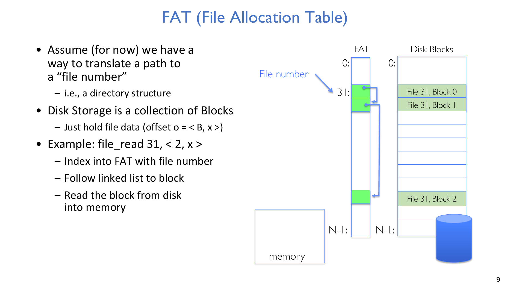

To execute `file_read(31, <2, x>)`, the file system uses file number `31` as an index into the FAT. The FAT entry points to the first physical block of the file. To reach logical block 2, the file system follows the linked list from logical block 0 to logical block 1 and then to logical block 2. It then reads that physical block from disk into memory and returns the byte at offset `x`.

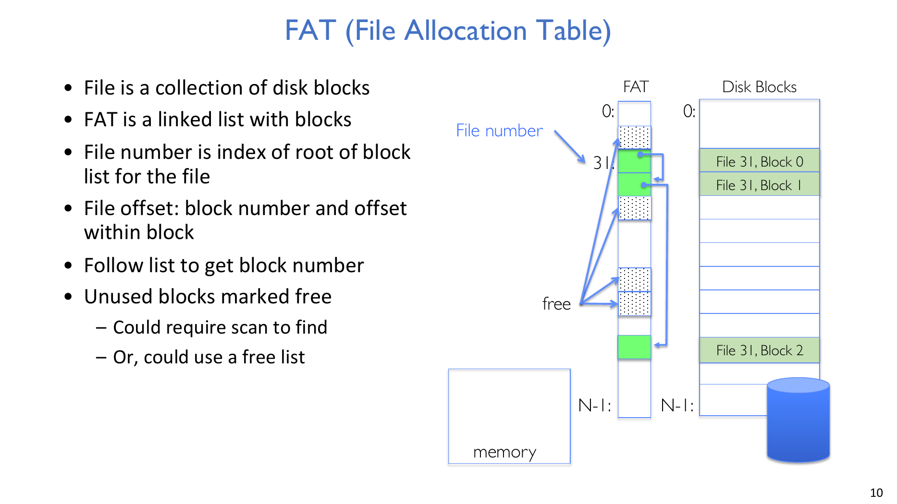

In FAT:

- **File is collection of disk blocks; FAT is a linked list with blocks**.
- **File number is the index of the root of the block list for the file**.
- **File offset = block number + offset within block**.
- **Follow list for block number**.
- **Unused blocks marked free**.

Free space can be found by scanning FAT entries for free entries, or by maintaining a separate free list.

## 4. Writing and Formatting in FAT
A write that extends a file must allocate and link new blocks.

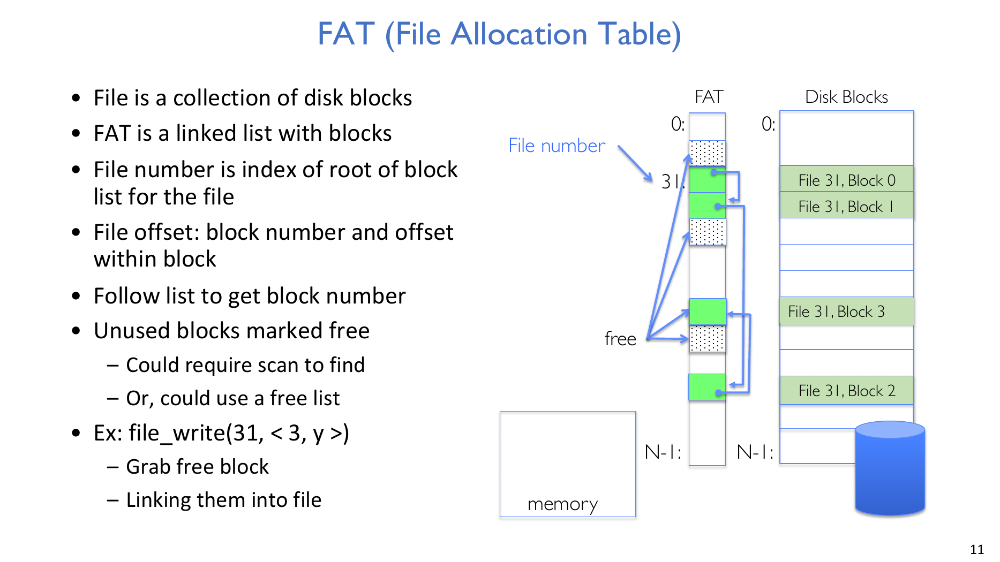

For `file_write(31, <3, y>)`, suppose logical block 3 does not yet exist. The file system finds a free physical block, writes `y` into that block, updates the old last FAT entry to point to the new block, and marks the new FAT entry as the new end of the chain. The data block contains the bytes; the FAT contains the chain structure.

The FAT itself is stored on disk. Formatting and quick formatting are therefore mostly operations on the metadata:

- To format a disk, the system can zero blocks and mark FAT entries as free.
- To quick format a disk, the system can simply mark FAT entries as free.
- Because the structure is simple, it can be implemented inside device firmware.

:::remark Question: Why does quick format not necessarily erase old data bytes?
Quick format changes the allocation metadata so old blocks appear free. The old data bytes may still remain on the medium until later writes overwrite them. From the file system's point of view the files are gone because their names and allocation chains are no longer authoritative, but raw storage may still contain stale bytes.
:::

## 5. Directories in FAT
A directory is a file containing mappings from names to file numbers:

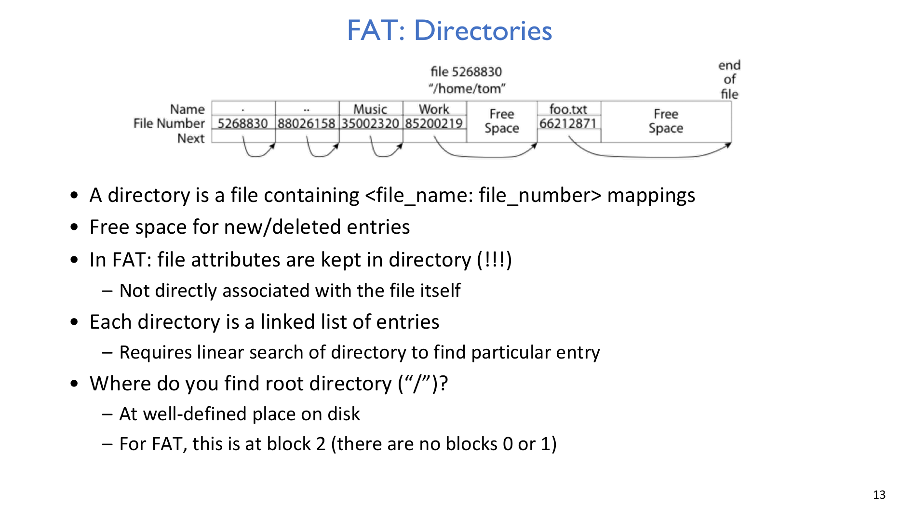

A FAT directory entry stores information such as `<file_name : file_number>`. Directory files also contain free space for newly created entries and deleted entries. FAT stores file attributes in the directory entry rather than storing them with the file object itself.

Each directory is represented as a linked list of entries, and name lookup is a linear search. The root directory `/` sits at a well-defined place. In FAT, it starts at block 2, because blocks 0 and 1 are reserved.

The example directory `/home/tom` contains entries such as `.`, `..`, `Music`, `Work`, and `foo.txt`. Each entry maps a name to a file number, such as `Music -> 35002320` or `foo.txt -> 66212871`. Free directory slots may appear between valid entries after files have been deleted.

:::remark Question: What is the cost of using a linear directory list?
Lookup time grows with the number of entries. A small directory is cheap, but a directory with thousands or millions of entries may require many comparisons and possibly many disk reads before the target name is found. This is why later file systems often replace linear directory scans with hash tables, B-Trees, or B+Trees.
:::

## 6. FAT Design Discussion
The central FAT design question is: suppose we already know the file number. How good is the layout for finding file blocks, sequential access, random access, fragmentation, small files, and big files?

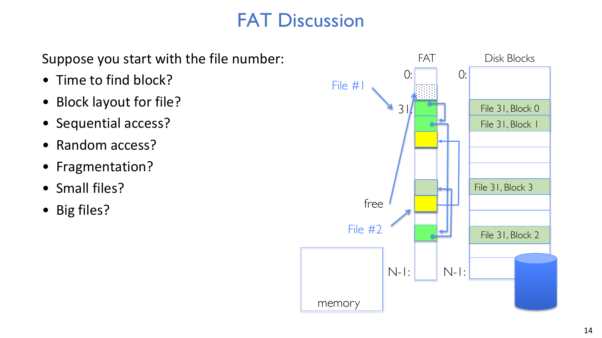

:::remark Question: If we start with a file number, what are FAT's main tradeoffs?
To find logical block `k`, the file system must follow `k` links from the file's first block. If the FAT is cached in memory, this traversal may avoid extra disk I/O for the metadata, but the logical operation is still linear in `k`.

The block layout can be highly fragmented because each link may point to any free physical block. Sequential access is workable because the file system can walk the chain once, but it is not guaranteed to be physically sequential on disk. Random access is weak because reaching a far logical block requires walking the chain from the beginning or from a cached position.

Small files are simple and cheap to represent, but attributes being stored in directory entries makes sharing the same file under multiple names awkward. Big files are possible, but long chains and fragmentation make random access and high-throughput sequential access less attractive.
:::

## 7. Case Study: Unix File System
Unix file systems use **inodes** to separate file metadata from directory names. A file number, or **inumber**, is an index into an array of inodes. Each inode corresponds to one file and stores the file's metadata and block pointers.

The key distinction from FAT is that read and write permissions are stored with the file, not with the directory entry. This makes it natural for multiple names to refer to the same file. The inode also maintains a multi-level tree for finding storage blocks.

This design works well for both little files and large files because the tree is asymmetric. Small files can use direct pointers with little overhead; large files can grow through indirect, double-indirect, and triple-indirect pointers. This inode design appeared in the original BSD 4.1 file system and is similar to Linux Ext2 and Ext3.

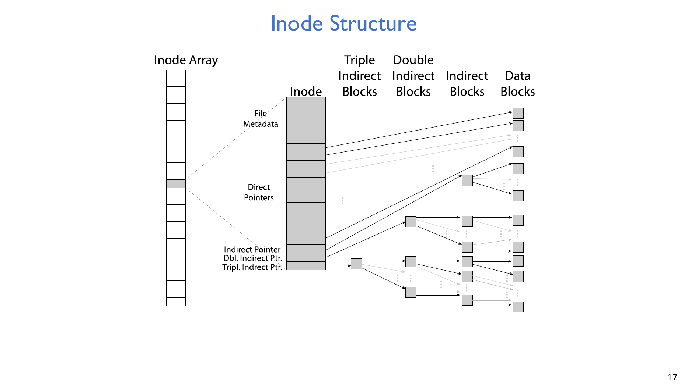

## 8. File Attributes and Protection
Unix file attributes include:

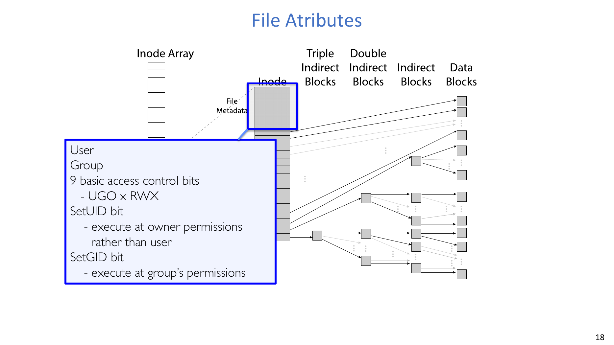

- User.
- Group.
- Nine basic access-control bits: **UGO x RWX**.
- **SetUID bit: execute at the file owner's permissions rather than the user's**.
- **SetGID bit: execute at the file group's permissions**.

The nine basic bits are organized by subject and operation. `U`, `G`, and `O` mean user, group, and other. `R`, `W`, and `X` mean read, write, and execute. A file can therefore express policies such as "the owner may read and write, group members may read, and everyone else has no access."

:::remark Question: Why is storing permissions in the inode important?
If permissions belong to the inode, every hard link to the same file sees the same protection state. If permissions were stored separately in each directory entry, two names for the same file could accidentally describe different access rules for the same underlying bytes. Unix avoids that by treating the inode as the file object and directory entries as names for that object.
:::

## 9. Small Files with Direct Pointers
For small files, the inode contains direct pointers to data blocks.

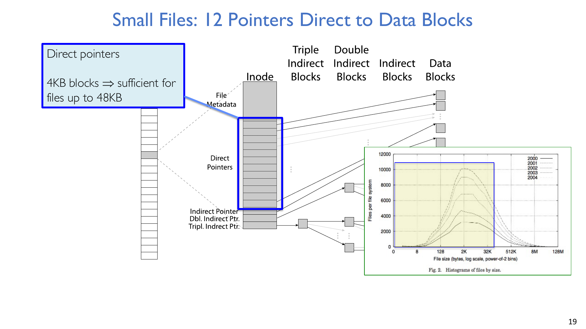

With 12 direct pointers and 4 KB blocks, direct pointers alone cover:

$$
12 \times 4KB = 48KB
$$

This is a good match for common workloads because many files are small. A small file can be opened and read with very little metadata traversal: read the inode, follow a direct pointer, and read the data block.

## 10. Large Files with Indirect Pointers
For large files, the inode uses indirect blocks. An indirect block is a disk block that stores only pointers to data blocks.

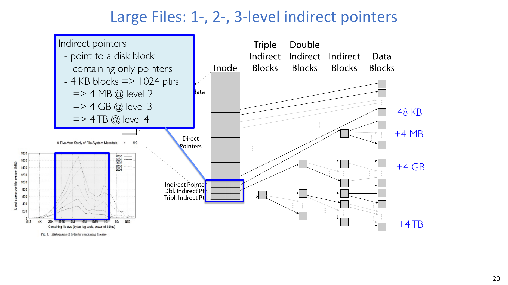

With 4 KB blocks and 4-byte pointers, one indirect block holds 1024 pointers. The reach of the inode grows as follows:

| Pointer region | Extra data reachable | Intuition |
|---|---:|---|
| Direct pointers | 48 KB | The inode points straight to data blocks. |
| Single indirect | 4 MB | One pointer block points to 1024 data blocks. |
| Double indirect | 4 GB | A block points to 1024 indirect blocks. |
| Triple indirect | 4 TB | A block points to 1024 double-level regions. |

:::remark Question: Why does this asymmetric tree work well for both small and large files?
Small files pay only for the direct pointers already stored in the inode. Large files pay extra metadata only when they need it. The structure is not a perfectly balanced tree; it is deliberately skewed so the common small-file case stays cheap while very large files still have an addressable path.
:::

## 11. On-Disk Index Access Example
Consider a multi-level indexed file format with 1 KB blocks, 10 direct pointers, 256 pointers per indirect block, 256 squared pointers through the double-indirect region, and 256 cubed pointers through the triple-indirect region.

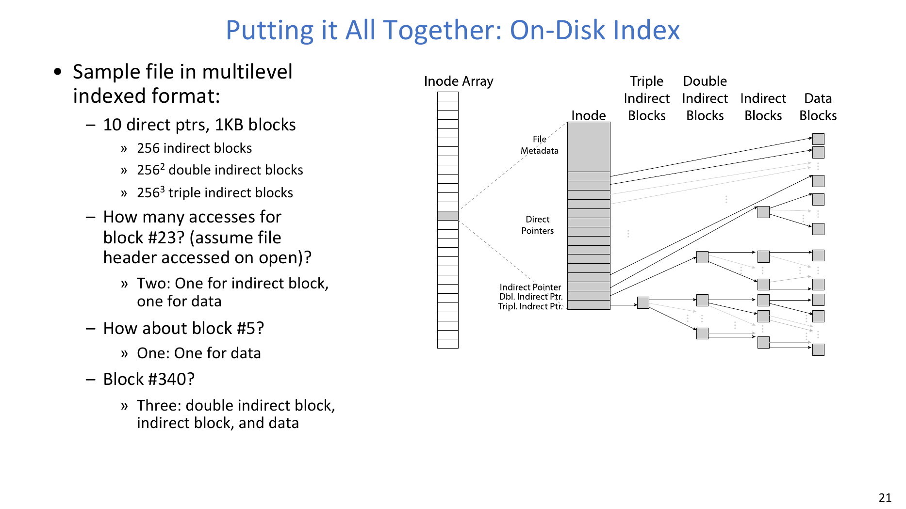

Assume the file header has already been accessed when the file was opened. Then:

- Logical block `5` needs **one disk access**, because it is covered by a direct pointer and the only remaining access is the data block.
- Logical block `23` needs **two disk accesses**, because direct pointers cover blocks `0` through `9`, and the single-indirect region covers blocks `10` through `265`. The file system reads the indirect block and then reads the data block.
- Logical block `340` needs **three disk accesses**, because the double-indirect region starts after `10 + 256 = 266` logical blocks. The file system reads the double-indirect block, then the selected single-indirect block, then the data block.

:::remark Question: Why is block 340 not in the single-indirect region?
The 10 direct pointers cover logical blocks 0 through 9. The single-indirect block contains 256 pointers, so it covers logical blocks 10 through 265. Logical block 340 is beyond 265, so it must be addressed through the double-indirect pointer.
:::

## 12. Case Study: Berkeley Fast File System
The **Berkeley Fast File System (FFS)**, introduced in BSD 4.2 in 1984, kept the inode structure from BSD 4.1 but changed allocation and layout policies for performance and reliability. The classic paper is **A Fast File System for UNIX** by McKusick, Joy, Leffler, and Fabry.

Important FFS changes include:

- It increased the block size from 1024 bytes to 4096 bytes for performance.
- It distributed inodes among tracks closer to data.
- It used bitmap allocation rather than a free list.
- It tried to allocate file blocks contiguously.
- It reserved about 10 percent of disk space.
- It used skip-sector positioning to handle rotational delay.

Early Unix and DOS/FAT placed file headers in a special array near the outermost cylinders. That design had two major problems. First, a head crash near that area could destroy many inodes and therefore destroy access to many files. Second, file headers were not near their data, so even a small read could require a seek to the header and another seek to the data.

Another hard problem is file growth. When a file is created, the file system often does not know how large it will become. Unix workloads commonly append to files, so the allocator must support growth while still keeping layout reasonably contiguous.

## 13. FFS Locality with Block Groups
FFS divides a volume into block groups, where each group is a set of nearby tracks. Data blocks, metadata, and free space are interleaved within a block group.

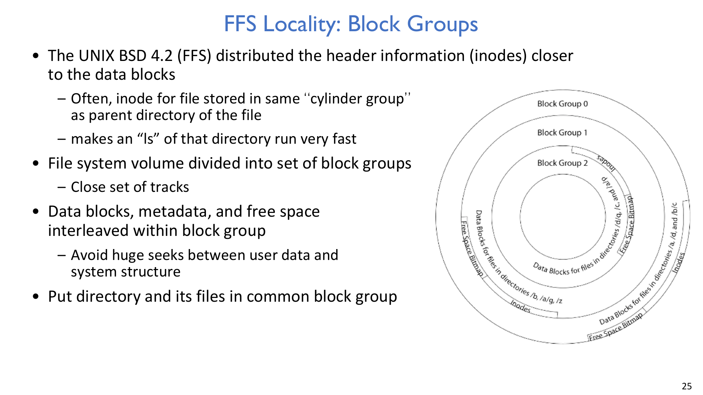

The common allocation policy is to place a file's inode in the same cylinder group as its parent directory. This makes directory operations such as `ls` fast because a directory's entries and many of the corresponding file headers are nearby. FFS also tries to put a directory and its files in a common block group so pathname traversal and small-file reads avoid huge seeks.

This is a physical-layout idea as much as a metadata idea. A logical file system can say "this file has these blocks", but performance depends on whether those blocks are physically close.

## 14. FFS First-Free Allocation and Reserved Space
FFS uses first-free allocation for new file blocks. When expanding a file, it first tries to use successive free blocks in the bitmap. If that fails, it searches for a new range.

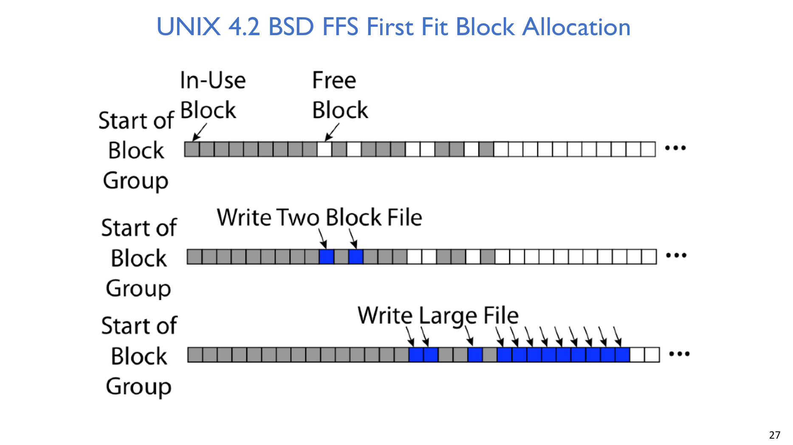

The result is a useful pattern: small holes near the front of a block group can be filled by small writes, while large sequential runs near the end remain available for larger files. This helps avoid fragmentation and supports sequential layout for big files.

FFS also reserves about 10 percent of disk space. This is not wasted space; it is slack space that gives the allocator room to choose good placements instead of being forced into tiny scattered holes.

:::remark Question: Why does reserving 10 percent free space improve performance?
When a disk is almost completely full, the allocator has little freedom. New blocks must be placed wherever isolated free slots remain, which increases fragmentation and seek distance. Keeping free space in each block group lets the allocator preserve contiguous runs, keep related metadata and data nearby, and avoid performance collapse.
:::

## 15. Rotational Delay, Read-Ahead, and Buffering
A disk head may read one block, spend time processing it, and then ask for the next block after the disk has already rotated past it. Without help, sequential reading can degrade to one full revolution per block.

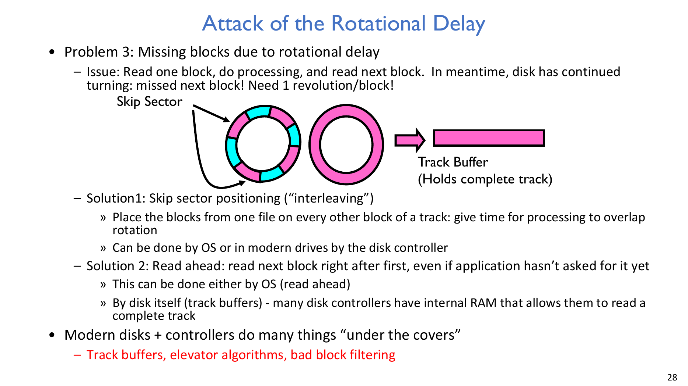

Two classic solutions are:

- **Skip-sector positioning** places consecutive file blocks with gaps between them. The gap gives the system time to process one block before the next desired block arrives under the head.
- **Read ahead** reads the next block immediately after the current block, before the application explicitly asks for it.

Modern disks and controllers often hide these mechanisms under the covers. They may use track buffers, internal RAM that captures a complete track, elevator scheduling, and bad-block filtering. At the file-system level, the same principle appears as buffering and prefetching: if sequential access is likely, read nearby data early so later requests hit memory instead of the disk.

:::remark Question: Why does read-ahead help only when the prediction is right?
Read-ahead is beneficial when the next request really is for nearby sequential data. Then the later read can be served from a buffer. If the workload is random, read-ahead may waste bandwidth and cache space by fetching blocks that will not be used.
:::

## 16. FFS Pros and Cons
FFS improves both performance and reliability, but it still has tradeoffs.

| Aspect | Evaluation |
|---|---|
| Small and large files | It supports both efficiently through the inode's direct and indirect pointers. |
| Locality for small files | Directories, inodes, and data can often stay in the same block group. |
| Locality for large files | The allocator tries to preserve contiguous runs. |
| Metadata and data locality | Inodes are distributed near the data they describe. |
| Defragmentation | It usually does not require regular defragmentation if enough free space remains. |
| Tiny files | A 1-byte file may still require an inode and a data block, so it is inefficient. |
| Mostly contiguous files | A multi-level indexed encoding may be more metadata-heavy than an extent list. |
| Free-space requirement | It needs about 10 to 20 percent free space to prevent fragmentation. |

:::remark Question: Why can a 1-byte file be inefficient in FFS?
The file has tiny content but still consumes metadata and at least one allocatable data region. The data structure is optimized for general files, not for packing many tiny byte strings directly inside the file header. NTFS takes a different approach for tiny files by allowing resident data in the MFT record.
:::

## 17. Hard Links
A **hard link** is a mapping from a name to a file number in a directory.

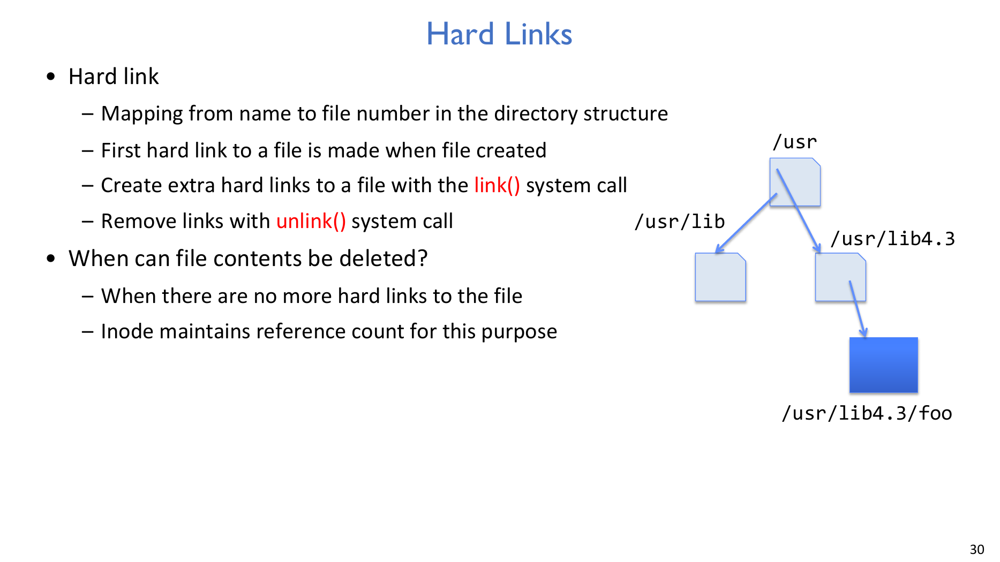

The first hard link is created when the file is created. Additional hard links can be created with `link()`, and hard links are removed with `unlink()`. File contents can be deleted when there are no more hard links to the file. The inode maintains a reference count so the system knows how many directory entries still name the file.

:::remark Question: If two names hard-link to the same inode, which one is the "real" file?
Neither name is more real than the other. The inode is the file object; directory entries are names pointing to it. Removing one name only removes that directory entry. The underlying file remains reachable as long as at least one hard link still points to the inode.
:::

## 18. Symbolic Links
A **soft link**, also called a **symbolic link** or **shortcut**, maps one name to another name.

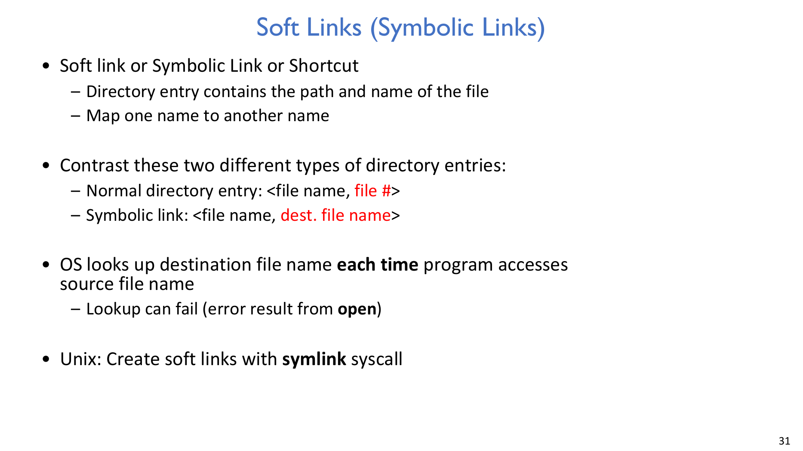

A normal directory entry has the form `<file name, file #>`. A symbolic link instead has the form `<file name, dest. file name>`. The operating system looks up the destination name each time a program accesses the source name. Therefore a symbolic link can fail if the destination name has been removed, renamed, or made unreachable.

:::remark Question: Why can symbolic links cross boundaries that hard links often cannot?
A hard link points directly to an inode or file number, so it is tied to the file-number namespace of a file system. A symbolic link stores a path string, so it can name a target elsewhere. The tradeoff is that the target path is resolved later and may fail.
:::

## 19. Pathname Traversal
Opening `/home/pkuos/stuff.txt` is a sequence of directory lookups. The root inumber is configured in the kernel, for example inumber 2.

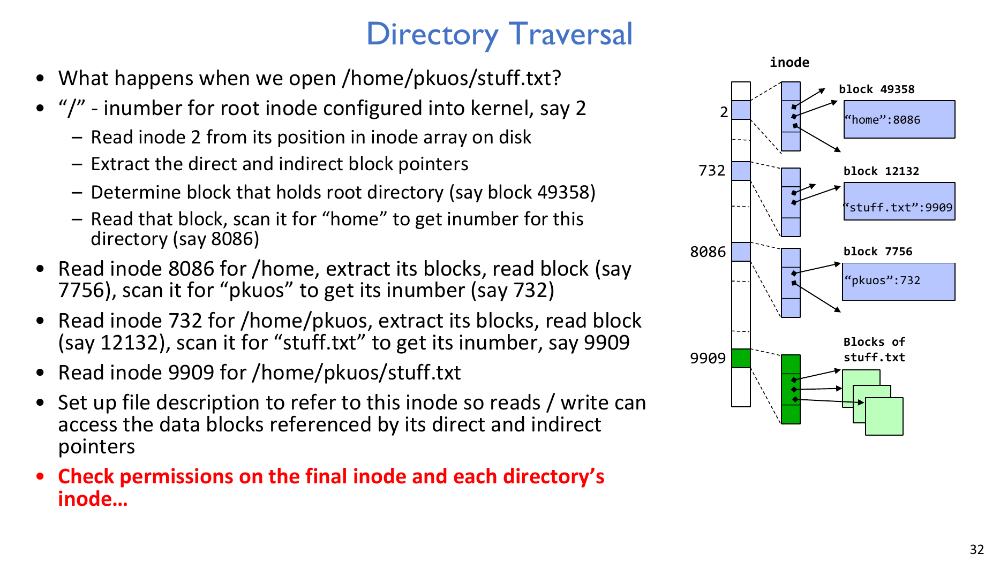

The traversal proceeds as follows:

1. Read inode 2 from the inode array.
2. Extract direct and indirect pointers from inode 2.
3. Determine that the root directory data is in block 49358.
4. Read block 49358 and scan for `home`, obtaining inumber 8086.
5. Read inode 8086 for `/home`.
6. Read its directory block 7756 and scan for `pkuos`, obtaining inumber 732.
7. Read inode 732 for `/home/pkuos`.
8. Read its directory block 12132 and scan for `stuff.txt`, obtaining inumber 9909.
9. Read inode 9909.
10. Set up a file description that refers to inode 9909, so later reads and writes can use the inode's block pointers.

Permissions must be checked on the final inode and on each directory inode along the path. A user needs permission to traverse the directories before the final file access can succeed.

:::remark Question: Why are permissions checked on directories as well as on the final file?
Path traversal itself is an operation. Even if a user has read permission on the final file, the system must also decide whether the user may pass through `/`, `/home`, and `/home/pkuos` to reach it. Directory execute permission is the usual Unix permission for traversal.
:::

## 20. Large Directories and B-Trees
Early file systems represented directories as a list or array of `<file_name, inode>` entries. That representation is simple, but linear search becomes expensive when directories grow large. A lookup may require reading much of the directory before the target name is found.

Modern Unix-family systems such as FreeBSD, NetBSD, and OpenBSD use indexed directory structures such as B-Trees or directory hashes. A B-Tree stores sorted keys in internal nodes and uses those keys to choose child subtrees. A B+Tree stores search keys in internal nodes and keeps entries in leaves.

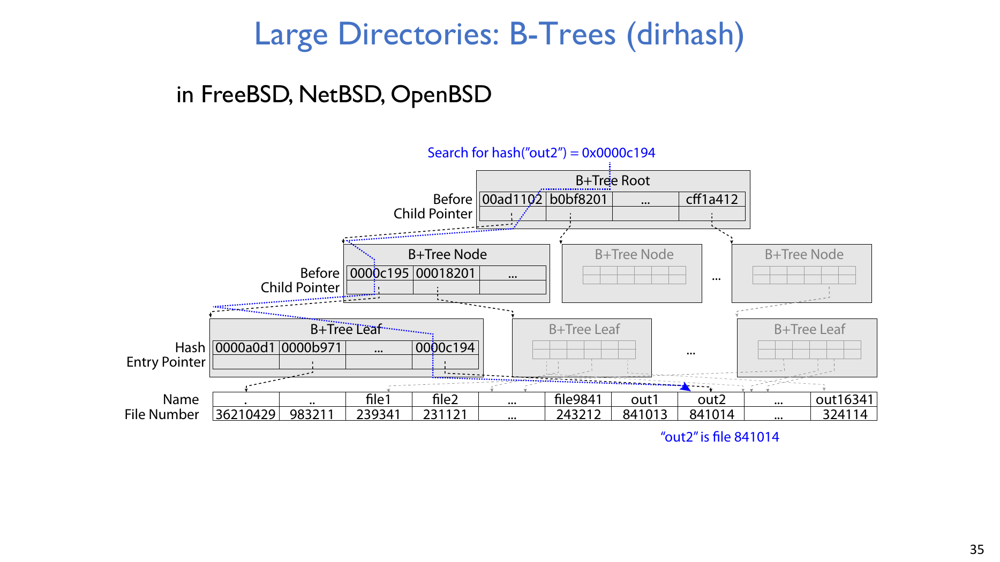

In the illustrated lookup, the system searches for:

$$
hash("out2") = 0x0000c194
$$

The root contains separator keys. Since `0x0000c194` is smaller than the first shown root separator `0x00ad1102`, the search follows the left child. The next internal node contains a separator `0x0000c195`; since `0x0000c194` is just smaller than that separator, the search follows the corresponding child into a leaf. The leaf contains the key `0x0000c194`, which maps the name `out2` to file number `841014`.

:::remark Question: What changes when a directory uses a B+Tree instead of a linear list?
A linear list asks "is this entry the one I want?" again and again. A B+Tree asks "which range can contain my key?" and discards most of the directory at each level. Lookup becomes logarithmic in the number of entries rather than linear, and disk I/O is concentrated on a small path through the tree.
:::

## 21. Case Study: Windows NTFS
NTFS is the default file system for modern Windows. It uses variable-length extents rather than fixed block-pointer chains, and it centers metadata around the **Master File Table (MFT)**.

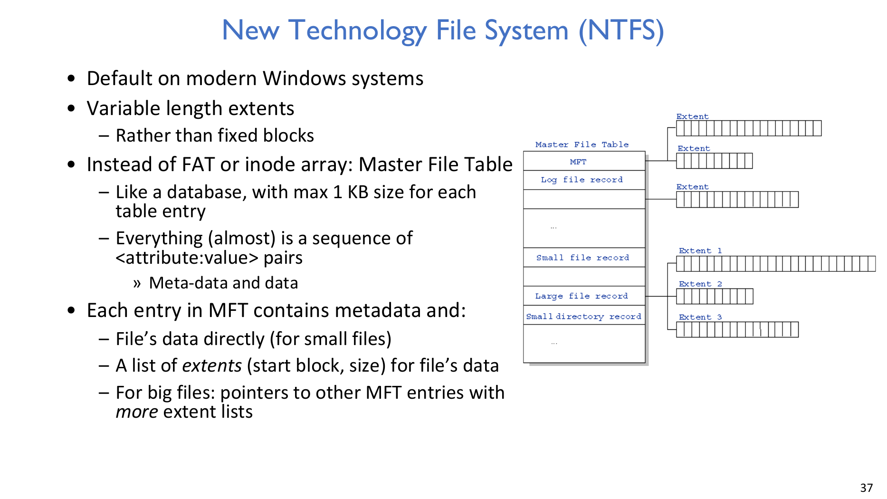

Instead of a FAT or a traditional inode array, NTFS treats the MFT like a database. Each MFT entry is at most about 1 KB. Almost everything is represented as a sequence of `<attribute : value>` pairs, including metadata and data.

An MFT entry may contain:

- metadata such as standard information and file name attributes;
- file data directly, for small files;
- a list of extents `(start block, size)` for nonresident data;
- pointers to other MFT entries when a large or fragmented file needs more extent lists.

## 22. NTFS Resident Data and Extents
For a small file, the data can be **resident** inside the MFT record.

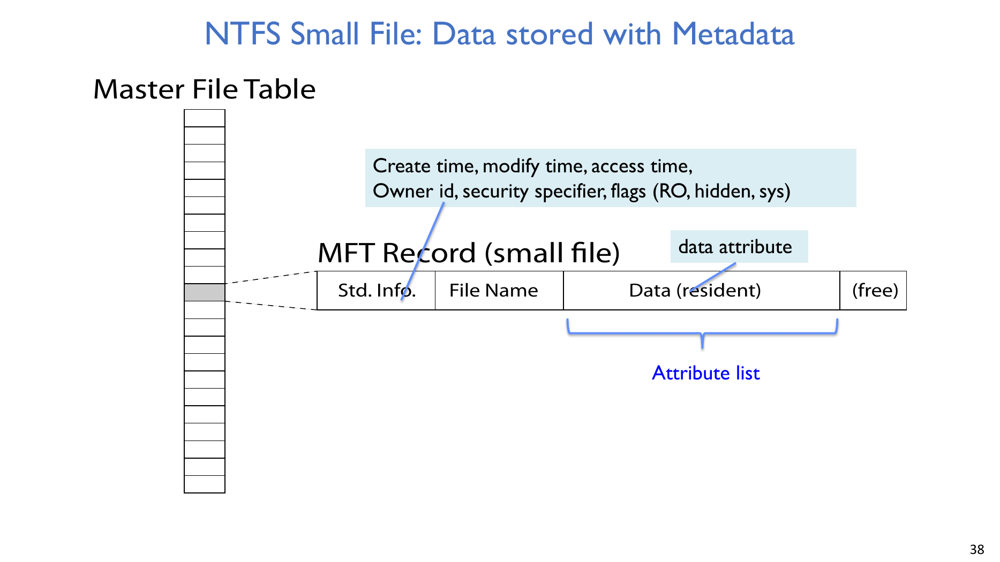

The MFT record contains attributes such as standard information, file name, and a resident data attribute. Standard information includes times such as create, modify, and access time, plus owner ID, security specifier, and flags such as read-only, hidden, or system.

For a medium file, the data is **nonresident**. The MFT record stores extent descriptors such as start and length, and the bytes live in data extents elsewhere on disk.

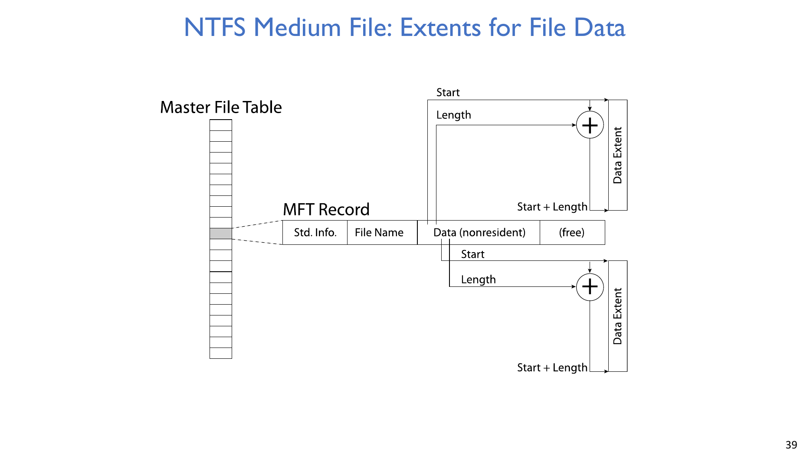

An extent says "a contiguous run starts here and has this length." This is compact when a file is mostly contiguous. One extent can describe many blocks without one pointer per block.

:::remark Question: Why are extents efficient for mostly contiguous files?
If a file occupies a long contiguous region, a block-pointer design needs many pointers, while an extent design needs only a start block and a length. The metadata cost is proportional to the number of runs, not the number of blocks.
:::

## 23. NTFS Large and Fragmented Files
When a file becomes large or heavily fragmented, one MFT entry may not have enough space for all extent descriptors. NTFS then uses attribute lists and additional MFT records.

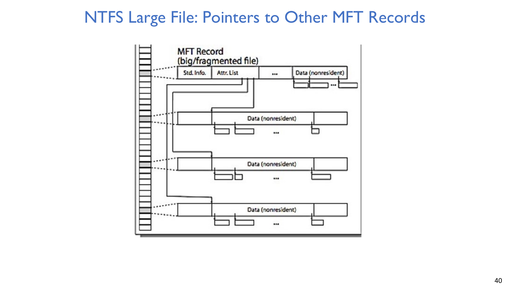

For a huge fragmented file, the main MFT record can point to other MFT records, and those records can hold more nonresident data attributes and extent lists.

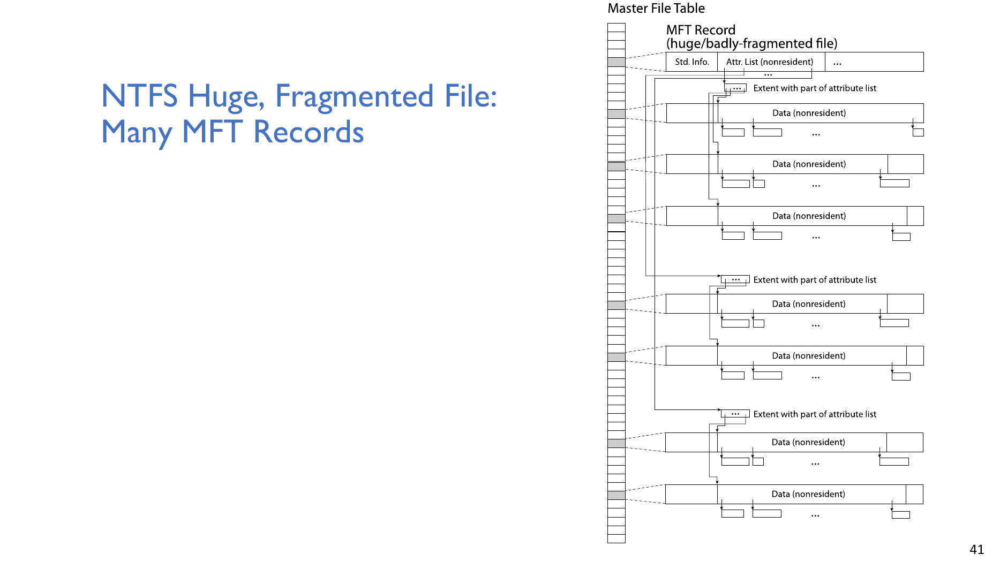

This design gives NTFS a flexible growth path. Tiny files can be stored directly in the metadata record, mostly contiguous files can be described compactly with extents, and fragmented files can spill metadata into additional records.

:::remark Question: What is the tradeoff of NTFS's flexible attribute design?
The flexible design is space-efficient for tiny and contiguous files, but lookup can become more complex for huge fragmented files. The system may have to follow an attribute list through multiple MFT records before it has the complete map from logical file offsets to physical extents.
:::

## 24. NTFS Directories and Hard Links
NTFS directories are implemented as B-Trees.

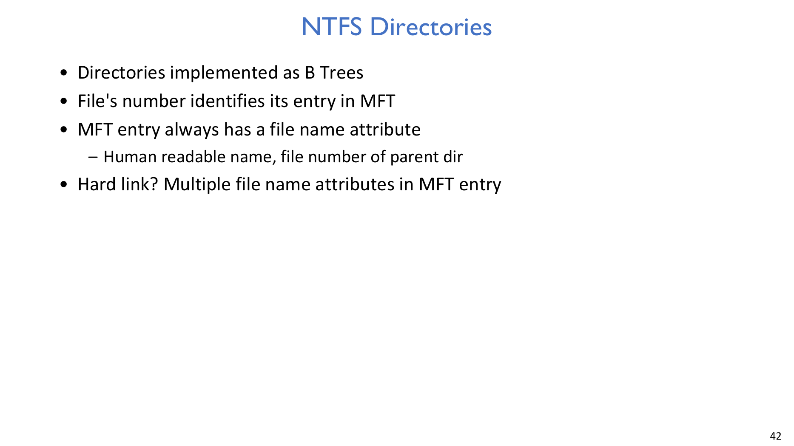

A file's number identifies its MFT entry. The MFT entry always has a file name attribute, which stores a human-readable name and the file number of the parent directory. A hard link can be represented by multiple file name attributes in the same MFT entry.

:::remark Question: How does this differ from a Unix directory entry?
Unix emphasizes directory entries that map names to inumbers, while the inode stores file metadata. NTFS stores file-name attributes inside the MFT entry itself, including parent-directory information. Both systems can support multiple names for one file, but they encode the naming relationship differently.
:::

## 25. Design Comparison
The major case studies show three different ways to turn blocks into files:

| Design | How it finds data | Best fit | Main cost |
|---|---|---|---|
| FAT | A file number indexes the root of a linked list in the File Allocation Table. | Simple media, portable formats, small systems. | Random access and fragmentation are weak. |
| Unix inode | An inumber indexes an inode with direct and multi-level indirect pointers. | Small and large files with stable metadata. | Mostly contiguous files may still need many pointer structures. |
| Berkeley FFS | It keeps inode indexing but changes physical layout using block groups and allocation policies. | Locality, reliability, and sequential performance on disks. | It depends on keeping enough free space. |
| NTFS | An MFT record stores attributes, resident data, extents, and links to more records. | Tiny files, contiguous extents, and flexible metadata. | Heavily fragmented files can require complex metadata traversal. |

The common file-system themes are:

- A file system transforms blocks into files and directories.
- It optimizes for file size distributions, access patterns, and usage patterns.
- It tries to maximize sequential access while still supporting efficient random access.
- It exposes operating-system protection and security policies, such as UGO permissions or ACL-style security descriptors.
- Naming translates user-visible names into system resources.
- Directories, linked structures, trees, and extent lists are all ways to manage this translation.

## Exam Review
You should be able to explain the following points without looking back:

1. **Queueing still matters for file systems.** Higher service time and higher utilization increase queueing delay, especially as `u` approaches 1.
2. **FAT stores file layout as a linked list in the File Allocation Table.** Sequential traversal is simple, but random access to block `k` requires following links.
3. **FAT directories are linear lists of name-to-file-number entries.** This is simple but slow for large directories.
4. **Unix inodes store metadata and block pointers with the file object.** Directory entries name inodes, which makes hard links natural.
5. **Direct, indirect, double-indirect, and triple-indirect pointers form an asymmetric tree.** Small files stay cheap, while large files remain addressable.
6. **In the 1 KB block index example, block 5 needs one access, block 23 needs two, and block 340 needs three after the file header is already in memory.**
7. **FFS improves layout through block groups, bitmap allocation, contiguous placement, reserved free space, and rotational-delay handling.**
8. **Hard links map names to the same file number; symbolic links map one name to another name.** Hard links share the file object, while symbolic links can dangle.
9. **Pathname traversal repeatedly reads directory inodes and directory data blocks.** The system checks permissions along the whole path.
10. **Large directories need indexes such as B-Trees or B+Trees.** They avoid scanning every directory entry.
11. **NTFS centers the file system around the MFT.** Small data can be resident in the MFT record, larger data is described by extents, and fragmented metadata can spill into additional MFT records.
12. **The design tension is always the same: simple metadata, fast sequential access, efficient random access, low fragmentation, reliable recovery, and compact representation cannot all be maximized at once.**
