# Lec22 - 文件系统 3：缓冲、可靠性与事务

## 学习目标
学完本讲之后，你应该能够解释 memory-mapped files 如何把虚拟内存系统和文件系统连接起来，buffer cache 如何改变 open/read/write/eviction 的行为，为什么 delayed writes 能提升性能但会带来崩溃恢复风险，以及为什么文件系统需要 durability、reliability 和类似事务的 all-or-nothing 更新语义。你还应该能够比较 RAID 1、RAID 5、RAID 6、erasure coding、地理复制、careful ordering with recovery 和 copy-on-write。

## 1. 文件布局背景
文件系统已经有多种方式把文件名或文件号映射到数据块：

- FAT 使用 File Allocation Table。文件号索引块链表的根节点，逻辑块查找沿链表前进。
- Unix 风格 inode 保存元数据和多级指针树，包括 direct、indirect、double-indirect 和 triple-indirect pointer。
- Berkeley FFS 保留 inode 索引，但通过 block group 把 inode、数据块、元数据和空闲空间分散放置，从而改善局部性。
- NTFS 使用 Master File Table、attribute-value record、小文件 resident data，以及大文件 variable-length extent。

这些布局决定持久数据放在哪里。Lec22 关注这些数据结构被使用时，内存与存储之间会发生什么：文件内容可以映射进虚拟地址空间，磁盘块可以缓存在内存中，写入可以被延迟，崩溃也可能在更新执行到一半时发生。

:::remark 问题：为什么文件系统笔记需要讨论内存管理概念？
文件和虚拟内存并不是两个完全分离的世界。`exec` 会把可执行文件内容映射进进程地址空间。`mmap()` 会把普通文件映射进虚拟内存。buffer cache 会把文件系统块保存在内存里。一旦文件数据经过内存，page fault、replacement、dirty bit 和 writeback policy 都会成为文件系统行为的一部分。
:::

## 2. Memory-Mapped Files
传统文件 I/O 在进程 buffer 和文件区域之间显式传输数据。程序调用 `read()` 或 `write()`，内核在用户内存和内核 buffer 之间复制数据，文件系统最终再把磁盘块移入或移出存储。这个过程涉及系统调用和多次内存拷贝。

Memory-mapped files 改变了接口。内核不再要求程序显式把字节复制到 buffer，而是把文件直接映射到进程地址空间中的一个空闲区域。读取这个地址会隐式把文件内容 page in。写入这个地址会先修改内存，之后再把修改过的内容最终 page out。

进程执行时的 executable files 也使用同样思想。可执行文件的代码和数据区域由文件内容 backing，系统可以按需加载页面，而不必一开始读入整个可执行文件。

:::remark 问题：一个虚拟内存区域 “backed by a file” 是什么意思？
这表示这个 page table 区域有一个持久的来源和目的地。如果该区域中的某一页缺失，page-fault handler 可以从对应文件偏移处填充它。如果该区域中的某一页被修改，系统可以根据映射标志和同步策略，最终把 dirty 内容写回文件。
:::

## 3. 用 Paging 实现 `mmap()`
普通 demand paging 的 page fault 会从磁盘加载缺失页，并更新 page-table entry，使原指令可以重试。file-backed mapping 使用同一套机制，只是 backing object 是文件，而不是匿名 swap space。

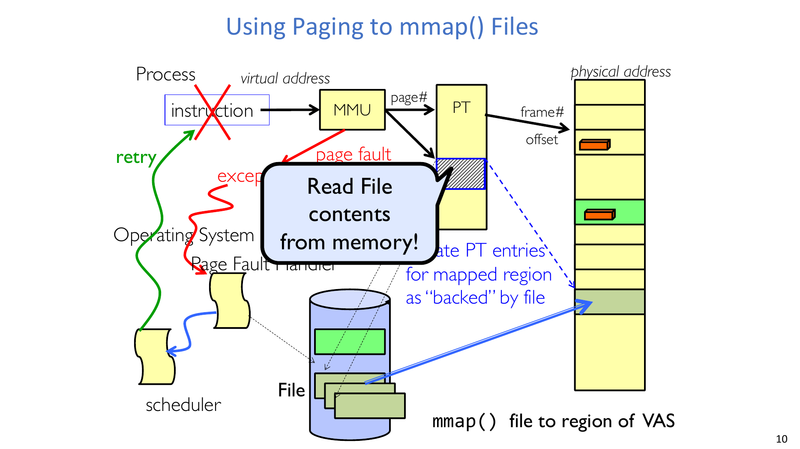

流程如下：

1. 进程访问 mapped file region 中的某个虚拟地址。
2. MMU 查询 page table，发现该页不在内存中。
3. 这次访问触发 page fault。
4. page-fault handler 识别出这个虚拟页由文件 backing。
5. 内核把对应文件内容读入内存。
6. 内核为 mapped region 创建或更新 page-table entry。
7. 原指令重试，现在可以从内存中读取文件内容。

关键变化是，文件访问变成了隐式的。一次 load 指令可以通过 page-fault 路径触发文件 I/O。

:::remark 问题：这为什么不只是伪装成缺页异常的普通 `read()`？
两条路径最终可能读取同一个磁盘块，但控制流不同。使用 `read()` 时，程序显式请求字节，内核把字节复制进用户 buffer。使用 `mmap()` 时，程序读取一个地址；如果页面缺失，page fault 会带入文件内容，程序随后像访问普通内存一样继续执行。
:::

## 4. `mmap()` 系统调用
系统调用接口是：

```c
void *mmap(void *addr, size_t len, int prot, int flags, int fd, off_t offset);
```

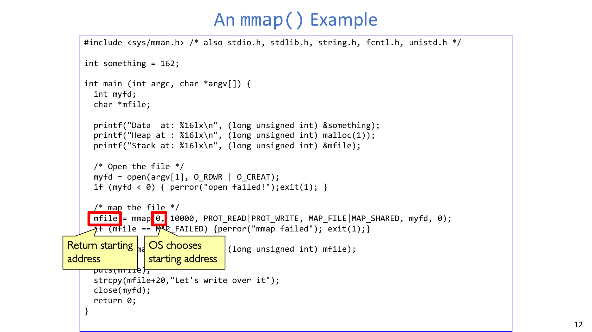

映射可以请求某个特定虚拟地址区域，也可以让系统自动寻找一个区域。让 OS 选择很常见，因为应用程序很难知道自己的虚拟地址空间里哪些位置是空洞。

这个调用既可以用于操作文件，也可以用于进程间共享：

- `addr` 选择起始虚拟地址，或者用 `0` 请求 OS 自动选择。
- `len` 是映射长度。
- `prot` 控制权限，例如 `PROT_READ` 和 `PROT_WRITE`。
- `flags` 描述映射行为，例如 `MAP_FILE` 和 `MAP_SHARED`。
- `fd` 标识已经打开的文件。
- `offset` 选择从文件中的哪个偏移开始映射。

:::remark 问题：`mmap(0, 10000, PROT_READ|PROT_WRITE, MAP_FILE|MAP_SHARED, myfd, 0)` 的含义是什么？
第一个 `0` 表示让 OS 选择起始虚拟地址。映射长度是 10,000 字节。这个区域可读可写。它由文件 backing，并且是 shared mapping，因此对映射区域的写入会通过文件体现出来，而不是仅对当前进程私有。`myfd` 标识文件，最后一个 `0` 表示从文件偏移 0 开始映射。
:::

## 5. `mmap()` 例子：场景、步骤与结果
示例程序打开 `argv[1]` 指定的文件，从文件开头映射 10,000 字节，打印若干内存区域地址，用 `puts(mfile)` 打印映射文件内容，然后执行：

```c
strcpy(mfile + 20, "Let's write over it");
```

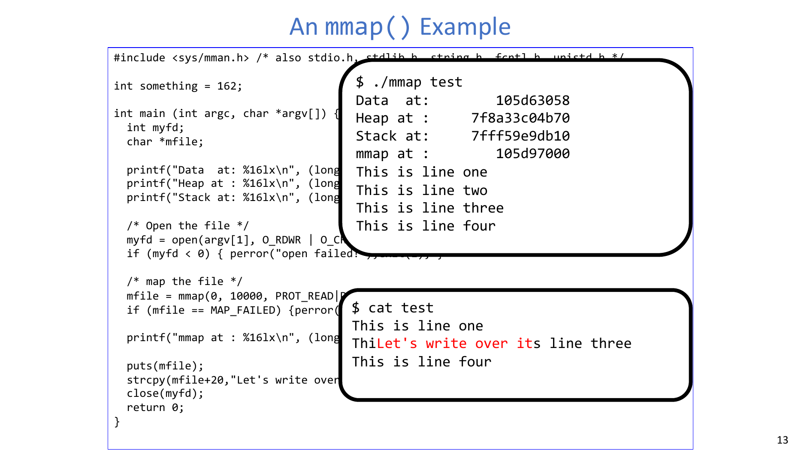

例子开始时，文件内容是：

```text
This is line one
This is line two
This is line three
This is line four
```

程序输出显示了代表性地址：

- data segment：`105d63058`；
- heap：`7f8a33c04b70`；
- stack：`7fff59e9db10`；
- mapped file region：`105d97000`。

映射区域从程序视角看是普通虚拟地址范围，但它由文件 backing。当程序写入 `mfile + 20` 时，它从文件映射的第 20 个字节开始覆盖内容。程序退出后，`cat test` 显示文件内容已经改变：

```text
This is line one
ThiLet's write over its line three
This is line four
```

这个结果展示了核心机制：一次内存写入可以变成文件修改，因为这个虚拟页是 file-backed 且 shared 的。

:::remark 问题：为什么写入 `mfile + 20` 会改变文件，而不是只改变一个私有 buffer？
这个映射使用 `MAP_SHARED`，所以映射内存是文件的共享视图。写入会修改该文件区域对应的缓存页。修改后的页面不一定立即到达磁盘，但它属于文件的共享状态，并且最终可以被写回。
:::

## 6. 通过 Mapped Files 共享
两个进程可以把同一个文件映射进各自的虚拟地址空间。

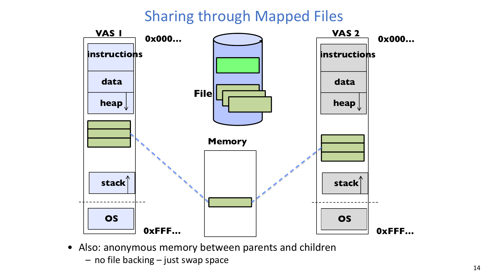

每个进程都有自己的 VAS 布局，包括 instructions、data、heap、stack 和 OS region。mapped file pages 在不同进程中可以出现在不同虚拟地址，但两个映射可以指向同一个物理内存页和同一份文件内容。这是一种自然的进程间共享方式。

父子进程之间还可以共享 anonymous memory。这种情况下没有 file backing，backing storage 是 swap space。

:::remark 问题：两个进程映射同一个文件时，必须使用同一个虚拟地址吗？
不需要。虚拟地址是每个进程自己的名字。进程 A 可以把文件映射到一个虚拟地址，进程 B 可以映射到另一个地址。共享之所以成立，是因为两个虚拟映射可以指向同一个物理页或同一个 file-backed object。
:::

## 7. Buffer Cache：核心思想
内核必须先把磁盘块复制到主存，才能检查或修改这些块。这些块可能是文件数据、inode、目录内容、free-space map 或其他元数据。

关键定义是：

**Buffer Cache: Memory used to cache kernel resources, including disk blocks and name translations（Buffer Cache：用于缓存内核资源的内存，包括磁盘块和名字转换）**。

buffer cache 通过缓存以下内容利用局部性：

- name translations，例如 path-to-inode 映射；
- disk blocks，例如 block-address-to-disk-content 映射；
- metadata blocks，例如 inodes、directory blocks 和 free bitmaps。

buffer cache 可以包含 **dirty** blocks，也就是在内存中已经被修改、但尚未写回磁盘的块。

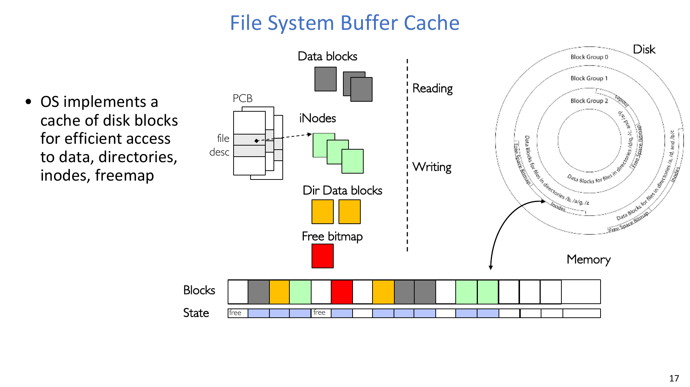

:::remark 问题：为什么 buffer cache 由 OS 软件实现，而不是硬件实现？
OS 理解文件系统块的身份、元数据用途、名字转换、打开文件和写回策略。硬件 cache 和 TLB 缓存的是低层地址，但它们不知道某个块是 inode、目录块、free bitmap，还是必须小心写回的 dirty file block。
:::

## 8. `open()` 过程中的 Buffer Cache
打开文件首先从目录查找开始。

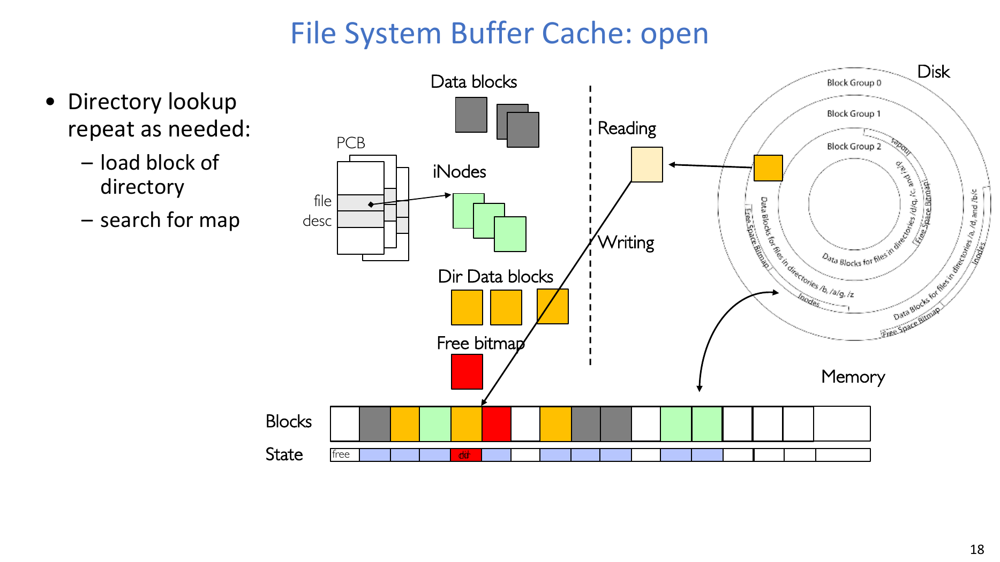

目录查找会按需重复：

1. 把目录块从磁盘加载到 buffer cache。
2. 在目录块中搜索 name-to-inumber 映射。
3. 如果路径还有更多组件，就用 inumber 找到下一级目录 inode。
4. 重复直到找到最终文件。

buffer-cache 状态会变化，因为内存中原本空闲的块会变成 cached directory block。如果所需目录块尚未缓存，它会在磁盘 I/O 进行时进入 transient 的 **being read** 状态。

查找成功后，内核通过 open file descriptor 建立引用。

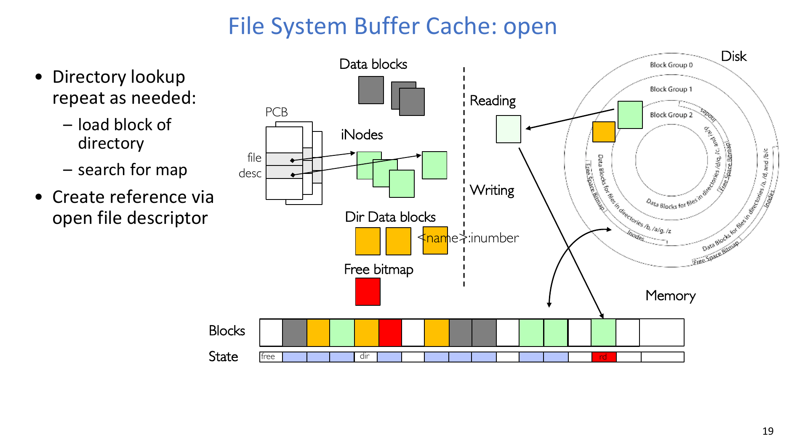

open file descriptor 指向内核状态，并最终指向 inode。目录块中包含类似 `<name>:inumber` 的条目，inode 也会被缓存。

:::remark 问题：为什么重复 `open()` 会变快？
如果目录块、名字转换和 inode 保留在 buffer cache 中，后续 `open()` 就可以避免磁盘读取。内核可以复用缓存的目录内容和 inode block，而不是再次从存储设备加载相同元数据。
:::

## 9. `read()` 过程中的 Buffer Cache
一次 read 从 file descriptor 和 inode 开始。

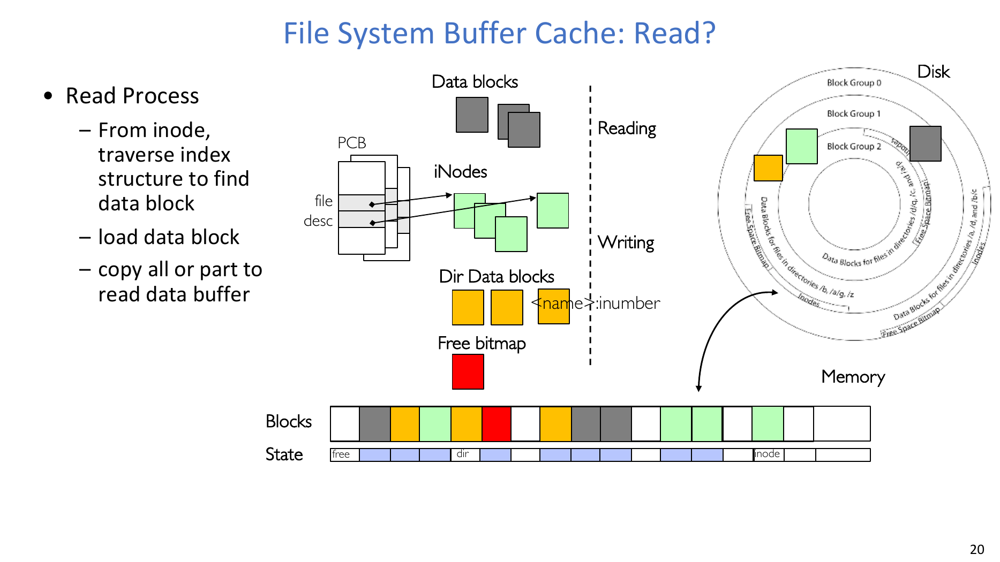

读取过程是：

1. 使用 inode 遍历文件索引结构。
2. 找到包含目标文件偏移的数据块。
3. 如果数据块不在缓存中，就加载到 buffer cache。
4. 把缓存块的全部或部分内容复制到用户的 read buffer。

如果数据块已经缓存，就可以避免磁盘读取。如果请求只涉及块的一部分，内核仍然缓存完整磁盘块，但只把请求的字节范围复制到用户空间。

## 10. `write()` 过程中的 Buffer Cache
一次 write 与 read 类似，但它可能必须分配新块并更新元数据。

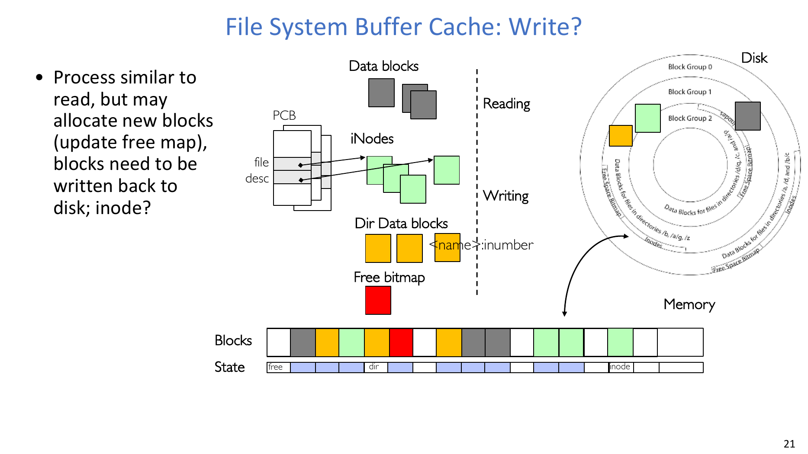

一次写入可能需要：

- 加载相关的已有数据块；
- 如果文件增长，分配新的数据块；
- 更新 free map 或 free bitmap；
- 更新 inode，使它指向新块；
- 最终把 dirty blocks 写回磁盘。

“blocks need to be written back to disk; inode?” 这个问题很重要，因为文件数据和元数据必须相互一致。如果新数据块已经写入，但 inode 没有更新，那么数据不可达。如果 inode 在数据块正确初始化之前就指向该块，崩溃后可能暴露垃圾数据或其他文件遗留的旧数据。

:::remark 问题：为什么写一个文件经常会修改多个磁盘块？
一次逻辑写入可能改变文件数据、inode、indirect block、free bitmap 和 directory entry。用户以为自己只是“写入这些字节”，但文件系统可能需要多个物理块更新，才能让持久结构保持一致。
:::

## 11. Buffer Cache Eviction 与过渡状态
当 buffer cache 被填满时，OS 必须选择要驱逐的块。clean blocks 可以直接丢弃，因为磁盘上已经有相同内容。dirty blocks 必须写回。

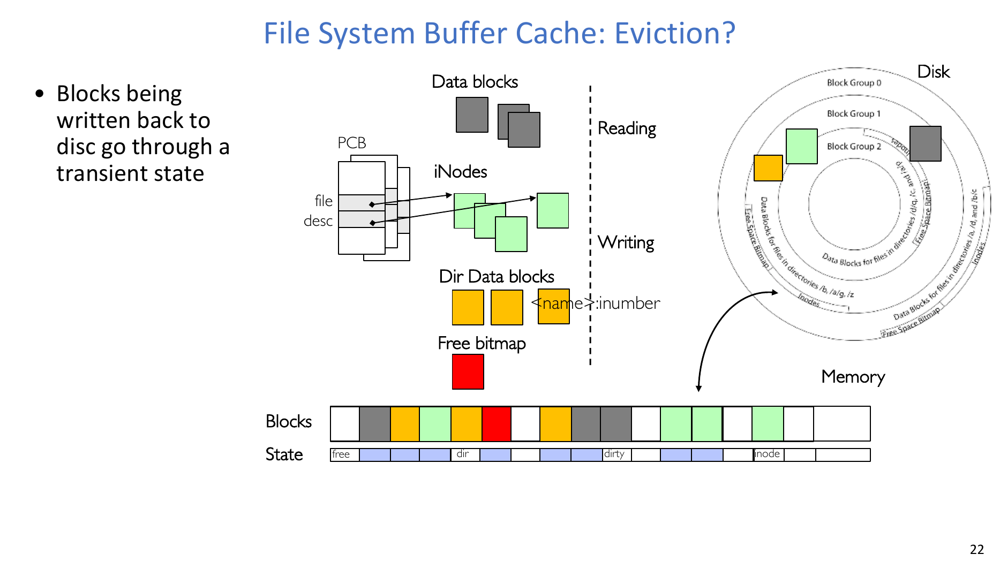

正在写回磁盘的块会经过一个 transient state。在这段时间里，这个块既不是简单的 free，也不是已经稳定落盘的块；它正在内存和存储之间移动。OS 必须追踪这个状态，避免另一个操作错误复用这个 buffer，或者错误地假设磁盘已经完成更新。

buffer-cache blocks 因此会在多种状态间变化：

- free；
- being read from disk；
- 作为 directory block、inode block、data block 或 free-map block 被使用；
- dirty；
- being written to disk。

## 12. Buffer Cache Replacement
buffer cache 完全由 OS 软件实现。块会在 free 和 in-use 之间经历 transitional states，并且承担很多用途：inodes、directory data、file data 和 free-space maps。OS 会维护指向这些缓存块的指针，所以 replacement 必须尊重仍在使用的对象。

自然的替换策略是 LRU。与硬件 cache 或 TLB 不同，buffer cache 通常能承担完整 LRU 实现的开销。

| 策略问题 | 收益 | 代价或失败模式 |
|---|---|---|
| buffer cache 使用 LRU | 当内存足以容纳文件 working set 时效果很好。 | 大型顺序扫描会用只访问一次的数据冲掉有用缓存。 |
| "Use Once" hint | 允许文件系统在块被使用后立刻丢弃。 | 需要应用程序或 OS 准确识别 streaming access。 |
| 动态 cache sizing | 在文件缓存和虚拟内存分页之间平衡内存。 | 边界设置不好会让应用程序缺内存，或让文件缓存失效。 |

:::remark 问题：为什么 LRU 在顺序扫描时可能表现很差？
顺序扫描会一次性触碰大量块。LRU 会把最近访问的块当成有价值的数据，因此扫描可能把较老但真正会复用的块挤出去。扫描结束后，cache 里可能充满不会再被使用的数据。
:::

## 13. Buffer Cache Size
OS 必须决定多少内存属于 buffer cache，多少内存留给 virtual memory。

给文件系统 cache 太多内存，会导致可运行应用减少，或者 virtual-memory system 频繁 paging。给文件系统 cache 太少内存，会导致许多文件访问 miss cache，应用程序因为磁盘缓存无效而变慢。

实际解决方案是动态调整边界，使 paging 和 file access 的磁盘访问率保持平衡。

:::remark 问题：buffer cache 和 virtual memory 之间的“平衡”是什么意思？
如果 paging traffic 很高，说明应用程序需要更多内存。如果 file-cache miss traffic 很高，说明 buffer cache 需要更多内存。动态边界会尝试把内存放在最能减少磁盘 I/O 的地方，而不是永久固定二者比例。
:::

## 14. File-System Prefetching
**Read Ahead Prefetching: fetch sequential blocks early（读前预取：提前取出顺序块）**。

核心思想是利用常见文件访问通常具有顺序性。如果一个进程读取块 `i`，系统可能在进程请求之前预取块 `i+1`、`i+2` 等。磁盘 elevator algorithm 可以高效交错来自多个并发应用的 prefetch 请求。

预取多少是一个权衡：

- 预取太多会延迟其他应用的请求，并浪费 cache 空间。
- 预取太少会在并发文件请求之间造成许多 seek 和 rotational delay。

:::remark 问题：系统应该如何决定预取多少？
系统应该把预取看作预测问题。顺序流适合更大的 read-ahead window，随机访问适合很少甚至不预取。许多系统会自适应窗口：当顺序预测正确时增大窗口，当预取块没有被使用时缩小窗口。
:::

## 15. Delayed Writes
**Buffer cache is a writeback cache (writes are termed "Delayed Writes")（buffer cache 是 writeback cache，写入被称为 delayed writes）**。

当程序调用 `write()` 时，内核把数据从用户空间复制到内核 buffer cache，并且可以很快返回用户空间。之后的 `read()` 由 cache 满足，因此即使数据还没有到达磁盘，read 也能看到 write 的结果。

一次 write syscall 的数据最终到达磁盘的时机包括：

- buffer cache 已满，OS 需要 evict 某些块；
- buffer cache 周期性 flush，以减少崩溃时的数据损失窗口。

Delayed writes 能提升性能，因为程序不必为每次写入等待磁盘 I/O。它还给磁盘调度器更多请求可重排，并且允许 delayed block allocation，使多个块可以一起分配并尽量保持连续。有些短命文件甚至完全不需要真正到达磁盘。

:::remark 问题：为什么 delayed writes 可以改善文件布局？
如果每次只立即分配一个块，分配器可能不知道文件最终会增长多大。如果推迟分配，系统可能观察到同一个增长中文件有多个 dirty blocks，于是可以把它们一起分配成连续区间。
:::

## 16. Buffer Caching 与 Demand Paging 对比
Buffer caching 和 demand paging 都是在内存中缓存 disk-backed data，但目标和策略不同。

| 方面 | Demand paging | Buffer cache |
|---|---|---|
| 主要对象 | Virtual-memory pages。 | File-system blocks、metadata blocks 和 name translations。 |
| Replacement | 完整 LRU 通常不可行，因此使用 Clock 等近似。 | LRU 通常可以接受，因为 OS 有更多软件控制。 |
| Eviction timing | 内存接近满时驱逐 not-recently-used pages。 | 即使 dirty blocks 最近被使用，也会周期性写回。 |
| 周期性写回原因 | 不是核心策略。 | 为了在崩溃时尽量减少数据损失。 |

:::remark 问题：为什么 dirty buffer-cache block 即使最近使用过，也要写回？
recency 对性能有用，但持久数据还有风险窗口。最近使用的 dirty block 可能包含重要元数据或文件内容。周期性写回会减少机器崩溃时可能丢失或处于不一致状态的数据量。
:::

## 17. Persistent State 与 Dirty Metadata
Delayed writes 并不万无一失。系统仍然可能在 dirty blocks 留在内存中时崩溃。例如 Linux 会周期性 flush dirty data，但崩溃可能发生在下一次 flush 之前。

危险情况是 dirty metadata。如果 dirty block 是目录块，而机器在它到达磁盘之前崩溃，系统可能丢失从文件名到文件 inode 的指针。inode 或数据块可能仍然存在，但目录不再指向它们。这会泄漏空间，并让文件系统处于不一致状态。

直接结论是：**File systems need recovery mechanisms（文件系统需要恢复机制）**。

:::remark 问题：如果 dirty block 是目录块，会发生什么？
如果目录更新丢失，文件名可能不再指向 inode。文件的数据块可能已经被分配，inode 也可能存在，但没有目录项能够到达它。这就是 space leak 和 consistency problem：文件系统中存在已分配但无法通过命名空间到达的状态。
:::

## 18. Availability、Durability 与 Reliability
三个相关术语很重要：

- **Availability: the probability that the system can accept and process requests（可用性：系统能够接受并处理请求的概率）**。Availability 常用 “nines” 衡量，例如 99.9% 是 3-nines availability。关键思想是 failures 的独立性。
- **Durability: the ability of a system to recover data despite faults（持久性：系统在故障后仍能恢复数据的能力）**。这是应用在数据上的 fault tolerance。Durability 不一定意味着 availability：磁盘中的数据可能仍然 durable，但机器宕机时无法访问。
- **Reliability: the ability of a system or component to perform its required functions under stated conditions for a specified period of time（可靠性：系统或组件在给定条件和给定时间内执行所需功能的能力）**。Reliability 通常强于简单 availability，因为系统不仅要 “up”，还要正确工作。它包含 availability、security、fault tolerance 和 durability。

文件系统必须确保数据能够在系统崩溃、磁盘崩溃和其他问题后存活。

:::remark 问题：为什么高 durability 不自动意味着高 availability？
一块断电的磁盘可能仍然保存着完全可恢复的数据，因此 durability 很高。但机器宕机期间，系统不能接受或处理请求，所以 availability 很低。Availability 关注现在能否服务；durability 关注数据是否存活。
:::

## 19. 如何让文件系统更 Durable
Durability 可以在多个层次增强。

第一，磁盘块可以包含 Reed-Solomon error-correcting codes (ECC)，用于处理小型介质缺陷。这可以从磁盘驱动器的小缺陷中恢复数据。

第二，可以让写入在短期内存活：

- 放弃 delayed writes，让数据更早强制写入磁盘；或
- 使用 battery-backed RAM，也就是 non-volatile RAM 或 NVRAM，保存 buffer cache 中的 dirty blocks。

第三，可以通过 replication 让数据长期存活。数据需要不止一份副本。关键元素是 **independence of failure（故障独立性）**：

- 副本都在同一块磁盘上，无法抵抗 disk-head failure；
- 副本在不同磁盘上，可能仍然无法抵抗 server failure；
- 副本在不同服务器上，可能仍然无法抵抗整栋建筑级故障；
- 副本在不同大陆上，可以抵抗更大范围的相关故障。

:::remark 问题：为什么 “independence of failure” 是 replication 的核心？
只有副本不会一起失败时，replication 才有意义。同一块坏磁盘上的两个副本并不比一个副本安全多少。failure domain 越独立，至少一个副本存活的概率越高。
:::

## 20. RAID
**RAID: Redundant array of inexpensive/independent disks（廉价/独立磁盘冗余阵列）**。

RAID 通过多个物理磁盘构建一个逻辑磁盘，从而实现 storage virtualization。目标是 reliability、performance 和 capacity。根据 RAID level 的不同，RAID 系统可以比单个物理磁盘提供更好的可靠性、性能和容量。

## 21. RAID 1：Disk Mirroring 或 Shadowing
RAID 1 会把每块磁盘完整复制到它的 shadow 上。

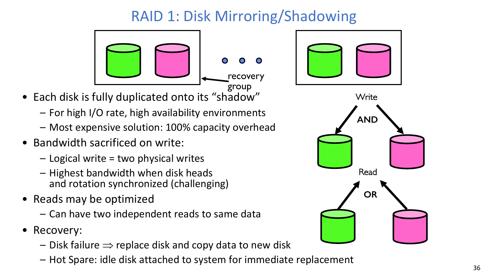

它的特性包括：

- 适合 high-I/O-rate 和 high-availability 环境。
- 成本高，因为有 100% capacity overhead。
- 一个 logical write 会变成 two physical writes。
- 最高写入带宽需要磁头和旋转同步，这很难。
- read 可以优化，因为任一副本都可以服务读取，也可以并行执行对同一数据的两个独立读取。
- 磁盘故障后的 recovery 是替换磁盘，并把数据复制到新磁盘。
- hot spare 是提前接入系统的空闲磁盘，用于立即替换故障盘。

:::remark 问题：为什么 RAID 1 的 read 比 write 更容易优化？
read 可以使用任意一个 mirror，因此系统可以选择负载更低或磁头位置更接近的磁盘。write 必须更新两个 mirror，因此要等待较慢的一侧，并消耗两块磁盘的带宽。
:::

## 22. RAID 5：High I/O Rate Parity
RAID 5 把数据 striped across multiple disks。连续数据块存放在连续的非 parity 磁盘上，因此带宽高于单块磁盘。

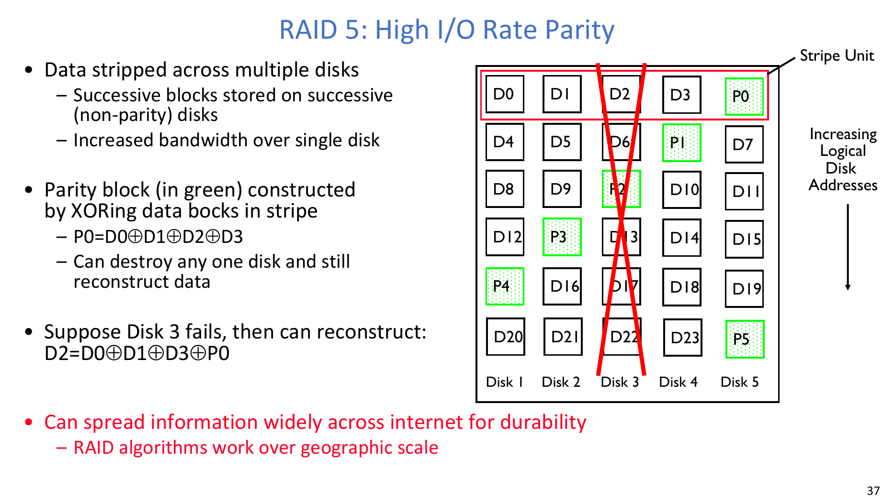

Parity blocks 通过对同一 stripe 中的数据块做 XOR 构造。第一条 stripe 中：

$$
P0 = D0 \oplus D1 \oplus D2 \oplus D3
$$

如果 Disk 3 失败，缺失的 `D2` 可以这样重构：

$$
D2 = D0 \oplus D1 \oplus D3 \oplus P0
$$

这是因为 XOR 具有同一个值应用两次会抵消的性质。RAID 5 可以容忍一个 stripe 中任意一块磁盘丢失。

:::remark 问题：为什么 RAID 5 能重构一个缺失磁盘，但通常不能重构两个？
每个 stripe 只有一个独立 parity equation。一个缺失值可以由一个方程求解。如果有两个缺失值，就有两个未知数但仍然只有一个方程，因此 RAID 5 没有足够信息同时重构二者。
:::

## 23. RAID 6 与 Erasure Codes
一般来说，RAID 方案可以看作一种 **erasure code**。系统必须知道哪些磁盘坏了，并把缺失磁盘当作 erasure。

现代磁盘很大，因此 RAID 5 经常不够。重建一块故障盘可能耗时很长，在恢复过程中另一块磁盘也可能失败。RAID 6 允许同一个 replication stripe 中两块磁盘失败，使用更复杂的 erasure code，例如 EVENODD。

更一般的 Reed-Solomon erasure coding 如下：

- 从 `m` 个 data fragments 开始；
- 生成 `n - m` 个 extra fragments；
- 可以容忍 `n - m` 个失败；
- 只要任意 `m` 个 fragments 存活，就能恢复原始数据。

例如，可以把数据切成 `m = 4` 个 fragments，扩展成 `n = 16` 个 fragments，并分布到 Internet 上。任意 4 个 fragments 都可以恢复原始数据，因此数据非常 durable。

:::remark 问题：为什么磁盘变大后 RAID 6 变得重要？
大磁盘重建时间更长。在漫长的 rebuild window 中，阵列很脆弱：如果恢复完成前另一块磁盘失败，RAID 5 会丢失数据。RAID 6 通过容忍同一 stripe 中两个失败降低这个风险。
:::

## 24. Geographic Replication
把 replicas 或 erasure-coded fragments 分散到地理上不同的位置，可以提升 durability。

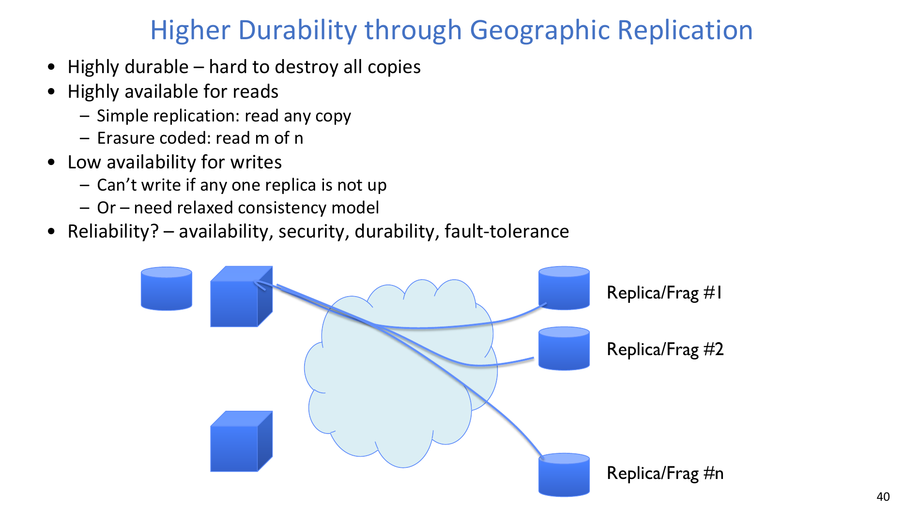

收益包括：

- Highly durable，因为很难摧毁所有副本。
- Highly available for reads。
- 使用 simple replication 时，读者可以读取任意副本。
- 使用 erasure coding 时，读者可以读取任意 `m` of `n` fragments。

代价是 write availability 和 consistency：

- 如果要求严格复制，当任意一个 replica 不可用时，write 可能失败。
- 或者系统使用 relaxed consistency model，接受 replicas 暂时不一致。

:::remark 问题：为什么地理复制中的 write 比 read 更难？
read 通常可以使用任意可用 replica，或足够数量的 erasure-coded fragments。write 必须更新系统的持久状态。如果每个 replica 都必须在提交前同意，那么一个不可用 replica 就会阻塞写入。如果系统不等待每个 replica，就需要一个能处理临时分歧的 consistency model。
:::

## 25. 文件系统可靠性与块级可靠性
Block-level reliability 可以防御介质缺陷或磁盘故障，但 file-system reliability 还必须处理多块更新期间的崩溃。

如果磁盘断电或软件崩溃：

- 一些正在进行的操作可能完成；
- 一些正在进行的操作可能丢失；
- 一次 block overwrite 可能只部分完成。

RAID 不能防御所有这类故障：

- 它不能防止把错误状态正确写到每块磁盘上；
- 如果 RAID group 中某块磁盘没有被写入，而其他磁盘已经写入，group 可能变得不一致。

文件系统至少需要 durability：之前存储的数据必须能够被取回，也许需要经过恢复步骤，并且不受故障影响。但 durability 还不够，因为文件系统还需要 consistency。

:::remark 问题：为什么 RAID 可能保存坏状态？
RAID 镜像或重构的是 blocks；它不理解文件系统不变量。如果文件系统写入了不一致的目录或 inode 状态，RAID 可以非常忠实地把这个不一致状态保存到多块磁盘上。
:::

## 26. Storage Reliability Problem
一个 single logical file operation 可能涉及多个 physical disk blocks 的更新：

- inode；
- indirect block；
- data block；
- bitmap 或 free map；
- directory block。

由于 sector remapping，即使一次 physical block update 也可能需要多个更低层 sector updates。在物理层面，操作一次完成一个；但为了性能，系统又希望并发执行操作。

核心问题是：

**How do we guarantee consistency regardless of when crash occurs?（无论崩溃在何时发生，我们如何保证一致性？）**

:::remark 问题：崩溃如何在多块操作中制造不一致？
假设创建文件需要分配数据块、更新 inode、更新 bitmap，并链接 directory entry。若崩溃发生在部分更新完成之后，可能出现已分配但没有目录名的块、指向未初始化 inode 的目录项，或与实际所有权不一致的 bitmap。
:::

## 27. Threats to Reliability
主要威胁有两类。

第一，interrupted operation 会让存储数据不一致。经典例子是从一个银行账户向另一个账户转账。如果 withdrawal 已经发生，但 deposit 之前系统崩溃，钱就消失了。文件系统更新具有同样形状：几个相关变化必须全部发生，或全部不发生。

第二，stored data 可能由于 non-volatile storage media 故障而丢失。之前存储的数据可能消失或被破坏。

:::remark 问题：银行转账例子对文件系统更新有什么启发？
它说明了 atomicity。多步更新不应该暴露半完成状态。对银行转账而言，withdrawal 和 deposit 必须一起提交。对文件系统而言，分配块、更新元数据、把文件链接进目录也必须被视为一个逻辑操作。
:::

## 28. 两种 Reliability Approaches
有两大类方法。

| 方法 | 例子 | 核心思想 | 恢复行为 |
|---|---|---|---|
| Careful ordering and recovery | FAT 和 FFS 搭配 `fsck` | 每一步按一定顺序构建结构，例如 data block、inode、free map、directory。最后一步把新结构链接进文件系统其余部分。 | recovery 扫描结构，寻找 incomplete actions。 |
| Versioning and copy-on-write | ZFS 等设计 | 创建一个新版本，并链接回旧结构中未改变的部分。最后一步声明新版本 ready。 | recovery 选择最后一个完整版本，并忽略未完成的新版本。 |

Careful ordering 试图保证 partial operations 产生 loose fragments，而不是丢失或破坏数据。Copy-on-write 提供更丰富功能，包括 versions，并且恢复更简单，因为旧版本会保持完整，直到新版本提交。

:::remark 问题：为什么 copy-on-write 可以简化恢复？
copy-on-write 不会原地覆盖旧结构。它写入新块，并把它们链接到旧结构中未变化的块。如果崩溃发生在最终 commit pointer 更新前，旧版本仍然有效。如果最终 pointer 已更新，新版本就是有效的。
:::

## 29. 文件系统总结
本讲主要思想连接了内存管理、文件系统和共享：

- `mmap()` 把文件或匿名段映射到内存。
- buffer cache 保存内核资源，包括磁盘块和名字转换。
- dirty buffer-cache blocks 包含尚未落盘的修改。
- 文件系统操作会涉及对磁盘上多个不同块的更新。
- 这些更新需要 all-or-nothing semantics，因为崩溃可能发生在序列中间。
- 传统文件系统把 careful ordering 与 boot-time recovery 结合起来。
- copy-on-write 提供 versions 和更简单的恢复，并且由于现代存储上的顺序写相对便宜，性能影响通常较小。

## Exam Review
你应该能够不回看正文，直接回答以下问题：

1. **Memory-mapped files 把文件访问变成虚拟内存访问。** file-backed region 上的 page fault 会把文件内容加载到内存，并更新 page table。
2. **`mmap(0, 10000, PROT_READ|PROT_WRITE, MAP_FILE|MAP_SHARED, fd, 0)` 表示让 OS 选择地址，映射 10,000 字节，允许读写，并通过文件共享修改。**
3. **buffer cache 保存 disk blocks、inodes、directory blocks、free maps 和 name translations 等内核资源。**
4. **`open()` 中目录块和 inode 会被读取并缓存；`read()` 中 inode index 找到数据块；`write()` 中数据和元数据可能变 dirty。**
5. **dirty blocks 是内存中已修改但尚未落盘的块。** 驱逐它们需要 writeback，并经历 transient state。
6. **LRU 对 buffer cache 通常可用，但在一次性顺序扫描上会失败。** "Use Once" 策略可以快速丢弃 streaming blocks。
7. **Read-ahead prefetching 有利于顺序访问，但如果预取过多，会伤害其他应用。**
8. **Delayed writes 提升性能和布局质量，但会制造崩溃窗口。**
9. **Availability 是接受和处理请求的能力；durability 是数据在故障后存活；reliability 是系统在一段时间内正确执行所需功能。**
10. **Replication 只有在 failures 独立时才真正有用。**
11. **RAID 1 镜像数据，RAID 5 使用 XOR parity 容忍一块磁盘失败，RAID 6 或 Reed-Solomon erasure coding 可以容忍更多失败。**
12. **Geographic replication 提升 durability 和 read availability，但 write availability 与 consistency 会更难。**
13. **RAID 不足以保证文件系统可靠性，因为它可能保存不一致状态。**
14. **核心 reliability 问题是：How do we guarantee consistency regardless of when crash occurs?**
15. **Careful ordering plus recovery 和 copy-on-write 是实现类似事务 all-or-nothing 文件系统更新的两条主要路线。**
