# Lec23 - 文件系统 4：事务与分布式决策

## 学习目标
读完这份笔记后，你应该能够解释文件系统为什么需要类似事务的恢复机制，careful ordering 与 copy-on-write 有什么区别，journaling 如何把多块更新变成持久的 all-or-nothing 操作，以及分布式系统如何通过 protocol 在多台机器之间协调决策。你还应该能够描述 Two General's Paradox、Two-Phase Commit 协议、它的状态机、恢复规则，以及它的 blocking 局限。

## 1. 两种可靠性方法
文件系统可靠性大体有两种方法。

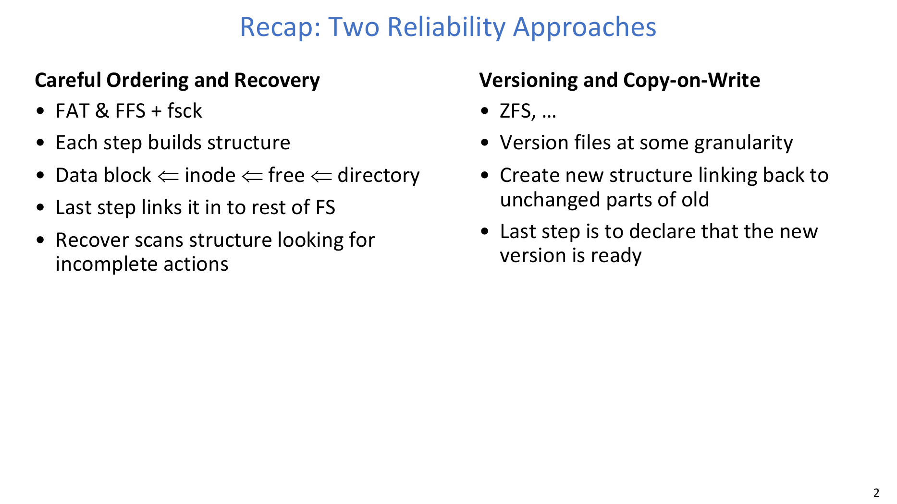

| 方法 | 例子 | 核心思想 | 恢复行为 |
|---|---|---|---|
| Careful ordering and recovery | FAT 和带 `fsck` 的 FFS | 每一步都按安全顺序构造结构，例如 data block、inode、free map、directory。最后一步才把新结构链接进文件系统的其余部分。 | 恢复时扫描结构，寻找尚未完成的操作。 |
| Versioning and copy-on-write | ZFS 以及类似系统 | 按某种粒度对文件做版本化。创建一个新结构，并让它指向旧版本中未改变的部分。最后一步声明新版本已经就绪。 | 恢复时保留最后一个完整版本，忽略尚未完成的新结构。 |

二者的共同目标都是：即使系统在一串操作的中途崩溃，也不能把一个只构造了一半的持久化结构暴露成“已经完成”的结构。

## 2. Careful Ordering
Careful ordering 指的是把操作按照特定顺序执行，使得这串操作即使被中途打断也仍然安全。崩溃之后，恢复过程读取文件系统数据结构，检查是否存在正在进行但尚未完成的操作，然后根据需要清理它或完成它。

FAT 和 FFS 可以配合 `fsck` 用这种方式保护文件系统元数据。类似思想也会出现在应用层恢复方案中，例如编辑器使用临时文件或 autosave 文件保存尚未正式提交的内容。

核心问题是：

**Assume you need to store a piece of data and a directory entry or pointer for the data. Assume each operation is atomic. Which one should you write first: data or pointer?**

也就是说，如果需要同时保存一段数据和一个指向这段数据的目录项或指针，并且每个单独写入操作都是原子的，那么应该先写数据，还是先写指针？

:::remark 问题：文件系统应该先写 data 还是先写 pointer？
更安全的 careful-ordering 规则是：先写数据，最后写指针。如果数据已经写入但指针尚未写入时发生崩溃，系统最多留下一个不可达的数据碎片，恢复过程可以删除它，或者把它放入 `lost+found`。如果先写指针，而数据还没写完时发生崩溃，文件系统可能会暴露一个目录项或 inode 指针，让它指向未初始化数据或旧数据。后者更危险，因为命名空间已经指向了无效内容。
:::

## 3. Berkeley FFS：创建文件
Berkeley FFS 中创建文件的过程展示了为什么需要 careful ordering 和 recovery。

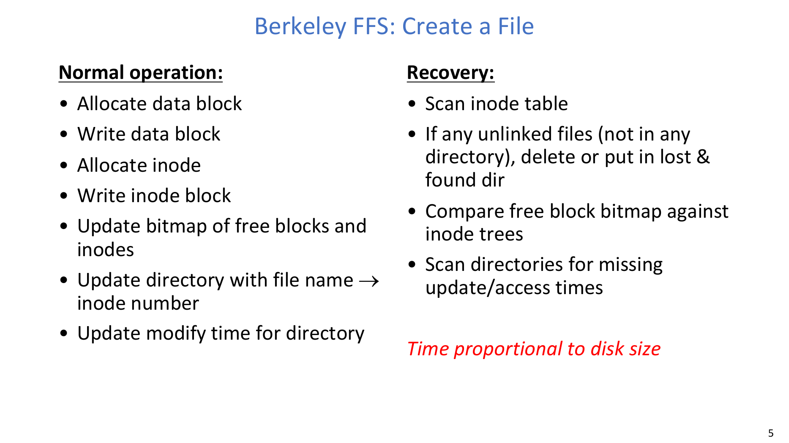

正常创建过程包括：

1. 分配 data block。
2. 写入 data block。
3. 分配 inode。
4. 写入 inode block。
5. 更新 free blocks 和 inodes 的 bitmap。
6. 更新目录，把 file name 映射到 inode number。
7. 更新目录的 modify time。

恢复过程包括：

1. 扫描 inode table。
2. 如果发现没有出现在任何目录中的 unlinked files，就删除它们，或者把它们放入 `lost+found`。
3. 比较 free block bitmap 与 inode trees 是否一致。
4. 扫描目录，检查是否缺少 update/access times。

恢复成本与磁盘大小成正比。这是这种方法的主要弱点：当磁盘很大时，全盘扫描可能非常慢。

:::remark 问题：为什么 `fsck` 的恢复时间与磁盘大小成正比？
`fsck` 不能只查看刚刚被打断的那个操作，而是必须检查全局文件系统结构。它需要扫描 inode tables、目录结构和空闲空间元数据，才能重新建立一致性。磁盘和元数据空间越大，扫描时间就越长。
:::

## 4. Copy-on-Write 文件布局
Copy-on-write 不会原地覆盖已有 data block，也不会原地更新旧指针。它会创建一个包含新数据的新版本，并复用旧版本中没有改变的 blocks。

核心思想是 **Copy On Write (COW)**：不要直接修改旧结构。先写新 blocks，构造新 pointers，最后再发布新版本。

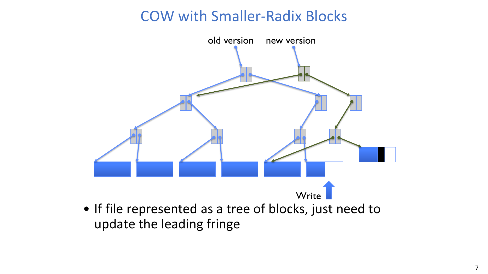

如果文件用一棵 block tree 表示，那么一次更新只需要重写 leading fringe：被修改的 leaf block，以及从这个 leaf 到 root 的一串 pointer blocks。没有变化的 subtrees 可以被旧版本和新版本共享。

COW 看起来会很昂贵，但它有两个重要的缓解因素：

- 多个 updates 可以被 batch 到一起；
- 几乎所有 disk writes 都可以并行发生。

这种方法出现在网络文件服务器设备和现代文件系统中，例如 NetApp 的 Write Anywhere File Layout (WAFL)、ZFS 和 OpenZFS。

:::remark 问题：为什么 COW 会让恢复更简单？
旧版本会一直保持完整，直到新版本完全构造好并被发布。如果最终 pointer update 之前发生崩溃，恢复过程继续使用旧版本即可。如果最终 pointer update 已经完成，则新版本就是完整的。系统不需要修复一个被原地覆盖到一半的旧结构。
:::

## 5. ZFS 与 OpenZFS
ZFS 和 OpenZFS 使用 COW 风格的思想，并包含若干实际设计选择：

- Variable sized blocks：block 大小可以从 512 B 到 128 KB。
- Symmetric tree：系统在复制 block 时知道这个 block 是大还是小。
- Version number stored with pointers：指针中带有版本号，因此可以通过添加 blocks 和 new pointers 创建新版本。
- 一组 writes 可以先被 buffer 起来，然后再创建新版本。
- Free space 被表示为每个 block group 中的 extent tree。
- Free-space updates 可以先延迟记录在 log 中，等 block group 被 activated 时再一起应用。

这样的文件系统布局能够支持版本、可靠恢复，以及较好的顺序写性能。

## 6. 事务作为通用可靠性方案
Careful ordering 和 COW 都很重要，但更通用的可靠性思想是 transactions。

Transactions 提供 atomic updates：

- 多个相关 updates 可以被原子执行；
- 如果中途发生崩溃，系统最终看到的是所有 updates 都生效，或者所有 updates 都不生效；
- 现代文件系统常常在内部使用 transactions 来更新文件系统结构和 metadata；
- 许多应用也会实现自己的 transactions。

针对介质故障，redundancy 是另一类需求：

- 在介质上使用冗余表示，例如 error-correcting codes；
- 在多个介质之间复制，例如 RAID disk arrays。

Transactions 保护的是更新一致性。Redundancy 保护的是物理数据不丢失。二者都重要，但解决的是不同问题。

## 7. 核心概念：Transaction
关键定义是：

**A transaction is an atomic sequence of reads and writes that takes the system from consistent state to another.**

也就是说，transaction 是一串原子的 reads 和 writes，它把系统从一个一致状态带到另一个一致状态。

Transaction 与 critical section 非常接近。Critical section 中的代码在操作共享内存时，对其他线程看起来像是原子的。Transactions 把这种 atomic update 从内存扩展到 stable storage，因为持久化更新还必须能在崩溃后保留下来。

典型结构是：

1. Begin a transaction，并获得 transaction id。
2. 执行一组 updates。
3. 如果某个 update 失败，或者与另一个 transaction 冲突，就 roll back。
4. 如果整组操作成功，就 commit transaction。

:::remark 问题：transaction 为什么比“连续做几次写入”更强？
连续几次写入在系统崩溃时可能留下部分完成的状态。Transaction 则让整组操作只有一个逻辑结果：要么整组都变得可见并持久化，要么整组都不生效。
:::

## 8. 经典事务例子：银行转账
经典例子是从 Alice 的账户向 Bob 的账户转账 `$100`。

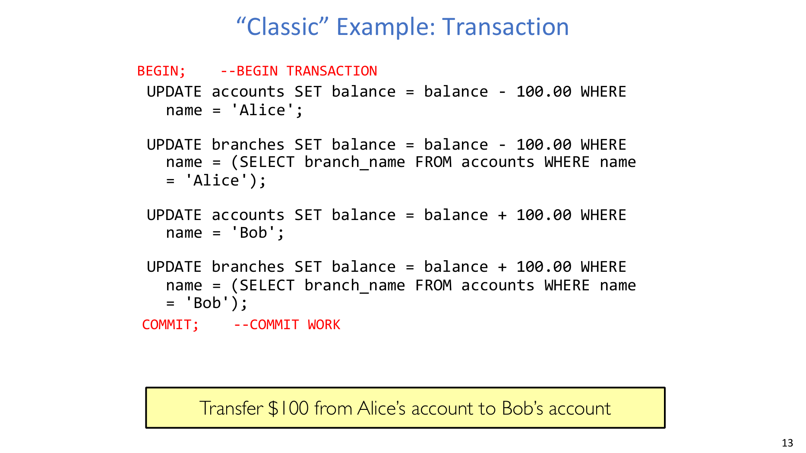

Transaction 开始后，从 Alice 的账户余额减去 `$100`，从 Alice 所在 branch 的余额减去 `$100`，给 Bob 的账户余额加上 `$100`，给 Bob 所在 branch 的余额加上 `$100`，最后 commit。

```sql
BEGIN;     -- BEGIN TRANSACTION

UPDATE accounts
SET balance = balance - 100.00
WHERE name = 'Alice';

UPDATE branches
SET balance = balance - 100.00
WHERE name = (
  SELECT branch_name FROM accounts WHERE name = 'Alice'
);

UPDATE accounts
SET balance = balance + 100.00
WHERE name = 'Bob';

UPDATE branches
SET balance = balance + 100.00
WHERE name = (
  SELECT branch_name FROM accounts WHERE name = 'Bob'
);

COMMIT;    -- COMMIT WORK
```

这个例子并不只是关于银行软件。它说明多个持久化更新为什么必须成为一个逻辑单元。如果系统在 Alice 已经扣款、Bob 尚未到账时崩溃，持久化状态就是错误的。

:::remark 问题：如果转账在中途崩溃，应该发生什么？
Transaction system 应该回滚所有变化，让 Alice 仍然保有这笔钱；或者提交所有变化，让 Bob 收到钱，并且 branch balances 也保持一致。Alice 丢了钱但 Bob 没收到钱的状态不是一致状态。
:::

## 9. Log 的概念
Log 利用一个简单的原子动作：write 或 append 一个基本 item。这个原子的 append 可以用来确认一整串 actions 的 commitment。

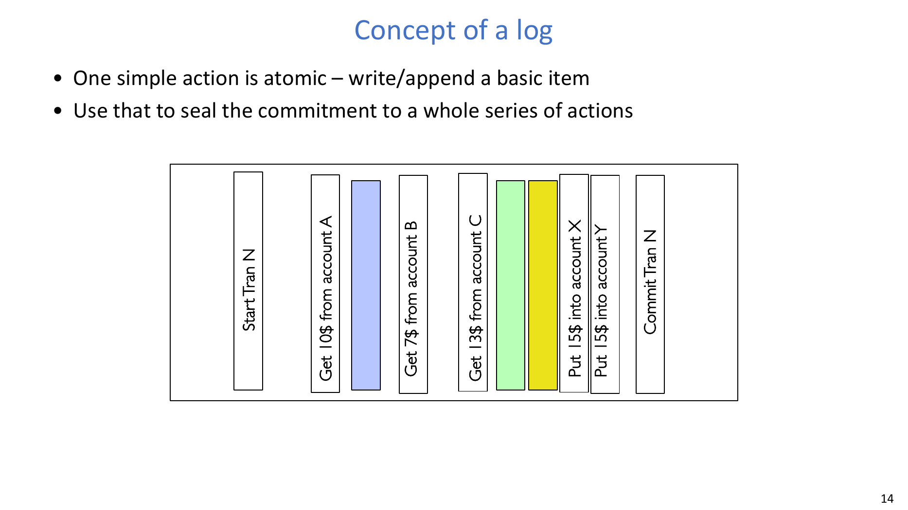

Transaction log 会记录 start marker、intended actions，以及 commit marker。图中的 transaction 记录了从 accounts A、B、C 中取钱，向 accounts X、Y 中放钱，最后写入 `Commit Tran N`。

关键规则是：commit 不是一种“感觉”，而是一条 durable record。只要 commit record 已经安全地写入 log，系统就能在崩溃后 replay 这个 transaction。

## 10. Transactional File Systems
Transactional file systems 通过 log 提高可靠性：

- changes 被视为 transactions；
- transaction 一旦被写入 log，就被认为已经 committed；
- data 会被强制写入 disk，以保证可靠性；
- NVRAM 可以加速这一过程；
- 即使 file system 没有立刻更新，data 也已经保存在 log 中。

这里有一个重要区别：

- 在 log-structured file system 中，data 会一直保持 log form。
- 在 journaled file system 中，log 用于 recovery。

## 11. Journaling File Systems
Journaling file systems 不会直接修改 on-disk data structures。它们会把每个 update 作为 transaction 记录到 log 中。这个 log 通常称为 journal 或 intention list，并且同样保存在 disk 上。

一旦 changes 进入 log，就可以安全地应用到 file system。例如，系统可以修改 inode pointers 和 directory mappings。当 change 已经被应用后，garbage collection 会从 log 中移除对应 entry。

Linux ext3 是在原本类似 FFS 的 ext2 文件系统上添加 journal 得到的。其他例子包括 NTFS、Apple HFS+、Linux XFS、JFS 和 ext4。

现代系统可以选择 journal all data，或者只 journal metadata。Metadata journaling 记录文件系统结构的修改，而 file contents 可以直接写到最终位置。

:::remark 问题：为什么许多现代文件系统只 journal metadata？
Journal all data 会把所有数据写两次：一次写到 log，一次写到最终位置。Metadata 是中断后最容易破坏文件系统一致性的部分，因此只 journal metadata 可以用更低的写入开销获得较强的结构恢复能力。
:::

## 12. 使用 Journaling 创建文件
如果没有 journaling，创建文件会先寻找 free data blocks、free inode entry 和 directory-entry insertion point，然后直接写 map、inode entry 和 directory entry。

使用 journaling 时，更新会先被放入 non-volatile log。

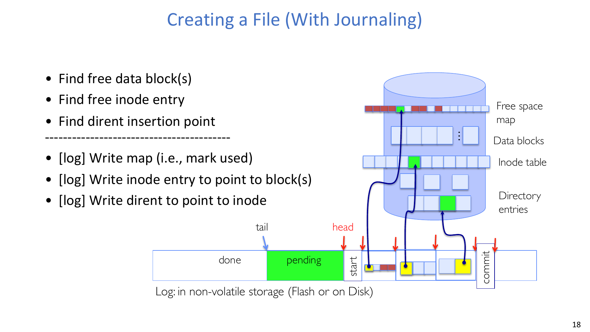

Logged transaction 包含：

1. `[log] Write map`，把 data block 标记为已使用。
2. `[log] Write inode entry`，让 inode 指向这个 block。
3. `[log] Write dirent`，让 directory 指向这个 inode。
4. Log 中的 start marker 和 commit marker。

Log 有 `done` region 和 `pending` region。`tail` 指向较旧的 log records，`head` 随着新 records append 向前移动。只有当 commit marker 已经持久化之后，这个 transaction 才能被安全应用。

## 13. Commit 之后的 Replay
Commit 之后，file system 不一定立刻更新最终的 on-disk structures。

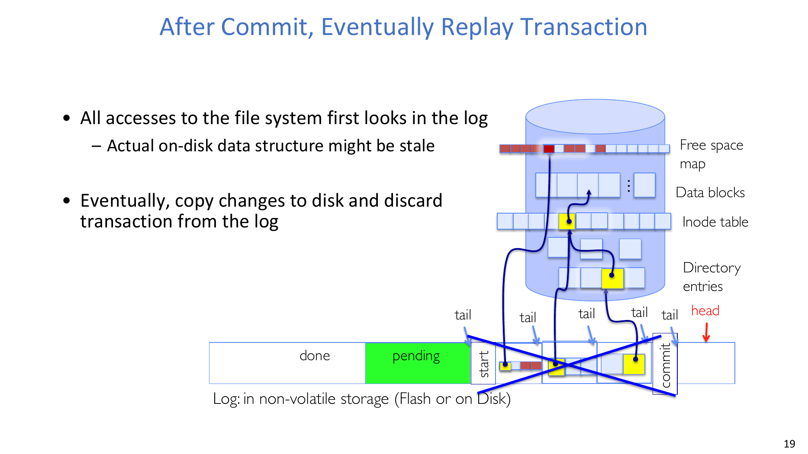

所有 file-system accesses 都会先查看 log，因为实际的 on-disk data structure 可能仍然是旧的。最终，系统会把 logged changes 复制到它们在 disk 上的最终位置，并从 log 中丢弃这个 transaction。

这就是为什么 recovery 和 lookup 时 log 优先于 ordinary disk structure：log 可能包含最新的 committed truth。

## 14. 使用 Journal 进行崩溃恢复
Crash recovery 会区分 partial transactions 和 complete transactions。

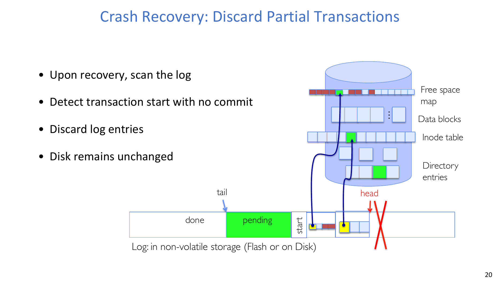

如果 recovery 扫描 log 时发现某个 transaction 有 start 但没有对应 commit，就丢弃这些 log entries。Disk 保持不变，因为这个 transaction 从未 committed。

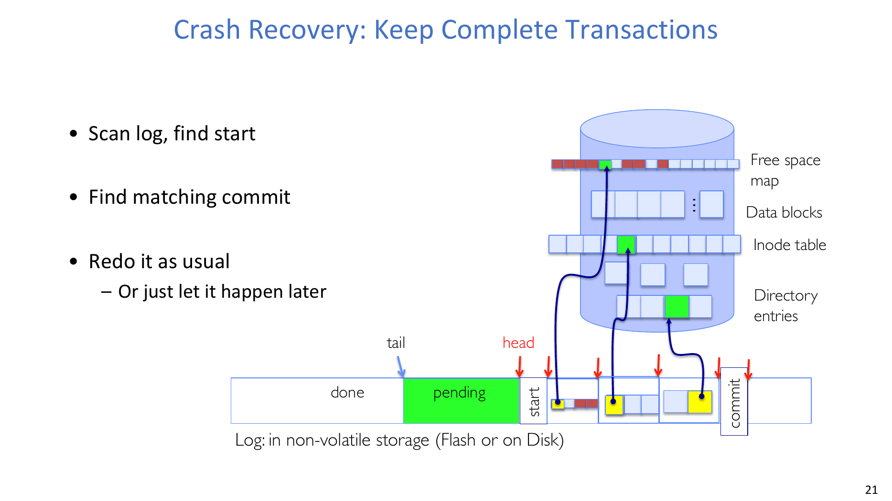

如果 recovery 同时找到 start 和 matching commit，就保留这个 complete transaction。系统可以像平时一样 redo 它，也可以让 replay 稍后发生。Redo 是安全的，因为 commit record 证明这个 transaction 本来就应该生效。

:::remark 问题：为什么 recovery 可以丢弃 partial transactions，却必须 replay committed transactions？
Partial transaction 没有 durable commit marker，所以系统可以把它当作从未发生过。Committed transaction 有 durable commit marker，所以系统必须保留它的效果。Log 给 recovery 提供了明确的二元规则：没有 commit 就 discard；有 commit 就 redo 或 keep。
:::

## 15. Journaling 总结
Journaling 让 updates 在系统崩溃时仍然保持 atomic：

- 一个 update 要么被完整应用，要么被丢弃；
- 所有 physical operations 都被视为一个 logical unit。

代价是 write amplification。如果 journal all data，系统会把 data 写两次：一次写到 log，一次写到目标文件中的实际 data blocks。现代文件系统通常只 journal metadata updates。它们记录文件系统 data structures 的修改，但 file-content updates 会直接应用。

## 16. 社会尺度的分布式系统
现实世界本身就是一个巨大的分布式系统。Microprocessors 出现在各种设备中，庞大的基础设施把它们连接起来：sensor networks、Internet connectivity、databases、remote storage、online games、commerce，以及提供 scalable、reliable、secure services 的 massive clusters。

Centralized system 的定义是：

**Centralized System: System in which major functions are performed by a single physical computer**.

也就是说，centralized system 是主要功能由一台物理计算机完成的系统。

Distributed system 的定义是：

**Distributed System: physically separate computers working together on some task**.

也就是说，distributed system 是多台物理上分离的计算机共同完成某个任务的系统。

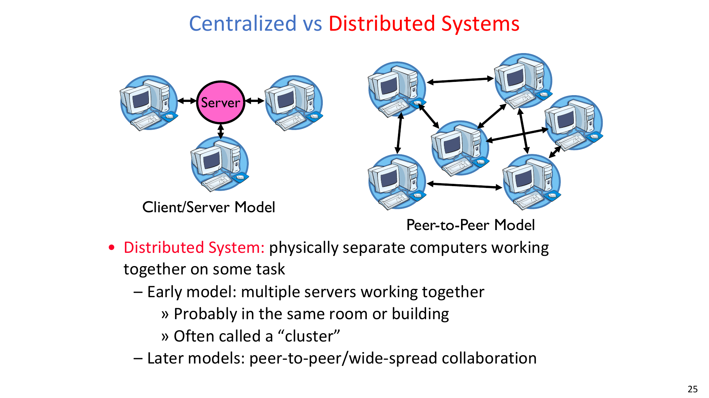

早期 distributed systems 往往使用位于同一个房间或同一栋楼里的多台 servers，也就是 cluster。后来的系统包括 peer-to-peer 和大范围协作系统。

## 17. 分布式系统的承诺与现实
Distributed systems 很有吸引力，因为：

- 用许多简单计算机构建系统更便宜，也更容易；
- 计算能力可以逐步增加；
- 用户可以控制其中一部分 components；
- 通过 network resources 协作更容易，例如 network file systems。

它们承诺带来：

- higher availability：如果一台机器 down 了，就使用另一台；
- better durability：把 data 存储在多个位置；
- more security：每个局部可能更容易被保护。

现实通常更困难：

- worse availability：系统可能依赖每台机器都正常运行；
- worse reliability：任何一台机器 crash 都可能导致 data loss；
- worse security：世界上任何人都可能攻击系统；
- coordination 变得更难；
- trust、privacy、denial of service 和 protocol correctness 都变得更难。

Lamport 的著名提醒抓住了这种意外性：

**A distributed system is one in which the failure of a computer you didn't even know existed can render your own computer unusable.**

也就是说，在分布式系统中，一台你甚至不知道存在的计算机失败了，也可能让你自己的计算机无法使用。

:::remark 问题：为什么分布式反而可能让 availability 变差？
Distribution 会增加依赖关系。如果一个 service 被设计成必须等待每个 component 响应，那么任何一个 component failure 都可能破坏整个 service。只有当设计能够容忍 missing、slow 或 failed components 时，distribution 才会真正改善 availability。
:::

## 18. Transparency 目标
**Transparency: the ability of the system to mask its complexity behind a simple interface**.

也就是说，transparency 是系统把复杂性隐藏在简单接口之后的能力。

常见 transparencies 包括：

| Transparency | 含义 |
|---|---|
| Location | 用户看不出 resources 位于哪里。 |
| Migration | Resources 可以移动，而用户不需要知道。 |
| Replication | 用户看不出一个 resource 有多少 copies。 |
| Concurrency | 用户看不出同时有多少 users。 |
| Parallelism | 系统可以把大任务拆成小任务，从而加速执行。 |
| Fault tolerance | 系统可以隐藏各种出错情况。 |

Transparency 和 collaboration 都要求不同 processors 之间能够通信。

## 19. Protocols
Protocol 是用于通信的一套规则系统。

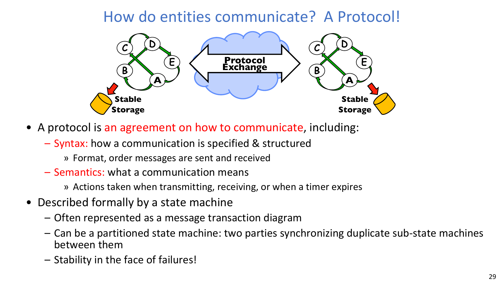

关键定义是：

**A protocol is an agreement on how to communicate**.

也就是说，protocol 是关于如何通信的约定。

它包括：

- syntax：communication 如何被指定和组织，包括 message format 和 order；
- semantics：communication 的含义，包括 send、receive 或 timer expiration 时应该执行什么 actions。

Protocol 可以用 state machine 形式化描述。它也经常表示为 message transaction diagram。它还可以是 partitioned state machine，也就是双方在彼此之间同步 duplicate sub-state machines。Failure 下的 stability 是 protocol 设计的一部分。

## 20. 人类协议例子：电话
电话通话就是一个熟悉的 protocol：

1. 拿起或打开电话。
2. 听到 dial tone，或者确认有 service。
3. 拨号。
4. 听到 ringing。
5. 被叫方说 "Hello?"
6. 主叫方说明自己是谁，例如 "Hi, it's John."
7. 主叫方发送主要信息并停顿。
8. 被叫方回复并停顿。
9. 主叫方说 bye。
10. 被叫方说 bye。
11. 挂断电话。

这个例子同时展示了 syntax 和 semantics。顺序很重要，每条 message 都会改变另一方下一步应该做什么。

:::remark 问题：为什么 protocol 不只是 message 列表？
Protocol 还定义每条 message 的含义，以及它会触发什么 state transition。例如，"Bye" 不只是传输一段文本；它告诉对方 conversation 正在结束，接下来 hang up 是有效行为。
:::

## 21. 分布式应用与 Message Passing
Distributed application 必须同步运行在不同机器上的多个 threads。由于没有 shared memory，本地同步指令（例如 test-and-set）已经不够。

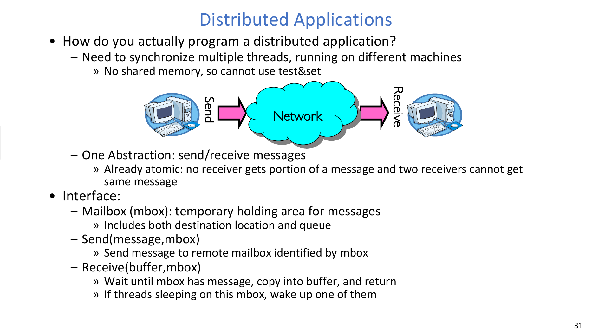

一种抽象是 send/receive messages。Message delivery 已经具有某种 atomicity：不会有 receiver 只收到 message 的一部分，也不会有两个 receivers 收到同一条 message。

接口包括：

- `Mailbox (mbox)`：临时保存 messages 的区域，其中包含 destination location 和 queue。
- `Send(message, mbox)`：把 message 发送到 `mbox` 标识的 remote mailbox。
- `Receive(buffer, mbox)`：等待 `mbox` 中出现 message，把它复制到 `buffer`，然后返回。
- 如果有 threads 正在 mailbox 上 sleeping，收到 message 会唤醒其中一个。

## 22. 分布式 Consensus Making
Consensus problem 是：

- 所有 nodes 都提出一个 value；
- 一些 nodes 可能 crash 并停止响应；
- 最终，所有 remaining nodes 都要从 proposed values 中决定同一个 value。

Distributed decision making 通常是在 `true` 与 `false` 之间选择，或者在 `commit` 与 `abort` 之间选择。

Durability 同样重要。Decisions 不能被遗忘。这就是数据库 ACID 中的 "D"。在 global-scale system 中，durability 可能需要 erasure coding、massive replication，或者多台机器上的 stable storage。

:::remark 问题：为什么 consensus 需要 durability？
如果某个 node 已经决定 `commit`，但 crash 后忘记了这个 decision，它之后可能表现得像 decision 从未发生过一样。一个 distributed decision 只有在 participants 能够恢复并记住自己承诺或决定过什么时，才真正有意义。
:::

## 23. Two General's Paradox
Two General's Paradox 询问的是：在 messages 不可靠的情况下，能否保证同时进行协同行动。

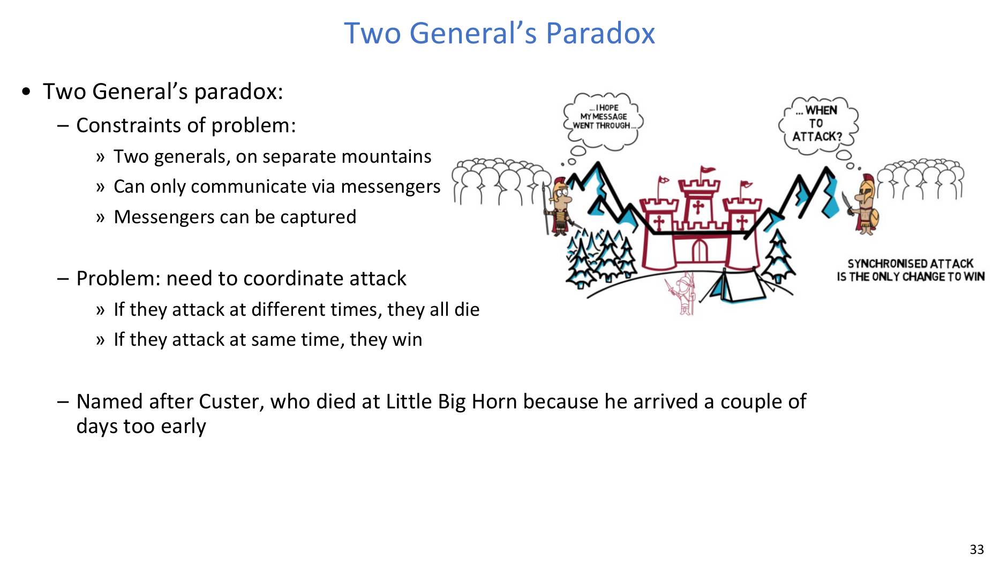

约束条件是：

- 两位 generals 分别位于两座 mountain 上；
- 他们只能通过 messengers 通信；
- Messengers 可能被 captured；
- 他们必须协调 attack；
- 如果 attack times 不同，就会失败；
- 如果在同一时间 attack，就会获胜。

令人意外的结论是：

**No, messages over an unreliable network cannot guarantee that two entities do something simultaneously, even if all messages get through.**

也就是说，在不可靠网络上传输的 messages 无法保证两个实体同时做某件事，即使实际上传出的所有 messages 最后都到达了。

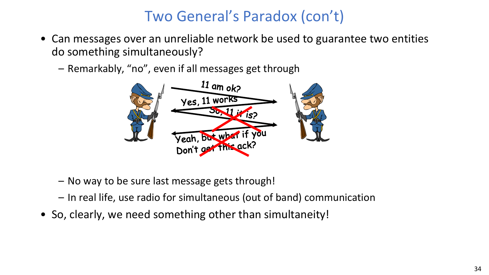

原因是 last-message problem。如果一方发送 "11am works"，另一方可以 acknowledge。但第一方接下来会担心这个 acknowledgment 是否到达。再 acknowledge 这个 acknowledgment 又会产生一条新的、交付仍然不确定的 message。不存在一条 final message 能让双方都知道它已经被接收。

:::remark 问题：如果每条实际发送的 message 最后都到了，为什么 Two General's Paradox 仍然存在？
问题不只是 delivery，而是 knowledge。即使 message 在现实中到达了，participant 也无法知道对方知道它到达了，更无法知道对方知道自己知道它到达了，如此无限递归。Guaranteed simultaneous action 需要 common knowledge，而 unreliable messaging 无法创造 common knowledge。
:::

## 24. Two-Phase Commit
Two-Phase Commit 不解决 simultaneous action。它解决的是一个相关的 distributed transaction 问题：

**Distributed transaction: Two or more machines agree to do something, or not do it, atomically**.

也就是说，distributed transaction 要求两台或更多机器原子地同意做某件事，或者同意不做这件事。

这里没有要求每台机器在同一时刻行动。要求是所有 surviving machines 最终达成同一个 decision。

Two-Phase Commit 由 Jim Gray 提出。它在每台机器上使用 persistent stable log 来记录 commit 是否发生。如果机器 crash，当它醒来时会先检查自己的 log，从而恢复 crash 时的 protocol state。

## 25. Two-Phase Commit Protocol
Two-Phase Commit 包含两个阶段。

Prepare phase：

1. Global coordinator 要求所有 participants 承诺自己能够 commit 或 roll back 这个 transaction。
2. 每个 participant 把自己的 promise 记录到 log 中。
3. 每个 participant 向 coordinator acknowledgment。
4. 如果有人 vote abort，coordinator 就在自己的 log 中写入 `Abort`，通知所有人 abort，并且每个 participant 也在自己的 log 中记录 `Abort`。

Commit phase：

1. 如果所有 participants 都回复自己已经 prepared，coordinator 就把 `Commit` 写入 log。
2. Coordinator 要求所有 nodes commit。
3. Participants commit，并回复 ACK。
4. 收到 ACKs 后，coordinator 把 `Got Commit` 写入 log。

Log 保证所有机器要么都 commit，要么都不 commit。

## 26. 详细 2PC 算法
高层算法包含一个 coordinator 和 `N` 个 workers。

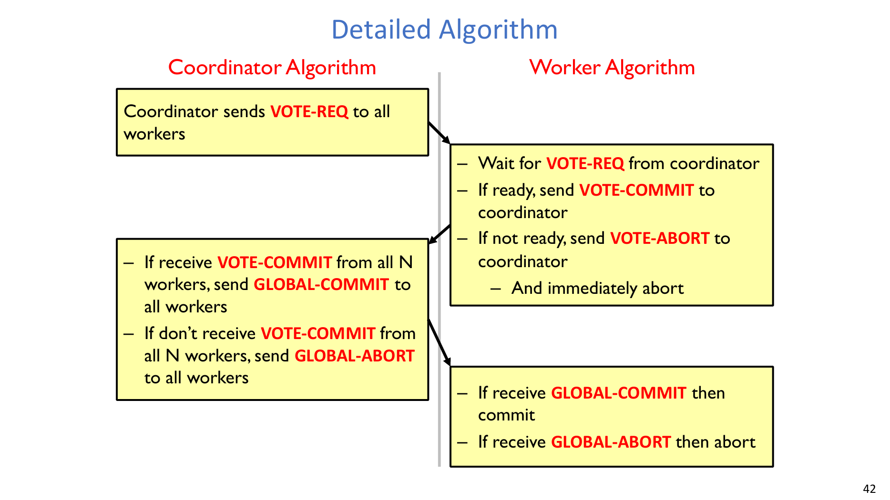

Coordinator algorithm：

- 向所有 workers 发送 `VOTE-REQ`。
- 如果从全部 `N` 个 workers 收到 `VOTE-COMMIT`，就向所有 workers 发送 `GLOBAL-COMMIT`。
- 如果没有从全部 `N` 个 workers 收到 `VOTE-COMMIT`，就向所有 workers 发送 `GLOBAL-ABORT`。

Worker algorithm：

- 等待来自 coordinator 的 `VOTE-REQ`。
- 如果 ready，就向 coordinator 发送 `VOTE-COMMIT`。
- 如果 not ready，就向 coordinator 发送 `VOTE-ABORT`，并立即 abort。
- 如果收到 `GLOBAL-COMMIT`，就 commit。
- 如果收到 `GLOBAL-ABORT`，就 abort。

:::remark 问题：为什么 worker 必须把自己的 vote 记录到 stable storage？
Worker 一旦 vote commit，就承诺如果最终 decision 是 commit，自己一定能够 commit。如果它 crash 后忘记了这个 promise，就可能做出与 coordinator 已记录 decision 不一致的行为。Stable storage 让 vote 可以在恢复后被重新读取。
:::

## 27. 无故障执行
在 failure-free execution 中，message flow 很直接。

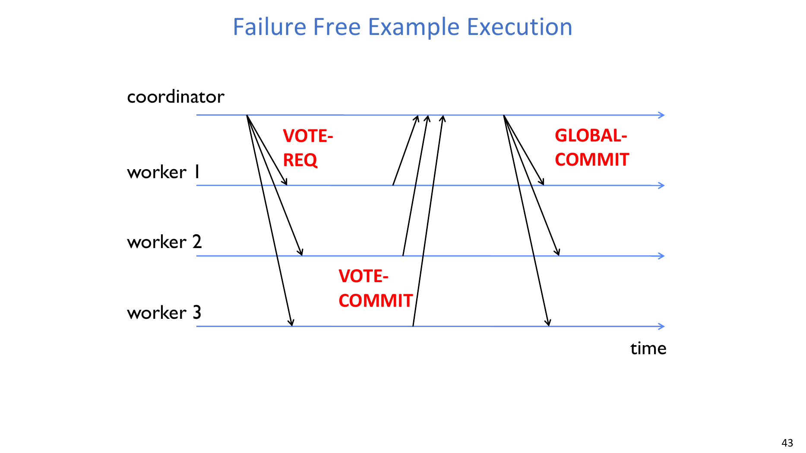

1. Coordinator 向每个 worker 发送 `VOTE-REQ`。
2. 每个 worker 回复 `VOTE-COMMIT`。
3. Coordinator 收到所有 commit votes。
4. Coordinator 发送 `GLOBAL-COMMIT`。
5. Workers commit。

如果任何 worker 回复 `VOTE-ABORT`，coordinator 就会改为发送 `GLOBAL-ABORT`。

## 28. Coordinator 与 Worker 状态机
Coordinator 实现一个简单状态机。

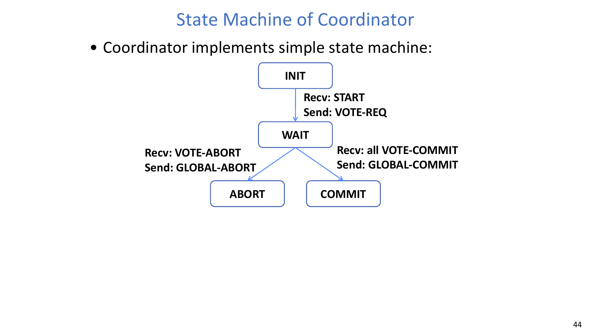

Coordinator states：

- `INIT`：在 `START` 时发送 `VOTE-REQ`，进入 `WAIT`。
- `WAIT`：如果收到任何 `VOTE-ABORT`，发送 `GLOBAL-ABORT`，进入 `ABORT`。
- `WAIT`：如果收到所有 `VOTE-COMMIT` messages，发送 `GLOBAL-COMMIT`，进入 `COMMIT`。
- `ABORT` 和 `COMMIT` 是 terminal decisions。

Workers 也实现一个简单状态机。

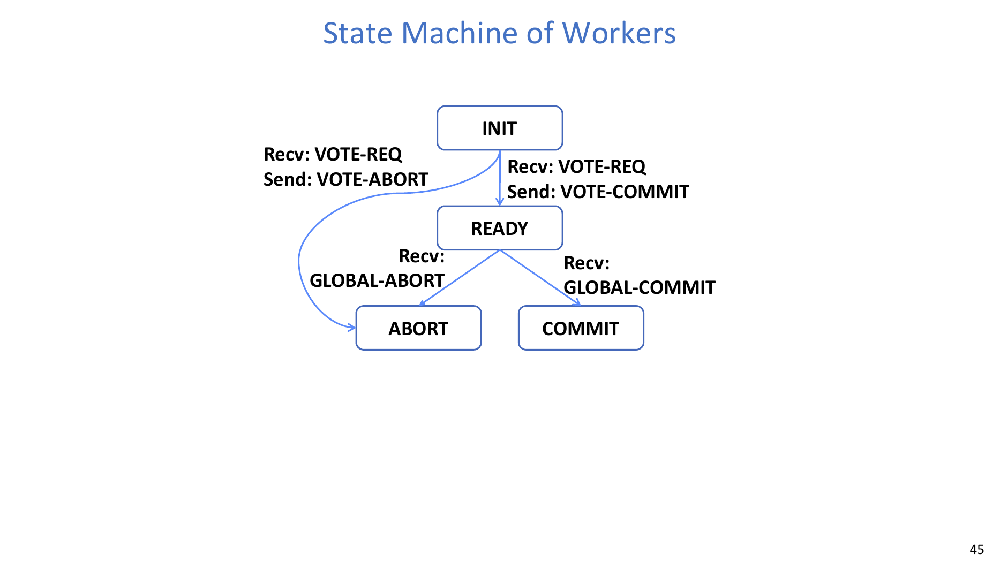

Worker states：

- `INIT`：在收到 `VOTE-REQ` 时，要么发送 `VOTE-ABORT` 并进入 `ABORT`，要么发送 `VOTE-COMMIT` 并进入 `READY`。
- `READY`：收到 `GLOBAL-ABORT` 时进入 `ABORT`。
- `READY`：收到 `GLOBAL-COMMIT` 时进入 `COMMIT`。

关键风险在 worker 的 `READY` 状态：worker 已经 vote yes，因此必须等待 coordinator 的 final decision。

## 29. 处理 Worker Failures
Worker failure 会影响 coordinator 正在等待 messages 的状态。Coordinator 只会在 `WAIT` 状态等待 votes。

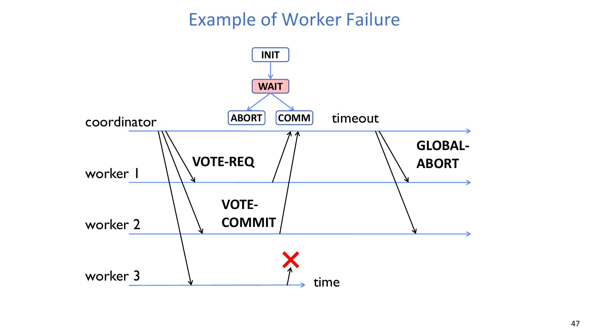

如果 coordinator 处于 `WAIT`，并且没有收到全部 `N` 个 votes，它会 timeout 并发送 `GLOBAL-ABORT`。在例子中，worker 3 在 vote 到达 coordinator 之前失败。Coordinator 无法收齐所有 votes，因此 timeout 会导致 abort。

:::remark 问题：为什么 worker 在 vote commit 之前失败时，abort 是安全的？
在 worker 的 `VOTE-COMMIT` 被 durable 记录并被 coordinator 接收之前，coordinator 没有获得 unanimous approval。由于 2PC 只有在 unanimous approval 下才能 commit，因此 abort 是安全的。
:::

## 30. 处理 Coordinator Failure
Coordinator failure 更严重。

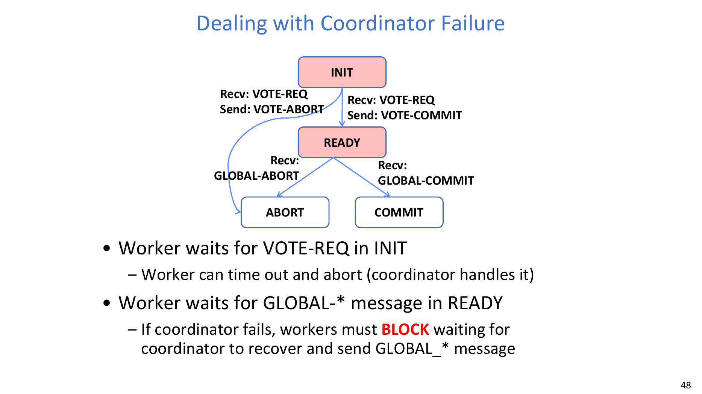

Worker 在 `INIT` 中等待 `VOTE-REQ`。如果 coordinator 在发送 `VOTE-REQ` 之前失败，worker 可以 timeout 并 abort。

但是 worker 在 `READY` 中等待 `GLOBAL-*` message。如果 coordinator 在 worker 已经投出 `VOTE-COMMIT` 后失败，worker 必须 block，等待 coordinator 恢复并发送 `GLOBAL-COMMIT` 或 `GLOBAL-ABORT`。

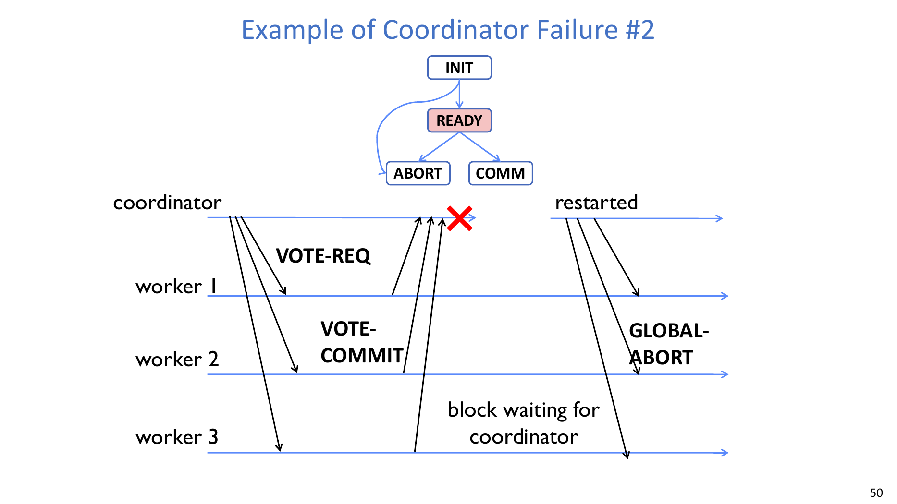

在恢复例子中，一些 workers 已经发送 `VOTE-COMMIT`，其中一个 worker 正在等待 coordinator 而 blocked，coordinator 随后 restart。恢复之后，coordinator 使用自己的 stable log，并发送 final decision，例如 `GLOBAL-ABORT`。

:::remark 问题：为什么 READY worker 不能在 coordinator failure 后直接 abort？
Worker 投出 commit vote 之后，就已经承诺如果 final decision 是 commit，自己必须 commit。Coordinator 可能在 crash 之前已经记录了 `Commit`。如果 worker 单方面 abort，就可能破坏 atomicity。因此 worker 必须等到自己知道 coordinator 的 final decision。
:::

## 31. 2PC 中的 Durability
所有 nodes 都使用 stable storage 存储自己的当前 protocol state。

**Stable storage is non-volatile storage, such as disk-backed storage, that guarantees atomic writes.**

也就是说，stable storage 是能够保证 atomic writes 的 non-volatile storage，例如由 disk 支撑的存储。

例子包括 SSDs 和 NVRAM。恢复之后，nodes 会恢复 state 并继续执行：

| 恢复后的 node state | Action |
|---|---|
| Coordinator 位于 `INIT`、`WAIT` 或 `ABORT` | Abort。 |
| Coordinator 位于 `COMMIT` | Commit。 |
| Worker 位于 `INIT` 或 `ABORT` | Abort。 |
| Worker 位于 `COMMIT` | Commit。 |
| Worker 位于 `READY` | 询问 coordinator final decision。 |

Stable logs 把 crashes 转化为 pauses。恢复中的 node 可以从 durable protocol state 继续，而不是猜测之前发生了什么。

## 32. 讨论：2PC 为什么有效，又为什么会 Blocking
Distributed decision making 是有价值的，因为它提供 fault tolerance。在简单的 fail-stop failure model 下，即使一个或多个 machines 在过程中失败，一组 machines 仍然可以达成 decision。Decision 做出之后，结果会被记录在多个地方。

2PC 不受 Two General's Paradox 约束，因为它并不试图保证 simultaneous action。它关心的是所有 nodes 最终达成同一个 decision。Rebooting and continuing 给系统留下时间去 collect 和 collate decisions。

2PC 的不理想特性是 blocking：

1. Site B 把 `prepared to commit` 写入自己的 log。
2. Site B 向 coordinator Site A 发送 yes vote。
3. Site B crash。
4. Site A 也 crash。
5. Site B 醒来后检查自己的 log，发现自己已经 voted yes。
6. Site B 询问 Site A 到底发生了什么。
7. Site B 不能直接决定 abort，因为 update 可能已经 committed。
8. Site B 会一直 blocked，直到 Site A 返回。

Blocked site 会持有 resources，例如 updated items 上的 locks，以及 pinned 在 memory 中的 pages，直到它知道 update 的 fate。

:::remark 问题：为什么 blocking 是 2PC 简洁性的代价？
2PC 只有一个 coordinator 掌握 final decision。如果 participants 已经 vote commit，但还不知道 final decision，它们就不能安全地单独决定。更高级的 consensus protocols 可以通过复制 decision authority 降低 blocking 风险，但复杂度也更高。
:::

## 33. 总结
重要系统属性包括：

- availability：resource 有多经常可用；
- durability：data 面对 faults 时能被多好地保存；
- reliability：resource 有多经常正确完成工作。

RAID 通过 redundancy 改善 storage reliability，例如 RAID 1 mirroring 和 RAID 5 parity blocks。Copy-on-write 提供 versions 和更简单的 recovery 等更丰富的功能，而且通常性能影响不大，因为向 storage 做 sequential writes 很便宜。Logs 提高 journaled file systems 的可靠性，例如 ext3 和 NTFS。

基于 log 的 transactions 提供了通用方案：

- 先把操作序列 commit 到 durable log，再 update disk；
- log 优先于 disk；
- replay committed transactions，并 discard partial transactions。

Protocol 是多方关于 information 如何被 transmitted 的约定。Two-phase commit 是一种 distributed decision-making protocol：先确认每个人都保证如果被要求 commit 就一定能 commit，然后再要求每个人 commit。

## Exam Review
你应该能够不回看正文就解释以下要点：

1. **Careful ordering 按安全顺序写结构，并通过 recovery 清理未完成操作。**
2. **同时写 data 和 pointer 时，应该先写 data，最后写 pointer。** 没有 pointer 的 data 可以恢复；指向无效 data 的 pointer 更危险。
3. **`fsck` recovery 可能与 disk size 成正比，因为它需要扫描全局 metadata structures。**
4. **Copy-on-write 写入新版本，而不是覆盖旧版本。** Recovery 会保留旧的完整版本，或者新的完整版本。
5. **A transaction is an atomic sequence of reads and writes that takes the system from one consistent state to another.**
6. **银行转账例子需要 atomicity，因为 debit、credit 和 branch-balance updates 必须一起 commit。**
7. **Log 使用 durable append records 让 multi-step operation 可恢复。** 没有 commit 就 discard；有 commit 就 replay 或 keep。
8. **Journaled file systems 把 log 用于 recovery；log-structured file systems 让 data 保持 log form。**
9. **Distributed systems 承诺 availability、durability 和 collaboration，但也制造 coordination、security 和 failure-dependency problems。**
10. **Transparency 隐藏 location、migration、replication、concurrency、parallelism 和 failures 等 distribution details。**
11. **Protocol 定义 communication syntax 和 semantics，通常可以表示为 state machine。**
12. **Two General's Paradox 表明 unreliable messaging 无法创造 guaranteed simultaneous action。**
13. **Two-Phase Commit 解决的是最终在 commit 或 abort 上达成 distributed agreement，而不是 simultaneous action。**
14. **2PC 只有在收到 unanimous `VOTE-COMMIT` 后才 commit；否则 abort。**
15. **已经 voted commit 的 READY worker 在 coordinator failure 时必须 block，因为 final decision 可能已经是 commit。**
