# Lec24 - 文件系统 5：现代计算机系统中的存储与文件系统

## 学习目标
读完这份笔记后，你应该能够把五篇现代存储与文件系统论文讲成完整的系统设计故事，而不是只记住几个孤立技术点。关键能力是：看出每篇论文面对的工作负载压力、提出的核心抽象、支撑抽象的机制，以及最值得被记住的一句话。

五篇论文分别是：

| 主题 | 论文 | 核心系统思想 |
|---|---|---|
| I/O 设备与备份存储 | FAST'08 Dedup | 全局移除重复数据，并让 deduplication 足够快，能够处理大型备份流。 |
| 端到端 I/O 管理 | SOSP'13 IOFlow | 为端到端 storage SLAs 增加 software-defined storage control plane。 |
| 现代分布式文件系统 | SOSP'03 GFS | 围绕大文件、追加写、频繁故障和高吞吐设计文件系统。 |
| RAID 与 erasure coding | OSDI'16 EC-Cache | 在 cluster cache 中使用 erasure coding 来均衡负载、降低延迟。 |
| 面向分布式应用的文件系统技术 | SIGCOMM'01 Chord | 用 consistent hashing 和 finger tables 实现可扩展的 peer-to-peer lookup。 |

:::remark 问题：阅读论文型系统内容时，正确姿势是什么？
应该把每篇论文读成对一个压力点的回答。Dedup 回答备份系统中的存储成本和磁盘瓶颈；IOFlow 回答虚拟化存储栈缺乏端到端控制的问题；GFS 回答持续故障下的大规模文件存储问题；EC-Cache 回答内存缓存中的负载不均衡和尾延迟问题；Chord 回答没有中心目录时如何做去中心化对象查找。机制当然重要，但设计压力解释了为什么机制会长成这个样子。
:::

## 1. FAST'08 Dedup：避免备份存储中的磁盘瓶颈
**最应记住的核心：Deduplication 不只是压缩。它是跨文件、跨时间的全局冗余消除，真正困难的系统问题是如何让全局 duplicate lookup 足够快，同时不把巨大的索引全部放进 RAM。**

关键定义是：

**Deduplication is global compression that removes the redundant segments globally (across many files).**

也就是说，deduplication 是一种全局压缩，它在许多文件之间移除重复 segment。`gzip`、`winzip` 等 local compression 工具只在单个文件内部的小窗口里编码重复字符串。Deduplication 的逻辑窗口大得多，可以跨越许多文件或许多备份版本。因此 local compression 可能只有约 `2-3x`，而 deduplication 在高度冗余的备份工作负载上可以达到约 `10-50x`。

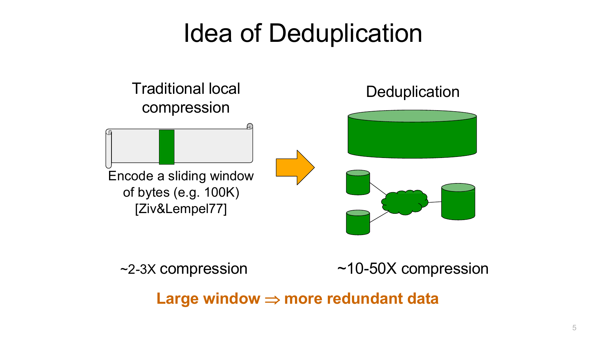

备份数据特别适合 deduplication，因为 full backup 和 incremental backup 会不断包含相同的文件片段。在示例备份流中，`A`、`B`、`C`、`D`、`E`、`F`、`G`、`H` 等 segment 会在第一次 full backup、incremental backups 和第二次 full backup 中重复出现。Deduplicated storage 只保存 unique variable segments，压缩这些 unique segments，并用引用表示重复 segments，而不是再次存储它们的字节。

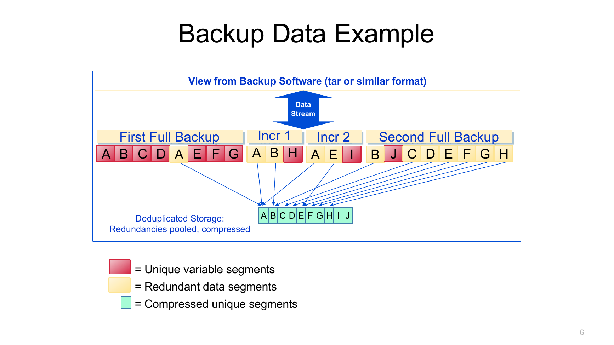

### 1.1 Fingerprinting 与索引瓶颈
基础 deduplication 流程是：

1. 把 data streams 切分成固定大小或可变大小的 segments。
2. 为每个 segment 计算 fingerprint。
3. 在 index 中查找这个 fingerprint。
4. 如果 fingerprint 已经存在，就把 segment 视为 duplicate，只保存引用。
5. 如果 fingerprint 是新的，就把 segment 打包进 container，可选地做 local compression，然后写到磁盘。

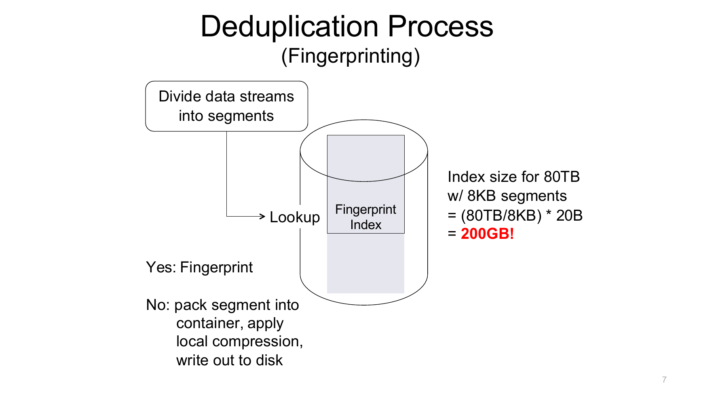

简单设计会制造一个巨大的 index。对于 `80 TB` 数据、`8 KB` segments 和 `20 B` fingerprints，index 大小约为：

$$
\frac{80\text{ TB}}{8\text{ KB}} \times 20\text{ B} \approx 200\text{ GB}.
$$

`200 GB` fingerprint index 很难便宜地全部放入内存。如果每个 segment 都要做一次磁盘索引查找，deduplication 就会变成磁盘瓶颈。

:::remark 问题：为什么 fingerprint index 是核心瓶颈？
Deduplication 必须对每个输入 segment 回答一个全局问题：这些字节以前是否在任何地方出现过？这个问题会变成一次 index lookup。如果每次 lookup 都随机访问磁盘，系统就会受限于磁盘寻道和 I/O 延迟，而不是备份流本身的带宽。论文中的技术大多是在减少不必要的随机索引读取，并让剩余读取具有更好的 locality。
:::

### 1.2 高速 Deduplication 的三项技术
系统组合了三项技术。

| 技术 | 目标 | 机制 | 最该记住什么 |
|---|---|---|---|
| Summary vector | 用尽量少的 RAM 判断数据是否为新。 | 在 RAM 中保留类似 Bloom filter 的已存 segment fingerprint 摘要。 | 如果 summary 说 **no**，segment 一定是新的，因此可以跳过 disk-index lookup。 |
| Stream-informed segment layout | 在磁盘上捕捉 duplicate locality。 | 来自同一 stream 的 segments 存在相同 containers 中；metadata 也放在 containers 中。 | 未来的 duplicates 往往靠近，因为 backup streams 有结构。 |
| Locality Preserved Caching (LPC) | 在 cache 中保持 duplicate locality。 | 缓存 `<fingerprint, containerID>` pairs；miss 时用 disk index 找到 container，并加载该 container 的 metadata。 | Cache replacement 以 container metadata 为单位，而不是以孤立 fingerprint 为单位。 |

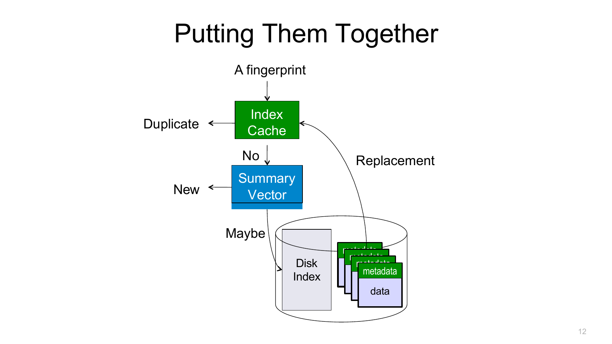

完整 pipeline 是：

1. 一个 fingerprint 先检查 index cache。
2. 如果命中，segment 是 duplicate。
3. 如果 miss，就检查 summary vector。
4. 如果 summary vector 返回 `No`，segment 是新的。
5. 如果 summary vector 返回 `Maybe`，再访问 disk index。
6. Disk-index lookup 找到 container，并把该 container 的 metadata 加载进 cache。
7. 必要时 replacement 会驱逐较旧的 cached metadata。

:::remark 问题：即使 summary vector 可能错误地返回 “maybe”，为什么它仍然有用？
它有用的性质是：否定回答可靠。如果 summary vector 说某个 segment 没有存过，系统就能跳过昂贵的 disk index lookup。False positive 只会让一个新 segment 走到较慢的 “maybe” 路径，产生额外工作，但不会破坏正确性。这样既保留正确性，又减少大量磁盘访问。
:::

### 1.3 真实世界压缩结果
真实 datacenter traces 显示，deduplication 能让 logical capacity 和 physical capacity 之间形成巨大差距。在 Datacenter B 例子中，logical data 增长到许多 TB，而 physical capacity 增长慢得多，cumulative compression ratio 会随时间上升。

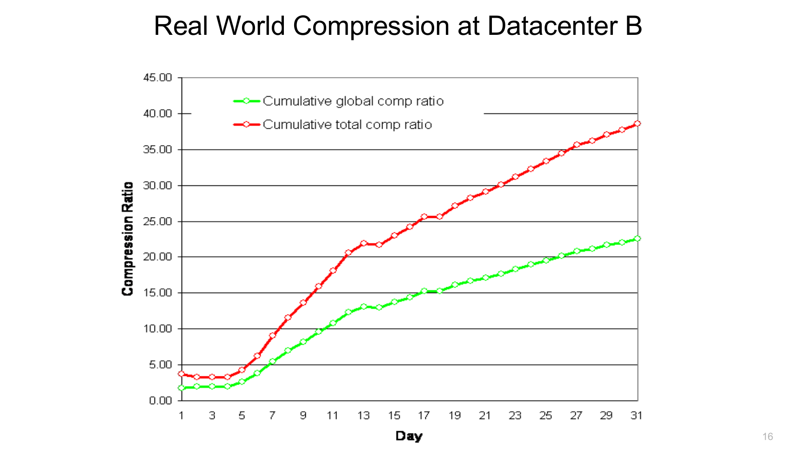

最终结论是：deduplication 成为高度冗余备份数据的事实标准，是因为它降低 cost、power、space，并且经常提升有效性能。工程难点不是发现冗余，而是足够快地发现冗余。

## 2. SOSP'13 IOFlow：Software-Defined Storage Control
**最应记住的核心：IOFlow 把 SDN 中 control plane 和 data plane 分离的思想带入 storage，使端到端 storage SLAs 可以被统一表达，并沿着很深的 I/O path 执行。**

企业 datacenter 会让通用应用运行在许多 VMs 上。Storage 被虚拟化，resources 被共享，I/O 会穿过许多独立配置的层：application、guest OS、file system、malware scanner、hypervisor、I/O manager、drivers、network、storage server、file system、deduplication、caching、scheduling 和 device drivers。

系统希望获得可预测的 application behavior 和 performance。它应当支持端到端 SLAs，例如：

- guaranteed storage bandwidth `B`；
- guaranteed high IOPS and priority；
- 对 I/O path 中每一步决策做 per-application control。

问题在于，如果每一层都独立行动，这样的 SLAs 很难提供。

### 2.1 IOFlow Architecture
IOFlow **decouples the data plane (enforcement) from the control plane (policy logic)**.

也就是说，IOFlow 把负责执行的 data plane 和负责策略逻辑的 control plane 分离。

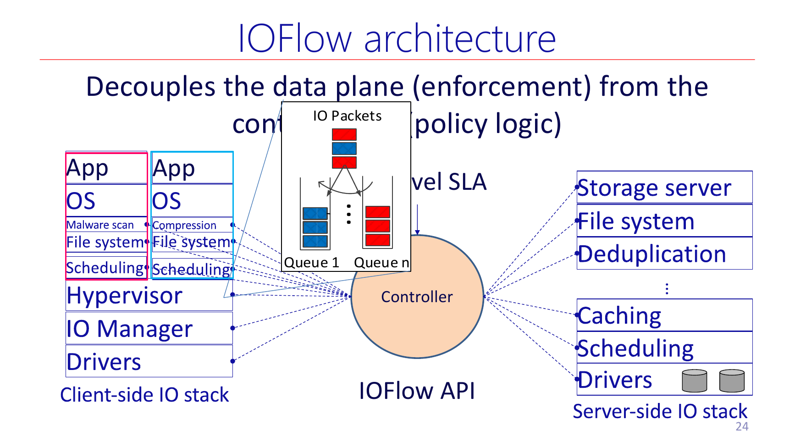

Data plane 包含放置在 client-side 和 server-side storage stack 上的 programmable queues。Control plane 包含一个 centralized controller，它通过 IOFlow API 安装规则。

主要贡献包括：

- 定义并构建 storage control plane；
- 在 data plane 中提供 controllable queues；
- 提供 control plane 和 data plane 之间的接口，即 IOFlow API；
- 构建 centralized control applications，展示架构能力。

### 2.2 Storage Flows 与 IOFlow API
关键抽象是 storage flow：

**Storage "Flow" refers to all IO requests to which an SLA applies.**

也就是说，storage flow 是所有适用同一个 SLA 的 I/O requests。

一个 flow 可以表示为：

$$
\langle \{VMs\}, \{File\ Operations\}, \{Files\}, \{Shares\} \rangle \rightarrow SLA.
$$

例子包括：

- `<{VM 1-100}, write, *, \\share\db-log> -> high priority`；
- `<{VM 1-100}, *, *, \\share\db-data> -> min 100,000 IOPS`；
- `<VM 1, *, *, \\share\dataset> -> bypass malware scanner`。

IOFlow API 通过三类函数编程 data-plane queues：

1. **Classification**：`[IO Header -> Queue]`。
2. **Queue servicing**：`[Queue -> <token rate, priority, queue size>]`。
3. **Routing**：`[Queue -> Next-hop]`。

困难在于 storage traffic 在不同层之间通常没有统一 I/O header。VM 可能把一个文件识别为 `\\share\dataset`，而更低层只能看到 `\\serverX\AB79.vhd` 这样的 VHD 或 block device。IOFlow 通过 controller 做 flow name resolution：例如 SMBc 暴露自己理解的 header，controller 再把高层 SLA 翻译成正确层上的 queueing rules。

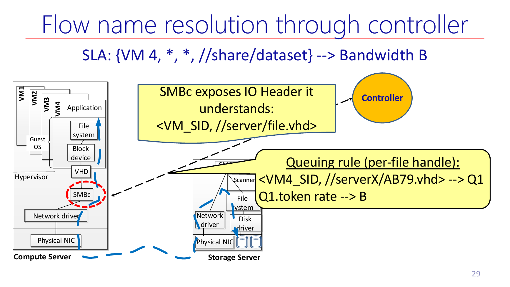

### 2.3 Rate Limiting 必须基于 Cost
简单地用 payload bytes 做 token bucket 不够。两个 VMs 都可能发出 `8 KB` 请求，但 `8 KB` reads 和 `8 KB` writes 消耗的 storage resources 可能不同。按 IOPS 限速也不够：一个 `64 KB` read 和一个 `8 KB` write 都算一次 operation，但成本可能差很多。

正确单位是 operation cost。IOFlow 使用 controller 构建的 empirical cost models，这些模型基于 device type 和 workload characteristics：

- RAM、SSD 和 disk 有不同 cost curves；
- read/write ratio 会影响成本；
- request size 会影响成本；
- large requests 可以被 split，从而支持 preemption。

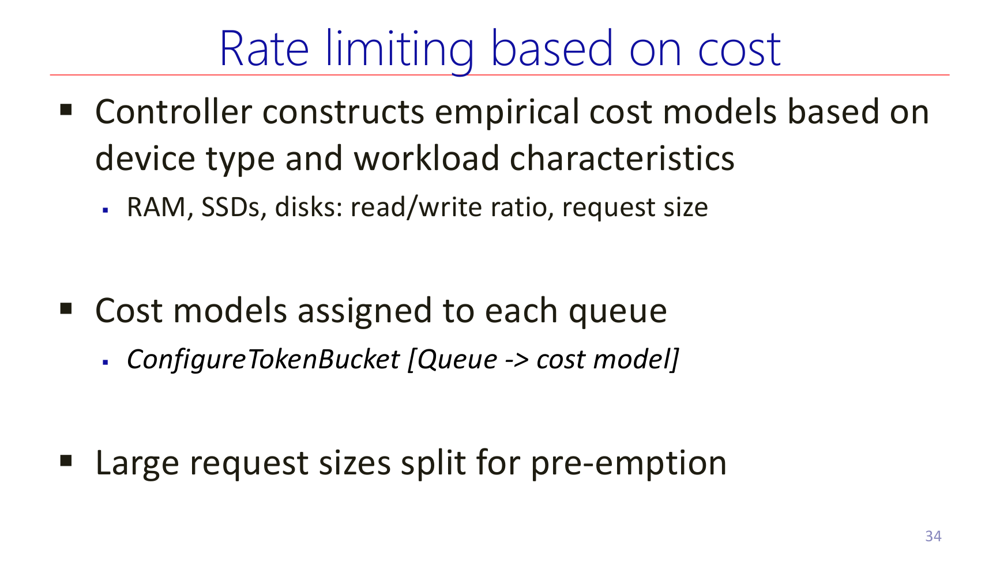

:::remark 问题：为什么 payload bytes 和 IOPS 都不适合作为 storage 限速单位？
Payload bytes 忽略了相同字节数的不同操作可能给设备带来不同工作量。IOPS 忽略了相同操作数的请求可能大小不同、读写行为不同。Storage congestion control 需要 cost model，因为稀缺资源不是简单的 bytes 或 operations，而是 device-specific service time 和干扰。
:::

### 2.4 Controller-Based Max-Min Fair Sharing
对于具有 aggregate bandwidth SLA 的 tenant，把带宽静态切给每个 VM 是次优的。如果某些 VMs 空闲，活跃 VMs 应该能够使用未用预算，只要 aggregate rate 不超过 tenant allocation。

IOFlow 使用 centralized controller 实现 max-min fair sharing。

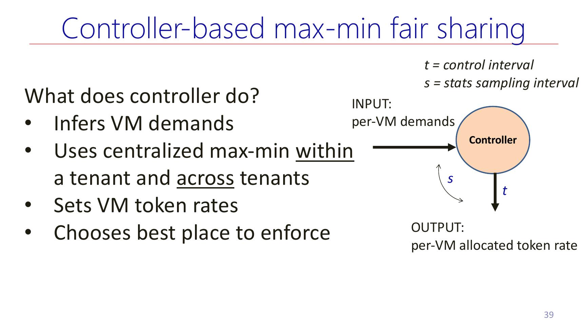

Controller 按周期工作：

1. 在 statistics sampling interval `s`，收集 per-VM demand information。
2. 在 control interval `t`，计算 tenant 内部以及 tenants 之间的 max-min allocations。
3. 设置 per-VM token rates。
4. 选择最佳 enforcement location，减少 I/O 被排队的次数，并分散 rate-limiting load。

:::remark 问题：controller 如何执行 aggregate SLA？
它不是简单地把 SLA 平均分给每个 VM。它会推断每个 VM 的 demand，在 aggregate tenant limit 下计算公平分配，并把 token rates 写入合适的 queues。这样，当某个 tenant 空闲时可以实现 inter-tenant work conservation；当某个 tenant 内部有 VMs 空闲时，也可以实现 intra-tenant work conservation。
:::

### 2.5 Evaluation 与结论
Bandwidth-SLA 实验使用四个 tenants，并给出不同 minimum storage bandwidth：

| Tenant | SLA |
|---|---|
| Red | `{VM1-30} -> Min 800 MB/s` |
| Green | `{VM31-60} -> Min 800 MB/s` |
| Yellow | `{VM61-90} -> Min 2500 MB/s` |
| Blue | `{VM91-120} -> Min 1500 MB/s` |

Red tenant 是 aggressive tenant，会产生更多 requests per second。结果显示，controller 能检测到 Red 的行为，配置 `120` 个 queues，执行 tenants 的 SLAs，并提供 intra-tenant 和 inter-tenant work conservation。

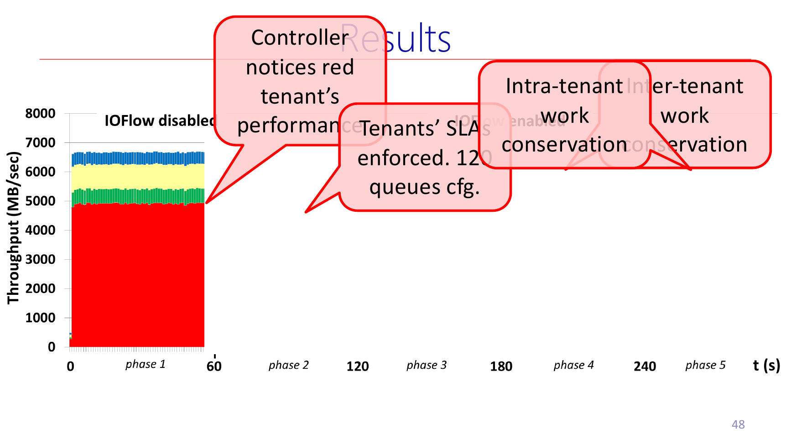

Overheads 是合理的：在 `40 Gbps` RDMA 下，data-plane overhead 很小；controller 的 control-plane CPU overhead 小于 `0.3%`。

结论是：software-defined storage 中的 centralized control 简化了算法，因为 controller 可以专注于 SLA enforcement，而不是让每个决策都依赖 decentralized congestion signaling。

## 3. SOSP'03 GFS：The Google File System
**最应记住的核心：GFS 的成功来自拒绝通用文件系统假设，直接围绕 Google 的工作负载设计：超大文件、频繁故障、追加为主、高持续吞吐。**

GFS 的动机来自几个工作负载事实：

- Node failures 经常发生。
- Files 很大，经常是 multi-GB。
- 大多数 files 通过在末尾 append 来修改。
- Random writes 和 overwrites 几乎不存在。
- High sustained bandwidth 比 low latency 更重要。
- 许多 clients 可能并发 append 到同一个 file，例如 producer-consumer queues 或 many-way merge jobs。

GFS 不遵循完整 POSIX，但支持常见文件系统操作，如 `create`、`delete`、`open`、`close`、`read` 和 `write`。它还增加了：

- `snapshot`：低成本创建 file 或 directory tree 的 copy；
- `record append`：允许多个 clients 并发 append 到同一个 file，至少第一次 append 被保证是 atomic。

:::remark 问题：为什么 GFS 不完全 POSIX-compliant 是合理的？
如果目标工作负载不需要完整 POSIX 语义，系统可以通过放弃通用性获得重要简化和性能收益。GFS 面向 append-heavy、large-file、throughput-oriented 的批处理工作负载。对于这些工作负载，record append 这样的专用接口比高效任意小写覆盖更有价值。
:::

### 3.1 Architecture：分离 Control Flow 与 Data Flow
最重要的架构点是：

**Data flow is decoupled from control flow.**

Clients 会向 master 请求 metadata operations，但读写 file data 时直接与 chunkservers 交互。

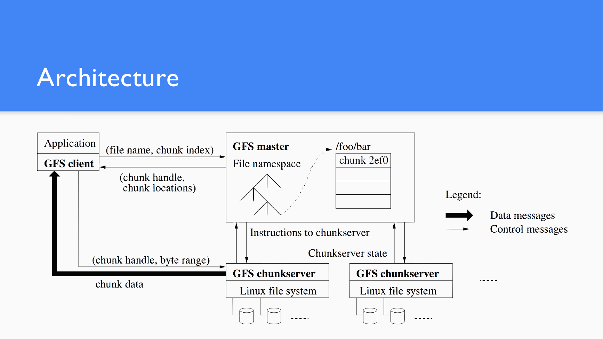

图中的过程是：

- application 使用 GFS client；
- client 用 `(file name, chunk index)` 询问 GFS master；
- master 返回 `(chunk handle, chunk locations)`；
- client 用 `(chunk handle, byte range)` 直接访问 chunkservers；
- 粗箭头表示 data messages，细箭头表示 control messages。

这种设计让 master 不进入重数据路径，并允许系统根据 network topology 调度昂贵的数据流。

### 3.2 Master、Operation Log、Chunks 与 Chunkservers
Master 负责系统级活动，例如 chunk leases、storage reclamation 和 load balancing。它维护 metadata，包括 namespaces、ACLs、files 到 chunks 的映射，以及 chunks 当前位置。Namespace 和 file-to-chunk mappings 会持久化存储在 operation log 中。

Operation log 是 metadata 的唯一持久记录。它还定义 concurrent operations 的 serialized order。Master 通过 replay log 恢复状态，并周期性 checkpoint log 来减少启动时间。

Files 被划分为 fixed-size chunks，每个 chunk 有不可变、全局唯一的 `64-bit` chunk handle。默认情况下，每个 chunk 在多个 chunkservers 上复制三份。Chunkservers 把 chunks 作为 Linux files 保存在本地磁盘上。

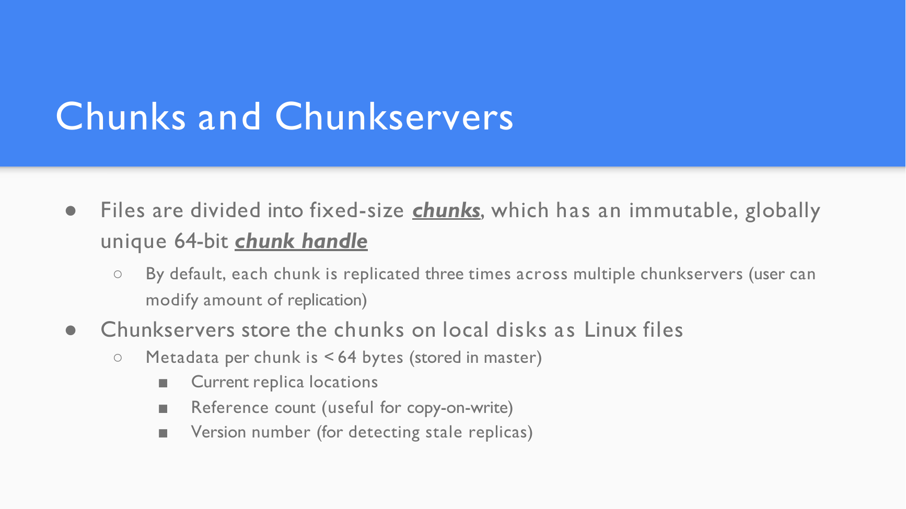

Master 中保存的 per-chunk metadata 小于 `64 bytes`，包括：

- current replica locations；
- reference count，用于 copy-on-write；
- version number，用于检测 stale replicas。

### 3.3 Chunk Size：64 MB
GFS 使用 `64 MB` chunks，远大于普通文件系统。这个选择同时有代价和收益。

| 方面 | 影响 |
|---|---|
| 缺点 | Internal fragmentation 可能浪费空间。 |
| 缺点 | Small files 可能只有少量 chunks，因此大量 clients 会把流量集中在这些 chunks 上。提高 replication factor 可以缓解。 |
| 优点 | Clients 与 master 交互更少，因为很多 reads/writes 会留在同一个 chunk 内。 |
| 优点 | 与 chunkserver 保持 persistent TCP connection 可以降低网络开销。 |
| 优点 | Master metadata 变小，可以全部保存在内存中。 |

:::remark 问题：为什么 single master 可以接受，而不必然成为瓶颈？
Master 拥有全局知识，因此能大幅简化 placement、leases 和 metadata management。它不会成为 data bottleneck，因为 clients 不通过 master 读写 file data。Master 只告诉 clients 应该联系哪些 chunkservers，之后同一 chunk 上的操作甚至不需要再次联系 master。
:::

### 3.4 Write Flow 与 Primary Lease
当 client 修改一个 chunk 时，master 会给其中一个 replica 授予 chunk lease。这个 replica 成为 primary，其他 replicas 成为 secondaries。Primary 决定 modifications 的 serialization order，secondaries 按同样顺序应用。

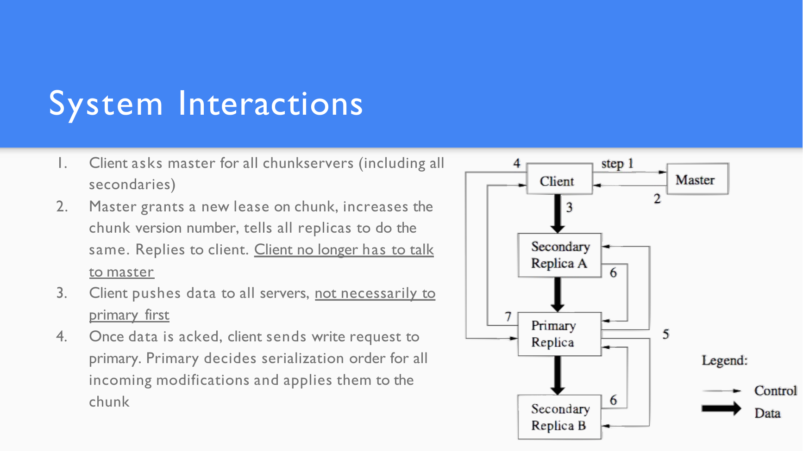

流程前半部分是：

1. Client 向 master 询问持有该 chunk 的所有 chunkservers，包括 secondaries。
2. Master 授予新的 lease，增加 chunk version number，让所有 replicas 做同样更新，并回复 client。
3. Client 把 data push 到所有 replicas；不必先 push 到 primary。
4. Data 被 ack 后，client 向 primary 发送 write request。Primary 分配 serialization order，并应用修改。

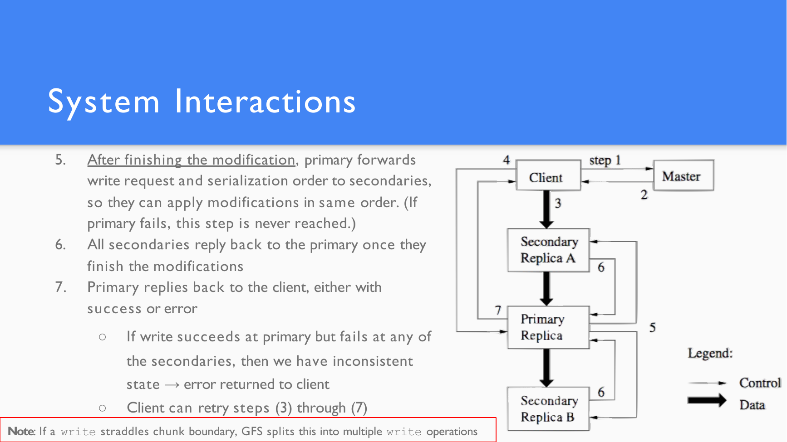

流程后半部分是：

5. Primary 把 write request 和 serialization order 转发给 secondaries。
6. Secondaries 按该顺序应用 modification，并回复 primary。
7. Primary 向 client 返回 success 或 error。

如果 primary 成功但任何 secondary 失败，replicas 就会进入 inconsistent state，因此 client 会收到 error。Client 可以从 data-push step 到 final reply step 重新尝试。如果一次 write 跨越 chunk boundary，GFS 会把它拆成多个 write operations。

:::remark 问题：为什么 client 先把 data 发给所有 replicas，再让 primary 排序？
这是把 data movement 和 control ordering 分离。大数据传输可以在 replicas 之间 pipeline，而不必等待 primary 先序列化操作。当所有 replicas 已经有了 bytes，primary 只需要规定顺序，并告诉 replicas 如何应用已经收到的数据。
:::

### 3.5 GFS Legacy
更广义的结论和 IOFlow 类似：分离 data plane 和 control plane。

- Control plane：centralized single master。
- Data plane：distributed chunkservers。

这种模式影响了后续系统。在 Google 生态中，GFS 对应 BigTable 和 MapReduce。在 Hadoop 生态中，对应系统包括 HDFS、HBase、Hadoop，以及后来的 Spark。

## 4. OSDI'16 EC-Cache：用于 Cluster Caching 的 Erasure Coding
**最应记住的核心：EC-Cache 把 erasure coding 用于 in-memory cache 的 read performance 和 load balancing，而不主要是 fault tolerance。真正惊喜的点是：coding 可以是 latency 和负载均衡工具。**

Data-intensive clusters 依赖 distributed, in-memory caching，因为从 memory 读取比从 disk 或 SSD 读取快得多。然而，clusters 经常出现 imbalance，来源包括：

- object popularity skew；
- background network imbalance；
- failures 和 unavailabilities。

负面影响是 load imbalance 和 high read latency。单份 in-memory copy 往往不足以获得好性能。

Selective replication 是常见方法：根据对象 popularity 缓存更多 replicas。这能改善 read performance，但 memory overhead 只能按整数副本增加。一个热门对象可能需要 `2x`、`3x` 或更多 copies。

EC-Cache 的目标是在更低或更细粒度控制的 memory overhead 下获得更好的 read performance 和 load balance。

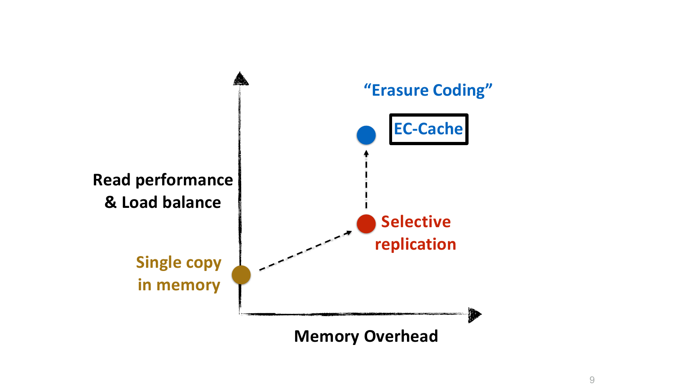

### 4.1 Erasure Coding Primer
Erasure coding 接收 `k` 个 data units，并创建 `r` 个 parity units。关键性质是：

**Any k of the (k+r) units are sufficient to decode the original k data units.**

也就是说，在总共 `k+r` 个 units 中，任意 `k` 个就足以解码原始 `k` 个 data units。

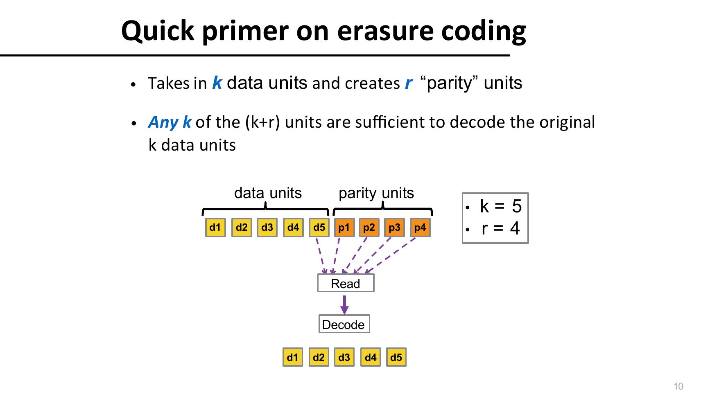

例如，当 `k = 5`、`r = 4` 时，对象由 `5` 个 data units 和 `4` 个 parity units 表示。总共 `9` 个 units 中任意 `5` 个都可以恢复原始数据。

### 4.2 EC-Cache Write 与 Read Path
写入时，一个 object 被 split 成 `k` 个 data units，再 encode 出 `r` 个 parity units，随后把 `k+r` 个 units 缓存在随机选择的 distinct servers 上。

读取时，EC-Cache 从对象的 `k + Δ` 个 units 中随机读取，使用最先到达的 `k` 个 units，decode data units，然后 combine 得到 object。

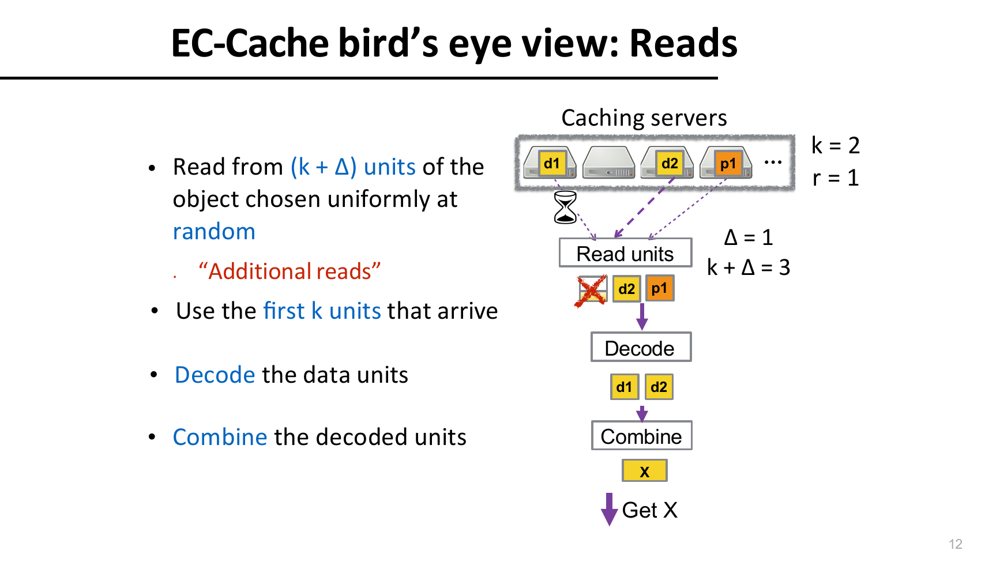

在图中的 read example 中，`k = 2`，`r = 1`，`Δ = 1`，因此 client 读取 `k + Δ = 3` 个 units。如果其中一个 unit 很慢，最先到达的两个 units 已经足够 decode 并 combine 出 object `X`。

:::remark 问题：为什么 EC-Cache 要读取 `k + Δ` 个 units，而不是正好读取 `k` 个？
正好读取 `k` 个 units 会制造 straggler problem：请求必须等待所选 `k` 个 units 中最慢的一个。读取 `k + Δ` 个 units 会带来少量额外带宽开销，但系统可以忽略最慢响应，只使用最先到达的 `k` 个。结果是 tail latency 大幅改善；实验显示 `Δ = 1` 通常已经足够。
:::

### 4.3 Erasure Coding 如何帮助 Cache
Erasure coding 通过四种方式帮助 EC-Cache。

1. **更细粒度地控制 memory overhead。** Selective replication 只能做整数控制，而 erasure coding 可以做分数控制。`k = 10` 时，overhead 可以以 `0.1` 为单位调节。
2. **Object splitting 帮助 load balancing。** 更小粒度的 reads 可以更平滑地分散负载。在一个简化模型下：

$$
\frac{\operatorname{Var}(L_{EC\text{-}Cache})}{\operatorname{Var}(L_{Selective\ Replication})} = \frac{1}{k}.
$$

3. **Object splitting 降低 median latency，但可能伤害 tail latency。** 并行读取可以降低 median latency，但如果没有 additional reads，等待所有必需 units 会产生 straggler effect。
4. **“any k out of (k+r)” 性质降低 tail latency。** 读取 `k + Δ` 个 units，并使用最先到达的 `k` 个。`Δ = 1` 通常足够。

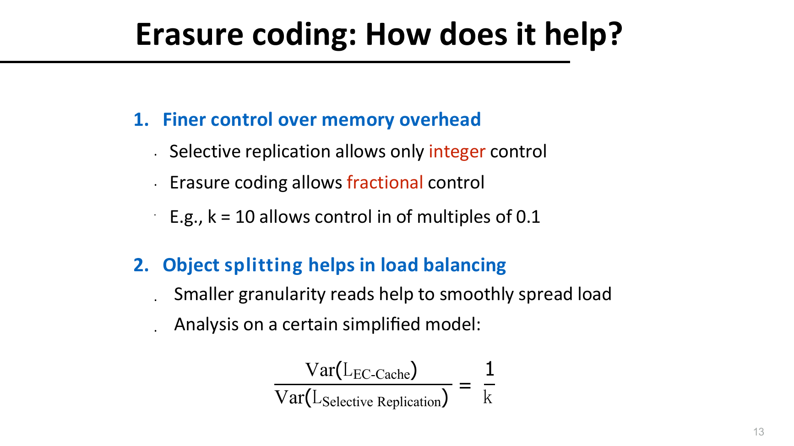

### 4.4 与 Storage Erasure Coding 的设计差异
Storage systems 中的 erasure coding 通常用于 space-efficient fault tolerance。EC-Cache 则用它降低 read latency、均衡 load。

| 设计问题 | Storage systems | EC-Cache |
|---|---|---|
| 目的 | Space-efficient fault tolerance。 | Read latency reduction 和 load balancing。 |
| Code choice | 常优化 reconstruction operations 的资源使用。有些 codes 不提供 “any k out of k+r” 性质。 | 需要 “any k out of k+r” 性质，因为它能帮助 load balance 和 latency。 |
| Encoding scope | 可以 across objects，也可以 within objects。 | 需要 within objects，从而把 load 分散到 data 和 parity units 上。 |
| Fault tolerance | Encoding choices 会影响 fault tolerance。 | Fault tolerance 由 underlying storage 负责；cache 关注 read performance。 |

实现上，EC-Cache 构建在 Alluxio 之上。Backend caching servers 不知道 erasure coding；EC-Cache client library 处理所有 read/write logic。系统使用 Reed-Solomon codes 和 Intel ISA-L acceleration。

### 4.5 Evaluation Results
Evaluation 使用 Amazon EC2、`25` 个 backend caching servers、`30` 个 client servers、Zipf-distributed object popularity、`k = 10` 和 `Δ = 1`，带来 `10%` bandwidth overhead。

Load-balancing 结果使用 percent imbalance metric：

$$
\lambda = \frac{L_{max} - L_{avg}}{L_{avg}} \times 100.
$$

Selective replication 的 `λ_SR = 43.45%`，EC-Cache 的 `λ_EC = 13.14%`，超过 `3x` reduction。

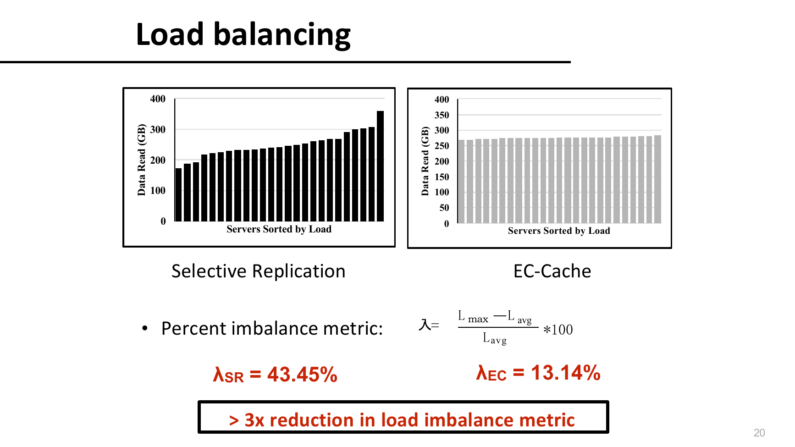

Read latency 也得到改善。在一个结果中，median latency 改善 `2.64x`，`99th` 和 `99.9th` percentiles 约改善 `1.75x`。

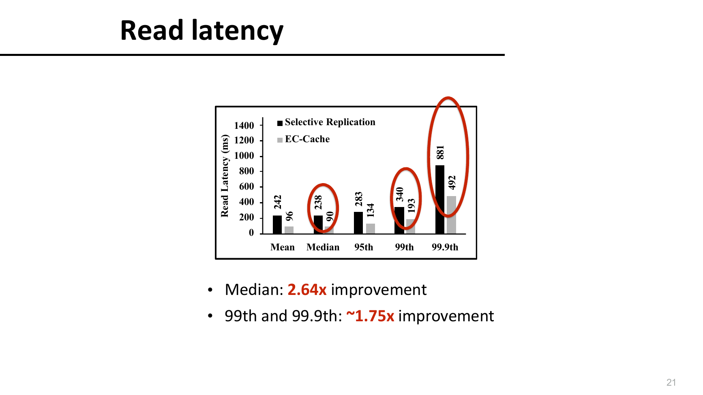

对于更大的 objects，改善更明显：对于 `100 MB` objects，median latency 改善 `5.5x`，tail latency 改善 `3.85x`。Additional reads 对 tail latency 很关键；如果没有 additional reads，即 `Δ = 0`，EC-Cache 的 tail latency 会显著退化。

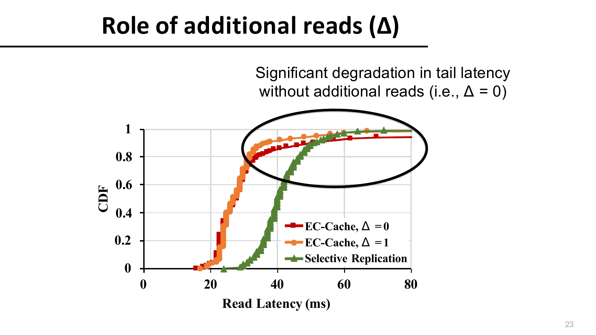

总结结果是：

- load balancing：超过 `3x` improvement；
- median latency：超过 `5x` improvement；
- tail latency：超过 `3x` improvement。

## 5. SIGCOMM'01 Chord：Scalable Peer-to-Peer Lookup
**最应记住的核心：Chord 把去中心化 lookup 变成 structured routing problem：consistent hashing 把 keys 分配给 successor nodes，finger tables 让 lookup 只需 `O(log N)` messages，并且每个 node 只保存 `O(log N)` state。**

问题很简单：如何在 distributed file-sharing system 中找到数据？如果 publisher 在 node `N1` 上发布 key `"LetItBe"`，value 是 `MP3 data`，client 在 `N5` 上执行 `Lookup("LetItBe")`，系统就必须找到负责这个 key 的 node。

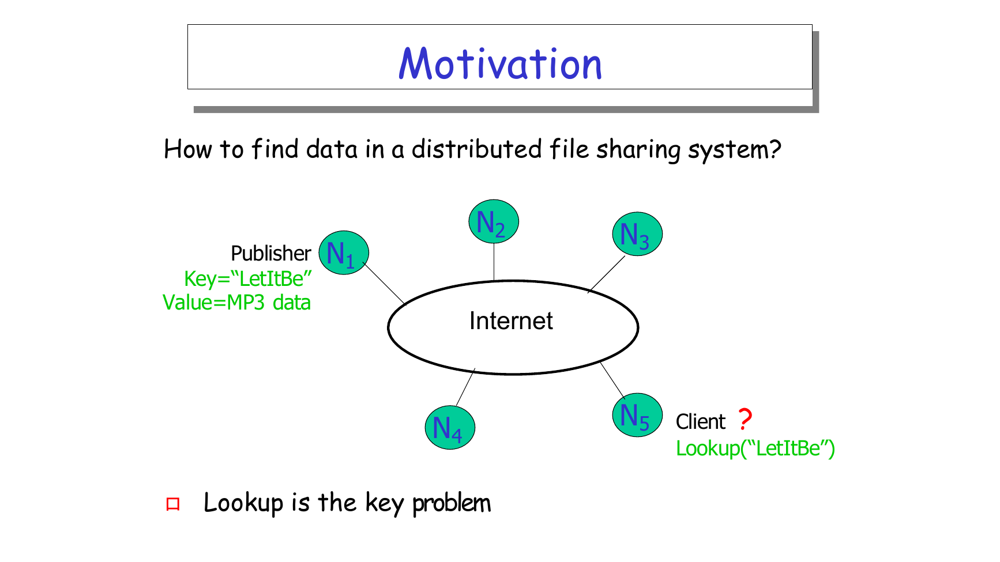

### 5.1 为什么不用 Centralized 或 Flooding？
Centralized directory，例如 Napster，用 central database 把 keys 映射到 locations。它 lookup 快，但 central server 需要 `O(M)` state，并且是 single point of failure。

Naive distributed solution，例如 Gnutella 的 flooding，会把 lookup messages 广泛广播。它避免了中心服务器，但 worst case 每次 lookup 可能需要 `O(N)` messages。

Chord 使用 routed messages。它希望：

- 定义有用的 key-nearness metric；
- 保持 hop count 小；
- 保持 routing tables 大小合适；
- 在 membership 快速变化时仍然 robust。

### 5.2 Chord Properties 与 Identifiers
Chord 提供 peer-to-peer hash lookup service：

$$
Lookup(key) \rightarrow IP\ address.
$$

Chord 本身不存储 data。它只把 key 映射到负责该 key 的 node。

它的性质是：

- Efficient：每次 lookup 需要 `O(Log N)` messages。
- Scalable：每个 node 保存 `O(Log N)` state。
- Robust：能够承受大量 membership changes。
- Assumption：没有 malicious participants。

Chord 对 keys 和 nodes 使用同一个 `m`-bit identifier space：

- key identifier = `SHA-1(key)`；
- node identifier = `SHA-1(IP address)`；
- 二者都近似 uniformly distributed。

### 5.3 Consistent Hashing 与 Successors
Chord 把 node IDs 和 key IDs 放在一个 circular identifier space 上。关键规则是：

**A key is stored at its successor: node with next higher ID.**

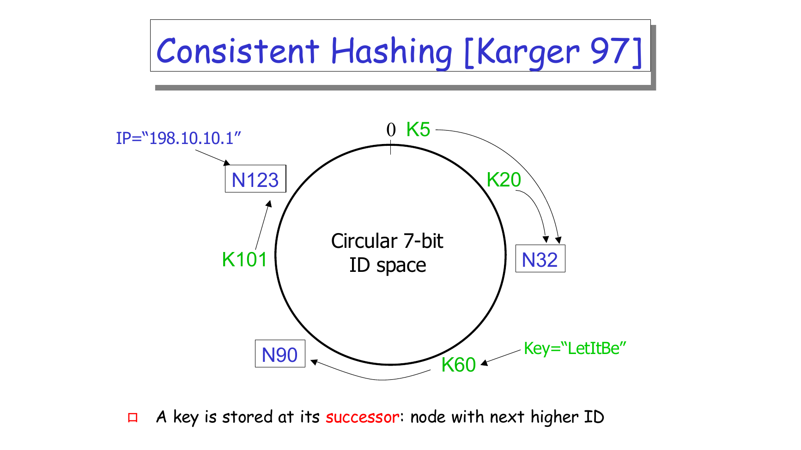

在例子中，key `"LetItBe"` hash 到 `K60`。环上 next higher node ID 是 `N90`，因此 `K60` 存在 `N90`。

:::remark 问题：Chord 如何把 key IDs 映射到 node IDs？
把 keys 和 nodes 都 hash 到同一个 circular identifier space 中。然后把每个 key 分配给从该 key ID 顺时针方向遇到的第一个 node，这个 node 就是该 key 的 successor。这个规则简单、确定，并且当 nodes join 或 leave 时只造成局部变化。
:::

### 5.4 Basic Lookup 与 Finger Tables
如果每个 node 都知道所有其他 nodes，routing tables 是 `O(N)`，lookup 是 `O(1)`。如果每个 node 只知道 immediate successor，routing state 很小，但 lookup 可能沿环走 `O(N)` hops。

Finger tables 是折中方案。每个 node 保存 `m` 个 finger entries，并且距离按指数增长。关键规则是：

$$
\text{finger}_i(n) = successor(n + 2^i).
$$

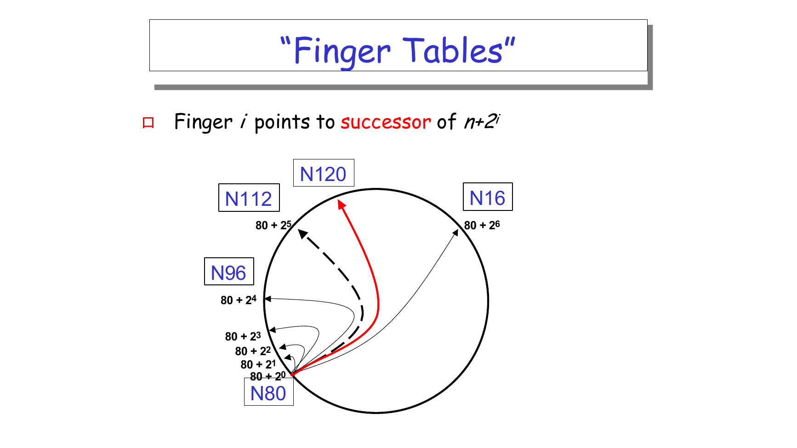

有了这些 fingers，每一跳都可以显著接近目标 key。Lookup 因此需要 `O(log N)` hops。

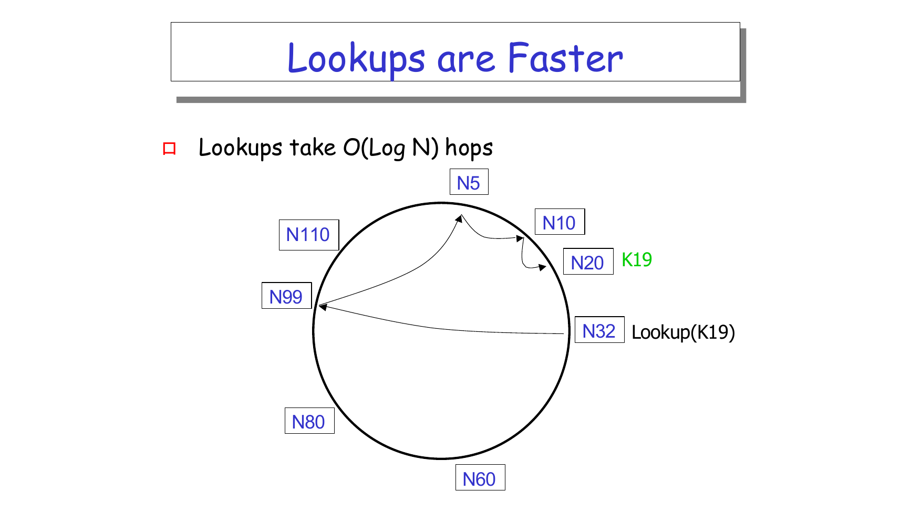

:::remark 问题：为什么指数间隔的 fingers 能带来 logarithmic lookup？
一个 node 可以把 query 转发给它知道的、最接近但不超过 target ID 的 finger。这样通常会削减剩余 identifier distance 的很大一部分。不断缩小剩余距离，就得到 logarithmic hop count，类似在 circular key space 上做 binary search。
:::

### 5.5 Joining the Ring
加入 ring 有三个概念步骤：

1. 初始化 new node 的所有 fingers。
2. 更新 existing nodes 的 fingers。
3. 从 successor 向 new node transfer keys。

较保守的 lazy mechanism 只初始化指向 successor node 的 finger，周期性验证 immediate successor 和 predecessor，并周期性 refresh finger-table entries。

在例子中，新节点 `N36` 加入。它请求某个已有节点查找自己的 finger targets，例如 `37`、`38`、`40`、...、`100`、`164`。已有节点更新 finger entries，successor `N40` 把范围 `21..36` 内的 keys 转移给 `N36`。

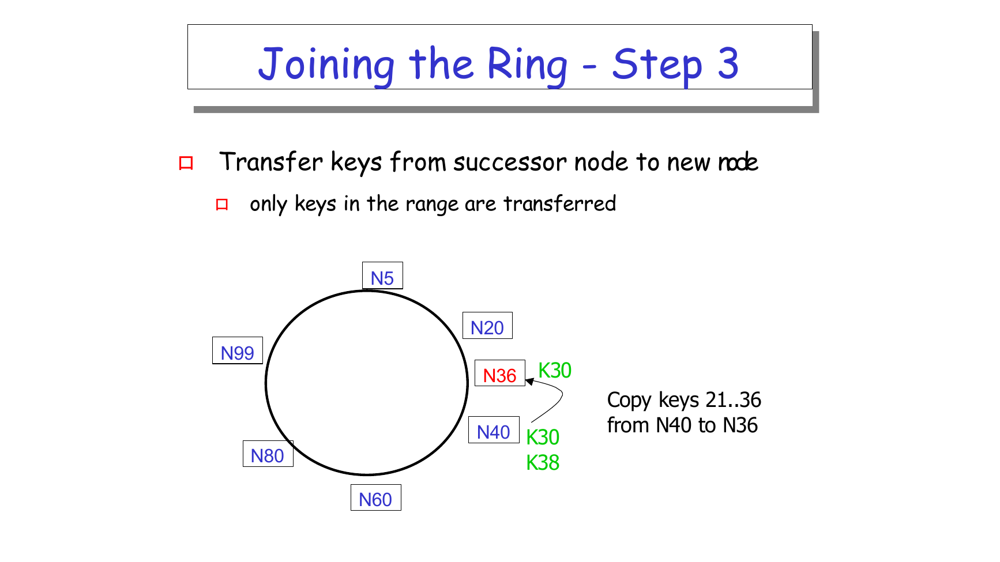

Chord 的 evaluation 确认理论结果：lookup cost 随 `O(log N)` 增长。这篇论文被记住，是因为它是 peer-to-peer networks 中的开创性工作，把理论和实践优雅连接起来。后续 distributed hash tables 影响了 Amazon Dynamo 等 key-value stores，也影响了 blockchain 等去中心化应用。

## 6. 跨论文综合
这五篇论文共享一个设计模式：现代存储系统的胜利，来自为瓶颈选择正确的控制点。

| 论文 | 瓶颈或压力 | 控制点 | 核心教训 |
|---|---|---|---|
| Dedup | 巨大全局 duplicate index 带来的磁盘瓶颈。 | Summary vector、stream layout、LPC。 | Global compression 需要 locality-aware indexing。 |
| IOFlow | 深存储栈中缺乏端到端 SLA enforcement。 | Centralized controller 加 programmable queues。 | Storage 需要 control plane，而不只是更快设备。 |
| GFS | 大文件、append、故障、高吞吐。 | Single master 管 metadata；chunkservers 管 data。 | 文件系统应专门针对工作负载假设设计。 |
| EC-Cache | Cache load imbalance 和 tail latency。 | Erasure-coded object units 加 additional reads。 | Coding 不仅能提升 durability，也能提升 latency。 |
| Chord | 没有中心瓶颈的 decentralized lookup。 | Consistent hashing 加 finger tables。 | Structured routing 用小状态换来可扩展性。 |

:::remark 问题：这些论文能和经典文件系统技术比较吗？
可以。Dedup 把 compression 和 indexing 扩展到全局备份流。IOFlow 把 policy 与 mechanism 分离推广成 storage control plane。GFS 在 cluster scale 重新使用 metadata/data separation。EC-Cache 把 erasure coding 从 reliability 重新解释为 performance 技术。Chord 把 directory lookup 变成可扩展的 distributed naming problem。每篇论文都把旧系统思想移动到了更大规模或不同瓶颈处。
:::

## 7. 最应记住什么
如果每篇论文只记一句话，记住这些：

1. **Dedup**：Global deduplication 之所以强大，是因为 backup streams 会跨文件、跨时间重复数据；难点是避免在巨大 fingerprint index 上做随机磁盘查找。
2. **IOFlow**：End-to-end storage SLAs 需要 storage control plane，能够沿 I/O path 编程 queues。
3. **GFS**：如果 data path 是分布式的，并且工作负载是大文件、append-heavy、throughput-oriented，那么 single metadata master 可以工作。
4. **EC-Cache**：Erasure coding 可以作为 cache performance 工具，通过拆分对象、分散负载、读取额外 coded units 来避开 stragglers。
5. **Chord**：Consistent hashing 加 finger tables 可以用 `O(log N)` messages 和 `O(log N)` state 实现 decentralized lookup。

## Exam Review
你应该能够不回看正文就解释以下要点：

1. **Deduplication 是跨许多文件的 global compression**，而 local compression 只在一个文件内部的小窗口中工作。
2. Dedup index 可能非常大：`80 TB / 8 KB * 20 B ≈ 200 GB`。
3. Summary vectors 避免许多 disk index lookups；stream-informed layout 和 LPC 保留 duplicate locality。
4. IOFlow 的中心思想是把 storage data-plane enforcement 和 control-plane policy logic 分离。
5. Storage flow 形式为 `<{VMs}, {File Operations}, {Files}, {Shares}> -> SLA`。
6. 按 bytes 或 IOPS 做 storage rate limiting 都不够；需要 cost-based rate limiting。
7. Controller-based max-min fair sharing 在 tenants 内部和 tenants 之间提供 work conservation。
8. GFS 面向 frequent failures、huge files、appends 和 high sustained bandwidth。
9. GFS 使用 single master 管 metadata，使用 distributed chunkservers 管 data。
10. GFS write ordering 使用 primary replica lease；primary 序列化 modifications，secondaries 按同样顺序执行。
11. Erasure coding 从 `k` 个 data units 创建 `r` 个 parity units，`k+r` 个 units 中任意 `k` 个都能 decode data。
12. EC-Cache 主要把 erasure coding 用于 load balancing 和 latency，而不是 fault tolerance。
13. 读取 `k+Δ` 个 units 并使用最先到达的 `k` 个可以降低 tail latency；`Δ=1` 通常足够。
14. Chord 把 keys 和 nodes 映射到同一个 circular ID space，并把每个 key 存在 successor。
15. Chord finger tables 使用 `successor(n+2^i)` 实现 `O(log N)` lookup hops。
