# Lec3 - 抽象 1：线程与进程

## 学习目标
学完本讲后，你应当能够解释为什么线程是操作系统中的并发抽象，分析交错执行与竞态条件，掌握锁/信号量的典型用法，并在清晰的状态变化模型下使用核心进程/线程 API（`pthread_*`、`fork`、`exec`、`wait`、`kill`、`sigaction`）。

## 1. 起点：四个核心概念与 Base-and-Bound

### 1.1 四个基础 OS 概念快速回顾
本讲从四个锚点出发：
- **Thread**：执行上下文。
- **Address Space w/ translation**：程序可见地址需要翻译并受保护。
- **Process**：具有受限权限的运行环境。
- **Dual Mode / Protection**：只有系统态可以访问特权资源。

### 1.2 Base-and-Bound（B&B）：两种实现方式
一个具体的保护机制是 Base-and-Bound，常见有两种实现方式：

- **装载期重定位（Load-time relocation）**：程序装入时完成地址翻译。
- **运行期在线翻译（On-the-fly translation）**：执行期间每次访问都检查并翻译。

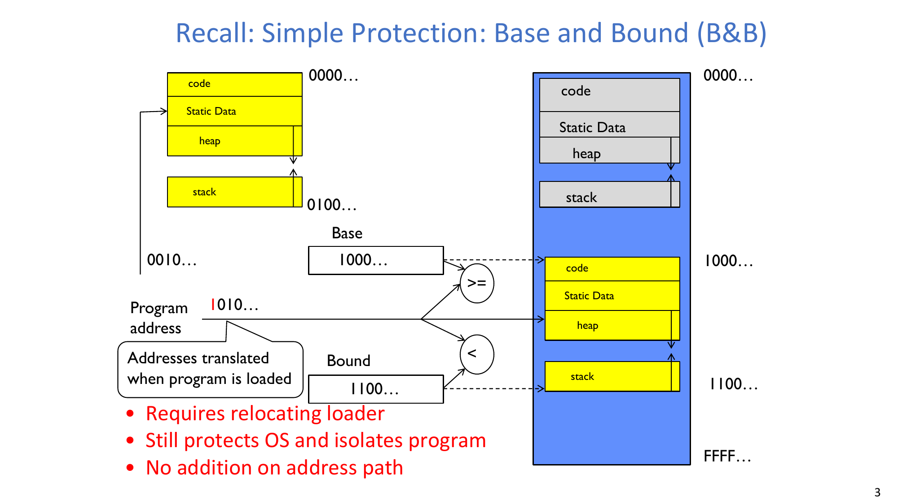

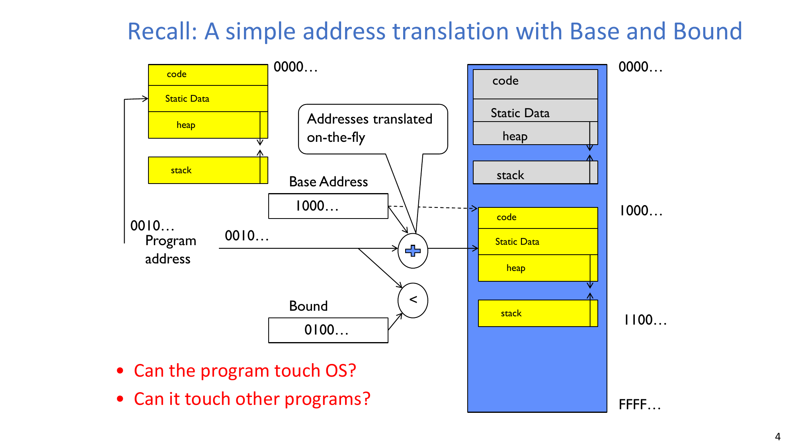

:::remark Base-and-Bound 关键问题
**问题：** "Can the program touch OS? Can it touch other programs?"

只要 B&B 机制正确执行，程序只能访问自身合法地址范围。越界访问会 trap 到 OS，因此程序不能直接读写 OS 内存，也不能直接访问其他程序内存。

**问题：** "What are the pros and cons of Base and Bound? What are the pros and cons of the two implementation approaches?"

可用下面这组对比来记忆：
- B&B 的优点：概念简单、检查路径短。
- B&B 的限制：每个进程通常需要连续地址区间，区间管理更受约束。
- 装载期重定位：运行关键路径没有逐次加法，但依赖 relocating loader。
- 在线翻译：运行期更灵活，但每次访存都要经过硬件检查/翻译。
:::

## 2. 为什么需要线程：处理 MTAO

### 2.1 MTAO 为什么普遍存在
操作系统和真实程序都必须处理 **Multiple Things At Once (MTAO)**：
- 内核中的中断、维护和后台工作。
- 需要同时处理多连接的网络服务。
- 追求吞吐量的并行计算程序。
- 既要计算又要保持响应的 UI 程序。
- 需要隐藏网络/磁盘延迟的 I/O 密集程序。

其中一个关键表述是：
- **"Threads are a unit of concurrency provided by the OS."**

### 2.2 Multiprocessing、Multiprogramming、Multithreading
三个概念要区分清楚：
- **Multiprocessing**：多个物理 CPU/核心。
- **Multiprogramming**：多个任务/进程在时间上共享 CPU。
- **Multithreading**：同一进程内部包含多个控制线程。

还要区分：
- **Concurrency**：多个任务在时间上重叠推进。
- **Parallelism**：多个任务在同一时刻真正同时执行。

所以单核上的两个线程可以并发，但不并行。

### 2.3 从阻塞串行到并发推进
单线程顺序代码例如：
- `ComputePI(...)`
- 然后 `PrintClassList(...)`

如果前者长期不结束，后者就可能一直没有机会执行。

通过创建多个线程，可以让不同任务并发推进：
- 一个线程执行长计算或 I/O，
- 另一个线程处理用户可见任务。

一个实用场景是后台读取大文件，同时保持 UI 响应。

:::tip 行为问题：后台 I/O + UI 线程
**问题：** 如果一个线程执行 `ReadLargeFile("pi.txt")`，另一个线程执行 `RenderUserInterface`，程序应表现为什么？

UI 可以持续响应，而文件读取在后台进行。关键收益并不是“凭空增加 CPU”，而是提高响应性，并让相互独立的工作重叠执行。
:::

### 2.4 线程如何通过状态转换隐藏 I/O 延迟
线程有三种常见状态：
- **RUNNING**：正在执行。
- **READY**：具备运行资格但当前未运行。
- **BLOCKED**：当前不具备运行资格（如等待 I/O）。

运行线程发起阻塞 I/O 后，OS 会把它标记为 BLOCKED，转而调度其他 READY 线程；I/O 完成后，再把该线程标记为 READY。

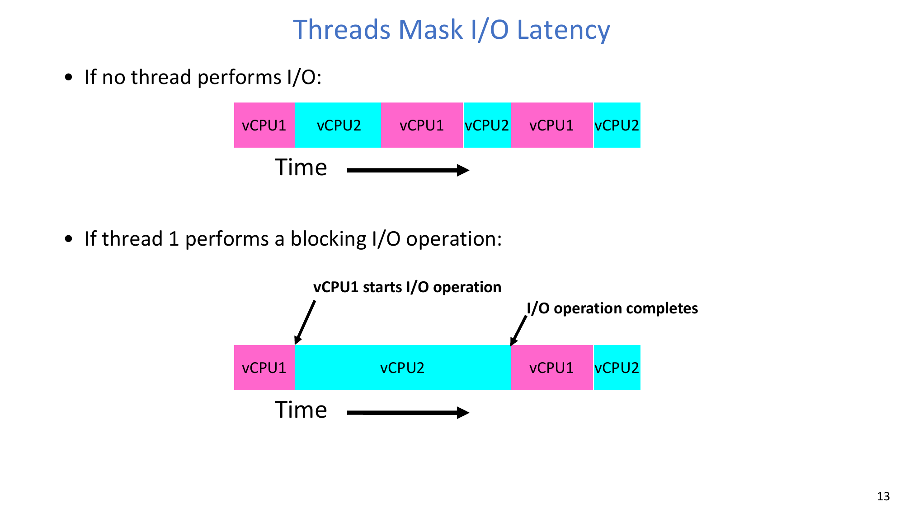

这一时序中的关键“变化”是：
1. 线程 1 发起 I/O 并进入 BLOCKED。
2. 线程 2 在此期间占用 CPU 运行。
3. I/O 完成事件把线程 1 改回 READY。
4. 调度器再让线程 1 继续运行。

## 3. 从库 API 到系统调用

### 3.1 为什么很多程序员“看不到 syscall”
一个常见疑问是：“我没有直接写过 syscall 指令。”

原因是用户程序通常调用 OS 库（如 libc / pthread 库），再由库函数代为发起系统调用。

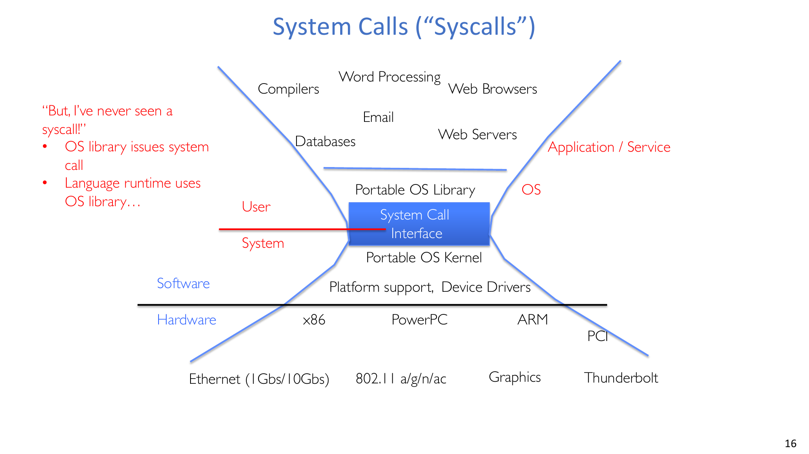

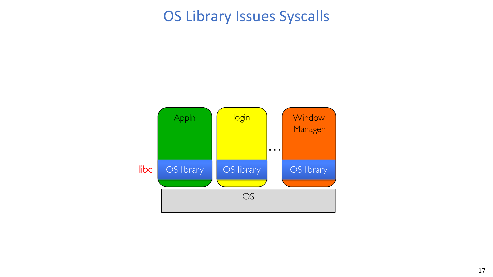

### 3.2 核心 pthread API
关键接口如下：

```c
int pthread_create(pthread_t *thread, const pthread_attr_t *attr,
                   void *(*start_routine)(void *), void *arg);

void pthread_exit(void *value_ptr);

int pthread_join(pthread_t thread, void **value_ptr);
```

语义可以概括为：
- `pthread_create`：创建新线程执行 `start_routine(arg)`。
- `start_routine` 返回可视为隐式 `pthread_exit`。
- `pthread_join`：调用者阻塞，直到目标线程终止。

### 3.3 `pthread_create(...)` 调用时到底发生了什么变化
控制流可以简化成 5 步：
1. 库代码准备 syscall 编号和参数到寄存器。
2. trap/syscall 指令把控制权切到内核态。
3. 内核取参数、分发处理、创建线程状态。
4. 内核写入返回值并返回用户态。
5. 库函数像普通函数一样返回给调用者。

### 3.4 线程协调的 Fork-Join 模式
一个非常常见的结构：
- 主线程先 **create** 多个工作线程，
- 工作线程各自执行并 **exit**，
- 主线程 **join** 汇总结果/等待完成。

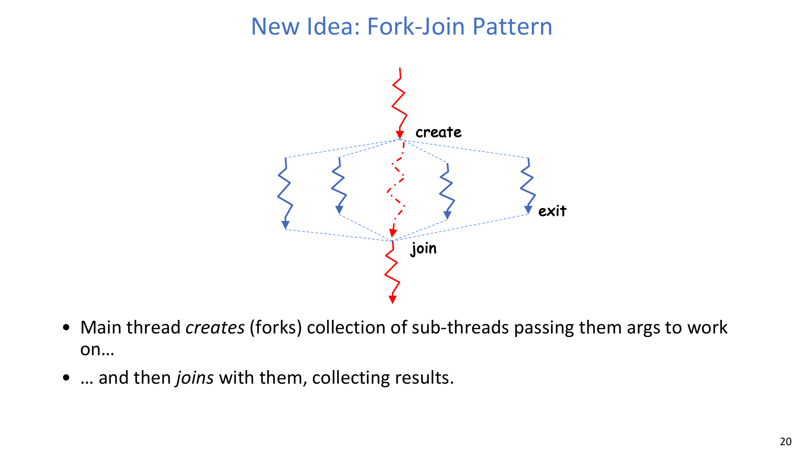

:::remark 小组讨论题：pThreads 例子
**问题 1：** 程序里一共有多少线程？

若 `nthreads = N`，通常总线程数是 `N + 1`（N 个工作线程 + 1 个主线程）。

**问题 2：** 主线程一定按创建顺序 join 吗？

循环可以按创建顺序调用 `pthread_join(threads[t], ...)`；但每次 join 只等待该目标线程，即使其他线程更早结束也不改变这一点。

**问题 3：** 线程退出顺序会和创建顺序一致吗？

不会。退出顺序是非确定性的，受调度和运行时机影响。

**问题 4：** 重复运行时结果会变化吗？

会。若共享更新（如 `common++`）没有同步保护，输出值与打印顺序都可能在不同运行间变化。
:::

## 4. 线程状态、执行栈与内存布局

### 4.1 线程共享状态与私有状态
同一进程内：
- 线程共享：代码段、全局数据、堆，以及很多 I/O 资源。
- 线程私有：寄存器（含 PC）与执行栈。

线程私有控制元数据由 **TCB（Thread Control Block）** 管理。

### 4.2 执行栈保存什么
执行栈主要保存：
- 参数，
- 临时/局部变量，
- 过程调用期间的返回 PC。

这也是递归能自然工作的原因。

### 4.3 执行栈变化过程（重点）
对调用链 `A(1) -> B() -> C() -> A(2)`，栈帧变化如下：
1. 压入 `A(tmp=1, ret=exit)`。
2. 条件成立，调用 `B`，压入 `B(ret=A+2)`。
3. `B` 调 `C`，压入 `C(ret=B+1)`。
4. `C` 调 `A(2)`，压入 `A(tmp=2, ret=C+1)`。
5. 在 `A(2)` 中条件不成立，打印 `2`，返回并弹栈。
6. 依次返回 `C`、`B`，继续弹栈。
7. 回到外层 `A(1)`，打印 `1`，返回 `exit`。

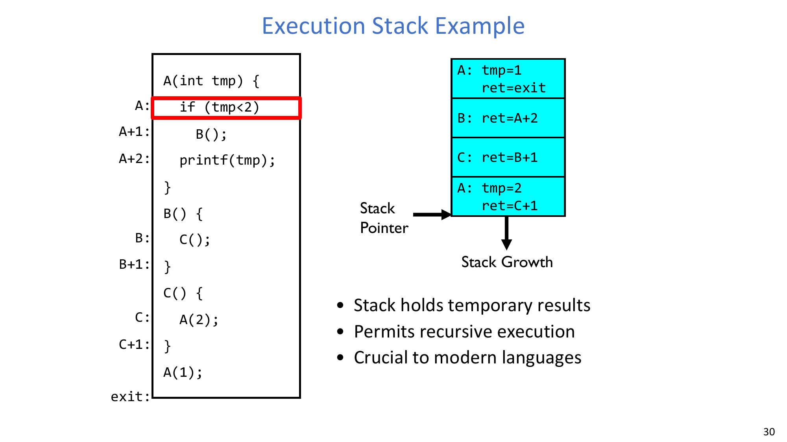

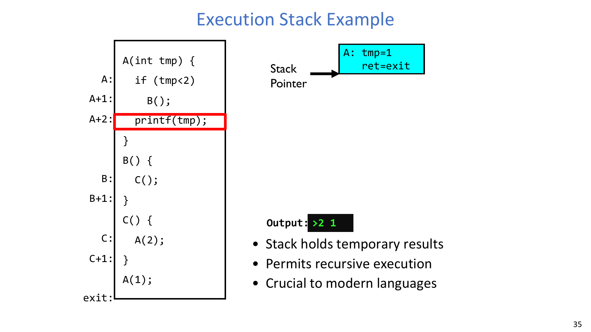

因此输出顺序是先 `2` 再 `1`，根本原因是调用深度与出栈回退顺序。

### 4.4 多线程下的内存布局
多线程进程中：
- 每个线程有独立栈区，
- 堆/全局/代码区是共享的，
- 常见布局中栈向低地址增长，堆向高地址增长。

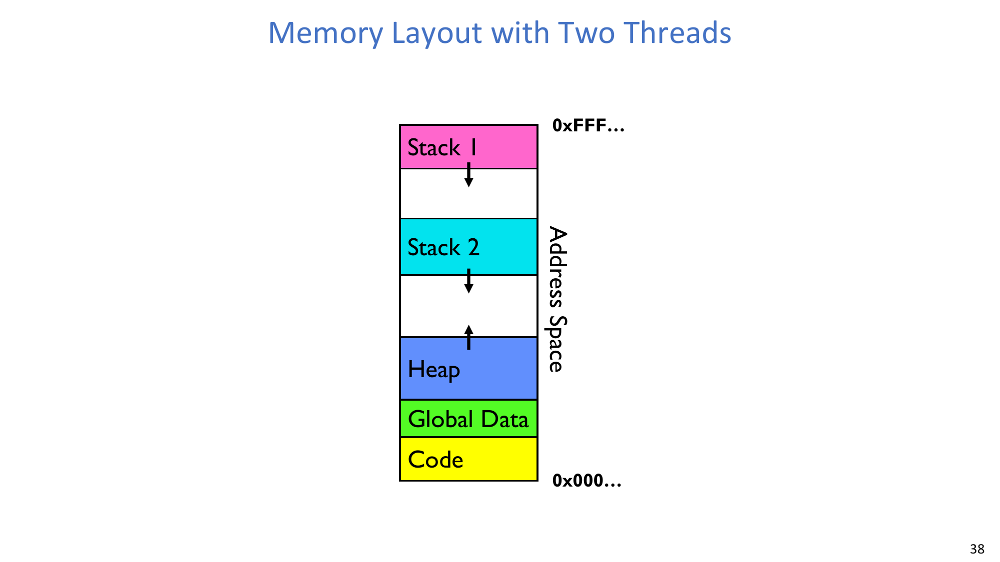

## 5. 交错执行、非确定性与正确性

### 5.1 程序员抽象与物理现实
一个重要心智模型是：
- 抽象上，好像每个线程都“有一个 CPU”；
- 现实中，CPU 数量有限，一部分线程在运行，其他线程在 READY 队列等待。

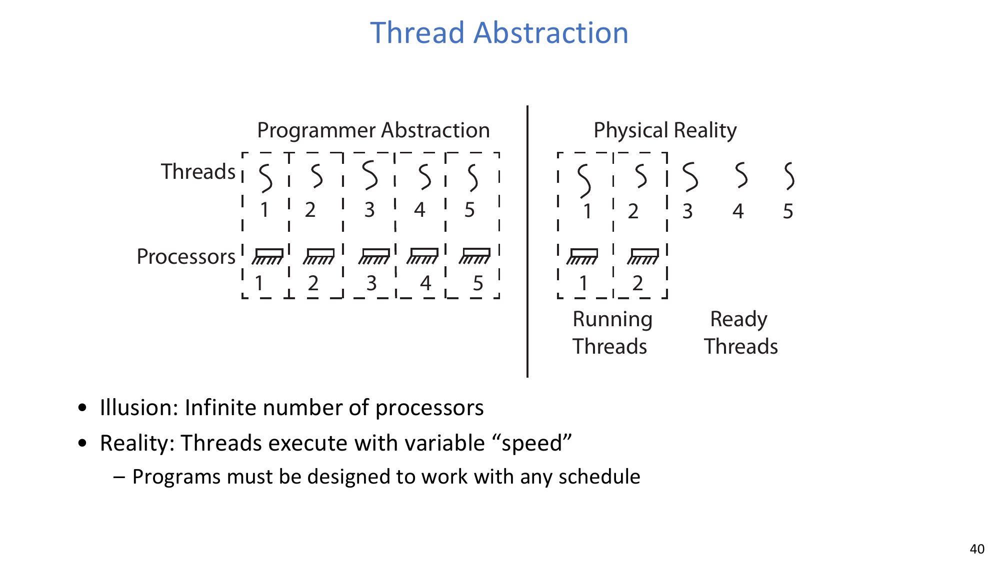

程序必须对“所有合法调度”都正确，而不是只对某一种调度正确。

### 5.2 可行执行的粒度差异
调度切换粒度可能是：
- 大时间块，
- 中等时间块，
- 或极细粒度交错。

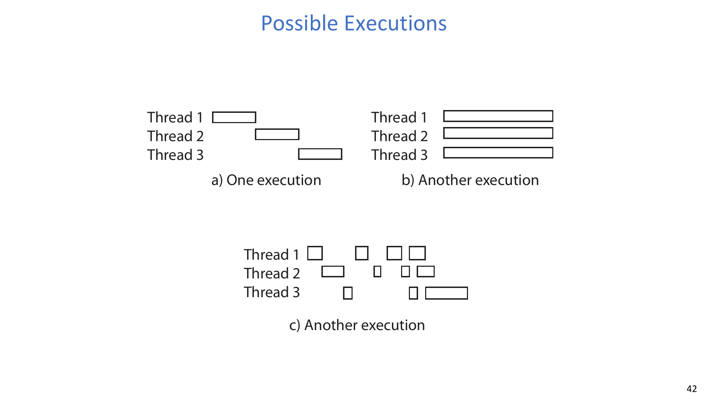

### 5.3 并发正确性的基本框架
三个核心事实：
- 调度器可以按 **any order** 运行线程，
- 可以在 **any time** 切换线程，
- 在非确定性下，单纯测试很难覆盖全部情况。

线程类别：
- **Independent threads**：不共享状态，行为更可复现。
- **Cooperating threads**：共享状态，必须同步。

目标：
- **Correctness by design**。

### 5.4 竞态条件示例
示例 A（独立写）：
- 初始 `x=0, y=0`
- Thread A: `x=1`
- Thread B: `y=2`
- 最终 `x` 确定为 `1`。

示例 B（共享依赖）：
- 初始 `x=0, y=0`
- Thread A: `x = y + 1`
- Thread B: `y = 2; y = y * 2`
- 最终 `x` 可能是 `1`、`3` 或 `5`。

:::tip 为什么 x 会是 1、3、5？
**问题：** 这三个值分别如何出现？

- `x=1`：A 在 B 更新前读到 `y=0`。
- `x=3`：A 在 `y=2` 之后、`y=4` 之前读到 `y`。
- `x=5`：A 在 B 两次更新都完成后读到 `y=4`。

这就是典型竞态：结果依赖交错时机。
:::

### 5.5 共享数据结构必须保护临界区
对共享的树形集合结构，并发 insert/get 操作要在关键临界段上加同步，否则一致性会被破坏。

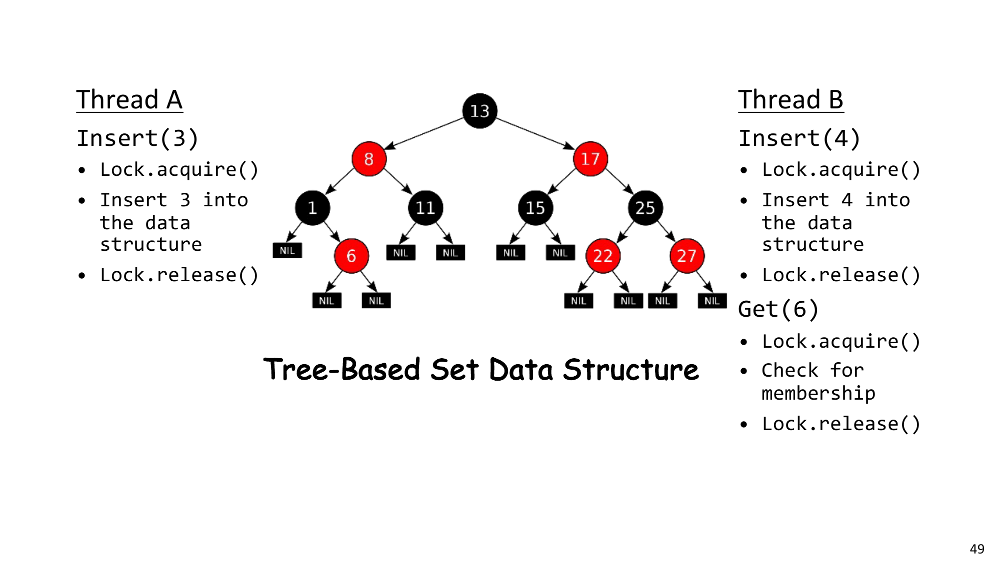

## 6. 同步原语：锁与信号量

### 6.1 关键定义
需要记住的定义：
- **"Synchronization: Coordination among threads, usually regarding shared data."**
- **"Mutual Exclusion: Ensuring only one thread does a particular thing at a time."**
- **"Critical Section: Code exactly one thread can execute at once."**
- **"Lock: An object only one thread can hold at a time."**

### 6.2 锁（Lock）
锁提供两个原子操作：
- `Lock.acquire()`：等待锁空闲并占有。
- `Lock.release()`：释放锁（通常只能由当前持有者释放）。

在 pthread 中常见接口是：
- `pthread_mutex_init(...)`
- `pthread_mutex_lock(...)`
- `pthread_mutex_unlock(...)`

### 6.3 信号量（Semaphore）是广义锁
信号量是一个非负整数，支持两个原子操作：
- `P()` / `down()`：等待值大于 0 后减 1。
- `V()` / `up()`：值加 1，并唤醒等待者（若有）。

词源提示：
- `P` 来自荷兰语 *proberen*（测试），
- `V` 来自荷兰语 *verhogen*（增加）。

### 6.4 必须掌握的两种信号量模式
- **互斥模式**（binary semaphore / mutex 风格）：
  - 初值设为 `1`。
  - 进入临界区前 `down()`。
  - 离开临界区后 `up()`。

- **通知模式**（ThreadJoin 风格）：
  - 初值设为 `0`。
  - 等待方执行 `down()`。
  - 完成方执行 `up()`。

:::remark Lock 与 Semaphore 如何选
如果需求是“同一时刻只允许一个拥有者进入临界区”，mutex/lock 通常最直接。如果需求是计数资源控制或线程间事件通知，semaphore 往往更合适。
:::

## 7. 进程抽象与进程 API

### 7.1 进程是什么
进程是具有受限权限的执行环境：
- 在一个地址空间里包含一个或多个线程，
- 拥有文件描述符、网络连接等资源，
- 与其他进程隔离，并与内核边界隔离。

一个关键定义是：
- **"An instance of an executing program is a process consisting of an address space and one or more threads of control."**

在现代 OS 中，内核之外的任何运行实体都处于某个进程中。

### 7.2 用 `fork()` 创建进程
`fork()` 复制当前进程：
- 子进程有不同 PID，
- 子进程初始只有一个线程，
- 地址空间、文件描述符等状态会在父子中复制。

返回值语义：
- `fork() > 0`：在父进程中执行，返回子 PID。
- `fork() == 0`：在子进程中执行。
- `fork() < 0`：错误路径（仍在原进程上下文）。

### 7.3 `fork_race.c` 中的交错执行
`fork` 之后，父子进程并发执行不同分支，打印行会非确定性交错。

:::tip 小组讨论：`fork_race.c` 会打印什么？`sleep()` 有影响吗？
**问题：** 哪些是确定的，哪些是不确定的？

确定的是：
- 父分支会打印自己的序列，
- 子分支会打印自己的序列。

不确定的是：
- 父子两组输出的相对交错顺序。

加入 `sleep()` 会改变时序，通常会改变你观察到的交错结果，但不会从根本上把它变成确定顺序。
:::

### 7.4 用 `exec()` 替换程序映像
`exec` 会把当前进程正在运行的程序替换为新程序。若成功，`exec` 不会回到旧代码继续执行。

典型 shell 启动流程：
1. 父进程调用 `fork()`。
2. 子进程调用 `exec(...)` 执行目标程序。
3. 父进程调用 `wait(...)` 等待子进程结束。

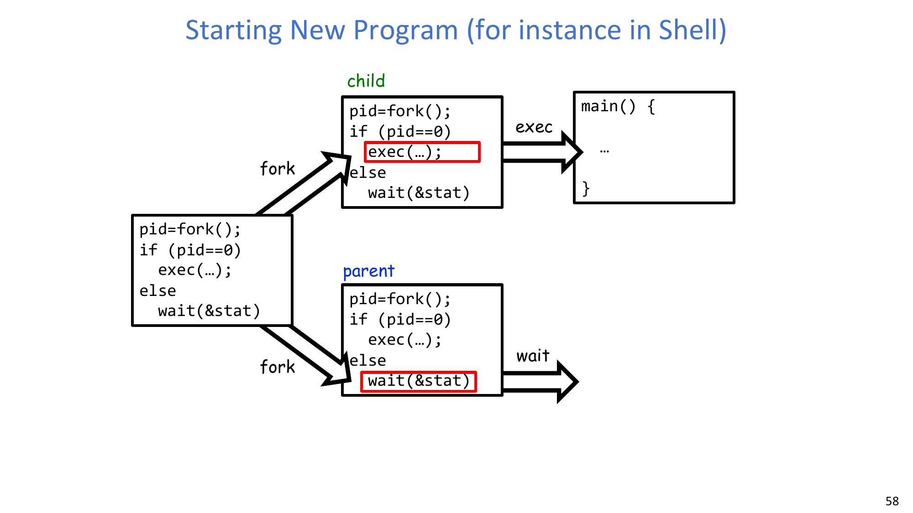

### 7.5 进程管理 API 清单
核心接口包括：
- `exit`：终止当前进程。
- `fork`：复制当前进程。
- `exec`：替换当前进程映像。
- `wait`：等待子进程结束。
- `kill`：向其他进程发送信号。
- `sigaction`：安装信号处理器。

两个具体例子：
- `fork2.c`：父进程等待；子进程退出（例如 `exit(42)`）；父进程拿到子 PID 和状态。
- `inf_loop.c`：进程无限循环，直到收到信号（如 SIGINT）并由注册 handler 处理退出。

### 7.6 为什么进程是 `fork()+exec()`，而线程是 `pthread_create()`？
核心原因是：
- `fork` 后可不立即 `exec`，便于在同一可执行文件里组织父子逻辑。
- 子进程可在 `exec` 前先做状态准备（例如 shell 的文件描述符重定向）。
- 拆分 `fork` 与 `exec` 能给程序更细粒度的子进程控制能力。

Windows 走的是另一条 API 路径（`CreateProcess`），同样可行，但接口更复杂。

### 7.7 线程 vs 进程：权衡总结
- 线程：
  - 创建/切换成本低，
  - 共享内存通信方便，
  - 但同步错误风险更高，故障隔离更弱。
- 进程：
  - 隔离性、安全性、故障边界更强，
  - 但创建/切换/IPC 成本更高。

:::remark 设计问题：并发任务该放在线程还是进程里？
任务高度耦合且需要高频共享状态时，优先考虑线程。任务之间需要强隔离、安全边界或独立生命周期控制时，优先考虑进程。
:::

## 8. 结论
本讲核心结论是：
- **"Threads are the OS unit of concurrency."**
- 同一进程内线程共享数据，因此必须同步以避免竞态。
- 进程把一个或多个线程封装在地址空间保护边界内。
- OS 库向程序提供 API，并通过系统调用与内核服务对接。

## 附录 A. Exam Review

### A.1 必会定义
- Thread、Process、Address Space、Dual Mode。
- Synchronization、Mutual Exclusion、Critical Section、Lock、Semaphore。
- Concurrency 与 Parallelism 的区别。

### A.2 必会状态变化流程
- 阻塞 I/O 下线程状态流转：
  - `RUNNING -> BLOCKED -> READY -> RUNNING`。
- `fork` 返回值分支：
  - 父分支（`>0`）/ 子分支（`==0`）/ 错误分支（`<0`）。
- Shell 启动流程：
  - `fork -> child exec -> parent wait`。
- 锁的使用纪律：
  - `acquire -> critical section -> release`。

### A.3 简答题模板
- 为什么非确定性难处理：
  - 调度可产生任意交错，因此不同运行可出现不同行为。
- 为什么会出现竞态：
  - 无同步的共享状态 + 重叠执行窗口。
- 为什么同步能修复问题：
  - 通过顺序约束或互斥约束维持共享状态不变量。

### A.4 常见失误
- 误以为创建顺序等于完成顺序。
- 误以为一次测试通过就代表并发正确。
- 忘记线程栈私有而堆/全局共享。
- 忘记 `exec` 成功后会替换进程映像，通常不会返回旧代码。

### A.5 自检清单
- 你是否能列出一个小竞态例子的全部可能结果？
- 你是否能解释 `pthread_create` 在哪里从用户态切到内核态？
- 你是否能解释 `fork_race.c` 为什么输出顺序会变化？
- 你是否能为一个具体场景给出“线程 vs 进程”的选择理由？
- 你是否能写出一个临界区保护和一个通知依赖的锁/信号量放置方式？
