# Lec4 - 抽象 2：文件与 I/O

## 学习目标
学完本讲后，你应当能够解释 POSIX 文件抽象，正确使用 `FILE*` 与文件描述符两套 API，分析缓冲行为，跟踪 `open/read/fork/close/dup` 过程中的内核文件状态变化，并规避常见 I/O 正确性陷阱。

## 1. POSIX 文件抽象

### 1.1 核心思想：**"Everything is a file"**
UNIX/POSIX 用统一接口处理多种资源类型：
- 磁盘上的普通文件。
- 设备，例如终端与打印机。
- 网络端点，例如 socket。
- 本地 IPC 端点，例如 pipe 与本地 socket。

标准系统调用接口是：
- `open()`
- `read()`
- `write()`
- `close()`

对于不适合通用接口的设备特定控制，通常使用 `ioctl()`。

### 1.2 POSIX 的含义
**POSIX = Portable Operating System Interface。**
它规范了面向程序员的接口，使软件能够在类 Unix 系统之间具备可移植性。

### 1.3 文件、元数据、目录与路径
文件是文件系统中的具名数据对象。
- POSIX 文件数据是**字节序列**。
- 元数据记录大小、所有者、修改时间等属性。

目录是命名容器。
- 目录构成层次结构（概念上是图）。
- 路径用于唯一定位目标文件或目录。

### 1.4 CWD、绝对路径与相对路径
每个进程都有当前工作目录（CWD）。
- `chdir(path)` 用于修改 CWD。
- 绝对路径不依赖 CWD。
- 相对路径基于 CWD 解析。

具体示例：
- `index.html` 与 `./index.html`：当前目录中的文件。
- `../index.html`：父目录中的文件。
- `~/index.html`：家目录中的文件。

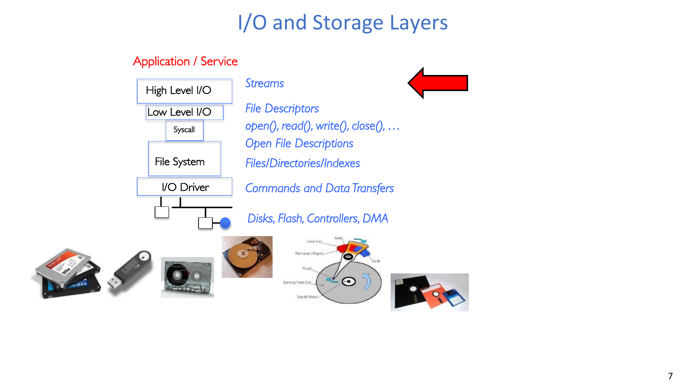

## 2. 高层文件 I/O：C 流（`FILE*`）

### 2.1 流抽象与打开模式
C 流接口（`stdio.h`）为：

```c
FILE *fopen(const char *filename, const char *mode);
int fclose(FILE *fp);
```

`fopen` 返回 `FILE` 对象指针；失败时返回 `NULL`。

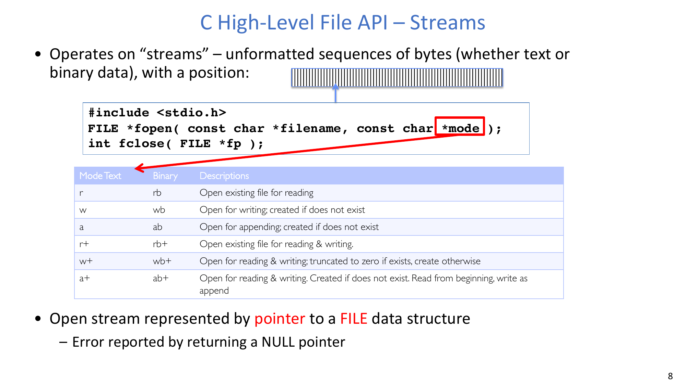

常见模式：
- `r/rb`：只读打开已有文件。
- `w/wb`：写入打开；不存在则创建，存在则截断。
- `a/ab`：追加模式；不存在则创建。
- `r+/rb+`、`w+/wb+`、`a+/ab+`：可读写变体。

### 2.2 标准流与组合能力
程序启动时会默认打开三个流：
- `stdin`
- `stdout`
- `stderr`

三者都可重定向。示例：
- `cat hello.txt | grep "World!"`
- `cat` 写到 `stdout`，该输出流成为 `grep` 的 `stdin`。

### 2.3 主要流 API 分组
- 字符 I/O：`fputc`、`fputs`、`fgetc`、`fgets`
- 块 I/O：`fread`、`fwrite`
- 格式化 I/O：`fprintf`、`fscanf`

### 2.4 具体示例：逐字符复制

```c
FILE *input = fopen("input.txt", "r");
FILE *output = fopen("output.txt", "w");
int c = fgetc(input);
while (c != EOF) {
  fputc(c, output);
  c = fgetc(input);
}
fclose(input);
fclose(output);
```

该程序按单字节读写完成复制。

### 2.5 具体示例：逐块复制

```c
#define BUFFER_SIZE 1024
FILE *input = fopen("input.txt", "r");
FILE *output = fopen("output.txt", "w");
char buffer[BUFFER_SIZE];
size_t n = fread(buffer, sizeof(char), BUFFER_SIZE, input);
while (n > 0) {
  fwrite(buffer, sizeof(char), n, output);
  n = fread(buffer, sizeof(char), BUFFER_SIZE, input);
}
fclose(input);
fclose(output);
```

该程序按块复制，通常比逐字符复制更高效。

### 2.6 位置控制 API

```c
int fseek(FILE *stream, long int offset, int whence);
long int ftell(FILE *stream);
void rewind(FILE *stream);
```

`whence` 取值：
- `SEEK_SET`：从文件开头偏移。
- `SEEK_CUR`：从当前位置偏移。
- `SEEK_END`：从文件末尾偏移。

### 2.7 系统代码中的正确性纪律
必须系统性检查返回值。例如 `fopen` 必须检查 `NULL`，并可通过 `perror` 暴露错误原因。

:::tip 实践规则
课堂示例为了简短可能省略错误处理，但在真实系统代码中，`open/read/write/fopen/fread/...` 的返回值都应当被严格检查。
:::

## 3. 低层文件 I/O：文件描述符

### 3.1 原始系统调用接口
低层 I/O 通过整数文件描述符进行：

```c
int open(const char *filename, int flags, mode_t mode);
int creat(const char *filename, mode_t mode);
int close(int filedes);
ssize_t read(int filedes, void *buffer, size_t maxsize);
ssize_t write(int filedes, const void *buffer, size_t size);
off_t lseek(int filedes, off_t offset, int whence);
```

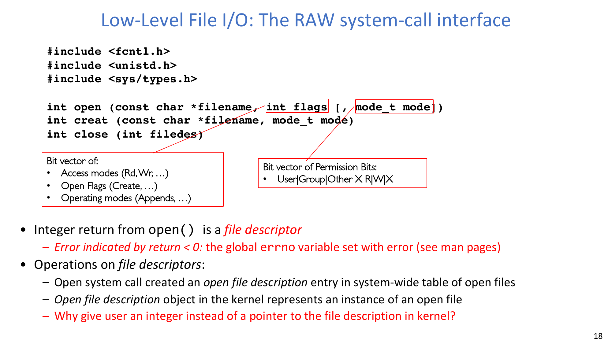

`open` 返回整数 fd。
- `fd < 0` 表示失败，错误信息写入 `errno`。

### 3.2 `open` 在配置什么
`open` 参数用于表达：
- 访问模式（读/写）。
- 打开标志（如 `O_CREAT`）。
- 涉及创建时的权限位（`mode`）。

### 3.3 预打开描述符与桥接函数
预打开标准描述符：
- `STDIN_FILENO == 0`
- `STDOUT_FILENO == 1`
- `STDERR_FILENO == 2`

桥接函数：
- `fileno(FILE *stream)`：从流中提取 fd。
- `fdopen(int filedes, const char *mode)`：把已有 fd 包装成 `FILE*`。

### 3.4 具体示例：`lowio.c`

```c
char buf[1000];
int fd = open("lowio.c", O_RDONLY, S_IRUSR | S_IWUSR);
ssize_t rd = read(fd, buf, sizeof(buf));
close(fd);
write(STDOUT_FILENO, buf, rd);
```

该程序最多读取 `lowio.c` 的 1000 字节，然后按实际读取字节数输出到标准输出。

:::remark 问题：这个程序到底读取多少字节？
`read(fd, buf, sizeof(buf))` 请求 1000 字节，但实际返回可能是 `0` 到 `1000` 之间任意值（失败时为 `-1`）。一次 `read` 不保证填满缓冲区。
:::

### 3.5 POSIX I/O 设计模式
最关键的设计点是：
- **Open before use**：在 `open` 阶段完成授权检查和状态建立。
- **Byte-oriented interface**：即使设备内部按块工作，接口仍按字节寻址。
- **Kernel-buffered reads/writes**：内核可将设备时序与用户执行解耦。
- **Explicit close**：通过 `close` 显式释放资源。

### 3.6 其他低层操作
常见相关操作包括：
- `ioctl`：设备或端点的特定控制。
- `dup`、`dup2`：复制描述符。
- `pipe`：单向 IPC 通道。
- 文件锁、内存映射、异步 I/O 等接口。

## 4. 高层与低层 API 对比，以及为什么需要缓冲

### 4.1 调用路径对比
高层与低层 API 最终都会进入系统调用。
- 低层接口更接近内核原语。
- 高层接口会在系统调用外再增加用户态逻辑。

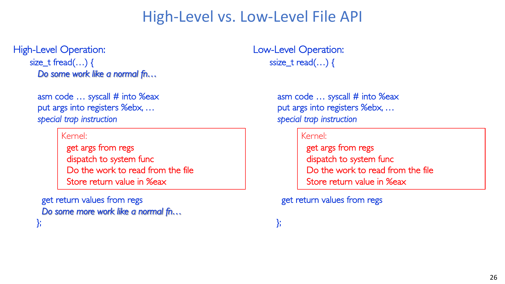

### 4.2 `FILE*` 里有什么
可用模型包含三部分：
- 底层文件描述符。
- 用户态缓冲区。
- 用于并发保护的锁。

### 4.3 `fwrite` 的缓冲行为
`fwrite` 通常先把数据写入流缓冲区。
- 需要时（例如缓冲区满）再刷到底层 fd。
- 运行库在特定条件下也可能更早触发刷新。
- 正确代码不能假设某个隐式刷新时刻一定发生。

### 4.4 具体示例：不 `fflush` 时的可见性

```c
char x = 'c';
FILE *f1 = fopen("file.txt", "w");
fwrite("b", sizeof(char), 1, f1);
FILE *f2 = fopen("file.txt", "r");
fread(&x, sizeof(char), 1, f2);
```

:::remark 问题：`x` 的值是多少？
`x` 可能变为 `'b'`，也可能保持 `'c'`（若 `fread` 没有读到尚在缓冲中的最新写入）。
:::

### 4.5 具体示例：用 `fflush` 强制可见

```c
char x = 'c';
FILE *f1 = fopen("file.txt", "wb");
fwrite("b", sizeof(char), 1, f1);
fflush(f1);
FILE *f2 = fopen("file.txt", "rb");
fread(&x, sizeof(char), 1, f2);
```

此时 `fread` 可以确定读到 `'b'`。

### 4.6 用户态缓冲的利与弊
收益：
- 减少系统调用次数，显著提升吞吐。
- 提供更丰富功能（`fgets`、`getline`、格式化读写）。
- 保持内核接口简洁、与数据格式解耦。

代价：
- 需要额外推理刷新时机、可见性与顺序。
- 若对刷新行为假设错误，容易出现隐蔽 bug。

:::tip 讨论题：为什么在用户态做缓冲？
因为跨 syscall 边界开销高，且内核接口刻意保持低层与通用。用户态缓冲同时改善性能和可用性，但在可见性要求严格时必须加入显式同步点（`fflush`、`fclose`）。
:::

## 5. 内核状态：fd 表与 Open File Description

### 5.1 两级状态模型
`open` 成功后：
- 用户拿到整数 fd。
- 内核创建 **open file description** 对象。

对每个进程，fd 表记录映射：
- `fd -> open file description`

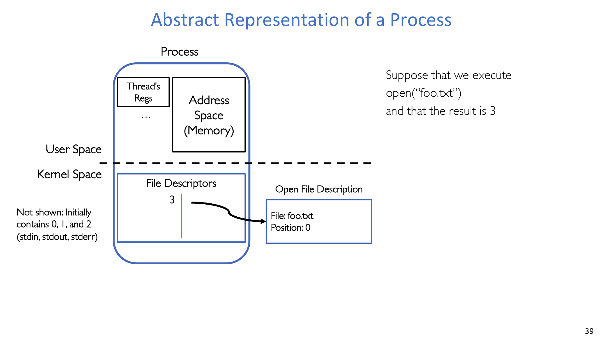

### 5.2 Open file description 中保存什么
最关键的两个字段：
- 文件身份/位置。
- 当前文件偏移（offset）。

### 5.3 状态变化序列：`open -> read -> close`
具体流程：
1. `open("foo.txt")` 返回 `fd=3`，初始 offset 为 `0`。
2. `read(3, buf, 100)` 返回 `100`，offset 变为 `100`。
3. 再次 `read(3, buf, 100)` 会从 offset `100` 继续读。
4. `close(3)` 移除该进程 fd 表中的该项。

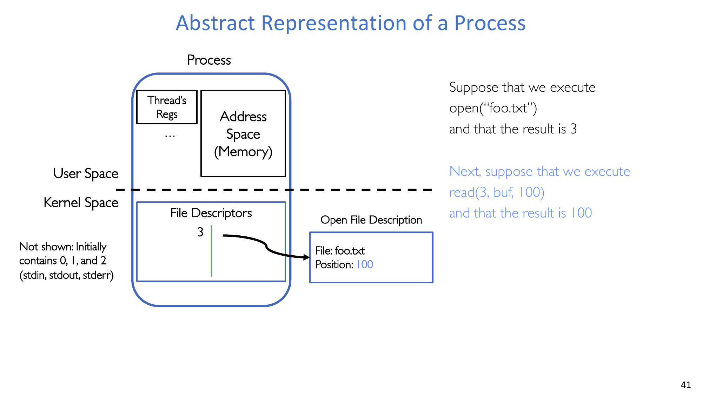

## 6. `fork()`、别名共享与描述符复制

### 6.1 `fork` 后发生了什么
`fork` 之后：
- 父进程的 fd 表项会复制到子进程。
- 父子表项会别名到同一个 open file description。

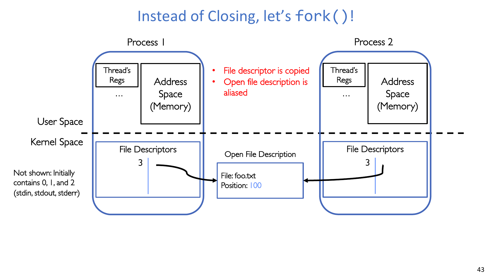

### 6.2 共享 offset 的过程变化
由于共享的是同一个 open file description，所以 offset 也是共享的：
1. 父子进程都持有 `fd=3`。
2. 父进程读 100 字节，shared offset 前进。
3. 子进程再读时从新 offset 继续，而不是从旧位置重读。
4. 任一进程后续读都会继续推进同一个位置。

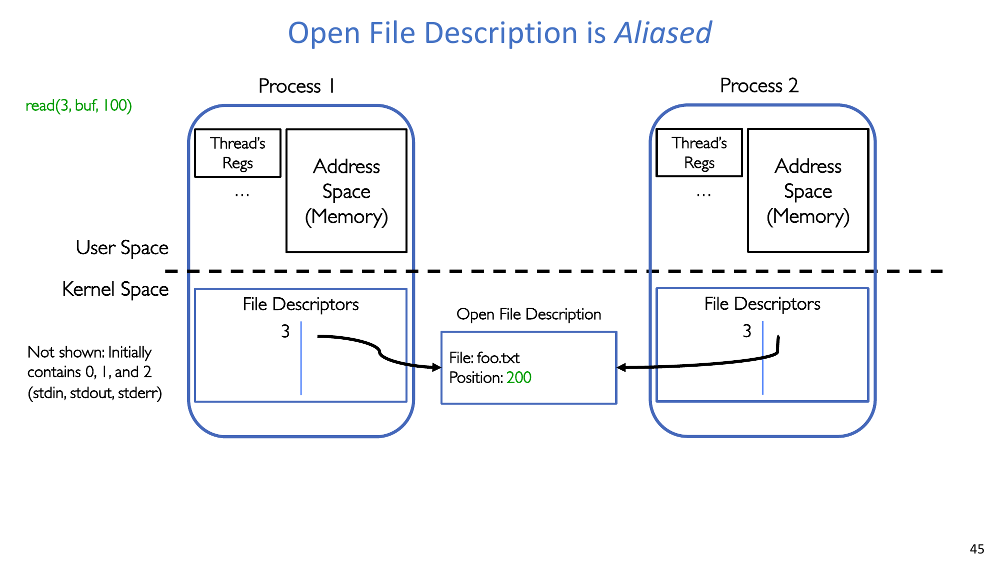

### 6.3 `close` 只去掉一个引用，不一定销毁对象
关闭一个描述符只会减少一个引用。
只要任一进程仍有描述符引用该对象，open file description 就会继续存在。

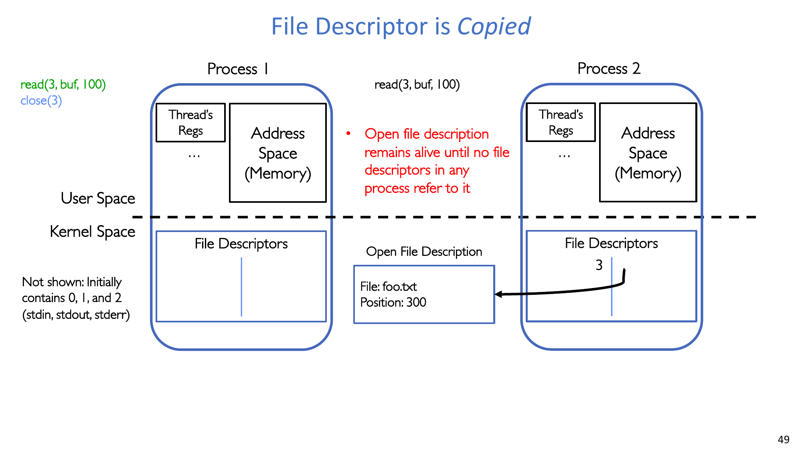

### 6.4 为什么别名共享有价值
别名共享支持有意的跨进程资源共享：
- 共享终端端点。
- `fork` 后共享网络连接。
- 共享管道端点用于 IPC 和 shell pipeline。

:::remark 问题：为什么说别名共享是好设计？
因为当我们希望跨进程协作时，多个进程可以基于同一底层资源状态进行协调，而不必人为复制和同步多份状态。
:::

### 6.5 具体示例：共享终端模拟器
`fork` 之后，父子进程通常共享继承来的 `0/1/2`，它们都连到同一个终端端点。
- 两个进程的输出都会出现在同一个终端。
- 若进程 A 执行 `close(0)`，进程 B 仍可保持自己的 `fd 0` 打开。

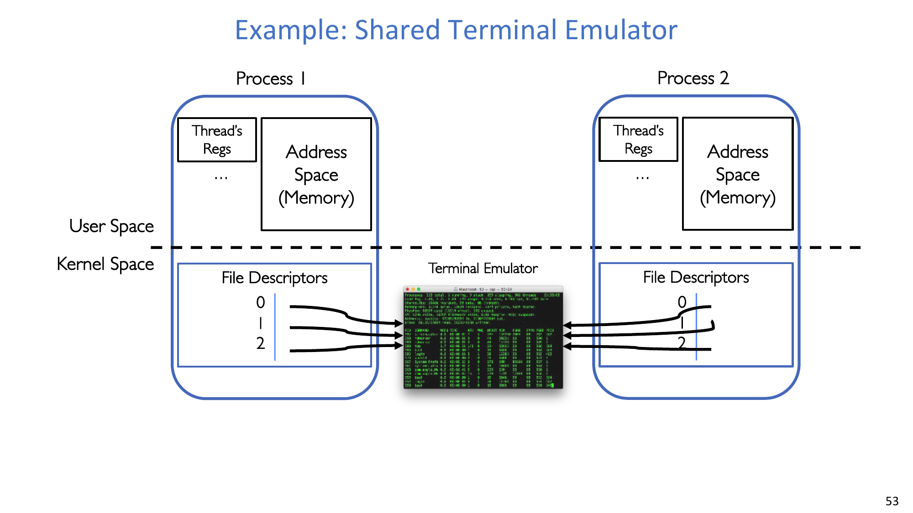

### 6.6 具体示例：`dup` 与 `dup2`
完整状态序列：
1. `open("foo.txt") -> 3`
2. `read(3, buf, 100)` 把共享 offset 推进到 `100`
3. `dup(3) -> 4`
4. `dup2(3, 162)` 使 `162` 也指向同一个 open file description

因此 `3`、`4`、`162` 共享同一份底层 offset 与文件状态。

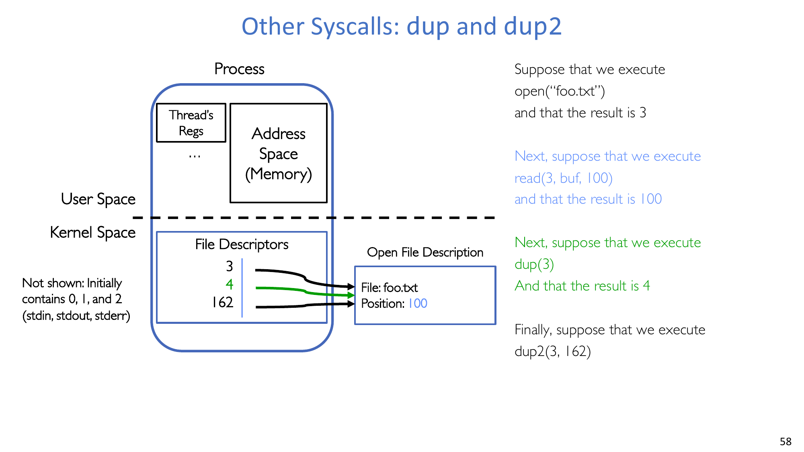

## 7. 陷阱与正确性规则

### 7.1 多线程进程中的 `fork` 风险
关键规则是：
- **不要在已有多个线程的进程中随意调用 `fork`。**

`fork` 后子进程只保留调用 `fork` 的那个线程，其他线程会消失。
可能导致：
- 消失线程原本持有锁。
- 消失线程正在修改共享数据结构。
- 这些状态不会自动清理。

安全模式：
- 如果多线程程序必须 `fork`，子进程应尽快 `exec`。

:::warn 问题：为什么多线程 `fork` 会破坏正确性？
因为锁和数据不变量可能依赖那些在子进程中已不存在的线程执行过程。子进程继承了内存快照，却没有继承这些线程的后续收尾动作。
:::

### 7.2 不要随意混用 `FILE*` 与 `fd`
问题示例：

```c
char x[10], y[10];
FILE *f = fopen("foo.txt", "rb");
int fd = fileno(f);
fread(x, 10, 1, f);
read(fd, y, 10);
```

问题：`y` 里会读到哪段字节？
- A. `0..9`
- B. `10..19`
- C. 以上都不一定

正确答案：**C**。

原因：
- `fread` 可能一次预取一大块到用户态缓冲。
- 内核 offset 与流缓冲状态会偏离“下一次 `read` 恰好读后 10 字节”的朴素假设。

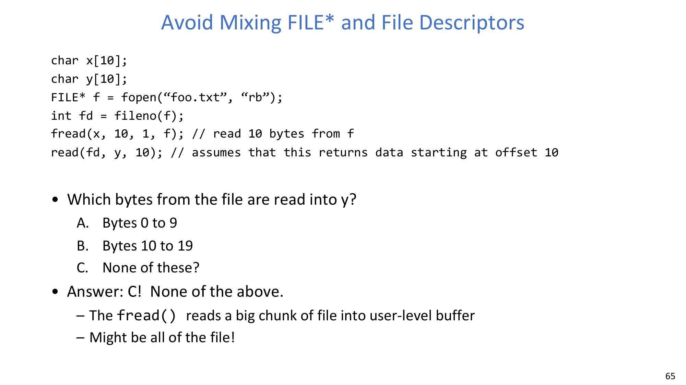

:::warn 实践规则
同一条数据路径尽量坚持一种抽象边界：
- 全程 `FILE*` 风格，或
- 全程 fd/syscall 风格。

若必须桥接，请显式推理缓冲、offset 与刷新行为。
:::

## 8. 小结
核心结论：
- POSIX 用面向文件的统一接口管理多类资源。
- 高层与低层 API 都重要，但它们暴露的状态模型不同。
- 程序正确性取决于你是否真正理解缓冲可见性与内核 open-file 状态变化。
- `fork`、`dup` 与混用 I/O 抽象是高频隐蔽 bug 来源。

## 附录 A：Exam Review

### A.1 必背定义
- **"Everything is a file."**
- File、metadata、directory、path、CWD。
- file descriptor 与 open file description 的区别。
- Stream（`FILE*`）与用户态缓冲。

### A.2 必背 API
- 高层：`fopen`、`fclose`、`fread`、`fwrite`、`fgetc`、`fgets`、`fseek`、`fflush`。
- 低层：`open`、`creat`、`read`、`write`、`close`、`lseek`、`dup`、`dup2`、`pipe`、`ioctl`。
- 桥接：`fileno`、`fdopen`。

### A.3 必背状态变化链
- `open -> 返回 fd + 创建 open file description`。
- `read/write -> 该 open file description 的共享 offset 前进`。
- `fork -> 复制 fd 表，别名到同一 open file description`。
- `close(fd) -> 仅移除一个引用；无引用时对象才销毁`。
- `dup/dup2 -> 新 fd 表项别名到同一 open file description`。

### A.4 简答高频点
- 为什么需要用户态缓冲：摊薄 syscall 开销 + 提供更丰富 API 功能。
- 为什么 `fflush` 重要：否则可见性时机不够确定，无法支撑严格假设。
- 为什么 fd 是整数而不是内核指针：隔离与安全。
- 为什么多线程 `fork` 危险：子进程丢失非调用线程，可能继承不一致锁/数据状态。
- 为什么混用 `FILE*` 与 fd 风险高：两套缓冲/定位模型会发生偏离。

### A.5 自检清单
- 你能解释为什么一次 `read` 可能少于请求字节数吗？
- 你能追踪 `open/read/fork/read/close` 全流程里的 offset 演化吗？
- 你能解释为什么关闭一个别名 fd 不一定关闭底层 open file description 吗？
- 你能精确解释混合 `fread` + `read` 示例为何答案是 C 吗？
- 你能把混用 I/O 的代码改写成单一抽象风格吗？
