# Lec5 - Abstractions 3: IPC, Pipes, and Sockets

## Learning Objectives
After this lecture, you should be able to explain why IPC is needed despite process isolation, use POSIX pipes correctly (including EOF/SIGPIPE corner cases), define protocol syntax/semantics precisely, model sockets as file-like endpoints, describe TCP connection setup (`listen`/`accept`), and compare iterative, process-based, thread-based, and thread-pool server designs.

## 1. Why IPC Exists

### 1.1 Isolation is necessary, communication is also necessary
Process abstraction intentionally isolates programs for protection, but many real tasks still require cooperation.
- A producer process may generate data that a consumer process must use.
- Client and server processes must exchange requests and responses.

So systems provide **Interprocess Communication (IPC)** as a controlled way to "punch a hole" through isolation boundaries.

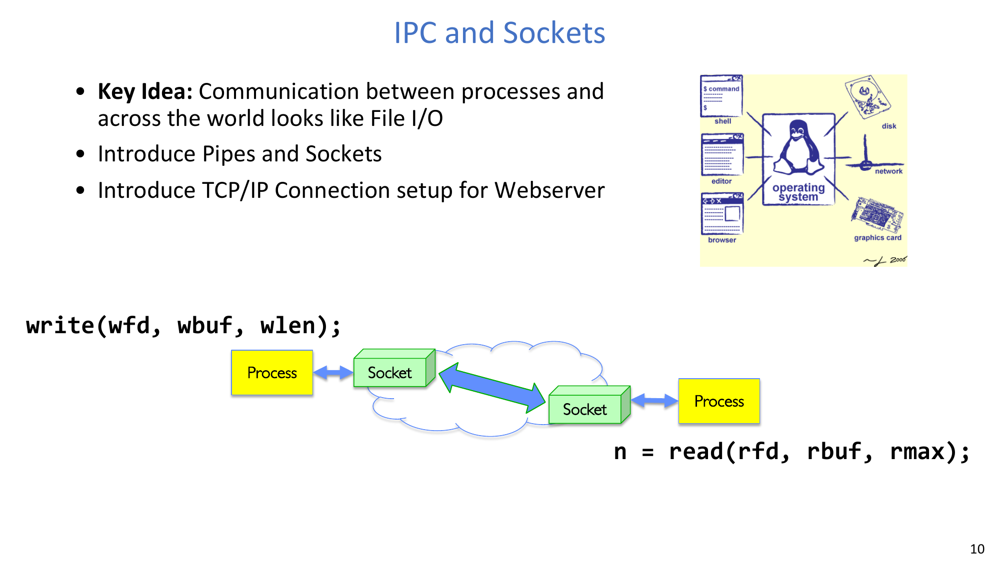

### 1.2 Why not just communicate through regular files?
Using persistent files for transient communication works, but it can be expensive:
- Data may hit storage paths unnecessarily.
- Latency and overhead are higher for short-lived exchanges.

A kernel-managed in-memory queue gives the same read/write style with better efficiency for transient IPC.

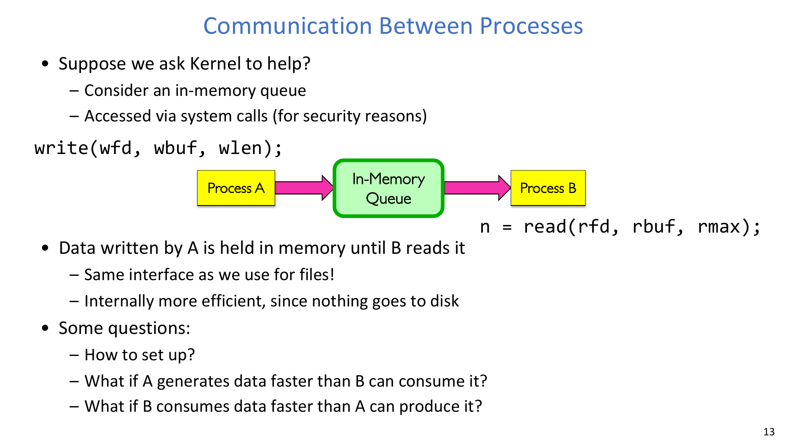

:::remark Question: Why is file-based communication sometimes wasteful?
If the goal is short-lived producer-consumer exchange, persisting data to disk is extra work. In-memory IPC avoids storage overhead while preserving protection via syscalls.
:::

## 2. Pipes: A One-Way IPC Queue

### 2.1 Pipe model and API
A POSIX pipe is a fixed-size in-kernel queue with two file descriptors:

```c
int pipe(int fileds[2]);
```

- `fileds[1]`: write end.
- `fileds[0]`: read end.

Blocking behavior comes from finite capacity:
- Writer blocks if buffer is full.
- Reader blocks if buffer is empty.

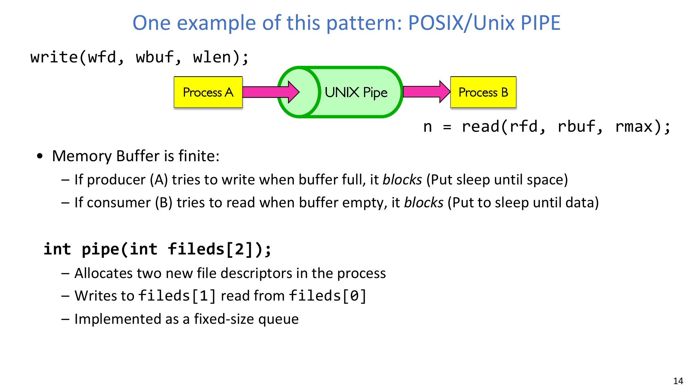

### 2.2 Concrete example: single-process pipe
The example writes `"Message in a pipe.\n"` into `pipe_fd[1]`, reads from `pipe_fd[0]`, prints both lengths, then closes both fds.

```c
char *msg = "Message in a pipe.\n";
char buf[BUFSIZE];
int pipe_fd[2];
pipe(pipe_fd);
ssize_t writelen = write(pipe_fd[1], msg, strlen(msg)+1);
ssize_t readlen  = read(pipe_fd[0], buf, BUFSIZE);
close(pipe_fd[0]);
close(pipe_fd[1]);
```

Result:
- The received string equals the sent string.
- The example demonstrates the queue abstraction directly, without networking.

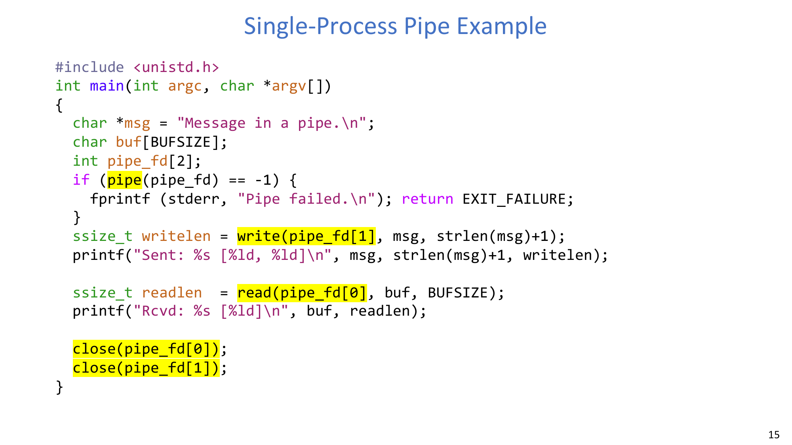

### 2.3 Pipe inheritance after `fork`
If a process calls `pipe()` and then `fork()`, parent and child inherit both pipe fds.

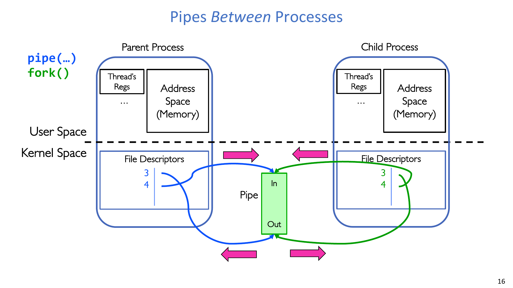

To make direction explicit, each side closes one end:
- Parent -> Child channel: parent closes read end, child closes write end.
- Child -> Parent channel: parent closes write end, child closes read end.

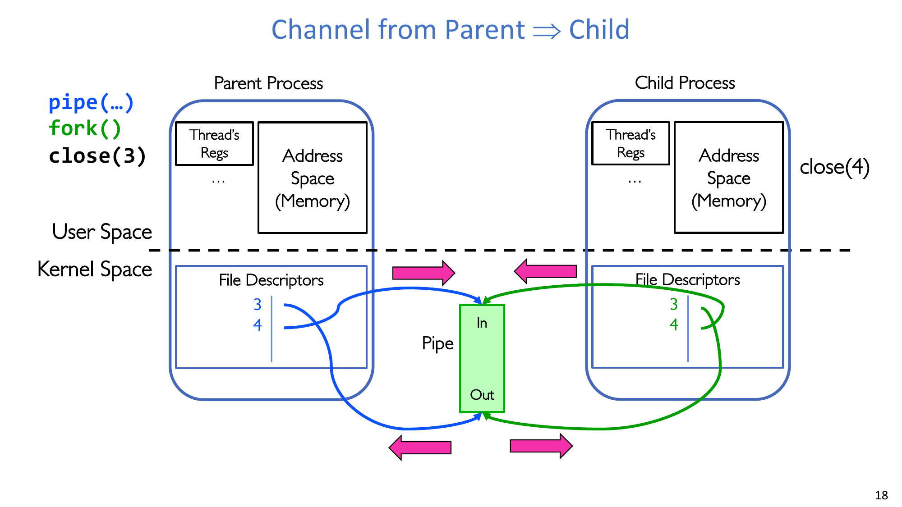


### 2.4 Concrete example: parent writes, child reads
After `fork()`:
- Parent executes `write(pipe_fd[1], msg, msglen)` and closes `pipe_fd[0]`.
- Child executes `read(pipe_fd[0], buf, BUFSIZE)` and closes `pipe_fd[1]`.

This ensures one clear direction and avoids accidental deadlock/leaks from unused ends.

### 2.5 EOF and SIGPIPE rules (must remember)
- After the **last write descriptor** is closed, subsequent reads return EOF.
- After the **last read descriptor** is closed, writes trigger `SIGPIPE`.
- If `SIGPIPE` is ignored/handled, `write` fails with `EPIPE`.

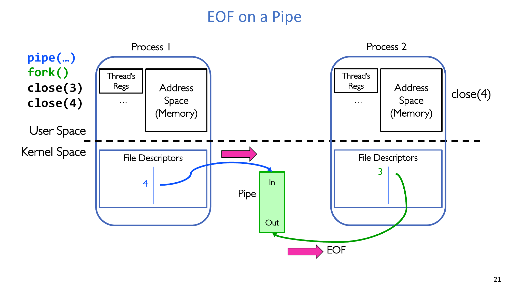

:::remark Question: When do we get EOF on a pipe?
EOF appears only when no write-end descriptor remains open in any process referencing that pipe. As long as at least one write end is still open, reader-side `read` may continue blocking instead of returning EOF.
:::

## 3. Protocol: Agreement on Communication Behavior

### 3.1 Core definition
A key statement is:
- **"A protocol is an agreement on how to communicate."**

It includes:
- **Syntax**: message format and ordering.
- **Semantics**: meaning of each message and required actions.

Protocols are often described by state machines or message-transaction diagrams.

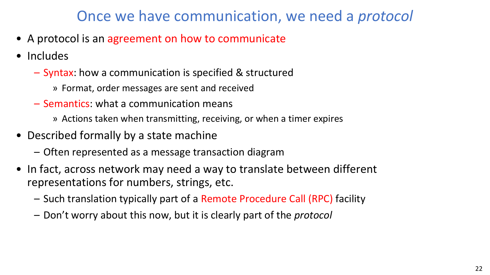

### 3.2 Concrete example: telephone conversation protocol
A phone call can be modeled as a protocol with ordered states:
1. Pick up phone, detect dial tone/service.
2. Dial and wait for ringing.
3. Callee answers ("Hello?").
4. Caller identifies self and starts turn-taking.
5. Both sides exchange messages and pauses.
6. Mutual termination ("Bye") and hang up.

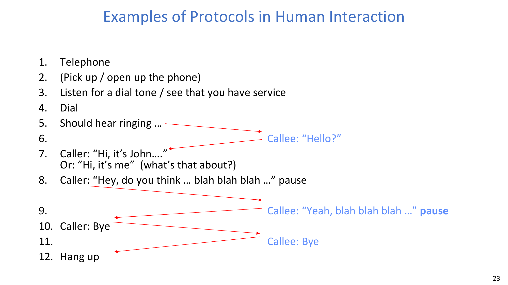

This example shows that protocol design is about legal ordering and interpretation, not just bytes.

## 4. Client-Server IPC and the Socket Abstraction

### 4.1 Client vs. server roles
- Client is often intermittent, initiates requests, and must know server address.
- Server is usually long-running, listens continuously, and exposes a known address.

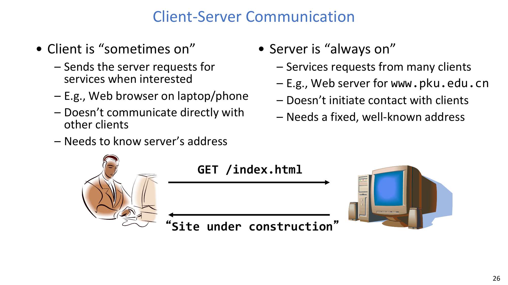

### 4.2 What a network connection is
For TCP discussion here, a connection is a bidirectional byte stream between processes (possibly on different machines), conceptually two bounded queues:
- A -> B queue.
- B -> A queue.

### 4.3 Socket abstraction
A socket is one endpoint of a network connection.
- It looks file-like and is used via file descriptor + `read`/`write`.
- `write` appends data to outgoing queue.
- `read` removes data from incoming queue.
- Some file operations do not apply (for example, `lseek`).

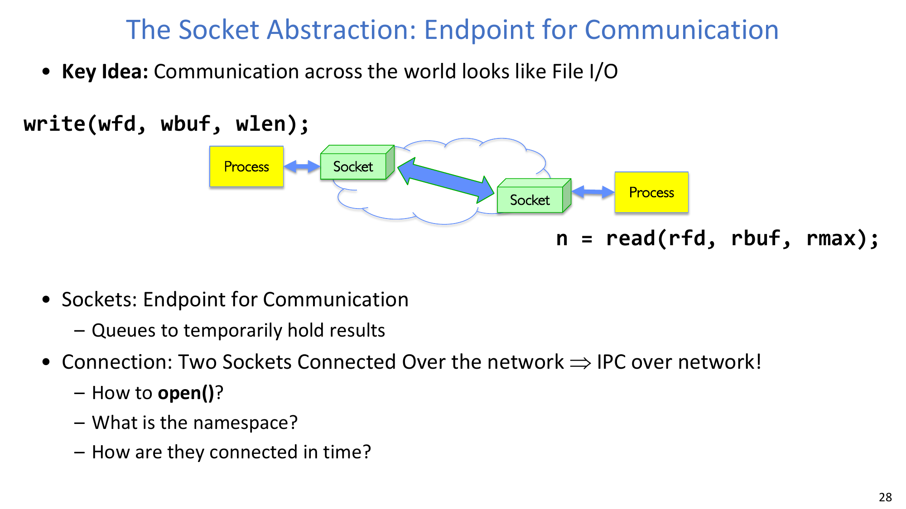

### 4.4 Concrete example: echo service
Echo protocol behavior:
- Client sends `"hello, world"`.
- Server reads the payload and sends exactly the same bytes back.
- Client receives and prints the mirrored content.

Code-level loop:
- Client: `fgets -> write(sockfd,...) -> read(sockfd,...) -> write(STDOUT,...)`
- Server: `read(consockfd,...) -> write(STDOUT,...) -> write(consockfd,...)`

This example concretely demonstrates request/response over one connection stream.

## 5. Naming and TCP Connection Setup

### 5.1 Namespace for Internet communication
To let independent programs find each other, naming is explicit:
- Hostname (for example `www.pku.edu.cn`).
- IP address (IPv4/IPv6).
- Port number.

Port ranges to remember:
- `0-1023`: well-known/system ports (privileged bind).
- `1024-49151`: registered ports.
- `49152-65535`: dynamic/ephemeral ports.

### 5.2 TCP setup: server socket vs connection socket
Server socket lifecycle:
1. `socket()` creates listening endpoint.
2. `bind()` attaches it to host:port.
3. `listen()` allows pending connection queueing.
4. `accept()` creates a **new connected socket** for one client.

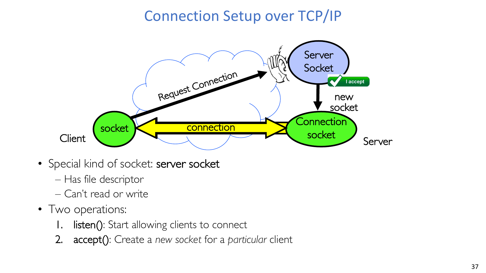

### 5.3 5-tuple connection identity
Each TCP connection is identified by:
1. Source IP
2. Destination IP
3. Source port
4. Destination port
5. Protocol (TCP)

Client port is often ephemeral; server port is often well-known.

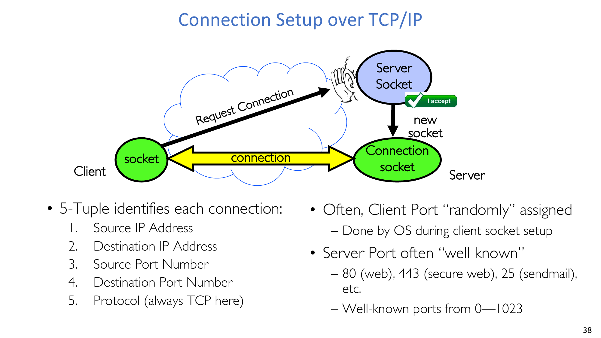

### 5.4 End-to-end lifecycle (conceptual flow)
Client side:
- Create client socket -> connect(host:port) -> write/read -> close.

Server side:
- Create server socket -> bind -> listen -> accept -> serve via connected socket -> close connection socket -> keep or close listening socket.

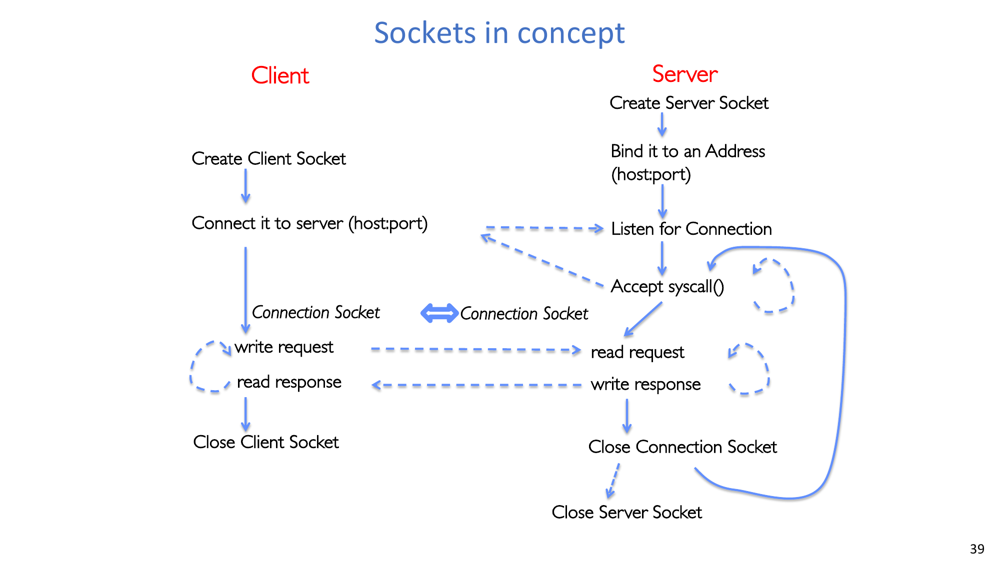

:::remark Question: How do independent programs know they should talk to each other?
They coordinate via a shared naming convention (host/IP + port), protocol agreement, and time coordination through `connect` and `listen/accept`. Without these, two independent processes cannot align endpoints safely.
:::

## 6. Server Design Patterns: Protection vs Concurrency

### 6.1 Iterative server (`v1`)
`accept -> serve_client -> close` in one loop.
- Simple and safe.
- But one long client delays all later clients.

### 6.2 Process-per-connection (`v2`)
After `accept`, server `fork`s:
- Child handles request and exits.
- Parent closes connected fd and waits.

Protection benefit:
- Each connection runs in a separate process/address space.

Cost in this version:
- Parent `wait(NULL)` makes servicing effectively serial.

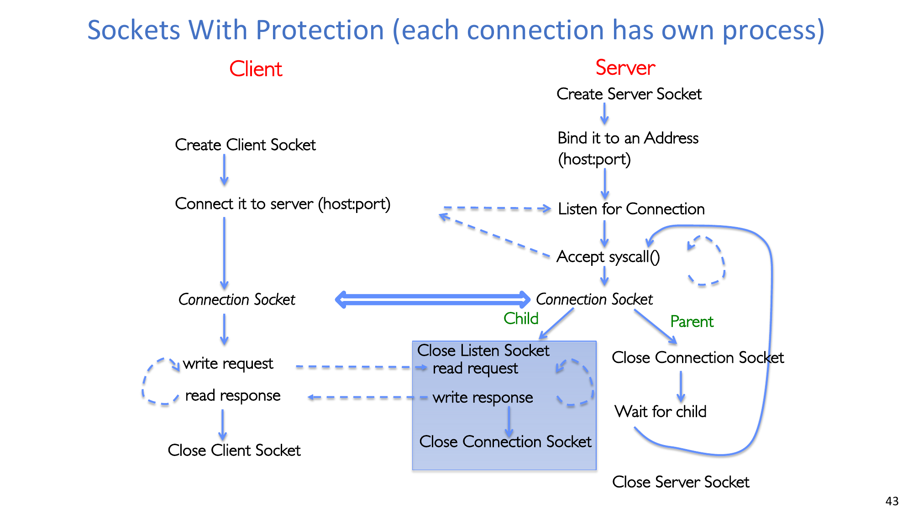

### 6.3 Concurrent process server (`v3`)
Remove blocking `wait(NULL)` inside accept loop.
- Parent keeps accepting new clients.
- Children serve clients concurrently.

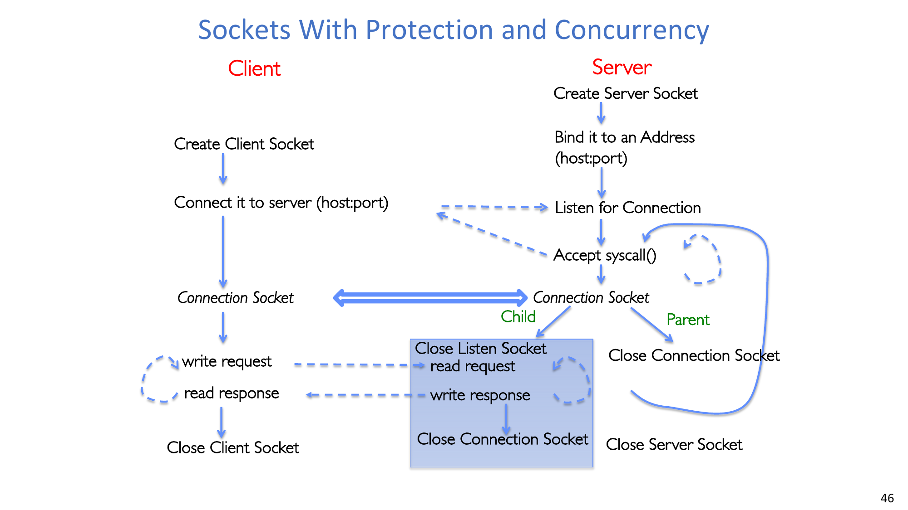

### 6.4 Thread-per-connection model
Spawn a thread per accepted connection.
- Higher efficiency than process creation/context switch.
- Main thread can continue accepting without waiting.
- Tradeoff: weaker isolation than process-based handling.

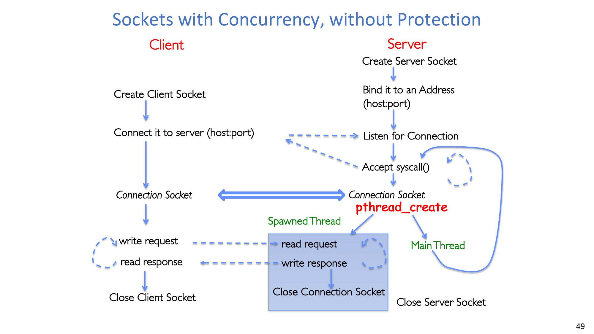

### 6.5 Thread pool model
Problem with thread-per-connection: unbounded thread growth can hurt throughput.

Bounded thread pool solution:
- Master thread accepts connections and enqueues tasks.
- Fixed worker threads dequeue and serve.
- Queue + bounded workers cap concurrency and stabilize resource usage.

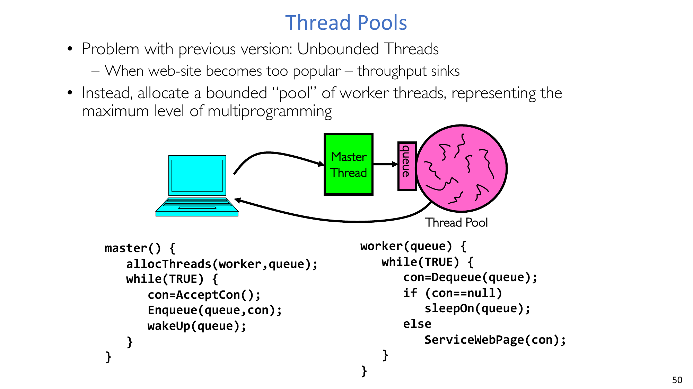

:::tip Practical comparison rule
- Favor process isolation when fault containment and protection dominate.
- Favor threads/thread pools when high throughput and lower overhead dominate.
- In real servers, thread pools are a common middle ground for predictable performance.
:::

## 7. Conclusion
- IPC enables controlled communication between protected processes.
- Pipes are one-way, single-queue, local IPC with inherited fds.
- Sockets are two-way, network-capable IPC endpoints with file-like APIs.
- `listen/accept` and naming (`host/IP/port`) are central to cross-machine coordination.
- Server architecture is a tradeoff among simplicity, isolation, and concurrency.

## Appendix A. Exam Review

### A.1 Must-know definitions
- IPC, pipe, socket, protocol, server socket, connection socket.
- Syntax vs semantics in protocol design.
- 5-tuple for TCP connection identity.

### A.2 Must-know APIs
- Pipe: `pipe`, `read`, `write`, `close`, `fork`.
- Socket setup: `socket`, `bind`, `listen`, `accept`, `connect`, `close`.
- Concurrency: `fork`, `wait`, `pthread_create`.

### A.3 Must-know behavior rules
- Pipe full -> writer blocks; pipe empty -> reader blocks.
- Last writer closed -> reader gets EOF.
- Last reader closed -> writer gets `SIGPIPE` / `EPIPE`.
- `accept` returns a new connected socket; listening socket remains for future accepts.

### A.4 Must-know examples
- Single-process pipe transfers `"Message in a pipe.\n"` from write end to read end.
- Parent->child pipe example requires closing opposite ends to enforce direction.
- Echo server returns exactly the payload it reads.
- `v1` iterative server is simple but not concurrent; `v3` removes in-loop wait to enable concurrency.
- Thread pool controls throughput collapse risk from unbounded thread creation.

### A.5 Self-check list
- Can you explain why file-based IPC may be wasteful for transient communication?
- Can you determine exactly when a pipe read returns EOF?
- Can you explain the difference between listening socket and connected socket?
- Can you list and interpret the TCP 5-tuple?
- Can you compare process-per-connection and thread-pool designs in terms of isolation and efficiency?
