# Lec6 - 同步 1：并发

## 学习目标
学完本讲后，你应当能够解释操作系统如何通过线程调度与上下文切换实现并发，说明线程栈/TCB 的保存与恢复机制，解释为什么非确定性交错会让正确性变难，并给出引向锁与信号量的核心同步概念定义。

## 1. 回顾：Pipe、Socket 与服务器并发模型

### 1.1 Pipe 回顾：有界内核队列与阻塞行为
POSIX/Unix pipe 是两个端点之间的固定大小内核队列。
- 当 pipe 缓冲区满时，生产者阻塞。
- 当 pipe 缓冲区空时，消费者阻塞。
- `pipe(int fileds[2])` 返回两个描述符：
  - `fileds[1]` 用于写。
  - `fileds[0]` 用于读。

### 1.2 Socket 回顾：把网络通信当成文件 I/O
Socket 是通信端点抽象。核心建模是：即使跨网络，通信也可以继续按文件式 I/O 理解（对描述符做 `read`/`write`），但需要显式命名与连接建立。

### 1.3 回顾三种服务器处理连接的模式与取舍
课程回顾了三种处理 `accept` 后连接的模式：
1. 每连接一进程（保护性强）：每个连接拥有独立进程/地址空间。
2. 进程并发：父进程持续接收，子进程并发处理请求。
3. 线程并发（每连接不再有进程级隔离）：主线程接收，工作线程处理请求。

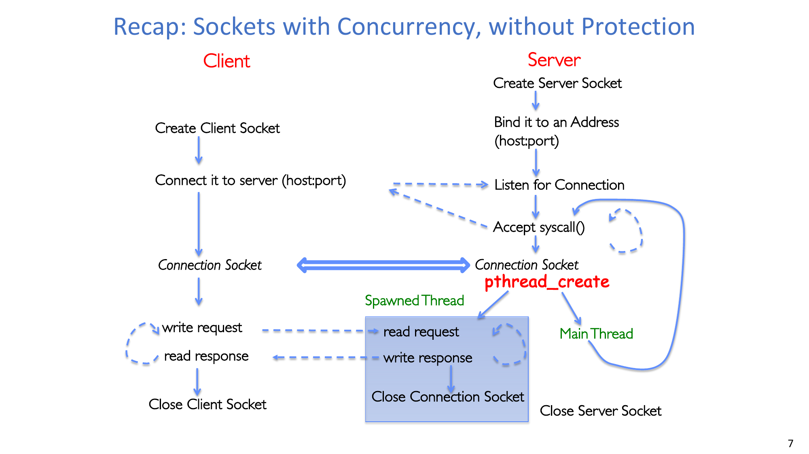

:::remark 问题：pipe 和 socket 的相同点与不同点是什么？
**相同点：**二者都提供类队列的通信端点，都支持阻塞式 `read`/`write` 语义。  
**不同点：**pipe 通常是本机 IPC、端点角色更固定；socket 支持网络端点命名（`host:port`）、建连过程，以及更丰富的协议族。
:::

## 2. 操作系统如何创造并发：PCB、状态与调度器

### 2.1 进程控制块（PCB）
内核用 PCB 表示每个进程，包含进程状态、程序计数器、寄存器状态、内存相关信息、打开文件和元数据（PID/用户/优先级/可执行文件/时间统计等）。

调度器维护 PCB 数据结构，并决定：
- 谁获得 CPU 时间。
- 非 CPU 资源如何分配（与内存/I/O 相关的策略决策）。

### 2.2 保护模型下的上下文切换路径
上下文切换跨越特权级：
- 运行中的用户线程因中断/系统调用陷入内核。
- 内核把旧上下文保存到 PCB/TCB。
- 内核恢复下一个上下文。
- CPU 返回用户态继续执行新线程/进程。

### 2.3 生命周期与状态队列
线程/进程在以下状态间迁移：
- `new`
- `ready`
- `running`
- `waiting`
- `terminated`

关键迁移：
- `new -> ready`（admitted）
- `ready -> running`（scheduler dispatch）
- `running -> waiting`（I/O 或事件等待）
- `waiting -> ready`（I/O/事件完成）
- `running -> ready`（中断/抢占）
- `running -> terminated`（退出）

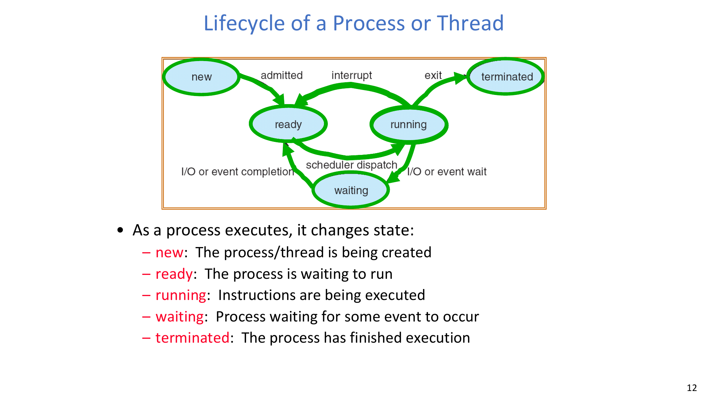

### 2.4 以队列为中心的调度模型
调度本质是“队列迁移”：就绪队列 + 多个设备/信号/条件等待队列。

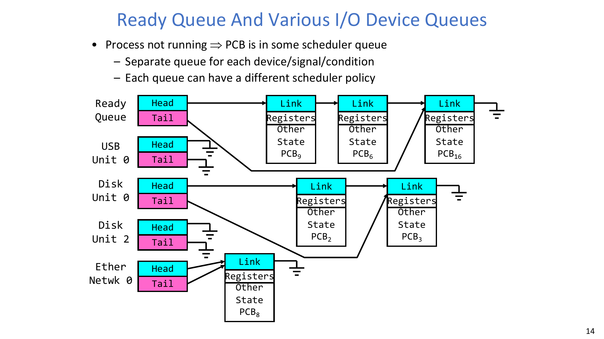

不同策略对应不同优化目标：
- 公平性。
- 实时性保证。
- 尾延迟优化。

## 3. Dispatch Loop 与调度器如何重新获得控制权

### 3.1 核心调度循环
概念上，调度循环可写为：

```c
Loop {
    RunThread();
    ChooseNextThread();
    SaveStateOfCPU(curTCB);
    LoadStateOfCPU(newTCB);
}
```

这是一个**无限循环**模型，体现 OS 对线程的时间复用。

### 3.2 运行线程这一步在做什么
运行线程时，OS 需要加载：
- 寄存器状态、PC、栈指针。
- 运行环境（如虚拟内存上下文）。
随后跳转到线程 PC 开始执行。

### 3.3 通过内部事件返回控制权
线程会在以下情形“自愿”把控制权交回调度器：
- 阻塞在 I/O。
- 等待 signal/join 条件。
- 显式调用 `yield()`。

下图给出了 `yield` 的栈路径。

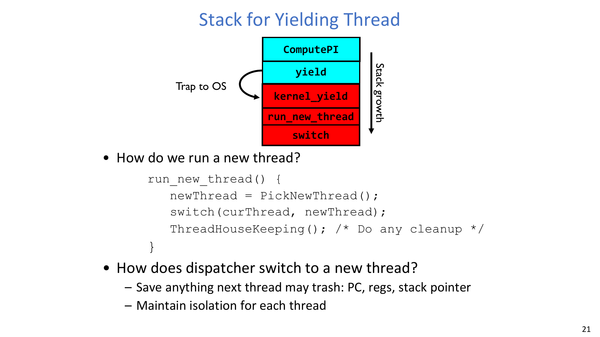

### 3.4 通过外部事件抢占：中断与定时器
如果线程从不主动让出 CPU，OS 仍必须重新拿回控制权。核心机制是周期性中断，尤其是定时器中断。

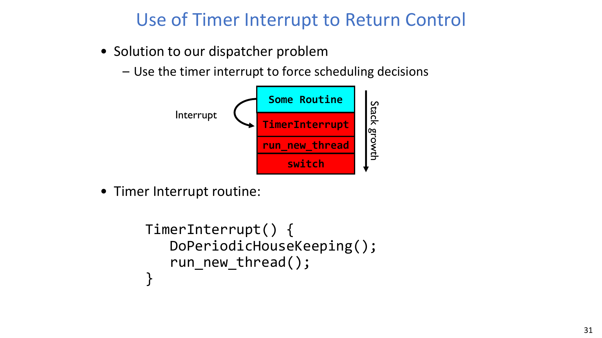

简化的中断处理例程：

```c
TimerInterrupt() {
    DoPeriodicHousekeeping();
    run_new_thread();
}
```

:::remark 问题：如果一个线程既不做 I/O、也不等待、也不 yield，会发生什么？
这时协作式的返回路径会消失，调度器可能长期无法运行。定时器中断会强制抢占当前执行流，把控制权拉回内核调度逻辑。
:::

## 4. 栈、TCB 与上下文切换正确性

### 4.1 共享状态与线程私有状态
在同一进程内：
- 共享状态：代码段、全局变量、堆。
- 线程私有状态：TCB、保存寄存器、栈元数据、私有栈。

这也是“线程更高效但更易出错”的根源：共享地址空间降低开销，也放大共享可变状态风险。

### 4.2 switch 必须保存和恢复什么
切换例程要完整保存旧线程状态并恢复新线程状态。

```c
Switch(tCur, tNew) {
    /* unload old thread */
    TCB[tCur].regs.r7    = CPU.r7;
    ...
    TCB[tCur].regs.r0    = CPU.r0;
    TCB[tCur].regs.sp    = CPU.sp;
    TCB[tCur].regs.retpc = CPU.retpc;

    /* load new thread */
    CPU.r7    = TCB[tNew].regs.r7;
    ...
    CPU.r0    = TCB[tNew].regs.r0;
    CPU.sp    = TCB[tNew].regs.sp;
    CPU.retpc = TCB[tNew].regs.retpc;
    return;
}
```

### 4.3 为什么 switch 代码的 bug 很危险
哪怕只漏掉一个寄存器的保存/恢复，也会出现与时序强相关的间歇性故障。程序可能不给崩溃提示，却静默产生错误结果。

课程还强调了一个工程教训：底层切换代码若为了“极致性能”埋入隐含假设，后续维护很容易在不知情下破坏这些假设。

:::remark 问题：上下文切换代码能做穷举测试吗？
实践中非常困难，因为交错组合是组合爆炸级别。更可靠的做法是保持 switch 逻辑尽量小且清晰，严格遵守体系结构调用约定，再配合有针对性的压力测试。
:::

### 4.4 线程切换是否仍然是上下文切换？
是的，但课程原话强调：**"much cheaper than switching processes"**，主要原因是无需切换地址空间。

课程给出的量级示例：
- 上下文切换频率：`10-100 ms`。
- 进程切换开销：约 `3-4 us`。
- 线程切换开销：约 `100 ns`（与实现有关，但显著更小）。

## 5. 进程、线程与 SMT 的对比

### 5.1 进程内线程 vs 跨进程线程的维度对比
对“同进程线程”和“跨进程执行”可从三类成本理解：
- 切换开销：同进程低，跨进程高。
- 保护性：同进程隔离弱，跨进程隔离强。
- 共享开销：同进程低，跨进程通常更高。

### 5.2 单核与多核对并发的影响
- 单核：没有真正并行，调度器按时间片轮转可运行实体。
- 多核：可同时运行多个可运行实体，形成真实并行。

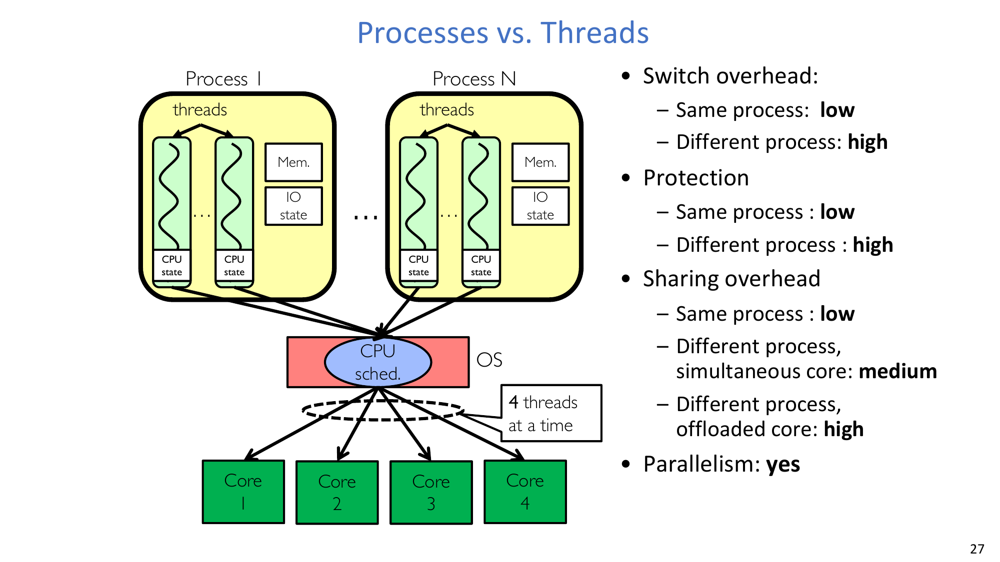

### 5.3 SMT/超线程
SMT 通过复制架构线程状态（如寄存器），让单物理核更充分利用执行槽位并交错多条指令流。
- 收益：吞吐和利用率提高。
- 限制：加速通常是次线性的，不等于“翻倍核心”。

## 6. 新线程到底如何启动

### 6.1 初始化新线程的 TCB 与栈
创建线程时，初始化逻辑会设置：
- 栈指针 `sp` 指向新栈。
- 返回 PC `retpc` 指向 `ThreadRoot`（运行时根 stub）。
- 参数寄存器（如 `r0/a0`、`r1/a1`）放入函数指针与参数指针。

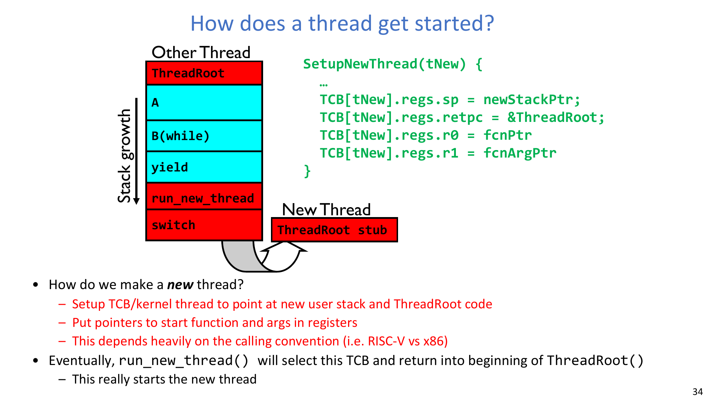

### 6.2 启动时的控制流转移
之后调度器一旦通过 `run_new_thread` 选中该 TCB，就会“返回”到 `ThreadRoot`，这才是新线程真正开始执行的位置。

### 6.3 `ThreadRoot` 的职责
这个根例程负责做启动统计、切到用户态、调用用户函数、并在函数返回后执行收尾。

```c
ThreadRoot(fcnPTR, fcnArgPtr) {
    DoStartupHousekeeping();
    UserModeSwitch();   /* enter user mode */
    Call fcnPtr(fcnArgPtr);
    ThreadFinish();
}
```

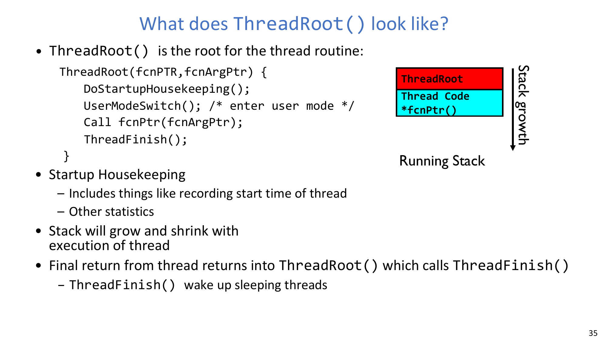

:::remark 问题：为什么不直接跳到用户函数，而要先经过 ThreadRoot？
因为运行时需要一个受控的前后处理入口：启动统计、模式切换，以及函数返回后的统一清理（`ThreadFinish`）。
:::

## 7. 插曲：如何高效阅读系统论文

本讲还给出了一套实用的论文阅读方法。

### 7.1 为什么这件事重要
阅读能力会长期用于：
- 课程学习与科研。
- 审稿评审。
- 同行反馈。
- 进入新方向。

### 7.2 Keshav 三遍阅读法
1. **第一遍（约 10 分钟）**：扫读标题/摘要/引言、章节标题、结论、参考文献，并提取 five C's（Category、Context、Correctness、Contributions、Clarity）。
2. **第二遍（约 1 小时）**：细读核心思想和图表，跳过深证明，标注后续参考文献。
3. **第三遍（数小时）**：在脑中“虚拟复现”，挑战假设，识别优缺点，提出后续工作方向。

### 7.3 实践建议
- 按目标选择阅读深度。
- 头脑清醒时读。
- 在少干扰环境读。
- 主动阅读（记笔记、提问题）。
- 批判性阅读（质疑假设）。

## 8. 案例：Shinjuku 与微秒级尾延迟

### 8.1 低延迟 OS 设计中的问题链
该案例给出了一条“问题 -> 改进”的演化链：
1. OS 开销高，于是采用 OS-bypass/polling/run-to-completion + 分布式 FCFS 队列（`d-FCFS`）。
2. 分布式队列会导致不均衡，甚至出现核心空闲（非 work-conserving）。
3. 中心化队列（`c-FCFS`）与 stealing 能改善均衡，但短请求仍可能被长请求阻塞。
4. 粗粒度抢占（如 `PS-1ms`）对微秒级尾延迟改善有限。
5. 高频抢占（`PS-5us`）才接近最优 99% 延迟表现。

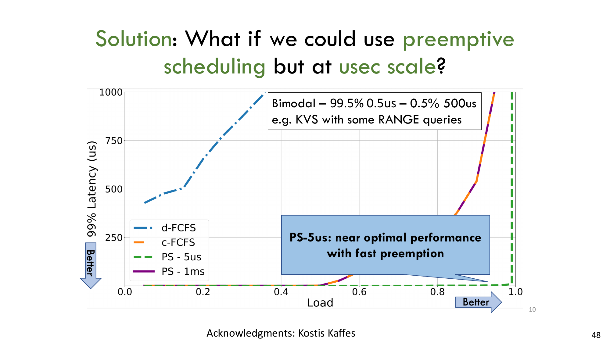

### 8.2 Shinjuku 的设计要点
Shinjuku 被描述为面向多种负载、追求微秒级尾延迟的单地址空间 OS。
- **Preemption as often as 5 us**。
- 用专用核心做调度与队列管理。
- 利用硬件虚拟化支持快速抢占。
- 用户态上下文切换非常快。
- 让调度策略与任务分布、延迟目标相匹配。

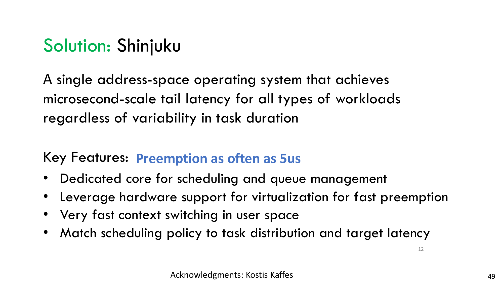

:::remark 问题：为什么“只做队列均衡”仍不足以解决尾延迟？
因为队列均衡与 work-conserving 不能消除“长请求头阻塞短请求”。若抢占粒度不够细，短请求仍会在长请求后面等待，从而拉高尾延迟。
:::

## 9. 为什么必须做同步

### 9.1 非确定性与正确性目标
在并发线程下，调度行为是非确定的：
- 线程可以按**任意顺序**运行。
- 切换可以在**任意时刻**发生。

独立线程（无共享状态）更容易推理；协作线程共享状态，必须显式设计正确性。

目标是：**correctness by design**。

### 9.2 真实系统中的并发事故
课程列举了多起经典案例：
- Therac-25 放疗设备过量照射与并发/同步错误相关。
- Mars Pathfinder 优先级反转（经典实时调度病理）。
- Toyota 非预期加速争议中，代码规模巨大且互斥使用不一致问题被反复讨论。

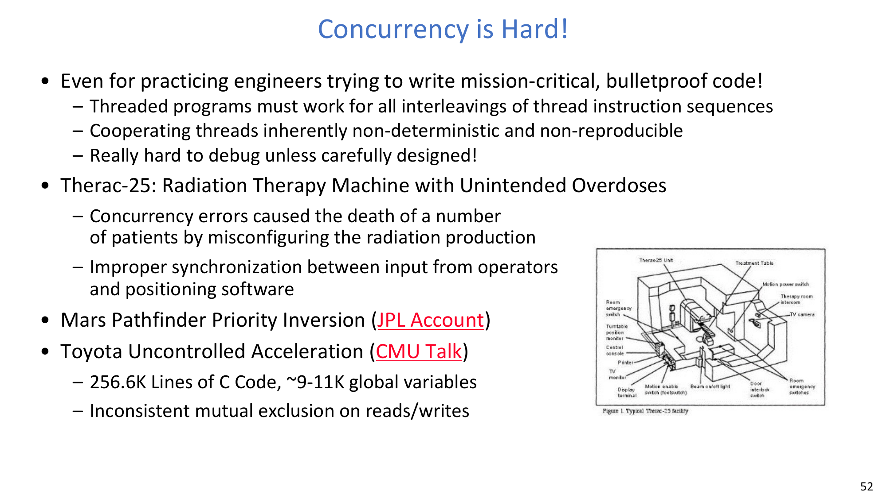

:::remark 问题：Mars Pathfinder 中的优先级反转是什么，为什么危险？
高优先级任务被持有共享资源的低优先级任务阻塞，而中优先级任务持续占用 CPU，导致低优先级任务迟迟不能释放资源。这会破坏实时性并触发重置或超时，通常需要优先级继承等机制来缓解。
:::

## 10. ATM 服务器示例：吞吐与正确性的冲突

### 10.1 问题定义
ATM 服务器必须同时满足：
- 能服务大量请求。
- 不能破坏数据库一致性。
- 不能多发现金额。

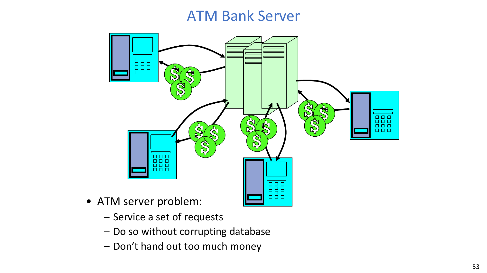

### 10.2 串行基线与提速方向
一个简单循环是：
1. 接收请求（`op`、`acctId`、`amount`）。
2. 执行处理（`Deposit` 等）。
3. 重复。

`Deposit` 路径涉及账户读取与写回，可能触发磁盘 I/O，因此纯串行会错失 I/O 与计算重叠机会。

课程给出三类提速思路：
- 同时处理多个请求。
- 事件驱动，把 I/O 与计算重叠。
- 多线程或多进程。

### 10.3 单 CPU 的事件驱动版本
事件驱动做法把一次请求拆成状态机回调（`StartOnRequest`、`ContinueRequest`、`FinishRequest`），由事件推进。

收益：
- 不用线程也能在单 CPU 上重叠 I/O 与计算。

代价：
- 代码结构被拆碎成大量非阻塞片段。
- 很容易漏掉阻塞点，导致响应性问题。

:::remark 问题：事件驱动版本里提到的两个实际难点是什么？
1. **如果漏掉一个阻塞 I/O 步骤怎么办？** 整个事件循环可能被卡住，延迟目标直接失效。  
2. **如果代码必须拆成上百段可阻塞片段怎么办？** 控制流和状态管理会迅速变得难维护、难验证。
:::

### 10.4 线程版本与竞态风险
线程让“重叠执行”更自然，因为每个请求可以按顺序代码风格书写。

但共享状态竞态会出现。两个线程同时给同一账户存款时，可能发生：
1. `T1` 读到 `balance = B`。
2. `T2` 也读到 `balance = B`。
3. `T2` 写回 `B + amount2`。
4. `T1` 再写回 `B + amount1`。

最终余额会变成 `B + amount1`（或 `B + amount2`），而不是 `B + amount1 + amount2`。

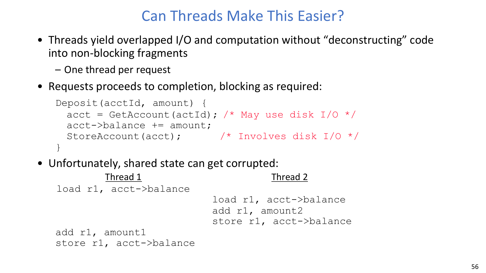

这就是经典 **lost update（丢失更新）**，也是同步机制的直接动机。

## 11. 结尾核心定义（原文保留）

课程在结尾给出以下核心定义（保持原表述）：
- **Atomic Operation: an operation that always runs to completion or not at all**。
- **Synchronization: using atomic operations to ensure cooperation between threads**。
- **Mutual Exclusion: ensuring that only one thread does a particular thing at a time**。
- **Critical Section: piece of code that only one thread can execute at once**。
- **Locks: synchronization mechanism for enforcing mutual exclusion on critical sections to construct atomic operations**。

并发实现依赖 CPU 时间复用：
- 卸载当前线程状态（PC/寄存器）。
- 加载新线程状态。
- 上下文切换可能是自愿的（`yield`、阻塞 I/O）或非自愿的（中断/抢占）。
- TCB + 栈共同保存可恢复的线程执行状态。

## 12. 小结
- 调度器 + 上下文切换构成操作系统并发能力的核心。
- 无共享状态的并发更容易正确；共享状态并发必须显式同步。
- 线程相比重度事件驱动常更易写、性能更好，但会引入竞态。
- 正确性最终依赖临界区上的原子性与互斥。

## 附录 A：Exam Review

### A.1 必背定义
- PCB、TCB、context switch、preemption、atomic operation、mutual exclusion、critical section、lock。

### A.2 必会机制链
1. 就绪/等待队列 + 调度策略选择可运行线程。
2. CPU 状态保存到旧 TCB，再从新 TCB 恢复。
3. 控制权通过自愿路径（I/O/wait/yield）或定时器中断返回内核。
4. 共享状态若无同步，正确性会被破坏。

### A.3 必会对比
- 同进程线程切换 vs 跨进程切换开销。
- 进程隔离收益 vs 线程共享效率。
- 事件驱动重叠 vs 线程重叠的取舍。
- `d-FCFS`/`c-FCFS`/`PS-1ms`/`PS-5us` 对尾延迟的定性影响。

### A.4 常见简答题
- 为什么 CPU 调度可以被建模成“队列迁移 + 策略”？
- 为什么上下文切换代码难以做穷举测试？
- 为什么更快的抢占能改善短请求尾延迟？
- 为什么 ATM 的线程处理会得到错误余额？

### A.5 常见误区
- 认为单次测试通过就等于并发正确。
- 把高吞吐误当成正确性保证。
- 在事件驱动代码里忽略阻塞路径。
- 不加互斥直接更新共享变量。

### A.6 自检清单
- 你能画出 `new/ready/running/waiting/terminated` 的状态迁移吗？
- 你能准确说明定时器中断如何重新进入调度器吗？
- 你能不跳步地推演一次丢失更新吗？
- 你能精确定义 atomic operation、mutual exclusion、critical section 吗？
