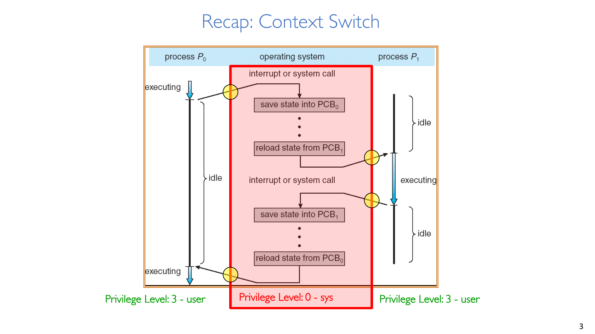
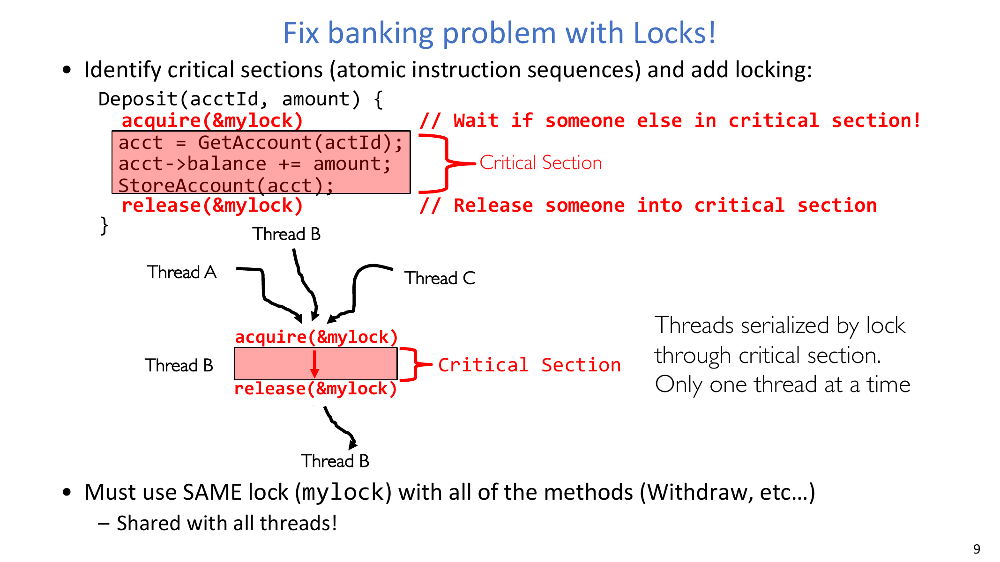
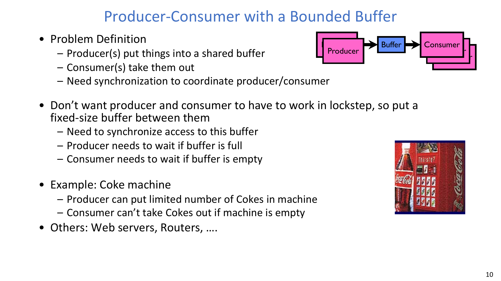
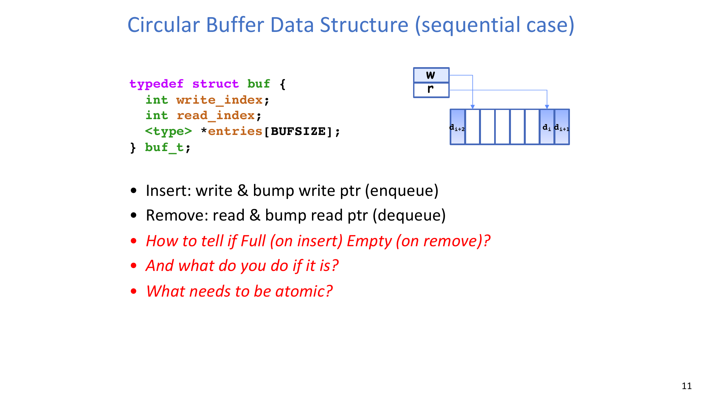
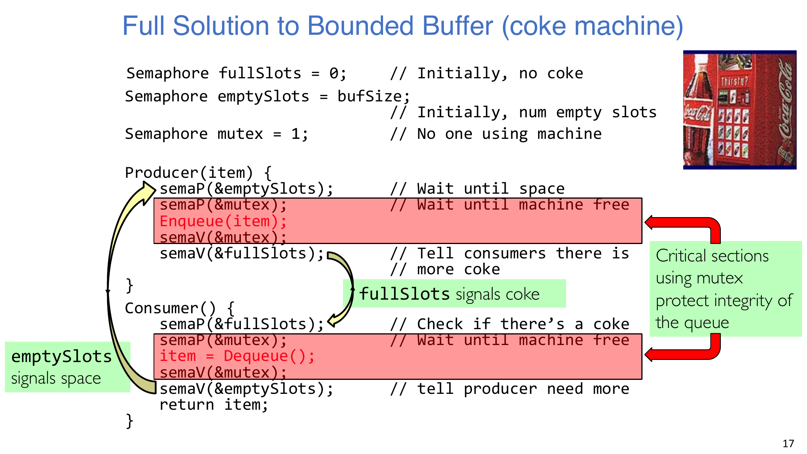
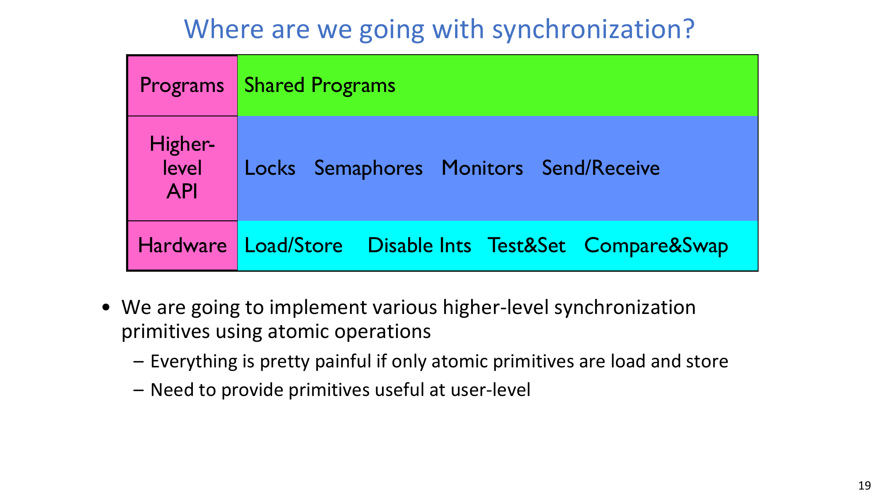
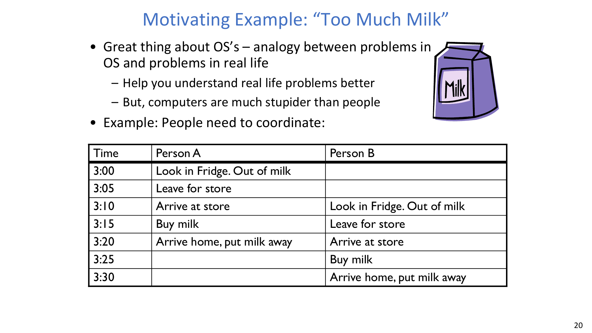
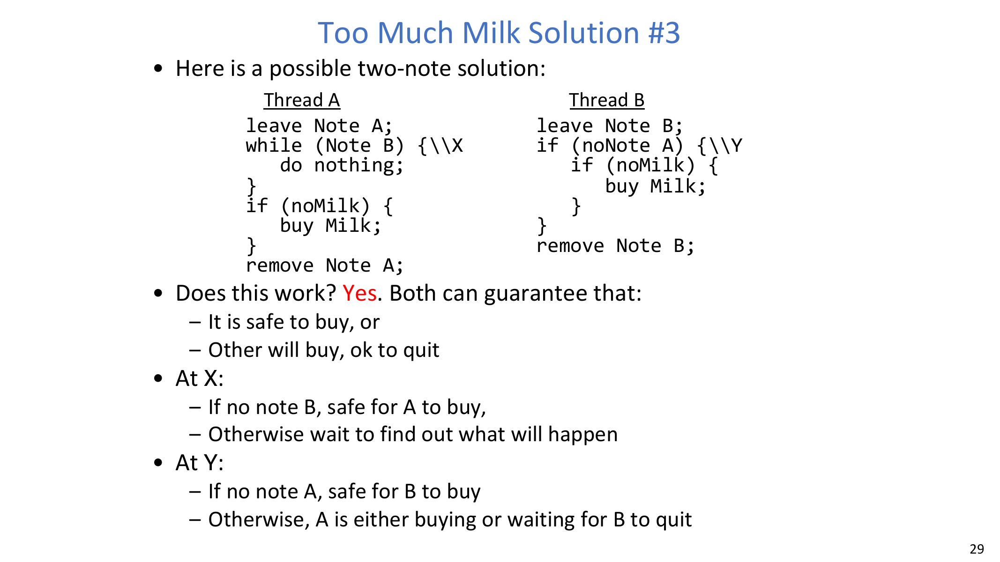
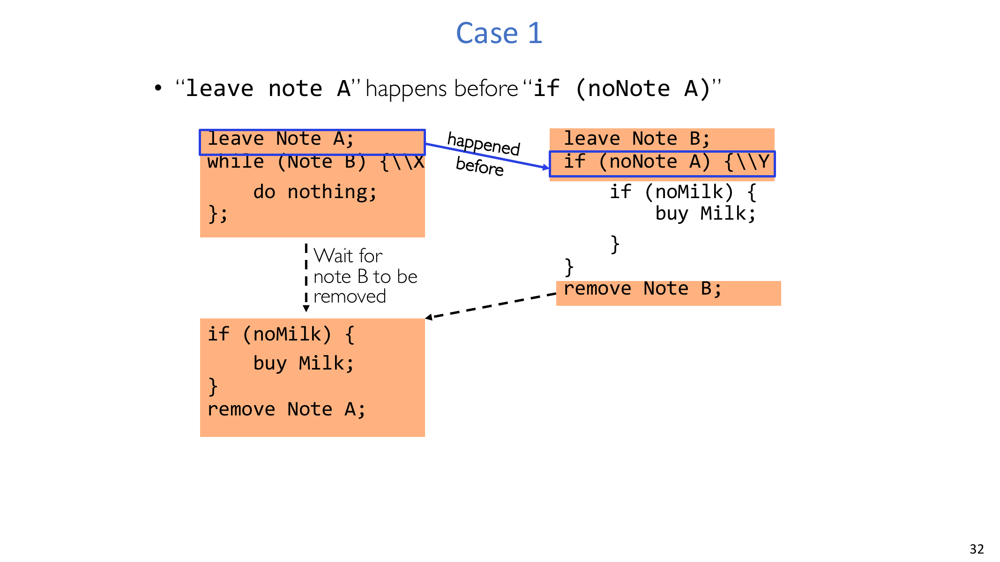
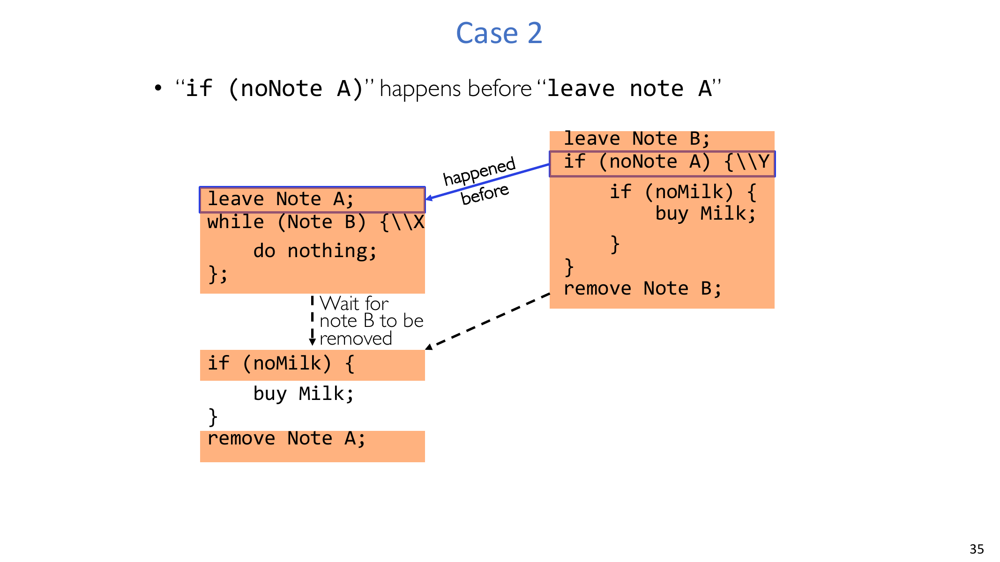

# Lec7 - 同步 2：锁的实现

## 学习目标
学完本讲后，你应当能够解释为什么仅靠普通 `load/store` 不足以完成可靠同步，能够用信号量设计正确的有界缓冲区方案，能够分析 `P/V` 操作顺序约束，并能用 Too-Much-Milk 案例推理并发程序的安全性与活性。

## 1. 快速回顾：为什么需要更强的同步原语

### 1.1 三遍阅读法（方法回顾）
课程先简要回顾了 Keshav 三遍阅读法，因为系统工作离不开严谨阅读与验证：
1. 第一遍：快速扫描结构。
2. 第二遍：抓核心思想与图表。
3. 第三遍：做“虚拟复现”并挑战假设。

### 1.2 上下文切换跨越特权级
上下文切换不只是“线程切换”，还包含陷入内核（中断/系统调用）、状态保存、状态恢复、返回用户态等完整路径。



### 1.3 Dispatch loop 是并发调度的概念核心
```c
Loop {
    RunThread();
    ChooseNextThread();
    SaveStateOfCPU(curTCB);
    LoadStateOfCPU(newTCB);
}
```
这个模型是一个无限循环，持续在可运行线程之间复用 CPU。

### 1.4 ATM 回顾：线程更自然，但会引入竞态
线程化请求处理让代码结构更自然，但共享状态会在交错执行下被破坏。银行示例说明了为什么必须用同一把共享锁保护临界区。



### 1.5 原子操作是基础概念
本讲关键原话是：**"Atomic Operation: an operation that always runs to completion or not at all."**  
原子性强调“不可分割”。没有可靠的原子原语，线程就无法安全协作。

## 2. 有界缓冲区下的生产者-消费者

### 2.1 问题设定与直观例子
生产者-消费者模型通过有限共享缓冲区把“生产速度”和“消费速度”解耦。
- 缓冲区满时，生产者必须等待。
- 缓冲区空时，消费者必须等待。
- 对共享队列状态的访问必须同步。



可乐机类比完全对应：
- 补货员一次只能补有限槽位。
- 顾客在机器为空时无法取饮料。

### 2.2 环形缓冲区的顺序结构
队列维护 `write_index` 与 `read_index`，通过模缓冲区大小递增指针实现入队与出队。



真正的设计问题是：
- 如何可靠判断 full/empty？
- 哪些操作必须是原子的？
- 等待期间线程应该怎么做？

:::remark 问题：如何判断 Full（入队时）和 Empty（出队时）？如果遇到怎么办？
常见实现有两类：
1. 显式计数：
   - `count == 0` 表示空；
   - `count == BUFSIZE` 表示满。
2. 预留一个空槽：
   - `read_index == write_index` 表示空；
   - `(write_index + 1) % BUFSIZE == read_index` 表示满。

遇到满/空后，生产者或消费者必须按同步策略阻塞（或等待）。忙等可以实现正确性，但通常效率较差。
:::

### 2.3 第一版（只有一把锁）会失败
如果生产者/消费者持有 `buf_lock` 并在 `while (buffer full/empty)` 里自旋，就可能互相卡死：
- 生产者拿着锁等待消费者动作；
- 消费者却拿不到锁去执行该动作。

:::remark 问题："Will we ever come out of the wait loop?"
第一版中可能出不来。等待线程持锁会阻止另一方推进条件，形成类似死锁的停滞。
:::

### 2.4 第二版避免了前述卡死，但依然很差
把“等待”改成循环内释放再重拿锁，确实避免了“持锁等待”，但会造成高频自旋和调度抖动。

:::remark 问题："What happens when one is waiting for the other?"
两边会频繁释放/重拿锁，这属于忙等。系统可能有进展，但会浪费 CPU，并在高竞争下影响公平性。
:::

### 2.5 信号量回顾（保留原定义）
- **Down() or P(): an atomic operation that waits for semaphore to become positive, then decrements it by 1**
- **Up() or V(): an atomic operation that increments the semaphore by 1, waking up a waiting P, if any**

补充事实：
- 信号量值是非负整数；
- `P` 来自荷兰语 *proberen*（测试），`V` 来自 *verhogen*（增加）。

### 2.6 有界缓冲区的正确性约束
正确方案必须同时满足三条约束：
1. 没有可消费槽位时，消费者必须等待。
2. 没有可生产槽位时，生产者必须等待。
3. 任意时刻只允许一个线程修改队列内部状态。

经验法则：**每条约束使用独立信号量**。
- `fullSlots`：消费者侧调度约束
- `emptySlots`：生产者侧调度约束
- `mutex`：互斥约束

### 2.7 完整信号量方案


```c
Semaphore fullSlots = 0;
Semaphore emptySlots = bufSize;
Semaphore mutex = 1;

Producer(item) {
    semaP(&emptySlots);  // 等待空槽
    semaP(&mutex);       // 进入临界区
    Enqueue(item);
    semaV(&mutex);       // 离开临界区
    semaV(&fullSlots);   // 通知“满槽 +1”
}

Consumer() {
    semaP(&fullSlots);   // 等待可消费项
    semaP(&mutex);       // 进入临界区
    item = Dequeue();
    semaV(&mutex);       // 离开临界区
    semaV(&emptySlots);  // 通知“空槽 +1”
    return item;
}
```

### 2.8 为什么不对称、为什么顺序重要
- 生产者执行 `P(emptySlots)` 再 `V(fullSlots)`，因为它消耗空槽并产生满槽。
- 消费者执行 `P(fullSlots)` 再 `V(emptySlots)`，因为它消耗满槽并产生空槽。

:::remark 问题："Is order of P's important?"
重要。错误顺序会导致死锁。  
如果线程先拿 `mutex` 再阻塞在 `emptySlots/fullSlots`，它可能长期占住其他线程推进计数所需的锁。
:::

:::remark 问题："Is order of V's important?"
对安全性通常不像 `P` 顺序那样敏感；但会影响唤醒顺序与调度效率，因此仍有性能意义。
:::

:::remark 问题："What if we have 2 producers or 2 consumers? Do we need to change anything?"
不需要改算法。三把信号量表达的三类约束不变，只是竞争线程数增加。
:::

## 3. 同步机制的分层方向
同步机制是分层构建的：底层是硬件原子原语，上层才是锁、信号量、管程、消息收发。



核心结论是：用户态可用的同步 API 必须建立在比普通 `load/store` 更强的原子能力之上。

## 4. 案例：Too Much Milk

### 4.1 场景与时间线
两个人都想保证“没牛奶就去买”，但时间交错会导致重复购买。



按时间线可见：
1. A 先发现没牛奶并出门；
2. A 未返回时，B 也发现没牛奶并出门；
3. 两人都买了牛奶。  
这就是现实世界中的同步错误。

### 4.2 锁直觉与“过度串行化”
锁的直觉是：
- 进入临界区前加锁；
- 离开临界区后解锁；
- 锁被占用时等待。

“冰箱钥匙”类比可以阻止重复买奶，但也会错误地阻塞无关动作（例如室友只想拿橙汁）。好的同步应该只保护真正的临界区。

### 4.3 必须满足的正确性目标
该问题有两条目标：
1. **Never more than one person buys**（安全性）。
2. **Someone buys if needed**（活性/可进展性）。

### 4.4 方案 #1（单便签）为何会“偶发失败”
```c
if (noMilk) {
    if (noNote) {
        leave Note;
        buy Milk;
        remove Note;
    }
}
```

:::remark 问题：方案 #1 的根本问题是什么？
线程可能在检查完 `noMilk`/`noNote` 之后、真正执行 `buy Milk` 之前被切走。另一线程会通过同样检查并执行购买。  
结果是“仍会多买，但只偶尔发生”。这种间歇性并发错误最难排查。
:::

### 4.5 方案 #1½（先贴便签）破坏活性
```c
leave Note;
if (noMilk) {
    if (noNote) {
        buy Milk;
    }
}
remove Note;
```
两人都先贴便签后，可能都看到“对方便签存在”而都不买。

:::remark 问题：为什么该版本会出现“永远没人买奶”？
条件可能进入互相阻塞：每个人的便签都让对方放弃购买。安全性可能成立，但活性失败。
:::

### 4.6 方案 #2（带标签便签）仍有锁死风险
```c
Thread A: leave NoteA; if (noNoteB) { if (noMilk) buy; } remove NoteA;
Thread B: leave NoteB; if (noNoteA) { if (noMilk) buy; } remove NoteB;
```
在不幸时序下，双方都可能认为“对方会买”，导致没人买。

课程在该语境下把这种卡住称作 **"starvation"**。

:::remark 问题：为什么这类 bug 在工程上更危险？
因为它可能低频但高危。低频并发错误常在生产环境特定时序下爆发，并且往往发生在最坏时刻。
:::

### 4.7 方案 #3（不对称双便签）可行
```c
Thread A:
leave NoteA;
while (NoteB) { /* do nothing */ }   // X
if (noMilk) { buy Milk; }
remove NoteA;

Thread B:
leave NoteB;
if (noNoteA) {                        // Y
    if (noMilk) { buy Milk; }
}
remove NoteB;
```



两侧都能保证以下二选一：
1. 当前线程买是安全的；
2. 对方会买，因此当前线程退出也安全。

### 4.8 Case 分析（强调过程变化）

#### Case 1：`leave NoteA` 先于 `if (noNoteA)`


过程：
1. A 先放 `NoteA`；
2. B 执行 `if (noNoteA)` 时看到 `NoteA`，因此不买；
3. A 可能在 `while(NoteB)` 等待；
4. B 移除 `NoteB`，A 继续；
5. A 检查 `noMilk`，若仍缺奶则购买。

结果：最多一人购买，并且需要时会有人买。

#### Case 2：`if (noNoteA)` 先于 `leave NoteA`


过程：
1. B 在 A 放 `NoteA` 前执行 `if (noNoteA)`，因此可能进入购买路径；
2. B 若发现缺奶则购买，并移除 `NoteB`；
3. A 之后等待 `NoteB` 消失，再继续；
4. A 检查 `noMilk` 时通常已不缺奶，因此不会重复购买。

结果：仍不会重复购买，活性也保持。

### 4.9 为什么方案 #3 仍不理想
虽然正确，但工程上问题很大：
- 对这么简单的问题，代码已经过于复杂；
- A 与 B 代码不同，扩展到多线程时维护性差；
- 等待环节消耗 CPU（**busy-waiting**）。

因此需要 test-and-set / compare-and-swap 等更强硬件原语，并在其上构建更高层抽象。

## 5. 关键定义（原文对应）
- **Synchronization: using atomic operations to ensure cooperation between threads**  
  同步：利用原子操作保证线程之间可以正确协作。
- **Mutual Exclusion: ensuring that only one thread does a particular thing at a time**  
  互斥：保证同一时刻只有一个线程执行某类关键动作。
- **Critical Section: piece of code that only one thread can execute at once**  
  临界区：任意时刻仅允许一个线程进入执行的代码片段。
- **Locks: synchronization mechanism for enforcing mutual exclusion on critical sections to construct atomic operations**  
  锁：通过在临界区上施加互斥来构造原子性的同步机制。
- **Semaphores: synchronization mechanism for enforcing resource constraints**  
  信号量：用于表达并强制资源约束的同步机制。
- **Atomic Operations: an operation that runs to completion or not at all**  
  原子操作：要么完整执行完毕，要么完全不发生。

## 6. 小结
- 仅靠 `load/store` 的原子性不足以支撑实用同步。
- 有界缓冲区同时需要“调度约束 + 互斥约束”。
- 正确的信号量分解是“每个约束对应独立信号量”。
- 正确性必须对任意交错成立，而不是仅对“常见时序”成立。
- 忙等可以做到正确，但效率差，需要更高层原语。

## 附录 A：Exam Review

### A.1 必背定义
- atomic operation、synchronization、mutual exclusion、critical section、lock、semaphore（`P/V`）。

### A.2 有界缓冲区标准模板
1. `P(empty/full)` 满足可用性约束。
2. `P(mutex)` 进入队列临界区。
3. 执行入队/出队。
4. `V(mutex)` 离开临界区。
5. `V(full/empty)` 通知状态变化。

### A.3 必会问答
- 为什么“单锁 + 持锁忙等”会失败？
- 为什么 `P` 的顺序是安全性关键？
- 为什么 `V` 顺序会影响性能？
- 为什么方案 #1 是间歇性失败？
- 为什么方案 #1½ / #2 会破坏活性？
- 为什么方案 #3 正确却仍不是好抽象？

### A.4 常见错误
- 在等待资源计数信号量时仍持有 `mutex`。
- 把安全性（不重复买）误当成活性（一定有人买）。
- 误以为“低概率失败”可以接受。
- 忽视 busy-wait 的 CPU 成本。

### A.5 自检清单
- 你能默写生产者-消费者的完整信号量方案吗？
- 你能解释生产者与消费者操作的不对称来源吗？
- 你能不跳步推演方案 #3 的 Case 1 与 Case 2 吗？
- 你能区分“正确性问题”和“效率问题”吗？
