# Lec8 - Synchronization 3: Lock Implementation, Atomic Instructions, and Monitors

## Learning Objectives
After this lecture, you should be able to explain why lock implementations need hardware support beyond plain load/store, reason about lost-wakeup hazards in sleep/wakeup lock designs, compare interrupt-based and test-and-set-based lock implementations, and use monitors with condition variables correctly (including Mesa vs. Hoare semantics).

## 1. Recap: Why Synchronization Design Is Subtle

### 1.1 Producer-consumer and bounded buffer constraints
The producer-consumer problem models two different roles sharing one buffer:
- Producer threads insert items.
- Consumer threads remove items.
- Both sides must coordinate when the buffer is full or empty.

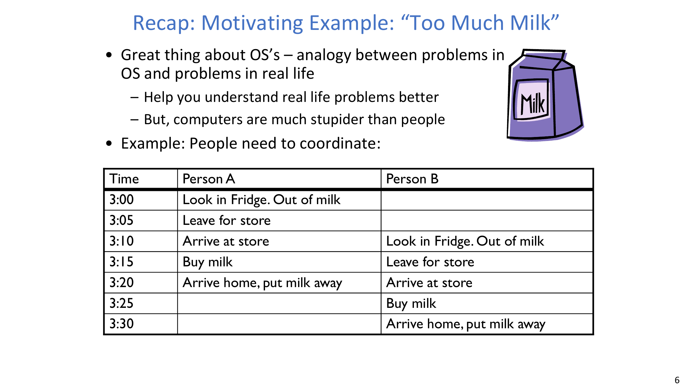

A correct bounded-buffer solution separates constraints clearly:
1. Capacity constraint for producers (wait if full).
2. Availability constraint for consumers (wait if empty).
3. Mutual exclusion when accessing shared queue metadata.

### 1.2 Why poor waiting strategy fails
If a thread waits in a tight loop while repeatedly releasing and reacquiring a lock, correctness might still hold, but CPU time is wasted and behavior is fragile under contention.

:::remark Question: What happens when one side is waiting for the other in naive lock-loop designs?
The waiting side can consume CPU cycles without making progress (busy waiting). Under unlucky scheduling, this can also delay the thread that could actually satisfy the condition.
:::

### 1.3 Too-Much-Milk recap and lesson
The Too-Much-Milk case study shows that concurrency bugs can be:
- intermittent (rare timing windows),
- correctness-breaking (double buy or nobody buys),
- hard to reason about from code that "looks plausible."

The bigger lesson is that synchronization APIs must make the intended waiting semantics explicit and verifiable.

## 2. Lock Interface and Correctness Target

A lock should provide two operations with clear behavior:
- `acquire(&lock)`: wait until free, then atomically take ownership.
- `release(&lock)`: release ownership and wake a waiter if one exists.

Both operations must be atomic with respect to lock metadata updates. If two waiters simultaneously observe "free" and both proceed, mutual exclusion is broken.

## 3. Locking by Disabling Interrupts

### 3.1 Naive design and its problems
A first attempt on a uniprocessor is:
- `LockAcquire { disable interrupts; }`
- `LockRelease { enable interrupts; }`

This design is unacceptable as a general lock mechanism:
- User code must not be allowed to block interrupts globally.
- Long critical sections can delay urgent device and timer events.
- Real-time guarantees become impossible.
- It does not scale to multiprocessors.

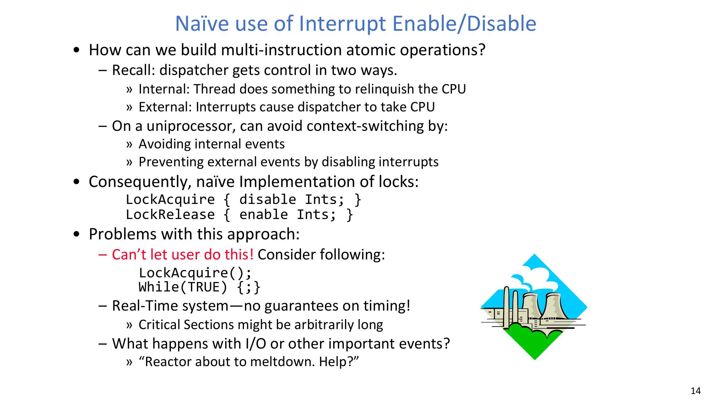

### 3.2 Better in-kernel version: protect only lock metadata operations
A better kernel-only pattern disables interrupts only around lock-state transitions inside `Acquire()`/`Release()`, not around the user critical section.

This keeps the lock-internal critical section short while preserving atomicity of check-and-update on lock state.

:::remark Question: Why disable interrupts at all in this design?
Because `Acquire()` must not be interrupted between checking lock state and updating lock metadata. Without this short protection window, two threads can both conclude they own the lock.
:::

### 3.3 The hard part: where to re-enable interrupts around sleep
When `Acquire()` finds the lock busy, it must enqueue and sleep. The exact enable position matters.

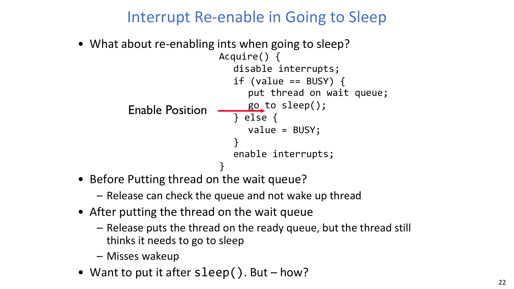

If interrupts are re-enabled too early or too late, we can lose wakeups:
- Re-enable before enqueueing: `Release()` may see no waiter and skip wakeup.
- Re-enable after enqueueing but before actually sleeping: `Release()` may wake the thread, but the thread still executes sleep afterward (missed wakeup).

### 3.4 Correct strategy after sleep
The robust approach is:
- `sleep()` is invoked with interrupts disabled.
- After context switch, the next running thread is responsible for re-enabling interrupts.
- When the sleeper is later woken and resumed, it continues `Acquire()` and restores interrupt state consistently.

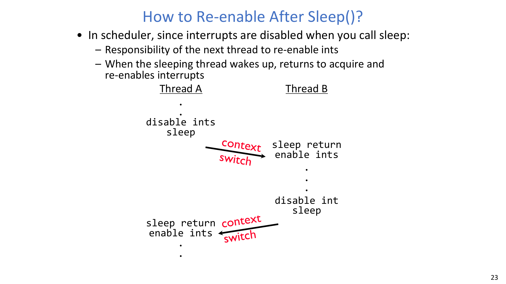

### 3.5 State-transition view of in-kernel lock simulation
During execution, lock state evolves across:
- `value` (`FREE/BUSY`),
- wait queue membership,
- owner identity,
- running/ready/waiting thread states.

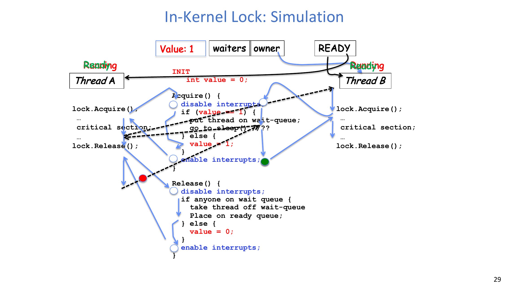

The important process change is that ownership transfer and wakeup must be coordinated with queue state atomically; otherwise wakeup can be lost.

## 4. Atomic Read-Modify-Write Instructions

### 4.1 Why hardware atomic instructions
Interrupt-based lock internals are kernel-specific and unsuitable for user-level synchronization. On multiprocessors, coordinated interrupt disabling is expensive and impractical.

The alternative is hardware-provided atomic read-modify-write (RMW) instructions.

### 4.2 Key examples
Common RMW primitives:

```c
// test&set(address): return old M[address], then set M[address] = 1

// swap(address, register): atomically exchange memory and register values

// compare&swap(address, reg1, reg2):
// if M[address] == reg1, set M[address] = reg2 and report success;
// else leave memory unchanged and report failure
```

### 4.3 Simple test-and-set lock
```c
int value = 0; // FREE

Acquire() {
    while (test&set(value)); // spin while BUSY
}

Release() {
    value = 0;
}
```

This implementation is simple and works on multiprocessors, but waiting threads spin continuously.

### 4.4 Busy waiting: pros and cons
- Positives:
  - Machine can still receive interrupts.
  - Usable in user code.
  - Works on multiprocessors.
- Negatives:
  - Waiting burns CPU cycles.
  - A spinner can steal cycles from lock holder.
  - Cache coherence traffic increases (especially when every spin iteration performs a write-like RMW).

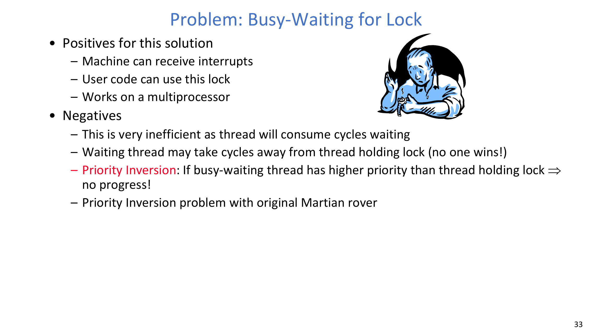

:::remark Question: Why can busy waiting cause "no progress" under priority inversion?
If a high-priority waiter spins while the low-priority lock holder is preempted, the lock holder may not run enough to release the lock. The waiter keeps consuming CPU but cannot progress.
:::

### 4.5 Better lock with test-and-set guard
A better design introduces a short-spin guard and a sleep queue:
- Spin only to acquire `guard` (very short critical window).
- If lock value is busy, enqueue and sleep.
- Otherwise set lock busy and release guard.
- On release, wake a waiter if present; otherwise set lock free.

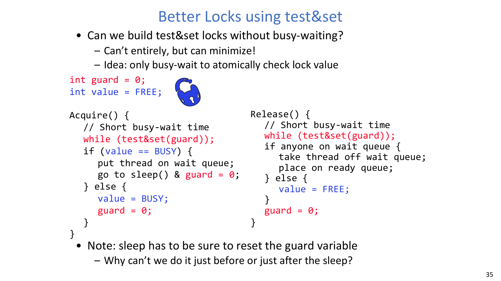

This minimizes busy waiting to lock-metadata protection only.

## 5. Synchronization Stack and Abstraction Direction

Synchronization is built in layers:
- Hardware primitives (`load/store`, disable interrupts, test&set, compare&swap).
- Higher-level APIs (locks, semaphores, monitors, send/receive).
- Program-level shared-data coordination.

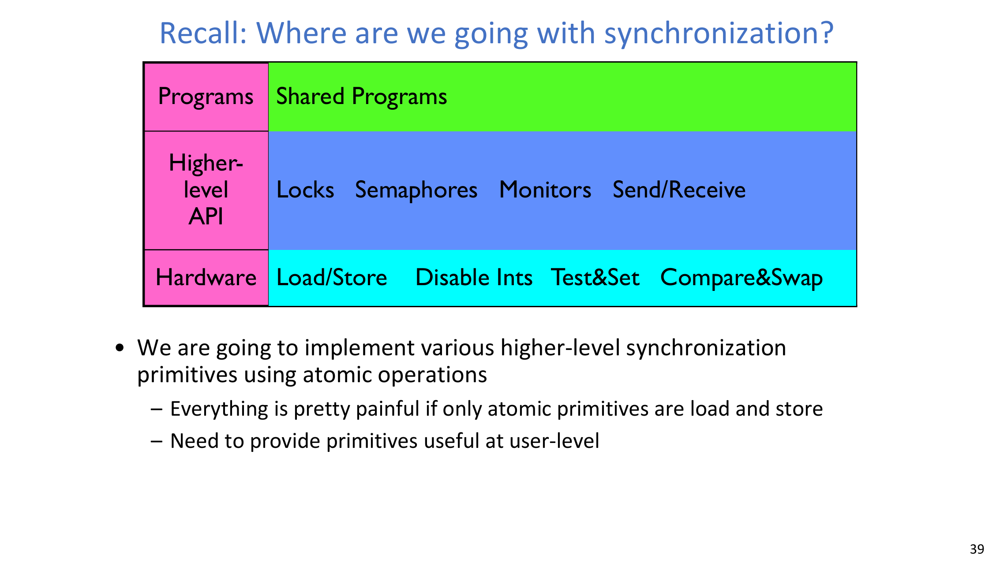

The direction is to expose easy-to-use and less error-prone abstractions built on atomic hardware support.

## 6. From Semaphores to Monitors

### 6.1 Why semaphores are not the end point
Semaphores are powerful, but they mix two concerns:
- mutual exclusion,
- scheduling constraints.

This dual role can make code harder to prove and maintain.

### 6.2 Monitor definition
A key definition is:

**Monitor: a lock and zero or more condition variables for managing concurrent access to shared data.**

### 6.3 Condition variable definition and operations
Another key definition is:

**Condition Variable: a queue of threads waiting for something inside a critical section.**

Operations:
- `Wait(&lock)`: atomically release lock and sleep; before return, re-acquire lock.
- `Signal()`: wake one waiter, if any.
- `Broadcast()`: wake all waiters.

Rule:
- Condition-variable operations must be done while holding the associated lock.

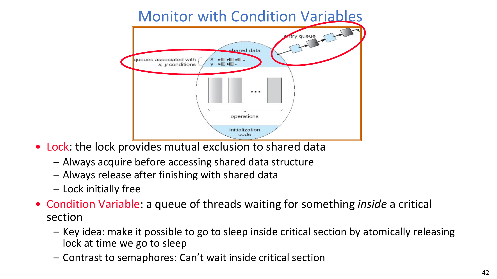

### 6.4 Synchronized queue with condition variables
Typical monitor-style queue logic:
- Producer acquires lock, enqueues, signals consumer CV, releases lock.
- Consumer acquires lock, waits while empty, dequeues, releases lock.

The critical point is that waiting is sleep-based, not busy-waiting.

## 7. Mesa vs. Hoare Monitor Semantics

### 7.1 Why this matters
Consider consumer logic:

```c
while (isEmpty(queue)) {
    cond_wait(&buf_CV, &buf_lock);
}
item = dequeue(queue);
```

Why `while`, not just `if`? The answer depends on scheduling semantics.

### 7.2 Hoare monitors
In Hoare semantics:
- Signaler immediately gives lock and CPU to waiter.
- Waiter runs right away while the condition is still guaranteed true.

Pros:
- Clean reasoning model.

Costs:
- Extra context switching.
- Harder implementation in production systems.

### 7.3 Mesa monitors
In Mesa semantics:
- Signaler keeps lock/CPU.
- Waiter is moved to ready queue without special priority.
- By the time waiter runs, condition may be false again.

Therefore, real code must re-check condition after wakeup, which is exactly why we use `while` around `cond_wait`.

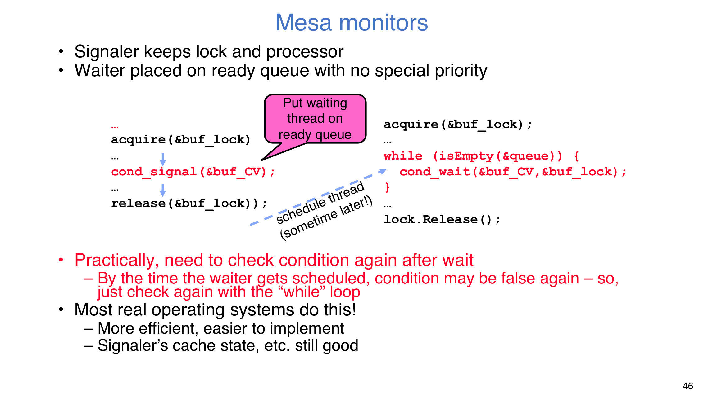

:::remark Question: Why is `if (isEmpty) cond_wait(...)` unsafe in most real systems?
Because most systems use Mesa-style semantics. A wakeup means "condition may now be true," not "condition is guaranteed true when you run." Another thread may consume the resource first, so the waiter must re-check using a `while` loop.
:::

## 8. Circular Buffer with Monitors (Third Cut)

The monitor version uses one lock plus two condition variables:
- `producer_CV`: producers wait here when buffer is full.
- `consumer_CV`: consumers wait here when buffer is empty.

Producer flow:
1. Acquire lock.
2. While full, `cond_wait(producer_CV, lock)`.
3. Enqueue item.
4. `cond_signal(consumer_CV)`.
5. Release lock.

Consumer flow:
1. Acquire lock.
2. While empty, `cond_wait(consumer_CV, lock)`.
3. Dequeue item.
4. `cond_signal(producer_CV)`.
5. Release lock.

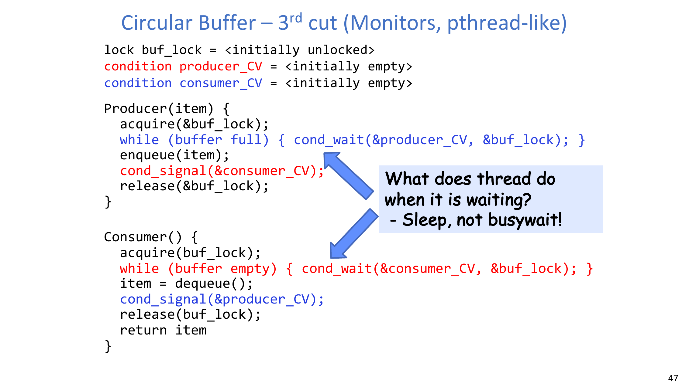

This gives clean separation:
- lock for mutual exclusion,
- condition variables for waiting/scheduling.

## 9. Key Takeaways
- **Atomic Operations** are the foundation of all synchronization abstractions.
- Interrupt disabling can protect short kernel lock-metadata regions, but it is not a general user-level lock mechanism.
- Pure spinning locks are simple but can waste CPU and trigger priority inversion.
- Guarded lock designs minimize spinning by combining short atomic protection with sleep queues.
- Monitors improve structure by separating mutex protection from condition waiting.
- In Mesa-style systems, always write condition waits with `while`, not `if`.

## Appendix A. Exam Review

### A.1 Definitions to memorize
- **Atomic Operation**: an operation that runs to completion or not at all.
- **Monitor**: a lock and zero or more condition variables for managing concurrent access to shared data.
- **Condition Variable**: a queue of threads waiting for something inside a critical section.

### A.2 Comparison checklist
- Disable-interrupt lock:
  - Good for short kernel-internal metadata updates.
  - Not safe as a user-level primitive.
- Simple test&set lock:
  - Correct mutual exclusion.
  - Expensive under contention due to spinning.
- Guard + wait-queue lock:
  - Short spin window.
  - Sleep when blocked.

### A.3 Must-answer reasoning questions
1. Why can "enable interrupts" placement cause missed wakeups?
2. Why does multiprocessor support push us toward hardware RMW primitives?
3. Why can priority inversion block progress?
4. Why does Mesa scheduling require `while (condition) wait`?

### A.4 Common mistakes
- Holding global interrupt disable for long sections.
- Assuming wakeup implies condition still true.
- Using one synchronization variable for multiple independent constraints.
- Forgetting that `Wait` must atomically release lock and sleep.

### A.5 Quick implementation template (monitor style)
1. Acquire monitor lock.
2. While condition not satisfied, `cond_wait`.
3. Modify shared state.
4. Signal/broadcast if your update may unblock others.
5. Release lock.
