# Lec9 - Synchronization 4: Readers/Writers and Monitor Design Tradeoffs

## Learning Objectives
After this lecture, you should be able to explain why readers/writers needs more than a single global lock, trace a monitor-based readers/writers execution with state variables, analyze starvation and wakeup tradeoffs, and compare monitor semantics across C/C++/Python/Java implementations.

## 1. Why Readers/Writers Needs a Dedicated Policy

A shared database usually has two classes of operations:
- **Readers** inspect data without modifying it.
- **Writers** inspect and modify data.

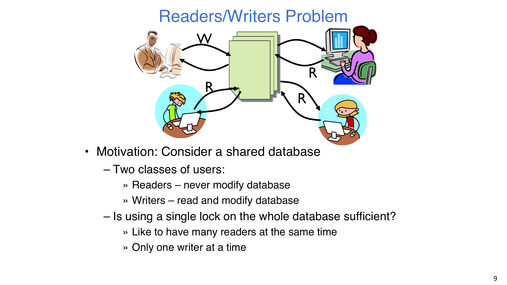

Using one coarse lock for the entire database is correct but often too restrictive. It serializes all readers, even though multiple readers can safely run together when no writer is active.

## 2. Correctness Constraints and Shared State

The monitor solution is built around three core constraints:
- **Readers can access database when no writers.**
- **Writers can access database when no readers or writers.**
- **Only one thread manipulates state variables at a time.**

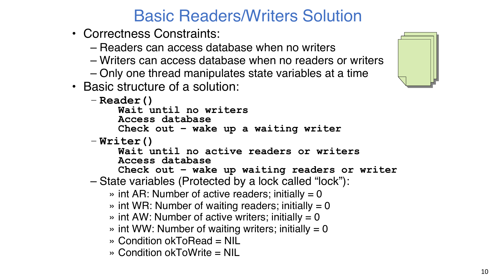

State tracked inside the monitor:

| Variable | Meaning | Initial value |
| --- | --- | --- |
| `AR` | number of active readers | `0` |
| `WR` | number of waiting readers | `0` |
| `AW` | number of active writers | `0` |
| `WW` | number of waiting writers | `0` |
| `okToRead` | condition variable for readers | empty |
| `okToWrite` | condition variable for writers | empty |

## 3. Reader Procedure (Writer-Preference Entry Rule)

Reader entry logic:
1. Acquire monitor lock.
2. While `(AW + WW) > 0`, increment `WR` and sleep on `okToRead`.
3. After wakeup, decrement `WR`, increment `AR`, and release lock.
4. Perform read-only database access outside the lock.

Reader exit logic:
1. Re-acquire lock and decrement `AR`.
2. If `AR == 0 && WW > 0`, signal one writer.
3. Release lock.

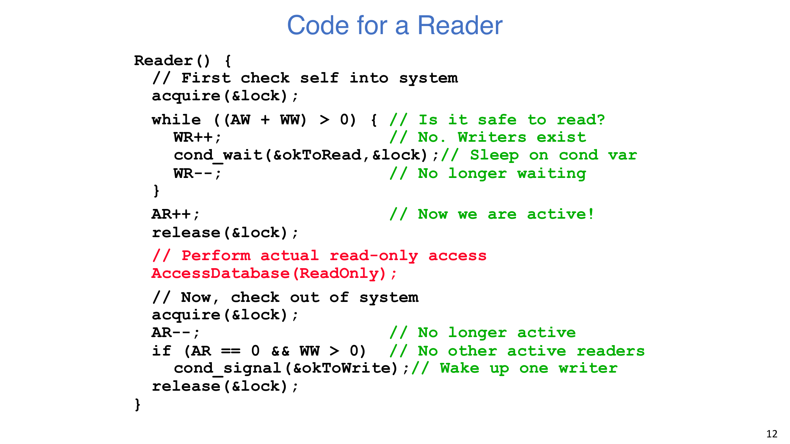

The condition `(AW + WW) > 0` means readers block not only on active writers, but also when writers are already waiting. This is a deliberate writer-preference policy.

## 4. Writer Procedure (Controlled Handoff)

Writer entry logic:
1. Acquire lock.
2. While `(AW + AR) > 0`, increment `WW` and wait on `okToWrite`.
3. After wakeup, decrement `WW`, set `AW++`, and release lock.
4. Perform read/write database access outside the lock.

Writer exit logic:
1. Re-acquire lock and decrement `AW`.
2. If `WW > 0`, signal one waiting writer.
3. Else if `WR > 0`, broadcast to readers.
4. Release lock.

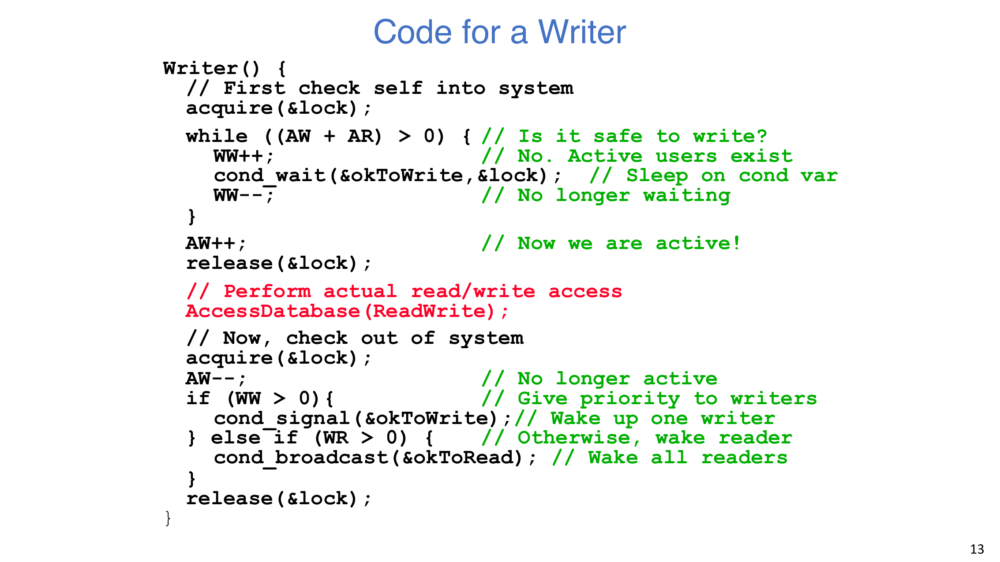

This wakeup order gives writers priority whenever writers are queued.

## 5. Process View: State Changes for `R1, R2, W1, R3`

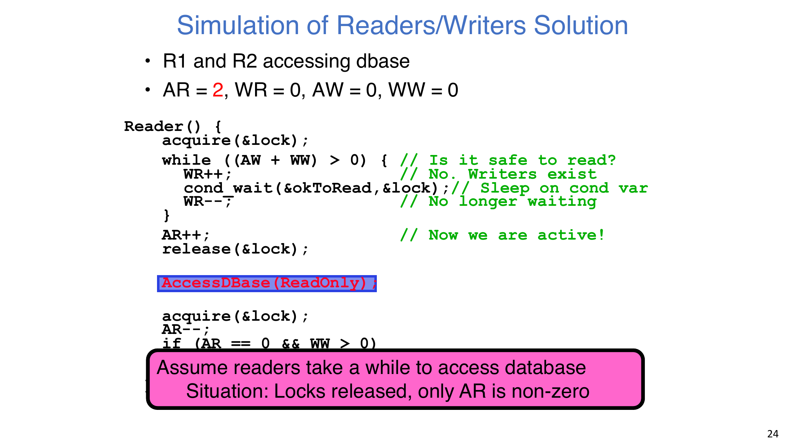

The execution sequence below captures the important transitions:

| Step | Event | `AR` | `WR` | `AW` | `WW` |
| --- | --- | ---: | ---: | ---: | ---: |
| 1 | Initial state | 0 | 0 | 0 | 0 |
| 2 | `R1` enters and starts reading | 1 | 0 | 0 | 0 |
| 3 | `R2` enters and starts reading | 2 | 0 | 0 | 0 |
| 4 | `W1` arrives, cannot enter, waits | 2 | 0 | 0 | 1 |
| 5 | `R3` arrives, blocked by waiting writer | 2 | 1 | 0 | 1 |
| 6 | `R2` exits | 1 | 1 | 0 | 1 |
| 7 | `R1` exits, last reader signals writer | 0 | 1 | 0 | 1 |
| 8 | `W1` wakes and writes (`WW--`, `AW++`) | 0 | 1 | 1 | 0 |
| 9 | `W1` exits and broadcasts readers | 0 | 1 | 0 | 0 |
| 10 | `R3` wakes and reads (`WR--`, `AR++`) | 1 | 0 | 0 | 0 |
| 11 | `R3` exits | 0 | 0 | 0 | 0 |

The key process insight is that admission policy is dynamic: once a writer is waiting, newly arriving readers stop entering, even if readers are currently active.

## 6. Key Questions and Answers

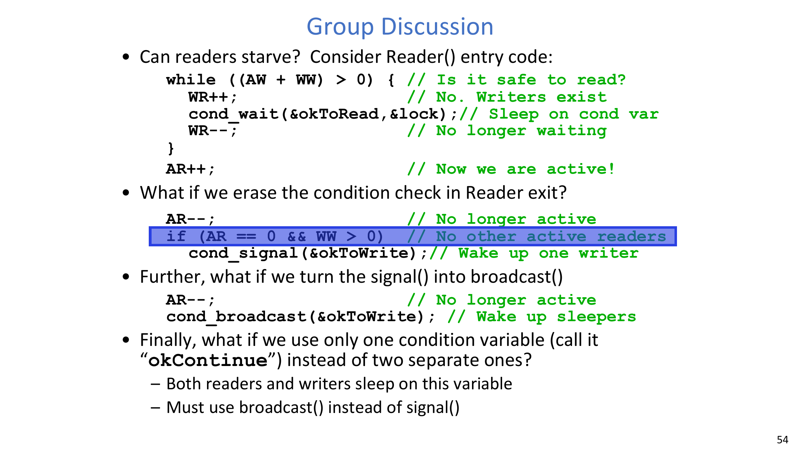

1. **Question: Can readers starve under this policy?**

:::remark Answer
Yes. This implementation is writer-preference. If writers keep arriving frequently, `WW` stays positive, and newly arriving readers remain blocked behind the writer queue for an unbounded time.
:::

2. **Question: What if reader exit becomes unconditional signal, i.e. `AR--; cond_signal(&okToWrite);`?**

:::remark Answer
Correctness is usually preserved by the writer-side `while ((AW + AR) > 0)` recheck, but efficiency drops. You can wake writers even when `AR > 0`, causing repeated futile wakeups and extra context switches.
:::

3. **Question: What if that signal is replaced by broadcast to writers?**

:::remark Answer
This creates a thundering-herd effect. Many writers wake up, compete for the same lock, discover the condition is still false, and sleep again. Throughput and cache locality both degrade.
:::

4. **Question: What if readers and writers share one condition variable (`okContinue`)?**

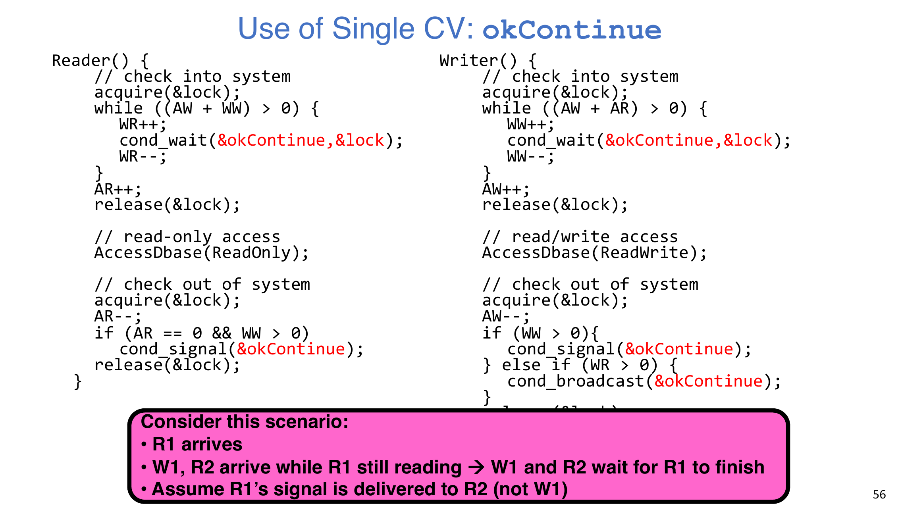

:::remark Answer
With one CV, `signal()` can wake the wrong class (reader vs writer). In the scenario `R1` active, `W1` and `R2` waiting, if `R1` signals only `R2`, `R2` may fail its predicate and sleep again while `W1` is still sleeping, which can stall progress. The practical fix is to use `broadcast()` so all sleepers re-check predicates.
:::

## 7. One CV vs Two CVs

Using one CV (`okContinue`) is possible, but the tradeoff is clear:

- Benefits:
  - Simpler interface with fewer condition objects.
- Costs:
  - Less precise wakeups.
  - More dependence on `broadcast()`.
  - Higher wakeup overhead under contention.

Using two CVs (`okToRead`, `okToWrite`) allows targeted wakeups and cleaner performance behavior.

## 8. Can We Build Monitors from Semaphores?

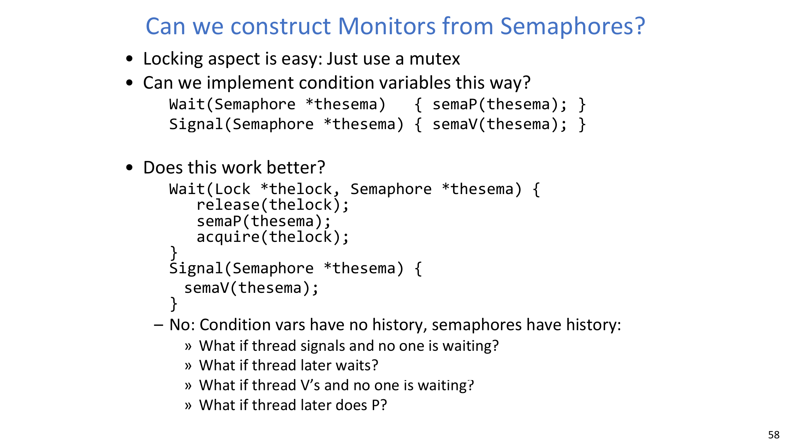

Locking is easy with a mutex, but condition-variable semantics are subtle.

A central distinction is:
- **Condition variables have no history, semaphores have history.**

Consequences:
- CV `signal` with no waiter is a no-op; later `wait` still blocks.
- Semaphore `V` with no waiter increments count; later `P` may pass immediately.

Additional pitfalls in naive constructions:
- `P`/`V` are commutative, but CV behavior is not.
- Inspecting semaphore queue internals is not a legal abstraction boundary.
- A race exists between releasing lock and actually blocking on semaphore `P()`.

A correct construction exists, but it is significantly more complex than a direct monitor primitive.

## 9. Language-Level Support Patterns

### 9.1 C: straightforward but easy to leak locks
In C, manual acquire/release works only if every exit path is handled. Non-local control transfer (`setjmp/longjmp`) can skip releases and leave locks held.

A cleanup-label (`goto`) style can centralize unlock logic, but it still relies on disciplined manual coding.

### 9.2 C++: exceptions require structured cleanup
If a function throws while lock is held, manual release can be skipped unless every path is wrapped carefully.

`std::lock_guard<std::mutex>` solves this with RAII: lock is released automatically at scope exit, including exception paths.

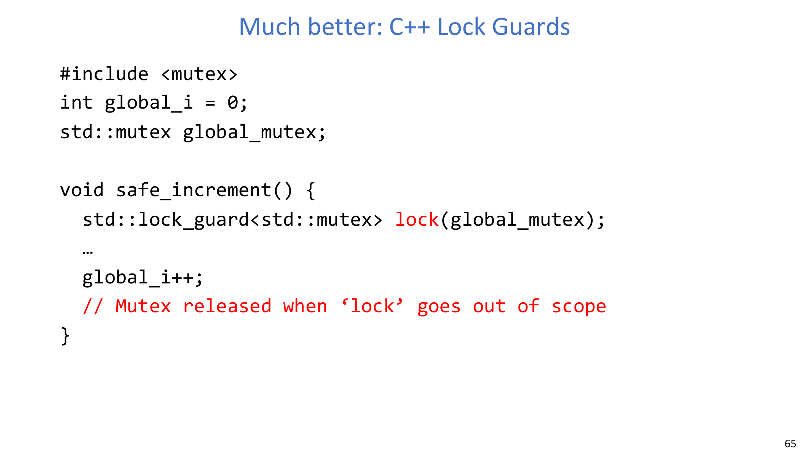

### 9.3 Python: `with lock` enforces scope-based release
In Python, `with lock:` acquires on block entry and releases automatically when leaving the block, regardless of normal return or exception.

### 9.4 Java: built-in monitor primitives
` synchronized` methods acquire the object lock on entry and release on exit, including exceptional exits.

Java monitor-related operations used in synchronized regions:
- `wait()` / `wait(long timeout)`
- `notify()` / `notifyAll()`

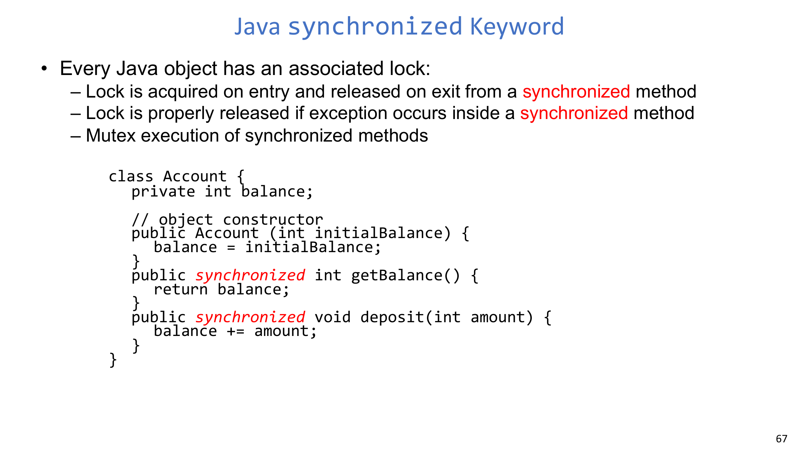

## 10. Beyond One Machine: Chubby Lock Service

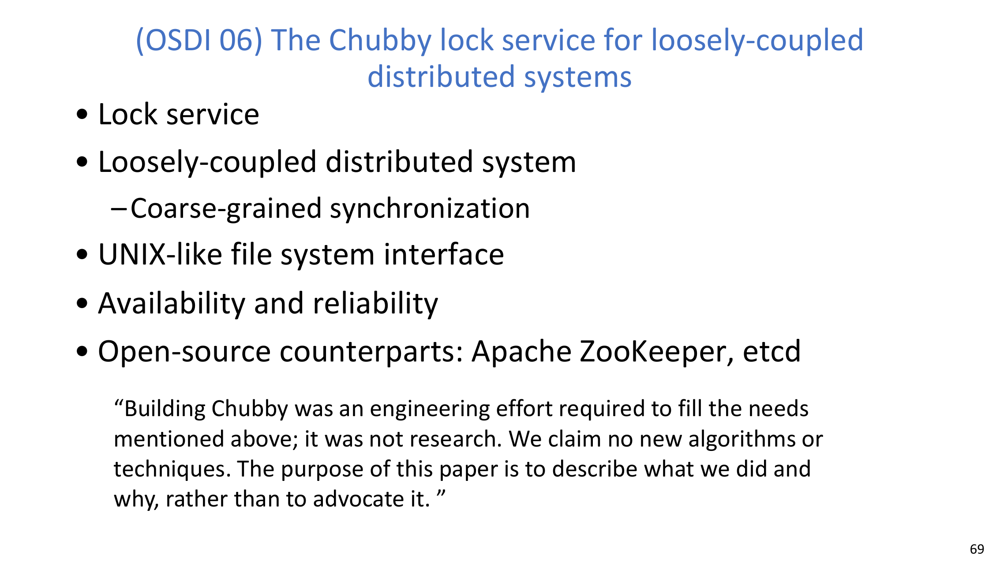

For loosely coupled distributed systems, lock management is often moved to a dedicated service (for example, Chubby, and later ZooKeeper/etcd-like systems). The design goal is coarse-grained coordination with strong availability and reliability.

## 11. Key Takeaways

- **Monitors are a lock plus one or more condition variables.**
- Readers/writers correctness depends on explicit admission policy, not just mutual exclusion.
- Writer-preference improves writer latency but can starve readers.
- `signal` vs `broadcast` is a performance and progress tradeoff, especially with mixed waiter classes.
- CV semantics cannot be replaced by naive semaphore `P/V` wrappers.
- Scope-based lock management (RAII / `with` / `synchronized`) is safer than manual unlock discipline.

## Appendix A. Exam Review

### A.1 Must-remember definitions
- **Readers can access database when no writers.**
- **Writers can access database when no readers or writers.**
- **Monitor: a lock plus one or more condition variables.**
- **Condition Variable: a queue of threads waiting for something inside a critical section.**

### A.2 Short-answer templates
1. Why can readers starve here?
   - Because entry test `AW + WW > 0` blocks new readers whenever any writer is queued.
2. Why does one-CV design often need `broadcast()`?
   - Because one `signal()` may wake a thread class that still cannot proceed.
3. Why is CV not equivalent to semaphore?
   - CV wakeups are ephemeral; semaphore increments persist as history.

### A.3 Process-tracing checklist
When tracing a readers/writers execution, always track:
- Which thread currently holds/just released lock.
- Predicate tested at each wait (`AW+WW` or `AW+AR`).
- Exact updates to `AR/WR/AW/WW` before and after sleeping.
- Whether wakeup used `signal` or `broadcast`, and which class was intended.

### A.4 Common mistakes
- Forgetting that this specific policy blocks new readers when writers are waiting.
- Using `if` instead of `while` around condition waits.
- Waking too many threads with unnecessary broadcasts.
- Assuming semaphore queue introspection is a safe primitive for monitor design.