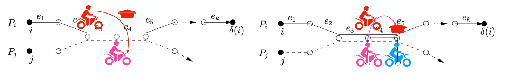
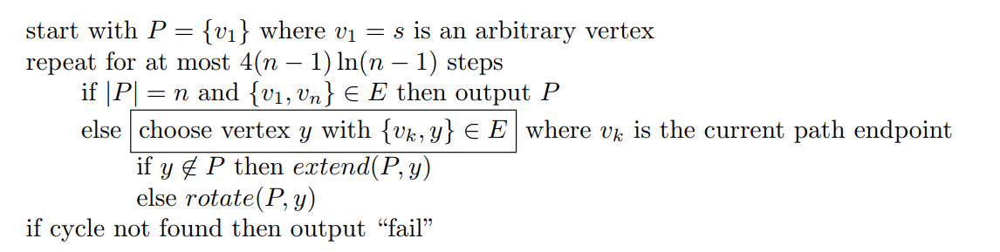
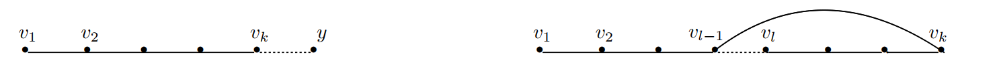

# Lecture 10 - 2024 / 3 / 20

### Randomized Routing

考虑 $n$ 维超立方体，网格的顶点为 $\{0, 1\}^n$，共 $N = 2^n$ 个，每条边双向，令 $\pi$ 是任意排列，目标是从每个 $i$ 发送一个数据包到对应的 $\pi(i)$，但是同一个条边每个时间只能有 $1$ 个数据包通过。

现在要设计一种路径规划算法，最小化最大传输时间。这里要求 $i$ 的路径只取决于 $i$ 和 $\pi(i)$ 我们称之为 *oblivious*，这是具备现实意义的。

**Theorem:** 对于任何确定性 oblivious 的路径规划算法，存在一种排列需要 $\Omega(\sqrt{N/n}) = \Omega(\sqrt{ 2^n / n } )$。

**Theorem:** 存在一种 oblivious 随机路径规划算法，w.h.p 在 $O(n)$ 步停止。

该算法的思路是“随机中转”，即对于每一个 $i$，等概率采样一个 $\delta(i)$，算法分为两个阶段

1. 从 $i \to \delta(i)$
2. 从 $\delta(i) \to \pi(i)$

在两个阶段中，都采用 bit-fixing 方式，例如 $x\to y$，就是从左到右逐位比较，如果 $x_i \ne y_i$，那么当前就从对应边前进。

> 不失一般性，我们只分析第 1 阶段的长度。
> 
> 用 $D(i)$ 表示 $i$ 在路径中等待的时间长短，那么总时长一定不超过 $n + \max_i D(i)$，我们接下来将证明 
> $$ \forall i, \Pr[D(i) > cn] \le e^{-2n} $$
>
> 根据 union bound，$\Pr[\exists i, D(i) > cn] \le 2^n e^{-2n} < 2^{-n}$

用 $P_i$ 表示 $i \to \delta(i)$ 的路径上所经过的点，用 $S_i = \{j \ne i \mid P_j \cap P_i \ne \varnothing\}$，也即路径相交的个数。直观上我们得到以下结论：

**Claim:** $D(i) \le |S(i)|$

> 证明的思路是“锅不能停”。
>
> 
> 
> 在等价意义下，至多只会被每个人阻碍一次，因此 $D(i) \le |S(i)| $。

**Lemma:** $ \forall i, \Pr[D(i) > cn] \le e^{-2n} $

> 定义 $H_{ij} = \begin{cases} 1 & P_i \cap P_j \ne \varnothing  \\ 0 & P_i \cap P_j = \varnothing\end{cases}$，从而 $D(i) \le \sum\limits_{j\ne i}H_{ij} = |S(i)|$。
>
> 对于图中每一条边，期望经过它的路径条数为 $\dfrac{Nn/2}{Nn} = \dfrac 1 2$，从而 $\mathbb E[|S(i)|] \le \dfrac n 2$，即路径长度乘每条边的期望路径个数。根据 Chernoff bound，有
> $$ \Pr[D(i) \ge (1 + \beta) \mu] \le \exp(-\frac{\beta^2}{2 + \beta} \mu )  $$
>
> 容易看出，当我们想分析一个固定的 tail 时，$\mu = \dfrac{n}{2}$ 一定是最坏的，取 $\beta = 6$，有 $\Pr[D(i) \ge \frac{7}{2} n] \le \exp(-\frac 9 4 n) \le \exp(-2n)$。

### Hamilton Cycles (1)

对于 $G = (V, E) \in \mathcal{G} (n, p)$，其中 $p \ge \dfrac{72 \ln n}{n - 1}$，则存在一个多项式时间的随机算法 w.h.p. 找到一个 Hamiltonian 圈。

算法的思想是利用 coupon collector，算法陈述如下

这里有 _extent_ 和 _rotate_ 两个函数，分别表示枚举到新端点 $v$ 时，若其之前还没出现 / 已经出现，现在应该如何操作

于是重点在于 _choose_ 这一步，我们需要保证的是从“观察者视角”，所有的 $V$ 中的点具有均等概率被选作下一个点。从而我们可以利用 coupon collector 的结论，期望在前 $2 n \ln n$ 步收集到所有点形成 Hamiltonian 路，后 $2 n \ln n$ 步枚举到与 $v_1$ 相邻的点，找到 Hamiltonian 圈。

严谨的来说，我们要保证
$$
\Pr_G[v \in V \text{ is next endpoint} \mid \text{Path history}] \text{ are the same}
$$

为了达到这一点，我们需要将边退化为有向边，以确保双向选择的独立性，对于 $(u, v) \in E$ 时，定义 $N(x)$ 为 $G'$ 中 $x$ 的邻居结点
$$
\begin{aligned}
\{ y \in N(x) \land x \in N(y) \} & \text{ w.p. } \dfrac p 4 \\
\{ y \notin N(x) \land x \in N(y) \} & \text{ w.p. } \dfrac 1 2 - \dfrac p 4 \\
\{ y \in N(x) \land x \notin N(y) \} & \text{ w.p. } \dfrac 1 2 -  \dfrac p 4 \\
\{ y \notin N(x) \land x \notin N(y) \} & \text{ w.p. } \dfrac p 4 \\
\end{aligned}
$$

我们将在实现 _choose_ 时从 $N(x)$ 中挑选邻居。定义 $\textit{OLD}(x) = \{ y \mid \textit{choose} \text{ picked } y \text{ when } x \text{ was endpoint}\}$，选点策略如下：

* 以 $\dfrac{|\textit{OLD}(x)|}{n - 1}$ 的概率，在 $\textit{OLD}(x)$ 中等概率随机挑选一个点。

* 以剩下的概率，在 $N(x) \backslash \textit{OLD}(x)$ 中等概率随机挑选一个点。

算法的正确性将在下一讲证明。