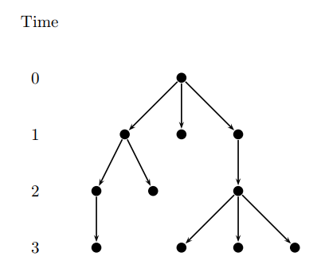
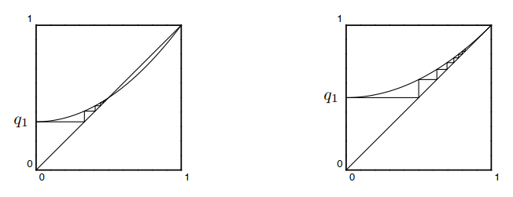

# Lecture 13 - 2025 / 3 / 31

### Power of 2 Choices (2)

TBD

### Galton-Watson Branching Process

设 $X$ 是一个非负整数 r.v.，$X$ 定义的分支过程从时间 $0$ 的一个单点开始，每次分支生成 $x \sim X$ 个儿子，并对每个儿子分别独立进行下去。

用 $Z_i$ 代表时间 $i$ 的结点数量，则 $Z_0 = 1$，将**灭绝**的概率定义为
$$ \Pr[\text{extinction}] = \lim_{n\to \infty} \Pr[Z_n = 0] $$

**Theorem:** 对于一个 $X$ 定义的分支过程，$\Pr[X = 1] < 1, \Pr[X = 0] > 0$，有
* 如果 $\mathbb E[X] \le 1$ 则 $\lim_{n \to \infty} \Pr[Z_n = 0] = 1$
* 如果 $\mathbb E[X] > 1$ 则 $\lim_{n \to \infty} \Pr[Z_n = 0] = p^* < 1$，其中 $p^*$ 是 $(0, 1)$ 之间的方程 $f(x) = x$ 的唯一解，
$$ f(x) = \sum_{i\ge 0}\Pr[X = i] x^i $$
 
> 设 $q_n$ 为时间 $n$ 灭绝的概率，即 $q_n = \Pr[Z_n = 0]$，其中 $q_0 = 0$，我们可以针对第 1 步分裂情况进行讨论，从而列出递推方程 $q_n = f(q_{n-1})$。
>
> 根据实际含义容易看出 $0 < q_1 \le q_2 \le q_3 \le \cdots \le 1$，也就是 $(q_n)$ 单调递增且有界，故必然收敛到 $q^* \le 1$。
>
> 
> 
> 注意到 $f(x)$ 是在 $[0, 1]$ 内的严格递增函数，且严格凸的函数，我们针对 $y=f(x)$ 和 $y = x$ 的关系进行讨论。注意 $\mathbb E[X] = f'(1)$。
> 
> * 对于第二种情况，因为 $\mathbb E[X] = f'(1) > 1$，所以 $y = f(x)$ 和 $y = x$ 第一次相交于 $a < 1$，根据左图 $q^* = a < 1$。
> * 对于第一种情况，因为 $\mathbb E[X] = f'(1) \le 1$，所以 $y = f(x)$ 和 $y = x$ 第一次相交于 $1$，根据右图 $q^* = 1$。
