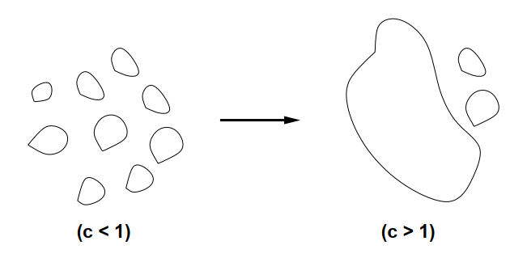

# Lecture 15 - 2025 / 4 / 10

### Giant Component (2)

**Theorem:** 对于 $G \in \mathcal G_{n, p}$，其中 $p = \dfrac c n$，$c > 1$ 是一个常数，则 a.a.s. $G$ 存在唯一一个最大的连通分支大小是 $\beta n(1 + o(1))$，其中 $\beta$ 是 $(0,1)$ 之间 $\beta + e^{-\beta c} = 1$ 的唯一解。其余的连通块大小都是 $O(\log n)$ 级别。

**Claim:** 对于所有结点 $v$，a.a.s 以下两者之一成立：
1. 从 $v$ 开始的 braching process 在 $k^-$ 步内停止。
2. $\forall k$ s.t. $k^- \le k \le k^+$，从 $v$ 开始的 branching process 在 $k$ 步后，至少有 $(c-1)k/2$ 个已探索但是没有饱和的结点。

对于后者，实际上只需要证明从 $v$ 开始总共至少探索到了
$$ \frac{(c-1)k}{2} + k = \frac{(c+1)k}{2} $$

个点。我们定义一个点 $v$ 是 _$k$-bad_ 的，如果从 $v$ 开始的 branching process 在 $k$ 步后停止或者探索到了少于 $(c+1)k/2$ 个点。

因此，当 $v$ 是 $k$-bad 时，从 $v$ 开始的 branching process 被每次展开服从 $\mathcal B\left(n - \dfrac{(c+1)k^+}{2}, \dfrac{c}{n}\right)$ 的过程支配（因为总共涉及到的点数不超过 $(c+1)k^+/2$，因此 $\mathcal B(n-?, p)$ 的 $?$ 处不高于这个值）。

进而从 $v$ 开始的 branching process 在 $k$ 步内展开的点数，不低于 $k$ 次采样 $\mathcal B\left(n - \dfrac{(c+1)k^+}{2}, \dfrac{c}{n}\right)$ 展开的点数。

「上面这一步并没有理解，如果 branching process 提前终止了，为什么还能 dominate 固定次数采样的求和？」

从而 a.a.s 从任何一个点 $v$ 开始的 branching process 要么在 $k^- = O(\log n)$ 轮终止，要么持续至少 $k^+ = n^{2/3}$ 轮。记前面的一类点是 _small_ 的，后面的一类是 _large_ 的。

**Lemma:** a.a.s. 存在唯一的一个连通块，包含了所有 large 点。

> 考虑两个 large 的 $u \ne v$。分别从 $u, v$ 独立进行 branching process，则在 $k^+$ 轮后，两者已探索未饱和的点分别记作 $U(u), U(v)$，则这两个集合大小都 $\ge \dfrac{c-1}{2} k^+$。
>
> 如果前 $k^+$ 步已经遇到公共点了，则 $u, v$ 已连通。否则我们证明 w.h.p. $U(u), U(v)$ 之间有边。
$$ 
\begin{aligned}
\Pr[\nexists\text{edge between } U(u), U(v)] & \le 
(1 - p)^{(\frac{c-1}{2}k^+)^2}\\
& \le \exp\left( -p \left(\frac{c-1}{2}k^+\right)^2 \right)\\
& \le \exp\left( -\frac{c(c-1)^2}{4} n^{1/3} \right)\\
& = o(n^{-2})
\end{aligned}
$$
>
> 从而对所有 $u, v$ 进行 union bound 立刻得到总概率是 $o(1)$。

至此已经证明了最大连通块的唯一性，以及所有小连通块都是 $O(\log n)$，只剩下判断最大连通块的大小了。我们通过对 small 点计数来证明此。

**Lemma:** a.a.s. small 点的个数是 $(1 + o(1)) (1 - \beta) n$。

根据 small 点的定义，可以知道 $\Pr[v \text{ is small}]$：
* $(\ge)$ 服从 $\mathcal B(n, c/n)$ 的 branching process 在 $k^-$ 步内终止的概率。
  这是因为利用 $\mathcal B(n-\cdots, p) \le \mathcal B(n, p)$，展出的点变多，终止概率变低。
* $(\le)$ 服从 $\mathcal B(n-k^-, c/n)$ 的 branching process 在 $k^-$ 步内终止的概率。
  这是因为 small 的点总共展出了 $\le k^-$ 个点，所以 $\mathcal B(n-\cdots, p) \ge \mathcal B(n - k^-, p)$，展出的点变少，终止概率增大。

更进一步，用 $d(n,p)$ 表示服从 $\mathcal B(n, p)$ 的 branching process 终止的概率：
* $(\ge)$ 根据 claim，我们知道 w.h.p. 如果不在 $k^-$ 步终止，则最终不会终止，故下界为 $d(n, c/n) + o(1)$。
* $(\le)$ 不限制终止步数，终止概率自然增大，故上界为 $d(n-k^-, c/n)$。

> 当 $n \to +\infty$ 时，根据泊松分布的结论，$d(n, c/n) \to 1 - \beta$，其中 $\beta$ 是 $(0, 1)$ 之间 $\beta + e^{-\beta c} = 1$ 的解。同时因为 $k^- \ll n$，所以 $d(n - k^-, c / n) \to 1 - \beta$。根据 sandwiching 定理，可以知道
$$ \Pr[v \text{ is small}] \to 1 - \beta =: \alpha $$
>
> 用 $Z = \sum_v Z_v$ 代表 small 点的个数，我们通过 Chebyshev 给 $Z$ 一个 concentration bound。则 $\mathbb E[Z_v] \to \alpha, \mathbb E[Z]  = (1 + o(1)) \alpha n$。
$$ 
\begin{aligned}
\mathbb E[Z^2] & = \mathbb E[Z] + \sum_{u \ne v} \mathbb E[Z_u Z_v]\\
& = \mathbb E[Z] + \sum_{v} \Pr[v \text{ is small}] \sum_{u \ne v} \Pr[u \text{ is small} \mid v \text{ is small}]
\end{aligned}
$$
>
> 对于最后一个 $\sum$，可以拆分为 $u$ 和 $v$ 在同一连通块、$u$ 和 $v$ 在不同连通块的两类分别计数。
> * 和 $v$ 在同一连通块的 $u$ 不超过 $k^-$ 个
> * 和 $v$ 在不同连通块的任何一个 $u$ 满足
$$\begin{aligned}
& \Pr[u \text{ is small} \mid v \text{ is small}]\\
=\  &  \Pr[u \text{ is small in } \mathcal G(n-|\text{Comp}(v)|, p) ]\\
\le\  & \Pr[u \text{ is small in } \mathcal G(n-k^-, p) ]\\
\le\  & d(n-k^-, c/n) \sim d(n, c/n) \to \alpha
\end{aligned}$$
>
> 从而 $\mathbb E[Z^2] \le \mathbb E[Z] + n(\alpha + o(1))(k^- + n(\alpha+o(1))) \sim \mathbb E[Z]+  n^2 \alpha^2(1 + o(1)) = \mathbb E[Z]^2 (1 + o(1))$。
>
> 从而根据 Chebyshev 不等式 
$$ \Pr[|Z - \mathbb E[Z]| > \gamma \mathbb E[Z]] \le \frac{1}{\gamma^2} \left(\frac{\mathbb E[Z^2]}{\mathbb E[Z]^2} - 1\right) = \frac{1}{\gamma^2} o(1) $$
>
> 只需取 $\gamma = o(1)$ 但下降足够缓慢，则上式昭示了 a.a.s. 最大连通分支大小是 $(1 + o(1)) \beta n$。

综合以上两个 Lemma，原 Theorem 得证。